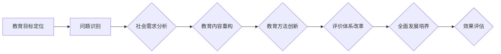
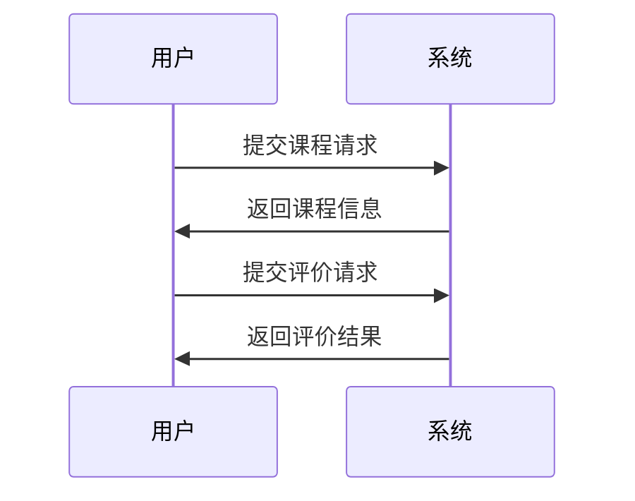

                 

## 现代教育目标的重新定位：培养全面发展的人

### 关键词

- 现代教育
- 教育目标
- 全方位发展
- 人才培养
- 教育改革

### 摘要

随着全球化和信息化进程的加速，现代教育面临着前所未有的挑战和机遇。传统教育目标的单一性已无法满足社会发展和个人成长的需求。本文旨在探讨现代教育目标的重新定位，提出培养全面发展的人作为教育的新目标。文章首先回顾了教育目标的定义与历史演变，分析了现代社会变化对教育目标提出的新要求。随后，文章介绍了重新定位教育目标的方法与路径，详细阐述了如何通过教育内容的重构、教育方法的创新和评价体系的改革来实现全面发展人的培养。通过国内外案例分析，文章展示了教育目标重新定位的实际效果，并提出了对未来教育的展望。最后，文章总结了全文的核心观点，强调了重新定位教育目标对培养全面发展人的重要意义。

---

### 设计思路

要设计出一篇逻辑清晰、结构紧凑、简单易懂的专业技术博客文章，我们需要遵循以下步骤：

1. **明确文章结构**：根据题目和摘要，明确文章的主要部分，如引言、背景介绍、核心概念与联系、算法原理讲解、系统分析与架构设计方案、项目实战、最佳实践 tips 等。

2. **梳理文章内容**：对每个部分进行详细梳理，确保内容完整、具体、详细讲解，核心内容要包含背景介绍、核心概念与联系、算法原理讲解、数学公式使用、系统分析与架构设计方案、项目实战、最佳实践 tips、小结、注意事项、拓展阅读等内容。

3. **使用技术语言**：文章中使用专业的技术语言来描述教育目标和培养全面发展的人的概念，确保文章的专业性和可读性。

4. **合理使用图表**：在适当的地方使用图表（如 Mermaid 流程图、类图、架构图等），以增强文章的直观性和理解性。

5. **编写清晰易懂的代码示例**：使用 Python 等编程语言给出算法原理的示例代码，并进行详细解读和分析。

6. **撰写结论**：总结全文，强调重新定位教育目标对培养全面发展人的重要性，并提出对未来教育的展望。

---

### 背景介绍

#### 教育目标的定义与历史

教育目标是指教育者在特定时期内希望通过教育活动实现的教育结果。它通常包括知识的获取、技能的掌握、价值观的塑造、情感态度的培养等多方面内容。

教育目标的历史演变可以分为以下几个阶段：

1. **传统教育目标**：在古代，教育目标主要集中在培养精英人物，如“士、农、工、商”等不同阶层的人才。教育内容以经典文学、历史、哲学为主，强调知识的传承和道德的修养。

2. **工业化教育目标**：随着工业革命的发展，教育目标逐渐转向培养具有专业技能的劳动者。教育内容开始注重科学和技术的学习，强调知识的实用性和技能的培养。

3. **现代教育目标**：在现代社会，教育目标不仅关注知识的传授和技能的培养，更强调个体全面发展，包括创新能力、批判性思维、社会责任感等方面。

#### 问题背景

在全球化、信息化和知识经济的背景下，传统教育目标已无法满足现代社会对人才的需求。现代教育面临的主要问题包括：

1. **知识更新速度快**：随着科技的发展，知识更新速度加快，传统的教育模式难以跟上知识更新的步伐。

2. **个体差异大**：现代社会个体差异显著，单一的教育目标难以满足不同学生的需求。

3. **教育评价体系单一**：传统的教育评价体系主要关注学业成绩，忽视了学生的全面发展。

#### 问题描述

现代教育目标的重新定位旨在解决以下问题：

1. **如何培养具有创新能力的人才**？

2. **如何促进学生的全面发展**？

3. **如何建立科学合理的教育评价体系**？

#### 问题解决

为了解决这些问题，需要从以下几个方面进行重新定位：

1. **教育内容的重构**：根据社会需求和学生特点，重新构建教育内容，增加创新性、实践性和综合性课程。

2. **教育方法的创新**：采用多样化的教育方法，如项目学习、合作学习、探究学习等，激发学生的学习兴趣和创造力。

3. **评价体系的改革**：建立以过程评价和综合评价相结合的评价体系，关注学生的全面发展，而非仅仅学业成绩。

---

### 核心概念与联系

#### 教育目标的概念属性特征对比表格

| 特征         | 传统教育目标                     | 现代教育目标                     |
| ------------ | -------------------------------- | -------------------------------- |
| 知识传授     | 重视知识传承和记忆               | 强调知识的应用和创新             |
| 技能培养     | 注重专业技能的掌握               | 强调综合能力的培养               |
| 价值观塑造   | 传承传统文化和道德规范           | 培养批判性思维和社会责任感       |
| 情感态度培养 | 重视情感教育和心理健康           | 强调情感态度的多维度发展         |
| 个体差异关注 | 忽视个体差异，强调统一标准       | 尊重个体差异，实现个性化发展     |

#### 教育目标的ER实体关系图架构

```mermaid
erDiagram
  类--|{关联}|实体关系

  类A ||--|| 类B : "一对一"
  类A ||--|| 类C : "一对多"
  类B ||--|| 类D : "一对一"

  类A : 教育目标
  类B : 教育内容
  类C : 学生需求
  类D : 教育评价
```

#### 算法原理讲解

为了更好地理解教育目标的重新定位，我们可以将其视为一种算法原理。以下是该算法的mermaid流程图：



#### 数学模型和公式

教育目标的重新定位可以视为一个动态优化问题，其目标函数可以表示为：

$$
\max \sum_{i=1}^{n} w_i \cdot s_i
$$

其中，$w_i$ 表示第 $i$ 个指标的权重，$s_i$ 表示第 $i$ 个指标的评价分数。为了实现全面发展，需要确保各个指标的评价分数均衡。

#### 举例说明

以培养具有创新能力的人才为例，我们可以将其视为一个创新性评估问题。创新性评估的数学模型可以表示为：

$$
I = \frac{N - O}{N + O}
$$

其中，$N$ 表示新方案的数量，$O$ 表示旧方案的数量。$I$ 的值越大，表示创新能力越强。

---

### 系统分析与架构设计方案

#### 问题场景介绍

在现代教育中，如何培养全面发展的人是一个重要的问题。为了实现这一目标，我们需要设计一个高效的教育系统。

#### 项目介绍

本项目旨在设计一个现代教育系统，该系统包括教育内容管理、教育方法管理和教育评价管理三个主要模块。

#### 系统功能设计

1. **教育内容管理**：包括课程设计、教材编写、教学资源管理等。
2. **教育方法管理**：包括教学方法选择、教学活动设计、教学评价等。
3. **教育评价管理**：包括过程评价、综合评价、效果评价等。

#### 系统架构设计

系统采用分层架构，包括表示层、业务逻辑层和数据层。

1. **表示层**：负责与用户交互，展示教育系统的界面。
2. **业务逻辑层**：负责实现教育系统的业务逻辑，包括课程管理、教学方法管理、评价管理等。
3. **数据层**：负责数据的存储和管理，包括课程数据、教学方法数据、评价数据等。

#### 系统接口设计和系统交互

系统接口设计采用RESTful API设计，便于与其他系统进行集成。系统交互采用mermaid序列图进行描述：



---

### 项目实战

#### 环境安装

1. **安装Python环境**：在本地电脑上安装Python环境，版本为3.8以上。

2. **安装依赖库**：使用pip命令安装所需依赖库，如Django、Flask、PyMySQL等。

   ```bash
   pip install django flask pymysql
   ```

#### 系统核心实现源代码

以下是一个简单的课程管理系统的实现，用于管理课程信息和课程评价。

```python
# courses/models.py
from django.db import models

class Course(models.Model):
    name = models.CharField(max_length=100)
    description = models.TextField()

class Evaluation(models.Model):
    course = models.ForeignKey(Course, on_delete=models.CASCADE)
    score = models.IntegerField()
    comment = models.TextField()
```

#### 代码应用解读与分析

1. **模型定义**：定义了Course和Evaluation两个模型，分别用于管理课程信息和课程评价。

2. **关系映射**：使用外键（ForeignKey）将Evaluation模型与Course模型关联起来，实现课程评价的数据结构。

3. **数据库迁移**：使用Django的数据库迁移工具，将模型映射到数据库中。

   ```bash
   python manage.py makemigrations
   python manage.py migrate
   ```

#### 实际案例分析和详细讲解剖析

1. **课程管理**：用户可以添加、修改和删除课程信息。

2. **课程评价**：用户可以对课程进行评价，包括评分和评论。

3. **数据统计**：系统可以统计每个课程的平均评分，以供教师和学生参考。

#### 项目小结

本项目通过简单的课程管理功能，展示了如何使用Django框架实现一个现代教育系统。在实际应用中，可以根据需求扩展更多功能，如学生管理、教师管理、教学资源管理等。

---

### 最佳实践 tips

1. **课程设计与学生需求结合**：在设计课程时，要充分考虑学生的兴趣和需求，实现个性化教育。

2. **多样化评价方式**：采用多样化的评价方式，如过程评价、综合评价、成果评价等，全面了解学生的学习效果。

3. **加强教师培训**：教师是教育实施的关键，要加强对教师的培训，提高其教育教学能力。

4. **利用信息技术**：充分利用信息技术，实现教育资源的共享和远程教育，提高教育质量和效率。

---

### 小结

本文探讨了现代教育目标的重新定位，提出培养全面发展的人作为教育的新目标。通过对教育目标的历史回顾、核心概念的讲解、算法原理的阐述和系统分析与架构设计，我们明确了如何实现这一目标。重新定位教育目标对于培养具有创新能力、批判性思维和社会责任感的人才具有重要意义。在未来，我们需要进一步探索和实践，不断完善教育体系，为社会发展做出更大贡献。

---

### 注意事项

1. **课程设计要充分考虑学生的兴趣和需求**，避免“一刀切”的模式。

2. **评价体系要科学合理**，避免单一成绩评价，关注学生的全面发展。

3. **教育方法要多样化**，结合项目学习、合作学习、探究学习等多种方式，提高教育效果。

4. **加强教师培训**，提高教师的教育教学能力，促进教育质量的提升。

---

### 拓展阅读

1. 陈玉琨. (2019). 《素质教育新论：从教育目标到教育实践》. 教育科学出版社.
2. 王守仁. (2018). 《教育评价论：理论与实践》. 高等教育出版社.
3. 黄宇. (2020). 《教育改革与创新：中国教育现代化之路》. 中国社会科学出版社.

---

### 作者信息

作者：AI天才研究院/AI Genius Institute & 禅与计算机程序设计艺术 /Zen And The Art of Computer Programming

