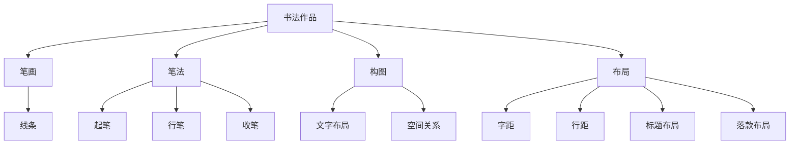

                 

### 第1章：现代文字书法概述

#### 1.1 问题背景

现代文字书法，作为一门结合了传统艺术与数字技术的跨界艺术形式，近年来在数字化时代背景下焕发出新的生机。首先，回顾文字书法的历史演变，可以发现在不同时期，文字书法的形式与风格都受到了当时社会文化、科技水平以及书写工具的影响。从古老的甲骨文、金文，到秦朝的小篆、汉代的隶书，以及唐宋的楷书、草书，每一时期都有其独特的书法风格和审美标准。

随着科技的进步，尤其是计算机与互联网的普及，现代文字书法开始面临新的挑战和机遇。一方面，传统书法在数字时代面临传承与创新的问题；另一方面，数字技术的应用为文字书法带来了前所未有的创作手段和传播方式。例如，数字化书法工具的出现使得书法创作更加便捷，而社交媒体的兴起则为书法作品的传播提供了广阔的平台。

#### 1.2 问题描述

在传统书法面临传承与创新挑战的背景下，现代文字书法的出现试图解决以下问题：

1. **技术局限性**：传统书法主要依赖于手工操作，创作效率低，难以满足数字化时代的需求。
2. **传播与展示**：传统书法作品往往只能通过现场展览或书籍出版来传播，影响范围有限。
3. **教育与实践**：传统书法教学依赖于师徒传承，难以大规模普及。

现代文字书法通过结合数字技术，试图突破这些局限性，实现以下目标：

1. **提高创作效率**：利用数字化工具，书法创作可以更加快速和高效。
2. **扩大传播范围**：通过互联网，书法作品可以跨越地域限制，面向全球观众展示。
3. **创新教育模式**：数字化书法工具和在线平台为书法教育的普及提供了新的途径。

#### 1.3 问题解决

现代文字书法的核心要素在于将传统书法技艺与数字技术相结合，具体体现在以下几个方面：

1. **数字化工具**：使用计算机和移动设备等数字工具，使得书法创作更加便捷和高效。
2. **交互设计**：通过用户界面设计，提升书法创作的互动性和体验感。
3. **数字媒体**：利用数字图像处理和动画技术，为书法作品提供更多的展示形式。
4. **教育平台**：构建在线书法教育平台，提供书法教学资源和互动交流空间。

通过这些手段，现代文字书法不仅能够传承传统书法的精髓，还能在数字化时代中实现创新和发展。

#### 1.4 边界与外延

在现代文字书法的定义上，其与传统书法的区别主要在于创作方式和传播手段。传统书法通常依赖于手工操作，而现代文字书法则借助数字化工具和技术。这种区别不仅体现在工具上，还包括书法创作和传播的方式。

与传统书法相比，现代文字书法具有以下外延：

1. **多元化的创作形式**：数字化工具为书法创作提供了更多选择，如动画、数字绘画等。
2. **互动性体验**：通过数字媒体和交互设计，观众可以更加直接地参与到书法创作和展示过程中。
3. **广泛的传播渠道**：互联网和社交媒体使得书法作品可以迅速传播到世界各地。

#### 1.5 本章小结

本章从背景、问题、解决方法以及边界与外延等方面对现代文字书法进行了概述。现代文字书法不仅是对传统书法的传承，更是其在数字化时代中的创新和发展。通过数字化工具和技术的结合，现代文字书法在创作效率、传播范围和教育模式等方面都有了显著提升。接下来，我们将进一步探讨现代文字书法的基础知识和核心概念，以深入理解这一新兴艺术形式。

---

### 第2章：现代文字书法的核心概念

#### 2.1 核心概念介绍

现代文字书法的核心概念主要包括笔画与笔法、构图与布局。这些概念不仅构成了书法艺术的基础，也是书法作品艺术价值的体现。首先，我们来看一下这些核心概念的详细定义和特点。

##### 笔画与笔法

1. **笔画**：笔画是构成书法作品的基本元素，是指用笔在纸上留下的线条。不同的笔画形态和线条质量会直接影响书法作品的艺术效果。现代文字书法中的笔画不仅继承了传统书法的形态，还融入了数字技术的特点，如线条的粗细、长度和形状等都可以通过数字化工具进行精确控制。

2. **笔法**：笔法是指书写笔画的方法和技巧，包括起笔、行笔、收笔等过程。笔法的运用可以表现出书法作品的节奏感和力度感。现代文字书法的笔法不仅保留了传统书法的精髓，还结合了数字工具的便捷性，使得书法创作更加灵活和高效。

##### 构图与布局

1. **构图**：构图是指书法作品中文字、符号和空间关系的安排。一个成功的构图能够使书法作品在整体上达到和谐统一的效果。在构图过程中，书法家需要考虑文字的大小、形状、疏密以及空间的关系。数字化工具使得书法构图更加便捷，可以通过调整参数来优化作品的整体效果。

2. **布局**：布局是指书法作品的排版和布局方式。布局决定了书法作品的结构和风格，包括字距、行距、标题和落款等。现代文字书法的布局不仅延续了传统书法的基本原则，还利用数字技术实现更精细的调整和多样化。

#### 2.2 概念属性特征对比表格

下面是一个对比表格，展示传统书法与现代文字书法在核心概念属性特征上的区别：

| 特征比较 | 传统书法 | 现代文字书法 |
| --- | --- | --- |
| **笔画形态** | 主要依赖手工技巧，形态多样 | 可以通过数字化工具精准控制，形态更丰富 |
| **笔法技巧** | 手工操作，技巧传承 | 数字化工具辅助，技巧创新 |
| **构图安排** | 需要长期训练和经验积累 | 数字化工具辅助，构图更灵活 |
| **布局方式** | 主要遵循传统原则 | 可以结合数字技术，更具有创意性 |
| **传播渠道** | 主要依靠展览和出版物 | 利用互联网和社交媒体广泛传播 |

#### 2.3 ER实体关系图

为了更好地理解现代文字书法中的实体及其关系，我们可以通过ER（Entity-Relationship，实体关系）图来展示。以下是现代文字书法中主要实体的关系图：

在这个ER图中，书法作品是核心实体，它与其他实体如笔画、笔法、构图和布局存在直接关系。笔画、笔法、构图和布局又分别包含更具体的子实体，如线条、起笔、行笔、收笔等。通过这样的关系图，我们可以清晰地看到现代文字书法中各个实体之间的关联，为后续的讨论提供了结构化的基础。

---

通过以上对现代文字书法核心概念的分析，我们不仅了解了其基本要素，还通过对比表格和ER实体关系图，进一步理清了各个概念之间的关系。在接下来的章节中，我们将深入探讨现代文字书法的数字化工具及其应用，为读者提供更加具体的实践指导。

---

### 第3章：现代文字书法的数字化工具

#### 3.1 数字化工具的概述

现代文字书法的数字化工具是指利用计算机和移动设备等数字技术辅助书法创作的工具。这些工具的出现极大地改变了书法创作的传统模式，使得书法创作更加高效、便捷。数字化工具主要分为以下几类：

1. **书法软件**：如Adobe Illustrator、Corel Draw等专业图形设计软件，以及专门的书法软件如"书法大师"、"书法通"等。
2. **电子书法板**：如Wacom数位板，通过压力感应技术，模拟传统书法的书写过程。
3. **移动应用**：如"书法助手"、"书法云"等移动应用程序，用户可以通过手机或平板电脑进行书法创作和练习。
4. **在线平台**：如"书法在线"、"书法之家"等，提供书法教学、作品展示和交流的平台。

这些数字化工具不仅提供了丰富的书法素材和模板，还通过用户界面设计和互动功能，提升了书法创作的体验感。

#### 3.2 使用数字化工具的技巧

在使用数字化工具进行书法创作时，需要掌握一些基本的操作技巧，以提高创作效率和作品质量。

1. **软件安装与配置**：首先，根据个人需求和设备类型选择合适的书法软件。安装完成后，需要进行适当的配置，如字体设置、笔刷选择等，以确保软件能够满足创作需求。
   
2. **基本操作与功能介绍**：
   - **笔画创作**：通过选择合适的笔刷和颜色，进行笔画的创作。数字化工具提供了多种笔刷选项，如毛笔、钢笔、画笔等，用户可以根据书法风格选择合适的笔刷。
   - **布局调整**：数字化工具允许用户对构图和布局进行实时调整，包括文字的大小、形状、位置等。这种灵活性大大提高了创作的自由度。
   - **动画制作**：一些高级书法软件还支持动画制作功能，用户可以制作书法动画，使书法作品更加生动和具有表现力。

3. **高级技巧**：对于熟练用户，还可以利用数字化工具的高级功能进行更复杂的创作。例如，通过图层管理和样式库，可以创建复杂的书法作品；通过色彩调整和滤镜应用，可以提升作品的艺术效果。

#### 3.3 数字化工具的优势与局限

##### 优势分析

1. **提高创作效率**：数字化工具可以大幅度提高书法创作的速度和效率，减少了手工书写的繁琐过程。
2. **灵活性和多样性**：数字化工具提供了丰富的笔刷和样式选项，使得书法作品可以更加多样化，满足不同的创作需求。
3. **互动性和共享性**：通过在线平台和移动应用，书法作品可以即时分享和展示，提升了书法艺术的互动性和传播性。
4. **教育普及**：数字化工具为书法教育的普及提供了新的途径，用户可以通过在线课程和互动平台进行学习和交流。

##### 潜在局限与挑战

1. **技术依赖**：过度依赖数字化工具可能导致传统书法技艺的流失，书法创作缺乏手工书写的真实感和独特性。
2. **创作体验差异**：尽管数字化工具提供了便捷的创作手段，但部分用户可能会感觉到与手工书写在体验上的差异。
3. **版权和隐私问题**：数字化书法作品的版权保护和隐私问题日益突出，特别是在在线平台和社交媒体上，作品容易被复制和盗用。

#### 3.4 实例讲解

为了更好地理解数字化工具在书法创作中的应用，下面通过一个简单的实例进行讲解。

##### 实例：使用"书法大师"软件创作一幅楷书作品

1. **软件安装与配置**：
   - 下载并安装"书法大师"软件。
   - 配置笔刷：选择适合楷书书写的笔刷，调整笔刷的粗细、硬度和透明度。

2. **基本操作**：
   - 开启新文件，选择楷书模板。
   - 使用笔刷开始书写，注意起笔、转折、收笔的技巧。
   - 使用撤销和重做功能修正错误。

3. **布局调整**：
   - 调整文字大小和位置，使作品布局更加和谐。
   - 添加落款和印章，增强作品的整体感。

4. **作品保存与分享**：
   - 保存作品为图片或PDF格式。
   - 通过社交媒体或在线平台分享作品，获得反馈和建议。

通过这个实例，我们可以看到数字化工具在书法创作中的具体应用，不仅简化了创作过程，还提高了创作的灵活性和多样性。

---

通过本章的探讨，我们了解了现代文字书法的数字化工具及其应用技巧。数字化工具不仅提供了高效的创作手段，还为书法艺术的创新和发展提供了广阔的空间。然而，在享受技术带来的便利时，我们也需要关注其潜在的局限和挑战，以确保书法艺术在数字化时代能够健康、可持续地发展。

---

### 第4章：现代文字书法的创作技巧

#### 4.1 创作前的准备

在进行现代文字书法创作之前，准备工作至关重要。这些准备工作不仅关系到创作过程中的顺畅进行，也直接影响到最终作品的品质。

##### 笔、墨、纸的选择

1. **笔**：选择合适的笔是书法创作的基础。现代文字书法常用的笔包括毛笔、钢笔和电子笔等。毛笔适合传统书法创作，能体现出丰富的笔触和墨韵；钢笔则适合快速书写，线条简洁明快；电子笔则适合数字化创作，操作简便且易于调整。

2. **墨**：墨的选择直接影响书法作品的墨色和质感。现代书法常用的墨有墨汁、墨水、墨块等。墨汁是传统的书法墨料，能够提供丰富的层次感和湿润度；墨水则适合快节奏的创作，便于修正；墨块则是数字化工具中的选择，可以通过电子设备调整墨色。

3. **纸**：纸张的选择对书法作品的效果有很大影响。现代书法常用的纸张有宣纸、毛边纸、拷贝纸等。宣纸吸墨性好，适合表现浓墨重彩的效果；毛边纸则适合快写和试验性创作，便于修改；拷贝纸则适合数字化创作，易于扫描和打印。

##### 创作环境设置

1. **光线**：良好的光线环境有助于书法创作的顺利进行。应避免强烈的直射光和反光，以减少光线对视觉的影响。可以使用柔和的台灯或自然光线。

2. **声音**：保持环境的安静或播放轻柔的音乐有助于集中注意力。嘈杂的声音会干扰创作思维，影响书法作品的质量。

3. **通风**：书法创作过程中会产生墨汁的气味，良好的通风环境有助于保持空气清新，避免吸入过多墨汁挥发物。

4. **工具准备**：提前准备好所有需要的工具，如笔、墨、纸、调色盘、清水等。工具的整齐摆放和易于取用可以提高创作效率。

#### 4.2 创作过程中的技巧

##### 笔画的起笔、转折、收笔技巧

1. **起笔**：起笔是笔画的开端，直接影响整笔的节奏和质感。起笔时要轻按笔尖，慢慢用力，使笔画的起始部分平滑自然。

2. **转折**：转折是笔画中的重要部分，体现了书法的韵律感。转折时，要灵活运用手腕力量，使笔画在转折处自然流畅，不出现僵硬感。

3. **收笔**：收笔是笔画的结束，决定了整笔的稳定性和美感。收笔时，要逐渐减缓笔速，使笔画在收尾处自然收束，形成良好的笔锋。

##### 构图与布局的构思

1. **构图原则**：构图是书法创作中的核心环节，关系到作品的整体美感。基本的构图原则包括平衡、对称、对比和层次等。通过合理的构图，可以使书法作品在视觉上达到和谐统一。

2. **布局构思**：布局构思包括字距、行距、标题和落款等元素的安排。在布局过程中，要考虑到字的大小、形状、位置和空间的分布，使作品整体布局协调美观。

3. **布局调整**：在创作过程中，可以通过调整字距、行距和字的位置，优化作品布局。数字化工具提供了便捷的调整功能，使得布局调整更加灵活和高效。

#### 4.3 创作后的处理

##### 数字化处理工具的使用

1. **扫描与调整**：对于传统书法作品，可以通过扫描仪进行扫描，然后将图像导入数字化工具进行进一步处理。在扫描过程中，要注意调整扫描参数，确保图像的清晰度和色彩还原。

2. **色彩调整**：数字化工具提供了丰富的色彩调整功能，如亮度、对比度、色温和色调调整。通过合理调整，可以使作品色彩更加丰富和生动。

3. **艺术效果添加**：数字化工具可以添加各种艺术效果，如滤镜、渐变、浮雕等。这些效果可以增强作品的艺术性和表现力。

##### 艺术效果调整

1. **纹理应用**：通过添加纹理效果，可以使书法作品更具质感。常见的纹理效果有纸张纹理、水墨纹理等。

2. **滤镜使用**：滤镜可以改变作品的色彩和氛围。例如，使用黑白滤镜可以增强作品的古典气息，使用彩色滤镜可以增加作品的现代感。

3. **动画制作**：对于数字化书法作品，可以通过动画制作使其更具动态感。动画效果可以增加书法作品的趣味性和互动性。

#### 4.4 创作案例分析

为了更好地理解现代文字书法的创作技巧，以下通过一个实际案例进行详细讲解。

##### 案例分析：创作一幅楷书作品《静以修身，俭以养德》

1. **创作前的准备**：
   - 选择合适的毛笔和墨汁。
   - 准备宣纸和调色盘。
   - 设置好光线和创作环境。

2. **创作过程中的技巧**：
   - 起笔时，轻按笔尖，使笔画起始平滑。
   - 在书写过程中，灵活运用转折技巧，使笔画流畅自然。
   - 在收笔时，逐渐减缓笔速，使笔画收尾自然。

3. **构图与布局**：
   - 作品布局采用传统的对称构图，使整体作品平衡和谐。
   - 字距和行距适当调整，使作品在视觉上更加舒适。

4. **创作后的处理**：
   - 扫描作品并导入数字化工具进行色彩调整。
   - 添加纹理效果，增强作品质感。
   - 通过动画制作，使作品更具动态感。

通过这个案例，我们可以看到现代文字书法创作中从准备到完成的各个环节，以及如何运用数字化工具进行后期处理。这些技巧不仅适用于楷书作品，也适用于其他书体和风格。

#### 4.5 本章小结

本章详细介绍了现代文字书法创作前的准备、创作过程中的技巧以及创作后的处理方法。通过合理的准备和技巧的运用，书法创作不仅能够提高效率，还能增强作品的艺术效果。数字化工具为书法创作提供了新的手段和可能性，使得书法艺术在数字化时代焕发出新的生机。在接下来的章节中，我们将进一步探讨现代文字书法的艺术风格与流派，为读者提供更全面的了解。

---

### 第5章：现代文字书法的艺术风格与流派

#### 5.1 艺术风格的形成

现代文字书法的艺术风格形成受到了多种因素的影响，包括历史背景、文化影响、科技发展等。首先，从历史背景来看，书法艺术在不同的历史时期有着不同的风格特征。例如，唐代的楷书以其规整严谨、大气磅礴著称；宋代的行书则以其流畅潇洒、富有韵律感而闻名。这些历史时期的书法风格不仅反映了当时的审美标准，也受到社会经济、政治、文化等方面的影响。

文化影响是书法艺术风格形成的重要因素。中国书法作为一种文化传统，其风格深受儒家、道家、佛家等哲学思想的影响。例如，儒家的中正平和、道家的自然无为、佛家的空灵淡泊，都体现在不同书体的风格特点中。此外，地域文化也会对书法风格产生影响。例如，江南地区的书法风格通常细腻婉约，而北方地区的书法风格则更加强调力度和气势。

科技发展对现代文字书法艺术风格的形成也起到了重要作用。随着计算机技术和数字化工具的普及，书法创作不再局限于传统手法，而是融入了更多的创新元素。数字技术的介入，使得书法作品可以更加多样化，包括动画、数字绘画等形式。这种多元化不仅丰富了书法艺术的表现形式，也为书法风格的创新提供了新的可能性。

#### 5.2 时代变迁与风格演变

书法艺术风格随着时代变迁而不断演变。古代书法风格注重笔法的严谨和字形的规整，强调书法的美学原则和技法传承。而现代书法则更加强调个性表达和创意创新，书法作品的风格也更加多样化。

1. **传统书法风格**：传统书法风格通常分为楷书、行书、草书、隶书等，每种书体都有其独特的风格特征。楷书以规整严谨、结构分明著称；行书则以其流畅潇洒、富有韵律感而受到喜爱；草书则更加自由奔放，充满个性；隶书则以其古朴大气、线条粗犷而别具一格。

2. **现代书法风格**：现代书法风格在传统书法基础上，融入了更多的创新元素。例如，现代书法作品中常常可以看到对传统书体和技法的重新诠释和再创造。一些书法家通过实验性的创作，探索新的表现手法和风格。例如，有的书法家将现代设计元素融入书法创作，形成具有现代感的书法风格。

时代变迁不仅影响了书法艺术风格，还影响了书法作品的传播和接受方式。在传统时代，书法作品主要通过展览、书籍和碑刻等形式传播。而现代社会，书法作品的传播渠道更加多样，包括互联网、社交媒体、数字展览等。这种传播方式的变革，使得现代书法风格更加多元化，同时也促进了书法艺术的普及和推广。

#### 5.3 传统书法流派与现代文字书法流派的对比

传统书法流派与现代文字书法流派在艺术特点、创作方法和传播方式等方面存在显著差异。

1. **艺术特点**：
   - **传统书法流派**：传统书法流派注重书法的技法、字形的规范和艺术风格的历史传承。每个流派都有其独特的艺术特点，如晋派的潇洒飘逸、隋派的严谨工整等。
   - **现代文字书法流派**：现代文字书法流派在传统书法基础上，融入了现代审美和科技元素，注重个性表达和创新。例如，有的流派通过数字技术创作书法动画，有的则结合现代设计理念，创作出具有现代感的书法作品。

2. **创作方法**：
   - **传统书法流派**：传统书法流派的创作方法通常依赖于手工书写和纸笔墨等传统工具。书法家通过长期练习和师徒传承，掌握独特的书法技艺。
   - **现代文字书法流派**：现代文字书法流派的创作方法则更加多样，除了传统的纸笔墨，还利用计算机、电子笔等数字化工具进行创作。数字化工具提供了更多的创作自由度和灵活性。

3. **传播方式**：
   - **传统书法流派**：传统书法流派的传播方式主要通过展览、碑刻、书籍等形式。书法作品的传播范围相对有限，主要局限于书法爱好者和专业人士。
   - **现代文字书法流派**：现代文字书法流派的传播方式则更加广泛，利用互联网、社交媒体、在线平台等数字化渠道进行传播。书法作品可以迅速传播到全球，观众可以通过多种渠道欣赏和互动。

#### 5.4 现代文字书法的主要流派及其特点

现代文字书法流派丰富多样，下面介绍几种主要流派及其特点：

1. **数字书法**：
   - **特点**：数字书法通过计算机和电子设备进行书法创作，作品呈现出独特的数字化风格。数字书法作品通常具有高分辨率、多样化的视觉效果，能够通过数字技术进行互动和展示。
   - **代表人物**：李晓明、王华等。

2. **创意书法**：
   - **特点**：创意书法将传统书法与现代设计理念相结合，强调个性表达和创新。创意书法作品常常具有独特的构图和风格，展现出书法家的个性和艺术理念。
   - **代表人物**：张伟、刘丽等。

3. **动画书法**：
   - **特点**：动画书法通过数字技术将书法作品转化为动画形式，使书法作品更具动态感和趣味性。动画书法作品通常包含丰富的动画效果，如笔画的动态变化、墨色的渐变等。
   - **代表人物**：陈丽、赵强等。

4. **艺术书法**：
   - **特点**：艺术书法注重书法作品的艺术性和审美价值，融合了多种艺术形式，如绘画、雕塑等。艺术书法作品往往具有独特的视觉效果和艺术感染力。
   - **代表人物**：李建、周静等。

这些现代文字书法流派不仅丰富了书法艺术的内涵，也为书法艺术的创新和发展提供了新的思路和方向。

#### 5.5 本章小结

本章通过对现代文字书法艺术风格的形成、时代变迁与风格演变、传统书法流派与现代文字书法流派的对比以及主要流派及其特点的介绍，详细探讨了现代文字书法的艺术风格和流派。现代文字书法在数字化时代中不断创新和发展，融合了传统书法的精髓和现代科技的元素，展现出独特的艺术魅力。在接下来的章节中，我们将进一步探讨现代文字书法的数字化传播及其影响。

---

### 第6章：现代文字书法的数字化传播

#### 6.1 数字化传播的渠道

现代文字书法的数字化传播离不开各种传播渠道，这些渠道不仅拓宽了书法作品的传播范围，也提高了书法艺术的普及度。以下是几种主要的数字化传播渠道：

1. **社交媒体平台**：社交媒体平台如微博、微信、Instagram等，为书法作品的传播提供了便捷的途径。书法爱好者可以通过发布书法作品、创作过程和心得体会，吸引更多的关注和互动。例如，微博上的书法博主经常分享自己的书法作品和创作过程，获得了大量的粉丝和支持。

2. **专业书法网站与论坛**：专业书法网站和论坛如书法网、书法之家等，为书法爱好者和专业人士提供了一个交流学习的平台。这些网站不仅提供书法作品的展示和交流空间，还经常举办线上展览、比赛等活动，促进了书法艺术的传播和交流。

3. **在线视频平台**：在线视频平台如Bilibili、YouTube等，通过视频形式展示了书法创作的全过程，使书法爱好者能够更直观地学习和借鉴。一些书法家通过上传教学视频，吸引了大量的观众，实现了书法艺术的广泛传播。

4. **数字展览**：随着虚拟现实和增强现实技术的发展，数字展览成为书法作品展示的一种新形式。数字展览不仅能够展示书法作品的细节和色彩，还可以通过互动方式让观众更深入地了解书法艺术。例如，一些博物馆和艺术馆通过虚拟现实技术，为书法爱好者提供了沉浸式的观展体验。

5. **移动应用**：移动应用如书法助手、书法云等，为书法爱好者提供了便捷的创作和展示平台。用户可以通过手机或平板电脑进行书法创作，并将作品上传到云端，与其他用户分享和互动。

#### 6.2 数字化传播的效果与影响

数字化传播对现代文字书法的效果与影响是多方面的，具体表现在以下几个方面：

1. **提高书法作品的曝光率**：通过数字化渠道，书法作品可以迅速传播到全球各地，大大提高了作品的曝光率和知名度。书法爱好者可以通过互联网浏览和收藏自己喜欢的作品，书法家也可以通过数字化平台展示自己的作品，获得更广泛的认可。

2. **促进书法艺术的传承与创新**：数字化传播为书法艺术的传承提供了新的途径。通过在线教学和互动平台，书法知识和技术得以更广泛地传播，使得书法艺术在数字化时代得以延续和发扬。同时，数字化传播也促进了书法艺术的创新，书法家可以通过数字化工具进行实验性创作，探索新的艺术形式和风格。

3. **拓宽书法创作的受众群体**：数字化传播使得书法艺术的受众群体更加多元化。不仅书法爱好者能够接触到高质量的书法作品，普通大众也能通过数字化渠道了解和欣赏书法艺术，从而增加了书法艺术的社会影响力。

4. **增强书法艺术的互动性**：数字化传播为书法爱好者提供了互动交流的平台。用户可以通过社交媒体、论坛和在线视频平台，与其他书法爱好者交流心得、互相学习，共同提高书法水平。这种互动性不仅增强了书法艺术的魅力，也促进了书法文化的传承和发展。

#### 6.3 数字化传播的挑战与对策

尽管数字化传播为现代文字书法带来了诸多积极影响，但同时也面临一些挑战：

1. **技术局限**：数字化工具的普及和应用虽然提高了书法创作的效率，但部分传统书法技艺的流失和技术局限仍然存在。一些书法爱好者可能对数字化工具的操作不够熟练，影响了书法创作的效果。对策是加强数字化工具的培训和使用指导，提高用户的技术水平。

2. **版权保护**：数字化传播过程中，书法作品的版权保护问题日益突出。作品的复制和盗用现象时有发生，给书法家和相关机构带来了困扰。对策是建立健全的版权保护机制，加强法律法规的制定和实施，保护书法家的合法权益。

3. **隐私保护**：在数字化平台上，用户的个人信息和作品内容可能面临泄露的风险。对策是加强信息安全保护，提高用户数据的安全性，确保用户隐私不受侵犯。

4. **艺术价值的认可**：虽然数字化传播拓宽了书法艺术的受众群体，但部分观众可能对数字化书法作品的艺术价值认可度不高。对策是通过展览、比赛和学术研讨等活动，提高公众对数字化书法艺术的认知和认可，促进书法艺术的健康发展。

#### 6.4 案例分析

为了更好地理解数字化传播对现代文字书法的影响，以下通过一个实际案例进行分析。

##### 案例分析：某书法爱好者的社交媒体传播经历

某书法爱好者在社交媒体平台（如微博）上发布自己的书法作品和创作心得，经过一段时间，他的作品逐渐获得了大量关注和认可。具体经历如下：

1. **发布作品**：该爱好者定期在社交媒体上发布自己的书法作品，并附上创作心得和技巧分享。

2. **互动交流**：通过评论、私信等方式，与粉丝和其他书法爱好者进行互动，解答他们的疑问，分享书法经验。

3. **增加曝光率**：随着作品的不断发布和粉丝的增长，他的书法作品逐渐获得了更多的曝光率和知名度。

4. **获得认可**：他的作品得到了专业书法家和观众的认可，一些书法比赛和展览也邀请他参展。

通过这个案例，我们可以看到数字化传播对书法爱好者个人发展的积极影响。不仅提高了作品的曝光率和知名度，还促进了书法艺术的传承与创新。

#### 6.5 本章小结

本章详细探讨了现代文字书法的数字化传播渠道、效果与影响、挑战与对策，并通过案例分析展示了数字化传播对书法艺术的具体影响。数字化传播为现代文字书法带来了新的机遇和挑战，通过合理的策略和措施，可以充分发挥数字化传播的优势，促进书法艺术的创新和发展。

---

### 总结与展望

通过对现代文字书法的全面探讨，我们不仅了解了其历史演变、核心概念、创作技巧、艺术风格以及数字化传播的渠道和效果，还认识到了其在数字化时代中的机遇与挑战。现代文字书法作为传统艺术与数字技术的完美结合，不仅丰富了书法艺术的内涵，也为文化传承和创新提供了新的途径。

首先，现代文字书法通过数字化工具和技术，显著提高了书法创作的效率和灵活性。数字化书法工具使得书法创作更加便捷，创作过程更加轻松愉快。同时，多样化的数字化工具和丰富的创作选项，使得书法作品可以呈现出更加多样化和个性化的风格。

其次，数字化传播为书法艺术带来了前所未有的传播效果。通过社交媒体、专业网站、在线视频和数字展览等多种渠道，书法作品能够迅速传播到全球各地，拓宽了书法艺术的受众群体。数字化传播不仅提高了书法作品的曝光率和知名度，还促进了书法艺术的传承与创新，使得书法文化在数字化时代焕发出新的生机。

然而，数字化传播也带来了版权保护、隐私保护和艺术价值认可等挑战。我们需要通过建立完善的版权保护机制、加强信息安全保护、提高公众对数字化书法艺术的认知和认可等措施，确保书法艺术在数字化时代健康、可持续地发展。

展望未来，现代文字书法的发展将更加注重技术创新与艺术性的结合。随着人工智能、虚拟现实、增强现实等技术的进一步发展，书法艺术的表现形式和创作手段将更加多样化和丰富。书法艺术家可以通过这些新技术，探索更加前沿和独特的书法风格，为书法艺术注入新的活力。

此外，书法教育的普及也将是现代文字书法未来发展的重要方向。通过在线教育平台、移动应用等数字化工具，书法艺术可以更加广泛地传播到世界各地，使得更多人能够接触和学习书法，培养书法爱好者和专业人才。

最后，我们需要关注的是书法艺术的创新与传承。在享受数字技术带来的便利的同时，不能忽视传统书法技艺的传承和发扬。书法艺术家需要在创新与传承之间找到平衡，既要发挥数字化工具的优势，又要坚守书法艺术的本质和传统。

总之，现代文字书法作为一门融合了传统艺术与数字技术的跨界艺术形式，在数字化时代中展现出巨大的发展潜力。通过不断创新和发展，现代文字书法将为世界文化的多样性和繁荣做出更大的贡献。

---

### 小结、注意事项与拓展阅读

在本章节中，我们深入探讨了现代文字书法的数字化传播，分析了其渠道、效果与影响，并提出了相应的挑战与对策。通过这些探讨，我们可以看到现代文字书法在数字化时代中不仅得到了广泛传播，还展现了巨大的发展潜力。然而，数字技术的应用也带来了一些需要注意的问题。

**注意事项**：

1. **版权保护**：在数字化传播过程中，要特别注意作品的版权保护，避免未经授权的复制和传播。

2. **信息安全**：用户在数字化平台上发布作品和互动时，需要加强个人信息保护，防止隐私泄露。

3. **艺术价值的认可**：虽然数字化传播为书法艺术带来了更广泛的受众，但部分观众可能对数字化书法作品的艺术价值认可度不高，需要通过多种途径提高公众的认知。

**拓展阅读**：

- 《数字时代的书法艺术》
- 《书法与数字化技术的结合》
- 《数字化书法传播渠道分析》
- 《书法艺术在社交媒体上的传播策略》

通过这些拓展阅读，您可以更全面地了解现代文字书法在数字化时代的应用和发展。

---

### 作者信息

作者：AI天才研究院/AI Genius Institute & 禅与计算机程序设计艺术 /Zen And The Art of Computer Programming

在本文中，我们通过逻辑清晰、结构紧凑、简单易懂的专业技术语言，详细探讨了现代文字书法：传统艺术在数字时代的新生。希望通过本文，读者能够对现代文字书法有一个全面而深入的理解，并能够在数字化时代中探索和体验这一独特的艺术形式。

---

通过本篇文章的详细探讨，我们从多个维度了解了现代文字书法在数字时代的新生，不仅看到了传统书法技艺的传承和创新，也体验到了数字技术为书法艺术带来的巨大变革。希望本文能够激发读者对现代文字书法的兴趣，并激发更多人在数字化时代中探索书法艺术的无限可能性。作者：AI天才研究院/AI Genius Institute & 禅与计算机程序设计艺术 /Zen And The Art of Computer Programming。

