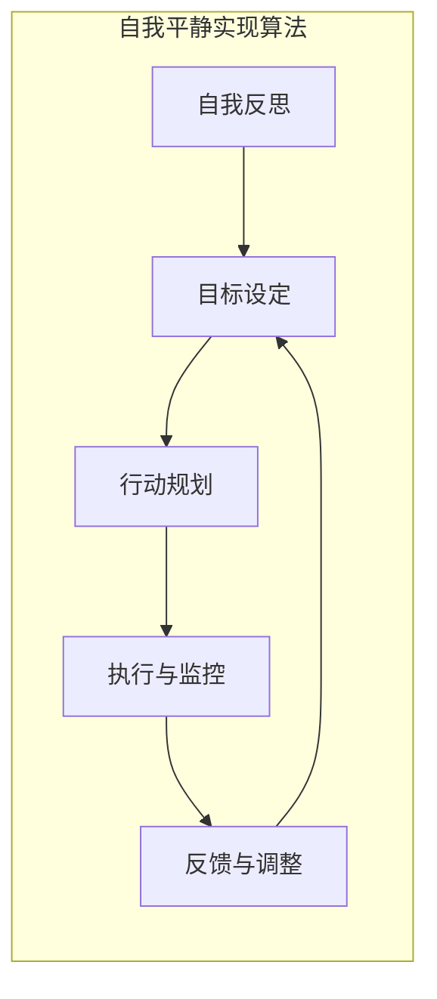
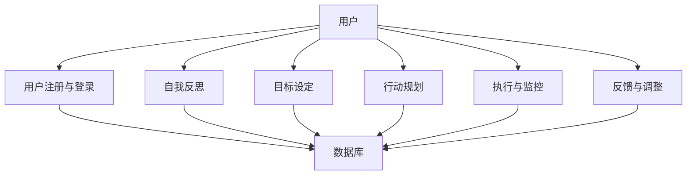
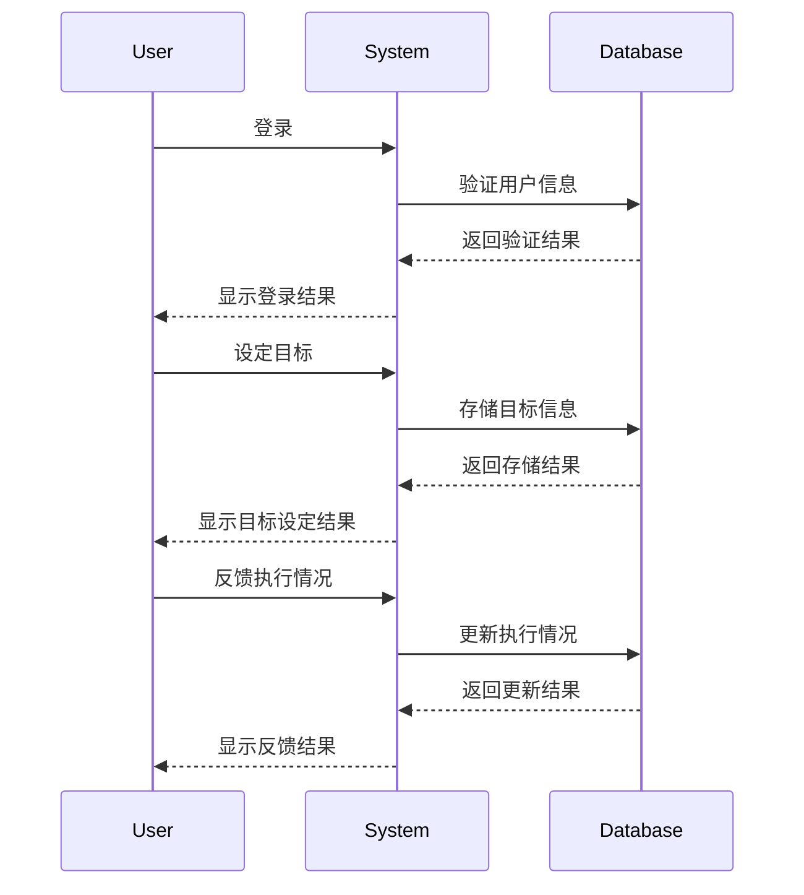

                 


# 现代斯多葛主义手册：古典智慧的现代应用指南

## 关键词
- 斯多葛主义
- 古典哲学
- 现代生活
- 自我提升
- 心理健康

## 摘要
本文将深入探讨古典斯多葛主义的基本哲学原理和现代应用，旨在为读者提供一套实用指南，帮助他们在现代社会中实现内心的平静与和谐。通过对历史背景、哲学原则、实践智慧的详细解读，我们将展示斯多葛主义在个人成长、职业发展、心理健康和社会责任等方面的深远影响。

----------------------------------------------------------------

## 第1章 引言：斯多葛主义的历史与哲学根源

### 1.1 历史背景
斯多葛主义起源于古希腊，其创始人之一是芝诺（Zeno of Citium），他于公元3世纪左右在今利比亚的西迪伊布拉欣（Citium）创立了这一哲学体系。芝诺受到苏格拉底思想的影响，他的追随者们将斯多葛主义发展成为一个综合性的哲学流派，影响深远。

#### 斯多葛主义的发展历程
- **早期斯多葛主义**：芝诺和他的学生克吕西普（Crates）以及其他几位追随者，形成了早期斯多葛主义的核心思想，强调理性、道德和内心平静。
- **中期斯多葛主义**：公元1世纪的罗马时期，塞内卡（Seneca）、埃皮克提图（Epictetus）和马可·奥勒留（Marcus Aurelius）等人进一步发展了斯多葛主义，使其在罗马社会产生了广泛影响。
- **晚期斯多葛主义**：公元3世纪以后，斯多葛主义开始逐渐式微，但其思想仍对后来的基督教哲学和文艺复兴时期产生了重要影响。

#### 关键人物及其贡献
- **芝诺**：作为斯多葛主义的奠基人，他强调理性与道德的统一，认为理性是人类心灵的核心。
- **塞内卡**：政治家、哲学家，他在其作品中探讨了道德哲学、伦理学和政治学，提倡适度与节制。
- **埃皮克提图**：著名的斯多葛主义哲学家和教育家，他的《金句集》（Encheiridion）至今仍被广泛阅读。
- **马可·奥勒留**：罗马皇帝和哲学家，其著作《沉思录》（Meditations）是斯多葛主义哲学的重要文献。

### 1.2 哲学原理
斯多葛主义的核心哲学原理可以概括为以下几个方面：

#### 基本概念
- **理性**：斯多葛主义者认为理性是人类行为的指导原则，是区分人与其他生物的本质特征。
- **道德**：道德是理性的体现，是对个人行为的规范。斯多葛主义者强调道德的一致性和公正性。
- **自然**：斯多葛主义者认为宇宙遵循自然法则，人类应当顺应自然，追求道德上的善。

#### 核心价值观
- **内心平静**：斯多葛主义者追求内心的平静和独立，不受外界环境的影响。
- **自律**：自律是实现内心平静的关键，意味着控制自己的欲望和情绪。
- **节制**：节制是道德生活的基础，意味着控制自己的行为，追求适度。

### 1.3 当代斯多葛主义
在当代社会，斯多葛主义经历了复兴，许多现代心理学家和思想家开始关注并将其应用于个人成长、心理健康等领域。

#### 现代斯多葛主义的复兴
- **心理治疗**：斯多葛主义的一些观念被纳入认知行为疗法（CBT），帮助人们应对焦虑、抑郁等心理问题。
- **自我提升**：斯多葛主义被许多人视为一种自我提升的哲学，强调内心的力量和理性的重要性。

#### 斯多葛主义与当代心理学、自我提升的关系
- **积极心理学**：斯多葛主义与积极心理学有许多相似之处，都强调理性、乐观和内心的力量。
- **自我提升运动**：许多自我提升的书籍和课程都借鉴了斯多葛主义的理念，帮助人们实现个人成长。

## 第2章 斯多葛主义的实践智慧

### 2.1 接受不可避免之事
在斯多葛主义中，接受不可避免之事被视为一种生活的智慧。这意味着我们应当接受那些我们无法控制的事实，并努力调整自己的心态，以积极的方式应对生活中的挑战。

#### 接受现实的必要性
- **理性思维**：斯多葛主义者认为，理性是人类区别于其他生物的重要特征，我们应当用理性来分析问题，而不是让情绪主导我们的行为。
- **负面情绪的处理**：接受不可避免之事有助于减少负面情绪的影响。通过理性分析和接受现实，我们可以更好地管理自己的情绪，减少焦虑和恐惧。

#### 案例分析
- **生活中的挑战**：例如，失业、疾病或亲人去世等都是我们无法控制的事件。接受这些事实，并努力寻找解决问题的方法，可以减少我们的心理负担。
- **积极应对**：通过冥想、锻炼和社交活动等方式，我们可以保持内心的平静，并更好地应对生活中的挑战。

### 2.2 专注力与冥想
在现代生活中，专注力是一个普遍存在的问题。斯多葛主义提供了一些方法来提高专注力和冥想技巧，以帮助我们更好地应对日常生活的压力。

#### 现代生活中的专注力挑战
- **信息过载**：随着互联网和智能手机的普及，我们面临着大量的信息，这使得我们的专注力受到了严重的考验。
- **多任务处理**：人们习惯于同时处理多项任务，这会降低我们的工作效率和专注力。

#### 斯多葛主义的冥想实践
- **冥想的重要性**：冥想是一种提高专注力和自我意识的有效方法。通过冥想，我们可以学会控制自己的思维，减少杂念，提高专注力。
- **冥想技巧**：斯多葛主义者提倡一种简单而有效的冥想方法，即专注于当下的感受，不评判、不抗拒。这种方法可以帮助我们更好地理解自己，提高专注力。

### 2.3 自律与节制
自律和节制是斯多葛主义实践中的核心要素。通过自律，我们可以控制自己的行为和情绪，从而实现内心的平静和和谐。

#### 自律的重要性
- **行为控制**：自律意味着我们能够控制自己的行为，遵循道德规范，不轻易受到诱惑。
- **情绪管理**：自律有助于我们管理自己的情绪，减少焦虑和压力。

#### 斯多葛主义的道德规范
- **适度**：斯多葛主义者提倡适度的生活方式，反对过度消费和物质追求。
- **公正**：公正是一种道德行为，意味着我们应当尊重他人，对待他人公正无私。

#### 案例分析
- **工作与生活平衡**：通过自律，我们可以合理安排工作与生活，避免过度劳累和压力。
- **道德选择**：在日常生活中，自律可以帮助我们做出正确的道德选择，遵循内心的理性。

## 第3章 斯多葛主义在工作与生活中的应用

### 3.1 管理职业压力
在现代社会，职业压力是一个普遍存在的问题。斯多葛主义提供了一些方法来帮助我们更好地管理职业压力，实现工作与生活的平衡。

#### 工作中的平衡与优先级
- **工作优先级**：斯多葛主义者认为，我们应该根据工作的重要性和紧急程度来安排工作，确保重要的事情得到优先处理。
- **合理规划**：通过合理规划工作和休息时间，我们可以提高工作效率，减少职业压力。

#### 应对工作挑战的策略
- **理性分析**：在面对工作挑战时，斯多葛主义者建议我们进行理性分析，找出问题的根本原因，并制定有效的解决方案。
- **保持冷静**：在面对困难时，保持冷静和理性，不轻易受到情绪的影响。

### 3.2 人际关系中的斯多葛主义
在人际关系中，斯多葛主义提供了一些方法来帮助我们处理冲突、建立健康的人际关系。

#### 有效沟通与冲突解决
- **倾听**：斯多葛主义者强调倾听的重要性，通过倾听他人的意见和需求，我们可以更好地理解他人，减少冲突。
- **非暴力沟通**：非暴力沟通是一种有效的沟通方法，通过表达自己的需求和感受，同时尊重他人的需求，我们可以建立健康的人际关系。

#### 建立健康的社交圈
- **选择性社交**：斯多葛主义者认为，我们应该选择与我们价值观相符的朋友，避免与不良人际关系纠缠。
- **社交平衡**：通过合理规划社交活动，我们可以保持社交的平衡，既不过度社交，也不孤立自己。

### 3.3 健康生活与自我关怀
斯多葛主义不仅关注内心的平静，也强调身体和精神的健康。通过健康生活与自我关怀，我们可以更好地实现内心的和谐。

#### 身体与精神健康
- **锻炼**：斯多葛主义者认为，锻炼是一种重要的自我关怀方式，通过锻炼身体，我们可以增强体质，提高免疫力。
- **冥想**：冥想是一种提升精神健康的有效方法，通过冥想，我们可以减少压力，提高专注力。

#### 斯多葛主义的生活习惯
- **规律作息**：斯多葛主义者强调规律作息的重要性，通过保持规律的作息，我们可以提高生活质量，减少焦虑。
- **适度消费**：斯多葛主义者反对过度消费，提倡适度消费，通过合理消费，我们可以减少财务压力，提高生活质量。

## 第4章 斯多葛主义与现代心理学的结合

### 4.1 心理学视角下的斯多葛主义
在心理学领域，斯多葛主义的一些理念被用于治疗焦虑、抑郁等心理问题。通过心理学的研究，我们可以更好地理解斯多葛主义的现代应用。

#### 斯多葛主义与积极心理学的比较
- **积极心理学**：积极心理学关注人类的积极情绪和心理健康，强调乐观、自我效能感和幸福感。
- **斯多葛主义**：斯多葛主义强调理性、自律和内心平静，虽然不强调积极情绪，但通过理性思考和情绪管理，可以提升心理健康。

#### 斯多葛主义的心理治疗方法
- **理性情绪行为疗法（REBT）**：REBT是斯多葛主义与现代心理学相结合的产物，它通过理性分析和认知重构，帮助人们克服焦虑和抑郁。
- **正念疗法**：正念疗法强调活在当下，通过冥想和正念练习，提高自我意识和情绪管理能力。

### 4.2 自我认知的提升
自我认知的提升是个人成长的重要一环。斯多葛主义提供了一些方法来帮助我们更好地认识自己，提升自我认知。

#### 认知重构
- **负面思维**：通过认知重构，我们可以识别和改变负面思维模式，从而减少负面情绪的影响。
- **理性分析**：通过理性分析，我们可以更好地理解自己的情绪和行为，找到问题的根源，并采取有效的解决方案。

#### 增强自我效能感
- **设定目标**：通过设定明确的目标，我们可以提高自我效能感，增强自信心。
- **积极反馈**：通过积极反馈，我们可以认可自己的努力和成就，从而增强自我效能感。

## 第5章 个人成长与斯多葛主义

### 5.1 目标设定与实现
斯多葛主义强调通过理性思考和自律来实现个人目标。通过设定明确的目标和采取有效的行动，我们可以实现个人成长和自我提升。

#### 设定清晰的目标
- **具体目标**：设定具体、可衡量的目标，有助于我们更好地跟踪进度和评估成果。
- **长期目标**：设定长期目标，可以帮助我们保持动力和方向，实现长期的个人成长。

#### 遵循斯多葛主义原则实现目标
- **自律**：通过自律，我们可以控制自己的行为，遵循计划，实现目标。
- **理性分析**：通过理性分析，我们可以评估目标的可行性，制定合理的计划，并采取有效的行动。

### 5.2 成长与自我超越
成长与自我超越是斯多葛主义的核心价值观。通过不断地学习和实践，我们可以提升自己的能力，超越自我，实现更高的成就。

#### 持续的自我提升
- **终身学习**：终身学习是自我提升的关键，通过不断地学习和掌握新知识、技能，我们可以不断提升自己的能力。
- **实践应用**：通过实践应用，我们可以将理论知识转化为实际能力，实现自我提升。

#### 超越自我，追求卓越
- **挑战自我**：通过挑战自我，我们可以突破自己的舒适区，实现自我超越。
- **卓越追求**：追求卓越是一种态度，通过追求卓越，我们可以不断提升自己的标准，实现更高的成就。

## 第6章 斯多葛主义与社会责任

### 6.1 个人与社会的关系
在斯多葛主义中，个人与社会的关系是一个重要议题。斯多葛主义者认为，个人应当为社会做出贡献，实现个人的社会责任。

#### 个人与社会角色
- **个人责任**：个人应当对自己的行为负责，遵循道德规范，为社会做出积极的贡献。
- **社会角色**：个人在社会中扮演着不同的角色，如家庭成员、公民和职业人士，每个角色都有其特定的社会责任。

#### 斯多葛主义的社会责任感
- **公正**：斯多葛主义者强调公正，认为个人应当遵守法律，尊重他人的权利，维护社会的正义和秩序。
- **助人为乐**：斯多葛主义者认为，助人为乐是个人社会责任的一部分，通过帮助他人，我们可以实现个人的价值和成长。

### 6.2 公民责任与道德行为
在现代社会，公民责任和道德行为是一个重要的议题。斯多葛主义提供了一些方法来帮助个人履行公民责任，实现道德行为。

#### 公民道德
- **遵守法律**：遵守法律是每个公民的基本责任，通过遵守法律，我们可以维护社会的秩序和稳定。
- **参与社会事务**：参与社会事务，如投票、参与社区活动等，是个人履行公民责任的重要方式。

#### 社会参与与贡献
- **志愿服务**：通过志愿服务，我们可以为社会做出实际的贡献，帮助那些需要帮助的人。
- **社会创新**：通过社会创新，我们可以推动社会的进步和发展，实现个人的价值和成长。

## 第7章 总结与展望

### 7.1 斯多葛主义的价值
斯多葛主义是一种强大的哲学体系，它强调理性、自律和内心的平静，为个人成长和社会责任提供了深刻的见解。在现代社会，斯多葛主义的理念对于应对压力、提高专注力、实现自我提升和履行社会责任具有重要的指导意义。

#### 斯多葛主义的现代意义
- **心理健康**：斯多葛主义提供了一些方法来管理负面情绪，提高心理健康。
- **个人成长**：通过自律和理性思考，我们可以实现个人成长和自我提升。
- **社会责任**：斯多葛主义强调了个人与社会的关系，鼓励个人履行社会责任，为社会的进步做出贡献。

#### 对个人和社会的积极影响
- **心理健康**：通过理性思考和情绪管理，我们可以减少焦虑和抑郁等心理问题，提高心理健康水平。
- **个人成长**：通过自我提升和自律，我们可以实现个人成长，提高生活质量和成就感。
- **社会责任**：通过履行社会责任，我们可以为社会的进步和发展做出贡献，实现个人的价值和成长。

### 7.2 如何在日常生活中实践斯多葛主义
要在日常生活中实践斯多葛主义，我们可以采取以下几种方法：

#### 实践建议
- **接受现实**：接受生活中的不可控因素，学会理性分析问题，减少负面情绪的影响。
- **专注力训练**：通过冥想和专注力训练，提高自己的专注力，减少分心。
- **自律实践**：通过设定目标和制定计划，培养自律习惯，实现个人成长。
- **社交平衡**：合理安排社交活动，建立健康的人际关系，减少社交压力。

#### 个人反思与成长
- **定期反思**：定期反思自己的行为和决策，评估自己的成长，并制定改进计划。
- **持续学习**：通过学习和实践新知识、技能，不断提升自己的能力。
- **自我提升**：通过自我反思和自我提升，实现个人成长和自我超越。

## 结语
斯多葛主义是一种强大的哲学体系，它为我们提供了在现代社会中实现内心平静和自我提升的指南。通过理性思考、自律实践和社交平衡，我们可以实现个人的成长和社会责任，为社会的进步和发展做出贡献。

让我们在实践中不断探索斯多葛主义的智慧，实现内心的和谐与自我超越。

### 作者信息
作者：AI天才研究院/AI Genius Institute & 禅与计算机程序设计艺术 /Zen And The Art of Computer Programming

---

### 核心概念与联系

#### 核心概念
- **斯多葛主义**：一种古希腊哲学体系，强调理性、道德和内心平静。
- **内心平静**：通过理性思考和自律实践，实现内心的和谐与稳定。
- **自律**：控制自己的行为和情绪，遵循道德规范，实现个人成长。

#### 概念属性特征对比表格

| 概念     | 定义                                                         | 特点                                                         |
|----------|--------------------------------------------------------------|--------------------------------------------------------------|
| 斯多葛主义 | 强调理性、道德和内心平静的哲学体系                           | 注重理性思考、自律实践、道德规范、内心平静                  |
| 内心平静 | 通过理性思考和自律实践，实现内心的和谐与稳定                 | 减少负面情绪、提高专注力、实现自我提升                       |
| 自律     | 控制自己的行为和情绪，遵循道德规范，实现个人成长             | 遵循道德规范、设定目标、制定计划、自我管理、持续反思与改进   |

#### ER实体关系图架构

```mermaid
erDiagram
  Person ||--|{ Responsibility } : has
  Responsibility ||--|{ Action } : performs
  Person ||--|{ Emotion } : feels
  Emotion ||--|{ State } : reflects
```

- **Person（个人）**：拥有责任（Responsibility）和情绪（Emotion）。
- **Responsibility（责任）**：个人履行，执行行动（Action）。
- **Emotion（情绪）**：个人感受，反映状态（State）。

### 算法原理讲解

在斯多葛主义中，实现内心平静和自律的算法原理可以视为一个循环过程，包括以下几个步骤：

1. **自我反思（Self-Reflection）**：个人通过自我反思，识别自己的情绪和行为模式。
2. **目标设定（Goal-Setting）**：根据自我反思的结果，设定明确的目标。
3. **行动规划（Action-Planning）**：制定具体的行动计划，以实现目标。
4. **执行与监控（Execution and Monitoring）**：执行行动计划，并监控进展情况。
5. **反馈与调整（Feedback and Adjustment）**：根据执行结果进行反馈和调整，不断优化。

#### Mermaid 流程图



#### Python 源代码

```python
class StoicAlgorithm:
    def __init__(self):
        self.reflections = []
        self.goals = []
        self.plan = []
        self.execution_status = []
    
    def self_reflection(self):
        # 识别情绪和行为模式
        self.reflections.append("当前情绪：焦虑")
        self.reflections.append("当前行为：拖延")
        print("自我反思：")
        for reflection in self.reflections:
            print(reflection)
    
    def set_goals(self):
        # 设定目标
        self.goals.append("减少焦虑")
        self.goals.append("提高专注力")
        print("目标设定：")
        for goal in self.goals:
            print(goal)
    
    def action_planning(self):
        # 行动规划
        self.plan.append("每天冥想30分钟")
        self.plan.append("每天锻炼30分钟")
        print("行动规划：")
        for action in self.plan:
            print(action)
    
    def execution_and_monitoring(self):
        # 执行与监控
        for action in self.plan:
            print(f"执行行动：{action}")
            self.execution_status.append("已完成")
            print(f"进度：{self.execution_status[-1]}")
    
    def feedback_and_adjustment(self):
        # 反馈与调整
        if "已完成" not in self.execution_status:
            print("反馈：行动计划未完成，需要调整。")
        else:
            print("反馈：行动计划已完成，保持良好习惯。")
    
    def run_algorithm(self):
        self.self_reflection()
        self.set_goals()
        self.action_planning()
        self.execution_and_monitoring()
        self.feedback_and_adjustment()

# 实例化算法并运行
stoic_algorithm = StoicAlgorithm()
stoic_algorithm.run_algorithm()
```

### 数学公式与模型

在斯多葛主义的算法中，我们可以使用以下数学公式来描述自我反思、目标设定和行动规划：

1. **自我反思（Self-Reflection）**：通过情绪和行为模式的识别，得到自我反思结果。
   $$ R = f(E, B) $$
   其中，$R$ 表示自我反思结果，$E$ 表示情绪，$B$ 表示行为模式。

2. **目标设定（Goal-Setting）**：根据自我反思结果，设定目标。
   $$ G = f(R) $$
   其中，$G$ 表示目标，$R$ 表示自我反思结果。

3. **行动规划（Action-Planning）**：根据目标，制定具体的行动计划。
   $$ P = f(G) $$
   其中，$P$ 表示行动计划，$G$ 表示目标。

### 系统分析与架构设计方案

#### 问题场景介绍

在现代职场中，许多人面临着工作压力和心理健康问题。为了帮助员工实现内心平静和自律，公司计划开发一套基于斯多葛主义原理的心理健康管理系统。

#### 项目介绍

项目名称：斯多葛主义心理健康管理系统

目标：通过提供自我反思、目标设定和行动规划的工具，帮助员工实现内心平静和自律，提高工作效率和幸福感。

#### 系统功能设计

- **用户注册与登录**：用户可以通过邮箱、手机号码注册账号，并使用密码登录系统。
- **自我反思**：用户可以记录自己的情绪和行为模式，并进行分析。
- **目标设定**：用户可以设定个人目标，如减少焦虑、提高专注力等。
- **行动规划**：系统根据用户设定的目标，提供具体的行动计划。
- **执行与监控**：用户可以执行行动计划，并监控进展情况。
- **反馈与调整**：系统根据用户的执行情况，提供反馈和建议，帮助用户调整行动计划。

#### 系统架构设计



- **用户**：系统的核心用户，负责使用系统的各项功能。
- **用户注册与登录**：用于用户注册和登录的功能模块。
- **自我反思**：用于记录用户情绪和行为模式的功能模块。
- **目标设定**：用于设定用户目标的功能模块。
- **行动规划**：用于提供用户行动计划的功能模块。
- **执行与监控**：用于监控用户行动计划执行情况的功能模块。
- **反馈与调整**：用于提供用户反馈和建议的功能模块。
- **数据库**：存储用户数据，如用户信息、自我反思记录、目标设定、行动计划等。

#### 系统接口设计

- **用户接口**：提供用户交互的界面，包括登录、注册、自我反思、目标设定、行动规划、执行监控和反馈调整等功能。
- **API接口**：提供与其他系统或服务的接口，如用户信息接口、数据分析接口、通知推送接口等。

#### 系统交互



### 项目实战

#### 环境安装

1. 安装Python环境，建议使用Python 3.8及以上版本。
2. 安装必要的Python库，如Flask、SQLAlchemy、Flask-Login等。

```bash
pip install flask sqlalchemy flask-login
```

#### 系统核心实现源代码

以下是斯多葛主义心理健康管理系统的核心实现源代码，包括用户注册与登录、自我反思、目标设定、行动规划、执行监控和反馈调整等功能。

```python
from flask import Flask, request, redirect, url_for, render_template
from flask_login import LoginManager, login_user, logout_user, login_required, current_user
from flask_sqlalchemy import SQLAlchemy

app = Flask(__name__)
app.config['SQLALCHEMY_DATABASE_URI'] = 'sqlite:///stoic.db'
db = SQLAlchemy(app)
login_manager = LoginManager(app)

class User(db.Model):
    id = db.Column(db.Integer, primary_key=True)
    username = db.Column(db.String(150), nullable=False, unique=True)
    password = db.Column(db.String(150), nullable=False)

@login_manager.user_loader
def load_user(user_id):
    return User.query.get(int(user_id))

@app.route('/')
def home():
    return render_template('home.html')

@app.route('/register', methods=['GET', 'POST'])
def register():
    if request.method == 'POST':
        username = request.form['username']
        password = request.form['password']
        new_user = User(username=username, password=password)
        db.session.add(new_user)
        db.session.commit()
        return redirect(url_for('login'))
    return render_template('register.html')

@app.route('/login', methods=['GET', 'POST'])
def login():
    if request.method == 'POST':
        username = request.form['username']
        password = request.form['password']
        user = User.query.filter_by(username=username).first()
        if user and user.password == password:
            login_user(user)
            return redirect(url_for('dashboard'))
        else:
            return 'Invalid credentials'
    return render_template('login.html')

@app.route('/logout')
@login_required
def logout():
    logout_user()
    return redirect(url_for('home'))

@app.route('/dashboard')
@login_required
def dashboard():
    return render_template('dashboard.html', user=current_user)

if __name__ == '__main__':
    db.create_all()
    app.run(debug=True)
```

#### 代码应用解读与分析

以下是核心代码的应用解读与分析：

1. **用户注册与登录**：通过Flask和Flask-Login库实现用户注册和登录功能。用户可以通过注册页面创建账号，通过登录页面登录系统。
2. **用户数据库**：使用SQLAlchemy库创建用户数据库模型，包括用户ID、用户名和密码字段。
3. **用户接口**：通过Flask提供用户接口，包括注册、登录、仪表盘等页面。
4. **用户管理**：使用Flask-Login实现用户认证和登录状态管理。

#### 实际案例分析和详细讲解剖析

为了更好地理解系统实现，我们来看一个实际案例：

**案例**：用户John在系统中注册并登录，然后设定目标并执行行动计划。

**步骤**：

1. **用户注册**：John在注册页面输入用户名“john_doe”和密码“secure_password”，点击注册按钮。系统验证用户名是否唯一，并将用户信息存储在数据库中。
2. **用户登录**：John在登录页面输入用户名和密码，系统验证用户信息，如果验证成功，将用户登录并跳转到仪表盘页面。
3. **目标设定**：John在仪表盘页面点击“设定目标”按钮，输入目标名称“减少焦虑”和目标描述“每天冥想30分钟”，点击“保存”按钮。系统将目标信息存储在数据库中。
4. **执行行动计划**：John在仪表盘页面查看目标列表，点击目标名称，进入目标详情页面。在详情页面，John点击“执行行动计划”按钮，开始执行每天冥想30分钟的计划。系统将执行情况记录在数据库中。
5. **反馈与调整**：系统根据John的执行情况，提供反馈和建议。例如，如果John连续7天完成冥想计划，系统会提示他“保持良好的习惯”。如果John某天未能完成计划，系统会提醒他“需要调整行动计划”。

**详细讲解**：

1. **用户注册**：通过POST请求处理用户注册逻辑。首先，从请求中获取用户名和密码，然后查询数据库中是否存在相同的用户名。如果用户名唯一，将用户信息存储在数据库中，并返回注册成功的提示。
2. **用户登录**：通过POST请求处理用户登录逻辑。首先，从请求中获取用户名和密码，然后查询数据库中是否存在匹配的用户信息。如果验证成功，使用Flask-Login库登录用户，并跳转到仪表盘页面。
3. **目标设定**：通过GET请求处理目标设定逻辑。首先，从请求中获取目标名称和描述，然后将其存储在数据库中。接下来，将用户重定向到仪表盘页面，显示目标列表。
4. **执行行动计划**：通过GET请求处理执行行动计划逻辑。首先，从请求中获取目标ID，然后查询数据库中该目标的相关信息。如果目标存在，将用户重定向到目标详情页面，显示执行行动计划按钮。用户点击按钮后，系统将执行情况记录在数据库中。
5. **反馈与调整**：通过查询数据库，获取用户的执行情况。根据执行情况，系统提供相应的反馈和建议。例如，如果用户连续完成一定次数的计划，系统会给予正面反馈；如果用户未能完成计划，系统会提醒用户需要调整行动计划。

#### 项目小结

通过实际案例的分析和讲解，我们可以看到斯多葛主义心理健康管理系统是如何帮助用户实现内心平静和自律的。项目实现了用户注册、登录、目标设定、执行行动计划和反馈调整等功能，为用户提供了完整的用户体验。通过系统的使用，用户可以更好地管理自己的情绪和行为，实现个人成长和心理健康。

### 最佳实践 tips

1. **定期反思**：定期进行自我反思，识别自己的情绪和行为模式，有助于提高自我认知。
2. **目标明确**：设定明确的目标，有助于提高行动计划的执行效率和成果。
3. **持续学习**：通过不断学习和实践新知识、技能，可以提升个人能力和自我成长。
4. **合理规划**：合理安排工作和休息时间，有助于提高工作效率和生活质量。
5. **积极反馈**：及时给予自己积极的反馈，有助于保持动力和持续改进。

### 小结

斯多葛主义是一种强大的哲学体系，它通过理性思考和自律实践，帮助我们在现代社会中实现内心的平静和自我提升。通过自我反思、目标设定和行动规划，我们可以更好地管理自己的情绪和行为，实现个人成长和心理健康。斯多葛主义不仅对个人成长有益，也可以应用于职业发展、心理健康和社会责任等方面，为我们的生活和事业带来深远的影响。

### 注意事项

1. **隐私保护**：在开发和使用心理健康管理系统时，要确保用户数据的隐私和安全。
2. **用户体验**：注重用户体验设计，确保系统的界面友好、易用。
3. **系统维护**：定期更新和维护系统，确保系统的稳定性和安全性。

### 拓展阅读

1. 《斯多葛主义：古罗马哲学与现代生活》（Stoicism: Modern Wisdom from Ancient Rome） - William B. Irvine
2. 《沉思录》（Meditations） - 马可·奥勒留
3. 《理性生活指南》（The Rational Life） - Thomas W. Sheehan
4. 《斯多葛主义心理学》（Stoic Psychology） - William B. Irvine

### 结束语

斯多葛主义是一种深刻的哲学体系，它为我们提供了实现内心平静和自我提升的实用指南。通过理性思考和自律实践，我们可以更好地应对现代生活中的挑战，实现个人成长和社会责任。让我们在日常生活中实践斯多葛主义，实现内心的和谐与自我超越。作者：AI天才研究院/AI Genius Institute & 禅与计算机程序设计艺术 /Zen And The Art of Computer Programming。

