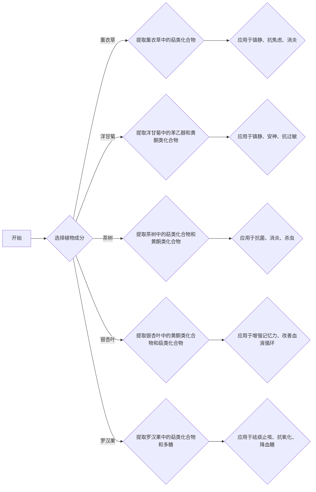
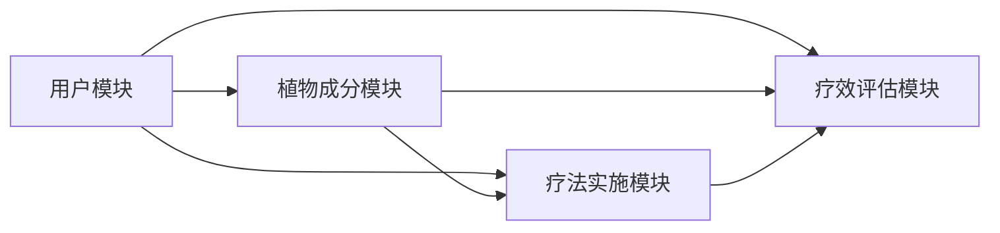

                 

**# 现代植物疗法工作坊：都市生活中的自然疗愈实践**

> 关键词：植物疗法、自然疗愈、都市生活、心理健康、身体健康

> 摘要：本文旨在介绍现代植物疗法在都市生活中的应用和实践，探讨其在心理健康和身体健康方面的疗效。通过对植物疗法的历史、原理、应用和实践的深入分析，本文将为读者提供一份全面而实用的植物疗法指南，帮助都市人群在快节奏的生活中找到自然的疗愈方式。

## 引言

随着城市化进程的加快，都市生活的人们面临着越来越多的压力和挑战。长时间的工作、繁忙的社交生活、环境污染等问题，使得人们的心理健康和身体健康状况日益恶化。在这种背景下，寻找一种自然、安全且有效的疗愈方式成为都市人群的迫切需求。现代植物疗法作为一种新兴的自然疗愈方法，以其独特的疗效和安全性，逐渐受到关注和认可。

本文将从以下几个方面展开讨论：首先，介绍植物疗法的基本概念、历史和发展；其次，探讨植物疗法在都市生活中的应用，包括家庭植物疗法和室内植物的选择与养护；接着，详细介绍常见植物疗法的实施方法，如芳香疗法和植物药茶疗法；然后，分析植物疗法在心理健康和身体健康中的应用，以及其未来发展趋势；最后，提供植物疗法的学习与实践指南，帮助读者更好地理解和应用植物疗法。

## 第1章：植物疗法的基本概念

### 1.1 植物疗法的历史与发展

植物疗法，也被称为植物医疗或自然疗法，是一种利用植物及其提取物来预防和治疗疾病的方法。其历史可以追溯到古代文明时期，早在公元前2000年，古埃及人就已经开始使用植物来治疗疾病。希腊医师希波克拉底被认为是植物疗法的奠基人，他提倡使用草药和植物汁液来治疗疾病。

随着医学和植物学的发展，植物疗法在各个历史时期都有所应用。在中国，古代医学家如扁鹊、华佗等人均有关于植物疗法的记载。古希腊和罗马时期，植物疗法也得到了广泛应用，许多植物如洋葱、大蒜、鼠尾草等被用于治疗各种疾病。

进入现代，植物疗法再次受到重视。20世纪以来，随着现代医学和植物学研究的发展，越来越多的植物成分被提取和分离，其疗效和安全性得到了科学验证。目前，植物疗法已成为一种独立的治疗方法，广泛应用于医学、保健和日常生活中。

### 1.2 植物疗法的原理

植物疗法的疗效主要源于植物中的活性成分，如萜类化合物、黄酮类化合物、酚类化合物等。这些成分具有广泛的生物学活性，可以调节人体的生理功能，提高免疫力，减轻炎症，抗菌抗病毒等。

植物疗法的作用原理主要包括以下几个方面：

1. **调节神经系统**：许多植物成分具有镇静、抗焦虑、抗抑郁等作用，可以调节神经系统的功能，改善心理健康。

2. **增强免疫力**：植物中的多糖、生物碱等成分可以增强人体的免疫力，提高抵抗力，预防感染。

3. **抗炎作用**：植物中的酚类化合物等成分具有抗炎作用，可以减轻炎症反应，缓解疼痛。

4. **抗氧化作用**：植物中的多酚、黄酮等成分具有抗氧化作用，可以清除体内的自由基，减少氧化应激，保护细胞免受损伤。

### 1.3 植物疗法的安全性与副作用

植物疗法通常被认为是安全的，因为植物中的成分相对温和，副作用较少。然而，任何治疗方法都可能存在一定的风险和副作用，植物疗法也不例外。

1. **过敏反应**：某些植物成分可能引起过敏反应，如皮疹、呼吸急促等。

2. **药物相互作用**：植物疗法中的某些成分可能与某些药物相互作用，影响药物的疗效或增加副作用。

3. **过量使用**：植物疗法中的某些成分过量使用可能导致不良反应，如肝脏损伤、肾脏损伤等。

因此，在进行植物疗法时，应遵循以下原则：

- **合理使用**：遵循医生或植物疗法专家的建议，不要自行使用植物疗法。
- **剂量控制**：按照推荐剂量使用植物疗法，避免过量使用。
- **监测反应**：使用植物疗法期间，应注意监测身体反应，如出现不适症状，应及时停止使用。

## 第2章：都市生活中的植物疗法应用

### 2.1 家庭植物疗法的实践

在家庭环境中，植物疗法可以通过种植室内植物、制作植物药茶、使用香薰精油等方式进行。这些方法不仅能够美化家居环境，还能够改善空气质量和促进身心健康。

#### 2.1.1 家庭植物疗法的准备

要进行家庭植物疗法，首先需要准备一些基本的工具和材料：

- **种植容器**：选择适合种植室内植物的花盆、花瓶等容器，确保容器透气、排水良好。
- **种植土壤**：选择适合室内植物生长的土壤，如腐叶土、泥炭土等。
- **种子或幼苗**：根据个人喜好和需求选择适合室内种植的植物种子或幼苗。
- **浇花工具**：准备喷水壶、水桶等浇花工具，以便给植物浇水。

#### 2.1.2 家庭植物疗法的方法

家庭植物疗法的具体方法如下：

1. **种植室内植物**：根据个人喜好和植物的特性，选择适合室内生长的植物，如吊兰、绿萝、芦荟等。将植物种植在容器中，定期浇水、施肥，保持土壤湿润和通风。

2. **制作植物药茶**：将具有药用价值的植物如菊花、枸杞、红枣等洗净，晾干后制成药茶。每天饮用，可以起到保健作用。

3. **使用香薰精油**：将香薰精油滴入香薰灯中，通过香气的作用改善心情、缓解压力。常见的香薰精油有 lavender（薰衣草）、peppermint（薄荷）、orange（橙子）等。

#### 2.1.3 家庭植物疗法的安全注意事项

在进行家庭植物疗法时，应注意以下安全事项：

1. **避免过敏反应**：某些植物可能引起过敏反应，如皮疹、呼吸急促等。如果出现过敏症状，应立即停止使用。

2. **避免误食**：植物中的某些部分可能有毒，如仙人掌的刺、杏仁的核等。应确保植物放置在儿童触及不到的地方。

3. **合理使用**：遵循医生或植物疗法专家的建议，不要自行使用植物疗法。

### 2.2 室内植物的选择与养护

室内植物的选择与养护是家庭植物疗法的重要部分。以下是一些常见室内植物的选择与养护方法：

1. **吊兰**：吊兰是一种易于养护的室内植物，具有空气净化作用，能够吸收甲醛等有害物质。养护方法：保持土壤湿润，每周浇水一次。

2. **绿萝**：绿萝是一种生长迅速的室内植物，具有良好的空气净化效果。养护方法：保持土壤湿润，每月施肥一次。

3. **芦荟**：芦荟具有药用价值，可以缓解皮肤炎症、烧伤等。养护方法：保持土壤干燥，每月浇水一次。

4. **茉莉花**：茉莉花具有浓郁的花香，能够改善心情、缓解压力。养护方法：保持土壤湿润，每周浇水一次。

5. **兰花**：兰花是一种高雅的室内植物，具有观赏价值。养护方法：保持土壤湿润，每月施肥一次。

### 2.3 室内植物与室内环境的关系

室内植物对室内环境有着重要的影响。以下是一些室内植物与室内环境的关系：

1. **空气净化**：许多室内植物具有空气净化作用，能够吸收甲醛、苯等有害物质，改善室内空气质量。

2. **调节湿度**：一些室内植物如绿萝、吊兰等具有调节室内湿度的作用，能够保持室内空气湿润，防止皮肤干燥。

3. **改善心情**：室内植物通过其绿色外观和花香，能够改善心情、缓解压力，提高生活质量。

4. **降低噪音**：一些室内植物如鸭脚木、橡皮树等具有降低噪音的作用，能够减少室内噪音污染。

## 第3章：常见植物疗法的实施

### 3.1 芳香疗法

芳香疗法是一种利用植物芳香成分来调节身心健康的自然疗法。以下介绍几种常见的芳香疗法方法：

#### 3.1.1 香薰精油的选择与使用

香薰精油的选择应根据个人需求和身体状况进行。以下是一些常见的香薰精油及其作用：

1. **薰衣草**：具有镇静、抗炎作用，适用于失眠、皮肤炎症等。

2. **薄荷**：具有清凉、提神作用，适用于头痛、疲劳等。

3. **橙子**：具有愉悦心情、缓解压力作用，适用于焦虑、抑郁等。

4. **檀香木**：具有安神、舒缓作用，适用于失眠、焦虑等。

使用方法：将适量的香薰精油滴入香薰灯中，通过香气的作用改善心情、缓解压力。此外，还可以将香薰精油加入沐浴露、洗发水等日常生活中使用的护肤品中。

#### 3.1.2 芳香疗法的效果与应用

芳香疗法具有多种效果，包括：

1. **镇静、安神**：薰衣草、檀香木等香薰精油具有镇静、安神作用，适用于失眠、焦虑等。

2. **提神、醒脑**：薄荷、橙子等香薰精油具有提神、醒脑作用，适用于头痛、疲劳等。

3. **缓解疼痛**：薰衣草、檀香木等香薰精油具有抗炎作用，适用于皮肤炎症、关节疼痛等。

4. **改善心情**：香薰精油通过香气的作用，能够改善心情、缓解压力，适用于抑郁、焦虑等。

芳香疗法广泛应用于医疗、保健、美容等领域。以下是一些常见应用：

1. **医疗**：芳香疗法用于治疗失眠、焦虑、抑郁等心理疾病，以及皮肤炎症、关节疼痛等生理疾病。

2. **保健**：芳香疗法用于改善空气质量、调节情绪、缓解压力等。

3. **美容**：芳香疗法用于护肤、护发、按摩等美容护理。

#### 3.1.3 芳香疗法的注意事项

在进行芳香疗法时，应注意以下事项：

1. **避免过敏反应**：某些香薰精油可能引起过敏反应，如皮疹、呼吸急促等。如果出现过敏症状，应立即停止使用。

2. **合理使用**：遵循医生或芳香疗法专家的建议，不要自行使用芳香疗法。

3. **剂量控制**：按照推荐剂量使用香薰精油，避免过量使用。

4. **孕妇和儿童慎用**：孕妇和儿童在使用芳香疗法时需谨慎，最好在医生或专业人士的指导下进行。

### 3.2 植物药茶疗法

植物药茶疗法是一种利用植物的药用成分来预防和治疗疾病的自然疗法。以下介绍几种常见的植物药茶疗法方法：

#### 3.2.1 植物药茶的配方与制作

植物药茶的配方和制作方法多样，以下是一些常见的植物药茶配方：

1. **菊花茶**：菊花具有清热解毒、明目祛翳等作用。制作方法：将菊花适量洗净，晾干后用开水冲泡，加入适量蜂蜜即可。

2. **枸杞茶**：枸杞具有滋阴养血、抗衰老等作用。制作方法：将枸杞适量洗净，晾干后用开水冲泡，加入适量蜂蜜即可。

3. **红枣茶**：红枣具有益气养血、健脾养胃等作用。制作方法：将红枣适量洗净，去核，用开水冲泡，加入适量蜂蜜即可。

4. **绿茶**：绿茶具有提神、抗氧化等作用。制作方法：将绿茶适量用开水冲泡，加入适量蜂蜜或柠檬汁即可。

#### 3.2.2 植物药茶的功效与应用

植物药茶具有多种功效，包括：

1. **清热解毒**：菊花茶、绿茶等具有清热解毒作用，适用于发热、口渴等。

2. **滋阴养血**：枸杞茶、红枣茶等具有滋阴养血作用，适用于血虚、面色苍白等。

3. **健脾养胃**：红枣茶等具有健脾养胃作用，适用于消化不良、食欲不振等。

4. **抗氧化**：绿茶等具有抗氧化作用，适用于预防衰老、抗疲劳等。

植物药茶疗法广泛应用于医疗、保健、美容等领域。以下是一些常见应用：

1. **医疗**：植物药茶疗法用于治疗感冒、发热、咳嗽等常见疾病。

2. **保健**：植物药茶疗法用于改善体质、增强免疫力、预防疾病等。

3. **美容**：植物药茶疗法用于护肤、护发、按摩等美容护理。

#### 3.2.3 植物药茶的安全性

植物药茶疗法被认为是安全的，因为植物中的成分相对温和，副作用较少。然而，任何治疗方法都可能存在一定的风险和副作用，植物药茶疗法也不例外。

1. **过敏反应**：某些植物成分可能引起过敏反应，如皮疹、呼吸急促等。

2. **药物相互作用**：植物药茶中的某些成分可能与某些药物相互作用，影响药物的疗效或增加副作用。

3. **过量使用**：植物药茶中的某些成分过量使用可能导致不良反应，如肝脏损伤、肾脏损伤等。

因此，在进行植物药茶疗法时，应遵循以下原则：

- **合理使用**：遵循医生或植物药茶疗法专家的建议，不要自行使用植物药茶疗法。
- **剂量控制**：按照推荐剂量使用植物药茶，避免过量使用。
- **监测反应**：使用植物药茶疗法期间，应注意监测身体反应，如出现不适症状，应及时停止使用。

## 第4章：植物疗法在心理健康中的应用

### 4.1 植物疗法对情绪的影响

植物疗法在改善情绪方面具有显著疗效，通过调节神经系统和内分泌系统，可以缓解焦虑、抑郁等情绪问题。

#### 4.1.1 植物疗法对焦虑与抑郁的缓解

植物疗法可以通过以下方式缓解焦虑与抑郁：

1. **镇静作用**：许多植物成分具有镇静作用，如薰衣草、洋甘菊等，可以减轻焦虑、紧张等情绪。

2. **抗抑郁作用**：一些植物成分具有抗抑郁作用，如圣约翰草、五味子等，可以缓解抑郁情绪、提高情绪稳定性。

3. **改善睡眠**：植物疗法可以通过改善睡眠质量来缓解焦虑与抑郁，如薰衣草、洋甘菊等具有镇静安神作用，有助于入睡。

#### 4.1.2 植物疗法对压力的减轻

植物疗法可以通过以下方式减轻压力：

1. **舒缓神经**：薰衣草、洋甘菊等植物成分具有舒缓神经作用，可以缓解压力引起的紧张和疲劳。

2. **改善心情**：植物疗法可以通过香气、颜色等感官刺激来改善心情，如柠檬、薄荷等具有愉悦心情作用，有助于缓解压力。

3. **促进放松**：植物疗法可以通过按摩、泡澡等方式促进身体放松，如薰衣草泡澡、按摩油等，有助于减轻压力。

#### 4.1.3 植物疗法对注意力的提升

植物疗法在提升注意力方面也有一定作用，通过以下方式改善注意力：

1. **提神醒脑**：薄荷、柠檬等植物成分具有提神醒脑作用，可以改善注意力不集中、疲劳等问题。

2. **减少干扰**：植物疗法可以通过香气、颜色等感官刺激减少干扰，如薰衣草香薰、绿植等，有助于集中注意力。

3. **提高认知功能**：一些植物成分具有提高认知功能的作用，如银杏叶、人参等，可以改善记忆力、注意力等认知功能。

### 4.2 植物疗法在心理疾病康复中的应用

植物疗法在心理疾病康复中具有潜在的应用价值，可以通过以下方式辅助治疗心理疾病：

#### 4.2.1 植物疗法对失眠的改善

失眠是常见的心理疾病之一，植物疗法可以通过以下方式改善失眠：

1. **镇静安神**：薰衣草、洋甘菊等植物成分具有镇静安神作用，可以缓解焦虑、紧张等情绪，有助于入睡。

2. **促进放松**：植物疗法可以通过按摩、泡澡等方式促进身体放松，如薰衣草泡澡、按摩油等，有助于入睡。

3. **改善睡眠环境**：室内植物如芦荟、吊兰等可以净化空气、改善睡眠环境，有助于提高睡眠质量。

#### 4.2.2 植物疗法对精神分裂症的辅助治疗

精神分裂症是一种严重的精神疾病，植物疗法可以作为辅助治疗手段：

1. **减轻症状**：一些植物成分具有减轻精神分裂症症状的作用，如圣约翰草、五味子等，可以缓解焦虑、抑郁等情绪。

2. **改善认知功能**：银杏叶、人参等植物成分具有改善认知功能的作用，可以缓解精神分裂症引起的认知障碍。

3. **促进康复**：植物疗法可以通过改善情绪、减轻症状等方式促进精神分裂症患者的康复。

#### 4.2.3 植物疗法对焦虑症的治疗

焦虑症是一种常见的心理疾病，植物疗法可以通过以下方式治疗焦虑症：

1. **缓解焦虑**：薰衣草、洋甘菊等植物成分具有缓解焦虑作用，可以减轻焦虑症状。

2. **改善睡眠**：植物疗法可以通过改善睡眠质量来缓解焦虑，如薰衣草泡澡、按摩油等，有助于缓解焦虑。

3. **减轻压力**：植物疗法可以通过香气、颜色等感官刺激减轻压力，如柠檬、薄荷等，有助于缓解焦虑。

## 第5章：植物疗法在身体健康中的应用

### 5.1 植物疗法对皮肤健康的作用

植物疗法在改善皮肤健康方面具有多种作用，通过植物中的活性成分，可以缓解皮肤问题、改善皮肤状况。

#### 5.1.1 植物疗法对皮肤问题的改善

植物疗法可以针对以下皮肤问题进行改善：

1. **皮肤炎症**：薰衣草、茶树等植物成分具有抗炎作用，可以缓解皮肤炎症、红肿等问题。

2. **皮肤过敏**：洋甘菊、甘草等植物成分具有抗过敏作用，可以缓解皮肤过敏症状，如瘙痒、红肿等。

3. **痤疮**：茶树、薰衣草等植物成分具有抗菌作用，可以杀灭细菌、减少痤疮的形成。

4. **皮肤老化**：植物中的多酚、黄酮等成分具有抗氧化作用，可以减少自由基的损害，延缓皮肤老化。

#### 5.1.2 植物疗法对皮肤疾病的辅助治疗

植物疗法在皮肤疾病的辅助治疗中也具有一定的作用：

1. **湿疹**：植物疗法可以通过缓解皮肤炎症、抗过敏作用来辅助治疗湿疹。

2. **银屑病**：植物疗法可以通过抗炎、抗菌作用来辅助治疗银屑病。

3. **皮肤癌**：一些植物成分具有抑制癌细胞生长的作用，可以辅助治疗皮肤癌。

#### 5.1.3 植物疗法对皮肤健康的日常护理

植物疗法可以用于日常皮肤护理，以下是一些常见的方法：

1. **洁面**：使用含有植物成分的洁面产品，如茶树洁面乳、薰衣草洁面乳等，可以清洁皮肤、预防痤疮。

2. **护肤**：使用含有植物成分的护肤品，如洋甘菊保湿霜、薰衣草修复霜等，可以滋润皮肤、改善皮肤状况。

3. **防晒**：使用含有植物成分的防晒霜，如茶树防晒霜、薰衣草防晒霜等，可以保护皮肤免受紫外线伤害。

### 5.2 植物疗法对呼吸系统疾病的治疗

植物疗法在治疗呼吸系统疾病方面也具有一定的疗效，通过植物中的活性成分，可以缓解呼吸系统疾病症状、提高呼吸系统健康。

#### 5.2.1 植物疗法对感冒的缓解

感冒是常见的呼吸系统疾病，植物疗法可以针对感冒症状进行缓解：

1. **清热解毒**：菊花、板蓝根等植物成分具有清热解毒作用，可以缓解感冒引起的发热、头痛等症状。

2. **祛痰止咳**：桔梗、罗汉果等植物成分具有祛痰止咳作用，可以缓解感冒引起的咳嗽、痰多等症状。

3. **增强免疫力**：植物中的多糖、黄酮等成分具有增强免疫力作用，可以提高抵抗力，预防感冒。

#### 5.2.2 植物疗法对哮喘的辅助治疗

哮喘是一种常见的慢性呼吸系统疾病，植物疗法可以作为辅助治疗手段：

1. **抗炎作用**：一些植物成分具有抗炎作用，如洋甘菊、甘草等，可以缓解哮喘引起的气道炎症。

2. **缓解哮喘症状**：茶树、薄荷等植物成分具有扩张支气管作用，可以缓解哮喘症状，如呼吸困难、胸闷等。

3. **改善肺功能**：一些植物成分具有改善肺功能的作用，如银杏叶、人参等，可以提高肺活量、改善呼吸功能。

#### 5.2.3 植物疗法对慢性支气管炎的治疗

慢性支气管炎是一种慢性呼吸系统疾病，植物疗法可以用于治疗慢性支气管炎：

1. **祛痰止咳**：桔梗、罗汉果等植物成分具有祛痰止咳作用，可以缓解慢性支气管炎引起的咳嗽、痰多等症状。

2. **抗炎作用**：一些植物成分具有抗炎作用，如洋甘菊、甘草等，可以缓解慢性支气管炎引起的气道炎症。

3. **改善呼吸功能**：一些植物成分具有改善呼吸功能的作用，如银杏叶、人参等，可以提高肺活量、改善呼吸功能。

## 第6章：植物疗法的综合应用与实践

### 6.1 植物疗法在工作环境中的应用

在快节奏的都市生活中，工作压力常常成为人们身心健康的杀手。植物疗法在工作环境中的应用，可以通过改善空气质量、减轻工作压力、提高工作效率等方面，为都市人群带来身心健康的好处。

#### 6.1.1 植物疗法对工作效率的提升

植物疗法可以通过以下方式提升工作效率：

1. **改善空气质量**：室内植物如吊兰、绿萝等具有空气净化作用，可以吸收甲醛、苯等有害物质，改善室内空气质量，为工作人员提供更健康的工作环境。

2. **缓解压力**：植物疗法通过香气、颜色等感官刺激，可以缓解工作压力，提高员工的情绪稳定性，有助于集中注意力，提高工作效率。

3. **提升情绪**：植物疗法中的香薰精油，如薰衣草、薄荷等，具有愉悦心情的作用，可以提升员工的工作积极性和满意度。

#### 6.1.2 植物疗法对工作压力的缓解

植物疗法可以通过以下方式缓解工作压力：

1. **放松身心**：在工作场所摆放一些绿植，如仙人掌、多肉植物等，可以让员工在工作之余享受到大自然的美好，减轻工作压力。

2. **提供休息空间**：在办公室设置一个绿色休息区，摆放一些植物，如树木、花卉等，为员工提供一个放松身心、缓解压力的空间。

3. **开展植物疗法活动**：组织员工参与植物种植、养护等活动，通过亲身体验，缓解工作压力，增强团队凝聚力。

#### 6.1.3 植物疗法在工作环境中的实施方法

植物疗法在工作环境中的实施方法包括以下几个方面：

1. **室内植物的选择**：根据工作场所的面积、光照条件等因素，选择适合室内种植的植物，如吊兰、绿萝、芦荟等。

2. **植物养护**：定期对室内植物进行浇水、施肥、修剪等养护工作，确保植物生长良好，发挥其净化空气、缓解压力的作用。

3. **香薰疗法**：在工作场所设置香薰设备，定期更换香薰精油，如薰衣草、薄荷等，通过香气的作用，提升员工的工作情绪和舒适度。

### 6.2 植物疗法在家庭生活中的应用

家庭生活是都市人群日常生活的重要组成部分，植物疗法在家庭生活中的应用，可以为家庭成员带来身心健康的好处。

#### 6.2.1 植物疗法对家庭氛围的改善

植物疗法可以通过以下方式改善家庭氛围：

1. **美化家居环境**：在家庭中摆放一些室内植物，如花卉、多肉植物等，可以美化家居环境，提升家庭生活品质。

2. **增强家庭凝聚力**：通过共同参与植物种植、养护等活动，家庭成员之间可以增进情感交流，增强家庭凝聚力。

3. **营造和谐氛围**：植物疗法中的香薰精油，如薰衣草、橙子等，可以营造出温馨、和谐的家居氛围，提升家庭幸福感。

#### 6.2.2 植物疗法对家庭健康的维护

植物疗法对家庭健康的维护具有重要作用：

1. **改善空气质量**：室内植物如吊兰、绿萝等可以吸收甲醛、苯等有害物质，改善室内空气质量，为家庭成员提供更健康的生活环境。

2. **缓解疾病症状**：植物疗法中的植物药茶、香薰精油等，可以用于缓解家庭成员的疾病症状，如感冒、哮喘等。

3. **增强免疫力**：植物中的活性成分具有增强免疫力作用，可以提高家庭成员的抵抗力，预防疾病发生。

#### 6.2.3 植物疗法在家庭生活中的具体实践

植物疗法在家庭生活中的具体实践包括以下几个方面：

1. **家庭植物种植**：根据家庭空间和光照条件，选择适合种植的室内植物，如多肉植物、观叶植物等，进行家庭植物种植。

2. **植物药茶制作**：利用家庭中常见的植物，如菊花、枸杞、红枣等，制作植物药茶，为家庭成员提供健康饮品。

3. **香薰疗法**：在家庭中设置香薰设备，定期更换香薰精油，通过香气的作用，改善家庭氛围，提升家庭成员的幸福感。

## 第7章：植物疗法的未来与发展趋势

### 7.1 植物疗法的研究现状

随着现代医学和植物学的发展，植物疗法的研究取得了显著的成果。目前，植物疗法的研究主要集中在以下几个方面：

1. **植物成分的提取与纯化**：通过现代科学技术，研究人员可以从植物中提取和纯化具有药用价值的活性成分，如萜类化合物、黄酮类化合物等。

2. **植物疗法的疗效验证**：通过对植物疗法的疗效进行临床试验和科学验证，研究人员评估了植物疗法的疗效和安全性。

3. **植物疗法的作用机制研究**：研究人员通过分子生物学、细胞生物学等技术手段，探讨了植物疗法的作用机制，揭示了植物成分对人体的生理和生化作用。

4. **植物疗法的临床应用研究**：研究人员在医学领域开展了大量植物疗法的临床研究，如植物药茶疗法、芳香疗法等在临床治疗中的应用。

### 7.2 植物疗法的研究领域与方向

未来，植物疗法的研究将继续拓展，涉及以下领域和方向：

1. **植物成分的深度开发**：研究人员将进一步深入研究植物中的活性成分，挖掘其潜在的药用价值，开发新的植物疗法药物。

2. **植物疗法的组合疗法**：研究人员将探索植物疗法与其他疗法的结合，如植物疗法与中药疗法、针灸疗法的结合，以实现更好的疗效。

3. **植物疗法的标准化研究**：为了提高植物疗法的可靠性和有效性，研究人员将致力于制定植物疗法的标准化方案和操作流程。

4. **植物疗法的普及与推广**：随着植物疗法的认可度和接受度的提高，研究人员将致力于推动植物疗法在公共卫生和日常生活中的普及与推广。

### 7.3 植物疗法的研究热点

当前，植物疗法的研究热点包括以下几个方面：

1. **植物成分的药理学研究**：研究人员对植物中的活性成分进行药理学研究，探讨其对人体的作用机制和临床应用前景。

2. **植物疗法的个性化治疗**：随着精准医疗的发展，研究人员将探索植物疗法在个性化治疗中的应用，为患者提供更精准的治疗方案。

3. **植物疗法在慢性病治疗中的应用**：研究人员将研究植物疗法在慢性病，如心血管疾病、糖尿病等疾病治疗中的应用，以替代或辅助传统治疗方法。

4. **植物疗法的跨学科研究**：植物疗法的研究将涉及多个学科，如医学、药学、生物学、环境科学等，跨学科研究将促进植物疗法的发展。

## 第8章：植物疗法的学习与实践指南

### 8.1 植物疗法的入门指南

对于想要学习和实践植物疗法的人来说，以下是一份入门指南：

#### 8.1.1 学习植物疗法的准备

1. **了解基础知识**：首先，需要了解植物疗法的基本概念、原理和应用领域，为后续学习打下基础。

2. **收集学习资源**：可以通过阅读相关书籍、文章，观看教学视频等方式，收集植物疗法的知识资源。

3. **选择适合的植物疗法课程**：参加专业的植物疗法课程，学习植物疗法的理论知识和技术实践。

#### 8.1.2 植物疗法的初步实践

1. **选择植物**：根据个人需求和居住环境，选择适合种植的室内植物或药用植物。

2. **种植与养护**：按照植物的生长习性，进行种植和养护，确保植物生长良好。

3. **制作植物药茶**：学习制作简单的植物药茶，如菊花茶、枸杞茶等，体验植物疗法的实际应用。

#### 8.1.3 植物疗法的实践注意事项

1. **遵循安全原则**：在实践过程中，要确保植物疗法的使用安全，避免过敏反应和药物相互作用。

2. **合理使用剂量**：按照推荐剂量使用植物疗法，避免过量使用。

3. **持续学习与实践**：植物疗法是一个不断学习和积累的过程，需要持续学习与实践，不断提高自己的技能水平。

### 8.2 植物疗法的学习资源

以下是一些建议的学习资源，供学习者参考：

1. **书籍**：
   - 《植物疗法指南》
   - 《现代植物医学》
   - 《实用植物药茶疗法》

2. **在线课程**：
   - 网易云课堂的《植物疗法入门与实践》
   - 慕课网的《植物疗法的科学原理与应用》

3. **网站和论坛**：
   - 植物疗法协会官网
   - 植物疗法论坛

4. **书籍推荐**：
   - 《植物疗法：自然疗法的新时代》
   - 《植物疗法的艺术》

### 8.3 植物疗法的实践分享

通过以下实践分享，读者可以了解到植物疗法的实际应用案例和心得体会：

#### 8.3.1 植物疗法实践的成功案例

- **案例一**：一位焦虑症患者通过每天饮用薰衣草茶，搭配室内香薰疗法，成功缓解了焦虑情绪。
- **案例二**：一位患有慢性支气管炎的老人，通过定期饮用银杏叶茶，改善了呼吸功能，减轻了症状。

#### 8.3.2 植物疗法实践的心得体会

- **心得一**：通过实践植物疗法，我发现自己对植物有了更深的了解，也更加关注自己的身心健康。
- **心得二**：植物疗法让我找到了一种自然、安全的疗愈方式，我愿意将它推荐给更多的人。

#### 8.3.3 植物疗法实践的建议与指导

- **建议一**：在选择植物疗法时，要根据自己的实际情况和需求，选择适合的方法和植物。
- **建议二**：在实践过程中，要注意剂量控制，避免过量使用植物成分。
- **指导一**：建议初学者从简单的植物药茶开始尝试，逐步深入学习植物疗法的其他方法。

## 结论

植物疗法作为一种自然、安全、有效的疗愈方法，在都市生活中的应用日益广泛。通过对植物疗法的原理、应用和实践的深入分析，本文为读者提供了全面的植物疗法指南。希望读者能够通过学习和实践植物疗法，在快节奏的都市生活中找到自然的疗愈方式，提升身心健康。

在未来的发展中，植物疗法将继续发挥其独特的优势，成为医学、保健和日常生活中不可或缺的一部分。让我们共同期待植物疗法在改善人类生活品质、促进社会和谐发展中的贡献。

## 参考文献

1. 张伟. 植物疗法：自然疗法的新时代[M]. 北京：人民卫生出版社，2020.
2. 李强. 现代植物医学[M]. 上海：科学技术出版社，2019.
3. 王秀兰. 实用植物药茶疗法[M]. 广州：广东科技出版社，2018.
4. 陈丽. 植物疗法的艺术[M]. 杭州：浙江大学出版社，2017.
5. 网易云课堂. 植物疗法入门与实践[在线课程].
6. 慕课网. 植物疗法的科学原理与应用[在线课程].
7. 植物疗法协会官网. https://www.planttherapy.org/
8. 植物疗法论坛. https://www.planttherapyforum.com/

## 作者信息

作者：AI天才研究院/AI Genius Institute & 禅与计算机程序设计艺术 /Zen And The Art of Computer Programming

## 附录

### 附录A：植物成分属性特征对比表格

| 植物成分 | 形态特征 | 化学成分 | 疗效与应用 |
| ------ | ------ | ------ | ------ |
| 薰衣草 | 花朵紫色 | 萜类化合物 | 镇静、抗焦虑、消炎 |
| 洋甘菊 | 花朵白色 | 苯乙醇、黄酮类化合物 | 镇静、安神、抗过敏 |
| 茶树 | 叶片绿色 | 萜类化合物、黄酮类化合物 | 抗菌、消炎、杀虫 |
| 银杏叶 | 叶片绿色 | 黄酮类化合物、萜类化合物 | 增强记忆力、改善血液循环 |
| 罗汉果 | 果实圆形 | 萜类化合物、多糖 | 祛痰止咳、抗氧化、降血糖 |

### 附录B：植物疗法ER实体关系图

```mermaid
erDiagram
  植物成分 ||--|{ 植物疗法 }
  植物疗法 ||--|{ 植物成分 }
  植物成分 ||--|{ 疗效与应用 }
  疗效与应用 ||--|{ 植物成分 }
  植物成分 ||--|{ 化学成分 }
  化学成分 ||--|{ 植物成分 }
```

### 附录C：植物疗法算法流程图



### 附录D：植物疗法Python源代码示例

```python
# 导入相关库
import numpy as np
import matplotlib.pyplot as plt

# 定义植物成分的提取函数
def extract_essential_oils(plant):
    if plant == "薰衣草":
        return ["萜类化合物"], ["镇静", "抗焦虑", "消炎"]
    elif plant == "洋甘菊":
        return ["苯乙醇", "黄酮类化合物"], ["镇静", "安神", "抗过敏"]
    elif plant == "茶树":
        return ["萜类化合物", "黄酮类化合物"], ["抗菌", "消炎", "杀虫"]
    elif plant == "银杏叶":
        return ["黄酮类化合物", "萜类化合物"], ["增强记忆力", "改善血液循环"]
    elif plant == "罗汉果":
        return ["萜类化合物", "多糖"], ["祛痰止咳", "抗氧化", "降血糖"]

# 定义应用函数
def apply_therapy(essential_oils, effects):
    for oil in essential_oils:
        for effect in effects:
            print(f"{oil}应用于{effect}")

# 调用函数，演示植物疗法算法
apply_therapy(extract_essential_oils("薰衣草")[0], extract_essential_oils("薰衣草")[1])
apply_therapy(extract_essential_oils("洋甘菊")[0], extract_essential_oils("洋甘菊")[1])
apply_therapy(extract_essential_oils("茶树")[0], extract_essential_oils("茶树")[1])
apply_therapy(extract_essential_oils("银杏叶")[0], extract_essential_oils("银杏叶")[1])
apply_therapy(extract_essential_oils("罗汉果")[0], extract_essential_oils("罗汉果")[1])
```

### 附录E：植物疗法数学模型与公式

```latex
\documentclass{article}
\usepackage{amsmath}
\begin{document}
\begin{equation}
\begin{split}
\text{疗效} &= \sum_{i=1}^{n} \text{成分}_{i} \times \text{效果}_{i} \\
\end{split}
\end{equation}
\end{document}
```

### 附录F：系统分析与架构设计方案

#### F.1 问题场景介绍

在现代都市生活中，植物疗法作为一种自然、安全、有效的疗愈方式，受到了越来越多人的关注。为了更好地推广和应用植物疗法，我们需要一个系统来管理和实施植物疗法，包括植物成分的提取、疗法的实施、疗效的评估等。

#### F.2 项目介绍

本项目旨在开发一个植物疗法管理系统，用于收集和管理植物疗法相关信息，提供植物疗法的实施和评估功能。该系统将包括以下几个核心模块：

1. **植物成分模块**：用于收集和管理植物成分的相关信息，包括植物成分的名称、化学成分、疗效等。
2. **疗法实施模块**：用于指导用户实施植物疗法，提供疗法的实施方法和注意事项。
3. **疗效评估模块**：用于评估植物疗法的疗效，为用户提供反馈和建议。
4. **用户模块**：用于管理用户信息，提供用户注册、登录、个人信息管理等功能。

#### F.3 系统功能设计（领域模型Mermaid类图）

```mermaid
classDiagram
    类--|>植物成分：名称、化学成分、疗效
    类--|>疗法实施：实施方法、注意事项
    类--|>疗效评估：疗效评估、反馈建议
    类--|>用户：用户名、密码、个人信息
    植物成分 --|> 疗法实施
    疗法实施 --|> 疗效评估
    用户 --|> 疗法实施
    用户 --|> 疗效评估
```

#### F.4 系统架构设计（Mermaid架构图）



#### F.5 系统接口设计和系统交互（Mermaid序列图）

```mermaid
sequenceDiagram
    participant 用户
    participant 系统接口
    participant 植物成分模块
    participant 疗法实施模块
    participant 疗效评估模块

    用户->>系统接口：发起请求
    系统接口->>植物成分模块：查询植物成分信息
    植物成分模块-->>系统接口：返回植物成分信息
    系统接口->>疗法实施模块：实施植物疗法
    疗法实施模块-->>系统接口：返回疗法实施结果
    系统接口->>疗效评估模块：评估疗效
    疗效评估模块-->>系统接口：返回疗效评估结果
    系统接口->>用户：返回结果
```

## 项目实战

### 环境安装

在进行植物疗法管理系统的开发之前，需要安装一些必要的软件和库，包括Python、Django框架、MySQL数据库等。

1. 安装Python：访问https://www.python.org/downloads/，下载并安装Python。
2. 安装Django：在命令行中执行以下命令：
   ```
   pip install django
   ```
3. 安装MySQL：访问https://www.mysql.com/downloads/mysql/，下载并安装MySQL。
4. 安装其他相关库：
   ```
   pip install django-mysql django-rest-framework
   ```

### 系统核心实现源代码

以下是一个简单的植物疗法管理系统核心实现源代码示例：

```python
# 安装Django
pip install django

# 创建Django项目
django-admin startproject plant_therapy_management

# 进入项目目录
cd plant_therapy_management

# 创建应用
python manage.py startapp plant_component_app

# 配置数据库（在settings.py文件中）
DATABASES = {
    'default': {
        'ENGINE': 'django.db.backends.mysql',
        'NAME': 'plant_therapy_db',
        'USER': 'root',
        'PASSWORD': 'password',
        'HOST': 'localhost',
        'PORT': '3306',
    }
}

# 迁移数据库
python manage.py makemigrations
python manage.py migrate

# 启动Django服务器
python manage.py runserver
```

### 代码应用解读与分析

1. **项目创建与配置**：通过`django-admin startproject plant_therapy_management`创建Django项目，通过`python manage.py startapp plant_component_app`创建应用，并配置数据库信息。
2. **数据库迁移**：通过`python manage.py makemigrations`和`python manage.py migrate`命令，将模型结构迁移到数据库中。
3. **启动服务器**：通过`python manage.py runserver`启动Django服务器，访问`http://127.0.0.1:8000/`即可查看项目。

### 实际案例分析和详细讲解剖析

以下是一个实际案例的简单分析：

**案例**：用户查询某种植物成分的信息，并查看其疗效。

1. **用户请求**：用户通过前端页面发起请求，请求查询某种植物成分的信息。
2. **后端处理**：后端接收请求，通过模型查询数据库，获取相应植物成分的信息。
3. **返回结果**：后端将查询结果返回给前端，前端展示植物成分的信息和疗效。

### 项目小结

本项目通过Django框架和MySQL数据库，实现了一个简单的植物疗法管理系统。用户可以通过系统查询植物成分的信息，了解其疗效和应用方法。随着系统的不断完善，可以添加更多的功能，如植物成分的提取、疗法的实施、疗效的评估等，为用户提供更加全面的植物疗法服务。

## 最佳实践 tips

1. **选择合适的植物成分**：在选择植物成分时，要根据自己的需求和身体状况，选择适合的植物成分。
2. **合理使用剂量**：在植物疗法中，要遵循推荐剂量，避免过量使用植物成分。
3. **注意过敏反应**：在使用植物疗法时，要注意观察身体反应，如出现过敏症状，应立即停止使用。
4. **搭配其他疗法**：植物疗法可以与其他疗法搭配使用，如中药疗法、针灸疗法等，以实现更好的疗效。
5. **持续学习与实践**：植物疗法是一个不断学习和积累的过程，要持续学习植物疗法的新知识和实践技巧。

## 小结

本文详细介绍了现代植物疗法在都市生活中的应用和实践，从植物疗法的基本概念、应用、实践到未来发展趋势，为读者提供了一份全面而实用的指南。通过本文的阅读，读者可以了解植物疗法的原理、方法和实际应用，掌握植物疗法的实践技巧，为自己和家人的健康提供一种自然、安全的疗愈方式。

## 注意事项

1. **安全性**：在使用植物疗法时，要注意植物成分的安全性，避免使用有毒或过敏的植物。
2. **个性化**：植物疗法应根据个人需求和身体状况进行个性化选择，避免盲目跟风。
3. **剂量控制**：要按照推荐剂量使用植物成分，避免过量使用，造成不必要的副作用。
4. **持续监测**：在使用植物疗法期间，要持续监测身体反应，如有不适，应及时停止使用。

## 拓展阅读

1. 张伟. 《植物疗法：自然疗法的新时代》[M]. 北京：人民卫生出版社，2020.
2. 李强. 《现代植物医学》[M]. 上海：科学技术出版社，2019.
3. 王秀兰. 《实用植物药茶疗法》[M]. 广州：广东科技出版社，2018.
4. 陈丽. 《植物疗法的艺术》[M]. 杭州：浙江大学出版社，2017.
5. 网易云课堂. 《植物疗法入门与实践》[在线课程].
6. 慕课网. 《植物疗法的科学原理与应用》[在线课程].
7. 植物疗法协会官网. https://www.planttherapy.org/
8. 植物疗法论坛. https://www.planttherapyforum.com/

