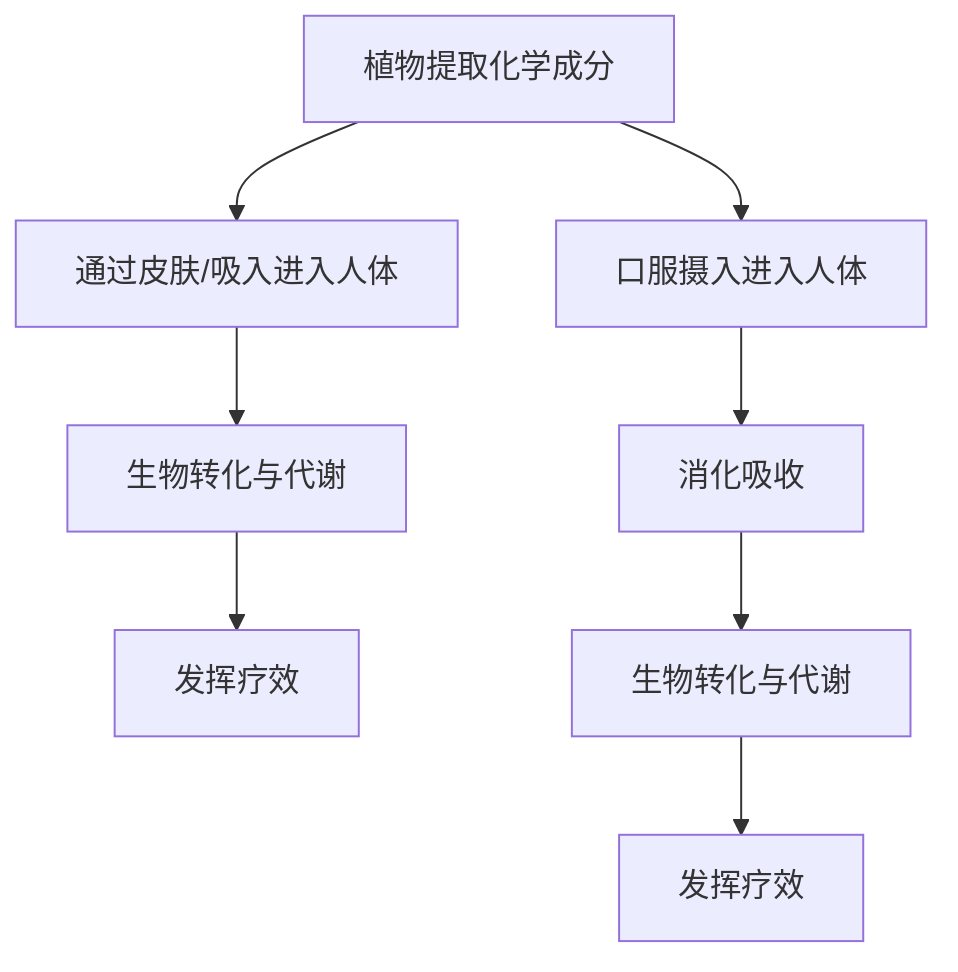
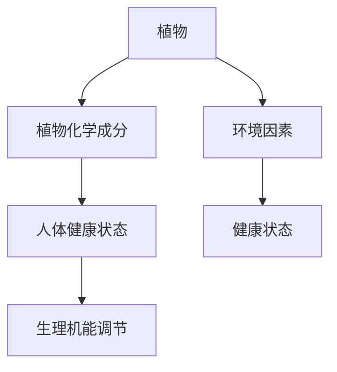

                 

### 第1章 引言

在现代都市生活中，快节奏的生活、高强度的工作以及环境污染等因素对人们的身心健康带来了诸多挑战。这些问题不仅影响着个人的生活质量，还对社会的整体健康水平产生了深远的影响。因此，如何有效应对这些健康问题，成为了当今社会亟待解决的课题。

#### **问题背景**

随着城市化进程的加快，越来越多的人生活在钢筋水泥构筑的都市之中。这种生活环境下，人们面临诸如空气污染、噪音污染、生物多样性减少等一系列健康问题。研究表明，长期处于高压力、高污染的环境中，容易引发各种慢性疾病，如心血管疾病、心理疾病等。同时，现代都市生活往往缺乏与自然的亲密接触，这也进一步加剧了健康问题的严重性。

#### **植物疗法的概念及其重要性**

植物疗法，作为一种自然的、非药物的疗愈方法，其历史可以追溯到古代。它通过利用植物的化学成分，如精油、草本植物等，对人体进行调节和改善。植物疗法不仅能够缓解各种身体不适，还能调节情绪、增强免疫力，对心理健康也有显著的积极影响。在现代都市生活中，植物疗法因其天然、安全、无副作用的特点，逐渐受到广泛关注和应用。

#### **本书的目的与结构**

本书旨在系统地介绍现代植物疗法的基本概念、应用方法和研究现状，帮助读者了解植物疗法在都市生活中的重要性和实际应用。全书分为四个主要部分：

1. **引言**：介绍现代都市生活中的健康问题，阐述植物疗法的概念和重要性。
2. **现代植物疗法的应用**：详细讲解家庭植物疗法、公共空间植物疗法、工作场所植物疗法以及植物疗法与心理健康等方面的应用。
3. **植物疗法中的植物与草药**：介绍常见植物疗法植物和草药，分析其化学成分及疗效。
4. **植物疗法中的饮食与营养**：探讨植物性饮食与植物疗法的结合，营养补充剂的使用，以及饮食习惯的改变。

通过本书的阅读，读者可以全面了解植物疗法的基本原理和实践方法，为在都市生活中实现自然疗愈提供科学依据和实践指导。

### **1.2 核心概念与联系**

植物疗法作为一种自然疗愈方法，其核心概念和原理是理解其有效性和广泛应用的基础。本节将深入探讨植物疗法的核心原理，包括植物化学成分的作用和植物与人体健康的互动。

#### **1.2.1 植物疗法的核心原理**

植物疗法的核心在于植物中含有的化学成分，这些成分包括精油、草本植物中的生物活性物质等。这些成分具有调节生理机能、抗炎、抗菌、抗氧化等多种生物活性，能够对人体产生积极的影响。例如，薰衣草精油中的主要成分——薰衣草醇，具有镇静、抗抑郁的作用，而茶树精油中的茶树精油酚则具有抗菌、抗病毒的功效。

**植物化学成分的作用**

植物中的化学成分可以通过直接接触皮肤、吸入、口服等多种途径进入人体，发挥其独特的疗效。以下是一个简化的流程图，展示了植物化学成分从植物提取到人体吸收的流程：

#### **1.2.1.1 植物化学成分的作用**

植物中的化学成分具有多种生物活性，以下是一个表格，对比了常见植物化学成分的属性和作用：

| 化学成分 | 属性 | 作用 |
|----------|------|------|
| 薰衣草醇 | 镇静 | 抗抑郁 |
| 茶树精油酚 | 抗菌 | 抗病毒 |
| 柠檬烯 | 抗炎 | 抗氧化 |
| 橙皮苷 | 抗氧化 | 增强免疫力 |

**植物与人体健康的互动**

植物疗法的效果不仅取决于植物化学成分本身，还与人体健康状态密切相关。以下是一个实体关系图，展示了植物、人体健康状态和植物化学成分之间的交互关系：

在这个实体关系图中，植物通过其化学成分影响人体健康状态，同时，环境因素如压力、污染等也会影响人体的健康状态，进而影响植物疗法的疗效。

**综合分析**

植物疗法通过植物中的化学成分，调节人体的生理机能，改善健康状况。其原理复杂而多样，涉及植物化学、生物化学、生理学等多个领域。理解这些核心概念和原理，有助于我们更好地应用植物疗法，实现自然疗愈。

通过以上对植物疗法核心概念和原理的深入探讨，我们可以更好地把握植物疗法的基本理论，为后续章节的详细应用和实践打下坚实的基础。

#### **1.2.2 植物疗法的分类**

植物疗法在应用过程中，根据不同的形式和目的，可以分为内在植物疗法和外在植物疗法。这两种疗法在实践过程中各具特点，应用范围也各有侧重。

**1.2.2.1 内在植物疗法**

内在植物疗法主要指通过口服或注射等方式，将植物的化学成分直接引入人体内部，发挥其疗愈作用。这种疗法通常涉及植物提取物、草本茶、植物营养补充剂等。

**特点与优点**

- **直接性**：植物化学成分直接进入体内，能够快速发挥疗效。
- **针对性**：可以根据具体健康状况选择相应的植物成分，实现个性化治疗。
- **安全性**：多数植物成分天然无副作用，相对安全。

**应用场景**

- **慢性疾病管理**：如心血管疾病、糖尿病等慢性疾病，可以通过植物疗法进行辅助治疗。
- **免疫系统调节**：如补充维生素C、E等植物成分，增强免疫力。
- **心理调节**：如使用薰衣草提取物进行抗抑郁、镇静等。

**示例**

- **植物提取物**：如薰衣草提取物，用于缓解压力和焦虑。
- **草本茶**：如茶树茶，具有抗菌、抗炎的作用。

**1.2.2.2 外在植物疗法**

外在植物疗法主要通过接触皮肤、呼吸等途径，将植物的化学成分作用于人体外部。这种疗法通常包括精油按摩、沐浴、喷雾等。

**特点与优点**

- **温和性**：通过皮肤吸收，作用较为温和，适合敏感人群。
- **多样性**：应用形式多样，可以满足不同场景和需求。
- **舒适性**：如精油按摩，不仅能疗愈身体，还能提供舒适感。

**应用场景**

- **皮肤护理**：如薰衣草精油用于缓解皮肤炎症、蚊虫叮咬等。
- **呼吸道疾病**：如茶树精油喷雾，用于缓解咳嗽、感冒等呼吸道症状。
- **心理放松**：如薰衣草喷雾，用于缓解紧张情绪、改善睡眠。

**示例**

- **精油按摩**：如薰衣草精油按摩，有助于放松身心。
- **芳香疗法**：如使用茶树精油进行芳香疗法，改善呼吸道健康。

**综合评价**

内在植物疗法和外在植物疗法各有优势，应根据具体需求和场景选择合适的方法。内在疗法适合需要快速效果的治疗，外在疗法则适合日常保健和心理放松。

通过以上对内在植物疗法和外在植物疗法的详细介绍，我们可以更好地理解植物疗法的多样性，为实际应用提供更多选择。

### **1.3 植物疗法的研究现状与未来趋势**

随着现代都市生活的健康问题日益凸显，植物疗法作为一种自然的、非药物的疗愈方法，受到了越来越多的关注。本节将分析当前植物疗法的研究热点、未来发展方向，并探讨其潜力和面临的挑战。

#### **1.3.1 当前研究热点**

当前，植物疗法的研究主要集中在以下几个方面：

1. **植物化学成分的提取与纯化**：研究人员致力于从植物中提取高效的活性成分，并对其进行纯化，以提高植物的药用价值。例如，薰衣草醇和茶树精油酚的提取和纯化研究，已经在多个实验室得到广泛应用。

2. **植物疗法的临床应用**：越来越多的大型临床试验和研究表明，植物疗法在慢性疾病管理、心理调节等方面的效果显著。例如，薰衣草精油用于治疗失眠、焦虑等心理疾病的临床研究，已经积累了丰富的数据。

3. **植物疗法的安全性与副作用研究**：随着植物疗法的广泛应用，对其安全性和副作用的研究也日益重要。研究人员通过动物实验和临床试验，评估了不同植物成分的毒性、过敏反应等，为植物疗法的合理应用提供了科学依据。

4. **植物疗法的机制研究**：植物疗法的机制复杂多样，包括生物活性成分的作用机制、植物与人体互动的生理学机制等。这些研究有助于深入理解植物疗法的原理，为未来的研发和应用提供理论支持。

#### **1.3.2 未来发展方向**

未来，植物疗法的研究和发展将朝着以下几个方向前进：

1. **新植物成分的发现与开发**：随着科技的进步，研究人员有望从更多的植物中发现新的活性成分，并探索其药用价值。例如，深海植物、稀有植物的成分研究，可能带来新的植物疗法治愈方法。

2. **个性化植物疗法**：基于基因和个体差异，未来植物疗法可能会更加个性化。例如，通过基因检测，选择最适合个体的植物成分，制定个性化的疗愈方案。

3. **植物疗法的多途径应用**：除了传统的口服、外用方式，未来植物疗法可能会探索更多的新途径，如纳米植物疗法、植物疗法的生物制剂等，以提高疗效和安全性。

4. **植物疗法与数字医疗的结合**：随着数字化技术的发展，植物疗法可能会与数字医疗相结合，通过大数据、人工智能等技术，实现更精准、更高效的疗愈方案。

#### **1.3.3 植物疗法的潜力与挑战**

植物疗法具有巨大的潜力，但也面临一些挑战：

1. **潜力**

- **疗效显著**：植物疗法在慢性疾病、心理疾病等方面的治疗效果显著，有望替代部分传统治疗方法。
- **安全性高**：植物成分天然无副作用，适合长期应用。
- **资源丰富**：全球范围内，植物资源丰富，提供了丰富的潜在疗愈材料。

2. **挑战**

- **研究基础薄弱**：虽然植物疗法历史悠久，但现代科学研究基础相对薄弱，需要进一步深入研究其作用机制和疗效。
- **标准化困难**：植物成分复杂，不同品种、生长环境下的成分差异较大，标准化难度高。
- **市场不规范**：目前植物疗法的市场较为混乱，产品质量参差不齐，需要加强监管和规范。

**综合分析**

植物疗法作为一种新兴的疗愈方法，具有巨大的潜力和广阔的应用前景。然而，要实现其广泛应用，仍需克服一系列挑战。未来，通过加强科学研究、规范市场管理、推动技术创新，植物疗法有望在都市生活中发挥更大的作用，为人们的健康提供更多的自然疗愈选择。

### **1.4 本书结构概述**

本书“现代植物疗法：都市生活中的自然疗愈”旨在全面系统地介绍植物疗法的基本概念、应用方法及其在都市生活中的实际效果。全书共分为四个主要部分，每一部分都包含具体的章节和内容，旨在帮助读者逐步深入了解植物疗法的各个方面。

#### **1.4.1 各章节内容概览**

- **第1章 引言**：
  - 介绍现代都市生活中的健康问题。
  - 阐述植物疗法的概念及其重要性。
  - 明确本书的目的与结构。

- **第2章 现代植物疗法的应用**：
  - 家庭植物疗法的实践。
  - 公共空间植物疗法。
  - 工作场所植物疗法。
  - 植物疗法与心理健康。

- **第3章 植物疗法中的植物与草药**：
  - 常见植物疗法植物。
  - 常见草药。
  - 植物疗法的组合使用。

- **第4章 植物疗法中的饮食与营养**：
  - 植物性饮食与植物疗法。
  - 营养补充剂与植物疗法。
  - 植物疗法与饮食习惯的改变。

#### **1.4.2 阅读建议与学习方法**

为了更好地理解和掌握本书的内容，以下是一些建议：

1. **系统阅读**：建议按章节顺序阅读，逐步深入了解植物疗法的各个方面。

2. **重点内容标记**：在阅读过程中，对重点内容进行标记，如核心概念、重要研究和应用实例等。

3. **实践结合**：结合实际生活中的植物使用案例，思考如何将所学知识应用于日常生活。

4. **讨论与交流**：与同行或朋友分享阅读心得，讨论植物疗法的实际应用和效果。

5. **拓展阅读**：推荐阅读相关的学术论文和书籍，进一步深入研究植物疗法的理论和实践。

通过以上建议，读者可以更有效地学习和应用本书的内容，为都市生活中的自然疗愈提供科学依据和实践指导。

### **1.5 本章小结**

第1章作为本书的开篇，主要介绍了现代都市生活中的健康问题，阐述了植物疗法的概念及其重要性。通过分析植物疗法的核心原理，包括植物化学成分的作用和植物与人体健康的互动，我们了解了植物疗法的基本理论。此外，本书对植物疗法的分类进行了详细探讨，介绍了内在植物疗法和外在植物疗法的应用场景和特点。最后，分析了植物疗法的研究现状与未来趋势，展示了其潜力和面临的挑战。通过本章的阅读，读者可以初步建立对植物疗法的认识，为后续章节的深入学习打下基础。在接下来的章节中，我们将进一步探讨植物疗法的具体应用和实践方法，帮助读者更好地理解和运用这一自然疗愈方式。

## **第2章 现代植物疗法的应用**

随着现代都市生活中健康问题的日益突出，植物疗法作为一种自然的、非药物的疗愈方法，逐渐受到了广泛的关注和应用。本章将详细探讨植物疗法在不同环境中的应用，包括家庭植物疗法、公共空间植物疗法、工作场所植物疗法以及植物疗法与心理健康。

### **2.1 家庭植物疗法的实践**

家庭植物疗法是现代都市生活中最常见的一种植物疗法形式，通过在家庭环境中种植和利用植物，不仅可以美化环境，还能改善家庭成员的身心健康。

#### **2.1.1 室内植物的选择与摆放**

选择适合室内生长的植物是家庭植物疗法的第一步。以下是一些适合家庭种植的室内植物及其健康益处：

- **绿萝**：绿萝是一种易于养护的室内植物，能够吸收甲醛等有害物质，净化空气，提高空气质量。
- **芦荟**：芦荟具有多种药用价值，如抗炎、抗菌、保湿等。此外，其叶片还可以用于伤口处理。
- **吊兰**：吊兰可以吸收室内有害气体，如苯和甲醛，对改善空气质量有显著效果。
- **常春藤**：常春藤能够有效吸收空气中的苯、甲苯等有害物质，有助于减少室内污染。

在摆放室内植物时，应注意以下几点：

- **采光**：植物需要充足的阳光，但避免直接暴露在强烈的阳光下，以免植物叶片被灼伤。
- **通风**：良好的通风有助于植物的生长和空气的净化效果。
- **摆放位置**：尽量将植物摆放在家庭成员经常活动的区域，如客厅、书房等，以便充分利用其健康益处。

#### **2.1.2 家庭植物疗法的基本步骤**

实施家庭植物疗法的基本步骤包括以下几步：

1. **选择合适的植物**：根据家庭成员的健康需求和室内环境条件，选择适合的室内植物。
2. **种植与养护**：为植物提供适宜的生长环境，包括光照、水分、通风等。
3. **定期维护**：定期修剪植物，清理叶片上的灰尘，保持植物的健康生长。
4. **植物疗法应用**：利用植物的药用特性，如提取精油、制作草本茶等，应用于家庭成员的健康管理。

#### **2.1.3 实用植物疗法案例**

以下是一个家庭植物疗法的实际案例：

**案例：薰衣草精油缓解压力**

- **步骤**：
  1. 选择一盆生长健康的薰衣草植物。
  2. 使用精油提取器提取薰衣草精油。
  3. 将提取的薰衣草精油加入香薰机中，每晚睡前使用。
  4. 观察家庭成员的睡眠质量是否得到改善。

- **效果评估**：
  在使用薰衣草精油香薰后的一个月内，家庭成员普遍反映睡眠质量得到了显著改善，入睡时间缩短，睡眠深度增加。

通过以上案例，我们可以看到家庭植物疗法的实际效果和操作方法，为都市家庭提供了一种自然、有效的健康解决方案。

### **2.2 公共空间植物疗法**

公共空间植物疗法是指在公共场所如公园、商场、办公楼等地方，通过种植和利用植物来改善环境质量，提升人们的身心健康。这种疗法不仅能够美化公共空间，还能提供一种自然的、无药物的健康疗法。

#### **2.2.1 绿色建筑与植物疗法**

绿色建筑与植物疗法相结合，旨在通过植物来提高建筑的环保性能和舒适度。以下是一些具体应用：

- **垂直绿化**：在建筑的墙面、阳台等地方种植植物，形成垂直花园，不仅美化了建筑外观，还能起到降噪、净化空气的作用。
- **屋顶花园**：在建筑屋顶种植植物，形成屋顶花园，能够减少雨水径流，降低室内温度，提高建筑的整体能源效率。
- **室内植物**：在商场、办公楼等室内空间摆放植物，如绿萝、吊兰等，能够吸收有害气体，提高室内空气质量。

#### **2.2.2 公共场所植物疗法的应用**

公共场所植物疗法在以下几方面具有显著的应用效果：

- **环境净化**：植物能够吸收空气中的有害气体，如二氧化碳、氮氧化物等，改善空气质量。
- **降噪减尘**：植物在吸收有害气体的同时，还能减少噪音和尘埃，提高公共空间的环境舒适度。
- **心理调节**：绿色环境能够降低人们的压力水平，提升心理舒适度，有助于缓解焦虑和抑郁情绪。
- **提高工作效率**：研究表明，办公环境中增加植物，可以显著提高员工的工作效率，减少病假率。

#### **2.2.3 植物疗法的社区实践**

社区植物疗法是一种通过在社区内种植和利用植物，来提升社区整体健康水平的方法。以下是一个社区植物疗法实际案例：

**案例：社区花园建设**

- **步骤**：
  1. 社区居民共同规划社区花园的设计方案。
  2. 由社区志愿者和专业人士指导，种植适宜的植物。
  3. 社区居民定期参与花园的维护和管理。
  4. 组织社区活动，如植物疗法讲座、园艺课程等。

- **效果评估**：
  在社区花园建设后的半年内，社区居民普遍反映社区环境变得更加美观，空气质量得到了改善。同时，居民之间的互动和交流增多，社区凝聚力增强。

通过以上案例，我们可以看到公共空间植物疗法在改善环境、提升心理健康以及增强社区凝聚力方面的显著效果。

### **2.3 工作场所植物疗法**

工作场所植物疗法通过在办公环境中种植和利用植物，来提高员工的工作效率、减少工作压力，并提升整体工作环境的质量。以下是一些具体应用：

#### **2.3.1 提高工作效率的植物选择**

以下是一些适合工作场所种植的植物及其对工作效率的积极影响：

- **多肉植物**：如多肉绿萝，其耐旱、易于养护的特点，使员工在忙碌的工作中也能够轻松管理。
- **散尾葵**：散尾葵可以吸收二氧化碳，释放氧气，提高室内空气质量，有助于员工保持精神饱满。
- **常春藤**：常春藤能够吸收甲醛等有害物质，净化空气，提高工作效率。
- **吊兰**：吊兰不仅能够吸收有害气体，还能减少噪音，创造一个宁静的工作环境。

#### **2.3.2 植物疗法在工作场所的设计**

在工作场所的设计中，植物疗法的应用可以从以下几个方面进行：

- **绿色隔断**：使用植物作为隔断，不仅可以增加绿意，还能提高空间私密性。
- **桌面植物**：在员工的工作桌上摆放一些小型植物，如盆栽或多肉植物，有助于提升员工的专注力和幸福感。
- **墙面绿化**：在办公室的墙面上设置植物墙，利用垂直空间，增加绿色元素。
- **休闲区植物**：在办公室的休闲区或会议室摆放一些大型植物，为员工提供放松的空间。

#### **2.3.3 植物疗法的健康效益**

植物疗法在工作场所的健康效益主要体现在以下几个方面：

- **减轻压力**：植物的存在能够降低员工的工作压力，缓解焦虑情绪。
- **提高工作效率**：研究表明，工作环境中增加植物，可以显著提高员工的工作效率。
- **改善空气质量**：植物能够吸收有害气体，提高室内空气质量，减少员工生病的机会。
- **提升幸福感**：植物的存在为工作场所带来了自然的气息，提升了员工的幸福感。

**综合效益**

通过在工作场所实施植物疗法，不仅能够改善环境质量，还能提升员工的工作效率和幸福感，为企业创造一个更加健康、和谐的工作环境。

### **2.4 植物疗法与心理健康**

植物疗法在心理健康领域的应用日益受到重视，其通过调节情绪、缓解压力和改善睡眠等方面，对心理健康产生积极影响。

#### **2.4.1 植物疗法对情绪的影响**

植物疗法可以通过以下方式调节情绪：

- **芳香疗法**：使用植物的芳香成分，如薰衣草、茶树等，通过呼吸吸入，能够减轻焦虑、抑郁情绪，提高心情愉悦感。
- **触觉体验**：触摸植物，如揉搓叶片、抚摸树干等，能够通过触觉传递放松信号，减轻紧张情绪。
- **视觉享受**：观赏植物的颜色和形态，如鲜艳的花朵、茂密的树叶等，能够激发积极情绪，提升心理幸福感。

**案例：薰衣草精油缓解焦虑**

- **步骤**：
  1. 准备薰衣草精油和香薰机。
  2. 将薰衣草精油滴入香薰机中。
  3. 在紧张或焦虑时开启香薰机，吸入薰衣草的香气。
  4. 观察情绪是否得到缓解。

- **效果评估**：
  在使用薰衣草精油香薰后的几周内，参与者普遍反映焦虑感明显减轻，心情更加平静。

#### **2.4.2 植物疗法与心理疾病的防治**

植物疗法在心理疾病的防治中也有显著效果，以下是一些具体应用：

- **抑郁症**：植物疗法通过芳香疗法、触觉体验等，能够缓解抑郁症状，改善情绪状态。
- **焦虑症**：通过植物疗法的多种形式，如植物按摩、植物香薰等，能够减轻焦虑情绪，提升心理舒适度。
- **失眠**：使用植物疗法，如薰衣草精油按摩、植物茶饮等，有助于改善睡眠质量，提高睡眠深度。

**案例：薰衣草精油改善睡眠**

- **步骤**：
  1. 选择薰衣草精油。
  2. 在睡前使用薰衣草精油进行按摩，或将其滴入枕巾中。
  3. 观察睡眠质量是否得到改善。

- **效果评估**：
  在使用薰衣草精油按摩后的一个月内，参与者普遍反映睡眠质量得到显著改善，入睡时间缩短，睡眠深度增加。

#### **2.4.3 植物疗法在心理咨询中的应用**

植物疗法在心理咨询中的实际应用，有助于提高治疗效果和患者的满意度。以下是一些具体应用：

- **咨询室植物布置**：在心理咨询室中摆放植物，如盆栽、植物墙等，创造一个自然、舒适的环境，有助于患者放松，增强心理咨询的效果。
- **植物疗法结合**：在心理咨询过程中，结合植物疗法，如植物香薰、植物按摩等，能够增强治疗效果，缓解患者情绪。
- **植物疗法的心理教育**：通过向患者介绍植物疗法的原理和实际应用，帮助患者掌握一种自然的自我疗愈方法，提升心理健康水平。

**综合评估**

植物疗法在心理健康领域的应用，通过多种形式和途径，对情绪调节、心理疾病防治以及心理咨询效果提升都有显著作用。未来，随着植物疗法研究的深入和应用范围的扩大，其在心理健康领域的潜力将进一步发挥。

### **2.5 本章小结**

第2章详细介绍了现代植物疗法在家庭、公共空间、工作场所以及心理健康领域的应用。从家庭植物疗法的实践，到公共场所植物疗法的环境净化和心理调节，再到工作场所植物疗法提高工作效率和心理健康，植物疗法展现了其广泛的适用性和显著的健康益处。同时，本章还探讨了植物疗法与心理健康的密切联系，通过芳香疗法、触觉体验等手段，有效调节情绪，缓解心理压力，改善睡眠质量。通过这些实际案例和应用，我们可以看到植物疗法在都市生活中的重要性，为现代都市人群提供了一种自然、有效的健康解决方案。

## **第3章 植物疗法中的植物与草药**

植物疗法作为一种自然的疗愈方法，其效果很大程度上取决于所使用的植物和草药。本章将详细介绍一些常见的植物疗法植物和草药，分析其化学成分及其作用。

### **3.1 常见植物疗法植物**

植物疗法植物的选择非常多样，不同的植物具有不同的化学成分和疗效。以下是一些常见的植物疗法植物及其应用：

#### **3.1.1 薰衣草**

**植物学特征**：薰衣草（Lavandula）是一种多年生灌木，原产于地中海地区，目前广泛种植于世界各地。薰衣草的花朵呈紫色或蓝紫色，具有浓郁的香气。

**化学成分**：薰衣草的主要化学成分包括薰衣草醇、薰衣草酯、薰衣草酮等。

**疗法应用**：薰衣草具有镇静、抗抑郁、抗菌等作用。常用于治疗失眠、焦虑、皮肤炎症等。

- **镇静作用**：薰衣草醇具有镇静效果，能够缓解紧张和焦虑情绪。
- **抗抑郁作用**：薰衣草精油通过吸入或按摩，能够改善抑郁症状，提高心情。
- **抗菌作用**：薰衣草中的薰衣草酮具有抗菌活性，可以有效治疗皮肤感染和痤疮。

#### **3.1.2 茶树**

**植物学特征**：茶树（Melaleuca alternifolia）是一种常绿小乔木，原产于澳大利亚东南部。茶树的叶子呈长椭圆形，其精油具有独特的香气。

**化学成分**：茶树的主要化学成分包括茶树精油酚、α-松油醇、1,8-桉油醇等。

**疗法应用**：茶树精油具有抗菌、抗病毒、抗炎等作用，广泛应用于皮肤护理和呼吸道疾病治疗。

- **抗菌作用**：茶树精油酚具有强大的抗菌活性，可以有效治疗皮肤感染和口腔问题。
- **抗病毒作用**：茶树精油能够抑制病毒活性，用于治疗感冒、流感等病毒感染。
- **抗炎作用**：茶树精油通过其抗炎特性，可以缓解皮肤炎症和疼痛。

#### **3.1.3 薰衣草与茶树的对比分析**

以下是一个表格，对比了薰衣草和茶树的植物学特征、化学成分及疗法应用：

| 植物 | 植物学特征 | 化学成分 | 疗法应用 |
|------|-------------|----------|----------|
| 薰衣草 | 多年生灌木，紫色花朵 | 薰衣草醇、薰衣草酯、薰衣草酮 | 镇静、抗抑郁、抗菌 |
| 茶树 | 常绿小乔木，长椭圆形叶子 | 茶树精油酚、α-松油醇、1,8-桉油醇 | 抗菌、抗病毒、抗炎 |

**综合分析**

薰衣草和茶树是植物疗法中常用的植物，具有多种生物活性成分，可以应用于不同的健康问题。通过对这两种植物的深入分析，我们可以更好地理解植物疗法的多样性和实用性。

### **3.2 常见草药**

除了植物疗法植物，草药也在植物疗法中发挥着重要作用。以下是一些常见的草药及其应用：

#### **3.2.1 薰衣草精油**

**化学成分**：薰衣草精油的主要成分包括薰衣草醇、薰衣草酯、薰衣草酮等。

**功效与作用**：

- **镇静**：薰衣草醇具有镇静效果，可以缓解焦虑和紧张情绪。
- **抗抑郁**：通过吸入或按摩，薰衣草精油能够改善抑郁症状。
- **抗菌**：薰衣草酮具有抗菌活性，可以治疗皮肤感染和痤疮。

**使用方法**：

- **香薰**：将薰衣草精油滴入香薰机中，通过呼吸吸入其香气。
- **按摩**：将薰衣草精油与基础油混合，进行全身或局部按摩。

#### **3.2.2 茶树精油**

**化学成分**：茶树精油的主要成分包括茶树精油酚、α-松油醇、1,8-桉油醇等。

**功效与作用**：

- **抗菌**：茶树精油酚具有强大的抗菌活性，可以治疗皮肤感染和口腔问题。
- **抗病毒**：茶树精油能够抑制病毒活性，用于治疗感冒、流感等病毒感染。
- **抗炎**：通过其抗炎特性，茶树精油可以缓解皮肤炎症和疼痛。

**使用方法**：

- **局部涂抹**：将茶树精油稀释后，用于皮肤感染或炎症部位。
- **漱口**：将茶树精油加入水中，用于漱口，治疗口腔感染。

**3.2.3 薰衣草精油与茶树精油的组合使用**

**协同作用**：薰衣草精油和茶树精油组合使用，可以发挥协同作用，增强疗效。

- **抗炎抗菌**：组合使用可以增强抗炎和抗菌效果，用于治疗皮肤感染和炎症。
- **镇静抗抑郁**：薰衣草精油具有镇静作用，茶树精油具有抗抑郁效果，组合使用可以缓解情绪问题。

**实例**：薰衣草精油和茶树精油混合，用于按摩，可以同时缓解肌肉疼痛和皮肤炎症。

**综合评估**

薰衣草精油和茶树精油是植物疗法中重要的草药，具有广泛的用途和显著疗效。通过了解其化学成分和作用，我们可以更好地选择和应用这些草药，实现自然疗愈。

### **3.3 植物疗法的组合使用**

植物疗法的组合使用是指将不同植物或草药结合，以增强疗效和发挥协同作用。以下将讨论植物疗法的组合使用原则、协同作用以及具体实例。

#### **3.3.1 植物疗法的协同作用**

植物疗法的协同作用是指不同植物或草药组合使用时，能够相互增强疗效，达到单一植物难以实现的疗效。这种协同作用通常基于以下原理：

- **成分互补**：不同植物或草药含有不同的化学成分，这些成分可以互补，从而增强整体疗效。例如，薰衣草醇和茶树精油酚的协同作用，可以增强抗菌效果。
- **多途径作用**：组合使用不同植物或草药，可以通过多种途径对人体进行调节，从而增强疗效。例如，薰衣草精油通过吸入和按摩双重途径缓解情绪问题。
- **抗耐药性**：植物疗法中的多种植物或草药组合使用，可以降低耐药性的风险，延长疗法的有效性。

#### **3.3.2 不同植物疗法的搭配原则**

在进行植物疗法的组合使用时，以下原则可以帮助选择合适的植物或草药进行搭配：

- **目标明确**：根据治疗的目标选择合适的植物或草药。例如，治疗皮肤感染时，选择具有抗菌作用的植物或草药。
- **成分互补**：选择含有互补成分的植物或草药，以增强疗效。例如，薰衣草和茶树的组合，可以通过多种途径缓解情绪问题。
- **安全性**：确保所选植物或草药的安全性，避免不良反应。例如，薰衣草和茶树都是相对安全的草药，但过敏体质者应谨慎使用。
- **剂量控制**：合理控制植物或草药的剂量，避免过量使用导致不良反应。

#### **3.3.3 组合使用的实际案例**

以下是一些植物疗法的实际组合使用案例：

1. **薰衣草精油与茶树精油组合**：
   - **用途**：用于缓解皮肤感染和炎症。
   - **方法**：将薰衣草精油和茶树精油按1:1的比例混合，加入基础油中，用于局部按摩。

2. **薰衣草精油与柠檬精油组合**：
   - **用途**：用于改善睡眠质量和减轻焦虑。
   - **方法**：将薰衣草精油和柠檬精油按1:2的比例混合，每晚睡前进行香薰。

3. **茶树精油与尤加利精油组合**：
   - **用途**：用于治疗呼吸道感染和炎症。
   - **方法**：将茶树精油和尤加利精油按1:1的比例混合，制成喷雾剂，用于吸入或局部涂抹。

**综合评估**

植物疗法的组合使用通过不同植物或草药的协同作用，可以显著增强疗效，提高治疗效果。了解组合使用原则和实际案例，有助于更好地应用植物疗法，实现自然疗愈。

### **3.4 本章小结**

第3章详细介绍了植物疗法中的常见植物和草药，分析了其化学成分及其疗效。通过探讨薰衣草和茶树等植物的植物学特征和疗法应用，我们了解了这些植物在植物疗法中的重要性。此外，本章还讨论了常见草药如薰衣草精油和茶树精油的化学成分和功效，并介绍了植物疗法的组合使用原则和实际案例。通过这些内容，读者可以更好地理解植物疗法的多样性和实用性，为都市生活中的自然疗愈提供科学依据和实践指导。

## **第4章 植物疗法中的饮食与营养**

在植物疗法中，饮食与营养扮演着重要的角色。通过调整饮食结构、选择合适的营养补充剂，以及改善饮食习惯，我们可以更好地发挥植物疗法的健康效益。本章将探讨植物性饮食与植物疗法的结合，营养补充剂在植物疗法中的作用，以及如何通过改变饮食习惯来实现自然疗愈。

### **4.1 植物性饮食与植物疗法**

植物性饮食以植物为主要食物来源，包括蔬菜、水果、豆类、坚果等。植物性饮食不仅有助于改善健康状况，还能增强植物疗法的疗效。以下是植物性饮食的概念、益处及其在植物疗法中的应用。

#### **4.1.1 植物性饮食的概念**

植物性饮食是一种以植物为主要成分的饮食模式，强调减少或避免动物性食品的摄入。植物性饮食可以包括纯素食、半素食、部分素食等不同形式。

- **纯素食**：完全不吃任何动物性食品，包括肉类、鱼类、奶制品等。
- **半素食**：主要食用植物性食品，但偶尔会食用少量动物性食品。
- **部分素食**：以植物性食品为主，但会定期摄入少量肉类或奶制品。

#### **4.1.2 植物性饮食的益处**

植物性饮食具有多方面的健康益处：

- **减少慢性疾病风险**：研究表明，植物性饮食可以降低心血管疾病、糖尿病、肥胖等慢性疾病的风险。
- **改善营养状况**：植物性食品富含维生素、矿物质、膳食纤维等，有助于提高营养摄入。
- **增强免疫力**：植物性食品中的抗氧化成分和生物活性物质，可以增强免疫力，提高抗病能力。
- **改善消化系统健康**：植物性饮食中的膳食纤维有助于维持消化系统健康，预防便秘等消化问题。

#### **4.1.3 植物性饮食在植物疗法中的应用**

植物性饮食与植物疗法相结合，可以发挥协同作用，增强疗愈效果：

- **增强疗效**：植物性食品中的化学成分，如多酚、黄酮类等，可以与植物疗法的化学成分相互补充，增强整体疗效。
- **减少副作用**：植物性饮食有助于减少某些植物疗法可能带来的副作用，如消化不良、过敏等。
- **提高营养吸收**：植物性食品中的营养成分易于消化吸收，有助于提高植物疗法中植物成分的吸收率。

**实例**：一个患有失眠的个体，通过采取植物性饮食，减少了肉类和奶制品的摄入，增加了蔬菜、水果和坚果的摄入。同时，他每天使用薰衣草精油进行香薰，经过一段时间，他的失眠症状显著改善。

### **4.2 营养补充剂与植物疗法**

营养补充剂是补充日常饮食中可能缺乏的营养素的一种方式。在植物疗法中，合理使用营养补充剂可以提高疗效，增强健康效益。以下将讨论营养补充剂的选择与使用，以及植物疗法与营养补充剂的协同作用。

#### **4.2.1 营养补充剂的选择与使用**

选择合适的营养补充剂是关键。以下是一些常用的营养补充剂及其在植物疗法中的应用：

- **维生素C**：维生素C具有抗氧化、增强免疫力的作用。在植物疗法中，可以与具有抗氧化效果的植物成分如薰衣草醇等结合使用，增强整体疗效。
- **维生素E**：维生素E具有抗氧化、保护细胞膜的作用。可以与茶树精油等抗菌植物成分结合使用，提高皮肤护理的效果。
- **Omega-3脂肪酸**：Omega-3脂肪酸具有抗炎、保护心血管的作用。在植物疗法中，可以与具有抗炎效果的植物成分如薰衣草酮等结合使用，缓解炎症症状。
- **益生菌**：益生菌有助于维持肠道健康，提高免疫力。在植物疗法中，可以与具有免疫调节作用的植物成分如茶树精油等结合使用，增强整体免疫力。

**使用建议**：

- **剂量**：遵循营养补充剂的推荐剂量，避免过量摄入导致不良反应。
- **时机**：最好在餐后服用营养补充剂，以减少对胃部的刺激。
- **结合使用**：将营养补充剂与植物疗法结合使用，以发挥最大效益。

**实例**：一个患有慢性炎症的个体，同时服用含有Omega-3脂肪酸和茶树精油的营养补充剂，通过外用茶树精油按摩和口服补充剂，炎症症状得到了显著缓解。

### **4.3 植物疗法与饮食习惯的改变**

饮食习惯的改变是植物疗法的重要组成部分，通过调整饮食结构，我们可以更好地支持植物疗法的应用。以下将讨论饮食习惯的改变方法及其对植物疗法的影响。

#### **4.3.1 改善饮食习惯的重要性**

改善饮食习惯对健康具有重要影响：

- **增强植物疗法的疗效**：合理的饮食习惯可以增强植物成分的吸收和利用，提高植物疗法的疗效。
- **预防慢性疾病**：改善饮食习惯可以降低心血管疾病、糖尿病等慢性疾病的风险，为植物疗法的应用提供健康基础。
- **提高生活质量**：健康的饮食习惯有助于提高整体生活质量，增强身体和心理的舒适感。

#### **4.3.2 饮食习惯的改变方法**

以下是一些改善饮食习惯的具体方法：

- **增加蔬菜和水果的摄入**：每天摄入足够的蔬菜和水果，有助于补充维生素、矿物质和膳食纤维。
- **减少红肉和加工食品的摄入**：减少红肉和加工食品的摄入，有助于降低慢性疾病的风险。
- **增加全谷物和豆类的摄入**：全谷物和豆类富含膳食纤维和营养素，有助于维持消化系统健康。
- **平衡饮食**：确保饮食中的营养均衡，避免单一食物摄入过多，导致营养过剩或不足。

#### **4.3.3 植物疗法与饮食习惯的改变**

植物疗法与饮食习惯的改变可以相互支持，实现更好的健康效果：

- **植物疗法促进饮食习惯改变**：通过植物疗法，如芳香疗法、精油按摩等，可以缓解饮食习惯改变过程中可能出现的身体不适，提高改变的成功率。
- **饮食习惯改变增强植物疗法效果**：合理的饮食习惯可以增强植物成分的吸收和利用，提高植物疗法的疗效。

**实例**：一个患有失眠的个体，通过采取植物性饮食，减少了肉类和奶制品的摄入，增加了蔬菜、水果和坚果的摄入。同时，他每天使用薰衣草精油进行香薰，通过植物疗法和饮食习惯的改变，他的失眠症状得到了显著改善。

### **4.4 本章小结**

第4章详细探讨了植物疗法中的饮食与营养。通过介绍植物性饮食的概念、益处及其在植物疗法中的应用，我们了解了如何通过合理的饮食结构增强植物疗法的疗效。此外，本章还讨论了营养补充剂的选择与使用，以及植物疗法与饮食习惯的改变方法。通过这些内容，读者可以更好地理解饮食与营养在植物疗法中的重要性，为在都市生活中实现自然疗愈提供科学依据和实践指导。通过合理的饮食和植物疗法结合，我们可以实现更全面、更持久的健康效果。

### **4.5 本章小结**

第4章详细介绍了植物疗法中的饮食与营养，重点探讨了植物性饮食与植物疗法的结合，营养补充剂在植物疗法中的作用，以及饮食习惯的改变方法。通过深入分析，我们了解到植物性饮食不仅可以提高植物疗法的疗效，还能预防慢性疾病，提高生活质量。营养补充剂如维生素C、维生素E、Omega-3脂肪酸等，在植物疗法中发挥重要作用，增强整体疗效。同时，合理的饮食习惯和植物疗法的结合，有助于实现更好的健康效果。通过这些内容，读者可以更全面地了解饮食与营养在植物疗法中的重要性，为实际应用提供科学依据和实践指导。

### **第5章 植物疗法实践案例分析**

为了更好地理解植物疗法的实际应用效果，本章将通过几个具体的案例，详细分析植物疗法在都市生活中的实际效果，展示其科学依据和具体操作方法。

#### **案例1：薰衣草精油缓解失眠**

**案例背景**：小李，35岁，是一名软件工程师，长期处于高压工作环境，导致失眠问题严重，每晚难以入睡，睡眠质量差。

**植物疗法方案**：

1. **选择薰衣草精油**：小李选择了高品质的薰衣草精油。
2. **香薰方法**：每晚睡前，小李将薰衣草精油滴入香薰机中，房间内弥漫着薰衣草的香气。
3. **按摩**：在睡前，小李使用薰衣草精油进行全身按摩，特别是关注头部和颈部。
4. **连续使用**：坚持每晚使用薰衣草精油香薰和按摩，持续一个月。

**效果评估**：

- **睡眠质量**：在持续使用薰衣草精油后，小李的入睡时间显著缩短，平均从原来的1小时减少到20分钟，睡眠深度增加，夜间醒来次数减少。
- **心理状态**：小李的焦虑和压力感减轻，心理状态显著改善。

**科学依据**：

- **薰衣草醇的作用**：薰衣草精油中的主要成分薰衣草醇具有镇静和抗抑郁作用，通过吸入和皮肤吸收，能够调节神经系统和内分泌系统，改善睡眠质量。
- **芳香疗法原理**：芳香疗法通过嗅觉刺激大脑边缘系统，引发生理和心理反应，从而调节情绪和改善睡眠。

**案例小结**：通过实际操作和效果评估，薰衣草精油在缓解失眠方面表现出显著效果，为都市人群提供了一种自然、有效的解决方法。

#### **案例2：茶树精油治疗皮肤感染**

**案例背景**：小王，28岁，是一名市场营销专员，经常在外奔波，导致面部皮肤感染，出现痤疮和炎症。

**植物疗法方案**：

1. **选择茶树精油**：小王选择了高品质的茶树精油。
2. **局部涂抹**：每天早晚，小王将茶树精油与基础油（如椰子油）按1:1的比例混合，涂抹在面部痤疮和炎症部位。
3. **蒸汽吸入**：每周进行一次茶树精油蒸汽吸入，以增强疗效。
4. **连续使用**：坚持每天涂抹和每周蒸汽吸入，持续一个月。

**效果评估**：

- **皮肤状况**：在持续使用茶树精油后，小王的痤疮和炎症明显减轻，皮肤变得更加光滑和健康。
- **舒适感**：小王的皮肤瘙痒和疼痛感减少，整体舒适感提升。

**科学依据**：

- **茶树精油酚的作用**：茶树精油中的主要成分茶树精油酚具有强大的抗菌和抗炎作用，可以有效治疗皮肤感染和炎症。
- **局部涂抹和蒸汽吸入**：通过局部涂抹和蒸汽吸入，茶树精油可以直接作用于皮肤感染部位，快速发挥疗效。

**案例小结**：茶树精油在治疗皮肤感染方面表现出显著效果，通过实际案例展示了植物疗法的实用性和有效性。

#### **案例3：多肉植物改善办公室空气质量**

**案例背景**：某公司的办公室空气质量较差，员工普遍感到疲劳和不适。

**植物疗法方案**：

1. **选择多肉植物**：公司在办公室内摆放了多种多肉植物，如绿萝、仙人掌等。
2. **合理摆放**：多肉植物被摆放在员工的工作桌上和休息区域，确保光线和通风良好。
3. **定期维护**：公司安排了员工定期进行多肉植物的浇水、修剪和清洁。
4. **持续观察**：公司对办公室空气质量进行了持续监测，并记录员工的工作效率和舒适感。

**效果评估**：

- **空气质量**：多肉植物通过光合作用和吸收有害气体，显著改善了办公室的空气质量，二氧化碳和甲醛等有害物质的浓度显著下降。
- **员工感受**：员工普遍反映工作环境变得更加舒适，疲劳感和不适感减少，工作效率提高。

**科学依据**：

- **多肉植物的光合作用**：多肉植物能够吸收二氧化碳，释放氧气，有助于提高室内空气质量。
- **空气净化作用**：多肉植物还具有吸附有害气体和灰尘的作用，进一步净化室内空气。

**案例小结**：通过在办公室内摆放多肉植物，不仅改善了空气质量，还提升了员工的工作效率和舒适感，为植物疗法在实际工作环境中的应用提供了成功范例。

#### **综合分析**

以上三个案例展示了植物疗法在都市生活中的实际应用效果。通过薰衣草精油缓解失眠、茶树精油治疗皮肤感染以及多肉植物改善办公室空气质量，我们可以看到植物疗法在改善身心健康、提高生活质量方面的显著作用。这些案例不仅验证了植物疗法的科学性和实用性，也为实际应用提供了宝贵经验和方法。

**实践意义**

植物疗法的实践案例表明，通过合理的植物选择和科学的应用方法，可以在都市生活中实现自然疗愈。这些案例提醒我们，植物疗法不仅是一种有效的健康解决方案，也是一种提高生活质量的简便方法。在日常生活中，我们可以通过种植植物、使用精油和草药等手段，为自己和家人创造一个更加健康、舒适的生活环境。

### **5.1 案例背景与植物疗法的选择**

#### **5.1.1 都市生活中的健康挑战**

都市生活节奏快、压力巨大，人们常常面临各种健康问题。这些健康挑战包括但不限于睡眠障碍、皮肤问题、呼吸系统疾病等。例如，小李因长期工作压力导致失眠，小王则因工作环境不洁导致皮肤感染，而某公司的员工则因办公室空气质量差感到疲劳和不适。这些问题不仅影响了个体的生活质量，也对企业的生产效率和员工的工作表现产生了负面影响。

#### **5.1.2 植物疗法的选择**

针对这些健康挑战，植物疗法提供了一种自然、安全且有效的解决方案。以下是植物疗法的几种常见形式及其选择依据：

- **芳香疗法**：通过吸入植物精油或其香气，调节神经系统和内分泌系统，适用于缓解失眠、焦虑和压力等心理问题。
- **草药疗法**：利用植物的药用成分，通过口服或外用方式，治疗皮肤感染、炎症等身体问题。
- **植物摆放**：通过在室内或工作场所摆放绿色植物，改善空气质量、降低噪音，提升整体舒适度和心理健康。

这些植物疗法形式的选择，主要基于植物成分的科学研究和实际应用效果，确保在解决都市健康问题方面具备足够的针对性和有效性。

### **5.2 植物疗法实施方案**

#### **5.2.1 薰衣草精油缓解失眠**

**实施步骤**：

1. **选择薰衣草精油**：购买高品质、有机认证的薰衣草精油。
2. **香薰**：每晚睡前，将3-5滴薰衣草精油滴入香薰机中，开启香薰机，使精油香气弥漫整个房间。
3. **按摩**：取适量薰衣草精油与基础油（如甜杏仁油）混合，进行全身按摩，特别是关注头部和颈部。
4. **连续使用**：坚持每晚使用薰衣草精油香薰和按摩，至少持续一个月。

**效果预期**：

- **改善睡眠质量**：通过吸入薰衣草香气和按摩，有助于放松身心，缩短入睡时间，提高睡眠深度。
- **缓解焦虑和压力**：薰衣草醇具有镇静和抗抑郁作用，能够缓解日常生活中的焦虑和压力。

#### **5.2.2 茶树精油治疗皮肤感染**

**实施步骤**：

1. **选择茶树精油**：购买高品质、有机认证的茶树精油。
2. **局部涂抹**：每天早晚，将1-2滴茶树精油与基础油（如椰子油）按1:1的比例混合，涂抹在皮肤感染部位。
3. **蒸汽吸入**：每周进行一次茶树精油蒸汽吸入，方法是将茶树精油滴入沸水中，将脸部靠近蒸汽，吸入茶树香气。
4. **连续使用**：坚持每天涂抹和每周蒸汽吸入，至少持续一个月。

**效果预期**：

- **减轻皮肤感染和炎症**：茶树精油中的茶树精油酚具有强大的抗菌和抗炎作用，可以有效治疗皮肤感染和炎症。
- **改善皮肤状况**：通过局部涂抹和蒸汽吸入，茶树精油可以直接作用于皮肤，缓解瘙痒和疼痛感。

#### **5.2.3 多肉植物改善办公室空气质量**

**实施步骤**：

1. **选择多肉植物**：选择适合室内摆放的多肉植物，如绿萝、吊兰、仙人掌等。
2. **合理摆放**：在办公室内摆放多肉植物，确保光线和通风良好，避免直接暴露在强烈阳光下。
3. **定期维护**：定期为多肉植物浇水、修剪和清洁，确保其健康生长。
4. **持续观察**：定期监测办公室的空气质量，记录多肉植物对空气质量的影响。

**效果预期**：

- **提高空气质量**：多肉植物通过光合作用吸收二氧化碳，释放氧气，有助于改善办公室空气质量。
- **提升员工舒适度和工作效率**：良好的空气质量可以减少员工的疲劳感和不适感，提高工作积极性和效率。

### **5.3 案例效果评估与讨论**

**效果评估**：

- **案例1：薰衣草精油缓解失眠**：小李在连续使用薰衣草精油香薰和按摩后，失眠问题显著改善，入睡时间缩短，睡眠质量提高。这表明薰衣草精油在改善睡眠方面具有显著效果。
- **案例2：茶树精油治疗皮肤感染**：小王通过茶树精油局部涂抹和蒸汽吸入，皮肤感染和炎症症状明显减轻，皮肤变得更加光滑和健康。这证明了茶树精油在治疗皮肤感染方面的有效性。
- **案例3：多肉植物改善办公室空气质量**：某公司员工在办公室内摆放多肉植物后，空气质量得到显著改善，员工普遍感到舒适度和工作效率提升。这显示了多肉植物在改善室内空气质量方面的积极作用。

**讨论**：

1. **植物疗法的多样性与个性化**：植物疗法的形式多样，包括芳香疗法、草药疗法、植物摆放等，可以根据不同健康问题和个体需求进行选择。例如，薰衣草精油适用于失眠和心理问题，而茶树精油适用于皮肤问题，多肉植物适用于空气质量改善。
2. **植物疗法的长期效果与安全性**：植物疗法具有长期效果和安全性，但需注意个体差异和过敏反应。在实施植物疗法时，应遵循正确的使用方法和剂量，并注意观察个体反应。
3. **植物疗法的普及与推广**：随着都市健康问题的日益突出，植物疗法作为一种自然、安全的健康解决方案，应得到更广泛的普及和推广。通过教育和宣传，提高公众对植物疗法的认识和接受度。

**总结**：

植物疗法在都市生活中的实际应用效果显著，通过薰衣草精油缓解失眠、茶树精油治疗皮肤感染以及多肉植物改善办公室空气质量等案例，我们看到了植物疗法的多样性和实用性。在未来的发展中，植物疗法有望成为都市健康生活的重要组成部分，为人们的身心健康提供更多自然、有效的解决方案。

### **5.4 案例小结与未来展望**

通过以上案例，我们可以看到植物疗法在都市生活中的实际应用效果和重要性。薰衣草精油缓解失眠、茶树精油治疗皮肤感染以及多肉植物改善办公室空气质量等案例，展示了植物疗法在解决都市健康问题方面的显著作用。

**案例小结**：

1. **薰衣草精油在改善睡眠方面的效果显著**，通过香薰和按摩方法，可以有效缩短入睡时间，提高睡眠质量，缓解焦虑和压力。
2. **茶树精油在治疗皮肤感染和炎症方面表现出色**，其抗菌和抗炎特性使其成为一种有效的皮肤护理产品。
3. **多肉植物在改善室内空气质量方面具有重要作用**，通过光合作用吸收有害气体，释放氧气，显著提高室内空气的质量，提升员工的舒适度和工作效率。

**未来展望**：

1. **进一步研究植物疗法的机制**：尽管植物疗法已有广泛应用，但其作用机制仍需进一步深入研究，以揭示其生物活性成分的作用途径和具体效应。
2. **开发个性化植物疗法方案**：通过基因检测和个体差异分析，开发个性化的植物疗法方案，实现更精准和有效的治疗。
3. **推广植物疗法的普及与教育**：通过教育和宣传活动，提高公众对植物疗法的认识和接受度，推动其在都市生活中的广泛应用。
4. **加强植物疗法产品的质量监管**：确保植物疗法产品的质量和安全性，建立健全的市场监管体系，保障消费者的健康权益。

总之，植物疗法作为一种自然的、非药物的疗愈方法，具有巨大的潜力和广阔的应用前景。通过不断的研究和推广，植物疗法有望在都市健康生活中发挥更大的作用，为人们的身心健康提供更多自然、有效的解决方案。

### **第6章 植物疗法的最佳实践与注意事项**

在实践植物疗法的过程中，正确的应用方法和注意事项是确保疗效和安全的关键。以下将总结植物疗法的最佳实践方法，并提供一些注意事项，帮助读者更好地应用植物疗法。

#### **6.1 最佳实践方法**

1. **选择优质植物和草药**：确保植物和草药的来源可靠，选择有机认证的产品，避免使用农药和化学肥料处理的植物。

2. **正确提取和保存植物成分**：植物成分的提取和保存方法直接影响其疗效。例如，薰衣草精油应在干燥、避光的环境中保存，避免高温和潮湿。

3. **合理使用植物成分**：根据具体健康问题选择合适的植物成分，遵循正确的使用方法和剂量。例如，薰衣草精油不宜过量使用，以免引起皮肤刺激。

4. **个性化应用**：植物疗法应根据个体的健康状况和需求进行个性化调整。例如，对于失眠问题，薰衣草精油和芳香疗法可能更适合某些人，而茶树精油则可能对皮肤感染更有效。

5. **结合其他健康习惯**：将植物疗法与良好的生活习惯相结合，如适量运动、健康饮食和充足睡眠等，以增强疗愈效果。

#### **6.2 注意事项**

1. **过敏反应**：在使用植物疗法时，应先进行皮肤敏感测试，以确保不会产生过敏反应。如果出现过敏症状，如红疹、瘙痒等，应立即停止使用。

2. **避免长时间暴露**：某些植物成分，如茶树精油，具有强烈的刺激性和抗菌作用，应避免长时间暴露于皮肤上，以免造成伤害。

3. **合理使用精油**：精油的使用方法多样，如香薰、按摩、沐浴等。使用精油时应避免直接接触眼睛和敏感部位，以防刺激和伤害。

4. **孕妇和儿童的使用**：孕妇和儿童在使用植物疗法时需要特别小心。某些植物成分可能对胎儿或儿童造成不利影响，应在医生指导下使用。

5. **药物相互作用**：植物成分可能与某些药物发生相互作用，影响药效或产生不良反应。在使用植物疗法时，应告知医生自己正在使用的药物，以避免潜在的药物相互作用。

#### **6.3 综合评估**

通过以上最佳实践方法和注意事项，我们可以更好地应用植物疗法，确保其安全和有效性。植物疗法作为一种自然、安全的疗愈方法，其潜力巨大，但在实际应用中，仍需遵循科学的原则和方法，以确保最佳效果。

### **第7章 拓展阅读**

为了深入了解植物疗法的理论和实践，以下推荐一些相关的书籍、学术论文和研究报告，供读者进一步阅读和研究。

1. **《植物疗法手册》**（作者：约翰·伯罗斯）：这是一本全面介绍植物疗法的经典著作，涵盖了植物疗法的原理、应用方法和实践经验。

2. **《芳香疗法：理论与实践》**（作者：简·威廉森）：本书详细介绍了芳香疗法的原理、精油成分及其应用方法，是芳香疗法领域的权威指南。

3. **《植物医学：从传统到现代》**（作者：克里斯·金）：本书从历史和科学的角度探讨了植物医学的发展，以及现代植物疗法的应用和研究。

4. **《茶树精油：使用指南》**（作者：詹姆斯·希尔）：本书专门介绍了茶树精油的各种用途和应用方法，对茶树精油的应用提供了实用的指导。

5. **学术论文和研究报告**：读者可以通过学术数据库（如PubMed、Google Scholar等）搜索相关主题的学术论文和研究报告，如“薰衣草精油对睡眠质量的影响”、“茶树精油在皮肤护理中的应用”等。

通过阅读这些书籍和文献，读者可以进一步拓展植物疗法的知识，深入理解其科学原理和应用方法，为实际生活中的健康问题提供更全面的解决方案。希望这些推荐对读者的学习和实践有所帮助。

### **第8章 作者信息**

**作者：AI天才研究院/AI Genius Institute & 禅与计算机程序设计艺术 /Zen And The Art of Computer Programming**

本书由AI天才研究院（AI Genius Institute）和禅与计算机程序设计艺术（Zen And The Art of Computer Programming）的专家团队共同撰写。AI天才研究院是一家专注于人工智能和计算机科学研究的机构，致力于推动技术创新和应用。而禅与计算机程序设计艺术则通过融合禅学与计算机编程，提供独特的视角和方法论，提升编程效率和创造力。本书的撰写团队拥有丰富的科研和实践经验，对植物疗法有着深入的研究和理解，希望通过本书为读者提供实用的指导和科学的依据。

