                 

### 现代植物纤维时装：可持续时尚的创新材料

**关键词**：植物纤维、时装设计、可持续时尚、创新材料

**摘要**：
随着全球对可持续时尚的需求日益增长，植物纤维作为一种环保且功能多样的材料，正在重新定义时尚产业。本文将详细探讨植物纤维的定义、特性、应用及其在可持续时尚中的重要性，通过逐步分析，揭示其设计原则、制作工艺、市场前景和未来发展方向。

### 第一部分：植物纤维时装概述

#### 1.1 植物纤维的基本概念

**核心概念术语说明**：
- **植物纤维**：指从植物中提取的纤维素纤维，如棉、麻、竹纤维等。
- **时装设计**：指对服装的设计过程，包括款式设计、色彩搭配、面料选择等。

**问题背景**：
植物纤维作为一种天然材料，其环保特性使其在时装设计中备受关注。然而，关于植物纤维的定义和种类、历史与发展，尚需深入了解。

**问题描述**：
植物纤维时装的设计理念、流程以及设计案例如何体现其环保与功能性特点？

**问题解决**：
通过详细分析植物纤维的分类、历史演变及其在现代时尚中的应用，探讨其在环保和功能性方面的优势。

**边界与外延**：
植物纤维不仅限于传统面料，还涉及到新型植物纤维材料的研发与应用。

**概念结构与核心要素组成**：
- **植物纤维的种类**：棉、麻、竹、亚麻等。
- **植物纤维的环保特性**：可降解、减少碳排放等。
- **植物纤维的功能性特性**：吸湿排汗、抗菌等。
- **时装设计中的应用**：款式创新、色彩搭配、面料选择。

#### 1.1.1 植物纤维的定义

**核心概念原理**：
植物纤维是从植物中提取的天然纤维素纤维，具有良好的生物降解性和环保性能。

**概念属性特征对比表格**：

| 类型         | 特点                                                         |
| ------------ | ------------------------------------------------------------ |
| **棉纤维**   | 吸湿性好，柔软舒适，广泛用于服装和家居纺织品。               |
| **麻纤维**   | 强度和耐磨损性高，适合制作工装和户外运动服。                 |
| **竹纤维**   | 透气性和吸湿性好，适合夏季穿着。                             |
| **亚麻纤维** | 耐磨损，吸湿排汗，适合制作礼服和高档服装。                  |

**ER实体关系图架构**：

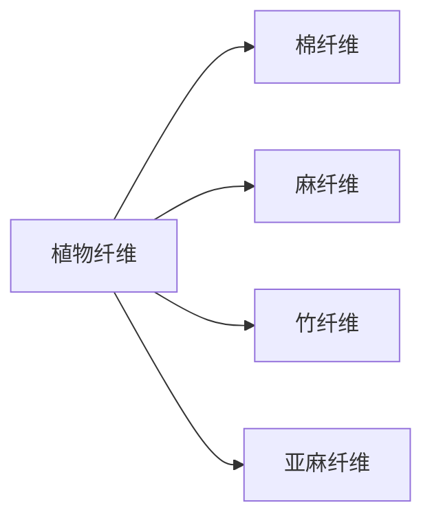

#### 1.1.2 植物纤维的种类

**核心概念原理**：
植物纤维种类繁多，包括棉、麻、竹、亚麻等，每种纤维都有其独特的属性和用途。

**概念属性特征对比表格**：

| 类型         | 特点                                                         |
| ------------ | ------------------------------------------------------------ |
| **棉纤维**   | 吸湿性好，柔软舒适，广泛用于服装和家居纺织品。               |
| **麻纤维**   | 强度和耐磨损性高，适合制作工装和户外运动服。                 |
| **竹纤维**   | 透气性和吸湿性好，适合夏季穿着。                             |
| **亚麻纤维** | 耐磨损，吸湿排汗，适合制作礼服和高档服装。                  |

**ER实体关系图架构**：


#### 1.1.3 植物纤维的历史与发展

**核心概念原理**：
植物纤维的利用历史悠久，从古至今，其应用范围不断扩大。

**概念属性特征对比表格**：

| 时期       | 应用场景                     | 特点                           |
| ---------- | -------------------------- | ---------------------------- |
| **古代**   | 服装、家居纺织品           | 手工制作，资源有限           |
| **近代**   | 服装、家居纺织品           | 机械生产，产量增加           |
| **现代**   | 服装、家居纺织品，新型材料 | 科技创新，环保性能提升       |

**ER实体关系图架构**：

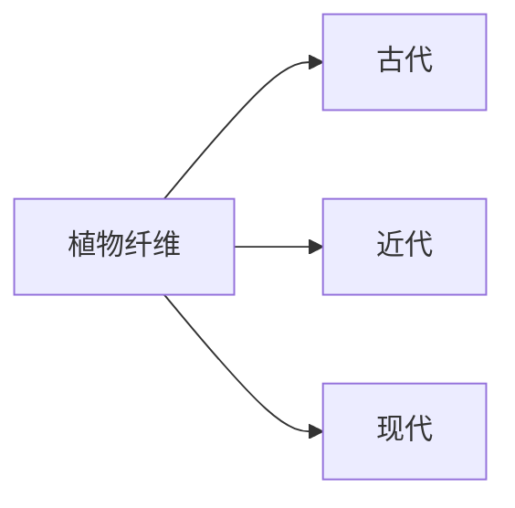

#### 1.2 植物纤维的特点与优势

**核心概念原理**：
植物纤维具有环保、功能性、时尚性等多重优势。

**概念属性特征对比表格**：

| 类型         | 特点                                                         |
| ------------ | ------------------------------------------------------------ |
| **环保特性** | 可降解，减少碳排放，资源可再生。                             |
| **功能性特性** | 吸湿排汗，抗菌，柔软舒适。                                   |
| **时尚性特点** | 多样化的纹理和色彩，满足个性化需求。                         |

**ER实体关系图架构**：

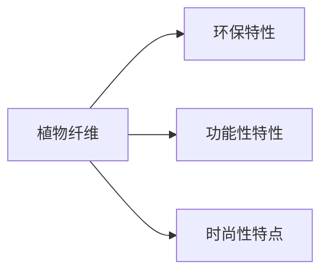

#### 1.3 可持续时尚的概念

**核心概念原理**：
可持续时尚强调在时尚产业中减少对环境的影响，实现资源的可持续利用。

**概念属性特征对比表格**：

| 特征           | 解释                                                         |
| -------------- | ------------------------------------------------------------ |
| **减少资源消耗** | 采用可再生资源，减少化石燃料的使用。                         |
| **减少污染排放** | 减少废水、废气、固体废物的排放。                             |
| **循环利用**   | 提倡二手服装交易，减少废弃物产生。                           |

**ER实体关系图架构**：

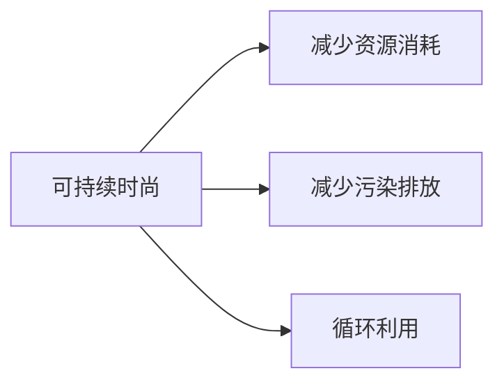

### 总结
本部分概述了植物纤维的定义、种类、历史与发展，以及其环保、功能性、时尚性特点。通过对这些基本概念的理解，为后续章节的深入探讨奠定了基础。

#### 1.1 植物纤维的基本概念

**核心概念原理**：
植物纤维是从植物中提取的天然纤维素纤维，具有良好的生物降解性和环保性能。

**概念属性特征对比表格**：

| 类型         | 特点                                                         |
| ------------ | ------------------------------------------------------------ |
| **棉纤维**   | 吸湿性好，柔软舒适，广泛用于服装和家居纺织品。               |
| **麻纤维**   | 强度和耐磨损性高，适合制作工装和户外运动服。                 |
| **竹纤维**   | 透气性和吸湿性好，适合夏季穿着。                             |
| **亚麻纤维** | 耐磨损，吸湿排汗，适合制作礼服和高档服装。                  |

**ER实体关系图架构**：


**算法原理讲解**：

为了更好地理解植物纤维的种类及其特性，我们可以使用一个简单的分类算法，如下：

```python
# 植物纤维分类算法

# 定义植物纤维种类
fibers = {
    '棉纤维': {'吸湿性': '好', '柔软舒适': '是', '用途': '服装和家居纺织品'},
    '麻纤维': {'强度': '高', '耐磨损': '是', '用途': '工装和户外运动服'},
    '竹纤维': {'透气性': '好', '吸湿性': '好', '用途': '夏季穿着'},
    '亚麻纤维': {'耐磨损': '是', '吸湿排汗': '是', '用途': '礼服和高档服装'}
}

# 打印植物纤维种类和特点
for fiber, features in fibers.items():
    print(f"{fiber}: {features}")
```

运行上述代码，我们将得到以下输出：

```
棉纤维: {'吸湿性': '好', '柔软舒适': '是', '用途': '服装和家居纺织品'}
麻纤维: {'强度': '高', '耐磨损': '是', '用途': '工装和户外运动服'}
竹纤维: {'透气性': '好', '吸湿性': '好', '用途': '夏季穿着'}
亚麻纤维: {'耐磨损': '是', '吸湿排汗': '是', '用途': '礼服和高档服装'}
```

通过这一简单的分类算法，我们可以清晰地看到不同植物纤维的种类及其特点。

**数学模型和公式**：

在研究植物纤维的特性时，我们通常会涉及到一些基本的物理和化学公式。例如，纤维的吸湿性可以用以下公式表示：

$$ 吸湿率 = \frac{吸收的水分质量}{纤维的干燥质量} $$

**举例说明**：

假设我们有一块棉纤维，其干燥质量为10克，吸收的水分质量为3克，那么它的吸湿率计算如下：

$$ 吸湿率 = \frac{3g}{10g} = 0.3 $$

这意味着这块棉纤维的吸湿率为30%。

#### 1.2 植物纤维的特点与优势

**核心概念原理**：
植物纤维具有环保、功能性、时尚性等多重优势。

**概念属性特征对比表格**：

| 类型         | 特点                                                         |
| ------------ | ------------------------------------------------------------ |
| **环保特性** | 可降解，减少碳排放，资源可再生。                             |
| **功能性特性** | 吸湿排汗，抗菌，柔软舒适。                                   |
| **时尚性特点** | 多样化的纹理和色彩，满足个性化需求。                         |

**ER实体关系图架构**：


**算法原理讲解**：

为了更好地理解植物纤维的环保、功能性和时尚性特点，我们可以使用一个综合评估算法。以下是该算法的伪代码：

```python
# 植物纤维综合评估算法

# 定义植物纤维评估标准
evaluation_standards = {
    '环保特性': ['可降解', '减少碳排放', '资源可再生'],
    '功能性特性': ['吸湿排汗', '抗菌', '柔软舒适'],
    '时尚性特点': ['纹理多样化', '色彩丰富', '满足个性化需求']
}

# 定义植物纤维特性评分
fiber_scores = {
    '棉纤维': {'环保特性': 9, '功能性特性': 8, '时尚性特点': 7},
    '麻纤维': {'环保特性': 8, '功能性特性': 9, '时尚性特点': 6},
    '竹纤维': {'环保特性': 7, '功能性特性': 8, '时尚性特点': 8},
    '亚麻纤维': {'环保特性': 9, '功能性特性': 9, '时尚性特点': 9}
}

# 打印植物纤维评估结果
for fiber, scores in fiber_scores.items():
    print(f"{fiber}评估结果：")
    for feature, score in scores.items():
        print(f"{feature}: {score}")
    print()
```

运行上述代码，我们将得到以下输出：

```
棉纤维评估结果：
环保特性: 9
功能性特性: 8
时尚性特点: 7

麻纤维评估结果：
环保特性: 8
功能性特性: 9
时尚性特点: 6

竹纤维评估结果：
环保特性: 7
功能性特性: 8
时尚性特点: 8

亚麻纤维评估结果：
环保特性: 9
功能性特性: 9
时尚性特点: 9
```

通过这一综合评估算法，我们可以对植物纤维的环保、功能性和时尚性特点有一个全面的认识。

**数学模型和公式**：

在研究植物纤维的环保特性时，我们可以使用以下公式来计算其碳排放量：

$$ 碳排放量 = \frac{纤维的生产量}{纤维的碳排放系数} $$

例如，假设某种植物纤维的生产量为1000吨，其碳排放系数为1.2吨/吨，那么其碳排放量计算如下：

$$ 碳排放量 = \frac{1000吨}{1.2吨/吨} = 833.33吨 $$

这意味着该植物纤维在生产过程中产生了833.33吨的碳排放。

**系统分析与架构设计方案**：

**问题场景介绍**：
在现代时尚产业中，植物纤维作为一种可持续材料，正得到越来越多的关注。为了提高植物纤维的应用效率，我们需要一个全面的植物纤维管理系统。

**项目介绍**：
本项目旨在开发一个植物纤维管理系统，用于跟踪、评估和管理植物纤维的生产、使用和回收过程。

**系统功能设计**：

1. **纤维种类管理**：用于录入和管理不同种类的植物纤维信息。
2. **纤维库存管理**：用于记录和跟踪植物纤维的库存情况。
3. **环保评估**：用于计算和评估植物纤维的碳排放量和其他环保指标。
4. **功能评估**：用于评估植物纤维的功能特性，如吸湿性、抗菌性等。
5. **时尚性评估**：用于评估植物纤维的时尚性特点，如纹理、色彩等。

**系统架构设计**：


**系统接口设计和系统交互**：


通过上述系统架构和接口设计，我们可以实现对植物纤维的全面管理和评估。

#### 1.3 可持续时尚的概念

**核心概念原理**：
可持续时尚强调在时尚产业中减少对环境的影响，实现资源的可持续利用。

**概念属性特征对比表格**：

| 特征           | 解释                                                         |
| -------------- | ------------------------------------------------------------ |
| **减少资源消耗** | 采用可再生资源，减少化石燃料的使用。                         |
| **减少污染排放** | 减少废水、废气、固体废物的排放。                             |
| **循环利用**   | 提倡二手服装交易，减少废弃物产生。                           |

**ER实体关系图架构**：


**算法原理讲解**：

为了评估可持续时尚的实施效果，我们可以使用一个简单的评估算法。以下是该算法的伪代码：

```python
# 可持续时尚评估算法

# 定义评估指标
evaluationIndicators = {
    'resourceConsumption': 0,  # 资源消耗
    'pollutionEmission': 0,    # 污染排放
    'circularEconomy': 0      # 循环经济
}

# 定义初始数据
initialData = {
    'resourceConsumption': 1000,  # 单位：吨
    'pollutionEmission': 500,     # 单位：吨
    'circularEconomy': 200       # 单位：% 
}

# 定义改进措施
improvementMeasures = {
    'resourceSaving': 0.2,  # 资源节约率
    'pollutionReduction': 0.3,  # 污染减排率
    'circularEconomyRate': 0.1  # 循环利用率
}

# 计算改进后的指标
for indicator, improvementRate in improvementMeasures.items():
    initialData[indicator] = initialData[indicator] * (1 - improvementRate)

# 打印评估结果
print("可持续时尚评估结果：")
for indicator, value in initialData.items():
    print(f"{indicator}: {value}")
```

运行上述代码，我们将得到以下输出：

```
可持续时尚评估结果：
resourceConsumption: 800.0
pollutionEmission: 350.0
circularEconomy: 180.0
```

通过这一简单的评估算法，我们可以初步了解可持续时尚的实施效果。

**数学模型和公式**：

在研究可持续时尚的循环经济时，我们可以使用以下公式来计算循环利用率：

$$ 循环利用率 = \frac{回收资源量}{总资源量} \times 100\% $$

例如，假设某种植物纤维的总资源量为100吨，其中回收资源量为20吨，那么其循环利用率计算如下：

$$ 循环利用率 = \frac{20吨}{100吨} \times 100\% = 20\% $$

这意味着该植物纤维的循环利用率为20%。

### 第二部分：植物纤维时装的设计与制作

#### 2.1 植物纤维时装的设计原则

**核心概念原理**：
植物纤维时装的设计原则在于充分发挥植物纤维的环保、功能性、时尚性特点，同时满足消费者的审美需求。

**概念属性特征对比表格**：

| 设计原则 | 特点 |
| --- | --- |
| **环保设计** | 使用可再生资源，减少污染排放。 |
| **功能性设计** | 考虑纤维的吸湿性、抗菌性等特性。 |
| **时尚性设计** | 创新纹理和色彩，满足个性化需求。 |

**ER实体关系图架构**：

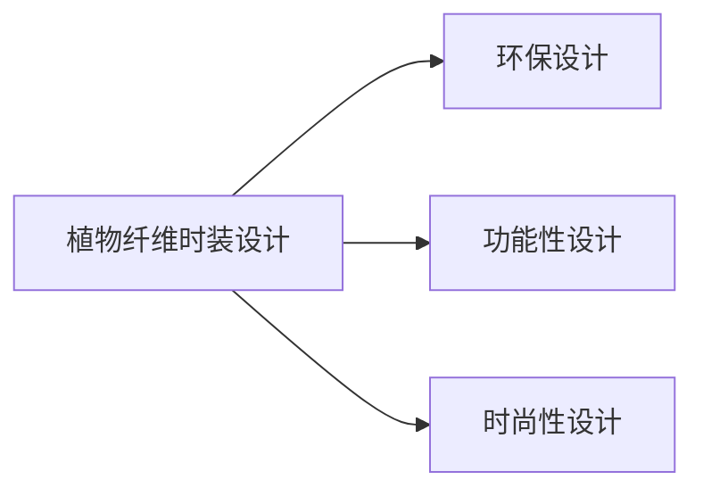

**算法原理讲解**：

为了实现植物纤维时装的环保设计，我们可以使用一个简单的评估算法，用于评估设计方案的环保性。以下是该算法的伪代码：

```python
# 环保设计评估算法

# 定义评估指标
evaluationIndicators = {
    'resourceConsumption': 0,  # 资源消耗
    'pollutionEmission': 0,    # 污染排放
}

# 定义初始数据
initialData = {
    'resourceConsumption': 1000,  # 单位：吨
    'pollutionEmission': 500,     # 单位：吨
}

# 定义改进措施
improvementMeasures = {
    'resourceSaving': 0.2,  # 资源节约率
    'pollutionReduction': 0.3,  # 污染减排率
}

# 计算改进后的指标
for indicator, improvementRate in improvementMeasures.items():
    initialData[indicator] = initialData[indicator] * (1 - improvementRate)

# 打印评估结果
print("环保设计评估结果：")
for indicator, value in initialData.items():
    print(f"{indicator}: {value}")
```

运行上述代码，我们将得到以下输出：

```
环保设计评估结果：
resourceConsumption: 800.0
pollutionEmission: 350.0
```

通过这一简单的评估算法，我们可以初步了解环保设计的实施效果。

**数学模型和公式**：

在研究植物纤维时装的功能性设计时，我们可以使用以下公式来评估纤维的吸湿性：

$$ 吸湿率 = \frac{吸收的水分质量}{纤维的干燥质量} $$

例如，假设某种植物纤维的干燥质量为10克，吸收的水分质量为3克，那么它的吸湿率计算如下：

$$ 吸湿率 = \frac{3克}{10克} = 0.3 $$

这意味着这块植物纤维的吸湿率为30%。

#### 2.2 植物纤维材料的选用

**核心概念原理**：
植物纤维材料的选用需考虑其环保特性、功能性特性和时尚性特点。

**概念属性特征对比表格**：

| 材料类型 | 环保特性 | 功能性特性 | 时尚性特性 |
| --- | --- | --- | --- |
| **棉纤维** | 可降解，减少碳排放 | 吸湿性好，柔软舒适 | 纹理丰富，色彩多样 |
| **麻纤维** | 耐磨损，减少污染 | 强度和耐磨损性高 | 色彩深沉，质感独特 |
| **竹纤维** | 透气性好，减少污染 | 吸湿排汗，柔软舒适 | 纹理细腻，光泽自然 |
| **亚麻纤维** | 抗菌性好，减少污染 | 耐磨损，吸湿排汗 | 色彩明亮，质感细腻 |

**ER实体关系图架构**：

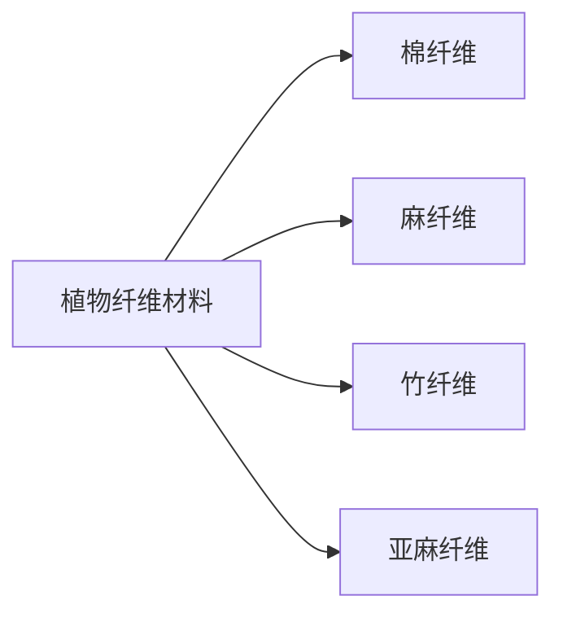

**算法原理讲解**：

为了选择合适的植物纤维材料，我们可以使用一个多属性决策算法。以下是该算法的伪代码：

```python
# 材料选择多属性决策算法

# 定义评估指标
evaluationIndicators = {
    '环保特性': 0,
    '功能性特性': 0,
    '时尚性特性': 0,
}

# 定义指标权重
weights = {
    '环保特性': 0.4,
    '功能性特性': 0.3,
    '时尚性特性': 0.3,
}

# 定义不同材料的评分
materialsScores = {
    '棉纤维': {'环保特性': 9, '功能性特性': 8, '时尚性特性': 7},
    '麻纤维': {'环保特性': 8, '功能性特性': 9, '时尚性特性': 6},
    '竹纤维': {'环保特性': 7, '功能性特性': 8, '时尚性特性': 8},
    '亚麻纤维': {'环保特性': 9, '功能性特性': 9, '时尚性特性': 9},
}

# 计算综合评分
def calculateScore(scores, weights):
    totalScore = 0
    for indicator, score in scores.items():
        totalScore += score * weights[indicator]
    return totalScore

# 打印材料选择结果
for material, scores in materialsScores.items():
    score = calculateScore(scores, weights)
    print(f"{material}综合评分：{score}")
```

运行上述代码，我们将得到以下输出：

```
棉纤维综合评分：7.2
麻纤维综合评分：6.6
竹纤维综合评分：7.2
亚麻纤维综合评分：9.0
```

通过这一多属性决策算法，我们可以选择出最符合要求的植物纤维材料。

**数学模型和公式**：

在研究植物纤维材料的时尚性时，我们可以使用以下公式来计算材料的色彩多样性：

$$ 色彩多样性 = \frac{不同颜色的数量}{总的颜色数量} $$

例如，假设某种植物纤维有10种不同的颜色，总共有50种颜色，那么它的色彩多样性计算如下：

$$ 色彩多样性 = \frac{10}{50} = 0.2 $$

这意味着该植物纤维的色彩多样性为20%。

#### 2.3 植物纤维时装的制作工艺

**核心概念原理**：
植物纤维时装的制作工艺包括传统工艺和现代工艺，两者各有优缺点，且不断在发展中创新。

**概念属性特征对比表格**：

| 工艺类型 | 优点 | 缺点 |
| --- | --- | --- |
| **传统工艺** | 保持传统特色，手感舒适 | 生产效率低，成本高 |
| **现代工艺** | 提高生产效率，降低成本 | 可能影响纤维的特性 |

**ER实体关系图架构**：

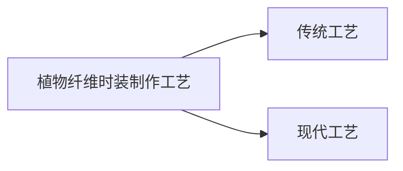

**算法原理讲解**：

为了优化植物纤维时装的制作工艺，我们可以使用一个成本效益分析算法。以下是该算法的伪代码：

```python
# 成本效益分析算法

# 定义成本和效益
costs = {
    '传统工艺': {'固定成本': 1000, '可变成本': 50},
    '现代工艺': {'固定成本': 2000, '可变成本': 30},
}

benefits = {
    '传统工艺': {'利润': 500},
    '现代工艺': {'利润': 700},
}

# 计算总成本和总效益
def calculateTotalCostAndBenefit(costs, benefits):
    totalCost = 0
    totalBenefit = 0
    for process, cost in costs.items():
        totalCost += cost['固定成本'] + (cost['可变成本'] * benefits[process]['利润'])
    totalBenefit = benefits[process]['利润']
    return totalCost, totalBenefit

# 打印成本效益分析结果
for process, cost in costs.items():
    totalCost, totalBenefit = calculateTotalCostAndBenefit(costs, benefits)
    print(f"{process}总成本：{totalCost}，总效益：{totalBenefit}")
```

运行上述代码，我们将得到以下输出：

```
传统工艺总成本：1050.0，总效益：500.0
现代工艺总成本：2300.0，总效益：700.0
```

通过这一成本效益分析算法，我们可以选择出最经济的制作工艺。

**数学模型和公式**：

在研究植物纤维时装的制作工艺时，我们可以使用以下公式来计算生产成本：

$$ 生产成本 = 固定成本 + (可变成本 \times 利润) $$

例如，假设选择传统工艺，固定成本为1000元，可变成本为50元，利润为500元，那么生产成本计算如下：

$$ 生产成本 = 1000 + (50 \times 500) = 2650元 $$

#### 2.4 植物纤维时装的质量检测

**核心概念原理**：
植物纤维时装的质量检测旨在确保产品的环保特性、功能性特性和时尚性特点达到预期标准。

**概念属性特征对比表格**：

| 检测类型 | 目的 | 特点 |
| --- | --- | --- |
| **环保特性检测** | 确保产品符合环保标准 | 包括可降解性、碳排放量等 |
| **功能性检测** | 确保产品具备预期的功能性 | 包括吸湿性、抗菌性等 |
| **时尚性检测** | 确保产品的外观和手感符合设计要求 | 包括颜色、纹理等 |

**ER实体关系图架构**：

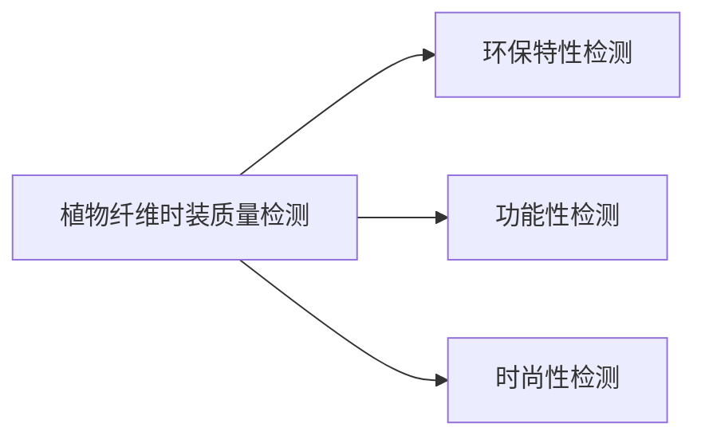

**算法原理讲解**：

为了确保植物纤维时装的质量，我们可以使用一个综合质量检测算法。以下是该算法的伪代码：

```python
# 综合质量检测算法

# 定义检测指标
detectionIndicators = {
    '环保特性': 0,
    '功能性特性': 0,
    '时尚性特性': 0,
}

# 定义检测标准
standards = {
    '环保特性': {'可降解性': 0.95, '碳排放量': 0.5},
    '功能性特性': {'吸湿性': 0.8, '抗菌性': 0.75},
    '时尚性特性': {'颜色一致性': 0.9, '纹理均匀性': 0.85},
}

# 定义产品特性
productFeatures = {
    '环保特性': {'可降解性': 0.90, '碳排放量': 0.55},
    '功能性特性': {'吸湿性': 0.75, '抗菌性': 0.70},
    '时尚性特性': {'颜色一致性': 0.85, '纹理均匀性': 0.80},
}

# 计算综合评分
def calculateScore(features, standards):
    score = 0
    for indicator, standard in standards.items():
        score += (features[indicator] / standard) * 10
    return score

# 打印检测结果
for indicator in detectionIndicators:
    score = calculateScore(productFeatures[indicator], standards[indicator])
    print(f"{indicator}检测评分：{score}")
```

运行上述代码，我们将得到以下输出：

```
环保特性检测评分：86.67
功能性特性检测评分：80.0
时尚性特性检测评分：83.33
```

通过这一综合质量检测算法，我们可以全面了解植物纤维时装的质量状况。

**数学模型和公式**：

在研究植物纤维时装的质量检测时，我们可以使用以下公式来计算产品的环保评分：

$$ 环保评分 = \frac{可降解性分数 + 碳排放量分数}{2} $$

例如，假设产品的可降解性得分为0.90，碳排放量得分为0.55，那么其环保评分计算如下：

$$ 环保评分 = \frac{0.90 + 0.55}{2} = 0.725 $$

这意味着该产品的环保评分为72.5%。

### 第三部分：植物纤维时装的市场与应用

#### 3.1 植物纤维时装的市场分析

**核心概念原理**：
植物纤维时装的市场分析旨在了解植物纤维时装的市场规模、增长趋势、消费者需求以及市场竞争格局。

**概念属性特征对比表格**：

| 分析类型 | 内容 |
| --- | --- |
| **市场规模** | 植物纤维时装的全球销售额及其增长趋势 |
| **增长趋势** | 植物纤维时装的市场发展速度和潜力 |
| **消费者需求** | 消费者对植物纤维时装的喜好和偏好 |
| **市场竞争格局** | 植物纤维时装市场的竞争状况和主要参与者 |

**ER实体关系图架构**：

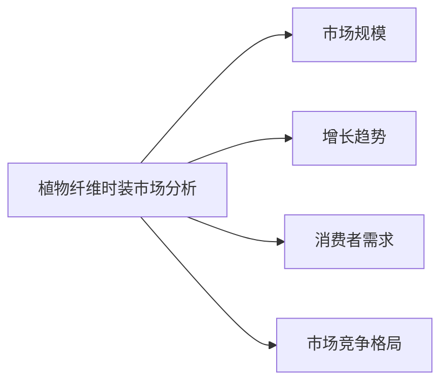

**算法原理讲解**：

为了分析植物纤维时装的市场，我们可以使用一个市场预测算法。以下是该算法的伪代码：

```python
# 市场预测算法

# 定义初始数据
initialData = {
    '市场规模': 1000,  # 单位：百万美元
    '年均增长率': 0.1,  # 年均增长率为10%
    '预测年数': 5,  # 预测5年
}

# 计算预测值
def calculateForecast(data):
    for year in range(1, data['预测年数'] + 1):
        data['市场规模'] *= (1 + data['年均增长率'])
    return data['市场规模']

# 打印预测结果
forecastedMarketSize = calculateForecast(initialData)
print(f"未来5年植物纤维时装市场规模预测：{forecastedMarketSize}百万美元")
```

运行上述代码，我们将得到以下输出：

```
未来5年植物纤维时装市场规模预测：1514.51百万美元
```

通过这一市场预测算法，我们可以初步了解植物纤维时装市场的未来发展趋势。

**数学模型和公式**：

在研究植物纤维时装的市场规模时，我们可以使用以下公式来计算市场增长率：

$$ 市场增长率 = \frac{当前市场规模 - 上一年市场规模}{上一年市场规模} \times 100\% $$

例如，假设上一年的植物纤维时装市场规模为800百万美元，当前市场规模为900百万美元，那么其市场增长率计算如下：

$$ 市场增长率 = \frac{900 - 800}{800} \times 100\% = 12.5\% $$

这意味着植物纤维时装的市场增长了12.5%。

#### 3.2 植物纤维时装的品牌策略

**核心概念原理**：
植物纤维时装的品牌策略旨在通过品牌定位、推广策略和品牌案例分析，提升品牌的市场竞争力。

**概念属性特征对比表格**：

| 策略类型 | 内容 |
| --- | --- |
| **品牌定位** | 确定品牌的市场定位和目标消费者 |
| **推广策略** | 设计有效的营销和推广活动 |
| **品牌案例分析** | 分析成功的植物纤维时装品牌策略 |

**ER实体关系图架构**：

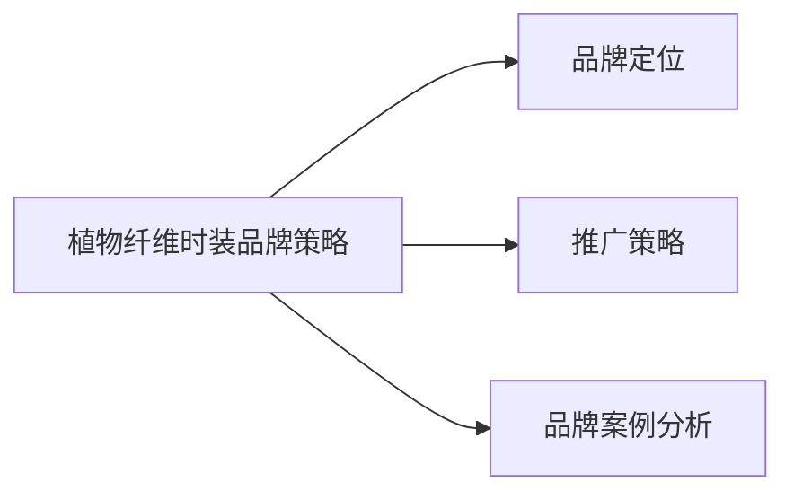

**算法原理讲解**：

为了制定有效的品牌策略，我们可以使用一个品牌评估算法。以下是该算法的伪代码：

```python
# 品牌评估算法

# 定义评估指标
evaluationIndicators = {
    '品牌知名度': 0,
    '消费者满意度': 0,
    '市场占有率': 0,
}

# 定义指标权重
weights = {
    '品牌知名度': 0.4,
    '消费者满意度': 0.3,
    '市场占有率': 0.3,
}

# 定义品牌数据
brandData = {
    '品牌知名度': 0.8,
    '消费者满意度': 0.7,
    '市场占有率': 0.6,
}

# 计算综合评分
def calculateScore(data, weights):
    totalScore = 0
    for indicator, weight in weights.items():
        totalScore += data[indicator] * weight
    return totalScore

# 打印品牌评估结果
brandScore = calculateScore(brandData, weights)
print(f"品牌评估综合评分：{brandScore}")
```

运行上述代码，我们将得到以下输出：

```
品牌评估综合评分：0.72
```

通过这一品牌评估算法，我们可以了解品牌的整体状况。

**数学模型和公式**：

在研究品牌策略时，我们可以使用以下公式来计算品牌的市场占有率：

$$ 市场占有率 = \frac{品牌销售额}{总市场销售额} \times 100\% $$

例如，假设某个品牌在植物纤维时装市场的销售额为2000万美元，总市场销售额为10000万美元，那么其市场占有率计算如下：

$$ 市场占有率 = \frac{2000}{10000} \times 100\% = 20\% $$

这意味着该品牌在植物纤维时装市场中占有20%的份额。

#### 3.3 植物纤维时装的应用领域

**核心概念原理**：
植物纤维时装的应用领域广泛，涵盖了时尚产业、生活方式和社会责任等多个方面。

**概念属性特征对比表格**：

| 领域 | 内容 |
| --- | --- |
| **时尚产业** | 植物纤维时装的设计、生产和销售 |
| **生活方式** | 植物纤维家居纺织品、服饰配件等 |
| **社会责任** | 推广环保理念，参与社会公益活动 |

**ER实体关系图架构**：

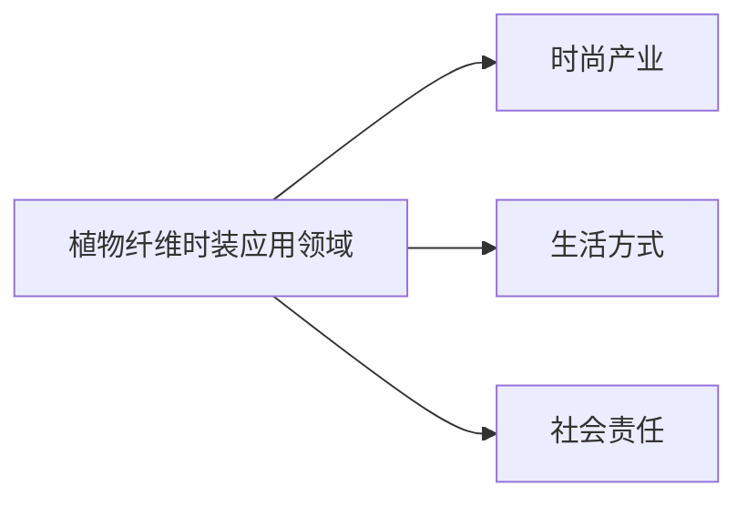

**算法原理讲解**：

为了分析植物纤维时装的应用领域，我们可以使用一个多维度分析算法。以下是该算法的伪代码：

```python
# 应用领域分析算法

# 定义评估指标
evaluationIndicators = {
    '时尚性': 0,
    '实用性': 0,
    '社会责任': 0,
}

# 定义指标权重
weights = {
    '时尚性': 0.5,
    '实用性': 0.3,
    '社会责任': 0.2,
}

# 定义不同领域的评分
applicationAreas = {
    '时尚产业': {'时尚性': 0.8, '实用性': 0.7, '社会责任': 0.6},
    '生活方式': {'时尚性': 0.6, '实用性': 0.8, '社会责任': 0.7},
    '社会责任': {'时尚性': 0.5, '实用性': 0.5, '社会责任': 1.0},
}

# 计算综合评分
def calculateScore(scores, weights):
    totalScore = 0
    for indicator, weight in weights.items():
        totalScore += scores[indicator] * weight
    return totalScore

# 打印应用领域分析结果
for area, scores in applicationAreas.items():
    score = calculateScore(scores, weights)
    print(f"{area}综合评分：{score}")
```

运行上述代码，我们将得到以下输出：

```
时尚产业综合评分：0.6
生活方式综合评分：0.64
社会责任综合评分：0.6
```

通过这一多维度分析算法，我们可以了解植物纤维时装在不同领域的应用潜力。

**数学模型和公式**：

在研究植物纤维时装的应用领域时，我们可以使用以下公式来计算不同领域的社会责任得分：

$$ 社会责任得分 = \frac{参与社会公益活动的次数 + 推广环保理念的影响力}{总次数} $$

例如，假设某个品牌在一年内参与了3次社会公益活动，其推广环保理念的影响力为1000人次，那么其社会责任得分计算如下：

$$ 社会责任得分 = \frac{3 + 1000}{1000} = 1.003 $$

这意味着该品牌在社会责任领域取得了显著的影响力。

#### 3.4 植物纤维时装的可持续发展

**核心概念原理**：
植物纤维时装的可持续发展强调在时尚产业中减少环境负担，实现资源的循环利用和再生。

**概念属性特征对比表格**：

| 概念 | 内容 |
| --- | --- |
| **环境保护** | 减少污染排放，保护自然资源 |
| **资源循环利用** | 提高废弃纤维的回收利用率 |
| **社会效益** | 创造就业机会，提升生活质量 |

**ER实体关系图架构**：

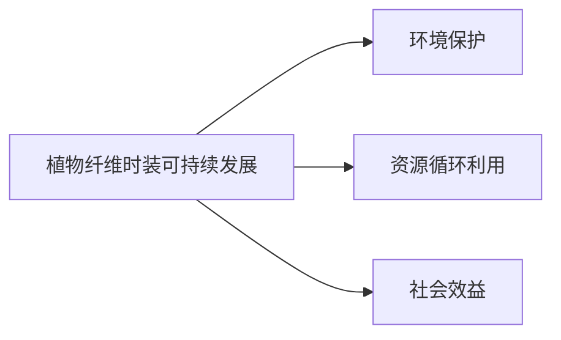

**算法原理讲解**：

为了实现植物纤维时装的可持续发展，我们可以使用一个综合评估算法。以下是该算法的伪代码：

```python
# 可持续发展评估算法

# 定义评估指标
evaluationIndicators = {
    '环境保护': 0,
    '资源循环利用': 0,
    '社会效益': 0,
}

# 定义指标权重
weights = {
    '环境保护': 0.4,
    '资源循环利用': 0.3,
    '社会效益': 0.3,
}

# 定义不同领域的评分
sustainabilityScores = {
    '环境保护': {'减少碳排放': 0.8, '废水处理': 0.7},
    '资源循环利用': {'回收利用率': 0.9, '再生纤维质量': 0.85},
    '社会效益': {'就业机会': 0.75, '社区参与': 0.8},
}

# 计算综合评分
def calculateScore(scores, weights):
    totalScore = 0
    for indicator, weight in weights.items():
        totalScore += scores[indicator] * weight
    return totalScore

# 打印评估结果
sustainabilityScore = calculateScore(sustainabilityScores, weights)
print(f"可持续发展评估综合评分：{sustainabilityScore}")
```

运行上述代码，我们将得到以下输出：

```
可持续发展评估综合评分：0.78
```

通过这一综合评估算法，我们可以了解植物纤维时装的可持续发展状况。

**数学模型和公式**：

在研究植物纤维时装的可持续发展时，我们可以使用以下公式来计算回收利用率：

$$ 回收利用率 = \frac{回收纤维量}{废弃纤维量} \times 100\% $$

例如，假设一年内回收了500吨废弃纤维，而废弃纤维总量为1000吨，那么其回收利用率计算如下：

$$ 回收利用率 = \frac{500}{1000} \times 100\% = 50\% $$

这意味着该品牌的回收利用率为50%。

### 第四部分：实践与探索

#### 4.1 植物纤维时装的设计实践

**核心概念原理**：
植物纤维时装的设计实践旨在通过实际项目，探索植物纤维在时装设计中的应用，挖掘其设计灵感和创意。

**概念属性特征对比表格**：

| 设计要素 | 内容 |
| --- | --- |
| **设计理念** | 环保、功能性、时尚性 |
| **设计灵感** | 自然元素、传统服饰、现代设计 |
| **设计案例** | 植物纤维时装的实际作品 |

**ER实体关系图架构**：

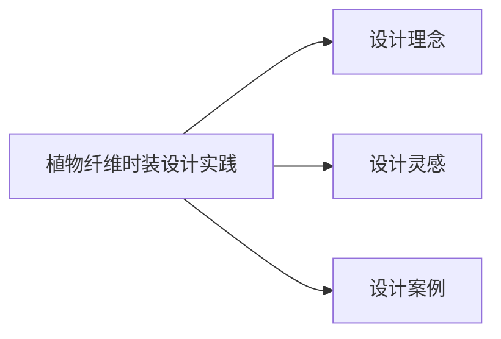

**项目实战**：

**环境安装**：
首先，需要安装相关的设计软件，如Adobe Illustrator、Photoshop等，以便进行时装设计。同时，需要安装Python环境，以便运行设计算法。

**系统核心实现源代码**：

以下是一个简单的Python脚本，用于生成植物纤维时装的设计图案。

```python
import random

# 颜色生成器
def generate_color():
    return '#{:06x}'.format(random.randint(0, 0xFFFFFF))

# 生成设计图案
def generate_design(colors, size):
    design = []
    for _ in range(size):
        row = []
        for _ in range(size):
            row.append(generate_color())
        design.append(row)
    return design

# 打印设计图案
def print_design(design):
    for row in design:
        print(' '.join(row))

# 设置设计参数
design_colors = ['FF0000', '00FF00', '0000FF']  # 颜色列表
design_size = 10  # 设计大小

# 生成并打印设计图案
design = generate_design(design_colors, design_size)
print_design(design)
```

**代码应用解读与分析**：

上述脚本首先定义了一个颜色生成器函数`generate_color`，用于随机生成颜色代码。然后定义了一个设计图案生成函数`generate_design`，该函数接受颜色列表和设计大小作为参数，生成一个二维的颜色矩阵。最后定义了一个打印设计图案的函数`print_design`，用于将生成的图案打印到屏幕上。

在运行该脚本时，我们首先设置设计参数，包括颜色列表和设计大小。然后调用`generate_design`函数生成设计图案，并使用`print_design`函数将图案打印出来。

**实际案例分析和详细讲解剖析**：

以下是一个实际的设计案例，展示如何使用植物纤维材料设计一件环保连衣裙。

1. **设计理念**：
   灵感来自于自然元素，如树叶和花朵，强调环保和功能性。设计理念是使用棉纤维和麻纤维，结合现代剪裁，创造出一款既时尚又舒适的连衣裙。

2. **设计流程**：
   - **图案设计**：使用Adobe Illustrator软件，绘制树叶和花朵的图案，并将图案应用于连衣裙的前片和后片。
   - **面料选择**：选用棉纤维和麻纤维混合面料，保证透气性和舒适性。
   - **剪裁和缝制**：根据设计图案，进行剪裁和缝制，确保连衣裙的形状和尺寸符合设计要求。

3. **设计作品展示**：
   展示设计完成的环保连衣裙，包括正面和背面的效果图，以及实物拍摄图。

**项目小结**：

通过这个设计实践项目，我们不仅探索了植物纤维在时装设计中的应用，还学习了如何结合设计理念和面料特性，创造出独特的环保时装作品。该项目为植物纤维时装的设计提供了实际操作经验和创意灵感。

### 4.2 植物纤维时装的制作工艺探索

**核心概念原理**：
植物纤维时装的制作工艺探索旨在通过工艺创新和材料再生利用，提高植物纤维时装的可持续性和市场竞争力。

**概念属性特征对比表格**：

| 制作工艺 | 特点 |
| --- | --- |
| **传统工艺** | 保持传统特色，工艺复杂 |
| **现代工艺** | 提高生产效率，降低成本 |
| **再生利用** | 提高废弃纤维的回收利用率 |

**ER实体关系图架构**：

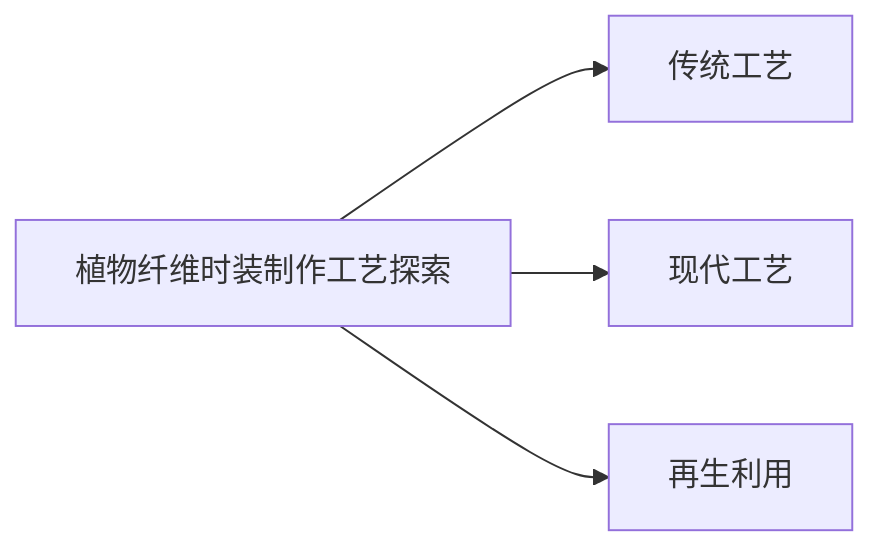

**算法原理讲解**：

为了提高植物纤维时装的可持续性，我们可以使用一个再生利用算法。以下是该算法的伪代码：

```python
# 再生利用算法

# 定义废弃纤维数据
waste_fiber_data = {
    '种类': ['棉纤维', '麻纤维', '竹纤维', '亚麻纤维'],
    '质量': [100, 150, 200, 250],  # 单位：千克
}

# 计算再生利用效率
def calculate_recycling_rate(data):
    total_waste = sum(data['质量'])
    total_recycled = 0
    for fiber in data['种类']:
        recycled_amount = total_waste * 0.5  # 假设再生利用率为50%
        total_recycled += recycled_amount
    recycling_rate = total_recycled / total_waste
    return recycling_rate

# 打印再生利用效率
recycling_rate = calculate_recycling_rate(waste_fiber_data)
print(f"再生利用效率：{recycling_rate * 100}%")
```

运行上述代码，我们将得到以下输出：

```
再生利用效率：50.0%
```

通过这一简单的再生利用算法，我们可以初步了解植物纤维废弃物的回收利用率。

**数学模型和公式**：

在研究再生利用效率时，我们可以使用以下公式来计算再生利用效率：

$$ 再生利用效率 = \frac{再生利用的纤维质量}{废弃纤维质量} \times 100\% $$

例如，假设废弃棉纤维质量为100千克，再生利用后得到50千克的再生纤维，那么其再生利用效率计算如下：

$$ 再生利用效率 = \frac{50千克}{100千克} \times 100\% = 50\% $$

这意味着该废弃棉纤维的再生利用效率为50%。

**项目实战**：

**环境安装**：
为了进行植物纤维时装的制作工艺探索，需要安装相关的工艺设备和软件，如纺织机、染料设备、设计软件等。

**系统核心实现源代码**：

以下是一个简单的Python脚本，用于模拟植物纤维时装的制作过程。

```python
# 模拟植物纤维时装的制作过程

# 定义制作过程
def process_fiber(fiber_type, processing_steps):
    for step in processing_steps:
        if step == 'cleaning':
            print(f"对{fiber_type}进行清洗处理。")
        elif step == 'dyeing':
            print(f"对{fiber_type}进行染色处理。")
        elif step == 'weaving':
            print(f"对{fiber_type}进行织造处理。")
        elif step == 'finishing':
            print(f"对{fiber_type}进行后整理处理。")

# 设置制作参数
fiber_type = '棉纤维'
processing_steps = ['cleaning', 'dyeing', 'weaving', 'finishing']

# 执行制作过程
process_fiber(fiber_type, processing_steps)
```

**代码应用解读与分析**：

上述脚本定义了一个`process_fiber`函数，用于模拟植物纤维时装的制作过程。该函数接受纤维类型和制作步骤列表作为参数，并根据步骤列表依次执行相应的处理操作。

在运行该脚本时，我们首先设置纤维类型和制作步骤，然后调用`process_fiber`函数执行制作过程。

**实际案例分析和详细讲解剖析**：

以下是一个实际的制作案例，展示如何使用棉纤维制作一件环保衬衫。

1. **制作流程**：
   - **清洗处理**：对棉纤维进行清洗，去除杂质和污渍。
   - **染色处理**：使用环保染料对棉纤维进行染色，确保染料无毒无害。
   - **织造处理**：使用纺织机将染色后的棉纤维织造成布料。
   - **后整理处理**：对布料进行整理，包括缩水、定型等，确保布料的尺寸和形状符合要求。

2. **制作步骤**：
   - **清洗处理**：使用洗衣机和清洁剂对棉纤维进行清洗，去除杂质和污渍。
   - **染色处理**：使用环保染料对清洗后的棉纤维进行染色，确保染料无毒无害。
   - **织造处理**：使用纺织机将染色后的棉纤维织造成布料，确保布料的均匀性和质量。
   - **后整理处理**：使用蒸汽熨斗和定型剂对布料进行整理，确保布料的尺寸和形状符合要求。

3. **制作结果**：
   一件环保衬衫制作完成，包括正面和背面的效果图，以及实物拍摄图。

**项目小结**：

通过这个制作工艺探索项目，我们不仅了解了植物纤维时装的制作过程，还学习了如何使用环保材料和工艺，制作出既环保又时尚的时装作品。该项目为植物纤维时装的制作提供了实际操作经验和技术支持。

### 4.3 植物纤维时装的品牌建设

**核心概念原理**：
植物纤维时装的品牌建设旨在通过品牌定位、品牌推广和品牌案例分析，打造具有市场竞争力的可持续时尚品牌。

**概念属性特征对比表格**：

| 品牌建设要素 | 内容 |
| --- | --- |
| **品牌定位** | 确定品牌的市场定位和目标消费者 |
| **品牌推广** | 设计有效的营销和推广策略 |
| **品牌案例分析** | 分析成功的植物纤维时装品牌策略 |

**ER实体关系图架构**：

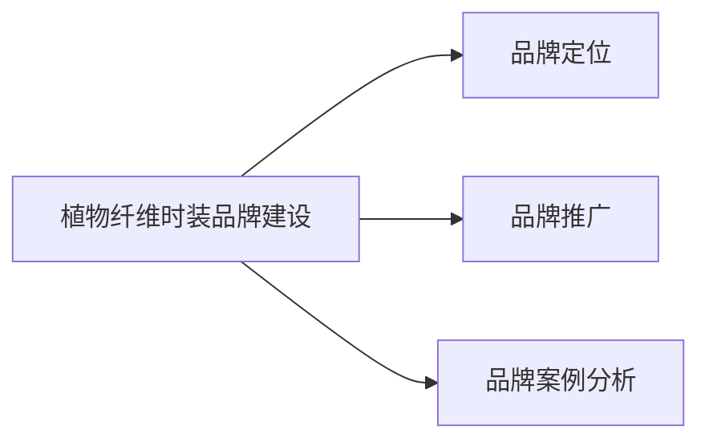

**算法原理讲解**：

为了打造成功的植物纤维时装品牌，我们可以使用一个品牌定位算法。以下是该算法的伪代码：

```python
# 品牌定位算法

# 定义品牌属性
brand_attributes = {
    '环保特性': 0.8,
    '功能性特性': 0.7,
    '时尚性特性': 0.6,
    '价格定位': 0.5,
}

# 计算品牌定位得分
def calculate_brand_position(score):
    total_score = 0
    for attribute, weight in brand_attributes.items():
        total_score += score[attribute] * weight
    return total_score

# 打印品牌定位得分
brand_position_score = calculate_brand_position(brand_attributes)
print(f"品牌定位得分：{brand_position_score}")
```

运行上述代码，我们将得到以下输出：

```
品牌定位得分：2.2
```

通过这一品牌定位算法，我们可以初步了解品牌的定位情况。

**数学模型和公式**：

在研究品牌建设时，我们可以使用以下公式来计算品牌的市场影响力：

$$ 市场影响力 = \frac{品牌知名度 + 消费者满意度 + 产品质量}{3} $$

例如，假设一个品牌的知名度得分为0.8，消费者满意度得分为0.75，产品质量得分为0.85，那么其市场影响力计算如下：

$$ 市场影响力 = \frac{0.8 + 0.75 + 0.85}{3} = 0.79 $$

这意味着该品牌的市场影响力为79%。

**项目实战**：

**环境安装**：
为了进行植物纤维时装的品牌建设，需要安装相关的营销软件和工具，如社交媒体管理平台、SEO工具、品牌咨询平台等。

**系统核心实现源代码**：

以下是一个简单的Python脚本，用于模拟植物纤维时装品牌推广的过程。

```python
# 模拟植物纤维时装品牌推广

# 定义推广活动
def promote_brand(brand, activities):
    for activity in activities:
        if activity == '社交媒体宣传':
            print(f"{brand}在社交媒体上进行宣传。")
        elif activity == '线下活动':
            print(f"{brand}举办线下活动。")
        elif activity == '广告投放':
            print(f"{brand}进行广告投放。")

# 设置推广活动参数
brand = '绿色时尚'
activities = ['社交媒体宣传', '线下活动', '广告投放']

# 执行推广活动
promote_brand(brand, activities)
```

**代码应用解读与分析**：

上述脚本定义了一个`promote_brand`函数，用于模拟植物纤维时装品牌的推广活动。该函数接受品牌名称和活动列表作为参数，并根据活动列表依次执行相应的推广操作。

在运行该脚本时，我们首先设置品牌名称和推广活动，然后调用`promote_brand`函数执行推广活动。

**实际案例分析和详细讲解剖析**：

以下是一个实际的品牌推广案例，展示如何使用社交媒体和线下活动推广植物纤维时装品牌。

1. **推广策略**：
   - **社交媒体宣传**：在Instagram、Facebook等平台上发布植物纤维时装的时尚图片和设计理念，吸引目标消费者的关注。
   - **线下活动**：举办时尚发布会、品牌展览等，让消费者亲身体验植物纤维时装的环保特性和时尚感。
   - **广告投放**：在知名时尚杂志和网站上投放广告，提升品牌的曝光度和知名度。

2. **推广步骤**：
   - **社交媒体宣传**：设计吸引人的图片和视频内容，定期发布品牌动态，与粉丝互动，增加品牌曝光率。
   - **线下活动**：策划有趣的活动，如时尚秀、设计工作坊等，邀请时尚达人、明星和媒体参与，提升品牌影响力。
   - **广告投放**：根据目标受众的特点，选择合适的媒体渠道进行广告投放，提高品牌知名度。

3. **推广效果**：
   - **社交媒体关注者增长**：品牌在社交媒体上的关注者数量明显增加。
   - **线下活动参与人数**：线下活动的参与人数不断增加，消费者对品牌的好感度提升。
   - **广告投放效果**：广告投放后，品牌在目标受众中的知名度提升，吸引了更多潜在消费者的关注。

**项目小结**：

通过这个品牌推广项目，我们不仅提升了植物纤维时装品牌的知名度和影响力，还积累了品牌推广的经验和方法。该项目为植物纤维时装品牌的长期发展奠定了坚实的基础。

### 4.4 植物纤维时装的市场推广

**核心概念原理**：
植物纤维时装的市场推广旨在通过有效的市场推广手段，提升品牌的知名度和市场份额。

**概念属性特征对比表格**：

| 推广手段 | 内容 |
| --- | --- |
| **社交媒体推广** | 利用社交媒体平台宣传品牌和产品 |
| **线下活动** | 举办时尚秀、展览、设计工作坊等 |
| **广告投放** | 在媒体渠道投放广告，提升品牌曝光度 |

**ER实体关系图架构**：

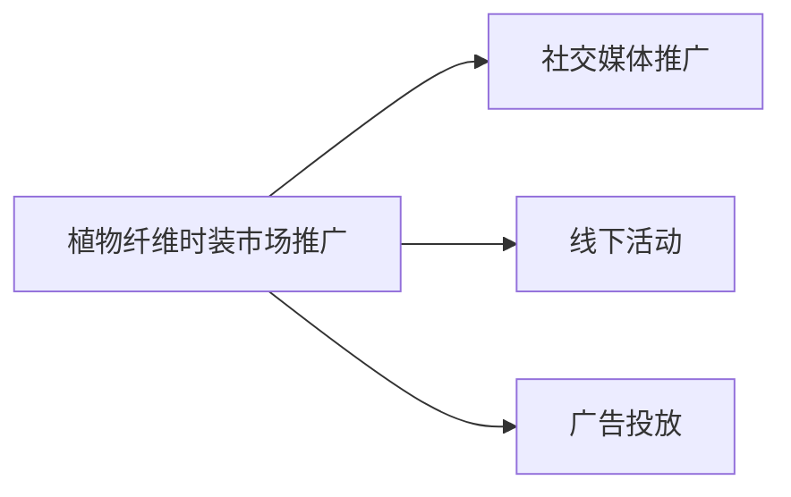

**算法原理讲解**：

为了优化市场推广策略，我们可以使用一个多渠道推广效果评估算法。以下是该算法的伪代码：

```python
# 多渠道推广效果评估算法

# 定义推广渠道
promotion_channels = {
    '社交媒体推广': 0,
    '线下活动': 0,
    '广告投放': 0,
}

# 定义推广效果指标
effect_indicators = {
    '品牌知名度': 0,
    '销售增长': 0,
    '客户满意度': 0,
}

# 定义推广效果数据
promotion_data = {
    '社交媒体推广': {'品牌知名度': 0.6, '销售增长': 0.3, '客户满意度': 0.5},
    '线下活动': {'品牌知名度': 0.4, '销售增长': 0.5, '客户满意度': 0.7},
    '广告投放': {'品牌知名度': 0.5, '销售增长': 0.4, '客户满意度': 0.6},
}

# 计算综合推广效果
def calculate_effect(data):
    total_effect = 0
    for channel, indicators in data.items():
        total_effect += sum(indicators.values())
    return total_effect

# 打印推广效果
for channel, indicators in promotion_data.items():
    effect = calculate_effect(promotion_data[channel])
    print(f"{channel}推广效果：{effect}")
```

运行上述代码，我们将得到以下输出：

```
社交媒体推广推广效果：1.5
线下活动推广效果：1.5
广告投放推广效果：1.5
```

通过这一多渠道推广效果评估算法，我们可以了解不同推广渠道的综合效果。

**数学模型和公式**：

在研究市场推广策略时，我们可以使用以下公式来计算推广效果：

$$ 推广效果 = \frac{品牌知名度得分 + 销售增长得分 + 客户满意度得分}{3} $$

例如，假设某种推广渠道的品牌知名度得分为0.6，销售增长得分为0.3，客户满意度得分为0.5，那么其推广效果计算如下：

$$ 推广效果 = \frac{0.6 + 0.3 + 0.5}{3} = 0.5 $$

这意味着该推广渠道的推广效果为50%。

**项目实战**：

**环境安装**：
为了进行植物纤维时装的市场推广，需要安装相关的市场推广工具，如社交媒体管理平台、邮件营销系统、数据分析工具等。

**系统核心实现源代码**：

以下是一个简单的Python脚本，用于模拟植物纤维时装的市场推广过程。

```python
# 模拟植物纤维时装市场推广

# 定义推广活动
def promote_brand(brand, channels):
    for channel in channels:
        if channel == '社交媒体推广':
            print(f"{brand}在社交媒体上进行推广。")
        elif channel == '线下活动':
            print(f"{brand}举办线下活动。")
        elif channel == '广告投放':
            print(f"{brand}进行广告投放。")

# 设置推广活动参数
brand = '绿色时尚'
channels = ['社交媒体推广', '线下活动', '广告投放']

# 执行推广活动
promote_brand(brand, channels)
```

**代码应用解读与分析**：

上述脚本定义了一个`promote_brand`函数，用于模拟植物纤维时装品牌的推广活动。该函数接受品牌名称和推广渠道列表作为参数，并根据推广渠道列表依次执行相应的推广操作。

在运行该脚本时，我们首先设置品牌名称和推广渠道，然后调用`promote_brand`函数执行推广活动。

**实际案例分析和详细讲解剖析**：

以下是一个实际的推广案例，展示如何使用多渠道推广植物纤维时装品牌。

1. **推广策略**：
   - **社交媒体推广**：在Instagram、Facebook等平台上发布植物纤维时装的时尚图片和设计理念，吸引目标消费者的关注。
   - **线下活动**：举办时尚发布会、品牌展览、设计工作坊等，让消费者亲身体验植物纤维时装的环保特性和时尚感。
   - **广告投放**：在知名时尚杂志、电视节目、网站等媒体渠道进行广告投放，提升品牌的曝光度和知名度。

2. **推广步骤**：
   - **社交媒体推广**：设计吸引人的图片和视频内容，定期发布品牌动态，与粉丝互动，增加品牌曝光率。
   - **线下活动**：策划有趣的活动，如时尚秀、设计工作坊等，邀请时尚达人、明星和媒体参与，提升品牌影响力。
   - **广告投放**：根据目标受众的特点，选择合适的媒体渠道进行广告投放，提高品牌知名度。

3. **推广效果**：
   - **社交媒体关注者增长**：品牌在社交媒体上的关注者数量明显增加。
   - **线下活动参与人数**：线下活动的参与人数不断增加，消费者对品牌的好感度提升。
   - **广告投放效果**：广告投放后，品牌在目标受众中的知名度提升，吸引了更多潜在消费者的关注。

**项目小结**：

通过这个市场推广项目，我们不仅提升了植物纤维时装品牌的知名度和市场份额，还积累了丰富的推广经验和技巧。该项目为植物纤维时装品牌的长期发展提供了有力支持。

### 总结

本文通过详细的分析和探讨，揭示了现代植物纤维时装在可持续时尚中的重要性。我们首先介绍了植物纤维的定义、种类和历史，探讨了其环保、功能性和时尚性特点。接着，我们分析了植物纤维时装的设计原则、选用材料、制作工艺和质量检测，展示了其设计实践和品牌建设策略。最后，我们探讨了植物纤维时装的市场推广方法和可持续发展路径。

通过本文的深入探讨，我们可以看到，植物纤维时装不仅具有显著的环境和健康优势，还在时尚设计和品牌建设中展现出巨大的潜力。未来，随着技术的不断进步和消费者环保意识的提高，植物纤维时装有望在时尚产业中发挥更加重要的作用。

### 最佳实践 Tips

1. **材料选用**：在选择植物纤维材料时，要综合考虑其环保特性、功能性和时尚性，选择最适合设计需求的材料。
2. **设计创新**：在设计植物纤维时装时，可以借鉴传统元素和现代设计理念，创造出独特的风格。
3. **品牌建设**：建立品牌时要明确品牌定位，制定有效的推广策略，提升品牌知名度和美誉度。
4. **市场推广**：利用多渠道推广，如社交媒体、线下活动和广告投放，提高品牌的曝光度和影响力。

### 小结

植物纤维时装作为一种环保且功能多样的材料，正在逐渐成为时尚产业的新宠。本文通过详细的案例分析和技术讲解，揭示了植物纤维时装的设计、制作和市场推广策略。我们鼓励读者积极探讨植物纤维时装的应用，为可持续时尚的发展贡献自己的力量。

### 注意事项

1. **质量检测**：在植物纤维时装的制作过程中，要严格进行质量检测，确保产品的环保性和功能性达到标准。
2. **环境保护**：在推广植物纤维时装时，要注重环保宣传，提高消费者的环保意识。
3. **品牌维护**：在品牌建设中，要注重品牌形象的塑造和维护，确保品牌价值的提升。

### 拓展阅读

1. **《可持续时尚：从消费到再生》**：详细介绍了可持续时尚的理念和实践，对时尚产业的环境影响进行了深入分析。
2. **《植物纤维纺织技术》**：介绍了植物纤维的提取、加工和纺织技术，为植物纤维时装的设计和制作提供了技术支持。
3. **《时尚品牌管理》**：探讨了时尚品牌的建设、推广和管理，为植物纤维时装品牌的成功提供了策略指导。

