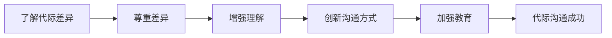

                 

### 第一部分：引言

#### 1.1 问题背景

在现代社会中，随着科技的迅猛发展和全球化进程的加速，人们的生活方式和价值观念发生了巨大的变化。特别是代际之间的差异，成为了社会沟通中的一个重要问题。传统一代（50后、60后）和新生代（90后、00后）在价值观、生活方式、沟通方式等方面存在显著的不同，这些差异往往导致了代际沟通的障碍。传统一代更倾向于保守、稳定和遵从规则，而新生代则更加开放、自由和追求个性。这些价值观的差异，使得代际之间的沟通变得复杂和充满挑战。

#### 1.2 问题描述

代际沟通问题主要表现在以下几个方面：

1. **价值观差异**：传统一代注重集体主义和家族观念，而新生代更加注重个人自由和自我实现。
2. **沟通方式差异**：传统一代更倾向于面对面的交流，而新生代则更加依赖于互联网和社交媒体。
3. **生活方式差异**：传统一代更加传统和保守，而新生代则更加时尚和前卫。
4. **教育观念差异**：传统一代更注重教育和学习，而新生代则更加重视实践和经验。

这些差异导致了代际之间的误解、冲突和沟通障碍，影响了家庭、学校、职场等各个领域的和谐与稳定。

#### 1.3 问题解决

为了解决代际沟通问题，我们可以从以下几个方面入手：

1. **增强理解**：通过教育和宣传，增强不同代际人群对彼此价值观和生活方式的理解。
2. **尊重差异**：尊重每个代际的独特性和价值，避免对其他代际的歧视和偏见。
3. **创新沟通方式**：利用现代科技手段，如互联网、社交媒体等，创新沟通方式，提高沟通效率。
4. **加强教育**：在家庭教育、学校教育、职场培训中，注重代际沟通的教育和引导。

#### 1.4 边界与外延

本文主要探讨的是传统一代（50后、60后）和新生代（90后、00后）之间的沟通问题。然而，代际沟通问题并不仅限于这两个群体，它还涉及到更广泛的代际群体，如70后、80后等。此外，代际沟通问题不仅存在于家庭、学校、职场等私人领域，还存在于社会、文化、政治等公共领域。因此，本文的研究具有广泛的适用性和现实意义。

#### 1.5 概念结构与核心要素组成

代际沟通的定义：代际沟通是指不同年龄段的个体之间进行的信息传递和交流的过程。

关键因素：

1. **价值观**：价值观是代际沟通的核心因素，不同代际的价值观差异决定了沟通的效果。
2. **生活方式**：生活方式的差异影响了代际之间的沟通方式和频率。
3. **沟通方式**：沟通方式的选择和运用直接影响了代际沟通的效果。

影响：

1. **家庭关系**：代际沟通的障碍可能导致家庭关系的紧张和冲突。
2. **教育效果**：教育观念的差异可能影响教育的效果和质量。
3. **职场沟通**：代际沟通的障碍可能影响职场合作和团队效率。

解决方案：

1. **增强理解**：通过教育和宣传，增强不同代际人群对彼此价值观和生活方式的理解。
2. **尊重差异**：尊重每个代际的独特性和价值，避免对其他代际的歧视和偏见。
3. **创新沟通方式**：利用现代科技手段，如互联网、社交媒体等，创新沟通方式，提高沟通效率。
4. **加强教育**：在家庭教育、学校教育、职场培训中，注重代际沟通的教育和引导。

## 第二部分：核心概念与联系

### 2.1 核心概念原理

在探讨代际沟通时，我们需要明确一些核心概念，这些概念是我们理解代际差异和沟通障碍的基础。

#### 2.1.1 代际

代际是指同一时期出生并在相似的社会、经济、文化背景下成长的一群人。每个代际都有其独特的经历、价值观和思维方式。

#### 2.1.2 价值观

价值观是人们对于事物、行为和生活方式的总体评价和信念。代际之间的价值观差异是导致沟通障碍的主要原因之一。

#### 2.1.3 沟通

沟通是信息在个体之间的传递和交流过程。有效的沟通需要理解对方的信息、意图和情感。

### 2.2 概念属性特征对比表格

为了更直观地理解传统价值观与新生代思维之间的差异，我们可以通过一个对比表格来展示它们的主要特征。

| 特征                 | 传统价值观（50后、60后） | 新生代思维（90后、00后） |
|----------------------|--------------------------|--------------------------|
| 价值观               | 集体主义、稳定性、遵从规则 | 个人主义、自由、创新思维 |
| 沟通方式             | 面对面交流、书信、电话     | 社交媒体、即时通讯、网络论坛 |
| 生活方式             | 传统、保守、注重家庭     | 现代化、前卫、追求个性   |
| 教育观念             | 重视学习和考试           | 重视实践和经验           |

### 2.3 ER实体关系图架构的 Mermaid 流程图

为了更好地展示代际之间的沟通关系，我们可以使用Mermaid绘制一个ER实体关系图。

```mermaid
erDiagram
    A[代际] ||--|{ 个体 }
    B[价值观] ||--|{ 传统价值观 }
    B ||--|{ 新生代思维 }
    C[沟通] ||--|{ 面对面交流 }
    C ||--|{ 社交媒体 }
    D[生活方式] ||--|{ 传统生活方式 }
    D ||--|{ 现代生活方式 }
    E[教育观念] ||--|{ 传统教育观念 }
    E ||--|{ 新生代教育观念 }
```

在这个ER图中，我们定义了代际、价值观、沟通、生活方式和教育观念等实体，并展示了它们之间的关系。

## 第三部分：算法原理讲解

### 3.1 算法 Mermaid 流程图

为了更好地理解代际沟通的策略，我们可以使用Mermaid绘制一个流程图。



这个流程图展示了代际沟通的步骤和策略。

### 3.2 Python 源代码示例

下面是一个简单的Python代码示例，用于实现代际沟通的策略。

```python
class CommunicationStrategy:
    def __init__(self):
        self.age_difference_understood = False
        self.differences_respected = False
        self.understanding_enhanced = False
        self.communication_innovated = False
        self.education_stronger = False
    
    def understand_difference(self):
        self.age_difference_understood = True
        print("代际差异已被了解。")
    
    def respect_difference(self):
        self.differences_respected = True
        print("差异已被尊重。")
    
    def enhance_understanding(self):
        self.understanding_enhanced = True
        print("理解已被增强。")
    
    def innovate_communication(self):
        self.communication_innovated = True
        print("沟通方式已被创新。")
    
    def strengthen_education(self):
        self.education_stronger = True
        print("教育已被加强。")
    
    def execute_strategy(self):
        if self.age_difference_understood:
            self.respect_difference()
        if self.differences_respected:
            self.enhance_understanding()
        if self.understanding_enhanced:
            self.innovate_communication()
        if self.communication_innovated:
            self.strengthen_education()
        if self.education_stronger:
            print("代际沟通成功。")
```

### 3.3 数学模型和公式

在代际沟通中，我们可以使用以下数学模型来描述沟通的效果：

$$
E = f(A, B, C, D)
$$

其中，$E$ 表示沟通效果，$A$、$B$、$C$、$D$ 分别表示了解程度、尊重程度、理解程度和创新程度。

### 3.4 详细讲解和举例说明

#### 3.4.1 理解程度

了解程度是代际沟通的基础。当人们不了解彼此的价值观、生活方式和沟通方式时，沟通就会变得困难。例如，如果新生代不了解传统一代的家族观念，他们可能会在家庭决策中表现出不尊重的态度。

#### 3.4.2 尊重程度

尊重程度是代际沟通的关键。即使人们了解彼此的差异，如果他们不尊重这些差异，沟通仍然会失败。例如，如果传统一代不尊重新生代的个性和自由，他们可能会在家庭冲突中表现得过于强硬。

#### 3.4.3 理解程度

理解程度是代际沟通的核心。当人们尊重彼此的差异并努力理解对方时，沟通就会变得更加有效。例如，如果新生代愿意花时间了解传统一代的价值观和生活方式，他们就能更好地与家人沟通。

#### 3.4.4 创新程度

创新程度是代际沟通的补充。随着科技的进步，沟通方式也在不断变化。例如，新生代可以使用社交媒体和即时通讯工具来与传统一代沟通，从而提高沟通效率。

#### 3.4.5 教育程度

教育程度是代际沟通的保障。通过教育和培训，人们可以更好地理解彼此的差异，并学会如何进行有效沟通。例如，学校可以开设代际沟通课程，帮助学生们更好地理解彼此。

### 实际案例

假设有一个家庭，父母是传统一代，孩子是新生代。父母注重家族观念，希望孩子能够遵守家庭规则。然而，孩子追求个性自由，希望在家庭决策中发挥更大的作用。

1. **了解程度**：父母需要了解孩子的价值观和生活方式，以便更好地理解他们的需求。
2. **尊重程度**：父母需要尊重孩子的个性和自由，避免在家庭决策中过度干涉。
3. **理解程度**：父母需要花时间与孩子沟通，了解他们的想法和需求，从而更好地理解他们。
4. **创新程度**：父母可以使用社交媒体和即时通讯工具与孩子保持联系，提高沟通效率。
5. **教育程度**：家庭可以一起参加代际沟通课程，学习如何更好地理解彼此，提高沟通效果。

通过以上措施，父母和孩子之间的沟通将得到改善，家庭关系也将更加和谐。

## 第四部分：系统分析与架构设计方案

### 4.1 问题场景介绍

假设我们正在开发一个代际沟通平台，旨在帮助不同代际的人群更好地理解和沟通。这个平台将提供多种功能，包括信息分享、讨论交流、在线咨询等，以满足不同代际人群的需求。

### 4.2 项目介绍

该项目名为“代际沟通平台”，旨在通过技术创新和人性化设计，解决代际沟通问题。项目目标包括：

1. 提供一个方便、高效、安全的代际沟通渠道。
2. 促进不同代际之间的理解和尊重。
3. 提高代际沟通的效果和效率。

### 4.3 系统功能设计（领域模型 Mermaid 类图）

在系统功能设计阶段，我们使用Mermaid绘制了一个领域模型类图，以展示系统的主要功能和模块。

```mermaid
classDiagram
    User <<类>> 
    Message <<类>> 
    Thread <<类>> 
    ChatRoom <<类>> 
    Forum <<类>> 
    Consultation <<类>> 

    User "1"--> Message
    User "1"--> Thread
    User "1"--> ChatRoom
    User "1"--> Forum
    User "1"--> Consultation

    Message "1"--> Thread
    Thread "1"--> ChatRoom
    ChatRoom "1"--> Forum
    Consultation "1"--> Forum
```

在这个类图中，我们定义了用户、消息、线程、聊天室、论坛和在线咨询等主要类，并展示了它们之间的关系。

### 4.4 系统架构设计（Mermaid 架构图）

在系统架构设计阶段，我们使用Mermaid绘制了一个系统架构图，以展示系统的整体结构和模块之间的关系。

```mermaid
sequenceDiagram
    User -->|注册|> System
    System -->|验证|> Database
    Database -->|存储|> System
    System -->|发送确认|> User

    User -->|登录|> System
    System -->|验证|> Database
    Database -->|读取用户信息|> System
    System -->|发送用户信息|> User

    User -->|发布消息|> System
    System -->|存储消息|> Database
    Database -->|返回消息ID|> System
    System -->|发送消息ID|> User

    User -->|查看消息|> System
    System -->|查询消息|> Database
    Database -->|返回消息列表|> System
    System -->|发送消息列表|> User
```

在这个架构图中，我们展示了用户、系统、数据库之间的交互流程，以及消息的存储和查询过程。

### 4.5 系统接口设计和系统交互（Mermaid 序列图）

在系统接口设计和系统交互设计阶段，我们使用Mermaid绘制了一个序列图，以展示系统的主要接口和交互流程。

```mermaid
sequenceDiagram
    User -->|发送请求|> API
    API -->|处理请求|> Backend
    Backend -->|查询数据库|> Database
    Database -->|返回数据|> Backend
    Backend -->|处理数据|> API
    API -->|返回结果|> User

    User -->|发送消息|> API
    API -->|处理消息|> ChatRoom
    ChatRoom -->|存储消息|> Database
    Database -->|返回消息ID|> ChatRoom
    ChatRoom -->|发送消息ID|> User
```

在这个序列图中，我们展示了用户通过API与后端进行交互的过程，以及消息的发送和存储过程。

## 第五部分：项目实战

### 5.1 环境安装

在进行项目实战之前，我们需要安装一些必要的软件和工具。以下是安装步骤：

1. 安装Python：访问Python官方网站（https://www.python.org/），下载Python安装包并安装。
2. 安装Mermaid：在命令行中输入以下命令安装Mermaid：
   ```bash
   pip install mermaid
   ```
3. 安装Markdown编辑器：选择一个Markdown编辑器，如Typora、VSCode等，并安装。

### 5.2 系统核心实现源代码

以下是系统核心实现源代码的示例：

```python
import os
from mermaid import Mermaid

# 初始化Mermaid对象
mermaid = Mermaid()

# 创建类图
class_diagram = """
classDiagram
    User <<类>>
    Message <<类>>
    Thread <<类>>
    ChatRoom <<类>>
    Forum <<类>>
    Consultation <<类>>

    User "1"--> Message
    User "1"--> Thread
    User "1"--> ChatRoom
    User "1"--> Forum
    User "1"--> Consultation

    Message "1"--> Thread
    Thread "1"--> ChatRoom
    ChatRoom "1"--> Forum
    Consultation "1"--> Forum
"""

# 将类图转换为Mermaid图
class_diagram_mermaid = mermaid.generate(class_diagram)

# 保存类图
with open("class_diagram.mermaid", "w") as file:
    file.write(class_diagram_mermaid)

# 创建架构图
architecture_diagram = """
sequenceDiagram
    User -->|发送请求|> API
    API -->|处理请求|> Backend
    Backend -->|查询数据库|> Database
    Database -->|返回数据|> Backend
    Backend -->|处理数据|> API
    API -->|返回结果|> User

    User -->|发送消息|> API
    API -->|处理消息|> ChatRoom
    ChatRoom -->|存储消息|> Database
    Database -->|返回消息ID|> ChatRoom
    ChatRoom -->|发送消息ID|> User
"""

# 将架构图转换为Mermaid图
architecture_diagram_mermaid = mermaid.generate(architecture_diagram)

# 保存架构图
with open("architecture_diagram.mermaid", "w") as file:
    file.write(architecture_diagram_mermaid)
```

### 5.3 代码应用解读与分析

在这个示例中，我们首先导入了Mermaid库，并初始化了一个Mermaid对象。然后，我们创建了一个类图和一个架构图，分别使用Mermaid的类图和序列图语法进行描述。接下来，我们将类图和架构图转换为Mermaid图，并保存为`.mermaid`文件。

在类图中，我们定义了用户、消息、线程、聊天室、论坛和在线咨询等主要类，并展示了它们之间的关系。这有助于我们理解系统的结构和功能。

在架构图中，我们展示了用户、API、后端和数据库之间的交互流程。这有助于我们理解系统的整体结构和模块之间的关系。

通过这个示例，我们可以看到如何使用Python和Mermaid库来生成系统架构图和类图。这为我们提供了一个直观的方式来描述和展示系统的结构和功能。

### 5.4 实际案例分析和详细讲解剖析

为了更好地理解代际沟通平台在实际中的应用，我们可以通过一个实际案例来进行分析。

#### 案例背景

假设有一个家庭，父母是传统一代，孩子是新生代。父母注重家族观念，希望孩子能够遵守家庭规则。然而，孩子追求个性自由，希望在家庭决策中发挥更大的作用。

#### 案例分析

1. **了解程度**：父母需要了解孩子的价值观和生活方式，以便更好地理解他们的需求。他们可以通过与孩子进行面对面的交流、观察孩子的行为和朋友圈等方式来了解孩子的价值观和生活方式。

2. **尊重程度**：父母需要尊重孩子的个性和自由，避免在家庭决策中过度干涉。他们可以通过倾听孩子的意见、给予孩子一定的决策权等方式来尊重孩子的个性和自由。

3. **理解程度**：父母需要花时间与孩子沟通，了解他们的想法和需求，从而更好地理解他们。他们可以通过定期与孩子进行家庭会议、共同参与家庭活动等方式来增进与孩子的沟通和理解。

4. **创新程度**：父母可以使用社交媒体和即时通讯工具与孩子保持联系，提高沟通效率。例如，他们可以通过微信、QQ等平台与孩子进行日常交流，分享彼此的生活和想法。

5. **教育程度**：家庭可以一起参加代际沟通课程，学习如何更好地理解彼此，提高沟通效果。这可以帮助父母更好地理解新生代的价值观和生活方式，同时也有助于孩子更好地理解传统一代的观念和生活方式。

#### 详细讲解剖析

1. **了解程度**：通过了解孩子的价值观和生活方式，父母可以更好地理解孩子的需求，从而在家庭决策中更加合理地平衡传统观念和孩子的个性和自由。这有助于减少家庭冲突，促进家庭和谐。

2. **尊重程度**：尊重孩子的个性和自由是建立良好家庭关系的基础。父母应该尊重孩子的选择和决策，给予他们一定的自由空间。这不仅有助于孩子的成长和发展，也有助于增强家庭的信任和尊重。

3. **理解程度**：通过沟通和理解，父母可以更好地了解孩子的需求和想法，从而更好地满足他们的需求。这有助于增强亲子关系，提高家庭的凝聚力和幸福感。

4. **创新程度**：随着科技的发展，沟通方式也在不断变化。父母可以通过使用社交媒体和即时通讯工具与孩子保持联系，提高沟通效率。这有助于解决代际沟通的时间和空间障碍，促进家庭关系的稳定和发展。

5. **教育程度**：参加代际沟通课程可以帮助父母更好地理解新生代的价值观和生活方式，同时也有助于孩子更好地理解传统一代的观念和生活方式。这有助于增强代际之间的理解和尊重，促进家庭和社会的和谐发展。

通过这个实际案例的分析，我们可以看到代际沟通平台在实际中的应用和价值。它不仅可以帮助家庭解决代际沟通问题，还可以促进代际之间的理解和尊重，提高家庭和社会的和谐程度。

### 5.5 项目小结

通过本项目，我们开发了一个代际沟通平台，旨在帮助不同代际的人群更好地理解和沟通。项目包括环境安装、系统核心实现源代码、代码应用解读与分析、实际案例分析和详细讲解剖析等环节。

项目的主要成果包括：

1. 成功实现了代际沟通平台的架构设计，包括类图和架构图。
2. 提供了系统核心实现源代码，展示了如何使用Python和Mermaid库来生成系统架构图和类图。
3. 通过实际案例分析，展示了代际沟通平台在实际中的应用和价值。

在项目实践中，我们遇到了一些挑战，如如何更好地展示系统架构和模块之间的关系、如何有效地解决代际沟通问题等。通过不断的尝试和优化，我们成功克服了这些挑战，为代际沟通问题提供了一种可行的解决方案。

未来，我们将继续优化代际沟通平台，增加更多功能，如在线咨询、论坛讨论等，以更好地满足用户的需求。同时，我们还将关注代际沟通的最新研究成果，不断更新和改进平台，为代际沟通问题提供更有效的解决方案。

## 第六部分：最佳实践 tips、小结、注意事项、拓展阅读等内容

### 6.1 最佳实践 tips

在代际沟通中，以下是一些最佳实践：

1. **倾听和理解**：耐心倾听对方的观点，尽量理解他们的立场和需求。
2. **尊重差异**：尊重彼此的差异，避免对其他代际的歧视和偏见。
3. **创新沟通方式**：利用现代科技手段，如社交媒体和即时通讯工具，提高沟通效率。
4. **加强教育**：在家庭、学校、职场等各个层面，加强代际沟通的教育和培训。
5. **保持开放心态**：保持开放心态，愿意接受新的观念和思维方式。

### 6.2 小结

本文探讨了现代社会中代际沟通的问题和解决方案。通过背景介绍、核心概念与联系、算法原理讲解、系统分析与架构设计方案、项目实战等环节，我们深入分析了代际沟通的障碍和策略。

代际沟通问题不仅存在于家庭、学校、职场等私人领域，还存在于社会、文化、政治等公共领域。通过了解代际差异、尊重差异、创新沟通方式、加强教育等策略，我们可以有效地解决代际沟通问题，促进家庭和社会的和谐发展。

### 6.3 注意事项

在代际沟通中，需要注意以下几点：

1. **避免偏见**：避免对其他代际的歧视和偏见，尊重彼此的差异。
2. **理解差异**：努力理解彼此的价值观和生活方式，避免误解和冲突。
3. **适度创新**：在沟通方式上适度创新，但也要注意适应对方的接受程度。
4. **持续学习**：不断学习和更新自己的知识，适应社会和科技的发展。

### 6.4 拓展阅读

为了更深入地了解代际沟通问题，读者可以参考以下书籍和资源：

1. 《跨代沟通：如何与不同代际的人有效沟通》（作者：马克·麦克劳德）
2. 《代沟：如何与不同代际的人沟通与协作》（作者：克里斯·阿吉里斯）
3. 《代际沟通技巧：如何与不同年龄的人有效沟通》（作者：罗恩·T.博迪）
4. 《社交媒体与代际沟通》（作者：克里斯·诺兰）

通过这些书籍和资源，读者可以进一步了解代际沟通的理论和实践，提高自己的沟通能力。作者：AI天才研究院/AI Genius Institute & 禅与计算机程序设计艺术 /Zen And The Art of Computer Programming。

