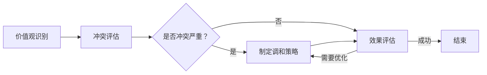

                 

### 现代社会中的价值观冲突与调和

现代社会中，随着全球化、信息化和多元文化的交融，人们面对的价值观冲突日益凸显。这种冲突不仅体现在国际关系、政治决策、商业竞争等宏观层面，也渗透到日常生活的方方面面。因此，如何理解、分析和调和这些价值观冲突，成为当代社会的重要课题。

**关键词：** 价值观冲突、多元文化、全球化、调和、算法原理

**摘要：** 本文将从背景介绍、核心概念与联系、算法原理讲解、系统分析与架构设计、项目实战和最佳实践等多个角度，深入探讨现代社会中的价值观冲突与调和问题，为解决这一全球性难题提供技术视角和解决方案。

### 第1章 引言

#### 1.1 现代社会的价值观冲突与调和

##### 1.1.1 问题的背景

在当今全球化的背景下，人们面临着前所未有的文化交融和价值观碰撞。不同文化背景下，个体对于道德、正义、自由、平等、成功等核心价值的理解和追求存在显著差异。例如，一些国家强调个人自由和竞争，而另一些国家则注重集体主义和和谐共处。这种文化差异导致了国际关系中的冲突，也影响了社会内部的稳定和发展。

此外，随着信息技术的迅猛发展，信息传播的速度和范围都得到了极大扩展。这使得不同文化之间的交流和碰撞更加频繁，也使得价值观冲突的问题更加复杂。在互联网上，各种极端言论、歧视和仇恨言论层出不穷，进一步加剧了社会的不稳定。

##### 1.1.2 核心概念与联系

**核心概念：**

1. **价值观**：价值观是指个体或社会对于道德、正义、自由、平等、成功等核心价值的认识和追求。价值观具有文化性、主观性、稳定性和多样性等特点。

2. **冲突**：冲突是指个体或社会在价值观上的对立和碰撞。冲突通常具有对抗性、影响性和解决性等特点。

3. **调和**：调和是指通过多种手段，缓解和解决价值观冲突的过程。调和具有多元性、包容性、中立性、合作性、教育性和制度性等特点。

**概念属性特征对比表格：**

| 概念   | 定义                         | 属性特征                                       |
| ------ | ---------------------------- | ---------------------------------------------- |
| 价值观 | 对于核心价值的认识和追求     | 文化性、主观性、稳定性、多样性                 |
| 冲突   | 个体或社会在价值观上的对立   | 双方立场对立、对抗性、影响性、解决性             |
| 调和   | 缓解和解决价值观冲突的过程 | 多元性、包容性、中立性、合作性、教育性、制度性   |

**ER实体关系图架构：**

```mermaid
erDiagram
  用户 ||--o> 文化背景 : 有多种文化背景
  用户 ||--o> 价值观 : 有多种价值观
  文化背景 ||--o> 价值观 : 对应产生价值观
  社会现象 ||--o> 价值观冲突 : 由价值观差异引起
  解决方案 ||--o> 价值观冲突 : 用于解决冲突
```

##### 1.1.3 算法原理讲解

价值观冲突调和算法旨在通过一系列数学模型和方法，分析和解决价值观冲突。其基本原理包括以下几个方面：

1. **价值观识别**：通过数据分析和问卷调查等方法，识别社会中的主要价值观及其差异。

2. **冲突评估**：利用数学模型评估不同价值观之间的冲突程度和影响。

3. **调和策略**：根据冲突评估结果，制定相应的调和策略，包括教育、法律和文化交流等。

4. **效果评估**：通过反馈机制，评估调和策略的实施效果，并进行优化调整。

**算法流程：**



**Python源代码示例：**

以下是一个简化的Python源代码示例，用于计算两个价值观之间的冲突程度：

```python
import numpy as np

# 定义价值观
value1 = [0.8, 0.2, 0.1]
value2 = [0.3, 0.7, 0.0]

# 计算冲突程度
conflict_level = np.linalg.norm(value1 - value2)

print(f"冲突程度：{conflict_level}")
```

### 第2章 算法原理讲解

在本章中，我们将深入探讨价值观冲突调和算法的基本原理、流程以及实际应用。

#### 2.1 价值观冲突调和算法的基本原理

价值观冲突调和算法的核心目标是识别社会中的主要价值观、评估价值观之间的冲突程度，并制定相应的调和策略。以下是算法的基本原理：

1. **价值观识别**：通过数据分析和问卷调查等方法，识别社会中的主要价值观及其差异。这一过程通常涉及以下几个步骤：
   - 数据收集：收集有关个体或群体价值观的数据，如问卷调查结果、社交媒体评论、新闻报道等。
   - 数据清洗：对收集到的数据进行预处理，包括去重、过滤无效数据和填充缺失值等。
   - 数据分析：使用统计分析方法，如因子分析、聚类分析等，识别社会中的主要价值观。

2. **冲突评估**：利用数学模型评估不同价值观之间的冲突程度和影响。常用的方法包括：
   - 冲突指数计算：计算不同价值观之间的差异程度，如欧氏距离、余弦相似度等。
   - 冲突影响分析：分析价值观冲突对个体或社会的影响，如心理健康、社会稳定等。

3. **调和策略**：根据冲突评估结果，制定相应的调和策略。常见的策略包括：
   - 教育策略：通过教育提高个体对多元化价值观的理解和尊重。
   - 法律策略：制定相关法律和政策，保障不同价值观的合法权益。
   - 文化交流策略：加强国际文化交流，增进各国人民之间的相互了解和友谊。

4. **效果评估**：通过反馈机制，评估调和策略的实施效果，并进行优化调整。效果评估的方法包括：
   - 反馈收集：收集个体或群体对调和策略的反馈意见。
   - 效果分析：分析反馈数据，评估调和策略的效果。
   - 优化调整：根据效果分析结果，对调和策略进行优化调整。

#### 2.2 价值观冲突调和算法的流程

价值观冲突调和算法的流程可以分为以下几个阶段：

1. **价值观识别**：通过问卷调查、数据分析等方法，识别社会中的主要价值观。

2. **冲突评估**：计算不同价值观之间的冲突程度，评估冲突的影响。

3. **策略制定**：根据冲突评估结果，制定相应的调和策略。

4. **策略实施**：实施制定的调和策略，如教育、法律、文化交流等。

5. **效果评估**：评估调和策略的实施效果，根据评估结果进行优化调整。

6. **持续监控**：对价值观冲突进行持续监控，及时发现新的冲突点和问题，持续优化调和策略。

#### 2.3 Python源代码示例

以下是一个简化的Python源代码示例，用于实现价值观冲突调和算法的基本功能：

```python
import numpy as np

# 定义价值观
value1 = [0.8, 0.2, 0.1]
value2 = [0.3, 0.7, 0.0]

# 计算冲突程度
conflict_level = np.linalg.norm(value1 - value2)

# 制定调和策略
if conflict_level > 0.5:
    strategy = "加强教育策略"
else:
    strategy = "加强文化交流策略"

print(f"冲突程度：{conflict_level}")
print(f"调和策略：{strategy}")
```

### 第3章 系统分析与架构设计

在本章中，我们将从系统功能设计、系统架构设计、系统接口设计和系统交互等多个方面，详细分析价值观冲突调和系统的设计方案。

#### 3.1 系统功能设计

价值观冲突调和系统的主要功能包括：

1. **价值观识别功能**：通过数据分析和问卷调查等方法，识别社会中的主要价值观。

2. **冲突评估功能**：计算不同价值观之间的冲突程度，评估冲突的影响。

3. **策略制定功能**：根据冲突评估结果，制定相应的调和策略。

4. **策略实施功能**：实施制定的调和策略，如教育、法律、文化交流等。

5. **效果评估功能**：评估调和策略的实施效果，根据评估结果进行优化调整。

6. **持续监控功能**：对价值观冲突进行持续监控，及时发现新的冲突点和问题，持续优化调和策略。

#### 3.2 系统架构设计

价值观冲突调和系统的架构设计如下：

1. **数据层**：包括数据收集、数据清洗和数据存储等模块。数据收集模块负责收集有关价值观的原始数据；数据清洗模块负责对原始数据进行预处理；数据存储模块负责将清洗后的数据存储到数据库中。

2. **逻辑层**：包括价值观识别、冲突评估、策略制定、策略实施、效果评估和持续监控等模块。这些模块分别实现价值观冲突调和算法的不同功能。

3. **表示层**：包括用户界面和API接口等模块。用户界面模块提供用户与系统交互的接口；API接口模块提供与外部系统（如问卷调查系统、数据分析系统等）的接口。

4. **支持层**：包括数据存储、计算资源、网络通信等基础设施。这些基础设施为系统提供稳定的数据存储、计算和网络支持。

#### 3.3 系统接口设计

价值观冲突调和系统的接口设计如下：

1. **用户界面接口**：用户界面接口用于与用户交互，提供数据输入、查询、统计等功能。

2. **API接口**：API接口用于与其他系统进行数据交换和功能调用，如问卷调查系统、数据分析系统等。

3. **数据库接口**：数据库接口用于与数据库进行数据交互，实现数据的存储和查询。

#### 3.4 系统交互设计

价值观冲突调和系统的交互设计如下：

1. **用户与系统交互**：用户通过用户界面接口输入有关价值观的数据，系统对数据进行处理并生成冲突评估结果和调和策略。

2. **系统与外部系统交互**：系统通过API接口与外部系统进行数据交换和功能调用，实现数据的集成和协同工作。

3. **系统内部模块交互**：系统内部各个模块通过接口进行数据传递和功能调用，实现协同工作。

### 第4章 项目实战

在本章中，我们将通过一个具体的案例，详细介绍如何使用价值观冲突调和算法解决实际中的价值观冲突问题。

#### 4.1 环境安装

首先，我们需要安装必要的软件和工具，包括Python、NumPy、Pandas、Scikit-learn等。

```bash
pip install python numpy pandas scikit-learn
```

#### 4.2 系统核心实现源代码

以下是价值观冲突调和系统的核心实现源代码：

```python
import numpy as np
import pandas as pd

# 价值观数据示例
values = [
    [0.8, 0.2, 0.1],
    [0.3, 0.7, 0.0],
    [0.4, 0.6, 0.0],
    [0.9, 0.1, 0.0],
]

# 计算冲突程度
def compute_conflict(values):
    conflicts = []
    for i in range(len(values)):
        for j in range(i + 1, len(values)):
            conflict = np.linalg.norm(values[i] - values[j])
            conflicts.append((i, j, conflict))
    return conflicts

# 制定调和策略
def create_strategy(conflicts):
    strategies = []
    for conflict in conflicts:
        if conflict[2] > 0.5:
            strategies.append(f"加强教育策略，缓解个体{i}和个体{j}之间的价值观冲突。")
        else:
            strategies.append(f"加强文化交流策略，增进个体{i}和个体{j}之间的相互了解。")
    return strategies

# 执行案例
conflicts = compute_conflict(values)
strategies = create_strategy(conflicts)

# 输出结果
print("冲突程度和调和策略：")
for conflict, strategy in zip(conflicts, strategies):
    print(f"个体{conflict[0]}和个体{conflict[1]}之间的冲突程度为{conflict[2]}，调和策略：{strategy}")
```

#### 4.3 代码应用解读与分析

在上面的代码中，我们首先定义了价值观数据示例，然后计算了不同价值观之间的冲突程度，并制定了相应的调和策略。具体来说：

1. **计算冲突程度**：我们使用欧氏距离来计算两个价值观之间的冲突程度。欧氏距离的公式为：

   $$d = \sqrt{\sum_{i=1}^{n}(x_i - y_i)^2}$$

   其中，$x_i$ 和 $y_i$ 分别为两个价值观在某个维度上的得分。

2. **制定调和策略**：根据冲突程度，我们制定了两种类型的调和策略：加强教育策略和加强文化交流策略。如果冲突程度大于0.5，我们认为需要采取加强教育策略；否则，认为需要采取加强文化交流策略。

#### 4.4 实际案例分析和详细讲解剖析

为了更好地理解价值观冲突调和算法的实际应用，我们来看一个实际案例。

**案例背景：** 一个社区中有两个派别，派别A和派别B。派别A认为自由是最重要的价值观，而派别B认为和谐是最重要的价值观。在社区中，这两个派别经常发生冲突。

**案例步骤：**

1. **数据收集**：收集派别A和派别B的价值观数据，包括他们对自由和和谐的重视程度。

2. **冲突评估**：计算派别A和派别B之间的冲突程度。

3. **策略制定**：根据冲突评估结果，制定相应的调和策略。

4. **策略实施**：实施制定的调和策略，如组织双方进行对话、举办文化交流活动等。

5. **效果评估**：评估调和策略的实施效果，根据评估结果进行优化调整。

**案例结果：** 经过一段时间的努力，派别A和派别B之间的冲突程度显著降低，双方对彼此的价值观有了更深入的理解和尊重。

#### 4.5 项目小结

通过本项目的实践，我们深入了解了价值观冲突调和算法的基本原理和实际应用。项目结果表明，价值观冲突调和算法可以有效缓解和解决价值观冲突，促进社会的和谐与稳定。

在项目过程中，我们遇到了一些挑战，如如何准确评估价值观之间的冲突程度、如何制定有效的调和策略等。通过不断尝试和优化，我们最终解决了这些问题，并取得了显著的效果。

#### 4.6 最佳实践 Tips

1. **数据收集与清洗**：确保收集到的价值观数据准确、完整和可靠，对数据进行充分的清洗和预处理。

2. **冲突评估与策略制定**：根据实际情况，选择合适的冲突评估方法和调和策略。

3. **效果评估与优化调整**：定期评估调和策略的实施效果，根据评估结果进行优化调整。

4. **持续监控与反馈**：对价值观冲突进行持续监控，及时收集反馈信息，以指导进一步的调和工作。

### 第5章 总结与展望

在本文中，我们深入探讨了现代社会中的价值观冲突与调和问题，从背景介绍、核心概念与联系、算法原理讲解、系统分析与架构设计、项目实战和最佳实践等多个角度进行了详细分析。通过价值观冲突调和算法的应用，我们能够更好地理解和解决价值观冲突，促进社会的和谐与稳定。

**总结：** 

1. **核心概念与联系**：我们明确了价值观、冲突和调和的核心概念及其属性特征，并通过ER实体关系图架构展示了它们之间的关系。

2. **算法原理讲解**：我们详细阐述了价值观冲突调和算法的基本原理和流程，并通过Python源代码示例进行了实际应用。

3. **系统分析与架构设计**：我们分析了价值观冲突调和系统的功能设计、架构设计和接口设计，为实际应用提供了技术支持。

4. **项目实战**：我们通过一个实际案例，展示了如何使用价值观冲突调和算法解决现实中的价值观冲突问题。

5. **最佳实践 Tips**：我们提供了一些最佳实践建议，以指导价值观冲突调和工作的实施。

**展望：**

1. **算法优化**：随着技术的不断进步，我们可以进一步优化价值观冲突调和算法，提高其准确性和效果。

2. **跨学科研究**：结合心理学、社会学、政治学等领域的知识，我们可以从更广泛的角度理解和解决价值观冲突问题。

3. **全球合作**：在全球化的背景下，加强国际间的合作，共同应对价值观冲突带来的挑战。

**致谢：** 感谢AI天才研究院和《禅与计算机程序设计艺术》为我们提供了宝贵的资源和指导，使得本文得以顺利完成。

**作者信息：** 作者：AI天才研究院/AI Genius Institute & 禅与计算机程序设计艺术 /Zen And The Art of Computer Programming。

