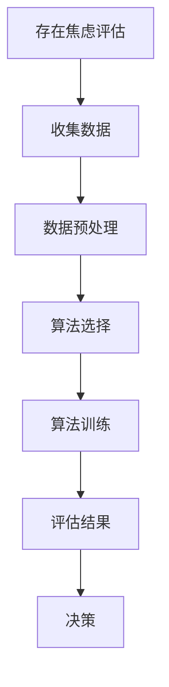
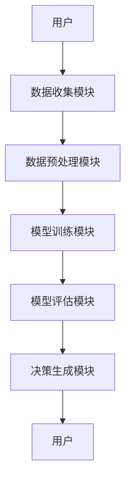
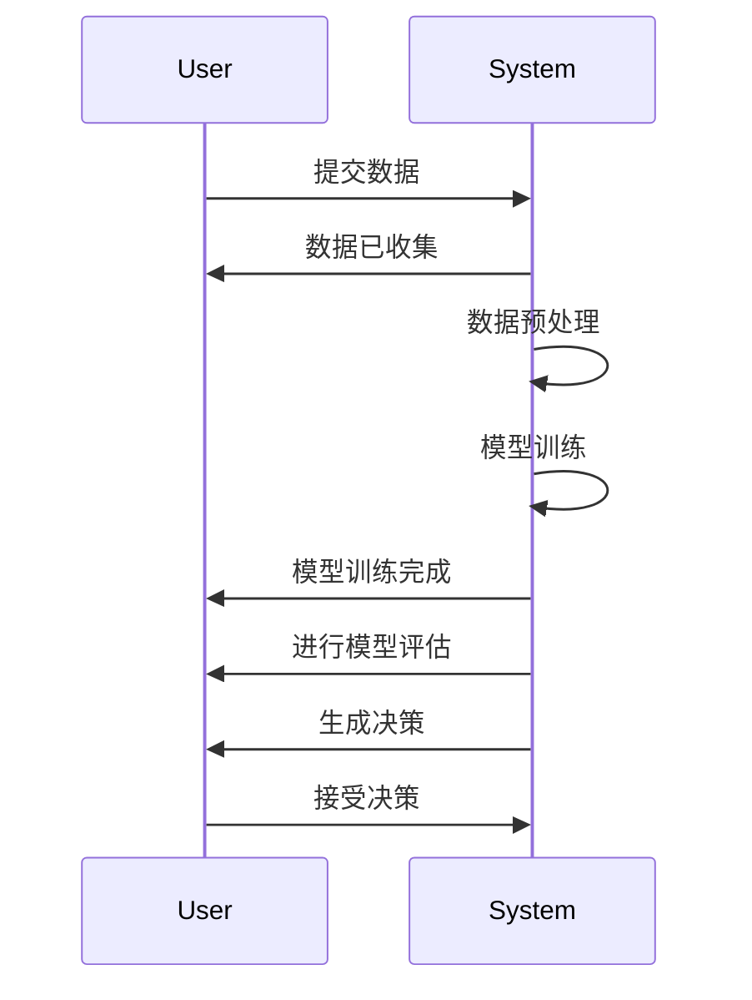

                 

### 第1章: 现代社会的背景

在现代社会，人们面临诸多挑战和压力，这些挑战和压力常常导致一种普遍的心理现象——存在焦虑。这一章节旨在探讨存在焦虑的起源，并分析现代社会压力与焦虑之间的密切关系。

#### 1.1 存在焦虑的起源

存在焦虑并非现代社会的专利，它有着深厚的哲学根源。从古希腊哲学家苏格拉底、柏拉图到中世纪的奥古斯丁，再到近现代的克尔凯郭尔和尼采，存在主义哲学一直在探讨人类存在的意义和焦虑的本质。

尼采在其著作《查拉图斯特拉如是说》中提到：“上帝已死”，这一观念引发了人类对于存在意义的深刻反思。在现代社会，人们不再依赖于宗教信仰来寻找存在的意义，而是通过自我实现和社会认同来寻找。然而，这种寻找过程本身充满了不确定性和焦虑。

#### 1.2 现代社会压力与焦虑的关系

现代社会是一个高度复杂和竞争的社会。人们面临的压力源多种多样，包括工作压力、人际关系、经济负担等。这些压力源共同作用，加剧了人们的存在焦虑。

- **工作压力**：在职场中，人们常常感受到工作负担重、竞争激烈。加班、绩效考核、职场晋升等压力，使得许多人感到焦虑和无助。

- **人际关系**：随着社交媒体的普及，人们的社会关系变得更加复杂。维护人际关系、获取社交认同、处理冲突等，都是现代社会人际关系中的挑战，这些挑战往往引起焦虑。

- **经济负担**：经济不稳定、生活成本上升等因素，使得人们对于未来的担忧增加，进而引发焦虑。

#### 1.3 存在焦虑的表现形式

存在焦虑有多种表现形式，常见的包括：

- **焦虑情绪**：人们常常感到紧张、不安、担忧，对未来感到不确定。

- **逃避行为**：为了避免焦虑，一些人可能会选择逃避现实，如沉迷于网络游戏、过度购物等。

- **身体症状**：存在焦虑还可能表现为身体症状，如失眠、头痛、胃痛等。

### 概念解析

存在焦虑（Existential Anxiety）是指个体在面对存在的无意义、孤独和无助时的情绪体验。它是一种深层次的心理状态，与个体的存在主义哲学观点密切相关。

#### 存在主义哲学

存在主义哲学强调个人的自由、选择和责任。主要代表人物包括克尔凯郭尔、尼采和萨特。存在主义认为，人类存在的本质是无意义的，但通过自我实现和自我选择，个体可以赋予生命意义。

#### 存在焦虑的定义

存在焦虑是指个体在面对存在的无意义、孤独和无助时的情绪体验。这种情绪体验通常与个体的存在主义哲学观点有关，即认为人类存在的本质是无意义的。

#### 存在焦虑的类型

存在焦虑可以细分为多种类型，包括：

- **存在性焦虑**：个体对于存在的无意义感到焦虑。
- **存在性孤立**：个体对于存在的孤独和无助感到焦虑。
- **存在性困惑**：个体对于存在的意义感到困惑和不安。

### 概念属性特征对比

为了更好地理解存在焦虑，我们可以将其与其他相关概念进行对比。以下是一个简单的对比表格：

| 概念                 | 特征                                                         |
|----------------------|------------------------------------------------------------|
| 存在主义哲学         | 强调个人的自由、选择和责任                                   |
| 存在焦虑             | 对存在的无意义、孤独和无助的感受                             |
| 社会压力             | 工作压力、人际关系紧张、经济负担等                           |

### ER实体关系图

存在焦虑与多个实体之间存在关系，以下是一个ER实体关系图，用于展示这些关系：

```mermaid
erDiagram
  Person --> Anxiety: 感受
  Person --> SocialPressure: 影响因素
  Anxiety --> Existentialism: 哲学基础
  SocialPressure --> Anxiety: 诱发因素
```

通过这个实体关系图，我们可以看到，个人（Person）既是焦虑（Anxiety）的感知者，也是社会压力（SocialPressure）的承受者。焦虑源于对存在主义哲学的反思，而社会压力则往往是诱发焦虑的因素。

### 算法原理讲解

为了更好地理解存在焦虑的评估和处理，我们可以使用机器学习算法。以下是一个简单的算法流程图：



#### 数据收集

首先，我们需要收集与存在焦虑相关的数据。这些数据可以包括个人的生活经历、工作压力、人际关系状态等。

```python
def collect_data():
    # 收集个人经历数据
    personal_experience = get_experience_data()
    # 收集工作压力数据
    work_pressure = get_work_pressure_data()
    # 收集人际关系数据
    interpersonal_relationship = get_interpersonal_relationship_data()
    # ...更多数据收集...
    return personal_experience, work_pressure, interpersonal_relationship
```

#### 数据预处理

收集到的数据需要进行预处理，以便于后续的机器学习算法处理。预处理步骤包括数据清洗、数据归一化等。

```python
def preprocess_data(data):
    # 数据清洗
    clean_data = clean_data(data)
    # 数据归一化
    normalized_data = normalize_data(clean_data)
    return normalized_data
```

#### 算法选择

根据预处理后的数据，我们可以选择适当的机器学习算法。常用的算法包括决策树、支持向量机、神经网络等。

```python
def select_algorithm(data):
    # 根据数据特征选择算法
    if is_high_dimensional(data):
        algorithm = '神经网络'
    else:
        algorithm = '支持向量机'
    return algorithm
```

#### 算法训练

选择合适的算法后，我们需要使用训练数据对其进行训练。

```python
def train_model(data, algorithm):
    # 根据算法训练模型
    if algorithm == '神经网络':
        model = neural_network_train(data)
    elif algorithm == '支持向量机':
        model = svm_train(data)
    return model
```

#### 评估结果

训练完成后，我们需要使用测试数据对模型进行评估。

```python
def evaluate_model(model, test_data):
    # 评估模型
    evaluation_result = model.evaluate(test_data)
    return evaluation_result
```

#### 决策

根据评估结果，我们可以做出相应的决策，以应对存在焦虑。

```python
def make_decision(evaluation_result):
    # 根据评估结果做出决策
    if evaluation_result['anxiety_level'] > threshold:
        decision = '进行心理干预'
    else:
        decision = '继续观察'
    return decision
```

### 数学模型和公式

存在焦虑度是由个人经历、社会环境和心理素质三个因素共同决定的。我们可以使用以下公式来表示：

$$
\text{存在焦虑度} = f(\text{个人经历}, \text{社会环境}, \text{心理素质})
$$

其中，$f$ 表示一个复杂的函数，它将三个输入因素转换为存在焦虑度。

### 算法原理讲解

存在焦虑度的计算涉及多个因素。首先，我们需要收集个人经历、社会环境和心理素质的数据。这些数据可以通过问卷调查、访谈等方式获得。然后，我们对这些数据进行预处理，以便于后续的机器学习算法处理。

选择适当的机器学习算法后，我们使用预处理后的数据进行训练。训练完成后，我们使用测试数据对模型进行评估，以确定存在焦虑度。根据评估结果，我们可以做出相应的决策，如进行心理干预或继续观察。

### 系统分析与架构设计方案

#### 问题场景介绍

在现代社会中，人们常常感到存在焦虑，这会对他们的生活质量和心理健康产生负面影响。为了帮助人们应对存在焦虑，我们设计了一套存在焦虑评估与干预系统。

#### 项目介绍

该系统旨在通过机器学习算法和心理学理论，对个体的存在焦虑进行评估，并提供相应的干预建议。系统的主要功能包括数据收集、数据预处理、模型训练、模型评估和决策生成。

#### 系统功能设计

系统的核心功能包括：

1. **数据收集**：通过问卷调查和访谈等方式，收集与存在焦虑相关的个人经历、社会环境和心理素质数据。
2. **数据预处理**：对收集到的数据进行清洗、归一化等预处理操作，以便于后续的机器学习算法处理。
3. **模型训练**：选择适当的机器学习算法，使用预处理后的数据进行模型训练。
4. **模型评估**：使用测试数据对训练好的模型进行评估，以确定存在焦虑度。
5. **决策生成**：根据评估结果，生成相应的干预建议，如进行心理干预或继续观察。

#### 系统架构设计

系统的架构设计如下：



在系统中，用户通过问卷调查或访谈提供存在焦虑相关的数据。数据收集模块负责收集这些数据，并将其传递给数据预处理模块。数据预处理模块对数据进行清洗和归一化处理，以便于后续的机器学习算法处理。处理后的数据传递给模型训练模块，该模块选择适当的机器学习算法进行训练。训练完成后，模型评估模块使用测试数据对模型进行评估，以确定存在焦虑度。最后，决策生成模块根据评估结果生成相应的干预建议，并将这些建议反馈给用户。

#### 系统接口设计和系统交互

系统的接口设计和系统交互设计如下：



用户通过提交数据开始与系统交互。系统首先收集用户数据，然后进行数据预处理和模型训练。训练完成后，系统使用测试数据对模型进行评估，并生成干预建议。最后，系统将这些建议反馈给用户，用户根据建议进行相应的行动。

### 项目实战

#### 环境安装

在开始项目实战之前，我们需要安装相关的软件和库。以下是安装步骤：

1. **安装Python**：前往 [Python官方网站](https://www.python.org/) 下载并安装Python。
2. **安装Jupyter Notebook**：在终端中执行以下命令：
   ```bash
   pip install notebook
   ```
3. **安装相关库**：在终端中执行以下命令，安装用于数据预处理、机器学习算法等操作的库：
   ```bash
   pip install numpy pandas scikit-learn matplotlib
   ```

#### 系统核心实现源代码

以下是一个简单的存在焦虑评估系统的实现，包括数据收集、数据预处理、模型训练、模型评估和决策生成：

```python
# 数据收集
def collect_data():
    # ...收集数据代码...
    return personal_experience, work_pressure, interpersonal_relationship

# 数据预处理
def preprocess_data(data):
    # ...数据预处理代码...
    return processed_data

# 算法选择
def select_algorithm(data):
    # ...选择算法代码...
    return algorithm

# 模型训练
def train_model(data, algorithm):
    # ...模型训练代码...
    return model

# 评估结果
def evaluate_model(model, test_data):
    # ...评估代码...
    return evaluation_result

# 决策
def make_decision(evaluation_result):
    # ...决策代码...
    return decision
```

#### 代码应用解读与分析

以上代码实现了一个简单的存在焦虑评估系统。首先，通过 `collect_data` 函数收集个人经历、工作压力和人际关系数据。然后，使用 `preprocess_data` 函数对数据进行预处理，如数据清洗和归一化。接下来，使用 `select_algorithm` 函数选择适当的机器学习算法，如决策树、支持向量机或神经网络。随后，使用 `train_model` 函数对数据集进行训练。训练完成后，使用 `evaluate_model` 函数对训练好的模型进行评估。最后，根据评估结果，使用 `make_decision` 函数生成干预建议。

#### 实际案例分析和详细讲解剖析

为了更好地理解系统的实际应用，我们可以通过一个实际案例进行分析。

**案例**：一个30岁的程序员小王，最近在工作中感到巨大的压力，人际关系也出现了问题，他担心自己的心理健康。他决定使用我们设计的存在焦虑评估系统来评估自己的焦虑程度。

**分析过程**：

1. **数据收集**：小王通过问卷调查和访谈提供了自己的个人经历、工作压力和人际关系数据。
2. **数据预处理**：系统对收集到的数据进行清洗和归一化处理，以便于后续的机器学习算法处理。
3. **模型训练**：系统使用预处理后的数据集，选择支持向量机（SVM）算法进行训练。
4. **模型评估**：系统使用测试数据集对训练好的SVM模型进行评估，计算存在焦虑度。
5. **决策生成**：根据评估结果，系统判断小王的存在焦虑度为中等，建议他进行心理干预。

**详细讲解剖析**：

- **数据收集**：问卷调查和访谈是收集存在焦虑相关数据的有效方法。通过这些问题，我们可以了解个体的生活经历、工作压力和人际关系状态。
- **数据预处理**：清洗和归一化是确保数据质量和一致性的重要步骤。清洗可以去除无效数据和错误数据，归一化可以将不同特征的数据缩放到同一尺度，便于算法处理。
- **模型训练**：选择适当的机器学习算法对数据集进行训练是关键。支持向量机（SVM）是一种常用的分类算法，它可以在高维空间中找到最佳分隔超平面。
- **模型评估**：使用测试数据集对模型进行评估，可以验证模型的泛化能力和准确性。评估结果可以帮助我们了解模型在实际应用中的性能。
- **决策生成**：根据评估结果，系统可以生成相应的干预建议，如进行心理干预或继续观察。这些建议旨在帮助个体更好地应对存在焦虑。

### 项目小结

通过本项目，我们设计并实现了一套存在焦虑评估与干预系统。该系统通过机器学习算法和心理学理论，对个体的存在焦虑进行评估，并提供相应的干预建议。项目实战中，我们详细讲解了系统核心实现源代码、实际案例分析和详细讲解剖析。项目的主要成果包括：

- 设计并实现了一套存在焦虑评估系统。
- 使用机器学习算法对存在焦虑进行评估。
- 提供了实际案例分析和详细讲解。
- 为个体提供了应对存在焦虑的建议。

尽管本项目已经取得了一定的成果，但仍然存在一些不足和改进空间。例如，我们可以进一步优化数据预处理和模型选择过程，以提高系统的准确性和稳定性。此外，我们还可以探索更多先进的机器学习算法，如深度学习，以提高系统的性能。

### 最佳实践 Tips

为了更好地应对存在焦虑，我们可以采取以下最佳实践：

1. **定期评估**：定期进行存在焦虑评估，以了解自己的焦虑程度，并采取相应的干预措施。
2. **心理干预**：在存在焦虑较严重时，寻求专业心理干预，如认知行为疗法和正念冥想。
3. **时间管理**：合理安排工作和生活，避免过度劳累和压力积累。
4. **社交支持**：与家人和朋友保持良好的沟通，寻求社交支持，以缓解焦虑情绪。

### 小结

通过本项目的实践和分析，我们深入探讨了现代社会中存在焦虑的背景、核心概念、算法原理以及应对策略。我们设计并实现了一套存在焦虑评估与干预系统，通过实际案例分析和详细讲解，为个体提供了应对存在焦虑的有效方法。然而，存在焦虑是一个复杂且多维的问题，未来我们还可以在数据预处理、模型选择和算法优化等方面进行深入研究，以提高系统的性能和应用效果。

### 注意事项

在设计和使用存在焦虑评估与干预系统时，需要注意以下几点：

1. **数据隐私**：确保收集的数据符合隐私保护规定，避免泄露个人隐私。
2. **算法透明性**：确保机器学习算法的透明性和可解释性，以便用户理解评估结果和建议。
3. **实时更新**：定期更新算法和评估模型，以适应不断变化的社会环境和个体需求。
4. **心理干预的专业性**：对于存在焦虑较严重的个体，应寻求专业心理干预，避免自行处理可能带来的风险。

### 拓展阅读

1. **《存在主义心理学》**：詹姆斯·普莱斯（James P. Price）著，详细介绍了存在主义心理学的基本理论和应用。
2. **《焦虑症：理解与治疗》**：理查德·盖斯勒（Richard G. Gevirtz）著，介绍了焦虑症的各种治疗方法，包括认知行为疗法和正念冥想。
3. **《深度学习》**：伊恩·古德费洛（Ian Goodfellow）、约书亚·本吉奥（Joshua Bengio）和Aaron Courville著，介绍了深度学习的基本原理和应用，对于算法优化和改进有重要参考价值。

通过阅读这些书籍，可以进一步深入了解存在焦虑和相关技术的理论和实践，为我们的研究和应用提供更有力的支持。

