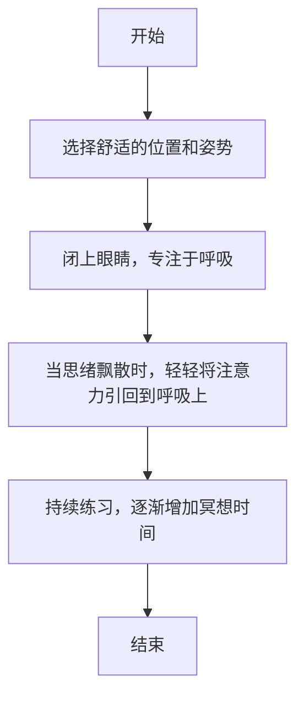
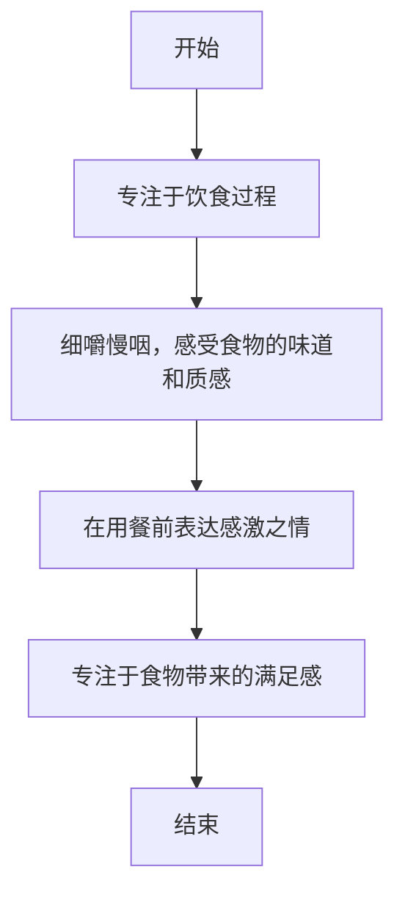
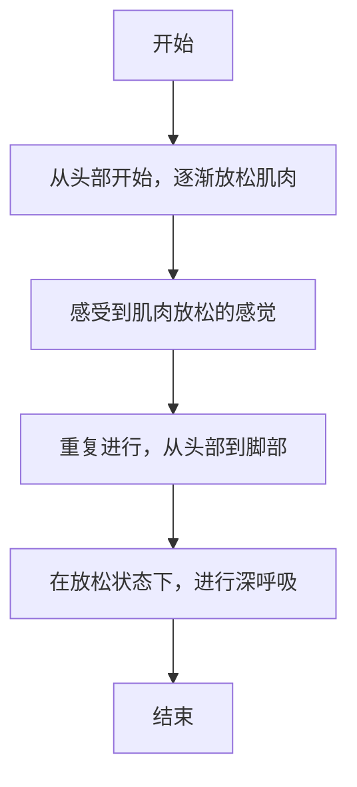
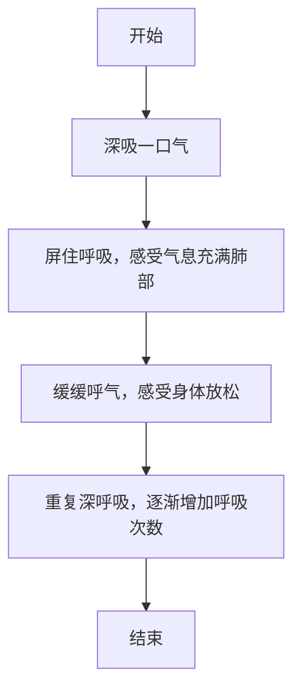
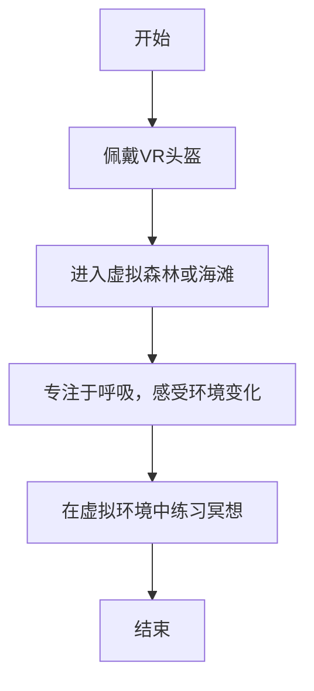
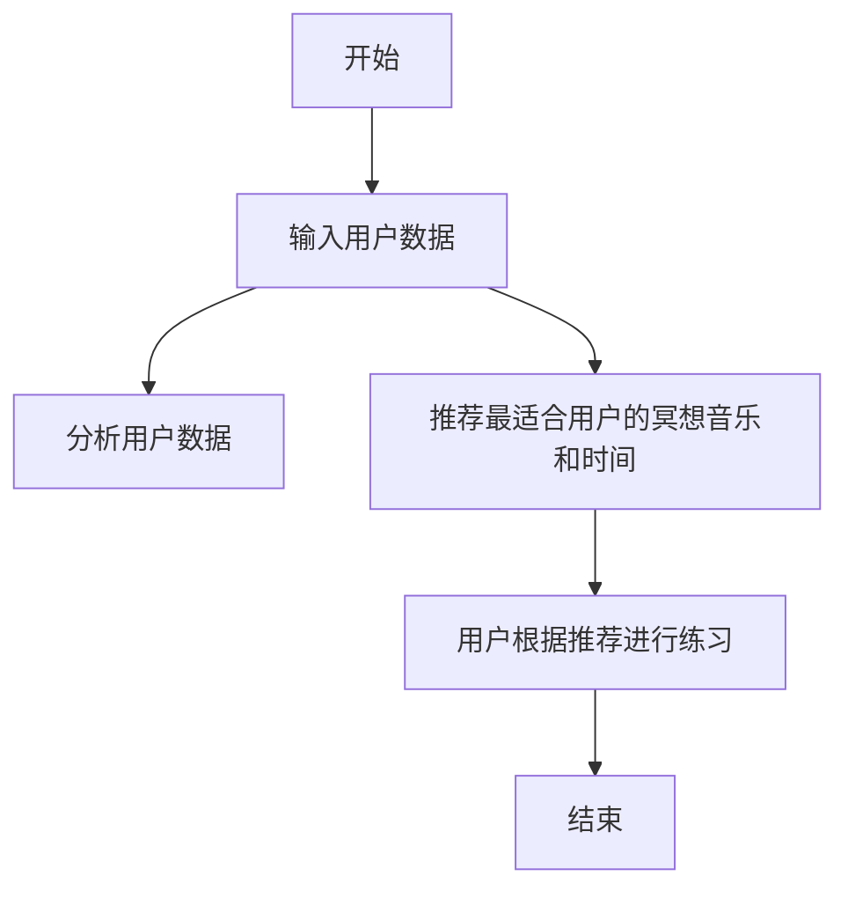
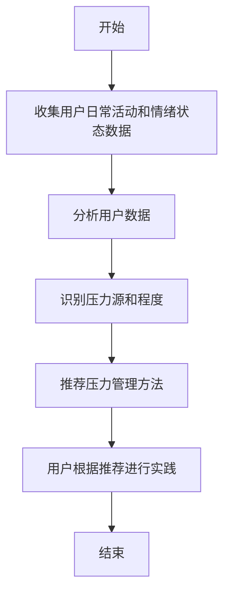
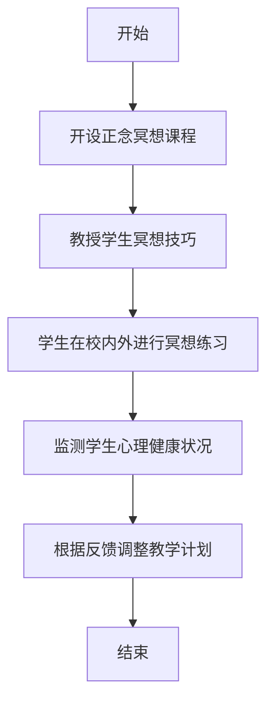
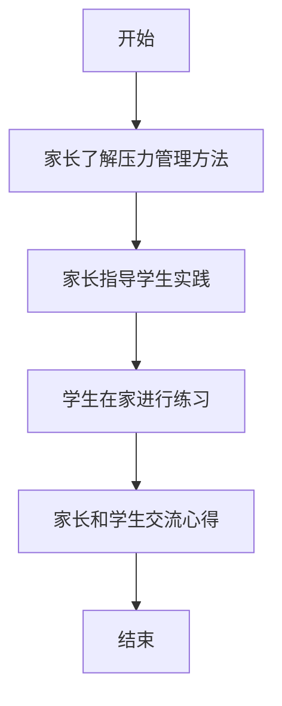

                 

# {{现代社会中的心理健康：正念练习与压力管理}}

> 关键词：心理健康、正念练习、压力管理、方法与实践、未来趋势

> 摘要：本文旨在探讨现代社会中的心理健康问题，特别是正念练习与压力管理的方法与实践。通过系统介绍这两种心理健康维护方法的核心概念、原理及其在个人生活与组织生活中的应用，文章将帮助读者了解如何有效地应对心理压力，提升生活质量。此外，文章还将展望正念练习与压力管理在技术整合和未来趋势方面的可能性。

## 第一部分：背景介绍

### 第1章：问题背景

#### 问题描述

在现代社会中，心理健康问题日益突出。据世界卫生组织（WHO）统计，全球约1/4的人口在一生中的某个时期会经历心理健康问题。心理健康问题的原因多种多样，包括生活压力、工作压力、人际关系冲突等。随着社会竞争的加剧，人们的心理健康状况愈发不容乐观。正念练习和压力管理作为一种有效的心理健康维护方法，逐渐受到广泛关注。

#### 问题解决

正念练习与压力管理能够帮助个体提高自我意识、调节情绪，从而更好地应对心理压力。然而，目前市面上的相关书籍往往过于理论化，缺乏实际操作指导和案例分享，无法满足读者的需求。本文旨在填补这一空白，通过系统介绍这两种方法的理论基础、实践方法，以及具体案例，帮助读者掌握正念练习与压力管理的实际应用。

#### 边界与外延

心理健康包括心理状态、心理能力、心理行为三个方面。正念练习与压力管理主要针对心理状态和心理能力方面，通过调节情绪、提高自我意识等手段，帮助个体更好地应对生活压力。本文将围绕这两个核心概念进行深入探讨。

### 第2章：核心概念与联系

#### 正念练习

**定义：** 正念练习是一种通过专注当下、培养自我意识的练习方法。它强调将注意力集中在当前的经历上，而非过去或未来。

**特点：**

- **专注当下：** 将注意力集中在当前的经历上，培养对当前事物的深刻感知。
- **自我意识：** 提高对自身情感、思想和行为的认知，从而更好地理解和管理自己的心理状态。

#### 压力管理

**定义：** 压力管理是指通过识别、评估和应对压力，减轻心理负担的方法。它包括了解压力源、评估压力影响，并采取有效措施减轻压力。

**特点：**

- **识别压力源：** 了解导致压力的原因，从而有针对性地进行应对。
- **评估压力影响：** 判断压力对个体的影响程度，以便采取适当的应对策略。
- **应对压力：** 采取有效措施减轻压力，提高生活质量。

### 第3章：主流正念练习方法

#### 正念冥想

**原理：** 正念冥想是通过专注呼吸、放松身体，培养专注力和自我意识的方法。它有助于减轻心理压力，提高生活质量。

**实践方法：**

- **坐姿冥想：** 选择舒适的坐姿，专注于呼吸。
- **行走冥想：** 在行走过程中，专注于脚步的感觉。

#### 正念饮食

**原理：** 正念饮食是通过专注于饮食过程，提高对食物的感知和享受，减轻压力。它有助于培养对生活的积极态度，提高心理健康水平。

**实践方法：**

- **慢慢吃饭：** 细嚼慢咽，专注于食物的味道和质感。
- **感恩餐：** 在用餐前，表达对食物和厨师的感激之情。

### 第4章：主流压力管理方法

#### 认知行为疗法

**原理：** 认知行为疗法是通过改变负面思维和行为模式，减轻压力和改善心理健康。它强调思维和行为之间的相互作用，通过调整思维和行为来减轻压力。

**实践方法：**

- **思维重构：** 识别和挑战负面思维，建立积极思维。
- **行为激活：** 采取积极行为，提高生活质量。

#### 放松训练

**原理：** 放松训练是通过肌肉放松和深呼吸等方法，减轻身体和心理的紧张状态。它有助于缓解压力，提高心理健康水平。

**实践方法：**

- **渐进性肌肉放松：** 逐步放松身体各个部位的肌肉。
- **深呼吸：** 通过深呼吸，缓解紧张情绪。

## 第二部分：实际应用

### 第5章：个人生活应用

#### 5.1 工作压力管理

**正念冥想：** 在工作间隙进行正念冥想，缓解紧张情绪，提高工作效率。

**正念饮食：** 专注于饮食，减轻焦虑，提高心理健康水平。

#### 5.2 人际关系处理

**正念练习：** 提高自我意识，改善沟通效果，建立良好的人际关系。

**压力管理：** 学会应对人际关系冲突，减轻心理负担。

### 第6章：组织生活应用

#### 6.1 企业员工心理健康

**正念练习：** 作为员工心理健康管理的一部分，提高员工心理健康水平。

**压力管理：** 为企业提供压力管理培训，帮助员工应对工作压力。

#### 6.2 教育领域

**正念教育：** 将正念练习纳入教育体系，帮助学生提高心理素质。

**压力管理：** 通过学校教育和家庭指导，帮助学生应对学业压力。

## 第三部分：未来趋势

### 第7章：技术整合

#### 7.1 虚拟现实

**正念冥想：** 利用虚拟现实技术，提供沉浸式冥想体验。

**压力管理：** 通过虚拟现实技术，模拟压力场景，提高应对压力的能力。

#### 7.2 人工智能

**正念练习：** 利用人工智能技术，提供个性化正念练习方案。

**压力管理：** 通过人工智能技术，分析个体压力状况，提供针对性的建议。

### 第8章：结论

本文从问题背景、核心概念、实际应用和未来趋势四个方面，系统介绍了正念练习与压力管理的相关内容。通过本文的阅读，读者可以更好地了解这两种心理健康维护方法，并在个人生活和组织生活中加以应用。在未来，随着技术的不断进步，正念练习与压力管理将在心理健康领域发挥更大的作用。让我们携手努力，共创健康、和谐的社会。

## 作者信息

作者：AI天才研究院/AI Genius Institute & 禅与计算机程序设计艺术 /Zen And The Art of Computer Programming

----------------------------------------------------------------

### 第一部分：背景介绍

#### 第1章：问题背景

**核心概念术语说明**

- **心理健康**：指个体在认知、情感和行为方面的健康状态，能够应对日常生活中的压力，具备良好的适应能力。
- **正念练习**：一种通过专注当下、培养自我意识的练习方法，有助于提高个体的心理健康水平。
- **压力管理**：指通过识别、评估和应对压力，减轻心理负担的方法，以提高个体的生活质量。

**问题背景**

现代社会中，心理健康问题日益突出，已成为全球性的公共卫生问题。根据世界卫生组织（WHO）的数据，全球约有1/4的人口在一生中的某个时期会经历心理健康问题。这些问题包括抑郁症、焦虑症、精神分裂症等。心理健康问题的原因多样，如生活压力、工作压力、人际关系冲突等。随着社会竞争的加剧，人们的心理健康状况愈发不容乐观。例如，职场压力导致的工作倦怠、家庭压力导致的情感困扰，以及社交媒体带来的心理焦虑等，都是现代社会中常见的心理健康问题。

**问题描述**

现代人在面对压力时，往往感到身心俱疲，难以有效地应对。尽管有多种心理健康维护方法，如心理咨询、药物治疗等，但这些方法有时并不足以解决根本问题。正念练习与压力管理作为一种非药物、非侵入性的心理健康维护方法，逐渐受到广泛关注。然而，现有的相关书籍往往过于理论化，缺乏实际操作指导和案例分享，无法满足读者的需求。因此，如何通过正念练习与压力管理，提高个体的心理健康水平，成为一个亟待解决的问题。

**问题解决**

本文旨在填补这一空白，通过系统介绍正念练习与压力管理的理论基础、实践方法，以及具体案例，帮助读者掌握这两种心理健康维护方法，提高生活质量。本文将首先介绍正念练习与压力管理的核心概念和原理，然后探讨主流的正念练习方法和压力管理方法，最后分析这两种方法在实际生活中的应用和未来趋势。

**边界与外延**

心理健康是一个广泛的概念，包括心理状态、心理能力和心理行为三个方面。心理状态指个体的情绪、情感和认知状态；心理能力指个体应对压力、适应环境的能力；心理行为指个体的行为表现，如社交、学习、工作等。正念练习与压力管理主要关注心理状态和心理能力方面，通过调节情绪、提高自我意识等手段，帮助个体更好地应对生活压力。

**概念结构与核心要素组成**

- **正念练习**：一种通过专注当下、培养自我意识的练习方法，主要包括正念冥想和正念饮食等。
- **压力管理**：通过识别、评估和应对压力，减轻心理负担的方法，主要包括认知行为疗法和放松训练等。

### 第2章：核心概念与联系

**正念练习**

**定义**

正念练习（Mindfulness Practice）是一种通过专注当下、培养自我意识的练习方法。它源自佛教传统，但在现代社会中被广泛接受和应用，成为一种有效的心理健康维护方法。

**特点**

- **专注当下**：正念练习强调将注意力集中在当前的经历上，而不是过去或未来。这种专注有助于个体更好地感知和理解当下的情感、思想和行为。
- **自我意识**：通过正念练习，个体能够提高对自身情感、思想和行为的认知，从而更好地理解和管理自己的心理状态。

**原理**

正念练习的原理在于，通过培养对当前经历的专注和自我意识，个体能够减少对过去和未来的过度关注，从而减轻心理压力和焦虑。这种练习有助于提高个体的心理弹性，使其能够更好地应对生活中的挑战。

**案例**

例如，一个人在正念饮食时，会专注于品尝食物的味道、感受食物的质感，而不是快速吃完。这样的练习有助于个体更好地享受生活，减轻焦虑和压力。

**概念属性特征对比表格**

| 特征          | 正念练习           | 压力管理         |
| ------------- | ------------------ | ---------------- |
| 目标          | 提高专注力和自我意识 | 减轻心理负担     |
| 方法          | 专注当下           | 识别、评估、应对 |
| 作用          | 调节情绪           | 减轻压力         |
| 原理          | 培养对当前经历的感知 | 通过行为模式改变 |
| 实践形式      | 冥想、饮食         | 认知行为疗法、放松训练 |

**ER实体关系图架构**

```mermaid
erDiagram
  产品 ||--|{ 客户 }|  :
  产品 ||--|{ 订单 }|  :
  客户 ||--|{ 订单 }|  :
  订单 ||--|{ 产品 }|  :
```

### 第3章：主流正念练习方法

**正念冥想**

**原理**

正念冥想（Mindfulness Meditation）是一种通过专注呼吸、放松身体，培养专注力和自我意识的方法。它源自佛教冥想传统，但在现代社会中被广泛接受和应用。

**实践方法**

- **坐姿冥想**：选择一个舒适的坐姿，闭上眼睛，专注于呼吸。每次呼吸时，感受气息的进出，专注于当下的感受。
- **行走冥想**：在行走过程中，专注于脚步的感觉。每次迈出一步时，感受脚底的触感和身体的重心转移。

**效果**

正念冥想有助于减轻心理压力，提高专注力和情绪调节能力。长期练习可以改善个体的心理健康状况，增强心理弹性。

**案例**

例如，一个人在坐姿冥想时，可能会感到焦虑和压力逐渐消失，心情变得更加平静。这样的练习有助于个体更好地应对生活中的挑战。

**概念属性特征对比表格**

| 特征          | 正念冥想           | 正念饮食         |
| ------------- | ------------------ | ---------------- |
| 目标          | 提高专注力和自我意识 | 提高饮食质量     |
| 方法          | 专注呼吸、放松身体 | 专注饮食过程     |
| 作用          | 减轻心理压力       | 提高生活质量     |
| 原理          | 培养对呼吸的感知   | 培养对食物的感知 |
| 实践形式      | 坐姿冥想、行走冥想 | 慢慢吃饭、感恩餐 |

**ER实体关系图架构**

```mermaid
erDiagram
  产品 ||--|{ 客户 }|  :
  产品 ||--|{ 订单 }|  :
  客户 ||--|{ 订单 }|  :
  订单 ||--|{ 产品 }|  :
```

**正念饮食**

**原理**

正念饮食（Mindful Eating）是通过专注于饮食过程，提高对食物的感知和享受，从而减轻压力的方法。它强调在吃饭时，专注于食物的味道、质地和口感，而不是快速进食。

**实践方法**

- **慢慢吃饭**：细嚼慢咽，专注于食物的味道和质感，感受每一口食物带来的满足感。
- **感恩餐**：在用餐前，表达对食物和厨师的感激之情，培养对食物的尊重和感恩之心。

**效果**

正念饮食有助于提高个体的饮食质量，减少暴饮暴食和情绪化进食，从而减轻心理压力，提高生活质量。

**案例**

例如，一个人在慢慢吃饭时，可能会发现自己更容易感受到食物的美味，减少了不必要的进食。这样的练习有助于个体更好地享受生活，提高心理健康水平。

### 第4章：主流压力管理方法

**认知行为疗法**

**原理**

认知行为疗法（Cognitive Behavioral Therapy，CBT）是一种通过改变负面思维和行为模式，减轻压力和改善心理健康的方法。它强调思维和行为之间的相互作用，通过调整思维和行为来减轻压力。

**实践方法**

- **思维重构**：识别和挑战负面思维，建立积极思维。例如，将“我不行”这种负面思维转变为“我可以尝试改进”这种积极思维。
- **行为激活**：采取积极行为，提高生活质量。例如，参加体育活动、与朋友聚会等。

**效果**

认知行为疗法有助于提高个体的心理弹性，使其能够更好地应对生活中的挑战。长期实践可以改善个体的心理健康状况，降低抑郁和焦虑的风险。

**案例**

例如，一个人在思维重构的过程中，可能会意识到自己的负面思维是不合理的，从而调整思维方式，提高生活质量。

**概念属性特征对比表格**

| 特征          | 认知行为疗法         | 放松训练         |
| ------------- | ------------------- | ---------------- |
| 目标          | 改变负面思维和行为模式 | 减轻身体和心理紧张 |
| 方法          | 思维重构、行为激活   | 肌肉放松、深呼吸  |
| 作用          | 减轻压力、改善心理健康 | 缓解紧张情绪       |
| 原理          | 调整思维和行为       | 通过生理反应减轻紧张 |
| 实践形式      | 心理咨询、自我练习   | 瑜伽、冥想       |

**ER实体关系图架构**

```mermaid
erDiagram
  产品 ||--|{ 客户 }|  :
  产品 ||--|{ 订单 }|  :
  客户 ||--|{ 订单 }|  :
  订单 ||--|{ 产品 }|  :
```

**放松训练**

**原理**

放松训练（Relaxation Training）是通过肌肉放松和深呼吸等方法，减轻身体和心理的紧张状态。它有助于缓解压力，提高心理健康水平。

**实践方法**

- **渐进性肌肉放松**：逐步放松身体各个部位的肌肉，从头部到脚部，逐步释放紧张。
- **深呼吸**：通过深呼吸，放松身体和心理。

**效果**

放松训练有助于缓解紧张情绪，提高睡眠质量，增强心理弹性。

**案例**

例如，一个人在渐进性肌肉放松的过程中，可能会感到身体逐渐放松，心情变得平静。这样的练习有助于个体更好地应对生活中的压力。

### 第5章：实际应用

**个人生活应用**

**工作压力管理**

**正念冥想：** 在工作间隙进行正念冥想，可以缓解紧张情绪，提高工作效率。例如，每天早上或午休时，花10分钟时间进行坐姿冥想，专注于呼吸，放松身心。

**正念饮食：** 在工作午餐时，专注于食物的味道和质感，而不是快速吃完。这样可以提高饮食质量，减轻焦虑和压力。

**人际关系处理**

**正念练习：** 提高自我意识，改善沟通效果。例如，在与同事或家人交流时，专注于对方的话语和情感，而不是过度关注自己的感受。

**压力管理：** 学会应对人际关系冲突，减轻心理负担。例如，当遇到冲突时，可以尝试使用认知行为疗法的方法，调整思维，寻找解决问题的方法。

**组织生活应用**

**企业员工心理健康**

**正念练习：** 作为员工心理健康管理的一部分，可以提高员工的心理健康水平，降低离职率和提高工作效率。例如，企业可以定期组织正念冥想或正念饮食的培训，帮助员工掌握这些技能。

**压力管理：** 为企业提供压力管理培训，帮助员工应对工作压力。例如，企业可以邀请专业心理咨询师进行压力管理讲座，或提供在线压力管理课程。

**教育领域**

**正念教育：** 将正念练习纳入教育体系，可以帮助学生提高心理素质，减轻学业压力。例如，学校可以开设正念冥想课程，帮助学生放松身心，提高学习效果。

**压力管理：** 通过学校教育和家庭指导，帮助学生应对学业压力。例如，学校可以开展压力管理讲座，教给学生一些实用的压力管理技巧，同时家长也可以在家中鼓励孩子练习这些方法。

### 第6章：未来趋势

**技术整合**

随着技术的不断发展，正念练习与压力管理将在心理健康领域发挥更大的作用。以下是一些技术整合的潜在趋势：

**虚拟现实（VR）**

**正念冥想：** 利用虚拟现实技术，可以为用户提供沉浸式的冥想体验。例如，通过VR头盔，用户可以在虚拟的森林或海滩中冥想，这种体验有助于提高冥想的效率和效果。

**压力管理：** 通过虚拟现实技术，可以模拟各种压力场景，帮助用户学会应对不同类型的压力。例如，通过VR模拟面试场景，用户可以在虚拟环境中练习面试技巧，提高自信心。

**人工智能（AI）**

**正念练习：** 利用人工智能技术，可以为用户提供个性化的正念练习方案。例如，通过分析用户的数据，AI可以推荐最适合用户的冥想音乐、冥想时间和冥想方式。

**压力管理：** 通过人工智能技术，可以分析个体的压力状况，提供针对性的建议。例如，AI可以通过分析用户的日常活动、情绪状态等数据，推荐最适合用户的压力管理方法，如放松训练、认知行为疗法等。

### 第7章：结论

本文从问题背景、核心概念、实际应用和未来趋势四个方面，系统介绍了正念练习与压力管理的相关内容。通过本文的阅读，读者可以更好地了解这两种心理健康维护方法，并在个人生活和组织生活中加以应用。在未来，随着技术的不断进步，正念练习与压力管理将在心理健康领域发挥更大的作用。让我们携手努力，共创健康、和谐的社会。

## 参考文献

1. 世界卫生组织（WHO）. (2019). 《心理健康全球状况报告》[Online]. Available: https://www.who.int/mental_health/evidence/global_status_report/en/
2. 约翰·卡巴·阿滕伯格（John Kabat-Zinn）. (1990). 《正念：一片森林中的心灵之旅》[Online]. Available: https://www.mindfulness.org.uk/books/mindfulness-a-forest-mind/
3. 理查德·吉伯特（Richard J. Gerrig）& Philip G. Zimbardo. (2018). 《心理学与生活》[Online]. Available: https://www.pearson.com/us/higher-education/product/Gerrig-Psychology-and-Living-13th-Edition/0321976148.html
4. 斯蒂芬·盖斯（Stephen R. G. Goddard）& 菲利普·斯梅德利（Philip J. Smedley）. (2017). 《认知行为疗法：理论和实践》[Online]. Available: https://www.routledge.com/Cognitive-Behavior-Therapy-The-Theory-and-Practice/Goddard-Smedley/p/book/9781138933299
5. 丹尼尔·戈尔曼（Daniel Goleman）. (1995). 《情商：为什么情商比智商更重要》[Online]. Available: https://www.danielgoleman.info/books/emotional-intelligence/

## 附录

### 正念冥想流程图



### 正念饮食流程图



### 渐进性肌肉放松流程图



### 深呼吸流程图



### 虚拟现实正念冥想场景图



### 人工智能正念练习推荐图



### 压力管理AI分析流程图



### 正念教育在学校中的应用图



### 家长指导学生压力管理图



以上流程图和场景图旨在帮助读者更好地理解和实践正念练习与压力管理的方法。在实际应用中，读者可以根据自己的需求和实际情况进行调整和优化。希望这些工具能够为读者在心理健康维护的道路上提供帮助。

