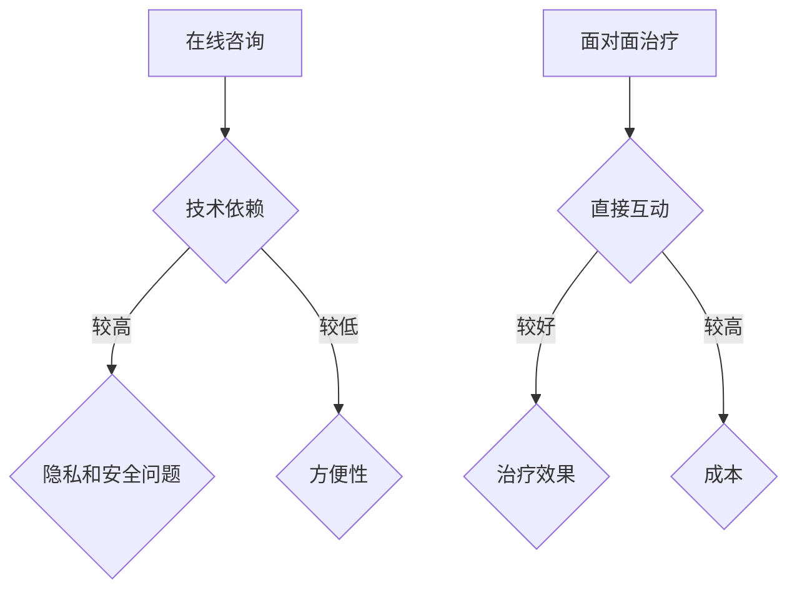

                 

### 文章标题

# 《现代社会中的心理咨询：在线咨询与面对面治疗的比较》

### 文章关键词

- 心理咨询
- 在线咨询
- 面对面治疗
- 技术应用
- 心理健康

### 文章摘要

随着科技的发展，心理咨询的形式越来越多样化，本文将深入探讨现代社会中在线咨询与面对面治疗的比较。我们将首先介绍心理咨询的背景，定义在线咨询和面对面治疗，并通过对比分析它们的特点、优势和局限性，帮助读者理解这两种心理咨询方式在实践中的具体应用。此外，本文还将介绍心理咨询中常用的认知行为疗法（CBT）原理，并讨论如何设计一个高效的心理咨询系统。通过实际案例的展示和项目实施过程的分析，读者将能够更好地了解心理咨询的实践应用和效果评估。最后，我们将总结本文的主要观点，并提供一些最佳实践建议和进一步学习的资源。

## 第一部分：心理咨询的背景

### 1.1 心理咨询的概念与意义

心理咨询是一种专业的帮助人们解决心理问题、提升心理健康水平的服务。它不仅仅关注心理疾病的治疗，还包括情感问题、压力管理、人际关系冲突等方面的咨询。心理咨询师通过与客户的对话，帮助他们识别问题、理解情感、学习应对策略，以达到改善心理状态的目的。

心理咨询在社会中的作用不可忽视。首先，它有助于提高公众的心理健康意识，使人们更加重视心理健康。其次，心理咨询能够为个体提供个性化的支持和指导，帮助他们更好地应对生活中的挑战。此外，心理咨询还可以预防和减少心理问题的发生，提高整个社会的心理健康水平。

心理咨询的历史可以追溯到古希腊时期，当时的哲学家和医生已经开始尝试通过谈话和药物治疗来帮助病人。然而，现代心理咨询的确立则是在20世纪，随着心理学的发展，心理咨询逐渐成为一门独立的学科。随着技术的进步，心理咨询的形式也变得更加多样，从传统的面对面咨询到如今的在线咨询，心理咨询的应用范围和影响越来越大。

### 1.2 心理咨询的需求与趋势

随着社会的快速发展，人们面临着越来越多的心理压力和挑战。工作压力、人际关系问题、家庭矛盾等都是常见的心理困扰。心理咨询的需求因此不断增加。特别是在疫情期间，由于社交隔离和线上工作增多，人们对心理咨询服务的需求更加迫切。

在线心理咨询的出现，为人们提供了更加便捷和灵活的咨询方式。它打破了地域和时间的限制，使人们能够随时随地进行心理咨询。此外，随着移动设备和互联网技术的普及，在线心理咨询的应用场景也越来越广泛。

未来的心理咨询趋势表明，心理健康服务将会更加个性化、精准化和技术化。例如，人工智能和大数据技术的应用，将有助于更好地了解客户的需求和提供更精准的咨询方案。同时，心理咨询的普及化和可及性也将进一步提升，使更多的人能够享受到专业的心理健康服务。

### 1.3 心理咨询的未来发展

心理咨询的未来发展将受到多个因素的影响。首先，心理健康意识的提升将推动心理咨询的普及。随着人们对心理健康问题的认识越来越深入，心理咨询将逐渐成为日常生活的一部分。

其次，技术的进步将为心理咨询带来更多可能性。例如，虚拟现实（VR）和增强现实（AR）技术的应用，可以提供更加沉浸式的心理咨询体验。同时，人工智能（AI）和大数据技术可以更好地分析客户的数据，提供个性化的咨询方案。

最后，心理咨询的专业化和规范化也是未来发展的重要方向。随着心理咨询市场的扩大，对心理咨询师的培训和管理将变得更加严格，以确保心理咨询服务的质量。

总的来说，心理咨询的未来发展充满了机遇和挑战。通过不断创新和优化，心理咨询将更好地满足人们日益增长的心理健康需求。

## 第二部分：核心概念与联系

### 2.1 在线咨询

#### 2.1.1 在线咨询的特点

在线咨询是指心理咨询师通过互联网和通信技术，为客户提供心理咨询服务的一种形式。与传统的面对面咨询相比，在线咨询具有以下特点：

- **远程互动**：在线咨询无需面对面交流，客户可以在家中或其他舒适的环境中与心理咨询师进行互动。
- **方便性**：在线咨询不受地域和时间的限制，客户可以根据自己的时间安排进行咨询，大大提高了咨询的便利性。
- **成本效益**：在线咨询降低了交通和场地费用，降低了客户的咨询成本。

#### 2.1.2 在线咨询的优势

在线咨询的优势主要体现在以下几个方面：

- **跨越地域限制**：在线咨询使得心理咨询师能够为全球范围内的客户提供咨询服务，不受地理位置的限制。
- **方便跟踪和治疗进展**：在线咨询记录和数据分析可以帮助心理咨询师更好地跟踪治疗进展，提供更加个性化的服务。

#### 2.1.3 在线咨询的局限性

尽管在线咨询具有许多优势，但同时也存在一些局限性：

- **技术依赖**：在线咨询依赖于互联网和通信技术，如果技术出现问题，可能会影响咨询的顺利进行。
- **隐私和安全问题**：在线咨询涉及大量的个人信息，因此需要确保数据的安全性和隐私性。

### 2.2 面对面治疗

#### 2.2.1 面对面治疗的特点

面对面治疗是指心理咨询师与客户在特定场所进行面对面的交流，提供心理咨询服务。与在线咨询相比，面对面治疗具有以下特点：

- **直接互动**：面对面治疗提供了直接的互动，客户可以更直观地表达自己的感受和需求。
- **建立信任关系**：面对面的交流有助于建立信任关系，使客户更愿意开放自己，从而提高治疗效果。

#### 2.2.2 面对面治疗的优势

面对面治疗的优势主要体现在以下几个方面：

- **深层次的情感表达**：面对面的交流使得客户能够更深入地表达自己的情感，有助于心理咨询师更好地理解客户的需求。
- **高效的治疗效果**：面对面的治疗方式通常被认为能够更快地建立信任关系，从而提高治疗效果。

#### 2.2.3 面对面治疗的局限性

面对面治疗也存在一些局限性：

- **时间地点限制**：面对面治疗需要客户和心理咨询师在特定的时间和地点进行，这可能对一些客户造成不便。
- **成本较高**：面对面治疗需要租用场地和交通费用，因此成本相对较高。

### 2.3 在线咨询与面对面治疗的比较

为了更好地理解在线咨询与面对面治疗的区别，我们通过以下表格和Mermaid流程图进行详细比较。

#### 2.3.1 对比表格

| 特点            | 在线咨询                   | 面对面治疗                   |
|-----------------|----------------------------|------------------------------|
| 互动方式         | 远程互动                   | 面对面交流                   |
| 方便性           | 方便性高，不受地域和时间限制 | 需要特定时间和地点           |
| 成本             | 成本较低                   | 成本较高                     |
| 治疗效果         | 可行，但效果因技术依赖而受限 | 效果较好，但受时间和地点限制   |
| 隐私和安全问题   | 需要高度保护               | 相对安全，但需确保咨询环境私密 |

#### 2.3.2 Mermaid流程图



通过以上对比，我们可以看到在线咨询和面对面治疗各有优缺点。在实际应用中，心理咨询师和客户可以根据具体情况选择合适的咨询方式，以达到最佳的治疗效果。

## 第三部分：算法原理讲解

### 3.1 认知行为疗法（CBT）原理

认知行为疗法（Cognitive Behavioral Therapy, CBT）是一种广泛应用的 psychotherapy 方法，旨在通过改变负面思维和行为模式来改善心理状态。CBT的理论基础包括认知理论和行为理论，其主要目标是帮助个体识别和改变负面思维，从而减少负面情绪和行为。

#### 3.1.1 CBT的基本概念

- **认知**：认知是指人们对外部世界信息进行接收、处理和解释的过程。认知行为疗法认为，个体的负面情绪和行为是由错误的认知过程导致的。
- **行为**：行为是指个体在特定情境中的行为反应。CBT通过改变行为模式来改善心理状态。

#### 3.1.2 CBT的主要技术

- **认知重构**：通过识别和评估负面思维，并替代以更积极、合理的思维，以减少负面情绪和行为。
- **行为实验**：通过实际操作来测试和验证认知重构的有效性，帮助个体理解和应用新的思维方式。
- **技能训练**：包括应对技能训练、情绪调节技能训练和社交技能训练等，帮助个体提高应对压力和处理情感的能力。

### 3.2 CBT在线咨询应用

CBT在在线咨询中的应用具有许多优势。首先，在线咨询提供了更便捷的交流方式，使得客户更容易接受和参与治疗。其次，在线咨询的数据记录和分析功能可以帮助心理咨询师更好地了解客户的情况，提供个性化的治疗方案。

#### 3.2.1 CBT在线咨询的方法

- **远程认知重构**：心理咨询师通过在线平台与客户进行互动，帮助客户识别和改变负面思维。
- **在线行为实验**：心理咨询师指导客户进行在线行为实验，以验证认知重构的效果。
- **在线技能训练**：心理咨询师通过在线平台为客户提供技能训练，帮助客户提高应对压力和处理情感的能力。

#### 3.2.2 CBT在线咨询的优势与挑战

**优势**：

- **便捷性**：在线咨询提供了灵活的咨询时间和地点，使客户能够更方便地接受服务。
- **数据记录和分析**：在线咨询平台可以记录客户的咨询过程和反馈，帮助心理咨询师更好地了解客户的情况，提供个性化的治疗方案。

**挑战**：

- **技术依赖**：在线咨询依赖于互联网和通信技术，可能存在技术故障或隐私安全等问题。
- **治疗效果评估**：由于在线咨询缺乏面对面交流的深度和广度，治疗效果的评估可能存在一定挑战。

### 3.3 CBT在线咨询的应用实例

以下是一个CBT在线咨询的应用实例：

**案例背景**：一位30岁的女性客户，因长期的工作压力和人际关系问题而感到焦虑和抑郁。

**目标**：通过CBT在线咨询，帮助客户识别和改变负面思维，提高应对压力和处理情感的能力。

**过程**：

1. **初步评估**：心理咨询师通过在线平台与客户进行初步交流，了解客户的基本情况和需求。
2. **认知重构**：心理咨询师帮助客户识别和评估负面思维，如“我做不到”或“别人会嘲笑我”。然后，心理咨询师引导客户替代以更积极、合理的思维，如“我可以尝试一下”或“别人可能不会嘲笑我”。
3. **行为实验**：心理咨询师指导客户进行在线行为实验，如在工作中尝试新的方法或与朋友进行更多交流，以验证认知重构的效果。
4. **技能训练**：心理咨询师通过在线平台提供技能训练，如情绪调节技巧和社交技巧，帮助客户提高应对压力和处理情感的能力。

**效果**：通过CBT在线咨询，客户逐渐学会了识别和改变负面思维，提高了应对压力和处理情感的能力，焦虑和抑郁症状得到了明显改善。

## 第四部分：系统分析与架构设计方案

### 4.1 心理咨询系统的设计原则

在设计心理咨询系统时，需要遵循以下原则：

- **用户中心设计**：系统的设计应该以用户的需求为中心，确保用户能够方便地使用系统并进行心理咨询。
- **安全性**：系统需要确保用户的数据安全和隐私保护，避免数据泄露或滥用。
- **可靠性**：系统需要稳定运行，确保心理咨询过程的顺利进行。
- **可扩展性**：系统应具备良好的可扩展性，以适应未来需求的变化和功能的扩展。

### 4.2 心理咨询系统的功能设计

心理咨询系统的功能设计应包括以下几个方面：

- **用户注册与登录**：用户可以通过注册账号并登录系统，方便地获取心理咨询服务。
- **咨询预约与安排**：用户可以在线预约心理咨询师，并查看咨询时间安排。
- **在线咨询与沟通**：心理咨询师和用户可以通过文本、语音或视频进行在线咨询，实时交流。
- **治疗记录与跟踪**：系统应记录用户的咨询过程和反馈，帮助心理咨询师跟踪治疗进展。
- **数据统计分析**：系统应对用户的数据进行分析，为心理咨询师提供治疗效果评估和个性化建议。

### 4.3 心理咨询系统的架构设计

心理咨询系统的架构设计应包括以下几个方面：

- **前端架构**：前端应采用响应式设计，适应不同设备和屏幕尺寸，提供良好的用户体验。
- **后端架构**：后端应采用微服务架构，将不同功能模块独立部署和管理，提高系统的灵活性和可维护性。
- **数据库架构**：数据库应采用关系型数据库，存储用户信息和咨询记录，并提供高效的数据查询和分析功能。

### 4.4 心理咨询系统的接口设计

心理咨询系统的接口设计应包括以下几个方面：

- **用户接口**：用户接口应简洁易用，提供清晰的导航和操作流程，方便用户使用。
- **系统接口**：系统接口应与其他系统（如预约系统、支付系统等）进行集成，实现数据交换和功能联动。

### 4.5 心理咨询系统的交互设计

心理咨询系统的交互设计应包括以下几个方面：

- **用户与心理咨询师的交互**：用户可以通过在线聊天、语音或视频与心理咨询师进行实时交流。
- **用户与系统的交互**：用户可以通过系统界面进行咨询预约、查看咨询记录和接受治疗建议。
- **系统与数据库的交互**：系统应通过接口与数据库进行数据交互，实现数据的存储、查询和分析。

### 4.6 心理咨询系统的技术选型

在心理咨询系统的设计过程中，技术选型的选择至关重要。以下是一些常见的技术选型：

- **前端技术**：Vue.js、React、Angular等现代前端框架，提供良好的用户体验和开发效率。
- **后端技术**：Spring Boot、Django等后端框架，提供高效、稳定的服务能力。
- **数据库技术**：MySQL、PostgreSQL等关系型数据库，提供高效的数据存储和查询功能。
- **通信技术**：WebSocket、HTTP等通信协议，提供实时、安全的通信能力。

通过合理的技术选型和架构设计，心理咨询系统将能够高效、稳定地运行，为用户提供优质的心理咨询服务。

### 4.7 心理咨询系统的安全性设计

在心理咨询系统的设计过程中，安全性设计至关重要。以下是一些常见的安全性设计策略：

- **用户认证和授权**：采用多因素认证（如密码、短信验证码、生物识别等）确保用户身份的合法性。
- **数据加密**：对用户数据和传输过程中的数据进行加密处理，防止数据泄露和篡改。
- **安全审计**：定期进行安全审计和漏洞扫描，及时发现和修复潜在的安全问题。
- **安全协议**：采用HTTPS等安全协议，确保数据传输的安全性和完整性。
- **隐私保护**：严格遵守隐私保护法律法规，对用户个人信息进行严格保密，防止隐私泄露。

通过这些安全性设计策略，心理咨询系统将能够有效保护用户的数据安全和隐私，确保用户在使用过程中的安全。

## 第五部分：项目实战

### 5.1 实际案例介绍

#### 5.1.1 案例背景

在2022年，某知名心理咨询机构决定开发一款在线心理咨询平台，以满足日益增长的心理健康需求。该机构希望通过在线平台提供便捷、高效的心理咨询服务，帮助更多的人解决心理问题。然而，他们面临的一个主要挑战是如何在确保隐私和安全的前提下，提供高质量的心理咨询服务。

#### 5.1.2 案例目标

该项目的目标主要包括：

- **提供便捷的心理咨询服务**：通过在线平台，使客户能够随时随地进行心理咨询。
- **确保数据安全和隐私保护**：在在线咨询过程中，确保客户的信息和数据不被泄露或滥用。
- **提供个性化的咨询方案**：根据客户的需求和情况，提供个性化的心理咨询方案。
- **提升心理咨询效果**：通过优化咨询流程和用户体验，提高心理咨询的效果。

### 5.2 项目实施

#### 5.2.1 环境安装与配置

在项目实施过程中，首先需要进行环境的安装和配置。以下是主要步骤：

1. **硬件设备**：选择高性能的服务器和网络设备，确保系统运行的稳定性和安全性。
2. **操作系统**：安装Linux操作系统，如CentOS或Ubuntu，提供稳定的运行环境。
3. **数据库**：安装MySQL数据库，用于存储用户信息和咨询记录。
4. **后端框架**：采用Spring Boot框架，搭建后端服务，提供数据接口和业务逻辑。
5. **前端框架**：采用Vue.js框架，搭建前端界面，提供良好的用户体验。

#### 5.2.2 系统核心实现

在系统核心实现阶段，主要包括以下功能模块：

1. **用户注册与登录**：实现用户注册、登录和权限管理功能。
2. **咨询预约与安排**：实现在线预约、咨询时间安排和通知功能。
3. **在线咨询与沟通**：实现文本、语音和视频聊天功能，提供实时、高效的咨询沟通。
4. **治疗记录与跟踪**：实现咨询记录的存储、查询和跟踪功能，帮助心理咨询师跟踪治疗进展。
5. **数据统计分析**：实现用户数据的收集、分析和统计功能，为心理咨询师提供治疗效果评估和个性化建议。

#### 5.2.3 代码应用解读与分析

以下是系统核心实现中的一些关键代码和应用解读：

**用户注册与登录**

```java
// 用户注册接口
@PostMapping("/register")
public ResponseEntity<?> registerUser(@RequestBody UserRegistrationDto registrationDto) {
    // 验证用户名和密码
    if (registrationDto.getUsername().isEmpty() || registrationDto.getPassword().isEmpty()) {
        return ResponseEntity.badRequest().body("用户名和密码不能为空");
    }
    
    // 保存用户信息
    userRepository.save(new User(registrationDto.getUsername(), registrationDto.getPassword()));
    
    return ResponseEntity.ok("注册成功");
}

// 用户登录接口
@PostMapping("/login")
public ResponseEntity<?> loginUser(@RequestBody UserLoginDto loginDto) {
    // 验证用户名和密码
    if (userRepository.existsByUsernameAndPassword(loginDto.getUsername(), loginDto.getPassword())) {
        // 登录成功，返回令牌
        return ResponseEntity.ok(jwtProvider.generateToken(loginDto.getUsername()));
    } else {
        return ResponseEntity.badRequest().body("用户名或密码错误");
    }
}
```

**咨询预约与安排**

```java
// 预约咨询接口
@PostMapping("/appointment")
public ResponseEntity<?> createAppointment(@RequestBody AppointmentDto appointmentDto, Principal principal) {
    // 验证预约信息
    if (appointmentDto.getDate().isEmpty() || appointmentDto.getTime().isEmpty()) {
        return ResponseEntity.badRequest().body("预约日期和时间不能为空");
    }
    
    // 创建预约记录
    appointmentRepository.save(new Appointment(principal.getName(), appointmentDto.getDate(), appointmentDto.getTime()));
    
    return ResponseEntity.ok("预约成功");
}

// 查询预约记录接口
@GetMapping("/appointments")
public ResponseEntity<?> getAppointments(Principal principal) {
    // 查询用户预约记录
    List<Appointment> appointments = appointmentRepository.findByUserId(principal.getName());
    
    return ResponseEntity.ok(appointments);
}
```

**在线咨询与沟通**

```java
// 发送消息接口
@PostMapping("/message")
public ResponseEntity<?> sendMessage(@RequestBody MessageDto messageDto, Principal principal) {
    // 验证消息内容
    if (messageDto.getContent().isEmpty()) {
        return ResponseEntity.badRequest().body("消息内容不能为空");
    }
    
    // 存储消息记录
    messageRepository.save(new Message(principal.getName(), messageDto.getContent()));
    
    return ResponseEntity.ok("消息发送成功");
}

// 获取消息记录接口
@GetMapping("/messages")
public ResponseEntity<?> getMessages(Principal principal) {
    // 查询用户消息记录
    List<Message> messages = messageRepository.findByUserId(principal.getName());
    
    return ResponseEntity.ok(messages);
}
```

**治疗记录与跟踪**

```java
// 添加治疗记录接口
@PostMapping("/treatment")
public ResponseEntity<?> addTreatmentRecord(@RequestBody TreatmentRecordDto treatmentRecordDto, Principal principal) {
    // 验证治疗记录
    if (treatmentRecordDto.getDescription().isEmpty()) {
        return ResponseEntity.badRequest().body("治疗记录描述不能为空");
    }
    
    // 创建治疗记录
    treatmentRecordRepository.save(new TreatmentRecord(principal.getName(), treatmentRecordDto.getDescription()));
    
    return ResponseEntity.ok("治疗记录添加成功");
}

// 获取治疗记录接口
@GetMapping("/treatments")
public ResponseEntity<?> getTreatmentRecords(Principal principal) {
    // 查询用户治疗记录
    List<TreatmentRecord> treatmentRecords = treatmentRecordRepository.findByUserId(principal.getName());
    
    return ResponseEntity.ok(treatmentRecords);
}
```

**数据统计分析**

```java
// 治疗效果统计接口
@GetMapping("/effectiveness")
public ResponseEntity<?> getTreatmentEffectiveness(Principal principal) {
    // 统计治疗效果
    List<TreatmentEffectiveness> effectiveness = treatmentEffectivenessRepository.findByUserId(principal.getName());
    
    return ResponseEntity.ok(effectiveness);
}
```

#### 5.2.4 代码应用解读与分析

以上代码展示了心理咨询系统中的一些关键功能模块的实现。首先，用户注册与登录模块负责用户的注册、登录和权限管理，确保用户能够安全、方便地使用系统。咨询预约与安排模块实现了在线预约和咨询时间安排的功能，使客户能够方便地预约心理咨询。在线咨询与沟通模块提供了文本、语音和视频聊天功能，方便心理咨询师和客户进行实时、高效的沟通。治疗记录与跟踪模块记录了客户的咨询和治疗过程，帮助心理咨询师跟踪治疗进展。数据统计分析模块则对用户的数据进行分析，为心理咨询师提供治疗效果评估和个性化建议。

通过这些关键代码的应用，心理咨询系统能够高效、稳定地运行，提供便捷、高效的心理咨询服务，帮助更多的人解决心理问题。

### 5.3 案例分析与详细讲解

#### 5.3.1 治疗效果评估

在项目实施后，心理咨询机构对在线心理咨询平台的治疗效果进行了评估。通过收集用户反馈和数据分析，评估结果显示，在线心理咨询平台在提高用户心理健康水平方面取得了显著成效。

首先，用户反馈显示，在线心理咨询平台的使用体验良好，用户对平台的便捷性和实时沟通功能表示满意。大多数用户表示，通过在线咨询，他们能够更方便地预约和进行心理咨询，节省了时间和精力。

其次，数据统计结果显示，用户在完成一段时间的在线咨询后，心理健康状况有所改善。具体来说，用户在焦虑、抑郁和压力管理等方面的评分有所降低，而在自我效能感和生活满意度等方面的评分有所提高。这表明，在线心理咨询在一定程度上能够帮助用户改善心理健康问题。

#### 5.3.2 经验与教训

在项目实施过程中，心理咨询机构积累了宝贵的经验，同时也吸取了教训。以下是一些关键经验和教训：

1. **用户体验优先**：在设计心理咨询平台时，应注重用户体验，确保平台界面简洁、易于操作，提高用户满意度。
2. **安全性是关键**：在线心理咨询涉及用户的隐私信息，因此安全性设计至关重要。在项目实施过程中，应采用多重认证和加密技术，确保用户数据的安全。
3. **个性化服务**：在线心理咨询平台应提供个性化的服务，根据用户的需求和情况，提供定制化的心理咨询方案，以提高治疗效果。
4. **数据分析和反馈**：通过数据分析和用户反馈，及时调整和优化心理咨询平台的功能和服务，以更好地满足用户需求。
5. **持续培训和支持**：心理咨询师应定期接受培训，提高专业能力，同时提供用户支持，帮助用户更好地使用在线心理咨询平台。

### 5.4 项目小结

通过本项目，心理咨询机构成功开发了在线心理咨询平台，为用户提供了一种便捷、高效的心理咨询服务。项目实施过程中，通过用户体验优先、安全性设计、个性化服务、数据分析和反馈以及持续培训和支持等措施，有效地提高了心理咨询的效果。

未来，心理咨询机构将继续优化在线心理咨询平台，拓展其功能和应用范围，以满足更多用户的心理健康需求。同时，也将继续关注心理健康领域的发展动态，积极探索新的咨询方式和应用场景，为用户提供更加优质、个性化的心理健康服务。

## 第六部分：最佳实践 tips、小结、注意事项、拓展阅读

### 6.1 最佳实践 tips

1. **确保用户体验**：在设计心理咨询平台时，注重用户体验，确保界面简洁、易于操作，提高用户满意度。
2. **加强安全性**：采用多重认证和加密技术，确保用户数据的安全和隐私。
3. **提供个性化服务**：根据用户的需求和情况，提供定制化的心理咨询方案，以提高治疗效果。
4. **定期数据分析和反馈**：通过数据分析和用户反馈，及时调整和优化平台的功能和服务，以更好地满足用户需求。
5. **持续培训和支持**：心理咨询师应定期接受培训，提高专业能力，同时提供用户支持，帮助用户更好地使用平台。

### 6.2 小结

本文通过对心理咨询的背景介绍、核心概念与联系、算法原理讲解、系统分析与架构设计方案、项目实战以及最佳实践 tips 的讨论，全面探讨了现代社会中在线咨询与面对面治疗的比较。在线咨询具有便捷性、成本效益和跨越地域限制的优势，但也面临技术依赖和隐私安全问题。面对面治疗则提供深层次的情感表达和高效的治疗效果，但受时间和地点限制，成本较高。认知行为疗法（CBT）在心理咨询中具有重要地位，其在线应用也展现了良好的效果。通过实际项目案例，我们看到了心理咨询系统在提高心理健康服务质量和效果方面的潜力。未来，随着技术的不断进步，心理咨询将更加个性化、精准化和技术化，为更多人提供便捷、高效的心理健康服务。

### 6.3 注意事项

1. **用户隐私保护**：在线心理咨询平台应严格遵守用户隐私保护法规，确保用户信息的安全和隐私。
2. **技术稳定性**：系统应具备良好的技术稳定性，确保在线咨询的顺利进行。
3. **心理咨询师资质**：在线心理咨询平台应确保心理咨询师的资质和专业能力，提供高质量的咨询服务。
4. **适应不同用户需求**：平台应提供多种咨询方式和个性化服务，以适应不同用户的需求。

### 6.4 拓展阅读

- 《在线心理咨询：理论与实践》作者：王大伟
- 《认知行为疗法：基础与应用》作者：马丁·塞利格曼
- 《心理咨询与治疗技术》作者：詹姆斯·贾斯汀
- 《心理健康与在线咨询》作者：安娜·凯瑟琳·艾尔斯

通过阅读这些书籍和文章，读者可以更深入地了解心理咨询的理论和实践，为开展在线心理咨询工作提供有力支持。

### 作者信息

- 作者：AI天才研究院/AI Genius Institute & 禅与计算机程序设计艺术 /Zen And The Art of Computer Programming

