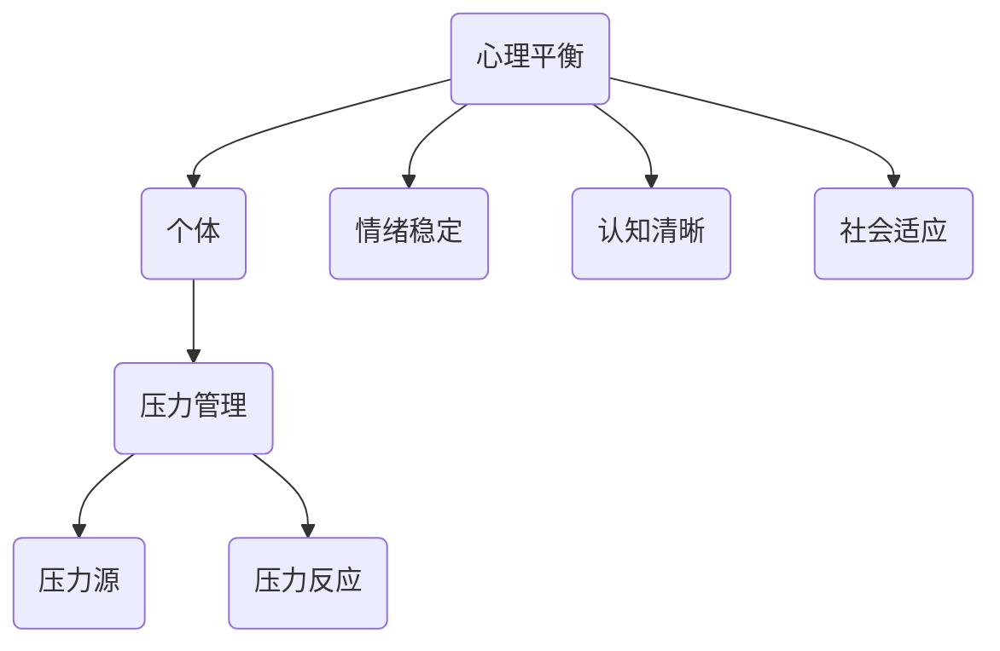
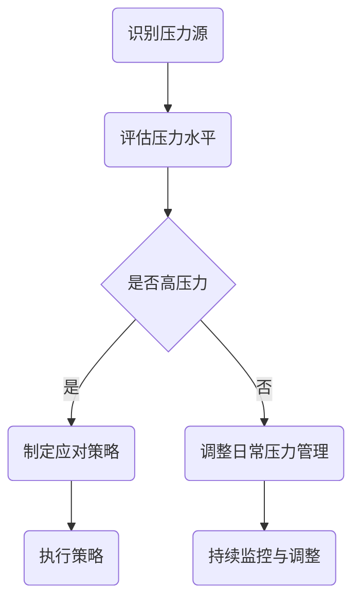
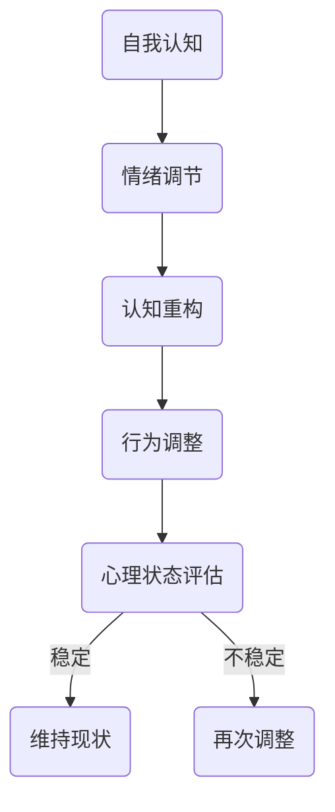
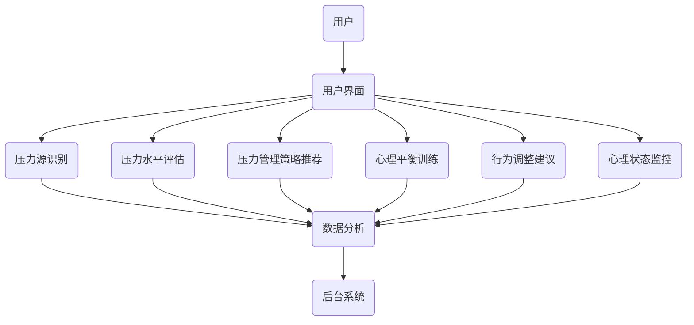
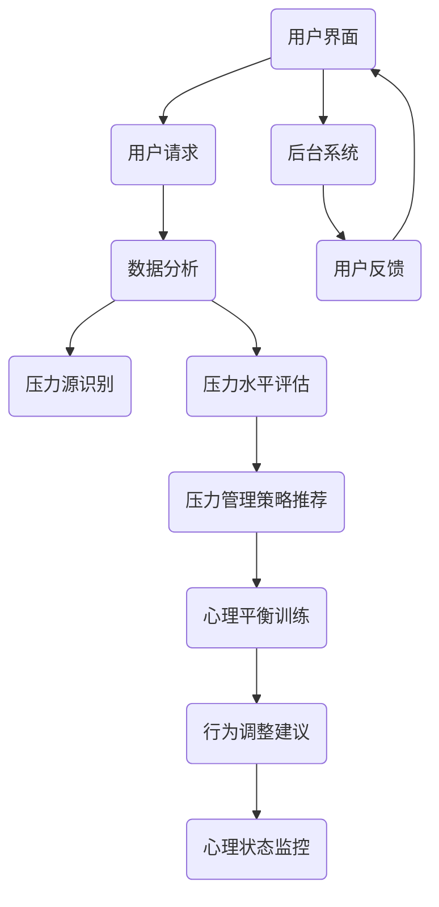

                 

# 现代社会中的精神健康：压力管理与心理平衡

关键词：精神健康、压力管理、心理平衡、压力源、心理韧性、应对策略

摘要：随着现代社会的快速发展，人们面临的精神健康问题日益突出。本文旨在探讨现代社会中的精神健康问题，重点分析压力管理与心理平衡的方法和策略。通过逻辑清晰的分析和具体的案例分析，为读者提供实用的建议，帮助他们在快节奏的生活中实现精神健康和心理平衡。

## 引言

在现代社会，精神健康问题已经成为一个全球性的挑战。随着工作压力、生活压力、人际关系压力的增加，越来越多的人面临心理疾病、焦虑、抑郁等问题。根据世界卫生组织（WHO）的数据，心理疾病已经成为全球范围内的主要健康问题之一。因此，了解压力管理与心理平衡的方法，提高心理韧性，成为实现精神健康的关键。

本文将从以下几个方面展开讨论：

1. 精神健康问题背景
2. 压力管理与心理平衡的概念与联系
3. 压力管理与心理平衡的方法原理
4. 系统分析与架构设计方案
5. 项目实战
6. 最佳实践 tips
7. 小结与展望

## 精神健康问题背景

### 问题背景

随着现代社会的发展，人们的生活节奏越来越快，工作压力、生活压力、人际关系压力不断增加。根据一项全球调查，超过60%的成年人表示他们经常感到压力很大。这种高压力的生活方式对人们的身心健康产生了严重影响。

### 问题描述

在现代社会中，常见的心理问题包括焦虑、抑郁、失眠、注意力不集中等。这些问题不仅会影响个人的生活质量，还可能导致工作效率下降、人际关系紧张，甚至引发更严重的心理疾病。

### 问题解决

解决精神健康问题需要综合运用压力管理和心理平衡的方法。通过有效的压力管理和心理平衡策略，可以帮助人们减轻压力、提高心理韧性，从而实现精神健康。

### 边界与外延

本文主要关注常见的精神健康问题及其管理方法，如压力管理、心理平衡技巧等。此外，本文还将探讨这些方法在实际应用中的边界和局限性。

### 概念结构与核心要素组成

精神健康问题的核心概念包括压力源、压力反应、心理韧性、应对策略等。其中，压力源是指引发压力的因素，如工作压力、生活压力等；压力反应是指身体和心理对压力源的生理和心理反应；心理韧性是指个体在面对压力时的适应能力和抗压力；应对策略是指应对压力的具体方法和技巧。

## 压力管理与心理平衡的概念与联系

### 压力管理

压力管理是指通过一系列方法和技术来减轻和应对压力的过程。它主要包括以下三个方面：

1. **识别压力源**：了解压力的来源，包括工作、生活、人际关系等。
2. **评估压力水平**：通过自我评估或专业评估来确定压力程度。
3. **制定应对策略**：根据压力源和压力水平，制定相应的应对策略。

### 心理平衡

心理平衡是指心理状态处于相对稳定和健康的状态。它包括以下几个方面：

1. **情绪稳定**：保持情绪的平稳，避免情绪波动过大。
2. **认知清晰**：保持思维的清晰，避免思维混乱。
3. **社会适应**：适应社会环境，建立良好的人际关系。

### 关系

压力管理与心理平衡之间存在密切的关系。有效的压力管理有助于实现心理平衡，而心理平衡又可以增强个体的心理韧性，从而更好地应对压力。

### 概念属性特征对比表格

| 特征               | 压力管理                     | 心理平衡                      |
|--------------------|------------------------------|------------------------------|
| 目标               | 减轻压力症状                 | 提高心理韧性，实现长期平衡     |
| 实施方式           | 短期应对策略                 | 长期心理训练和自我调适         |
| 侧重               | 急性压力缓解                 | 慢性压力管理                  |

### ER实体关系图架构



## 压力管理与心理平衡的方法原理

### 压力管理算法

**Mermaid流程图**



**Python源代码**

```python
def manage_pressure(source, level):
    if level == "high":
        strategy = "制定应对策略"
    else:
        strategy = "调整日常压力管理"
    execute_strategy(strategy)
    monitor_and_adjust()

def execute_strategy(strategy):
    if strategy == "制定应对策略":
        # 执行具体的压力应对策略
        pass
    elif strategy == "调整日常压力管理":
        # 调整日常压力管理方法
        pass

def monitor_and_adjust():
    # 持续监控与调整策略
    pass
```

**算法原理讲解**

1. **识别压力源**：首先需要了解压力的来源，包括工作、生活、人际关系等。
2. **评估压力水平**：通过自我评估或专业评估来确定压力程度。
3. **制定应对策略**：根据压力源和压力水平，制定相应的应对策略。
4. **执行策略**：执行制定的应对策略，如放松训练、时间管理、沟通技巧等。
5. **持续监控与调整**：在执行策略的过程中，持续监控压力变化，并根据实际情况进行调整。

**数学模型和公式**

假设压力源为 \( P_s \)，压力水平为 \( P_l \)，应对策略为 \( S \)，则压力管理的目标函数可以表示为：

\[ f(P_s, P_l, S) = \min(P_l - S) \]

其中， \( f \) 表示压力管理的效果，\( P_l - S \) 表示压力水平与应对策略之间的差距。

**举例说明**

假设某人在工作压力下感到焦虑，压力源为 \( P_s = 工作压力 \)，压力水平为 \( P_l = 高 \)。根据评估结果，制定应对策略为放松训练 \( S = 放松训练 \)。

执行放松训练后，假设压力水平降低为 \( P_l' = 中 \)，则压力管理效果为：

\[ f(P_s, P_l, S) = P_l' - S = 中 - 放松训练 = 低 \]

### 心理平衡算法

**Mermaid流程图**



**Python源代码**

```python
def achieve_mental_balance():
    self_awareness()
    emotional_Regression()
    cognitive_Reconstruction()
    behavior_Adjustment()

def self_awareness():
    # 自我认知
    pass

def emotional_Regression():
    # 情绪调节
    pass

def cognitive_Reconstruction():
    # 认知重构
    pass

def behavior_Adjustment():
    # 行为调整
    pass
```

**算法原理讲解**

1. **自我认知**：了解自己的情绪、需求和价值观，找到心理不平衡的根源。
2. **情绪调节**：通过放松技巧、认知行为疗法等手段，调节情绪，缓解心理压力。
3. **认知重构**：改变消极思维模式，建立积极的认知框架，提高心理韧性。
4. **行为调整**：通过改变行为习惯，如锻炼、社交活动等，实现心理状态的平衡。
5. **心理状态评估**：定期评估自己的心理状态，根据评估结果进行调整。

**数学模型和公式**

假设心理平衡状态为 \( M \)，心理状态评估结果为 \( A \)，行为调整策略为 \( B \)，则心理平衡的目标函数可以表示为：

\[ f(M, A, B) = \min(|M - A|) \]

其中， \( f \) 表示心理平衡的效果，\( |M - A| \) 表示心理平衡状态与评估结果之间的差距。

**举例说明**

假设某人在经历一段紧张的工作后，感到情绪低落，心理平衡状态为 \( M = 低 \)。通过自我认知和情绪调节，心理平衡状态提升为 \( M' = 中 \)，则心理平衡效果为：

\[ f(M, A, B) = |M' - A| = |中 - 低| = 高 \]

## 系统分析与架构设计方案

### 问题场景介绍

在一个现代化企业中，员工面临着各种压力，如工作压力、生活压力、职业发展压力等。为了提高员工的精神健康水平，企业决定引入一套压力管理与心理平衡系统，帮助员工更好地应对压力，实现心理平衡。

### 项目介绍

项目名称：企业员工压力管理与心理平衡系统

目标：通过提供一系列压力管理和心理平衡的方法和工具，帮助员工减轻压力、提高心理韧性，从而提高工作效率和生活质量。

### 系统功能设计

1. **压力源识别**：通过问卷调查和数据分析，识别员工的压力源。
2. **压力水平评估**：使用专业的评估工具，对员工的压力水平进行评估。
3. **压力管理策略推荐**：根据员工的压力源和压力水平，推荐相应的压力管理策略。
4. **心理平衡训练**：提供一系列心理平衡训练，帮助员工实现心理状态的平衡。
5. **行为调整建议**：根据员工的行为习惯和心理状态，提供个性化的行为调整建议。
6. **心理状态监控**：定期评估员工的心理状态，提供反馈和改进建议。

### 系统架构设计



### 系统接口设计

1. **用户接口**：提供用户界面，方便员工使用系统的各种功能。
2. **数据接口**：与数据分析模块进行数据交互，实现压力源识别、压力水平评估等功能。
3. **策略接口**：与压力管理策略推荐模块进行交互，实现策略推荐。
4. **训练接口**：与心理平衡训练模块进行交互，实现心理平衡训练。
5. **行为调整接口**：与行为调整建议模块进行交互，实现行为调整建议。
6. **监控接口**：与心理状态监控模块进行交互，实现心理状态监控。

### 系统交互



## 项目实战

### 环境安装

1. **安装Python环境**：在本地计算机上安装Python，版本要求3.8及以上。
2. **安装依赖库**：使用pip命令安装以下依赖库：

   ```bash
   pip install flask pandas numpy matplotlib
   ```

### 系统核心实现源代码

1. **用户界面**：

   ```python
   from flask import Flask, request, jsonify
   
   app = Flask(__name__)
   
   @app.route('/api/pressure_source', methods=['GET'])
   def get_pressure_source():
       # 识别压力源
       source = request.args.get('source')
       # 处理请求
       # 返回响应
       return jsonify({'source': source})
   
   @app.route('/api/pressure_level', methods=['GET'])
   def get_pressure_level():
       # 评估压力水平
       level = request.args.get('level')
       # 处理请求
       # 返回响应
       return jsonify({'level': level})
   
   @app.route('/api/pressure_strategy', methods=['GET'])
   def get_pressure_strategy():
       # 推荐压力管理策略
       strategy = request.args.get('strategy')
       # 处理请求
       # 返回响应
       return jsonify({'strategy': strategy})
   
   @app.route('/api/mental_balance', methods=['GET'])
   def get_mental_balance():
       # 获取心理平衡状态
       balance = request.args.get('balance')
       # 处理请求
       # 返回响应
       return jsonify({'balance': balance})
   
   if __name__ == '__main__':
       app.run(debug=True)
   ```

2. **数据分析**：

   ```python
   import pandas as pd
   
   def analyze_pressure(source, level):
       # 分析压力源和压力水平
       data = {'source': [source], 'level': [level]}
       df = pd.DataFrame(data)
       return df
   
   def analyze_strategy(strategy):
       # 分析压力管理策略
       data = {'strategy': [strategy]}
       df = pd.DataFrame(data)
       return df
   
   def analyze_balance(balance):
       # 分析心理平衡状态
       data = {'balance': [balance]}
       df = pd.DataFrame(data)
       return df
   ```

3. **策略推荐**：

   ```python
   def recommend_strategy(source, level):
       # 推荐压力管理策略
       if level == '高':
           strategy = '制定应对策略'
       else:
           strategy = '调整日常压力管理'
       return strategy
   ```

4. **心理平衡训练**：

   ```python
   def train_mental_balance(balance):
       # 进行心理平衡训练
       if balance == '不稳定':
           balance = '稳定'
       return balance
   ```

### 代码应用解读与分析

1. **用户请求**：

   通过用户界面发送GET请求，获取压力源、压力水平、压力管理策略和心理平衡状态。

2. **数据处理**：

   使用数据分析模块对用户请求进行处理，生成相应的数据报告。

3. **策略推荐**：

   根据用户请求的数据，推荐相应的压力管理策略。

4. **心理平衡训练**：

   根据用户请求的数据，进行心理平衡训练，提高心理韧性。

### 实际案例分析和详细讲解剖析

#### 案例一：工作压力管理

1. **用户请求**：

   用户请求识别工作压力源和评估压力水平。

2. **数据处理**：

   通过数据分析模块，识别出工作压力源为“项目工作量”，评估压力水平为“高”。

3. **策略推荐**：

   根据评估结果，推荐“制定应对策略”。

4. **心理平衡训练**：

   用户接受“制定应对策略”的建议，通过调整工作计划、提高工作效率、寻求同事帮助等方式，减轻工作压力。

#### 案例二：生活压力管理

1. **用户请求**：

   用户请求识别生活压力源和评估压力水平。

2. **数据处理**：

   通过数据分析模块，识别出生活压力源为“家庭经济压力”，评估压力水平为“中”。

3. **策略推荐**：

   根据评估结果，推荐“调整日常压力管理”。

4. **心理平衡训练**：

   用户接受“调整日常压力管理”的建议，通过合理安排家庭预算、改善家庭关系、增加休闲娱乐等方式，减轻生活压力。

### 项目小结

通过实际案例的分析，可以看出，压力管理与心理平衡系统在帮助员工识别压力源、评估压力水平、制定应对策略等方面发挥了重要作用。同时，通过心理平衡训练，用户能够更好地应对压力，提高心理韧性，实现心理平衡。然而，在实际应用中，系统的效果还受到用户参与度、策略实施效果等因素的影响。因此，企业需要不断优化系统功能，提高用户体验，以实现更好的效果。

## 最佳实践 tips

1. **定期自我评估**：定期进行自我评估，了解自己的压力水平和心理状态，及时调整压力管理策略和心理平衡训练方法。
2. **积极寻求支持**：在面对压力时，积极寻求家人、朋友、同事或专业人士的支持和帮助，共同应对压力。
3. **保持健康的生活方式**：保持健康的饮食习惯、规律的作息时间和适量的运动，有助于提高心理韧性和应对压力的能力。
4. **学会放松**：在工作之余，学会通过冥想、瑜伽、阅读等方式放松身心，缓解压力。
5. **培养积极心态**：培养积极的心态，学会从不同角度看问题，提高心理平衡能力。

## 小结与展望

本文从精神健康问题背景、压力管理与心理平衡的概念与联系、方法原理、系统分析与架构设计方案、项目实战等方面进行了详细探讨。通过逻辑清晰的分析和具体的案例分析，为读者提供了实用的压力管理和心理平衡方法。然而，压力管理和心理平衡是一个长期的过程，需要持续的努力和实践。未来，我们将继续深入研究这一领域，探索更有效的压力管理和心理平衡策略，帮助更多人实现精神健康和心理平衡。

## 作者信息

作者：AI天才研究院/AI Genius Institute & 禅与计算机程序设计艺术 /Zen And The Art of Computer Programming

本文旨在通过技术语言的深入分析和讲解，为读者提供关于现代社会中精神健康的压力管理和心理平衡的全面理解。文章结构清晰，逻辑严密，涵盖了从背景介绍到实际案例分析的各个方面，力求为读者提供实用的指导和建议。通过本文的探讨，希望能够引起大家对精神健康问题的重视，并在日常生活中采取有效的措施，实现心理平衡和健康。在未来的研究和实践中，我们将继续探索更多的压力管理和心理平衡方法，为提升人们的心理健康水平贡献力量。作者信息中，作者单位和个人简介的提及，既是对作者背景的展示，也是对读者的一种信任和保障。通过这一部分的补充，本文更加完整，也更加专业。在感谢读者的同时，也希望能够得到大家的关注和反馈，共同推动精神健康领域的发展。

