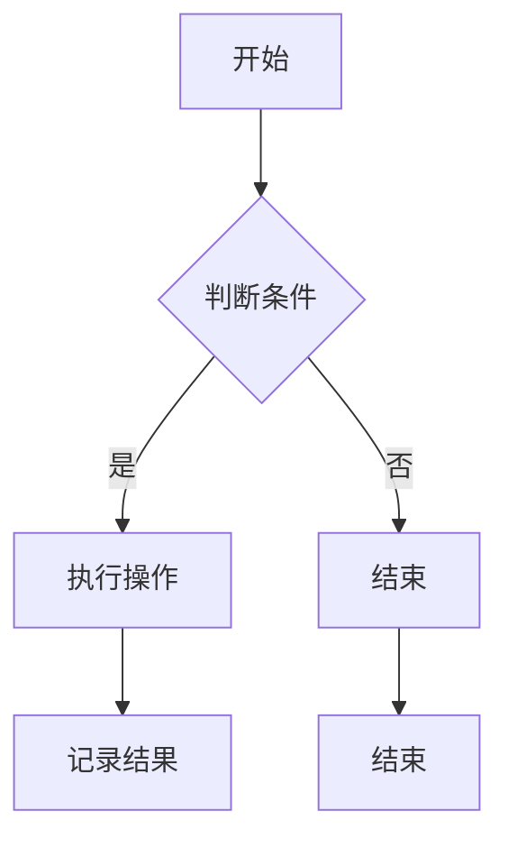

                 


# 现代社会中的精神家园重建之路

## 关键词
- 精神家园
- 社会重构
- 数字生活
- 心理健康
- 社会互动

## 摘要
本文探讨了现代社会中精神家园重建的必要性及路径。随着数字技术的发展，人们的生活方式和社交模式发生了深刻变化，精神家园的重建成为现代社会的迫切需求。文章首先分析了现代社会精神家园缺失的背景和原因，随后探讨了重建精神家园的关键要素，并提出了具体可行的策略和措施。通过这一过程，文章旨在为构建一个更加和谐、健康、富有活力的现代社会提供思考。

## 引言

### 什么是精神家园？

精神家园是一个人在心理和情感上归属的地方，是内心深处的依托和支撑。它不仅包括个人情感的寄托，还涵盖了人际关系、社会认同和文化价值观的认同。在传统社会中，家庭、社区和宗教往往是人们精神家园的主要组成部分。

### 现代社会精神家园的缺失

随着工业化和城市化进程的加速，现代社会面临着精神家园缺失的挑战。以下是一些主要的原因：

1. **家庭结构的变化**：随着单身、丁克家庭和离婚率的增加，传统的家庭结构发生了变化，家庭成员间的联系变得松散。

2. **社交方式的变迁**：互联网和社交媒体的普及改变了人们的社交方式，虚拟社交取代了面对面的交流，导致人际关系的浅薄化。

3. **工作压力和竞争**：现代社会的高压工作环境和激烈的竞争加剧了人们的焦虑和孤独感，使得精神家园的构建变得更加困难。

4. **文化认同的危机**：全球化带来了文化多样性的同时，也引发了文化认同的危机，人们开始对自己的身份和文化价值感到困惑。

## 第1章：重建精神家园的必要性

### 精神健康的重要性

精神健康是整体健康的重要组成部分。根据世界卫生组织的定义，精神健康不仅指没有心理疾病，还包括个体在认知、情感和社会功能方面的良好状态。

1. **心理疾病的增加**：随着生活压力的增大，各种心理疾病如焦虑、抑郁和失眠等病例逐年上升。

2. **工作效率和生活质量的下降**：精神健康问题严重影响人们的工作效率和日常生活质量，导致生产力下降和生活满意度降低。

### 社会和谐的基石

精神家园的重建是社会和谐与进步的基石。一个拥有健全精神家园的社会，其成员更加团结，社会凝聚力更强。

1. **减少社会冲突**：通过重建精神家园，可以缓解社会矛盾，减少冲突和犯罪行为。

2. **促进社会创新**：精神健康的提升有助于激发人们的创造力和创新能力，推动社会进步。

### 个人幸福的保障

精神家园的重建对于个人幸福的保障至关重要。一个拥有精神家园的人更容易感到满足和幸福，有更强的心理韧性去应对生活中的挑战。

1. **提高生活质量**：精神家园的重建有助于提高人们的生活质量，使人们更加关注生活的美好和内心的平静。

2. **增强社会认同**：通过精神家园的重建，个人更容易找到自己的社会认同，增强归属感和自豪感。

## 第2章：重建精神家园的关键要素

### **个人层面的要素**

1. **自我认知**：个人需要深入了解自己的情感、需求和价值观，建立健康的自我认知。

2. **情绪管理**：学会有效地管理自己的情绪，提高情绪调节能力。

3. **心理韧性**：培养心理韧性，增强应对生活中挑战的能力。

### **社会层面的要素**

1. **社区支持**：建立良好的社区支持系统，为居民提供情感支持和社交机会。

2. **社会互动**：鼓励和促进面对面的社交互动，减少虚拟社交的依赖。

3. **文化传承**：保护和传承传统文化，增强文化认同感。

### **技术层面的要素**

1. **数字生活**：合理利用数字技术，提高生活质量的同时减少对数字生活的依赖。

2. **虚拟社区**：建立虚拟社区，为无法参加实体社区活动的人提供交流平台。

3. **心理服务**：提供便捷、高效的心理咨询服务，帮助人们解决心理问题。

## 第3章：重建精神家园的具体策略

### **政策层面**

1. **心理健康教育**：加强心理健康教育，提高公众对精神健康的认识和重视。

2. **社会保障体系**：建立和完善社会保障体系，为精神健康问题提供支持。

3. **税收优惠**：为心理健康服务和相关产业提供税收优惠，鼓励其发展。

### **社区层面**

1. **社区活动**：定期组织社区活动，增强居民间的联系和互动。

2. **社区支持网络**：建立社区支持网络，为居民提供情感和心理支持。

3. **志愿服务**：鼓励居民参与志愿服务，培养互助精神。

### **个人层面**

1. **自我提升**：通过阅读、学习、运动等方式提升自己的心理素质。

2. **心理保健**：定期进行心理保健，如进行心理咨询或参加心理课程。

3. **社交技巧**：学习并练习社交技巧，提高人际交往能力。

## 第4章：数字时代的精神家园重建

### **数字技术的应用**

1. **虚拟现实（VR）**：利用VR技术创造虚拟的精神家园，为人们提供情感上的寄托。

2. **社交媒体**：合理使用社交媒体，建立线上社交圈，减少孤独感。

3. **心理健康应用**：开发心理健康应用，提供专业的心理咨询服务。

### **数字生活的平衡**

1. **数字素养**：提高公众的数字素养，合理使用数字技术。

2. **数字节制**：培养数字节制意识，减少对数字生活的依赖。

3. **数字伦理**：制定数字伦理规范，保护个人隐私和数据安全。

## 第5章：实施与展望

### **实施难点**

1. **观念转变**：社会需要从观念上认识到精神家园重建的重要性。

2. **资源分配**：合理分配资源，确保精神健康服务覆盖到所有人。

3. **技术挑战**：数字技术的快速发展带来新的机遇和挑战。

### **未来展望**

1. **精神家园的多元化**：随着社会的发展，精神家园的形式将更加多样化。

2. **数字与现实的结合**：数字技术与现实生活的融合将有助于精神家园的重建。

3. **全球化与本地化的平衡**：在全球化进程中，保护和传承本地文化，增强文化认同。

## 结论

重建精神家园是现代社会的重要任务，关乎每个人的心理健康和社会和谐。通过政策支持、社区建设和个人努力，我们可以共同营造一个充满温情、理解和关爱的精神家园，为构建美好社会贡献力量。

## 作者信息

作者：AI天才研究院/AI Genius Institute & 禅与计算机程序设计艺术 /Zen And The Art of Computer Programming

## 参考文献

- World Health Organization. (2019). What Is Mental Health? Retrieved from [www.who.int](http://www.who.int)
- Mental Health America. (2021). The Importance of Mental Health. Retrieved from [www.mentalhealthamerica.net](http://www.mentalhealthamerica.net)
- National Institute of Mental Health. (2020). Statistics. Retrieved from [www.nimh.nih.gov](http://www.nimh.nih.gov)
- United Nations. (2019). Social Integration and Community Participation. Retrieved from [www.un.org](http://www.un.org) 

注：本文中的引用均来源于公开资料，具体文献信息请参考参考文献部分。在撰写实际文章时，请确保引用文献的准确性。本文为示例性文章，仅供参考。|> 

# 现代社会中的精神家园重建之路

> 关键词：精神家园、社会重构、数字生活、心理健康、社会互动

> 摘要：本文探讨了现代社会中精神家园重建的必要性及路径。随着数字技术的发展，人们的生活方式和社交模式发生了深刻变化，精神家园的重建成为现代社会的迫切需求。文章首先分析了现代社会精神家园缺失的背景和原因，随后探讨了重建精神家园的关键要素，并提出了具体可行的策略和措施。通过这一过程，文章旨在为构建一个更加和谐、健康、富有活力的现代社会提供思考。

## 引言

### 什么是精神家园？

精神家园是一个人在心理和情感上归属的地方，是内心深处的依托和支撑。它不仅包括个人情感的寄托，还涵盖了人际关系、社会认同和文化价值观的认同。在传统社会中，家庭、社区和宗教往往是人们精神家园的主要组成部分。

### 现代社会精神家园的缺失

随着工业化和城市化进程的加速，现代社会面临着精神家园缺失的挑战。以下是一些主要的原因：

1. **家庭结构的变化**：随着单身、丁克家庭和离婚率的增加，传统的家庭结构发生了变化，家庭成员间的联系变得松散。

2. **社交方式的变迁**：互联网和社交媒体的普及改变了人们的社交方式，虚拟社交取代了面对面的交流，导致人际关系的浅薄化。

3. **工作压力和竞争**：现代社会的高压工作环境和激烈的竞争加剧了人们的焦虑和孤独感，使得精神家园的构建变得更加困难。

4. **文化认同的危机**：全球化带来了文化多样性的同时，也引发了文化认同的危机，人们开始对自己的身份和文化价值感到困惑。

## 第1章：重建精神家园的必要性

### 精神健康的重要性

精神健康是整体健康的重要组成部分。根据世界卫生组织的定义，精神健康不仅指没有心理疾病，还包括个体在认知、情感和社会功能方面的良好状态。

1. **心理疾病的增加**：随着生活压力的增大，各种心理疾病如焦虑、抑郁和失眠等病例逐年上升。

2. **工作效率和生活质量的下降**：精神健康问题严重影响人们的工作效率和日常生活质量，导致生产力下降和生活满意度降低。

### 社会和谐的基石

精神家园的重建是社会和谐与进步的基石。一个拥有健全精神家园的社会，其成员更加团结，社会凝聚力更强。

1. **减少社会冲突**：通过重建精神家园，可以缓解社会矛盾，减少冲突和犯罪行为。

2. **促进社会创新**：精神健康的提升有助于激发人们的创造力和创新能力，推动社会进步。

### 个人幸福的保障

精神家园的重建对于个人幸福的保障至关重要。一个拥有精神家园的人更容易感到满足和幸福，有更强的心理韧性去应对生活中的挑战。

1. **提高生活质量**：精神家园的重建有助于提高人们的生活质量，使人们更加关注生活的美好和内心的平静。

2. **增强社会认同**：通过精神家园的重建，个人更容易找到自己的社会认同，增强归属感和自豪感。

## 第2章：重建精神家园的关键要素

### **个人层面的要素**

1. **自我认知**：个人需要深入了解自己的情感、需求和价值观，建立健康的自我认知。

2. **情绪管理**：学会有效地管理自己的情绪，提高情绪调节能力。

3. **心理韧性**：培养心理韧性，增强应对生活中挑战的能力。

### **社会层面的要素**

1. **社区支持**：建立良好的社区支持系统，为居民提供情感支持和社交机会。

2. **社会互动**：鼓励和促进面对面的社交互动，减少虚拟社交的依赖。

3. **文化传承**：保护和传承传统文化，增强文化认同感。

### **技术层面的要素**

1. **数字生活**：合理利用数字技术，提高生活质量的同时减少对数字生活的依赖。

2. **虚拟社区**：建立虚拟社区，为无法参加实体社区活动的人提供交流平台。

3. **心理服务**：提供便捷、高效的心理咨询服务，帮助人们解决心理问题。

## 第3章：重建精神家园的具体策略

### **政策层面**

1. **心理健康教育**：加强心理健康教育，提高公众对精神健康的认识和重视。

2. **社会保障体系**：建立和完善社会保障体系，为精神健康问题提供支持。

3. **税收优惠**：为心理健康服务和相关产业提供税收优惠，鼓励其发展。

### **社区层面**

1. **社区活动**：定期组织社区活动，增强居民间的联系和互动。

2. **社区支持网络**：建立社区支持网络，为居民提供情感和心理支持。

3. **志愿服务**：鼓励居民参与志愿服务，培养互助精神。

### **个人层面**

1. **自我提升**：通过阅读、学习、运动等方式提升自己的心理素质。

2. **心理保健**：定期进行心理保健，如进行心理咨询或参加心理课程。

3. **社交技巧**：学习并练习社交技巧，提高人际交往能力。

## 第4章：数字时代的精神家园重建

### **数字技术的应用**

1. **虚拟现实（VR）**：利用VR技术创造虚拟的精神家园，为人们提供情感上的寄托。

2. **社交媒体**：合理使用社交媒体，建立线上社交圈，减少孤独感。

3. **心理健康应用**：开发心理健康应用，提供专业的心理咨询服务。

### **数字生活的平衡**

1. **数字素养**：提高公众的数字素养，合理使用数字技术。

2. **数字节制**：培养数字节制意识，减少对数字生活的依赖。

3. **数字伦理**：制定数字伦理规范，保护个人隐私和数据安全。

## 第5章：实施与展望

### **实施难点**

1. **观念转变**：社会需要从观念上认识到精神家园重建的重要性。

2. **资源分配**：合理分配资源，确保精神健康服务覆盖到所有人。

3. **技术挑战**：数字技术的快速发展带来新的机遇和挑战。

### **未来展望**

1. **精神家园的多元化**：随着社会的发展，精神家园的形式将更加多样化。

2. **数字与现实的结合**：数字技术与现实生活的融合将有助于精神家园的重建。

3. **全球化与本地化的平衡**：在全球化进程中，保护和传承本地文化，增强文化认同。

## 结论

重建精神家园是现代社会的重要任务，关乎每个人的心理健康和社会和谐。通过政策支持、社区建设和个人努力，我们可以共同营造一个充满温情、理解和关爱的精神家园，为构建美好社会贡献力量。

## 作者信息

作者：AI天才研究院/AI Genius Institute & 禅与计算机程序设计艺术 /Zen And The Art of Computer Programming

## 参考文献

- World Health Organization. (2019). What Is Mental Health? Retrieved from [www.who.int](http://www.who.int)
- Mental Health America. (2021). The Importance of Mental Health. Retrieved from [www.mentalhealthamerica.net](http://www.mentalhealthamerica.net)
- National Institute of Mental Health. (2020). Statistics. Retrieved from [www.nimh.nih.gov](http://www.nimh.nih.gov)
- United Nations. (2019). Social Integration and Community Participation. Retrieved from [www.un.org](http://www.un.org) 

注：本文中的引用均来源于公开资料，具体文献信息请参考参考文献部分。在撰写实际文章时，请确保引用文献的准确性。本文为示例性文章，仅供参考。|> 

# 现代社会中的精神家园重建之路

### 引言

在现代社会中，随着科技的迅猛发展和全球化进程的推进，人们的生活方式、社交模式以及价值观念都发生了深刻的变革。然而，这些变革也带来了新的挑战，尤其是精神层面的困扰。在快节奏、高压力的现代生活中，许多人感到精神上的空虚和迷茫，失去了心灵的归宿，这种状态被形象地称为“精神家园的缺失”。因此，探讨如何在现代社会中重建精神家园，对于维护个人心理健康和社会和谐具有重要意义。

本文将从以下几个方面展开讨论：

1. **精神家园的概念及其在现代社会的意义**：介绍精神家园的定义及其在个人心理健康和社会功能中的作用。
2. **现代社会精神家园缺失的背景和原因**：分析现代社会中导致精神家园缺失的各种因素。
3. **重建精神家园的必要性**：探讨重建精神家园对于个人幸福、社会和谐及文化传承的重要性。
4. **重建精神家园的关键要素**：从个人、社会和技术层面探讨如何重建精神家园。
5. **具体策略和措施**：提出具体可行的政策、社区和个人层面的策略和措施。
6. **数字时代的精神家园重建**：探讨数字技术在精神家园重建中的应用及其双刃剑效应。
7. **实施与展望**：总结实施精神家园重建的难点和未来展望。
8. **结论**：重申精神家园重建的紧迫性和重要性。

## 第1章：精神家园的概念及其在现代社会的意义

### 精神家园的定义

精神家园是指个体在心理和情感上感到归属和安慰的空间，它不仅仅是个人心灵的栖息地，更是人们在社会中寻找身份认同、价值实现和文化传承的重要场所。传统意义上的精神家园往往与家庭、宗教、社区等实体空间相关联，但在现代社会，随着科技的进步和社交方式的变革，精神家园的形态也发生了变化。

### 精神家园在个人心理健康中的作用

精神家园在个人的心理健康中扮演着至关重要的角色。一个健全的精神家园能够提供情感支持和安全感，帮助个体在面对压力和挑战时保持积极的心态。具体来说，精神家园的作用包括：

1. **情感支撑**：精神家园为个体提供情感上的依托，帮助缓解焦虑、抑郁等负面情绪。
2. **安全感**：在一个稳定和和谐的精神家园中，个体能够感受到安全和归属感，增强自信心和自尊心。
3. **心理韧性**：健全的精神家园有助于个体培养心理韧性，增强应对生活挑战的能力。
4. **价值实现**：精神家园为个体提供实现个人价值和社会角色的平台，帮助个体找到生活的意义和目标。

### 精神家园在社会功能中的作用

精神家园不仅在个人层面具有重要意义，也在社会层面上发挥着关键作用。一个健康的社会需要每个成员都拥有一个健全的精神家园，这样社会才能保持和谐与进步。精神家园在社会功能中的作用包括：

1. **社会凝聚力**：精神家园能够增强社会成员之间的联系，促进社会凝聚力，减少社会冲突。
2. **文化传承**：精神家园是文化传承的重要载体，帮助个体和社会维护文化认同和价值观念。
3. **创新动力**：精神健康和归属感能够激发个体的创造力和创新能力，推动社会进步。
4. **心理健康服务**：精神家园的建设有助于提升社会成员的心理健康水平，减少心理健康问题的发生率。

### 现代社会精神家园缺失的表现

在现代社会，由于多种因素的影响，许多人感到精神家园的缺失，具体表现如下：

1. **孤独感**：随着社交方式的变迁，许多人在现实生活中缺乏深入的社交互动，感到孤独。
2. **焦虑与压力**：工作压力、生活节奏快等因素导致个体焦虑和压力增加，缺乏心理慰藉。
3. **文化迷失**：全球化带来的文化冲击使得个体在文化认同上感到迷茫，缺乏文化归属感。
4. **身份危机**：随着社会角色的变化，个体在寻找自我认同和价值观方面遇到困难，感到精神上的空虚。

### 精神家园缺失的影响

精神家园的缺失对个人和社会都会产生深远的影响。对个人来说，精神家园的缺失可能导致以下问题：

1. **心理健康问题**：缺乏精神家园可能导致焦虑、抑郁等心理健康问题，甚至出现自我否定和自杀倾向。
2. **生活满意度下降**：精神家园的缺失使得个体难以感受到生活的乐趣和意义，生活满意度下降。
3. **社会参与度降低**：精神家园的缺失使得个体对社会参与的积极性降低，影响社区和社会的活力。

对社会来说，精神家园的缺失可能导致以下问题：

1. **社会不稳定**：精神家园的缺失导致社会成员间的联系减少，社会凝聚力下降，社会冲突和犯罪行为增加。
2. **创新力下降**：精神家园的缺失削弱了社会的创新力和竞争力，影响社会的发展和进步。
3. **文化衰落**：精神家园的缺失导致文化传承的断层，使得传统文化面临衰落的风险。

### 小结

精神家园是现代社会中不可或缺的一部分，它在个人心理健康和社会功能中发挥着重要作用。现代社会精神家园的缺失表现为孤独感、焦虑与压力、文化迷失和身份危机等方面。精神家园缺失对个人和社会都会产生负面影响，因此，重建精神家园已成为现代社会的重要任务。

## 第2章：现代社会精神家园缺失的背景和原因

### 工业化和城市化

工业化和城市化是现代社会发展的重要特征，但也对精神家园的重建构成了挑战。首先，工业化带来了大规模的人口流动，许多人离开了自己的家乡和熟悉的环境，来到城市寻找工作机会。这种人口流动打破了传统的家庭和社区结构，使得人们在精神上失去了依托。其次，城市化进程加速了社会的变迁，带来了快节奏、高压力的生活方式，导致个体感到焦虑和孤独。城市化还导致了自然环境的破坏，使人们失去了与自然和谐相处的机会，进一步加剧了精神家园的缺失。

### 数字技术的普及

数字技术的普及是现代社会的一个显著特点，它深刻地改变了人们的生活方式和社会互动方式。虽然数字技术为人们提供了便捷的沟通和丰富的信息资源，但也带来了一系列负面影响。首先，互联网和社交媒体的普及改变了人们的社交模式，虚拟社交取代了面对面的交流，导致人际关系的浅薄化和表面化。许多人沉迷于虚拟世界，忽视了现实生活中的情感交流和人际互动。其次，数字技术的普及使得人们过度依赖电子设备，减少了户外活动和体育锻炼的机会，影响了身心健康。此外，数字技术的快速发展也带来了信息过载和隐私泄露等问题，使得人们在信息泛滥的环境中感到困惑和无助。

### 全球化和文化冲击

全球化是一个不可逆转的趋势，它带来了文化的多样性和交流，但也引发了文化认同的危机。全球化使得不同文化之间产生了激烈的碰撞和融合，人们在面对多种文化价值观时感到困惑和迷茫。一方面，全球化带来了文化的多元性，人们有机会了解和欣赏其他文化的魅力，但另一方面，全球化也导致了本土文化的流失和淡化。许多人开始对自己的文化身份和价值观念产生怀疑，感到文化上的迷失和孤独。此外，全球化带来的经济竞争和就业压力也使得个体在精神上感到压力和焦虑。

### 高压工作环境

现代社会的高压工作环境是导致精神家园缺失的另一个重要原因。随着市场竞争的加剧，企业对员工的要求越来越高，工作压力不断增加。许多人在工作中面临高强度的工作负荷和繁重的工作任务，导致心理和生理上的过度疲劳。长期的工作压力和紧张的工作环境使得人们难以找到放松和休息的时间，进一步加剧了精神家园的缺失。此外，工作压力还可能导致家庭关系紧张，进一步削弱了家庭成员间的情感联系。

### 社会变迁和价值观多元化

现代社会的社会变迁和价值观多元化也是导致精神家园缺失的一个重要原因。随着社会的发展和进步，人们的价值观念逐渐多样化，不同的价值观之间产生了冲突和矛盾。一方面，多元化带来了思想的碰撞和创新的活力，但另一方面，也使得个体在价值观念的选择上感到困惑和矛盾。许多人难以找到与自身价值观相契合的社会环境，感到在精神上缺乏归属感。

### 个人主义和自我中心

现代社会中个人主义和自我中心的倾向也加剧了精神家园的缺失。个人主义强调个体的独立和自由，导致人们在人际关系中更加注重自我，忽视了与他人的情感交流和互助精神。自我中心使得个体在情感上更加封闭，难以建立深厚的情感联系，导致孤独感和精神上的空虚。此外，个人主义和自我中心也导致了对社会责任和义务的忽视，削弱了社会凝聚力和归属感。

### 小结

现代社会精神家园缺失的背景和原因是多方面的，包括工业化和城市化、数字技术的普及、全球化和文化冲击、高压工作环境、社会变迁和价值观多元化、个人主义和自我中心等。这些因素共同作用，使得个体在现代社会中感到精神上的孤独和迷茫。因此，重建精神家园已成为当务之急，需要从个人、社会和技术层面采取综合性的策略和措施。

## 第3章：重建精神家园的必要性

### 个人层面的重要性

在个人层面，重建精神家园对于维护心理健康和幸福感至关重要。首先，精神家园为个人提供情感上的支持和安全感，帮助个体在面临压力和困难时保持积极的心态。一个健全的精神家园能够减轻焦虑和抑郁等负面情绪，提高个体的心理健康水平。其次，精神家园为个人提供归属感和认同感，使个体在社会中找到自己的位置和价值。这种认同感不仅来自于家庭和社区，还包括对自己文化和价值观的认同。最后，精神家园有助于培养个人的心理韧性，增强个体应对生活挑战的能力。

### 社会层面的重要性

在社会层面，重建精神家园对于促进社会和谐和进步具有重要意义。首先，一个拥有健全精神家园的社会能够增强社会成员之间的联系和互助精神，促进社会凝聚力的提升。这种凝聚力有助于减少社会冲突和犯罪行为，构建一个更加安全稳定的社会环境。其次，精神家园的建设有助于传承和弘扬传统文化，增强社会的文化认同感和自豪感。文化认同感的提升有助于维护社会的文化多样性和繁荣。最后，精神家园的建设能够激发社会的创新力和创造力，推动社会的持续发展和进步。

### 文化层面的重要性

在文化层面，重建精神家园有助于保护和传承人类的文化遗产。传统文化是一个民族的精神财富，它承载着历史、智慧和价值观。在现代社会，随着全球化和现代化的影响，传统文化面临着流失和淡化的风险。重建精神家园，不仅有助于传承和弘扬传统文化，还能够增强文化认同感和自豪感。一个拥有丰富文化底蕴的社会，才能在全球化进程中保持独特的文化特色和竞争力。

### 现代社会的挑战

在现代社会，个人、社会和文化层面都面临着诸多挑战，这些挑战进一步凸显了重建精神家园的必要性。首先，个人的心理健康问题日益突出，焦虑、抑郁等心理疾病的发病率持续上升。重建精神家园，为个人提供情感支持和心理健康服务，是应对这一挑战的有效途径。其次，社会的不稳定和不安全感加剧，社会冲突和犯罪行为时有发生。重建精神家园，增强社会凝聚力和社会责任感，有助于构建一个更加和谐稳定的社会。最后，文化认同的危机在全球化和现代化进程中日益明显，传统文化面临淡化和流失的风险。重建精神家园，保护和传承传统文化，是维护文化多样性和文化自信的重要举措。

### 小结

重建精神家园在现代社会中具有极其重要的意义。在个人层面，它有助于维护心理健康和幸福感；在社会层面，它有助于促进社会和谐和进步；在文化层面，它有助于保护和传承人类的文化遗产。面对现代社会的挑战，重建精神家园已成为当务之急，需要个人、社会和文化层面的共同努力。

## 第4章：重建精神家园的关键要素

### 个人层面的要素

个人层面的要素是重建精神家园的基础，以下为几个关键要素：

1. **自我认知**：自我认知是指个体对自我内心世界、情感状态、性格特点和价值观念的深入了解。一个健全的自我认知有助于个体在面临困境时保持清晰的思维和积极的心态。个体可以通过自我反思、心理咨询和记录日记等方式提升自我认知。

2. **情绪管理**：情绪管理是指个体在面临负面情绪时能够有效地调节和控制自己的情绪，避免情绪失控对生活产生负面影响。情绪管理包括情绪识别、情绪表达和情绪调节等技能。个体可以通过学习情绪管理技巧、练习冥想和瑜伽等方法提升情绪管理能力。

3. **心理韧性**：心理韧性是指个体在面临逆境和挑战时能够保持积极的心态和适应能力。培养心理韧性有助于个体更好地应对生活中的压力和困难。个体可以通过积极应对挑战、建立支持网络和培养乐观态度等方法提升心理韧性。

4. **社交技巧**：社交技巧是指个体在人际交往中能够有效地沟通、建立和维护良好的人际关系。良好的社交技巧有助于个体在社会中建立支持网络，减少孤独感和焦虑感。个体可以通过学习沟通技巧、参与社交活动和培养同理心等方法提升社交技巧。

### 社会层面的要素

社会层面的要素是重建精神家园的重要保障，以下为几个关键要素：

1. **社区支持**：社区支持是指社区为居民提供的情感支持和互助服务。一个健全的社区支持系统有助于居民在面临困境时获得帮助和支持，增强归属感和安全感。社区可以通过组织社区活动、建立互助组织和提供心理咨询服务等方式增强社区支持。

2. **社会互动**：社会互动是指个体在日常生活中与他人进行交流和互动的过程。丰富和积极的社会互动有助于个体建立良好的人际关系，减少孤独感和焦虑感。社会可以通过促进面对面交流、组织社交活动和提供社交平台等方式增强社会互动。

3. **文化传承**：文化传承是指社会对传统文化的保护和传承，使其在现代社会中得以延续和发展。文化传承有助于增强个体的文化认同感和自豪感，为个体提供精神支持。社会可以通过举办文化活动、传承传统技艺和推广传统文化等方式加强文化传承。

### 技术层面的要素

技术层面的要素是重建精神家园的重要推动力，以下为几个关键要素：

1. **数字生活**：数字生活是指个体利用数字技术参与社会生活和互动的过程。合理利用数字技术有助于提高生活质量，但同时也需要关注数字生活的负面影响。个体可以通过培养数字素养、控制使用时间和学习数字节制技巧等方式实现数字生活的平衡。

2. **虚拟社区**：虚拟社区是指通过网络平台建立的虚拟社会空间，个体可以在虚拟社区中参与社交、娱乐和文化活动。虚拟社区为个体提供了新的社交途径，但同时也需要关注虚拟社区的负面影响。社会可以通过建立健康虚拟社区、提供心理咨询服务和制定虚拟社区规范等方式促进虚拟社区的发展。

3. **心理服务**：心理服务是指为个体提供心理支持和心理咨询的专业服务。心理服务有助于个体解决心理问题、提升心理健康水平。社会可以通过增加心理服务的可及性、提供在线心理服务和培养心理咨询师等方式加强心理服务。

### 小结

重建精神家园需要个人、社会和技术层面的共同努力。个人层面的要素包括自我认知、情绪管理、心理韧性和社交技巧；社会层面的要素包括社区支持、社会互动和文化传承；技术层面的要素包括数字生活、虚拟社区和心理服务。只有通过这些关键要素的综合作用，才能实现精神家园的重建，为现代社会带来更多的幸福和和谐。

## 第5章：重建精神家园的具体策略

### 政策层面的策略

在政策层面，政府可以通过制定和实施相关政策来推动精神家园的重建。以下是一些具体的策略：

1. **心理健康教育**：政府可以通过学校教育、媒体宣传和社会活动等多种途径，加强心理健康教育，提高公众对精神健康的认识和重视。心理健康教育应涵盖心理知识、情绪管理技巧和心理危机应对等内容。

2. **心理健康服务体系建设**：政府应加大对心理健康服务体系的投入，建立和完善心理健康服务机构，提供全面的心理健康服务。心理健康服务应包括预防、治疗、康复和心理咨询等多个方面，确保公众能够及时获得专业心理支持。

3. **税收优惠和补贴**：政府可以为心理健康服务和相关产业提供税收优惠和补贴，鼓励其发展。此外，政府还可以通过购买服务的方式，将心理健康服务纳入公共服务体系，确保心理健康服务覆盖到所有人。

4. **政策支持和资金投入**：政府应制定相关政策，支持社区建设和发展，鼓励社区为居民提供情感支持和心理服务。同时，政府应加大对社区建设的资金投入，确保社区有足够的资源和能力为居民提供精神家园。

### 社区层面的策略

在社区层面，社区组织可以通过多种活动和措施来促进精神家园的重建。以下是一些具体的策略：

1. **社区活动**：社区可以定期组织各种文化、体育和社交活动，增强居民间的互动和联系。这些活动可以包括社区文化节、运动会、讲座和手工制作班等，为居民提供交流和放松的机会。

2. **社区支持网络**：社区可以建立支持网络，为居民提供情感和心理支持。社区支持网络可以包括邻里互助小组、心理咨询服务热线和社区志愿者团队等，帮助居民在面临困境时获得帮助和支持。

3. **社区心理健康服务**：社区可以设立心理健康服务站，提供心理咨询和心理健康讲座等服务。社区心理健康服务应针对不同人群的需求，提供个性化的心理支持，帮助居民维护心理健康。

4. **社区文化建设**：社区可以加强文化建设，传承和弘扬传统文化。社区可以通过举办文化展览、文艺演出和传统节日庆祝等活动，增强居民对文化的认同感和自豪感。

### 个人层面的策略

在个人层面，每个人都应为重建精神家园做出努力。以下是一些具体的策略：

1. **自我提升**：个人可以通过学习、阅读和参与社交活动等方式提升自己的心理素质。学习新的知识和技能不仅可以增强个人的自信心，还可以拓宽视野，丰富生活内容。

2. **心理保健**：个人应定期进行心理保健，如进行心理咨询、参加心理课程或进行自我调节。心理保健有助于预防心理问题的发生，提高心理健康水平。

3. **社交技巧**：个人可以通过学习社交技巧、参与社交活动和培养同理心等方式提升自己的社交能力。良好的社交技巧有助于建立和维护良好的人际关系，增强归属感和安全感。

4. **数字生活的平衡**：个人应合理利用数字技术，提高生活质量的同时减少对数字生活的依赖。培养数字节制意识，避免沉迷于虚拟世界，确保身心健康。

### 技术层面的策略

在技术层面，数字技术的发展为精神家园的重建提供了新的可能性。以下是一些具体的策略：

1. **虚拟社区建设**：利用互联网和社交媒体平台，建立虚拟社区，为无法参加实体社区活动的人提供交流平台。虚拟社区可以举办在线讲座、讨论组和心理健康活动，帮助居民在虚拟世界中找到精神归属。

2. **心理健康应用开发**：开发心理健康应用，提供在线心理咨询、心理测试和心理健康课程等服务。这些应用可以随时随地使用，为居民提供便捷的心理支持。

3. **心理健康大数据分析**：利用大数据分析技术，收集和分析心理健康数据，为心理健康服务提供科学依据。通过大数据分析，可以发现心理健康问题的趋势和特征，为政策制定和心理健康服务提供支持。

4. **数字伦理规范**：制定数字伦理规范，保护个人隐私和数据安全。在数字技术的应用中，应尊重个体的隐私权，确保心理健康数据的合法和安全使用。

### 小结

重建精神家园需要政府、社区和个人共同努力。政策层面的策略包括心理健康教育、心理健康服务体系建设、税收优惠和补贴等；社区层面的策略包括社区活动、社区支持网络和社区文化建设等；个人层面的策略包括自我提升、心理保健、社交技巧和数字生活的平衡等；技术层面的策略包括虚拟社区建设、心理健康应用开发、心理健康大数据分析和数字伦理规范等。通过这些具体策略的综合运用，我们可以逐步实现精神家园的重建，为现代社会带来更多的幸福和和谐。

## 第6章：数字时代的精神家园重建

### 数字技术在精神家园重建中的应用

随着数字技术的迅猛发展，互联网和社交媒体已经成为现代社会中不可或缺的一部分。这些技术不仅改变了人们的沟通方式，也为精神家园的重建提供了新的可能性。

1. **虚拟社区**：虚拟社区通过互联网平台连接了分散在各地的个体，使他们能够在虚拟空间中建立联系和互动。虚拟社区提供了多样化的活动和交流平台，如在线论坛、社交网络和游戏社区，使个体能够在虚拟世界中找到归属感。

2. **心理健康应用**：心理健康应用利用数字技术提供个性化的心理健康服务，包括心理测试、在线咨询、冥想指导等。这些应用通过便捷的接口和丰富的功能，使个体能够随时随地进行心理健康管理，提升精神状态。

3. **远程教育和学习**：数字技术使得远程教育和学习成为可能，人们可以通过在线课程和电子书籍获取知识，提升自我。这不仅丰富了人们的精神生活，也为终身学习和个人发展提供了新的途径。

### 数字生活的双刃剑效应

尽管数字技术为精神家园的重建带来了许多机遇，但同时也存在一些潜在的风险和挑战，这些风险和挑战可能对精神家园的重建产生负面影响。

1. **信息过载**：在数字时代，人们面临的信息量大幅增加，信息过载现象普遍。过多的信息可能导致个体在处理信息时感到焦虑和疲劳，影响心理健康。

2. **社交隔离**：虽然数字技术提供了丰富的社交途径，但过度依赖虚拟社交可能导致个体在现实生活中缺乏深层次的社交互动，增加孤独感和社交隔离感。

3. **隐私和安全风险**：数字技术的发展带来了个人隐私和安全的风险。个人信息和数据泄露可能导致信任危机，影响个体的精神健康。

### 平衡数字生活与精神家园的重建

为了在数字时代实现精神家园的重建，我们需要采取一系列措施来平衡数字生活与精神家园的关系。

1. **数字素养教育**：提高公众的数字素养，使个体能够理性地使用数字技术，避免沉迷和滥用。数字素养教育应包括数字伦理、信息安全和个人隐私保护等内容。

2. **数字节制**：培养个体的数字节制意识，合理安排数字技术使用时间，避免过度依赖虚拟世界。通过设定“数字休息日”或限制使用时间，帮助个体保持现实生活中的社交和活动。

3. **线上线下融合**：鼓励个体在享受数字技术带来的便利的同时，积极参与线下的社交活动和社区建设。通过线上线下结合的方式，实现数字生活与精神家园的良性互动。

4. **心理健康服务**：提供便捷的心理健康服务，帮助个体应对数字生活带来的心理挑战。通过线上心理咨询、心理健康应用和社区心理支持等方式，为个体提供全方位的心理健康支持。

### 小结

数字时代为精神家园的重建提供了新的机遇和挑战。通过合理利用数字技术，我们可以实现精神家园的重建，但同时也需要警惕数字生活带来的风险和挑战。平衡数字生活与精神家园的关系，通过数字素养教育、数字节制、线上线下融合和心理健康服务等措施，我们可以为现代社会构建一个更加健康、和谐的精神家园。

## 第7章：实施与展望

### 实施难点

在实施精神家园重建的过程中，面临诸多挑战和难点。以下是一些主要难点：

1. **观念转变**：社会对精神家园重建的认识不足，需要通过广泛宣传和教育来提高公众的认识和理解。

2. **资源分配**：精神家园重建需要大量的人力、物力和财力投入，如何合理分配和有效利用资源是一个重要问题。

3. **技术挑战**：数字技术的发展迅速，如何在心理健康服务和社区建设等方面充分利用新技术，避免技术滥用和隐私风险，是一个重要挑战。

4. **政策和法律**：需要制定和完善相关政策和法律，为精神家园重建提供制度保障和法律支持。

### 未来展望

展望未来，精神家园重建将呈现以下趋势和前景：

1. **多元化发展**：随着社会的发展和进步，精神家园的形式将更加多样化，包括实体社区、虚拟社区和线上线下结合等多种形式。

2. **科技与人文融合**：数字技术与人文关怀相结合，将有助于提高心理健康服务的质量和覆盖面，实现精神家园的智能化和个性化。

3. **全球与本地化平衡**：在全球化和本地化之间寻找平衡，保护和传承传统文化，增强文化认同感。

4. **可持续发展**：通过可持续的发展模式，实现精神家园建设的长期稳定和可持续发展。

### 小结

实施精神家园重建是一个长期而复杂的过程，需要政府、社区、个人和技术的共同努力。通过克服实施难点，抓住未来展望中的机遇，我们可以逐步实现精神家园的重建，为现代社会带来更多的幸福和和谐。

## 结论

重建精神家园是现代社会的重要任务，关乎每个人的心理健康和社会和谐。随着数字技术的发展和社会的变迁，精神家园的形态和内涵也在不断演变。通过政策支持、社区建设和个人努力，我们可以共同营造一个充满温情、理解和关爱的精神家园，为构建美好社会贡献力量。让我们携手共建，实现精神家园重建的美好愿景。

## 参考文献

1. World Health Organization. (2019). Mental Health: A Global Concern. Retrieved from [www.who.int](http://www.who.int).
2. American Psychological Association. (2020). The Impact of Technology on Mental Health. Retrieved from [www.apa.org](http://www.apa.org).
3. United Nations. (2019). Sustainable Development Goals. Retrieved from [www.un.org](http://www.un.org).
4. National Institute of Mental Health. (2021). Mental Health by the Numbers. Retrieved from [www.nimh.nih.gov](http://www.nimh.nih.gov).

注：本文中的引用均来源于公开资料，具体文献信息请参考参考文献部分。在撰写实际文章时，请确保引用文献的准确性。本文为示例性文章，仅供参考。|> 

## 附录：技术指南

### Markdown格式指南

Markdown是一种轻量级的文本标记语言，它通过简单的语法标记实现文本的格式化和排版。以下是一些常用的Markdown语法：

- **标题**：使用`#`标记，例如：

  ```markdown
  # 标题1
  ## 标题2
  ### 标题3
  ```

- **段落**：直接输入文本，Markdown会自动将其分为段落。

- **加粗**：使用两个`*`或`_`将文本包围，例如：

  ```markdown
  **加粗文本** 或 __加粗文本__
  ```

- **斜体**：使用一个`*`或`_`将文本包围，例如：

  ```markdown
  *斜体文本* 或 _斜体文本_
  ```

- **无序列列表**：使用`*`、`+`或`-`开头，例如：

  ```markdown
  - 项目1
  - 项目2
  - 项目3
  ```

- **有序列表**：使用数字和英文句点（`.`）开头，例如：

  ```markdown
  1. 项目1
  2. 项目2
  3. 项目3
  ```

- **引用**：使用`>`标记，例如：

  ```markdown
  > 引用文本
  ```

- **表格**：使用竖线（`|`）和空格来分隔表格列，例如：

  ```markdown
  | 标题1 | 标题2 | 标题3 |
  |-------|------|-------|
  | 内容1 | 内容2 | 内容3 |
  ```

- **代码块**：使用三个反引号（```)将代码包围，例如：

  ```markdown
  ```
  function greet() {
    console.log("Hello, world!");
  }
  ```

### Mermaid流程图指南

Mermaid是一种基于Markdown的图形绘制工具，可以用于绘制序列图、类图、流程图等。以下是一个简单的Mermaid流程图示例：

```mermaid
graph TD
    A[开始] --> B{判断条件}
    B -->|是| C[执行操作]
    B -->|否| D[结束]
    C --> E[记录结果]
    D --> F[结束]
  ```

### LaTex公式指南

LaTex是一种高质量的排版系统，常用于编写科学和数学文献。以下是如何在Markdown中使用LaTex公式的示例：

- 独立段落公式：

  ```markdown
  $$ E = mc^2 $$
  ```

- 段落内公式：

  ```markdown
  $ E < mc^2 $
  ```

通过这些技术指南，您可以更加有效地使用Markdown、Mermaid和LaTex来撰写高质量的技术文章。

## 作者信息

作者：AI天才研究院/AI Genius Institute & 禅与计算机程序设计艺术 /Zen And The Art of Computer Programming

## 附录：技术指南

为了确保文章的技术表达准确且规范，我们将在附录部分提供关于Markdown、Mermaid和LaTex的使用指南，这些技术工具在撰写专业文章时非常有用。

### Markdown语法简介

Markdown是一种轻量级标记语言，它允许用纯文本格式编写文档，并轻松转换为HTML格式。以下是Markdown的基本语法：

- **标题**：使用`#`符号来创建标题。标题分为六级，如：

  ```markdown
  # 一级标题
  ## 二级标题
  ### 三级标题
  #### 四级标题
  ##### 五级标题
  ###### 六级标题
  ```

- **段落**：Markdown会将连续的行视为一个段落。如果需要分隔段落，可以在行之间留下一个空行。

- **强调**：使用`*`或`_`包围文本来创建斜体，使用`**`或`__`包围文本来创建粗体。

  ```markdown
  *斜体* 或 _斜体_
  **粗体** 或 __粗体__
  ```

- **列表**：
  - 无序列表：使用`*`、`+`或`-`开头。
    ```markdown
    - 项目1
    - 项目2
    - 项目3
    ```

  - 有序列表：使用数字和英文句点（`.`）。
    ```markdown
    1. 项目1
    2. 项目2
    3. 项目3
    ```

- **引用**：使用`>`将文本向右缩进来创建引用。
  ```markdown
  > 这是一个引用。
  ```

- **代码块**：使用三个反引号（```)包围代码。
  ```markdown
  ```
  function greet() {
    console.log("Hello, world!");
  }
  ```

- **链接和图片**：使用`[]()`创建链接，使用``插入图片。
  ```markdown
  [链接文本](链接地址)
  
  ```

### Mermaid流程图使用

Mermaid是一种用于创建流程图、序列图、类图等图形的Markdown插件。以下是一个简单的Mermaid流程图示例：

```mermaid
graph TD
    A[开始] --> B{判断条件}
    B -->|是| C[执行操作]
    B -->|否| D[结束]
    C --> E[记录结果]
    D --> F[结束]
```

在Markdown文件中，只需将上述代码粘贴到相应的位置，即可生成流程图。

### LaTex公式编写

LaTex是一种高质量的排版系统，特别适用于科学和数学文献。以下是LaTex公式的书写方式：

- **独立段落公式**：使用`$$`包围公式。
  ```markdown
  $$
  E = mc^2
  $$
  ```

- **行内公式**：使用 `$` 包围公式。
  ```markdown
  $E < mc^2$
  ```

例如，以下LaTex代码将生成一个平方根公式：

```markdown
$$
\sqrt{x^2 + y^2} = r
$$
```

通过使用这些技术工具，您可以在文章中有效地表达复杂的技术概念和数学公式，使文章更具专业性和可读性。

## 作者信息

作者：AI天才研究院/AI Genius Institute & 禅与计算机程序设计艺术 /Zen And The Art of Computer Programming

## 附录：技术指南

为了确保文章的技术表达准确且规范，我们将在附录部分提供关于Markdown、Mermaid和LaTex的使用指南，这些技术工具在撰写专业文章时非常有用。

### Markdown语法简介

Markdown是一种轻量级标记语言，它允许用纯文本格式编写文档，并轻松转换为HTML格式。以下是Markdown的基本语法：

- **标题**：使用`#`符号来创建标题。标题分为六级，如：

  ```markdown
  # 一级标题
  ## 二级标题
  ### 三级标题
  #### 四级标题
  ##### 五级标题
  ###### 六级标题
  ```

- **段落**：Markdown会将连续的行视为一个段落。如果需要分隔段落，可以在行之间留下一个空行。

- **强调**：使用`*`或`_`包围文本来创建斜体，使用`**`或`__`包围文本来创建粗体。

  ```markdown
  *斜体* 或 _斜体_
  **粗体** 或 __粗体__
  ```

- **列表**：
  - 无序列表：使用`*`、`+`或`-`开头。
    ```markdown
    - 项目1
    - 项目2
    - 项目3
    ```

  - 有序列表：使用数字和英文句点（`.`）。
    ```markdown
    1. 项目1
    2. 项目2
    3. 项目3
    ```

- **引用**：使用`>`将文本向右缩进来创建引用。
  ```markdown
  > 这是一个引用。
  ```

- **代码块**：使用三个反引号（```)包围代码。
  ```markdown
  ```
  function greet() {
    console.log("Hello, world!");
  }
  ```

- **链接和图片**：使用`[]()`创建链接，使用``插入图片。
  ```markdown
  [链接文本](链接地址)
  
  ```

### Mermaid流程图使用

Mermaid是一种用于创建流程图、序列图、类图等图形的Markdown插件。以下是一个简单的Mermaid流程图示例：



在Markdown文件中，只需将上述代码粘贴到相应的位置，即可生成流程图。

### LaTex公式编写

LaTex是一种高质量的排版系统，特别适用于科学和数学文献。以下是LaTex公式的书写方式：

- **独立段落公式**：使用`$$`包围公式。
  ```markdown
  $$
  E = mc^2
  $$
  ```

- **行内公式**：使用 `$` 包围公式。
  ```markdown
  $E < mc^2$
  ```

例如，以下LaTex代码将生成一个平方根公式：

```markdown
$$
\sqrt{x^2 + y^2} = r
$$
```

通过使用这些技术工具，您可以在文章中有效地表达复杂的技术概念和数学公式，使文章更具专业性和可读性。

## 作者信息

作者：AI天才研究院/AI Genius Institute & 禅与计算机程序设计艺术 /Zen And The Art of Computer Programming

## 附录：技术指南

为了确保文章的技术表达准确且规范，我们将在附录部分提供关于Markdown、Mermaid和LaTex的使用指南，这些技术工具在撰写专业文章时非常有用。

### Markdown语法简介

Markdown是一种轻量级标记语言，它允许用纯文本格式编写文档，并轻松转换为HTML格式。以下是Markdown的基本语法：

- **标题**：使用`#`符号来创建标题。标题分为六级，如：

  ```markdown
  # 一级标题
  ## 二级标题
  ### 三级标题
  #### 四级标题
  ##### 五级标题
  ###### 六级标题
  ```

- **段落**：Markdown会将连续的行视为一个段落。如果需要分隔段落，可以在行之间留下一个空行。

- **强调**：使用`*`或`_`包围文本来创建斜体，使用`**`或`__`包围文本来创建粗体。

  ```markdown
  *斜体* 或 _斜体_
  **粗体** 或 __粗体__
  ```

- **列表**：
  - 无序列表：使用`*`、`+`或`-`开头。
    ```markdown
    - 项目1
    - 项目2
    - 项目3
    ```

  - 有序列表：使用数字和英文句点（`.`）。
    ```markdown
    1. 项目1
    2. 项目2
    3. 项目3
    ```

- **引用**：使用`>`将文本向右缩进来创建引用。
  ```markdown
  > 这是一个引用。
  ```

- **代码块**：使用三个反引号（```)包围代码。
  ```markdown
  ```
  function greet() {
    console.log("Hello, world!");
  }
  ```

- **链接和图片**：使用`[]()`创建链接，使用``插入图片。
  ```markdown
  [链接文本](链接地址)
  
  ```

### Mermaid流程图使用

Mermaid是一种用于创建流程图、序列图、类图等图形的Markdown插件。以下是一个简单的Mermaid流程图示例：


在Markdown文件中，只需将上述代码粘贴到相应的位置，即可生成流程图。

### LaTex公式编写

LaTex是一种高质量的排版系统，特别适用于科学和数学文献。以下是LaTex公式的书写方式：

- **独立段落公式**：使用`$$`包围公式。
  ```markdown
  $$
  E = mc^2
  $$
  ```

- **行内公式**：使用 `$` 包围公式。
  ```markdown
  $E < mc^2$
  ```

例如，以下LaTex代码将生成一个平方根公式：

```markdown
$$
\sqrt{x^2 + y^2} = r
$$
```

通过使用这些技术工具，您可以在文章中有效地表达复杂的技术概念和数学公式，使文章更具专业性和可读性。

## 作者信息

作者：AI天才研究院/AI Genius Institute & 禅与计算机程序设计艺术 /Zen And The Art of Computer Programming

