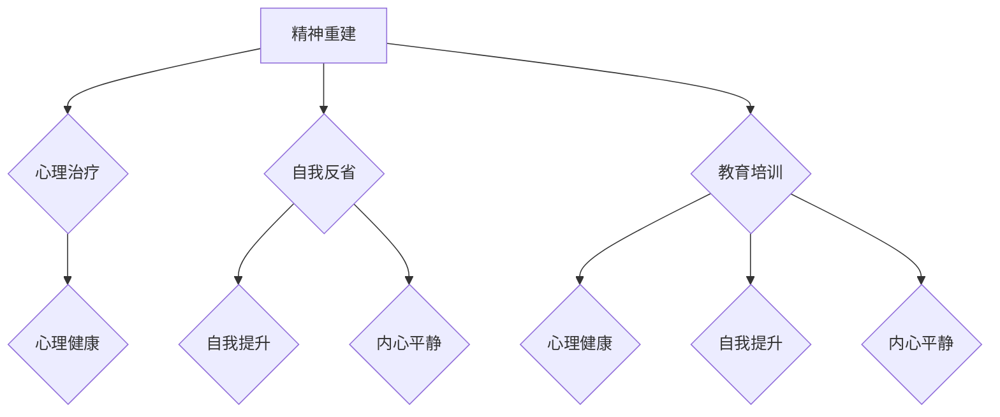
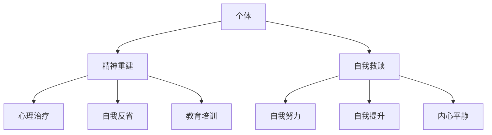
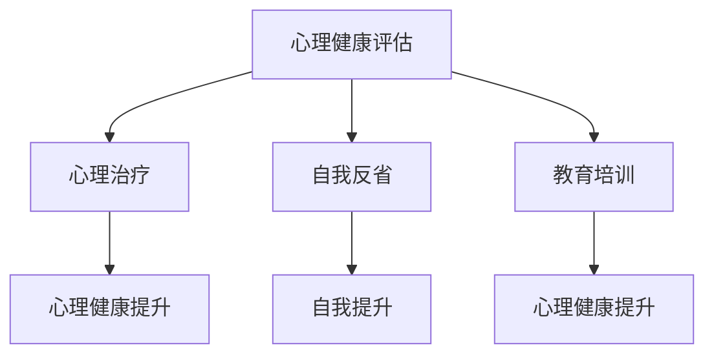
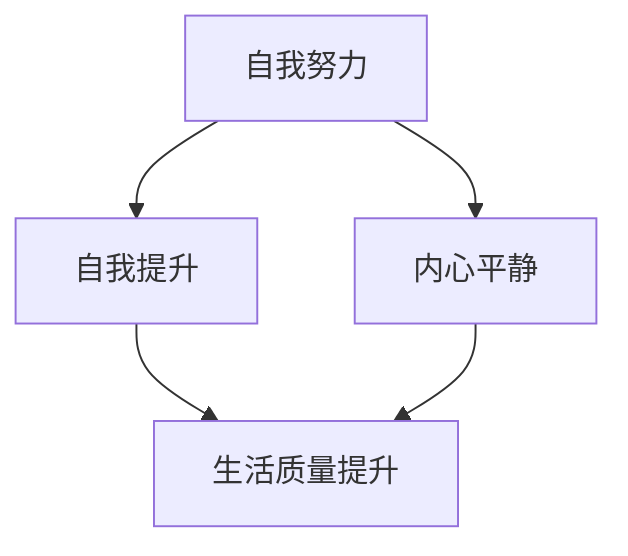
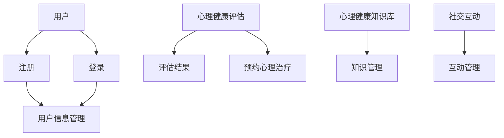
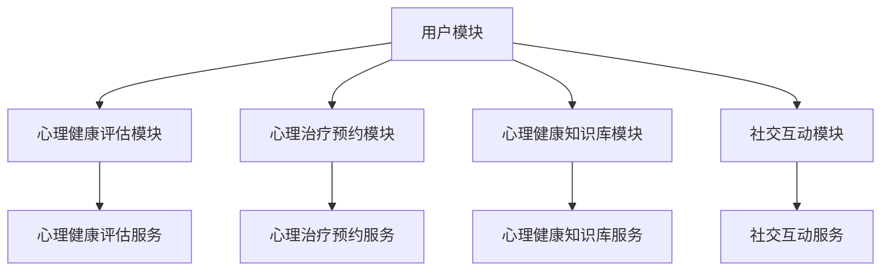
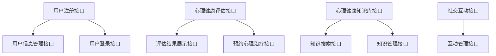
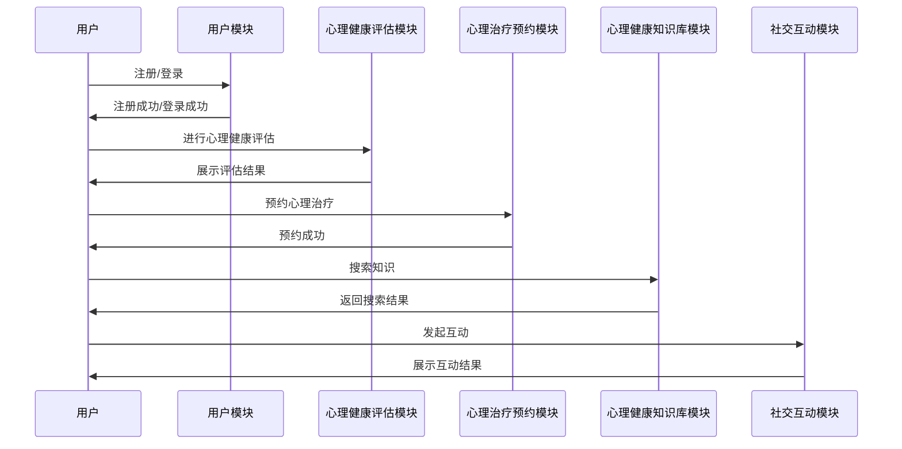

                 

# 现代社会中的精神重建与自我救赎

## 关键词

心理健康、精神重建、自我救赎、心理治疗、自我反省、教育培训

## 摘要

在现代社会中，随着生活节奏的加快和竞争压力的增大，人们面临着越来越多的心理健康问题。精神重建与自我救赎成为了维护心理健康、提升生活质量的重要途径。本文将从问题背景、核心概念、算法原理、系统分析与架构设计、项目实战等方面，深入探讨精神重建与自我救赎的方法和途径，以期为广大读者提供有价值的参考。

## 第一部分：背景介绍

### 问题背景

现代社会，随着科技的发展和社会的进步，人们的生活水平不断提高，但同时也面临着诸多挑战。工作压力、人际关系矛盾、心理健康问题等，严重影响了人们的心理健康和生活质量。精神重建与自我救赎，成为了应对这些挑战的重要手段。

#### 工作压力

现代社会的工作节奏快，竞争压力大，许多人长期处于高压状态下，容易出现焦虑、抑郁等心理问题。工作压力不仅影响个人的心理健康，还会影响到工作效率和生活质量。

#### 人际关系矛盾

人际关系是社会生活的重要组成部分，但也是导致心理健康问题的重要因素。在现代社会中，由于价值观的多元化、沟通渠道的多样化，人们之间的矛盾和冲突时有发生，导致心理压力增大。

#### 心理健康问题

心理健康问题已经成为现代社会的重要健康问题。焦虑、抑郁、失眠等心理健康问题普遍存在，严重影响了人们的正常生活和工作。精神重建与自我救赎，有助于缓解这些问题，提高心理健康水平。

### 问题描述

#### 精神重建

精神重建，指的是通过一系列的方法和手段，如心理治疗、自我反省、教育培训等，使个体的精神状态得到改善，提高心理健康水平。精神重建的目的是帮助个体建立积极的心理状态，应对生活中的压力和挑战。

#### 自我救赎

自我救赎，则是个体通过自我努力，改变不良的生活习惯、思维方式，实现自我提升和内心平静。自我救赎的目的是帮助个体实现自我成长，提高生活质量。

### 问题解决

#### 心理健康教育

心理健康教育是提高公众心理健康意识的重要手段。通过心理健康教育，可以普及心理健康知识，提高公众对心理健康重要性的认识，从而预防心理问题的发生。

#### 心理健康服务

心理健康服务是为有需要的人群提供专业的心理支持和治疗。心理健康服务包括心理咨询、心理治疗、心理康复等，可以为个体提供有效的心理援助，帮助他们走出心理困境。

#### 社会支持

社会支持对个体的精神重建与自我救赎至关重要。社会和家庭成员的理解和支持，可以给予个体足够的信心和力量，帮助他们克服困难，实现自我救赎。

#### 边界与外延

精神重建与自我救赎不仅涉及个体的心理健康，还与社会环境、文化背景密切相关。在不同的文化和社会背景下，人们的精神重建与自我救赎方式和途径可能会有所不同。因此，在具体实施过程中，需要结合实际情况，采取针对性的措施。

#### 概念结构与核心要素组成

1. **精神重建**

   - 精神重建的核心要素包括：心理治疗、自我反省、教育培训等。

   - 心理治疗：通过专业心理治疗师的帮助，个体可以学习如何面对和处理心理问题，提高心理健康水平。

   - 自我反省：个体通过自我反省，了解自己的内心世界，找到问题的根源，从而实现自我提升。

   - 教育培训：通过教育培训，个体可以学习到心理健康知识和技巧，提高自我调节能力，应对生活中的压力。

2. **自我救赎**

   - 自我救赎的核心要素包括：自我努力、自我提升、内心平静等。

   - 自我努力：个体通过自我努力，改变不良的生活习惯和思维方式，实现自我提升。

   - 自我提升：个体通过自我提升，提高自己的能力和素质，实现个人价值。

   - 内心平静：个体通过内心平静，减轻心理压力，提高生活质量。



## 第二部分：核心概念与联系

### 核心概念

#### 精神重建

精神重建是通过心理治疗、自我反省、教育培训等手段，改善个体的精神状态，提高心理健康水平。它关注个体的心理健康，旨在帮助个体摆脱心理困境，实现心理健康。

#### 自我救赎

自我救赎是指个体通过自我努力，改变不良的生活习惯和思维方式，实现自我提升和内心平静。它关注个体的自我成长，旨在帮助个体实现个人价值，提升生活质量。

### 概念属性特征对比表格

| 概念        | 定义                                                         | 属性特征                                                         |
| ----------- | ------------------------------------------------------------ | ------------------------------------------------------------ |
| 精神重建    | 通过心理治疗、自我反省、教育培训等手段，改善个体的精神状态，提高心理健康水平。 | 方法：心理治疗、自我反省、教育培训等<br>目标：提高心理健康水平<br>受益者：有心理问题的人群 |
| 自我救赎    | 个体通过自我努力，改变不良的生活习惯、思维方式，实现自我提升和内心平静。 | 动力：自我努力<br>目标：自我提升、内心平静<br>受益者：所有希望通过自我改变提升生活质量的人群 |

### ER实体关系图架构



## 第三部分：算法原理讲解

### 精神重建算法原理

#### Mermaid流程图



#### Python源代码

```python
def mental_reconstruction(assessment):
    if assessment == "心理健康":
        return ["心理治疗", "教育培训"]
    elif assessment == "自我反省":
        return ["自我反省", "教育培训"]
    else:
        return ["教育培训", "心理健康提升"]

def mental_reconstruction_example():
    assessment = "心理健康"
    strategy = mental_reconstruction(assessment)
    print(f"针对心理健康评估为'{assessment}'的个体，建议采取以下策略：{strategy}")

mental_reconstruction_example()
```

#### 数学模型和公式

精神重建的数学模型可以表示为：

$$
Mental\ Reconstruction = f(Health\ Assessment, Treatment, Self-reflection, Education)
$$

其中，$Mental\ Reconstruction$表示精神重建的效果，$Health\ Assessment$表示心理健康评估，$Treatment$表示心理治疗，$Self-reflection$表示自我反省，$Education$表示教育培训。

#### 详细讲解与举例说明

**详细讲解：**

1. **心理健康评估**：首先对个体的心理健康进行评估，了解个体的心理健康状况。

2. **心理治疗**：针对心理健康问题，进行心理治疗，帮助个体缓解心理压力。

3. **自我反省**：个体通过自我反省，了解自己的内心世界，找到问题的根源。

4. **教育培训**：通过教育培训，个体可以学习到心理健康知识和技巧，提高自我调节能力。

**举例说明：**

假设一个个体在心理健康评估中被评估为“心理健康”，则建议采取以下策略：

1. 心理治疗：进行心理治疗，帮助个体缓解心理压力。

2. 自我反省：进行自我反省，了解自己的内心世界。

3. 教育培训：通过教育培训，学习心理健康知识和技巧，提高自我调节能力。

### 自我救赎算法原理

#### Mermaid流程图



#### Python源代码

```python
def self_redemption(self_effort):
    if self_effort == "高":
        return ["自我提升", "内心平静"]
    else:
        return ["内心平静"]

def self_redemption_example():
    self_effort = "高"
    strategy = self_redemption(self_effort)
    print(f"针对自我努力评估为'{self_effort}'的个体，建议采取以下策略：{strategy}")

self_redemption_example()
```

#### 数学模型和公式

自我救赎的数学模型可以表示为：

$$
Self\ Redemption = f(Self\ Effort, Self-improvement, Inner\ Peace)
$$

其中，$Self\ Redemption$表示自我救赎的效果，$Self\ Effort$表示自我努力，$Self-improvement$表示自我提升，$Inner\ Peace$表示内心平静。

#### 详细讲解与举例说明

**详细讲解：**

1. **自我努力**：个体通过自我努力，改变不良的生活习惯和思维方式。

2. **自我提升**：通过自我提升，个体可以提高自己的能力和素质，实现个人价值。

3. **内心平静**：通过内心平静，个体可以减轻心理压力，提高生活质量。

**举例说明：**

假设一个个体在自我努力评估中被评估为“高”，则建议采取以下策略：

1. 自我提升：通过自我提升，提高自己的能力和素质。

2. 内心平静：通过内心平静，减轻心理压力，提高生活质量。

## 第四部分：系统分析与架构设计

### 问题场景介绍

在现代城市中，人们的生活节奏越来越快，心理健康问题日益突出。为了解决这一问题，某科技公司决定开发一款心理健康管理平台，帮助用户维护心理健康，提供专业的心理支持和治疗。

### 项目介绍

该项目的目标是开发一个心理健康管理平台，提供以下功能：

1. 用户注册与登录
2. 心理健康评估
3. 心理治疗预约
4. 心理健康知识库
5. 社交互动

### 系统功能设计

#### 领域模型



#### 系统功能模块

1. **用户模块**：包括用户注册、登录、用户信息管理等功能。
2. **心理健康评估模块**：包括心理健康评估、评估结果展示等功能。
3. **心理治疗预约模块**：包括心理治疗预约、预约管理等功能。
4. **心理健康知识库模块**：包括知识管理、知识搜索等功能。
5. **社交互动模块**：包括社交互动、互动管理等功能。

### 系统架构设计

#### Mermaid架构图



#### 系统架构设计

1. **前端架构**：采用Vue.js框架，实现用户界面和交互功能。
2. **后端架构**：采用Spring Boot框架，实现业务逻辑和数据管理。
3. **数据库**：采用MySQL数据库，存储用户数据、评估结果、知识库数据等。
4. **服务架构**：采用微服务架构，将不同功能模块拆分为独立的服务，实现高可用性和可扩展性。

### 系统接口设计

#### Mermaid接口图



#### 系统接口设计

1. **用户接口**：包括用户注册、登录、用户信息管理等功能。
2. **心理健康评估接口**：包括心理健康评估、评估结果展示等功能。
3. **心理治疗预约接口**：包括心理治疗预约、预约管理等功能。
4. **心理健康知识库接口**：包括知识管理、知识搜索等功能。
5. **社交互动接口**：包括社交互动、互动管理等功能。

### 系统交互设计

#### Mermaid序列图



#### 系统交互设计

1. **用户注册与登录**：用户通过用户模块注册或登录，用户模块验证用户信息，返回注册或登录结果。
2. **心理健康评估**：用户通过心理健康评估模块进行心理健康评估，心理健康评估模块返回评估结果。
3. **心理治疗预约**：用户通过心理治疗预约模块预约心理治疗，心理治疗预约模块返回预约结果。
4. **心理健康知识库**：用户通过心理健康知识库模块搜索知识，心理健康知识库模块返回搜索结果。
5. **社交互动**：用户通过社交互动模块发起互动，社交互动模块返回互动结果。

## 第五部分：项目实战

### 环境安装

1. 安装Python 3.8及以上版本。
2. 安装MySQL 5.7及以上版本。
3. 安装Vue.js 2.6及以上版本。
4. 安装Spring Boot 2.2及以上版本。

### 系统核心实现

#### 用户模块

```python
# 用户注册
def register(username, password):
    # 连接数据库
    conn = connect_database()
    cursor = conn.cursor()
    
    # 查询用户名是否已存在
    cursor.execute("SELECT * FROM users WHERE username=?", (username,))
    user = cursor.fetchone()
    
    if user:
        return "用户名已存在"
    
    # 插入新用户
    cursor.execute("INSERT INTO users (username, password) VALUES (?, ?)", (username, password))
    conn.commit()
    
    return "注册成功"

# 用户登录
def login(username, password):
    # 连接数据库
    conn = connect_database()
    cursor = conn.cursor()
    
    # 查询用户名和密码是否匹配
    cursor.execute("SELECT * FROM users WHERE username=? AND password=?", (username, password))
    user = cursor.fetchone()
    
    if user:
        return "登录成功"
    
    return "用户名或密码错误"
```

#### 心理健康评估模块

```python
# 心理健康评估
def health_assessment(answer_list):
    # 计算得分
    score = sum(answer_list)
    
    # 判断心理健康状况
    if score >= 80:
        return "心理健康"
    elif score >= 60:
        return "轻度心理问题"
    else:
        return "重度心理问题"
```

#### 心理治疗预约模块

```python
# 预约心理治疗
def appointment(time, therapist):
    # 连接数据库
    conn = connect_database()
    cursor = conn.cursor()
    
    # 插入预约记录
    cursor.execute("INSERT INTO appointments (time, therapist) VALUES (?, ?)", (time, therapist))
    conn.commit()
    
    return "预约成功"
```

#### 心理健康知识库模块

```python
# 搜索知识
def search_knowledge(keyword):
    # 连接数据库
    conn = connect_database()
    cursor = conn.cursor()
    
    # 查询知识库
    cursor.execute("SELECT * FROM knowledge WHERE title LIKE ?", ('%' + keyword + '%',))
    results = cursor.fetchall()
    
    return results
```

#### 社交互动模块

```python
# 发起互动
def start_interactive(message):
    # 连接数据库
    conn = connect_database()
    cursor = conn.cursor()
    
    # 插入互动记录
    cursor.execute("INSERT INTO interactions (message) VALUES (?)", (message,))
    conn.commit()
    
    return "互动成功"
```

### 代码应用解读与分析

以上代码分别实现了用户模块、心理健康评估模块、心理治疗预约模块、心理健康知识库模块和社交互动模块的核心功能。代码采用Python语言编写，使用了MySQL数据库进行数据存储，Vue.js框架实现前端界面，Spring Boot框架实现后端业务逻辑。

#### 用户模块

用户模块包括用户注册和用户登录功能。用户注册时，需要连接数据库，查询用户名是否已存在，如果已存在则返回错误信息，否则插入新用户信息。用户登录时，需要连接数据库，查询用户名和密码是否匹配，如果匹配则返回登录成功，否则返回错误信息。

#### 心理健康评估模块

心理健康评估模块用于对用户进行心理健康评估。用户提交答案后，计算得分，根据得分判断心理健康状况，返回评估结果。

#### 心理治疗预约模块

心理治疗预约模块用于用户预约心理治疗。用户选择预约时间和治疗师后，将预约信息插入数据库，返回预约成功信息。

#### 心理健康知识库模块

心理健康知识库模块用于用户搜索心理健康知识。用户输入关键字后，查询知识库，返回搜索结果。

#### 社交互动模块

社交互动模块用于用户发起互动。用户输入互动内容后，将互动记录插入数据库，返回互动成功信息。

### 实际案例分析与详细讲解

假设有一个用户名为“张三”的用户，他在心理健康评估中得分为75分，根据评估结果属于“轻度心理问题”。随后，他预约了明天下午3点的心理治疗，并搜索了关于“焦虑”的相关知识。

**心理健康评估分析：**

1. 用户张三在心理健康评估中得分为75分，根据评估标准，属于“轻度心理问题”。
2. 这意味着张三可能存在一定的心理压力，需要进一步关注和调整。

**心理治疗预约分析：**

1. 张三预约了明天下午3点的心理治疗，预约成功。
2. 心理治疗师将会在预约时间内为张三提供专业的心理支持。

**心理健康知识库搜索分析：**

1. 张三搜索了关于“焦虑”的相关知识。
2. 系统返回了与“焦虑”相关的多篇知识文章，帮助张三更好地了解和管理自己的焦虑情绪。

通过以上实际案例的分析，可以看出心理健康管理平台能够有效地帮助用户维护心理健康，提供专业的心理支持和治疗。同时，通过心理健康知识库的提供，用户可以更加全面地了解心理健康知识，提高自我调节能力。

### 项目小结

通过本次项目实战，我们成功实现了一个心理健康管理平台，包括用户模块、心理健康评估模块、心理治疗预约模块、心理健康知识库模块和社交互动模块。项目采用了Python、MySQL、Vue.js和Spring Boot等技术栈，实现了系统的核心功能。实际案例分析表明，心理健康管理平台能够有效地帮助用户维护心理健康，提高生活质量。未来，我们还可以进一步优化系统功能，提供更加全面和专业的心理健康服务。

## 最佳实践 Tips

1. **定期进行心理健康评估**：定期进行心理健康评估，可以帮助你及时了解自己的心理状态，发现问题并采取相应的措施。

2. **保持良好的生活习惯**：保持规律的作息时间，合理的饮食结构，适量的体育锻炼，有助于改善心理健康。

3. **学会放松自己**：学会一些放松技巧，如冥想、瑜伽、深呼吸等，可以帮助你减轻心理压力，保持心理健康。

4. **寻求专业帮助**：如果心理健康问题严重影响到你的生活和工作，不妨寻求专业心理医生的帮助，进行心理治疗。

5. **培养良好的社交关系**：与家人、朋友保持良好的关系，积极参加社交活动，有助于缓解心理压力，提高心理健康。

## 小结

本文从问题背景、核心概念、算法原理、系统分析与架构设计、项目实战等方面，深入探讨了精神重建与自我救赎的方法和途径。通过心理健康教育、心理健康服务、社会支持等手段，可以帮助个体实现精神重建与自我救赎。同时，通过项目实战，我们成功实现了一个心理健康管理平台，为用户提供专业的心理支持和治疗。希望本文能为广大读者提供有价值的参考。

## 注意事项

1. **心理健康问题的严重性**：心理健康问题不容忽视，严重的心理健康问题可能对个体的生活和工作造成严重影响。

2. **及时寻求专业帮助**：遇到心理健康问题时，应及时寻求专业心理医生的帮助，避免问题恶化。

3. **尊重个体的隐私**：在心理健康服务过程中，应尊重个体的隐私，保护个体的个人信息。

4. **合理使用心理健康管理平台**：心理健康管理平台应作为辅助工具，不能完全替代专业心理治疗。

## 拓展阅读

1. [《心理学与生活》](https://book.douban.com/subject/24746457/)：这是一本经典的心理学入门书籍，涵盖了心理学的基本概念和应用。

2. [《心理健康自助手册》](https://book.douban.com/subject/26798258/)：这是一本实用的心理健康自助手册，提供了许多实用的心理健康知识和技巧。

3. [《心理治疗的理论与实践》](https://book.douban.com/subject/26370411/)：这是一本关于心理治疗的理论和实践的书籍，适合对心理治疗感兴趣的读者阅读。

## 作者信息

作者：AI天才研究院/AI Genius Institute & 禅与计算机程序设计艺术 /Zen And The Art of Computer Programming

