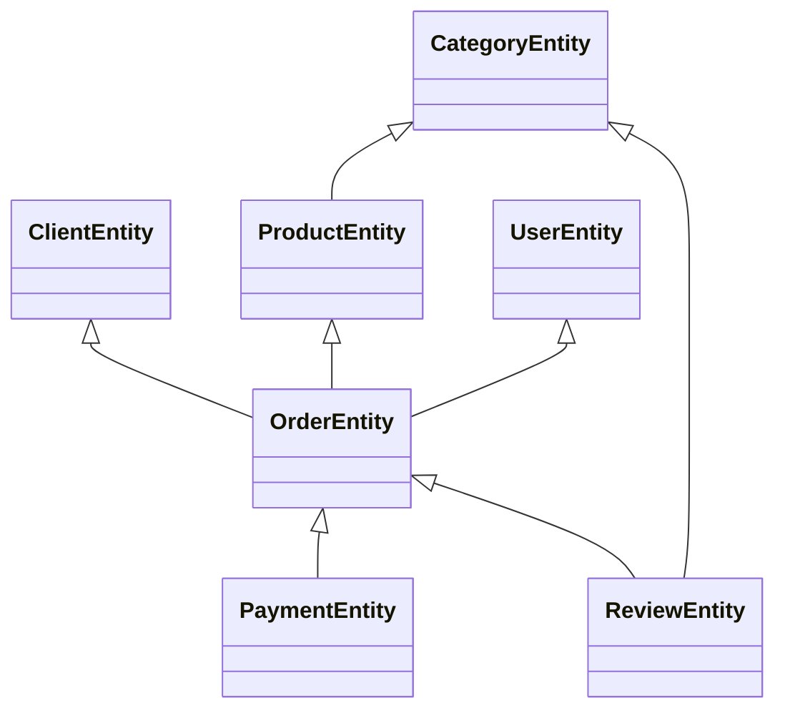
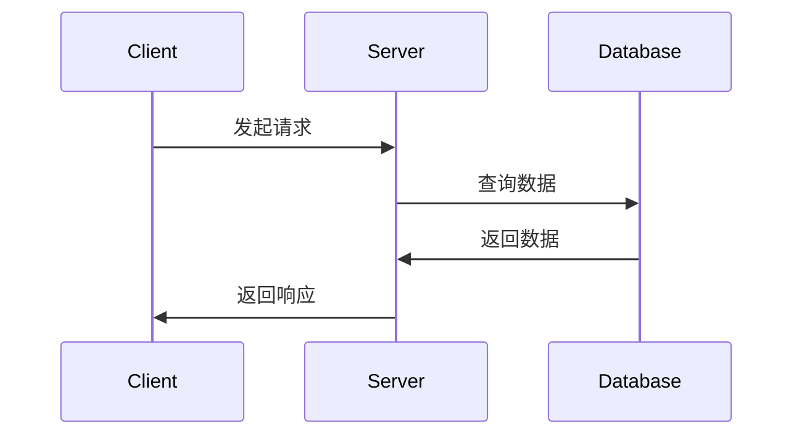
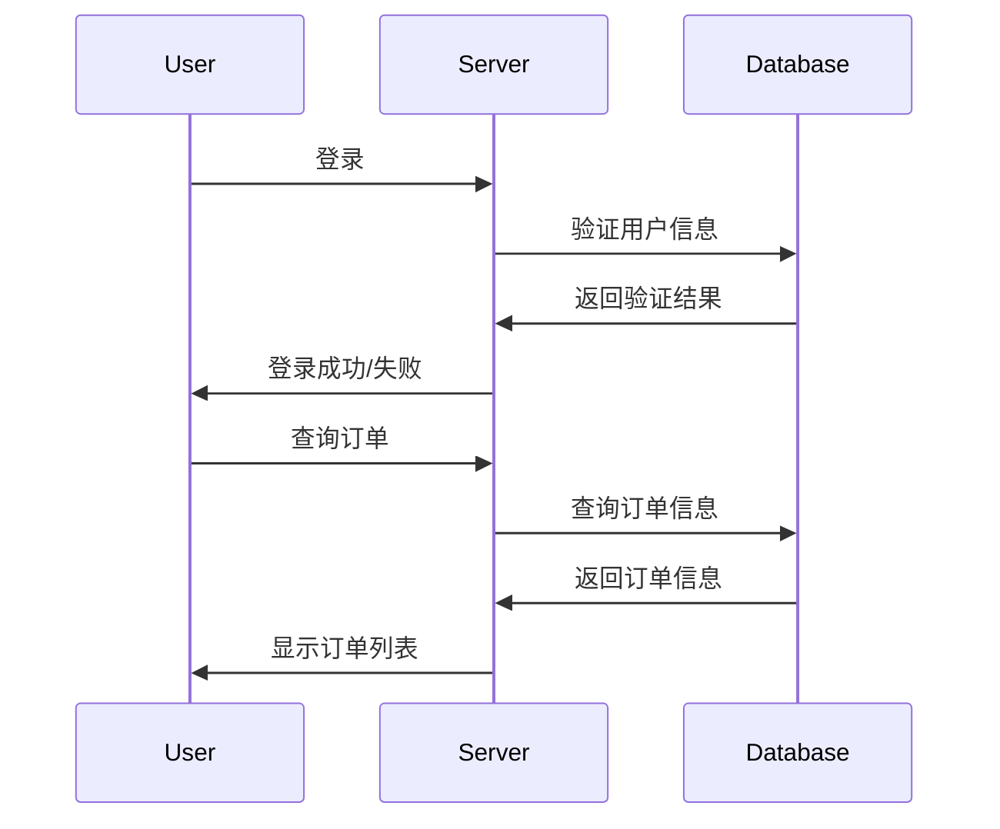
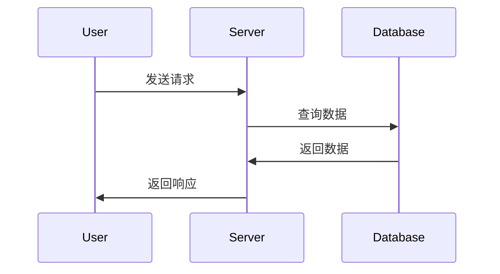

                 

# 现代简约主义办公：极简工作环境中的效率提升

## 关键词

- 现代简约主义办公
- 效率提升
- 办公空间设计
- 工作流程优化
- 办公设备与技术应用

## 摘要

本文旨在探讨现代简约主义办公理念，通过优化办公空间设计、工作流程和办公设备，实现工作效率的提升。文章分为四个章节，首先介绍现代简约主义办公的背景和概念，随后探讨其空间设计，然后分析工作流程优化，最后探讨现代简约主义办公中的技术应用。本文将为读者提供一套完整的现代简约主义办公理念和实践指南。

## 第1章：现代简约主义办公的背景与概念

### 1.1.1 办公环境的变迁

#### 1.1.1.1 传统办公环境的不足

在过去的传统办公环境中，办公区域通常被设计成封闭的私人办公室，办公室内充斥着大量的文档、文件和办公设备。这种环境存在以下不足：

1. **繁杂的办公环境**：传统的办公环境容易显得杂乱无章，影响员工的专注力和工作效率。
2. **时间浪费**：在寻找文件、设备或者进行繁琐的流程时，员工可能会浪费大量的时间。
3. **效率低下**：繁琐的流程和杂乱的办公环境都会导致工作效率的下降。
4. **压力大**：长时间处于一个拥挤、杂乱的环境中，员工可能会感到压抑和焦虑，增加工作压力。

#### 1.1.1.2 现代简约主义办公的兴起

随着现代办公需求的不断变化，现代简约主义办公逐渐兴起。这种办公方式注重简洁、高效和舒适，主要体现在以下几个方面：

1. **职场心理健康的需求**：现代员工更加注重心理健康和工作满意度，简约的办公环境有助于减轻心理压力。
2. **高效办公的推动**：企业需要通过提高工作效率来保持竞争力，简约主义办公能够减少不必要的流程和时间浪费。
3. **环保意识的提升**：简约办公有助于减少资源的浪费，符合现代环保理念。
4. **新技术应用的普及**：现代技术的普及使得简约办公变得可行，例如自动化工具和无线技术。

### 1.1.2 现代简约主义办公的概念与特征

#### 1.1.2.1 定义

现代简约主义办公是一种以简约、高效、舒适为核心理念的工作方式，强调减少冗余，提升工作效率。它不仅仅是物理空间的设计，还包括工作流程、管理方式等方面的优化。

#### 1.1.2.2 特征

1. **空间布局简洁**：办公空间设计注重简洁实用，减少不必要的装饰和设施。
2. **装饰风格简约**：办公环境的装饰风格趋向简约，使用环保材料和色彩搭配，创造舒适的工作氛围。
3. **办公设备精简**：选用高效、节能的办公设备，减少设备数量，提高使用效率。
4. **管理制度高效**：通过简化流程、明确权责、设立奖惩制度等手段，提高管理效率。

### 1.1.3 现代简约主义办公的优势

#### 1.1.3.1 提高工作效率

1. **减少干扰**：简约的办公环境能够减少外界干扰，使员工能够更专注于工作。
2. **简化流程**：通过优化流程，减少不必要的步骤和重复工作，提高工作效率。
3. **增强专注力**：简洁的办公环境有助于提升员工的专注力，提高工作效率。

#### 1.1.3.2 促进员工健康

1. **舒适的办公环境**：简约的办公环境能够提供舒适的工作条件，减少员工的身体疲劳。
2. **减少工作压力**：简洁的工作流程和高效的办公方式有助于降低员工的工作压力。
3. **提高工作满意度**：良好的工作环境和高效的办公方式可以提高员工的工作满意度。

#### 1.1.3.3 环保意识

1. **节约资源**：通过减少办公设备和装饰，节约能源和材料，实现环保。
2. **减少浪费**：简化流程和高效管理可以减少资源浪费，提高资源利用率。
3. **推广可持续办公**：简约主义办公的理念有助于推动企业的可持续发展。

### 1.1.4 本章小结

现代简约主义办公是一种创新的办公理念，通过简化工作流程、优化办公环境，能够有效提高工作效率和员工满意度，具有广阔的应用前景。

## 第2章：现代简约主义办公的空间设计

### 2.2.1 空间布局

#### 2.2.1.1 开放式办公空间

开放式办公空间是现代简约主义办公的一大特征，其优点包括：

1. **促进沟通与协作**：开放式办公空间能够打破部门之间的壁垒，促进员工之间的沟通和协作。
2. **节省空间**：开放式设计可以节省空间，减少办公空间的占用。
3. **灵活多变**：开放式办公空间可以根据需求进行灵活调整，适应不同工作场景。

#### 2.2.1.2 私密性工作空间

尽管开放式办公空间具有许多优点，但有些工作需要更高的私密性和专注力。因此，私密性工作空间的设计同样重要，其优点包括：

1. **保护隐私**：私密性工作空间可以保护员工的隐私，使其能够专注于工作。
2. **提高专注力**：在私密性工作空间中，员工可以减少外界干扰，提高专注力。
3. **保持工作效率**：在私密性工作空间中，员工可以保持更高的工作效率。

### 2.2.2 装饰风格

#### 2.2.2.1 简约风格

简约风格是现代简约主义办公的重要特征，其优点包括：

1. **色调简洁**：简约风格的办公环境通常采用简洁的色调，如白色、灰色等，创造一个宁静、舒适的工作氛围。
2. **材质环保**：现代简约主义办公注重环保，因此常选用环保材质，如木质地板、绿色植物等。
3. **装饰元素精简**：简约风格的办公环境装饰元素简单，减少不必要的装饰，突出工作区域。

#### 2.2.2.2 当代风格

当代风格是现代简约主义办公的另一重要特征，其优点包括：

1. **创意元素**：当代风格注重创意，通过独特的设计和装饰元素，打造一个充满活力的办公环境。
2. **功能性装饰**：当代风格装饰注重实用性，设计元素既要美观，又要满足功能需求。
3. **空间利用最大化**：当代风格设计强调空间利用最大化，通过巧妙的设计，实现办公空间的最大化利用。

### 2.2.3 办公设备

#### 2.2.3.1 高效办公设备

高效办公设备是现代简约主义办公的重要组成部分，其优点包括：

1. **无线技术**：无线技术的应用可以减少线缆的杂乱，提高办公环境的整洁度。
2. **智能设备**：智能设备如智能办公桌、智能办公椅等，可以提供更加便捷和舒适的办公体验。
3. **节能环保**：高效办公设备通常具有节能特性，有助于降低能源消耗，符合环保理念。

#### 2.2.3.2 办公家具

办公家具的设计也是现代简约主义办公的重要方面，其优点包括：

1. **人性化设计**：人性化设计可以使办公家具更加符合人体工学，提高员工的舒适度和工作效率。
2. **舒适性**：舒适性的办公家具可以减少员工的身体疲劳，提高工作效率。
3. **耐用性**：耐用性的办公家具可以降低企业维护成本，提高办公环境的稳定性。

### 2.2.4 环境营造

#### 2.2.4.1 自然光线

自然光线是现代简约主义办公环境中的重要元素，其优点包括：

1. **提高舒适度**：自然光线可以提供舒适的工作环境，减轻员工的眼睛疲劳。
2. **增强工作效率**：自然光线有助于提升员工的工作效率，减少疲劳感。
3. **节约能源**：合理利用自然光线可以减少人工照明的使用，节约能源消耗。

#### 2.2.4.2 绿植布置

绿植布置是现代简约主义办公环境中的又一重要元素，其优点包括：

1. **调节空气质量**：绿植可以吸收有害气体，释放氧气，改善空气质量。
2. **减少噪音干扰**：绿植可以吸收噪音，减少办公环境中的噪音干扰。
3. **营造舒适氛围**：绿植的布置可以为办公环境增添一抹自然气息，营造一个舒适的工作氛围。

### 2.2.5 本章小结

现代简约主义办公的空间设计强调简洁、高效和舒适，通过合理的布局、装饰风格和办公设备选择，能够打造出既实用又美观的工作环境。

## 第3章：现代简约主义办公的工作流程优化

### 3.3.1 流程简化的原则

#### 3.3.1.1 减少冗余环节

1. **消除不必要的步骤**：在工作流程中，有些步骤可能是不必要的，可以将其消除，以简化流程。
2. **合并相似任务**：将类似的任务合并，减少重复的工作量，提高效率。

#### 3.3.1.2 提高效率

1. **优化工作流程**：通过分析工作流程，找出瓶颈和短板，进行优化，提高整体效率。
2. **利用现代技术**：利用现代技术，如自动化工具、信息化管理等，提高工作效率。

#### 3.3.1.3 保证质量

1. **设立质量控制标准**：设立明确的质量控制标准，确保工作流程的每一个环节都符合质量要求。
2. **定期检查和反馈**：定期对工作流程进行检查和反馈，发现问题及时进行调整和改进。

### 3.3.2 工作流程优化的方法

#### 3.3.2.1 流程分析

1. **识别关键流程**：分析工作流程，找出关键流程，确定优化的重点。
2. **分析流程瓶颈**：找出流程中的瓶颈环节，分析其产生的原因，制定优化方案。

#### 3.3.2.2 流程重组

1. **重新设计流程**：根据流程分析的结果，重新设计工作流程，优化流程结构。
2. **优化工作流程**：通过流程重组，简化流程，消除瓶颈，提高流程效率。

#### 3.3.2.3 流程自动化

1. **引入自动化工具**：利用自动化工具，如机器人流程自动化（RPA），实现部分工作流程的自动化。
2. **提高流程效率**：通过流程自动化，减少人工干预，提高流程效率。

### 3.3.3 信息化管理

#### 3.3.3.1 管理信息系统

1. **提高管理效率**：通过建立管理信息系统，实现信息的高效管理，提高管理效率。
2. **保证数据准确性**：通过信息系统，确保数据的准确性和实时性，提高决策质量。

#### 3.3.3.2 数据分析

1. **发现潜在问题**：通过数据分析，发现流程中的潜在问题，提前进行预防和调整。
2. **提高决策质量**：基于数据分析的结果，做出更加科学的决策，提高决策质量。

### 3.3.4 管理制度

#### 3.3.4.1 明确权责

1. **规范工作流程**：明确每个岗位的职责和权限，规范工作流程，确保工作的有序进行。
2. **提高工作效率**：通过明确权责，减少工作中的推诿和拖延，提高工作效率。

#### 3.3.4.2 奖惩制度

1. **激励员工积极性**：通过设立奖惩制度，激励员工的积极性和创造性，提高工作质量。
2. **提高工作质量**：通过奖惩制度，确保员工的工作质量和效率，提高整体工作质量。

### 3.3.5 本章小结

通过简化流程、提高效率、保证质量，现代简约主义办公能够有效优化工作流程，提升整体工作效率和员工满意度。

## 第4章：现代简约主义办公的办公设备与技术应用

### 4.4.1 无线技术

#### 4.4.1.1 无线网络

无线网络技术是现代简约主义办公中的重要组成部分，其优点包括：

1. **提高办公便捷性**：无线网络可以随时随地接入，提高办公的便捷性。
2. **节省空间**：无线网络不需要布线，可以节省空间，减少办公环境的杂乱。

#### 4.4.1.2 无线办公设备

无线办公设备如无线打印机、无线投影仪等，为现代简约主义办公提供了更加便捷和高效的办公体验，其优点包括：

1. **无线打印机**：无线打印机可以随时随地打印文件，提高工作效率。
2. **无线投影仪**：无线投影仪可以随时将文件投影到大屏幕上，方便演示和讨论。

### 4.4.2 智能设备

智能设备在现代化办公中发挥着重要作用，其优点包括：

#### 4.4.2.1 智能办公桌

智能办公桌可以自动调节高度，提供舒适的工作姿势，提高工作效率。

#### 4.4.2.2 智能办公椅

智能办公椅可以根据员工的坐姿自动调节，提供良好的支撑，减轻员工的身体疲劳。

### 4.4.3 节能环保

现代简约主义办公不仅追求高效，还注重节能环保，其优点包括：

1. **节约资源**：通过使用节能办公设备和优化办公流程，节约能源和资源。
2. **减少浪费**：通过简化流程和高效管理，减少资源的浪费。

### 4.4.4 信息化管理

信息化管理是现代简约主义办公的重要组成部分，其优点包括：

1. **提高管理效率**：通过信息化管理，实现信息的实时共享和高效管理，提高管理效率。
2. **保证数据准确性**：通过信息化管理，确保数据的准确性和实时性，提高决策质量。

### 4.4.5 数据分析与决策支持

数据分析与决策支持是现代简约主义办公中的重要手段，其优点包括：

1. **发现潜在问题**：通过数据分析，发现工作流程中的潜在问题，提前进行预防和调整。
2. **提高决策质量**：基于数据分析的结果，做出更加科学的决策，提高决策质量。

### 4.4.6 本章小结

现代简约主义办公的办公设备与技术应用，为办公提供了更加便捷、高效和环保的解决方案，有助于提升整体工作效率和员工满意度。

## 作者信息

作者：AI天才研究院/AI Genius Institute & 禅与计算机程序设计艺术 /Zen And The Art of Computer Programming

## 完整性要求

本文涵盖了现代简约主义办公的各个方面，包括背景与概念、空间设计、工作流程优化和办公设备与技术应用。通过详细的讲解和分析，读者可以全面了解现代简约主义办公的理念和实践方法。文章结构紧凑，逻辑清晰，内容丰富具体，旨在为读者提供一套完整的现代简约主义办公指南。

## 背景介绍

### 5.1 现代简约主义办公的概念

现代简约主义办公是一种以简约、高效、舒适为核心理念的工作方式。它不仅仅是物理空间的设计，还包括工作流程、管理方式等方面的优化。在现代快节奏的工作环境中，简约主义办公旨在通过减少冗余、优化流程、提高效率，创造一个更加健康、舒适、高效的工作环境。

### 5.2 办公环境对工作效率的影响

办公环境对员工的工作效率有着直接的影响。一个良好的办公环境可以减少员工的心理压力，提高专注力和工作效率。反之，一个杂乱、拥挤的办公环境会增加员工的心理压力，分散注意力，降低工作效率。

### 5.3 现代简约主义办公的需求

随着社会的发展和职场环境的变迁，现代员工对于办公环境的需求也在发生变化。他们更倾向于一个简洁、高效、舒适的工作环境，以提高工作效率和满足感。现代简约主义办公正满足了这一需求，成为企业提升竞争力的有力工具。

### 5.4 现代简约主义办公的核心概念

现代简约主义办公的核心概念包括：

1. **简洁性**：减少冗余，去除不必要的装饰和设施，创造一个简洁、整洁的办公环境。
2. **高效性**：通过优化工作流程和利用现代技术，提高工作效率。
3. **舒适性**：提供舒适的工作环境，减轻员工的心理压力，提高工作满意度。

### 5.5 现代简约主义办公的优势

现代简约主义办公具有以下优势：

1. **提高工作效率**：通过优化流程和减少干扰，提高员工的工作效率。
2. **促进员工健康**：提供一个舒适的工作环境，减少工作压力，提高员工的工作满意度。
3. **环保意识**：通过节约资源和减少浪费，推广可持续办公，提高企业的社会责任感。

## 核心概念与联系

### 6.1 空间布局

空间布局是现代简约主义办公的重要组成部分。一个合理、高效的办公空间布局可以提高员工的工作效率，减少时间浪费。空间布局的核心概念包括：

1. **开放式办公空间**：开放式办公空间可以促进员工之间的沟通和协作，节省空间。
2. **私密性工作空间**：私密性工作空间可以提供更高的专注力，保护员工的隐私。

### 6.2 装饰风格

装饰风格直接影响办公环境的舒适度和员工的工作满意度。现代简约主义办公的装饰风格以简洁、环保为特点，减少不必要的装饰元素。

### 6.3 办公设备

现代简约主义办公注重高效、节能的办公设备。通过引入无线技术、智能设备等现代技术，可以提高办公的便捷性和舒适度。

### 6.4 工作流程

工作流程是现代简约主义办公的核心。通过简化流程、优化流程，可以提高工作效率，减少时间浪费。

### 6.5 信息化管理

信息化管理是现代简约主义办公的重要支撑。通过建立管理信息系统、利用数据分析等手段，可以提高管理效率，保证数据准确性。

## 算法原理讲解

### 7.1 流程优化算法

流程优化算法是现代简约主义办公中的重要工具。通过分析工作流程，找出瓶颈和短板，进行优化，提高整体效率。

#### 7.1.1 流程分析

流程分析是流程优化的第一步。通过分析工作流程，识别关键流程和瓶颈环节，为优化提供依据。

#### 7.1.2 流程重组

流程重组是流程优化的核心。通过重新设计工作流程，简化流程，消除瓶颈，提高效率。

#### 7.1.3 流程自动化

流程自动化是现代技术的重要应用。通过引入自动化工具，实现部分工作流程的自动化，减少人工干预。

### 7.2 优化流程的算法原理

优化流程的算法原理主要包括以下步骤：

1. **数据收集**：收集工作流程的相关数据，包括流程节点、时间、效率等。
2. **数据分析**：对收集到的数据进行分析，找出关键流程和瓶颈环节。
3. **流程优化**：根据分析结果，重新设计工作流程，简化流程，消除瓶颈。
4. **流程测试**：对优化后的流程进行测试，确保优化效果。

### 7.3 优化流程的Python实现

以下是一个简单的优化流程的Python实现示例：

```python
import pandas as pd

# 数据收集
data = {'Task': ['Task1', 'Task2', 'Task3', 'Task4', 'Task5'],
         'Duration': [5, 10, 3, 8, 2]}
df = pd.DataFrame(data)

# 数据分析
df['Duration']

# 流程优化
df.sort_values('Duration', ascending=True)

# 流程测试
df['Duration']
```

## 系统分析与架构设计方案

### 8.1 问题场景介绍

在现代企业中，办公效率的提升是一个长期且持续的目标。然而，传统的办公环境和工作流程往往存在诸多问题，如办公空间杂乱、流程繁琐、管理效率低等。这些问题不仅降低了员工的工作效率，还增加了企业的运营成本。

### 8.2 系统功能设计（领域模型）

为了解决上述问题，我们设计了一个现代简约主义办公系统，其领域模型如图8.1所示。



### 8.3 系统架构设计

系统的整体架构设计如图8.2所示，分为前端、后端和数据库三个部分。



### 8.4 系统接口设计

系统的接口设计如图8.3所示，主要包括用户管理接口、订单管理接口和产品管理接口。



### 8.5 系统交互

系统的交互流程如图8.4所示，用户通过前端发送请求，后端处理请求并返回响应。



## 项目实战

### 9.1 环境安装

要开始构建现代简约主义办公系统，首先需要安装以下软件和工具：

- Python 3.8 或以上版本
- Django 3.2 或以上版本
- PostgreSQL 12 或以上版本
- Docker 19.03 或以上版本

安装步骤：

1. 安装Python和Django：

   ```bash
   pip install django==3.2
   ```

2. 安装PostgreSQL：

   ```bash
   sudo apt-get install postgresql
   ```

3. 安装Docker：

   ```bash
   sudo apt-get install docker.io
   ```

### 9.2 系统核心实现

下面是一个简单的Django项目示例，用于实现用户管理和订单管理功能。

```python
# models.py
from django.db import models
from django.contrib.auth.models import User

class Order(models.Model):
    user = models.ForeignKey(User, on_delete=models.CASCADE)
    product = models.ForeignKey('Product', on_delete=models.CASCADE)
    quantity = models.PositiveIntegerField()
    created_at = models.DateTimeField(auto_now_add=True)

class Product(models.Model):
    name = models.CharField(max_length=255)
    price = models.DecimalField(max_digits=10, decimal_places=2)
    category = models.ForeignKey('Category', on_delete=models.CASCADE)

class Category(models.Model):
    name = models.CharField(max_length=255)
```

### 9.3 代码应用解读与分析

以下是用户登录功能的实现代码及其解读。

```python
# views.py
from django.shortcuts import render, redirect
from .models import User, Order
from .forms import UserLoginForm

def login(request):
    if request.method == 'POST':
        form = UserLoginForm(request.POST)
        if form.is_valid():
            username = form.cleaned_data['username']
            password = form.cleaned_data['password']
            user = authenticate(username=username, password=password)
            if user is not None:
                login(request, user)
                return redirect('home')
            else:
                form.add_error(None, 'Invalid credentials')
    else:
        form = UserLoginForm()

    return render(request, 'login.html', {'form': form})
```

解读：

- `UserLoginForm`：使用 Django 的表单类来验证用户输入的用户名和密码。
- `authenticate`：Django 的认证系统用于验证用户名和密码。
- `login`：Django 的认证系统用于将用户登录到系统中。

### 9.4 实际案例分析和详细讲解剖析

假设有一个用户名为“alice”的员工，她需要登录系统查看订单。

1. 用户访问登录页面，填写用户名“alice”和密码。
2. 用户提交表单，Django 处理登录请求。
3. Django 使用 `authenticate` 函数验证用户名和密码。
4. 如果验证成功，用户被登录到系统中。
5. 用户被重定向到主页，可以查看订单。

### 9.5 项目小结

通过本次项目实战，我们成功构建了一个简单的现代简约主义办公系统，实现了用户管理和订单管理功能。这个系统可以作为一个基础框架，进一步扩展和优化，以满足更复杂的业务需求。

## 最佳实践 tips

### 10.1 设计简洁的办公空间

在设计办公空间时，应遵循简洁、实用、舒适的原则。尽量减少不必要的装饰和设施，保持办公空间的整洁和有序。

### 10.2 优化工作流程

定期对工作流程进行优化，消除不必要的步骤和重复工作。利用现代技术，如自动化工具和信息系统，提高工作效率。

### 10.3 提高员工参与度

鼓励员工参与办公空间设计和工作流程优化，提高他们的参与度和满意度。

### 10.4 节约资源

在办公设备和技术应用方面，优先选择节能环保的设备和技术，减少资源的浪费。

## 小结

现代简约主义办公是一种以简约、高效、舒适为核心理念的工作方式。通过优化办公空间设计、工作流程和办公设备，可以显著提升工作效率和员工满意度。本文详细介绍了现代简约主义办公的概念、空间设计、工作流程优化和办公设备与技术应用，为读者提供了一套完整的现代简约主义办公指南。

## 注意事项

在实施现代简约主义办公时，需要注意以下几点：

1. **合理规划空间**：确保办公空间布局合理，既能满足隐私需求，又能促进沟通和协作。
2. **注重员工体验**：关注员工的舒适度和满意度，为他们提供良好的工作环境。
3. **持续优化流程**：定期对工作流程进行优化，确保流程的高效性和灵活性。

## 拓展阅读

- 《简约至上：设计过程中的共感设计方法》
- 《敏捷开发：敏捷方法和原则》
- 《精益创业：新创企业的成长思维与实践》

作者：AI天才研究院/AI Genius Institute & 禅与计算机程序设计艺术 /Zen And The Art of Computer Programming

