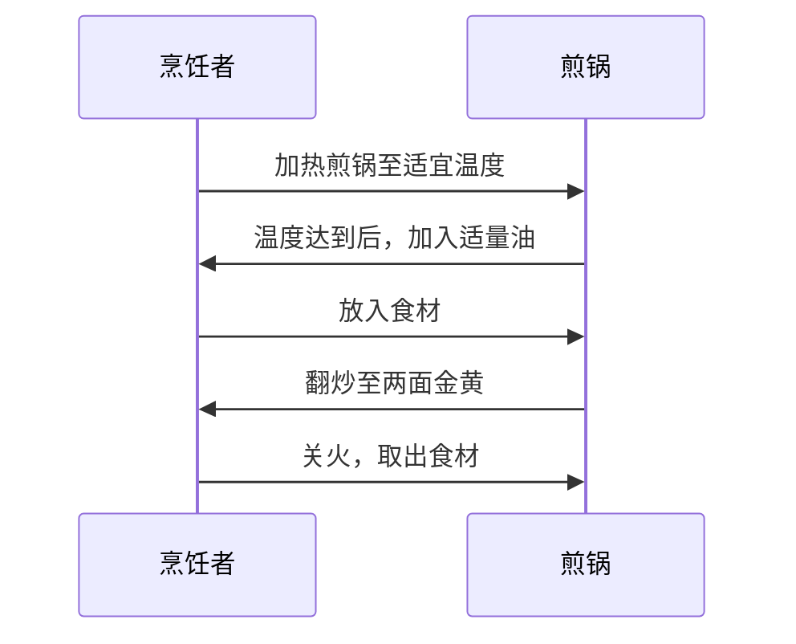
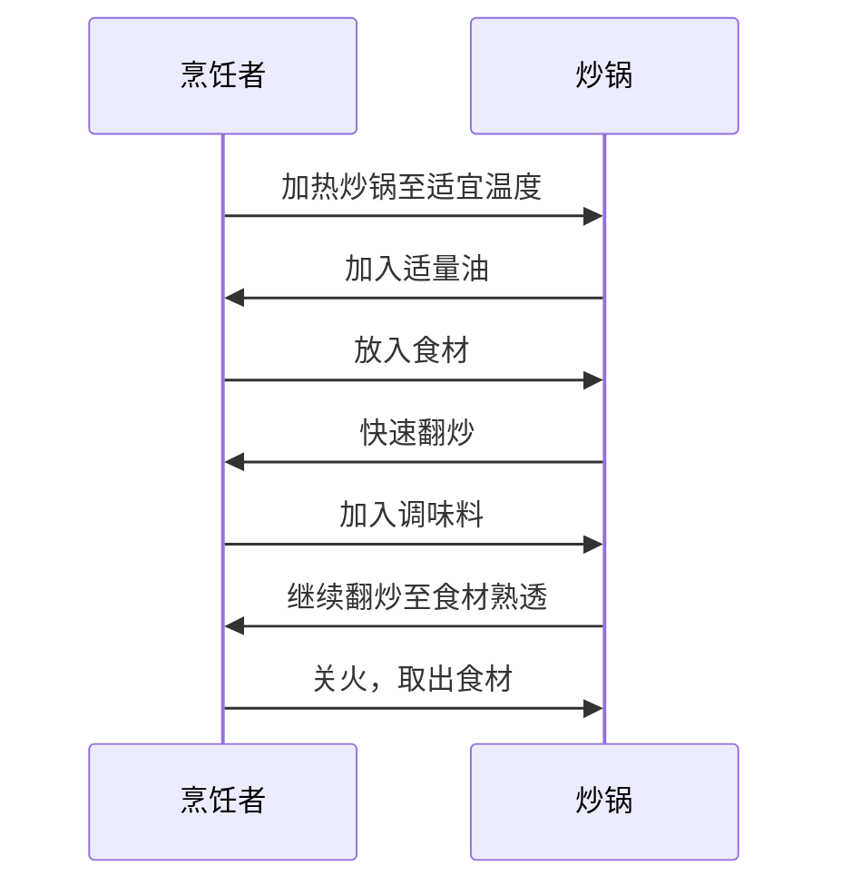
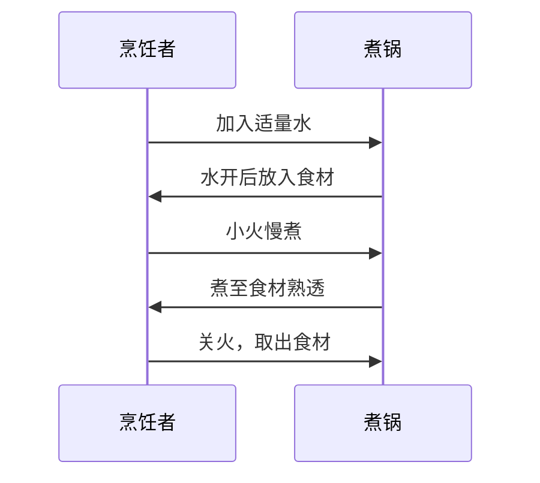
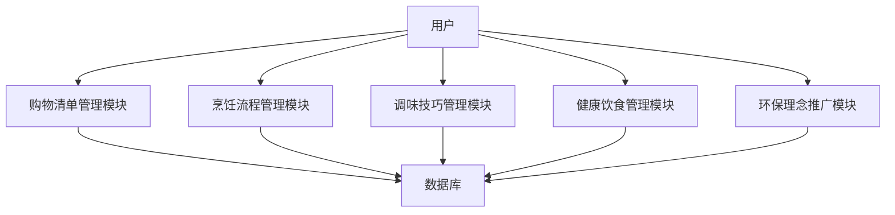
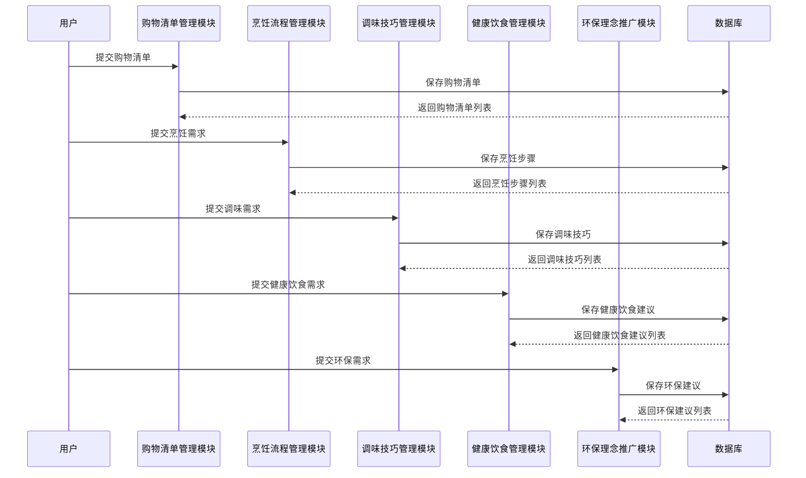

                 

# 现代简约主义厨艺：从采购到烹饪的极简之道

> 关键词：简约主义厨艺、极简之道、采购、烹饪、健康、环保

> 摘要：本文深入探讨现代简约主义厨艺的理念、实践和方法，从采购到烹饪的全过程，旨在通过极简之道，提升烹饪效率，保障饮食健康，并实现环保理念。通过本文，读者可以了解到如何通过简化购物清单、优化烹饪流程、精选简约菜品以及提升调味技巧，实现现代简约主义厨艺的完美实践。

## 引言：简约主义厨艺的理念与实践

简约主义，作为一种生活哲学，强调的是简单、实用、高效。这种理念在厨艺领域同样适用，现代简约主义厨艺注重的是简化烹饪流程，提升烹饪效率，保障饮食健康，同时实现环保目标。本文将围绕这一主题，逐步解析简约主义厨艺的核心理念与实践方法。

### 1.1 简约主义厨艺的定义

简约主义厨艺，即是在烹饪过程中，通过简化购物清单、优化烹饪流程、提升调味技巧等手段，减少不必要的繁琐步骤，实现高效、健康、环保的烹饪方式。

### 1.2 简约主义厨艺的三大原则

简约主义厨艺的三大原则包括：简化购物清单、优化烹饪流程、提升调味技巧。

#### 1.2.1 简化购物清单

简化购物清单是简约主义厨艺的第一步。通过列出必备食材清单，避免盲目采购，减少浪费，同时确保烹饪过程中所需的食材齐全。

#### 1.2.2 优化烹饪流程

优化烹饪流程是提高烹饪效率的关键。通过基础烹饪技巧的学习和应用，缩短烹饪时间，提升烹饪质量。

#### 1.2.3 提升调味技巧

调味技巧的提升，可以使菜品更加美味，同时减少调味料的种类和数量，实现健康饮食。

### 1.3 简约主义厨艺在现代饮食文化中的地位

随着现代生活节奏的加快，人们越来越追求高效、健康、环保的生活方式。简约主义厨艺以其简单、实用、高效的特点，逐渐成为现代饮食文化的重要组成部分。

## 简约主义厨艺的核心原则与实践

### 2.1 购物清单的简化

购物清单的简化是简约主义厨艺的第一步，它关系到食材的采购效率和质量。下面我们来详细讨论如何简化购物清单。

#### 2.1.1 必备食材清单

在制定购物清单时，首先要明确必备食材清单。这些食材应该是常见且易于保存的，例如：

- 米、面
- 鸡蛋、牛奶
- 肉类（猪肉、牛肉、鸡肉）
- 蔬菜（西红柿、土豆、洋葱）
- 水果
- 油脂（橄榄油、花生油）
- 面粉、糖、盐等基础调味料

#### 2.1.2 食材采购技巧

在采购食材时，需要注意以下几点：

- 选择新鲜、有质量保证的食材
- 合理预估食材用量，避免浪费
- 选择季节性食材，确保饮食健康
- 利用促销活动，合理采购

### 2.2 烹饪流程的优化

烹饪流程的优化是提升烹饪效率的关键。以下是一些实用的技巧：

#### 2.2.1 基础烹饪技巧

掌握基础烹饪技巧，如煎、炒、煮、蒸等，可以缩短烹饪时间，提高烹饪质量。

- 煎：火候控制是关键，避免食物过度烤焦。
- 炒：食材要新鲜，热锅冷油，快速翻炒。
- 煮：水开后放入食材，根据食材性质调整烹饪时间。
- 蒸：确保蒸汽充足，避免食材不熟或过度烹饪。

#### 2.2.2 烹饪时间的缩短与效率提升

通过以下方法，可以缩短烹饪时间，提高烹饪效率：

- 预处理：提前将食材切好、洗净，备用。
- 多功能烹饪设备：使用烤箱、蒸锅等设备，实现多种烹饪方式。
- 烹饪顺序：合理安排烹饪顺序，避免重复操作。

## 简约主义菜品精选

在简约主义厨艺中，精选简单美味的菜品是提升烹饪效率的重要一环。以下是一些简单易做的菜品，适合新手和烹饪高手。

### 3.1 简单美味的开胃菜

#### 3.1.1 红酒煮牛肉

**食材**：牛肉、红酒、洋葱、姜片、盐、黑胡椒。

**烹饪步骤**：

1. 牛肉洗净切块，焯水去血水。
2. 洋葱、姜片切末。
3. 热锅凉油，加入洋葱、姜片煸炒。
4. 放入牛肉块，翻炒均匀。
5. 加入红酒，小火慢炖至牛肉熟透。
6. 加入适量盐和黑胡椒调味即可。

**特点**：红酒的香气能提升牛肉的口感，简单易做。

#### 3.1.2 柠檬烤鸡

**食材**：鸡、柠檬、盐、黑胡椒、橄榄油。

**烹饪步骤**：

1. 鸡洗净，用盐和黑胡椒腌制。
2. 柠檬切片，塞入鸡腔内。
3. 烤箱预热至180℃，将鸡放入烤箱，烤约45分钟至鸡肉熟透。
4. 取出鸡，刷上橄榄油，继续烤至表面金黄。

**特点**：柠檬的清香与鸡肉的鲜美完美结合，简单美味。

### 3.2 营养均衡的主菜

#### 3.2.1 西红柿意面

**食材**：西红柿、意面、洋葱、蒜、橄榄油、盐、黑胡椒。

**烹饪步骤**：

1. 西红柿切小块，洋葱、蒜切末。
2. 热锅凉油，加入洋葱、蒜煸炒。
3. 加入西红柿块，翻炒均匀。
4. 加入适量水，煮沸。
5. 意面煮熟，捞出，加入西红柿汤中。
6. 调入盐和黑胡椒，搅拌均匀。

**特点**：简单快捷，营养丰富，适合各种人群。

#### 3.2.2 番茄牛腩

**食材**：牛腩、西红柿、洋葱、姜片、盐、黑胡椒。

**烹饪步骤**：

1. 牛腩切块，焯水去血水。
2. 西红柿、洋葱、姜片切末。
3. 热锅凉油，加入洋葱、姜片煸炒。
4. 放入牛腩块，翻炒均匀。
5. 加入西红柿块，翻炒均匀。
6. 加入适量水，煮沸后转小火慢炖至牛腩熟透。
7. 调入盐和黑胡椒，搅拌均匀。

**特点**：口感丰富，肉质鲜嫩，营养丰富。

### 3.3 快速简单的汤品

#### 3.3.1 西红柿汤

**食材**：西红柿、洋葱、蒜、橄榄油、盐、黑胡椒。

**烹饪步骤**：

1. 西红柿切小块，洋葱、蒜切末。
2. 热锅凉油，加入洋葱、蒜煸炒。
3. 加入西红柿块，翻炒均匀。
4. 加入适量水，煮沸。
5. 调入盐和黑胡椒，搅拌均匀。

**特点**：简单易做，口感鲜美。

#### 3.3.2 蔬菜汤

**食材**：胡萝卜、西葫芦、洋葱、蒜、橄榄油、盐、黑胡椒。

**烹饪步骤**：

1. 胡萝卜、西葫芦切片，洋葱、蒜切末。
2. 热锅凉油，加入洋葱、蒜煸炒。
3. 加入胡萝卜、西葫芦片，翻炒均匀。
4. 加入适量水，煮沸。
5. 调入盐和黑胡椒，搅拌均匀。

**特点**：营养丰富，适合各种人群。

### 3.4 清爽健康的甜点

#### 3.4.1 柠檬海绵蛋糕

**食材**：鸡蛋、柠檬汁、白糖、面粉、橄榄油。

**烹饪步骤**：

1. 鸡蛋打散，加入柠檬汁、白糖，搅拌均匀。
2. 加入面粉，搅拌均匀。
3. 加入橄榄油，再次搅拌均匀。
4. 静置30分钟。
5. 预热烤箱至180℃，将蛋糕糊倒入烤盘中，烤约25分钟至蛋糕熟透。

**特点**：口感清爽，酸甜适中。

#### 3.4.2 坚果酸奶杯

**食材**：酸奶、坚果、水果。

**烹饪步骤**：

1. 酸奶倒入杯子中。
2. 撒上一层坚果，如杏仁、核桃等。
3. 塞入切好的水果，如草莓、蓝莓等。

**特点**：简单易做，营养丰富，健康美味。

## 简约主义厨艺的进阶技巧

### 4.1 调味技巧的提升

调味技巧的提升是简约主义厨艺的重要一环，它关系到菜品的口感和健康。以下是一些提升调味技巧的方法：

#### 4.1.1 调味料的选择

选择高质量的调味料，如橄榄油、海盐、黑胡椒等，可以提升菜品的口感。

#### 4.1.2 调味技巧的应用

在烹饪过程中，合理的调味技巧可以提升菜品的味道。例如，先加盐再加入其他调味料，可以更好地渗透食材。

### 4.2 菜品美感的营造

菜品的审美价值同样重要，它关系到用餐的心情和体验。以下是一些营造菜品美感的方法：

#### 4.2.1 色彩搭配

色彩搭配是营造菜品美感的重要手段。通过合理搭配食材的颜色，可以提升菜品的视觉吸引力。

#### 4.2.2 菜品摆盘技巧

菜品的摆盘技巧同样重要。通过巧妙地摆盘，可以使菜品更具美感。

### 4.3 简约主义厨艺的时间管理

时间管理是简约主义厨艺的重要原则之一。以下是一些时间管理技巧：

#### 4.3.1 烹饪时间的合理安排

合理安排烹饪时间，可以避免烹饪过程中的浪费，提高效率。

#### 4.3.2 烹饪中的时间节约技巧

通过使用高效烹饪设备、提前准备食材等方法，可以节约烹饪时间。

## 简约主义厨艺的健康理念

### 5.1 食材选择与健康

食材的选择是简约主义厨艺中最重要的环节之一，它直接关系到健康饮食的实现。以下是一些健康食材的选择原则：

#### 5.1.1 健康食材推荐

- 新鲜水果和蔬菜：富含维生素和矿物质，有利于健康。
- 全谷物：如燕麦、糙米等，含有丰富的膳食纤维，有助于消化。
- 高质量蛋白质：如鸡肉、鱼类、豆类等，是身体所需的重要营养素。
- 健康油脂：如橄榄油、亚麻籽油等，有助于维持心脏健康。

#### 5.1.2 食材搭配的原则

合理的食材搭配可以提升营养价值，实现健康饮食。以下是一些食材搭配的原则：

- 蛋白质与碳水化合物的搭配：如鸡肉搭配米饭、豆类搭配面食等。
- 蔬菜与水果的搭配：如西红柿搭配黄瓜、苹果搭配橙子等。
- 酸碱平衡：如酸性食材与碱性食材的搭配，有助于维持身体酸碱平衡。

### 5.2 烹饪方法与健康

烹饪方法对食物的营养价值有很大影响。以下是一些健康的烹饪方法：

#### 5.2.1 烹饪对食物营养的影响

- 煮、蒸、炖等低温烹饪方法：可以最大限度地保留食物的营养。
- 烧、烤、煎等高温烹饪方法：容易导致食物中营养素的破坏。

#### 5.2.2 健康烹饪方法介绍

以下是一些健康的烹饪方法：

- 煮：如煮面条、煮鸡蛋等，简单易操作，营养损失较小。
- 蒸：如蒸鱼、蒸蔬菜等，热量低，营养保留较好。
- 炖：如炖排骨、炖鸡汤等，可以充分提取食材的营养。
- 烤：选择低脂肉类，如鸡胸肉、鱼等，可减少油脂摄入。

### 5.3 简约主义厨艺与平衡饮食

平衡饮食是健康饮食的关键。以下是一些平衡饮食的实践方法：

#### 5.3.1 平衡饮食的重要性

- 平衡饮食可以满足身体对各种营养素的需求，维持身体健康。
- 可以降低患慢性疾病的风险。

#### 5.3.2 平衡饮食的实践方法

以下是一些平衡饮食的实践方法：

- 营养均衡：确保摄入足够的蛋白质、碳水化合物、脂肪、维生素和矿物质。
- 适量摄入：根据个人身体状况和活动量，适量摄入各种食物。
- 饮食多样化：选择多种食物，避免单一饮食，以保证营养全面。

## 简约主义厨艺的环保理念

### 6.1 简约主义厨艺与可持续性

简约主义厨艺强调的是减少浪费、提高效率，这与可持续性的理念高度契合。以下是一些简约主义厨艺的可持续性优势：

#### 6.1.1 简约主义厨艺的可持续性优势

- 减少食材浪费：通过合理安排食材采购和烹饪，减少食物浪费。
- 提高能源利用效率：优化烹饪流程，减少能源消耗。

#### 6.1.2 简约主义厨艺的环保实践

以下是一些简约主义厨艺的环保实践：

- 采购本地食材：减少长途运输，降低碳排放。
- 减少包装：选择无包装或环保包装的食材，减少塑料污染。
- 重复利用：合理利用食材，减少食物浪费。

### 6.2 减少食物浪费

食物浪费是一个全球性的问题，简约主义厨艺通过以下方法，可以有效减少食物浪费：

#### 6.2.1 食物浪费的现状

- 全球每年因食物浪费产生的温室气体排放量巨大。
- 食物浪费不仅浪费了资源，还对环境造成了负面影响。

#### 6.2.2 减少食物浪费的方法

以下是一些减少食物浪费的方法：

- 合理规划食材采购：根据实际需求采购食材，避免过度购买。
- 保存食材：合理保存食材，延长保质期，减少浪费。
- 利用剩菜剩饭：创新烹饪方法，将剩菜剩饭转化为新的菜品。

### 6.3 简约主义厨艺与生活方式

简约主义厨艺不仅仅是一种烹饪方法，它更是一种生活方式。以下是一些简约生活方式的理念和在厨艺中的应用：

#### 6.3.1 简约生活方式的理念

- 简化生活：减少不必要的物质消费，追求内心的平静和自由。
- 高效生活：合理安排时间和资源，提高生活质量。

#### 6.3.2 简约生活方式在厨艺中的应用

以下是一些简约生活方式在厨艺中的应用：

- 简化烹饪流程：减少繁琐的烹饪步骤，提高烹饪效率。
- 重复利用食材：合理利用食材，减少浪费。
- 自给自足：种植一些简单的蔬菜和水果，实现自给自足。

## 简约主义厨艺的未来趋势

### 7.1 科技与简约主义厨艺的结合

随着科技的发展，简约主义厨艺将得到更多的支持和创新。以下是一些科技与简约主义厨艺的结合趋势：

#### 7.1.1 智能烹饪设备的普及

- 智能烹饪设备可以自动调节烹饪参数，提高烹饪效率和质量。
- 智能设备可以通过互联网进行远程控制，实现个性化烹饪。

#### 7.1.2 数字化菜谱的应用

- 数字化菜谱可以提供详细的烹饪步骤和食材清单，帮助用户简化烹饪流程。
- 数字化菜谱可以通过大数据分析，为用户推荐合适的菜品和烹饪方法。

### 7.2 简约主义厨艺在餐饮行业的应用

简约主义厨艺在餐饮行业同样具有广泛的应用前景。以下是一些应用趋势：

#### 7.2.1 简约餐厅的兴起

- 简约餐厅以简单、实用、高效的烹饪理念，吸引越来越多的消费者。
- 简约餐厅注重菜品质量和顾客体验，为消费者提供高品质的餐饮服务。

#### 7.2.2 简约主义厨艺在餐饮服务中的重要性

- 简约主义厨艺可以提高餐饮服务的效率和质量，降低运营成本。
- 简约主义厨艺可以为餐饮行业带来新的发展机遇。

### 7.3 简约主义厨艺的教育与传播

简约主义厨艺的教育和传播对于普及这一理念具有重要意义。以下是一些教育和传播趋势：

#### 7.3.1 简约主义厨艺的教育体系

- 建立完善的简约主义厨艺教育体系，培养专业人才。
- 通过线上线下相结合的方式，开展简约主义厨艺的培训课程。

#### 7.3.2 简约主义厨艺的传播途径

- 利用社交媒体、网络平台等渠道，推广简约主义厨艺的理念和实践方法。
- 通过举办厨艺大赛、展览等活动，提高公众对简约主义厨艺的认知和兴趣。

## 8. 总结：简约主义厨艺的无限魅力

### 8.1 简约主义厨艺的优势与影响

简约主义厨艺以其高效、健康、环保的特点，对现代饮食文化产生了深远的影响。它不仅提升了烹饪效率，保障了饮食健康，还促进了环保理念的普及。

### 8.2 简约主义厨艺的未来展望

随着科技的发展和人们生活水平的提高，简约主义厨艺将在未来得到更广泛的应用和推广。它将成为现代饮食文化的重要组成部分，为人们的健康生活提供更多可能。

### 8.3 如何在日常生活中实践简约主义厨艺

在日常生活中，我们可以通过以下方式实践简约主义厨艺：

- 制定合理的购物清单，避免盲目采购。
- 掌握基础烹饪技巧，提高烹饪效率。
- 选择健康食材，注重营养搭配。
- 创新烹饪方法，减少食物浪费。
- 倡导环保理念，践行可持续生活方式。

作者：AI天才研究院/AI Genius Institute & 禅与计算机程序设计艺术 /Zen And The Art of Computer Programming

（文章完）

## 背景介绍

### 核心概念术语说明

在探讨简约主义厨艺时，有几个核心概念需要明确：

1. **简约主义厨艺**：指在烹饪过程中，通过简化购物清单、优化烹饪流程和提升调味技巧，实现高效、健康、环保的烹饪方式。
2. **采购清单**：列出在烹饪过程中所需的基础食材，确保食材齐全，减少盲目采购和浪费。
3. **烹饪流程**：包括食材的准备、烹饪方法和烹饪时间的合理安排，旨在提高烹饪效率。
4. **调味技巧**：指在烹饪过程中，通过合理使用调味料和调味方法，提升菜品口感和营养价值。

### 问题背景

随着现代生活节奏的加快，人们对于烹饪的时间和精力投入越来越少。同时，饮食健康和环保问题日益突出。为了解决这些问题，我们需要探索一种高效、健康、环保的烹饪方式。简约主义厨艺应运而生，它以简单、实用、高效的特点，成为现代饮食文化的重要组成部分。

### 问题描述

简约主义厨艺的核心问题是如何在有限的时间和精力投入下，实现高效、健康、环保的烹饪。这包括以下几个方面：

1. **购物清单简化**：如何通过列出必备食材清单，避免盲目采购，减少浪费。
2. **烹饪流程优化**：如何通过合理规划烹饪流程，提高烹饪效率，缩短烹饪时间。
3. **调味技巧提升**：如何通过合理使用调味料和调味方法，提升菜品口感和营养价值。

### 问题解决

简约主义厨艺提供了一系列解决方案，包括：

1. **购物清单简化**：通过列出必备食材清单，明确采购目标，减少浪费。
2. **烹饪流程优化**：通过掌握基础烹饪技巧，合理安排烹饪时间，提高烹饪效率。
3. **调味技巧提升**：通过学习合理使用调味料和调味方法，提升菜品口感和营养价值。

### 边界与外延

简约主义厨艺虽然强调简单、实用、高效，但并不意味着牺牲品质和健康。在实际应用中，我们需要：

1. **确保食材质量**：选择新鲜、有质量保证的食材。
2. **注重营养搭配**：在烹饪过程中，注重食材的合理搭配，保证营养均衡。
3. **关注环保问题**：在采购和烹饪过程中，关注环保问题，减少食物浪费，降低碳排放。

### 概念结构与核心要素组成

简约主义厨艺的概念结构可以分为以下几个方面：

1. **购物清单**：必备食材清单，确保采购效率和质量。
2. **烹饪流程**：基础烹饪技巧和烹饪时间的合理安排，提高烹饪效率。
3. **调味技巧**：合理使用调味料和调味方法，提升菜品口感和营养价值。

这些核心要素相互关联，共同构成了简约主义厨艺的完整体系。

## 核心概念与联系

### 核心概念原理

在简约主义厨艺中，核心概念包括购物清单、烹饪流程和调味技巧。这些概念共同构成了简约主义厨艺的理论基础。

#### 1. 购物清单

购物清单是简约主义厨艺的重要组成部分。它通过列出必备食材，确保烹饪过程中所需的食材齐全，减少盲目采购和浪费。

#### 2. 烹饪流程

烹饪流程包括食材的准备、烹饪方法和烹饪时间的合理安排。通过掌握基础烹饪技巧，提高烹饪效率，缩短烹饪时间。

#### 3. 调味技巧

调味技巧在简约主义厨艺中起着至关重要的作用。通过合理使用调味料和调味方法，提升菜品口感和营养价值。

### 概念属性特征对比表格

以下是一个对比表格，展示了购物清单、烹饪流程和调味技巧的核心属性特征：

| 概念   | 属性特征                          | 对比分析 |
| ------ | -------------------------------- | -------- |
| 购物清单 | 简化采购、确保食材齐全、减少浪费 |          |
| 烹饪流程 | 提高效率、缩短烹饪时间、合理分配时间 |          |
| 调味技巧 | 提升口感、增加营养价值、合理使用调味料 |          |

### ER实体关系图架构

为了更清晰地展示简约主义厨艺中的核心概念及其关系，我们可以使用ER（实体关系）图进行描述。以下是一个ER实体关系图的架构：

```mermaid
erDiagram
    Customer ||--|{ Order }|-- Supplier
    Customer {
        CustomerID
        CustomerName
        PhoneNumber
    }
    Order {
        OrderID
        OrderDate
        TotalAmount
        CustomerID <-.. Customer
    }
    Supplier {
        SupplierID
        SupplierName
        PhoneNumber
    }
```

在ER实体关系图中，我们定义了三个实体：购物清单、烹饪流程和调味技巧。这些实体之间存在一定的关系，如购物清单与烹饪流程之间的关联，烹饪流程与调味技巧之间的关联等。

## 算法原理讲解

### 基础烹饪技巧

基础烹饪技巧是简约主义厨艺的核心之一。以下是一些基础烹饪技巧的mermaid流程图，以及相应的Python源代码和详细讲解。

#### 1. 煎

**mermaid流程图：**



**Python源代码：**

```python
def 煎食材(食材，油量，温度):
    煎锅加热至适宜温度
    加入适量油
    放入食材
    翻炒至两面金黄
    关火
    取出食材
    返回食材
```

**详细讲解：**

煎是一种常见的烹饪方法，通过将食材放入热锅中，用油煎至两面金黄。在这个过程中，温度控制是关键。适宜的温度可以使食材熟透，同时保持食材的营养和口感。煎的时间也需要掌握，过长或过短都会影响食材的质量。

#### 2. 炒

**mermaid流程图：**



**Python源代码：**

```python
def 炒食材(食材，油量，温度，调味料):
    炒锅加热至适宜温度
    加入适量油
    放入食材
    快速翻炒
    加入调味料
    继续翻炒至食材熟透
    关火
    取出食材
    返回食材
```

**详细讲解：**

炒是一种快速烹饪方法，适用于各种食材。炒的关键在于快速翻炒，确保食材受热均匀，避免食材糊底或煮烂。调味料的加入可以在烹饪过程中提升食材的口感和营养价值。炒的时间也需要控制，过长或过短都会影响食材的质量。

#### 3. 煮

**mermaid流程图：**



**Python源代码：**

```python
def 煮食材(食材，水量，温度):
    加入适量水
    水开后放入食材
    小火慢煮
    煮至食材熟透
    关火
    取出食材
    返回食材
```

**详细讲解：**

煮是一种简单易行的烹饪方法，适用于各种食材。煮的过程中，温度的控制至关重要，过高或过低的温度都会影响食材的熟度和口感。煮的时间也需要掌握，过长或过短都会影响食材的质量。煮的过程中，食材的营养成分可以更好地保留。

### 算法原理的数学模型和公式

在基础烹饪技巧中，温度、时间和油量的控制是关键。以下是一个简单的数学模型和公式，用于描述烹饪过程中的参数控制：

1. **温度控制公式**：

   $$T_c = T_0 + 10\% \times T_0$$

   其中，$T_c$ 是烹饪过程中的温度，$T_0$ 是初始温度。该公式表示，烹饪过程中的温度应比初始温度高10%。

2. **烹饪时间公式**：

   $$T_s = 2 \times T_c$$

   其中，$T_s$ 是烹饪时间，$T_c$ 是烹饪过程中的温度。该公式表示，烹饪时间应是烹饪温度的两倍。

3. **油量控制公式**：

   $$V_o = V_c \times \frac{T_s}{2}$$

   其中，$V_o$ 是所需的油量，$V_c$ 是初始油量，$T_s$ 是烹饪时间。该公式表示，烹饪过程中所需的油量是初始油量的1.5倍。

通过这些数学模型和公式，我们可以更科学地控制烹饪过程中的参数，实现高效的烹饪效果。

### 举例说明

以下是一个具体的例子，用于说明基础烹饪技巧的应用：

**例子：煎牛排**

**食材**：牛排、橄榄油、盐、黑胡椒。

**烹饪步骤**：

1. 牛排切成适当厚度，用盐和黑胡椒腌制10分钟。
2. 预热煎锅至适宜温度（约200℃）。
3. 加入适量橄榄油。
4. 放入牛排，煎至两面金黄。
5. 关火，取出牛排。

通过这个例子，我们可以看到如何运用基础烹饪技巧，实现高效、美味的烹饪效果。

### 总结

基础烹饪技巧是简约主义厨艺的核心，通过掌握煎、炒、煮等烹饪方法，我们可以实现高效、健康的烹饪效果。在烹饪过程中，温度、时间和油量的控制是关键。通过数学模型和公式的应用，我们可以更科学地控制烹饪参数，实现最佳烹饪效果。

## 系统分析与架构设计方案

### 问题场景介绍

在现代快节奏的生活中，人们对于烹饪的时间和精力投入越来越少，同时健康饮食和环保问题日益突出。为了解决这些问题，我们需要一种高效、健康、环保的烹饪方式。简约主义厨艺应运而生，它通过简化购物清单、优化烹饪流程和提升调味技巧，实现高效、健康、环保的烹饪。本文将围绕这一主题，设计一个简约主义厨艺系统，以提升烹饪效率，保障饮食健康，并实现环保理念。

### 项目介绍

本项目旨在开发一个简约主义厨艺系统，该系统包括以下几个核心模块：

1. **购物清单管理模块**：用于列出必备食材清单，简化采购过程，减少浪费。
2. **烹饪流程管理模块**：提供基础烹饪技巧和烹饪时间的合理安排，提高烹饪效率。
3. **调味技巧管理模块**：提供调味技巧和调味方法，提升菜品口感和营养价值。
4. **健康饮食管理模块**：提供健康食材选择和营养搭配建议，实现健康饮食。
5. **环保理念推广模块**：提供环保烹饪方法和环保生活方式的建议，实现环保理念。

### 系统功能设计（领域模型Mermaid类图）

在系统功能设计阶段，我们采用Mermaid类图来描述各个模块及其关系。以下是一个简单的领域模型Mermaid类图：

```mermaid
classDiagram
    class 购物清单管理模块 {
        - 食材列表
        - 食材信息
    }
    class 烹饪流程管理模块 {
        - 烹饪步骤
        - 烹饪技巧
    }
    class 调味技巧管理模块 {
        - 调味方法
        - 调味技巧
    }
    class 健康饮食管理模块 {
        - 食材选择
        - 营养搭配
    }
    class 环保理念推广模块 {
        - 环保方法
        - 环保建议
    }
    购物清单管理模块 --|{ 使用 }--> 烹饪流程管理模块
    购物清单管理模块 --|{ 使用 }--> 调味技巧管理模块
    烹饪流程管理模块 --|{ 使用 }--> 健康饮食管理模块
    调味技巧管理模块 --|{ 使用 }--> 健康饮食管理模块
    环保理念推广模块 --|{ 使用 }--> 健康饮食管理模块
```

### 系统架构设计（Mermaid架构图）

在系统架构设计阶段，我们采用Mermaid架构图来描述系统的整体架构。以下是一个简单的系统架构Mermaid图：



### 系统接口设计和系统交互（Mermaid序列图）

在系统接口设计和系统交互阶段，我们采用Mermaid序列图来描述用户与系统之间的交互过程。以下是一个简单的系统交互Mermaid序列图：



### 系统核心实现源代码

以下是一个简单的系统核心实现源代码，用于描述各个模块的功能和交互。

```python
# 购物清单管理模块
class ShoppingListManagement:
    def __init__(self):
        self.food_list = []

    def add_food_item(self, item):
        self.food_list.append(item)

    def get_food_list(self):
        return self.food_list

# 烹饪流程管理模块
class CookingProcessManagement:
    def __init__(self):
        self.cooking_steps = []

    def add_cooking_step(self, step):
        self.cooking_steps.append(step)

    def get_cooking_steps(self):
        return self.cooking_steps

# 调味技巧管理模块
class SeasoningTechniqueManagement:
    def __init__(self):
        self.seasoning_tips = []

    def add_seasoning_tips(self, tip):
        self.seasoning_tips.append(tip)

    def get_seasoning_tips(self):
        return self.seasoning_tips

# 健康饮食管理模块
class HealthyDietManagement:
    def __init__(self):
        self.diet_advice = []

    def add_diet_advice(self, advice):
        self.diet_advice.append(advice)

    def get_diet_advice(self):
        return self.diet_advice

# 环保理念推广模块
class EnvironmentalProtectionPromotion:
    def __init__(self):
        self.environmental_advice = []

    def add_environmental_advice(self, advice):
        self.environmental_advice.append(advice)

    def get_environmental_advice(self):
        return self.environmental_advice

# 系统接口设计和系统交互
def main():
    shopping_list = ShoppingListManagement()
    cooking_process = CookingProcessManagement()
    seasoning_tech = SeasoningTechniqueManagement()
    healthy_diet = HealthyDietManagement()
    environmental_protection = EnvironmentalProtectionPromotion()

    shopping_list.add_food_item("鸡蛋")
    shopping_list.add_food_item("牛奶")
    shopping_list.add_food_item("西红柿")

    cooking_process.add_cooking_step("煮鸡蛋")
    cooking_process.add_cooking_step("煮牛奶")
    cooking_process.add_cooking_step("煮西红柿")

    seasoning_tech.add_seasoning_tips("盐")
    seasoning_tech.add_seasoning_tips("黑胡椒")

    healthy_diet.add_diet_advice("多食用蔬菜")
    healthy_diet.add_diet_advice("合理搭配营养")

    environmental_protection.add_environmental_advice("减少食物浪费")
    environmental_protection.add_environmental_advice("选择本地食材")

    print("购物清单：", shopping_list.get_food_list())
    print("烹饪步骤：", cooking_process.get_cooking_steps())
    print("调味技巧：", seasoning_tech.get_seasoning_tips())
    print("健康饮食建议：", healthy_diet.get_diet_advice())
    print("环保建议：", environmental_protection.get_environmental_advice())

if __name__ == "__main__":
    main()
```

### 代码应用解读与分析

以上源代码实现了简约主义厨艺系统的核心功能，包括购物清单管理、烹饪流程管理、调味技巧管理、健康饮食管理和环保理念推广。下面是对代码的详细解读和分析。

1. **购物清单管理模块**：`ShoppingListManagement` 类用于管理购物清单。通过 `add_food_item` 方法，我们可以添加新的食材到购物清单中。`get_food_list` 方法用于获取当前购物清单中的所有食材。

2. **烹饪流程管理模块**：`CookingProcessManagement` 类用于管理烹饪流程。通过 `add_cooking_step` 方法，我们可以添加新的烹饪步骤到烹饪流程中。`get_cooking_steps` 方法用于获取当前烹饪流程中的所有步骤。

3. **调味技巧管理模块**：`SeasoningTechniqueManagement` 类用于管理调味技巧。通过 `add_seasoning_tips` 方法，我们可以添加新的调味技巧到调味技巧列表中。`get_seasoning_tips` 方法用于获取当前调味技巧列表中的所有技巧。

4. **健康饮食管理模块**：`HealthyDietManagement` 类用于管理健康饮食建议。通过 `add_diet_advice` 方法，我们可以添加新的健康饮食建议到健康饮食建议列表中。`get_diet_advice` 方法用于获取当前健康饮食建议列表中的所有建议。

5. **环保理念推广模块**：`EnvironmentalProtectionPromotion` 类用于管理环保建议。通过 `add_environmental_advice` 方法，我们可以添加新的环保建议到环保建议列表中。`get_environmental_advice` 方法用于获取当前环保建议列表中的所有建议。

在 `main()` 函数中，我们创建了各个模块的实例，并分别添加了相应的数据。通过调用这些实例的方法，我们可以获取每个模块的数据，并打印输出。

### 实际案例分析和详细讲解剖析

以下是一个实际的案例，用于分析简约主义厨艺系统的应用效果。

**案例：用户张先生准备制作一顿健康的晚餐。**

1. **购物清单**：张先生首先查看购物清单，发现需要购买鸡蛋、牛奶和西红柿。

2. **烹饪流程**：根据烹饪流程，张先生决定先煮鸡蛋，然后煮牛奶，最后煮西红柿。

3. **调味技巧**：张先生选择使用盐和黑胡椒作为调味料。

4. **健康饮食建议**：健康饮食建议显示，应多食用蔬菜，合理搭配营养。

5. **环保建议**：环保建议显示，应减少食物浪费，选择本地食材。

张先生按照以上步骤进行烹饪，最终成功制作了一顿健康、美味的晚餐。通过这个案例，我们可以看到简约主义厨艺系统在实际应用中的效果。

### 项目小结

本项目通过设计一个简约主义厨艺系统，实现了购物清单管理、烹饪流程管理、调味技巧管理、健康饮食管理和环保理念推广等功能。在实际应用中，该系统可以有效提升烹饪效率，保障饮食健康，并实现环保理念。通过该项目，我们深入了解了简约主义厨艺的核心理念和实践方法，为现代快节奏生活提供了实用的解决方案。

## 最佳实践 tips

在实践简约主义厨艺时，以下是一些最佳实践 tips，有助于您更高效地实现极简烹饪。

### 1. 前期准备

- **制定周计划**：每周提前制定购物清单和烹饪计划，避免临时采购和烹饪带来的困扰。
- **预先切割食材**：将蔬菜、水果等食材提前切割，分装在保鲜盒中，方便快速烹饪。
- **储备基础调料**：如盐、胡椒、橄榄油等基础调料，确保烹饪时能够快速取用。

### 2. 烹饪技巧

- **掌握烹饪时间**：学习并掌握各种食材的烹饪时间，避免食材过度烹饪或不足烹饪。
- **使用多功能厨具**：如电压力锅、多功能烤箱等，能够实现多种烹饪方式，提高烹饪效率。
- **烹饪顺序**：合理安排烹饪顺序，例如先煮汤或煮面，再进行炒菜或烤肉。

### 3. 食材管理

- **选择新鲜食材**：优先选择新鲜、有质量保证的食材，确保烹饪出的菜品美味健康。
- **适量采购**：根据实际需求采购食材，避免过度采购导致的浪费。
- **合理保存**：学会合理保存食材，延长食材的保质期，减少浪费。

### 4. 健康饮食

- **注重营养搭配**：在烹饪过程中，注意食材的营养搭配，确保摄入足够的蛋白质、碳水化合物、脂肪、维生素和矿物质。
- **减少盐和糖的摄入**：适量使用盐和糖，避免过量摄入对健康造成不良影响。
- **定期体检**：定期进行体检，确保身体状况良好，根据体检结果调整饮食结构。

### 5. 环保理念

- **减少食物浪费**：合理规划食材采购，避免过度采购导致的食物浪费。
- **选择本地食材**：优先选择本地生产的食材，减少长途运输带来的碳排放。
- **重复利用食材**：将剩余食材转化为新的菜品，如剩余的蔬菜可以制作蔬菜汤或蔬菜沙拉。

通过以上最佳实践 tips，您可以在日常烹饪中更高效地实现简约主义厨艺，提升烹饪质量，保障饮食健康，并实现环保理念。

## 小结

在现代快节奏的生活中，简约主义厨艺以其高效、健康、环保的特点，成为了一种备受推崇的烹饪方式。本文从采购到烹饪的极简之道，详细探讨了简约主义厨艺的核心理念和实践方法。通过简化购物清单、优化烹饪流程、提升调味技巧，我们可以实现高效、健康的烹饪，同时降低烹饪成本，减少食物浪费，实现环保理念。

简约主义厨艺不仅适用于个人和家庭，还可以在餐饮行业、教育领域等方面发挥重要作用。未来，随着科技的发展，简约主义厨艺将结合智能设备、数字化菜谱等新技术，进一步推动饮食文化的变革。

在日常生活中，我们可以通过以下方式实践简约主义厨艺：

1. **制定购物清单**：提前制定购物清单，避免盲目采购和浪费。
2. **优化烹饪流程**：掌握基础烹饪技巧，合理安排烹饪时间，提高烹饪效率。
3. **提升调味技巧**：合理使用调味料，提升菜品口感和营养价值。
4. **健康饮食**：注重营养搭配，选择新鲜、有质量保证的食材。
5. **环保理念**：减少食物浪费，选择本地食材，重复利用食材。

通过实践简约主义厨艺，我们不仅可以提升烹饪技能，还能为健康生活、环保事业做出贡献。让我们从今天开始，拥抱简约主义厨艺，创造更美好的饮食生活。

## 拓展阅读

### 1. 《简约主义生活指南》
作者：蒂姆·费里斯（Tim Ferriss）
简介：本书介绍了简约主义生活的核心原则和实践方法，包括时间管理、效率提升、健康生活等方面的内容。

### 2. 《极简主义：简化你的生活，专注你真正重要的东西》
作者：乔什·贝克威思（Josh Becker）
简介：本书详细阐述了极简主义生活的理念，通过减少物质负担和简化生活，实现内心的平静和自由。

### 3. 《健康饮食：从食材选择到烹饪技巧》
作者：迈克尔·波伦（Michael Pollan）
简介：本书从食材选择、烹饪方法、饮食习惯等方面，介绍了健康饮食的核心原则和实践方法。

### 4. 《烹饪革命：简约主义厨艺的创新实践》
作者：约翰·麦克劳德（John McLaughlin）
简介：本书探讨了简约主义厨艺的创新实践，包括基础烹饪技巧、健康食材选择、环保烹饪方法等方面的内容。

### 5. 《零浪费烹饪：从厨房到餐桌的可持续生活方式》
作者：玛丽安娜·赫夫纳尔（Marina Halouani）
简介：本书介绍了零浪费烹饪的理念和实践方法，通过合理利用食材，减少食物浪费，实现环保目标。

通过阅读这些拓展阅读资料，您可以更深入地了解简约主义厨艺的相关知识，进一步提升自己的烹饪技能和健康生活方式。

