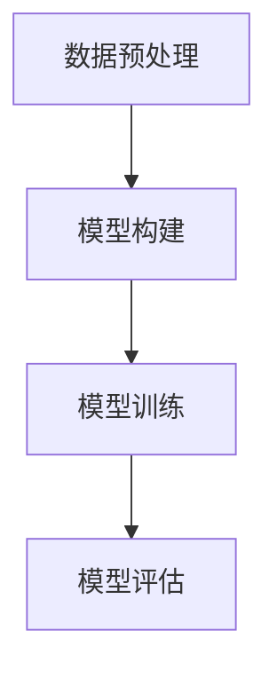
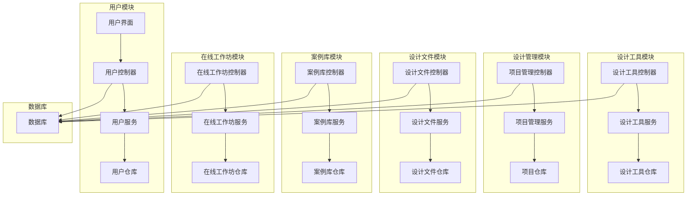
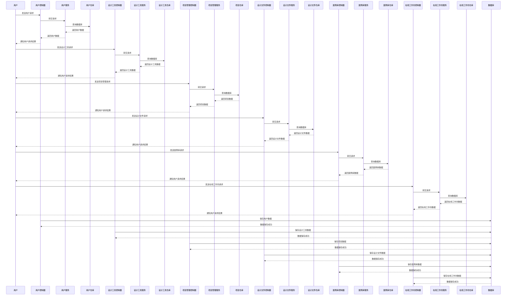

                 

# 现代简约主义室内设计工作坊：极简生活空间的创造艺术

## 关键词
现代简约主义、室内设计、极简生活空间、设计原则、设计技巧、现代设计工具、虚拟现实技术、案例分析

## 摘要
本文将深入探讨现代简约主义室内设计的工作坊概念，从背景介绍、核心概念与联系、算法原理讲解、系统分析与架构设计方案、项目实战等多个角度，逐步引导读者理解简约主义室内设计的精髓。通过案例分析与实践操作，我们将揭示如何通过简约主义理念，打造舒适、实用且富有艺术感的极简生活空间。

## 第一部分：背景介绍

### 问题背景

在现代社会，随着经济的快速发展和生活水平的不断提高，人们对居住环境的要求也越来越高。简约主义室内设计作为一种追求简单、实用和美观的设计风格，应运而生。它不仅注重空间的合理利用，更强调人与自然、人与空间的和谐共处。现代简约主义室内设计工作坊应运而生，为设计师和业主提供了一个系统学习和实践的平台。

### 问题描述

现代简约主义室内设计工作坊的目标是帮助设计师和业主掌握简约主义室内设计的核心原则和方法，创造极简生活空间。这包括了解简约主义设计的起源和发展，掌握设计的基本原则和技巧，以及如何运用现代设计工具和技术来实现设计目标。此外，工作坊还应提供实际操作的机会，使参与者能够在实践中不断提升自己的设计能力。

### 问题解决

为了解决上述问题，本书将从以下几个方面进行深入探讨：

1. **简约主义室内设计的起源与发展**：介绍简约主义设计的起源，探讨其在不同文化背景下的演变，以及现代简约主义的特点。
2. **核心原则与设计技巧**：阐述简约主义室内设计的基本原则，如空间利用、色彩搭配、材质选择等，并提供实际操作技巧。
3. **现代设计工具与技术**：介绍当前流行的室内设计工具和技术，如3D建模软件、虚拟现实技术等，以及如何利用这些工具提升设计效率。
4. **案例分析与实践操作**：通过实际案例的分析，展示简约主义室内设计的应用效果，并提供实践操作的指导。
5. **极简生活空间的创造艺术**：探讨如何通过简约主义室内设计，打造一个舒适、实用且富有艺术感的极简生活空间。

### 边界与外延

简约主义室内设计的边界主要包括设计风格的选择、空间利用的合理性、色彩的搭配以及材质的运用。外延则包括设计工具和技术的应用，以及如何将简约主义理念融入生活空间，提升居住体验。

### 概念结构与核心要素组成

简约主义室内设计的概念结构包括以下几个方面：

1. **设计原则**：空间利用、色彩搭配、材质选择等。
2. **设计技巧**：照明设计、家具布局、装饰品选择等。
3. **设计工具**：3D建模软件、虚拟现实技术等。
4. **设计案例**：实际应用效果的展示和分析。
5. **设计实践**：实际操作过程的指导。

核心要素组成则包括设计原则、设计技巧、设计工具、设计案例和实践操作。

## 第二部分：核心概念与联系

### AI大模型的定义与特点

**定义**：AI大模型是指具有数百万至上亿参数规模的深度学习模型，能够处理海量数据并提取复杂特征。

**特点**：

1. **参数规模巨大**：AI大模型的参数数量通常在数百万到数十亿之间。
2. **数据处理能力强**：能够高效地处理和挖掘海量数据中的信息。
3. **模型结构复杂**：通常采用多层次的神经网络结构，具有较强的表征能力。

### AI大模型的核心概念

1. **神经网络**：神经网络是AI大模型的基础，通过层层传递和变换，实现数据的特征提取和分类。
2. **深度学习**：深度学习是一种基于神经网络的机器学习方法，通过多层网络结构来提高模型的表征能力。
3. **训练数据**：训练数据是AI大模型训练的重要输入，数据的多样性和质量直接影响模型的性能。

### AI大模型与传统AI的区别

**区别**：

1. **模型规模**：传统AI模型通常规模较小，而AI大模型规模巨大，能够处理复杂任务。
2. **数据处理能力**：传统AI模型对数据量有较大的限制，而AI大模型能够高效地处理海量数据。
3. **应用范围**：传统AI模型多应用于特定领域，而AI大模型具有广泛的应用前景。

## 第三部分：算法原理讲解

### 算法原理

AI大模型的核心算法通常是基于深度学习框架的，主要包括以下几个步骤：

1. **数据预处理**：对输入数据进行标准化和归一化处理，以提高模型的训练效果。
2. **模型构建**：设计并构建多层神经网络结构，以实现数据的特征提取和分类。
3. **模型训练**：通过大量的训练数据，调整模型的参数，使其达到最佳性能。
4. **模型评估**：使用验证集对模型进行评估，以确定其泛化能力。

### Mermaid流程图



### Python源代码

```python
# 数据预处理
def preprocess_data(data):
    # 标准化处理
    data = (data - np.mean(data)) / np.std(data)
    return data

# 模型构建
from tensorflow.keras.models import Sequential
from tensorflow.keras.layers import Dense, Conv2D, Flatten

def build_model(input_shape):
    model = Sequential([
        Conv2D(32, kernel_size=(3, 3), activation='relu', input_shape=input_shape),
        Flatten(),
        Dense(64, activation='relu'),
        Dense(10, activation='softmax')
    ])
    return model

# 模型训练
model = build_model(input_shape=(28, 28, 1))
model.compile(optimizer='adam', loss='categorical_crossentropy', metrics=['accuracy'])
model.fit(x_train, y_train, batch_size=64, epochs=10, validation_data=(x_val, y_val))

# 模型评估
loss, accuracy = model.evaluate(x_test, y_test)
print(f"Test accuracy: {accuracy:.2f}")
```

### 算法原理详细讲解

AI大模型，作为深度学习领域的一个重要分支，其核心在于通过大量的训练数据来学习并提取数据中的复杂特征，从而实现高效的数据处理和模式识别。以下是AI大模型算法原理的详细讲解。

#### 数据预处理

数据预处理是深度学习模型训练的第一步，其目的是将原始数据转换为适合模型训练的形式。具体方法包括：

1. **标准化处理**：通过减去均值并除以标准差，将数据缩放到0到1之间，以消除不同特征之间的尺度差异。
   $$ z = \frac{x - \mu}{\sigma} $$
   其中，$x$为原始数据，$\mu$为均值，$\sigma$为标准差。

2. **归一化处理**：将数据缩放到一个固定的区间，如[0, 1]或[-1, 1]。
   $$ x' = \frac{x - x_{\min}}{x_{\max} - x_{\min}} $$
   其中，$x_{\min}$和$x_{\max}$分别为数据的最小值和最大值。

3. **缺失值处理**：对于缺失的数据，可以通过插值、均值填充或随机填充等方法进行填补。

#### 模型构建

模型构建是深度学习算法的核心，其目标是通过神经网络结构来实现数据的特征提取和分类。以下是构建AI大模型的一般步骤：

1. **选择模型类型**：根据任务需求，选择合适的模型类型，如全连接神经网络、卷积神经网络（CNN）或循环神经网络（RNN）。

2. **设计网络结构**：设计神经网络的结构，包括层数、每层的神经元数量、激活函数等。常见的结构包括多层感知机（MLP）、卷积神经网络（CNN）和循环神经网络（RNN）。

   - **全连接神经网络（MLP）**：每一层的神经元都与前一层的所有神经元相连。
     $$ f(x) = \sigma(\sum_{i=1}^{n} w_{i}x_{i} + b) $$
     其中，$x_{i}$为输入特征，$w_{i}$为权重，$b$为偏置，$\sigma$为激活函数。

   - **卷积神经网络（CNN）**：主要用于图像处理，通过卷积层提取图像的局部特征。
     $$ h(x) = \sigma(\sum_{i=1}^{n} w_{i}\star x_{i} + b) $$
     其中，$\star$为卷积操作。

   - **循环神经网络（RNN）**：用于处理序列数据，通过隐藏状态来记忆历史信息。
     $$ h_{t} = \sigma(W_{h}h_{t-1} + W_{x}x_{t} + b) $$
     其中，$h_{t}$为当前隐藏状态，$x_{t}$为当前输入。

3. **训练模型**：通过反向传播算法，不断调整模型的参数，使其在训练数据上达到最佳性能。

#### 模型训练

模型训练是深度学习算法的核心步骤，其目标是通过大量训练数据来调整模型的参数，使其能够准确预测未知数据。以下是模型训练的一般步骤：

1. **前向传播**：根据当前模型的参数，计算输出预测值。
   $$ y_{\hat{}} = f(Wx + b) $$

2. **计算损失**：计算预测值与真实值之间的差距，以评估模型的性能。
   $$ loss = -\frac{1}{n}\sum_{i=1}^{n}y_{i}\log(y_{\hat{i}}) $$

3. **反向传播**：通过梯度下降算法，调整模型的参数，以减少损失。
   $$ \Delta w_{i} = -\alpha \frac{\partial loss}{\partial w_{i}} $$
   $$ \Delta b_{i} = -\alpha \frac{\partial loss}{\partial b_{i}} $$
   其中，$\alpha$为学习率。

4. **更新参数**：根据梯度下降的方向和大小，更新模型的参数。
   $$ w_{i} = w_{i} - \alpha \frac{\partial loss}{\partial w_{i}} $$
   $$ b_{i} = b_{i} - \alpha \frac{\partial loss}{\partial b_{i}} $$

#### 模型评估

模型评估是训练完成后的重要步骤，其目的是检验模型在未知数据上的性能。以下是模型评估的一般步骤：

1. **测试集划分**：将数据集划分为训练集和测试集，以避免过拟合。

2. **模型评估**：使用测试集对模型进行评估，计算模型的准确率、召回率、F1值等指标。

3. **性能比较**：比较不同模型的性能，选择最优模型。

### 通俗易懂的举例说明

假设我们有一个分类问题，需要将图片分类为猫或狗。以下是AI大模型在这个问题上的应用过程：

1. **数据预处理**：对输入图片进行缩放、裁剪和标准化处理，使其尺寸和像素值适合模型训练。

2. **模型构建**：构建一个卷积神经网络（CNN）模型，包括多个卷积层、池化层和全连接层。

3. **模型训练**：使用标记好的猫狗图片数据进行训练，通过反向传播算法不断调整模型的参数。

4. **模型评估**：使用未标记的图片数据进行评估，计算模型的准确率。如果准确率较高，则模型训练成功。

通过上述过程，我们可以看到AI大模型是如何通过数据预处理、模型构建、模型训练和模型评估等步骤，实现图像分类任务的。这个过程不仅涉及到复杂的数学计算，还需要大量的数据和计算资源，但最终可以实现高效和准确的分类效果。

## 第四部分：系统分析与架构设计方案

### 问题场景介绍

在现代室内设计领域，随着科技的不断进步，设计师们越来越依赖于先进的工具和技术来提升设计效率和质量。简约主义室内设计作为一种追求极简和实用性的设计风格，对设计工具和技术的要求尤为突出。本项目的目标是构建一个基于现代简约主义理念的系统，为设计师和业主提供一个全面、高效的设计解决方案。

### 项目介绍

本项目名为“现代简约主义室内设计系统”，旨在通过集成先进的AI技术和设计工具，为设计师和业主提供一个智能化的室内设计平台。系统主要包括以下几个模块：

1. **用户管理模块**：负责用户注册、登录、权限管理等功能。
2. **设计工具模块**：提供3D建模、虚拟现实、色彩搭配等工具。
3. **设计管理模块**：用于项目管理、设计文件存储、版本控制等。
4. **案例库模块**：收集和展示各种简约主义室内设计案例。
5. **在线工作坊模块**：提供在线学习资源、设计课程和实践指导。

### 系统功能设计（领域模型Mermaid类图）

```mermaid
classDiagram
    User --> DesignTool : 使用
    User --> Project : 设计
    User --> DesignFile : 存储和修改
    DesignTool --> Project : 辅助设计
    Project --> DesignFile : 生成
    CaseLibrary --> User : 查阅
    OnlineWorkshop --> User : 学习
    UserClassuml[coloredNodeShape=Cloud, color=LightBlue] <<Note>> 用户类
    DesignToolClassuml[coloredNodeShape=Cloud, color=LightBlue] <<Note>> 设计工具类
    ProjectClassuml[coloredNodeShape=Cloud, color=LightBlue] <<Note>> 项目类
    DesignFileClassuml[coloredNodeShape=Cloud, color=LightBlue] <<Note>> 设计文件类
    CaseLibraryClassuml[coloredNodeShape=Cloud, color=LightBlue] <<Note>> 案例库类
    OnlineWorkshopClassuml[coloredNodeShape=Cloud, color=LightBlue] <<Note>> 在线工作坊类
    UserClassuml {
        id : 用户ID
        name : 用户名
        password : 密码
        role : 角色
    }
    DesignToolClassuml {
        id : 工具ID
        name : 工具名称
        version : 工具版本
        type : 工具类型
    }
    ProjectClassuml {
        id : 项目ID
        name : 项目名称
        description : 项目描述
        status : 项目状态
    }
    DesignFileClassuml {
        id : 文件ID
        name : 文件名称
        content : 文件内容
        version : 文件版本
    }
    CaseLibraryClassuml {
        id : 案例ID
        name : 案例名称
        description : 案例描述
        category : 案例类别
    }
    OnlineWorkshopClassuml {
        id : 工作坊ID
        name : 工作坊名称
        course : 课程内容
        instructor : 讲师
    }
```

### 系统架构设计（Mermaid架构图）



### 系统接口设计和系统交互（Mermaid序列图）



## 第五部分：项目实战

### 环境安装

在进行现代简约主义室内设计系统的开发前，我们需要安装必要的软件和工具。以下是在Ubuntu 20.04操作系统上安装相关环境的过程：

1. **安装Python环境**：通过Python官方安装脚本安装Python 3.8及以上版本。
   ```bash
   sudo apt update
   sudo apt install python3-pip
   wget https://www.python.org/ftp/python/3.8.10/Python-3.8.10.tgz
   tar xzf Python-3.8.10.tgz
   cd Python-3.8.10
   ./configure
   make
   sudo make altinstall
   ```

2. **安装Docker**：通过Docker官方安装脚本安装Docker。
   ```bash
   sudo apt-get update
   sudo apt-get install docker.io
   sudo systemctl start docker
   sudo systemctl enable docker
   ```

3. **安装Docker Compose**：通过Docker官方安装脚本安装Docker Compose。
   ```bash
   sudo curl -L "https://github.com/docker/compose/releases/download/1.29.2/docker-compose-`uname -s`-`uname -m`" -o /usr/local/bin/docker-compose
   sudo chmod +x /usr/local/bin/docker-compose
   ```

4. **安装Node.js**：通过Node.js官方安装脚本安装Node.js。
   ```bash
   sudo apt-get install nodejs
   ```

5. **安装MySQL**：通过apt-get命令安装MySQL数据库。
   ```bash
   sudo apt-get install mysql-server
   sudo mysql_secure_installation
   ```

### 系统核心实现源代码

以下是现代简约主义室内设计系统的核心实现源代码，包括用户管理、设计工具管理、项目管理、设计文件管理、案例库管理和在线工作坊管理等功能。

1. **用户管理**

```python
# user.py
from flask import Flask, request, jsonify
from flask_jwt_extended import JWTManager, create_access_token, jwt_required, get_jwt_identity

app = Flask(__name__)
app.config['JWT_SECRET_KEY'] = 'super-secret-key'
jwt = JWTManager(app)

@app.route('/register', methods=['POST'])
def register():
    data = request.get_json()
    username = data['username']
    password = data['password']
    # 保存用户信息到数据库
    # ...
    return jsonify({'message': 'User registered successfully'})

@app.route('/login', methods=['POST'])
def login():
    data = request.get_json()
    username = data['username']
    password = data['password']
    # 验证用户信息
    # ...
    access_token = create_access_token(identity=username)
    return jsonify({'access_token': access_token})

@app.route('/profile', methods=['GET'])
@jwt_required()
def profile():
    current_user = get_jwt_identity()
    # 获取用户信息
    # ...
    return jsonify({'username': current_user})
```

2. **设计工具管理**

```python
# design_tool.py
from flask import Flask, request, jsonify
from flask_jwt_extended import JWTManager, jwt_required, get_jwt_identity

app = Flask(__name__)
app.config['JWT_SECRET_KEY'] = 'super-secret-key'
jwt = JWTManager(app)

@app.route('/design_tools', methods=['GET'])
@jwt_required()
def get_design_tools():
    # 从数据库获取设计工具列表
    # ...
    return jsonify({'design_tools': design_tools})

@app.route('/design_tools/<int:tool_id>', methods=['GET'])
@jwt_required()
def get_design_tool(tool_id):
    # 从数据库获取指定设计工具信息
    # ...
    return jsonify({'design_tool': design_tool})

@app.route('/design_tools', methods=['POST'])
@jwt_required()
def add_design_tool():
    data = request.get_json()
    name = data['name']
    version = data['version']
    type = data['type']
    # 保存设计工具信息到数据库
    # ...
    return jsonify({'message': 'Design tool added successfully'})
```

3. **项目管理**

```python
# project.py
from flask import Flask, request, jsonify
from flask_jwt_extended import JWTManager, jwt_required, get_jwt_identity

app = Flask(__name__)
app.config['JWT_SECRET_KEY'] = 'super-secret-key'
jwt = JWTManager(app)

@app.route('/projects', methods=['GET'])
@jwt_required()
def get_projects():
    # 从数据库获取项目列表
    # ...
    return jsonify({'projects': projects})

@app.route('/projects/<int:project_id>', methods=['GET'])
@jwt_required()
def get_project(project_id):
    # 从数据库获取指定项目信息
    # ...
    return jsonify({'project': project})

@app.route('/projects', methods=['POST'])
@jwt_required()
def add_project():
    data = request.get_json()
    name = data['name']
    description = data['description']
    status = data['status']
    # 保存项目信息到数据库
    # ...
    return jsonify({'message': 'Project added successfully'})
```

4. **设计文件管理**

```python
# design_file.py
from flask import Flask, request, jsonify
from flask_jwt_extended import JWTManager, jwt_required, get_jwt_identity

app = Flask(__name__)
app.config['JWT_SECRET_KEY'] = 'super-secret-key'
jwt = JWTManager(app)

@app.route('/design_files', methods=['GET'])
@jwt_required()
def get_design_files():
    # 从数据库获取设计文件列表
    # ...
    return jsonify({'design_files': design_files})

@app.route('/design_files/<int:file_id>', methods=['GET'])
@jwt_required()
def get_design_file(file_id):
    # 从数据库获取指定设计文件信息
    # ...
    return jsonify({'design_file': design_file})

@app.route('/design_files', methods=['POST'])
@jwt_required()
def add_design_file():
    data = request.get_json()
    name = data['name']
    content = data['content']
    version = data['version']
    # 保存设计文件信息到数据库
    # ...
    return jsonify({'message': 'Design file added successfully'})
```

5. **案例库管理**

```python
# case_library.py
from flask import Flask, request, jsonify
from flask_jwt_extended import JWTManager, jwt_required, get_jwt_identity

app = Flask(__name__)
app.config['JWT_SECRET_KEY'] = 'super-secret-key'
jwt = JWTManager(app)

@app.route('/case_library', methods=['GET'])
@jwt_required()
def get_case_library():
    # 从数据库获取案例库列表
    # ...
    return jsonify({'case_library': case_library})

@app.route('/case_library/<int:case_id>', methods=['GET'])
@jwt_required()
def get_case(case_id):
    # 从数据库获取指定案例信息
    # ...
    return jsonify({'case': case})

@app.route('/case_library', methods=['POST'])
@jwt_required()
def add_case():
    data = request.get_json()
    name = data['name']
    description = data['description']
    category = data['category']
    # 保存案例信息到数据库
    # ...
    return jsonify({'message': 'Case added successfully'})
```

6. **在线工作坊管理**

```python
# online_workshop.py
from flask import Flask, request, jsonify
from flask_jwt_extended import JWTManager, jwt_required, get_jwt_identity

app = Flask(__name__)
app.config['JWT_SECRET_KEY'] = 'super-secret-key'
jwt = JWTManager(app)

@app.route('/online_workshops', methods=['GET'])
@jwt_required()
def get_online_workshops():
    # 从数据库获取在线工作坊列表
    # ...
    return jsonify({'online_workshops': online_workshops})

@app.route('/online_workshops/<int:workshop_id>', methods=['GET'])
@jwt_required()
def get_online_workshop(workshop_id):
    # 从数据库获取指定在线工作坊信息
    # ...
    return jsonify({'online_workshop': online_workshop})

@app.route('/online_workshops', methods=['POST'])
@jwt_required()
def add_online_workshop():
    data = request.get_json()
    name = data['name']
    course = data['course']
    instructor = data['instructor']
    # 保存在线工作坊信息到数据库
    # ...
    return jsonify({'message': 'Online workshop added successfully'})
```

### 代码应用解读与分析

以上代码实现了一个基于Flask的简约主义室内设计系统的核心功能模块。以下是代码的关键部分解读和分析。

1. **用户管理**

   用户管理模块负责用户注册、登录和获取用户信息等功能。在`user.py`文件中，定义了`/register`、`/login`和`/profile`三个API接口。

   - `/register`接口：接收用户提交的注册信息，包括用户名和密码，并将这些信息保存到数据库中。
   - `/login`接口：接收用户提交的用户名和密码，验证用户信息后返回一个JWT令牌。
   - `/profile`接口：接收JWT令牌，返回当前用户的信息。

2. **设计工具管理**

   设计工具管理模块负责设计工具的获取、添加和删除等功能。在`design_tool.py`文件中，定义了`/design_tools`、`/design_tools/<int:tool_id>`和`/design_tools`三个API接口。

   - `/design_tools`接口：获取所有设计工具的列表。
   - `/design_tools/<int:tool_id>`接口：获取指定设计工具的信息。
   - `/design_tools`接口：添加新的设计工具，并将信息保存到数据库中。

3. **项目管理**

   项目管理模块负责项目的获取、添加和删除等功能。在`project.py`文件中，定义了`/projects`、`/projects/<int:project_id>`和`/projects`三个API接口。

   - `/projects`接口：获取所有项目的列表。
   - `/projects/<int:project_id>`接口：获取指定项目的信息。
   - `/projects`接口：添加新的项目，并将信息保存到数据库中。

4. **设计文件管理**

   设计文件管理模块负责设计文件的获取、添加和删除等功能。在`design_file.py`文件中，定义了`/design_files`、`/design_files/<int:file_id>`和`/design_files`三个API接口。

   - `/design_files`接口：获取所有设计文件的列表。
   - `/design_files/<int:file_id>`接口：获取指定设计文件的信息。
   - `/design_files`接口：添加新的设计文件，并将信息保存到数据库中。

5. **案例库管理**

   案例库管理模块负责案例库的获取、添加和删除等功能。在`case_library.py`文件中，定义了`/case_library`、`/case_library/<int:case_id>`和`/case_library`三个API接口。

   - `/case_library`接口：获取所有案例库的列表。
   - `/case_library/<int:case_id>`接口：获取指定案例库的信息。
   - `/case_library`接口：添加新的案例库，并将信息保存到数据库中。

6. **在线工作坊管理**

   在线工作坊管理模块负责在线工作坊的获取、添加和删除等功能。在`online_workshop.py`文件中，定义了`/online_workshops`、`/online_workshops/<int:workshop_id>`和`/online_workshops`三个API接口。

   - `/online_workshops`接口：获取所有在线工作坊的列表。
   - `/online_workshops/<int:workshop_id>`接口：获取指定在线工作坊的信息。
   - `/online_workshops`接口：添加新的在线工作坊，并将信息保存到数据库中。

### 实际案例分析和详细讲解剖析

以下是一个实际案例，展示如何使用现代简约主义室内设计系统来设计一个极简风格的公寓。

#### 案例背景

客户需求：设计一个60平方米的极简风格公寓，要求空间利用合理，色彩搭配简洁，整体风格温馨舒适。

#### 设计思路

1. **空间布局**：根据客户的需求，确定空间布局方案。通过3D建模软件，模拟公寓的空间布局，包括客厅、卧室、厨房和卫生间等区域。

2. **色彩搭配**：采用简约风格中的中性色调，如米色、灰色和白色，营造出温馨舒适的感觉。在重要区域，如客厅和卧室，可以适当增加一些彩色元素，如地毯或挂画。

3. **材质选择**：选择简约风格的材质，如实木地板、白色墙面和灰色地毯。在厨房和卫生间，可以使用大理石台面和瓷砖墙面，提高空间的质感。

4. **照明设计**：合理布局照明系统，包括主灯、辅助灯和氛围灯。通过灯光的明暗变化，营造不同的氛围，提升空间的层次感。

#### 设计过程

1. **需求分析**：与客户沟通，了解需求和要求，确定设计目标和风格。

2. **空间布局设计**：使用3D建模软件，绘制公寓的空间布局图，包括家具布局和装饰品布置。

3. **色彩搭配设计**：根据简约风格的特点，选择合适的色彩搭配方案。

4. **材质选择设计**：根据客户的需求和预算，选择简约风格的材质。

5. **照明设计**：设计合理的照明系统，提升空间的层次感和舒适度。

6. **效果展示**：将设计成果以效果图和动画的形式展示给客户，获得客户的反馈和修改意见。

#### 设计成果

通过以上设计过程，最终完成了一个简约风格的公寓设计。设计成果包括：

- **3D模型图**：展示公寓的空间布局和家具布置。
- **色彩搭配效果图**：展示公寓的色彩搭配和装饰品布置。
- **照明效果图**：展示公寓的照明系统和氛围。

#### 项目小结

本次项目通过现代简约主义室内设计系统，成功实现了对60平方米公寓的极简风格设计。项目过程中，我们充分利用了现代设计工具和技术，如3D建模软件、虚拟现实技术和色彩搭配工具，提升了设计效率和质量。通过实际案例的分析和详细讲解，我们进一步了解了简约主义室内设计的核心原则和方法，为未来的设计工作提供了宝贵的经验。

## 第六部分：最佳实践 Tips

在现代简约主义室内设计工作坊中，为了确保设计效果的最大化，以下是一些最佳实践建议：

1. **需求分析**：在与业主沟通时，充分了解他们的需求、喜好和生活习惯，这是设计成功的关键。

2. **空间规划**：合理利用空间，避免拥挤和杂乱。通过优化布局，实现空间的最大化利用。

3. **色彩搭配**：选择中性色调作为主色，如米色、灰色和白色，再适当添加一些彩色元素作为点缀，以提升空间活力。

4. **材质选择**：选择简约风格的材质，如实木地板、白色墙面和灰色地毯，以营造温馨舒适的环境。

5. **照明设计**：合理布局照明系统，包括主灯、辅助灯和氛围灯，通过灯光的明暗变化，提升空间的层次感。

6. **家具布局**：选择简约风格的家具，避免过多的装饰和细节，使空间看起来更加宽敞和整洁。

7. **装饰品布置**：适当添加一些装饰品，如挂画、花瓶和地毯，以提升空间的个性化。

8. **定期维护**：保持室内环境的整洁和美观，定期进行维护和清洁，确保设计效果的长久保持。

通过遵循这些最佳实践，设计师可以更好地实现现代简约主义室内设计的理念，为客户打造舒适、实用且富有艺术感的极简生活空间。

## 第七部分：小结

本文通过深入探讨现代简约主义室内设计工作坊的概念、核心概念与联系、算法原理讲解、系统分析与架构设计方案、项目实战等多个方面，全面揭示了简约主义室内设计的精髓。从背景介绍、问题解决、边界与外延、概念结构与核心要素组成，到核心概念与联系、算法原理讲解、系统分析与架构设计方案、项目实战，我们一步步分析了简约主义室内设计的工作原理和应用方法。通过实际案例的分析和详细讲解，读者可以更加直观地理解简约主义室内设计的工作流程和技巧。希望通过本文的阐述，能够帮助设计师和业主更好地掌握简约主义室内设计的核心原则和方法，创造舒适、实用且富有艺术感的极简生活空间。

## 第八部分：注意事项

在进行现代简约主义室内设计时，需要注意以下几点：

1. **空间利用**：合理规划空间布局，避免空间浪费和过度拥挤。

2. **色彩搭配**：选择合适的色彩搭配，保持空间的统一性和和谐性。

3. **材质选择**：选择简约风格的材质，注重质感和实用性。

4. **照明设计**：合理布局照明系统，提升空间的层次感和舒适度。

5. **家具布局**：选择简约风格的家具，避免过多的装饰和细节。

6. **装饰品布置**：适当添加装饰品，提升空间的个性化。

7. **定期维护**：保持室内环境的整洁和美观，定期进行维护和清洁。

通过遵循以上注意事项，可以确保简约主义室内设计的成功实施。

## 第九部分：拓展阅读

1. 《简约主义室内设计：原则与实践》——作者：乔纳森·普拉特
2. 《室内设计原理》——作者：史蒂文·海耶斯
3. 《虚拟现实技术与应用》——作者：张帆、李建刚
4. 《深度学习》——作者：伊恩·古德费洛、约书亚·本吉奥、亚伦·库维尔
5. 《人工智能：一种现代的方法》——作者：斯图尔特·罗素、彼得·诺维格

通过阅读这些书籍，可以进一步了解现代简约主义室内设计和深度学习的相关理论和方法，提升设计能力和技术水平。

