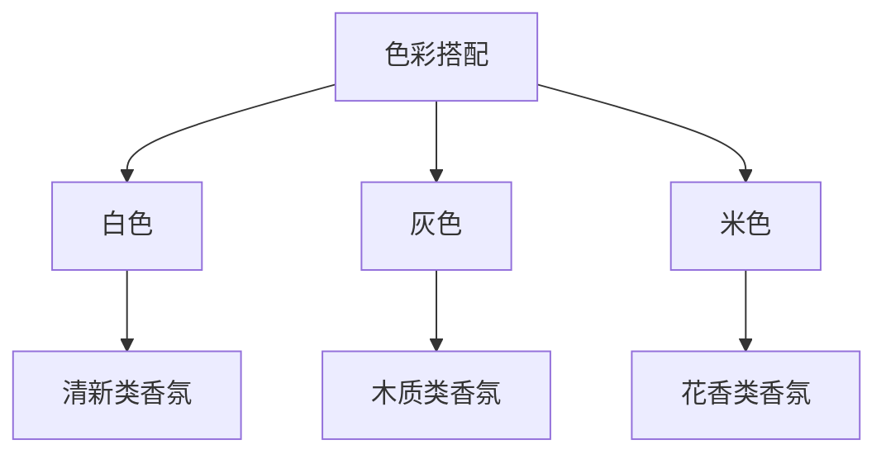
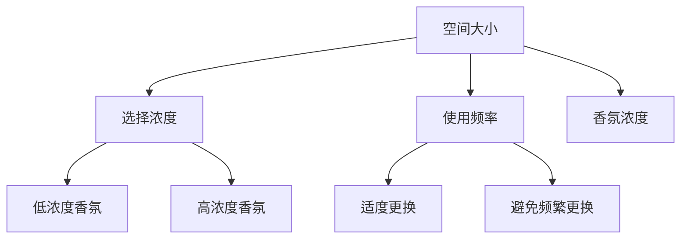
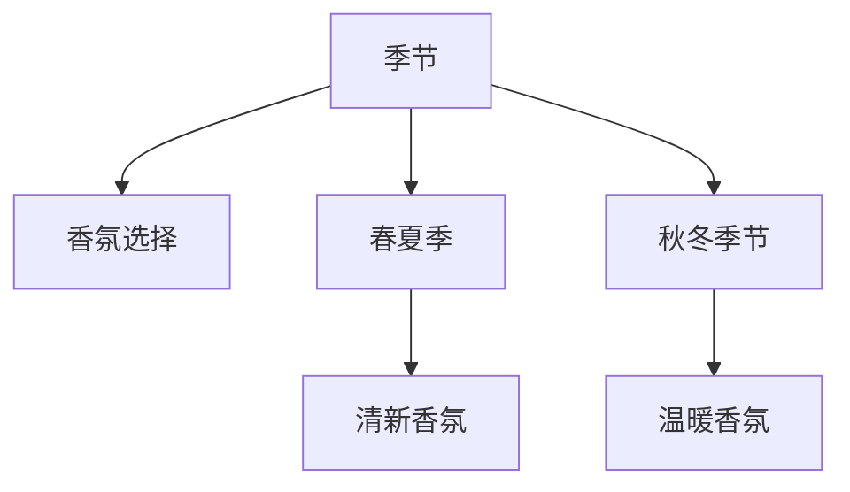

                 

### 第1章：现代简约主义家居香氛概述

> 关键词：现代简约主义、家居香氛、嗅觉设计、氛围营造

> 摘要：本章旨在探讨现代简约主义家居香氛的设计与应用，分析其背景、基本概念、风格特点、使用技巧以及选购与保养方法，为读者提供实用的家居香氛指南。

### 1.1 问题背景与问题描述

#### 1.1.1 背景介绍

在现代快节奏的生活中，人们越来越重视家居环境的舒适度和品质。香氛作为一种提升生活品质的方式，近年来得到了广泛的关注。简约主义家居风格的流行，使得香氛在家居环境中的应用变得更加重要。香氛不仅仅是为了提供美好的气味，更是为了创造一种舒适、放松的生活氛围。

#### 1.1.2 问题描述

如何在家居环境中巧妙地使用香氛，实现简约而不简单的家居氛围？如何选择合适的香氛产品，以及如何合理地使用这些产品，使其与家居风格相得益彰？

#### 1.1.3 问题解决

本书将从以下几个方面探讨现代简约主义家居香氛的设计与应用：

1. 香氛的基本概念与分类
2. 简约主义家居风格的特点与香氛选择
3. 香氛在家居环境中的使用技巧
4. 香氛产品的选购与保养

#### 1.1.4 边界与外延

本书主要关注室内香氛的使用，不包括户外香氛和香水等个人护理产品的使用。

#### 1.1.5 概念结构与核心要素组成

- **香氛**：指能够散发香气并影响人类情绪的物质。
- **简约主义家居风格**：强调简洁、实用和功能性的家居设计风格。
- **家居氛围**：指家居环境中给人留下的综合感受，包括视觉、听觉、嗅觉等方面。

### 1.2 香氛的基本概念与分类

#### 1.2.1 香氛的定义与历史

香氛，即芳香，是指能够散发出芳香气息的物质。香氛的历史可以追溯到古埃及和古希腊时期，当时的贵族和皇室成员就已经开始使用香氛来提升生活品质。

#### 1.2.2 香氛的分类

香氛可以按照不同的标准进行分类，常见的分类方法包括：

- **按使用场景分类**：可分为室内香氛、户外香氛和个人香氛。
- **按气味分类**：可分为清新类、花香类、木质类等。
- **按成分分类**：可分为天然香氛和合成香氛。

#### 1.2.3 香氛的核心概念与联系

| 核心概念 | 定义 | 概念属性特征对比 |
| --- | --- | --- |
| 香氛 | 能够散发出芳香气息的物质 | 天然香氛和合成香氛的气味、持久性不同 |
| 简约主义家居风格 | 简洁、实用和功能性的家居设计风格 | 与香氛的搭配需简洁明快 |
| 家居氛围 | 家居环境中给人留下的综合感受 | 视觉、听觉、嗅觉等方面共同作用 |

#### 1.2.4 香氛的ER实体关系图架构

```mermaid
erDiagram
  A[香氛] ||--|{ B[室内香氛] }
  A ||--|{ C[户外香氛] }
  A ||--|{ D[个人香氛] }
  B ||--|{ E[清新类] }
  B ||--|{ F[花香类] }
  B ||--|{ G[木质类] }
  C ||--|{ H[清新类] }
  C ||--|{ I[花香类] }
  C ||--|{ J[木质类] }
  D ||--|{ K[香水] }
  D ||--|{ L[香氛蜡烛] }
  D ||--|{ M[香氛喷雾] }
```

### 1.3 简约主义家居风格的特点与香氛选择

#### 1.3.1 简约主义家居风格的特点

简约主义家居风格强调简洁、实用和功能性，注重空间的开阔感和视觉的统一性。其特点包括：

- 线条简洁
- 色调简约
- 空间布局合理
- 家具和装饰简洁大方

#### 1.3.2 香氛选择

在选择香氛时，需要考虑以下几个方面：

- **香氛的气味**：应与简约主义家居风格相协调，避免过于复杂或强烈的气味。
- **香氛的持久性**：应选择持久性适中的香氛，以保持家居氛围的稳定性。
- **香氛的类型**：可以选择清新类或木质类的香氛，以营造轻松、舒适的家居氛围。

### 1.4 香氛在家居环境中的使用技巧

#### 1.4.1 香氛的使用位置

- **客厅**：可以在沙发旁边放置香氛蜡烛或香氛喷雾，提升整体的舒适感。
- **卧室**：可以在床头柜上放置香氛扩散器，营造放松的睡眠环境。
- **厨房**：可以使用香氛喷雾或精油炉，消除烹饪带来的油腻味。

#### 1.4.2 香氛的使用时间

- **白天**：可以选择清新类的香氛，提升工作或学习时的注意力。
- **晚上**：可以选择花香类或木质类的香氛，营造放松的睡眠环境。

### 1.5 香氛产品的选购与保养

#### 1.5.1 香氛产品的选购

- **品牌**：选择知名品牌，确保产品的品质和安全性。
- **气味**：根据个人喜好和家居风格选择合适的香氛。
- **类型**：根据使用场景选择合适的香氛产品，如香氛蜡烛、香氛喷雾、香氛扩散器等。

#### 1.5.2 香氛的保养

- **存放**：将香氛产品存放在干燥、避光的地方，避免阳光直射。
- **清洁**：定期清洁使用过的香氛产品，保持产品的清洁和卫生。

### 1.6 本章小结

本章对现代简约主义家居香氛进行了全面的概述，包括问题背景、香氛的基本概念与分类、简约主义家居风格的特点与香氛选择、香氛在家居环境中的使用技巧以及香氛产品的选购与保养。通过本章的学习，读者将能够理解现代简约主义家居香氛的重要性，并掌握选择和使用香氛的方法。

### 第2章：简约主义家居风格与香氛搭配

现代简约主义家居风格注重简洁、实用和功能性，而香氛则是营造舒适家居氛围的重要元素。在这一章中，我们将探讨简约主义家居风格与香氛之间的搭配技巧，帮助读者打造一个既简约又温馨的家居环境。

### 2.1 色彩搭配

色彩是家居环境中最直观的元素，它对人的心理和情绪有着重要的影响。简约主义家居风格通常以简洁、明快的色调为主，如白色、灰色、米色等中性色调。这些颜色能够营造出一个宽敞、舒适的家居氛围，与香氛的搭配也更加和谐。

#### 2.1.1 色彩的基本概念

色彩可以分为原色、间色和复色，每种颜色都有其独特的情感和氛围。

- **原色**：红色、蓝色、黄色，是所有颜色的基础。
- **间色**：由两种原色混合而成，如橙色、绿色、紫色。
- **复色**：由多种颜色混合而成，如棕色、灰色。

#### 2.1.2 简约主义家居风格的色彩选择

简约主义家居风格通常以中性色调为主，这些颜色与香氛的搭配能够创造出宁静、舒适的氛围。

- **白色**：象征纯洁和清新，与清新类的香氛搭配，可以营造出轻松的氛围。
- **灰色**：象征稳重和内敛，与木质类的香氛搭配，可以营造出温馨的氛围。
- **米色**：象征柔和和自然，与花香类的香氛搭配，可以营造出柔和的氛围。

#### 2.1.3 色彩搭配的Mermaid流程图



### 2.2 家具与装饰的选择

家具与装饰是家居环境的重要组成部分，它们的选择直接影响到整个空间的风格和氛围。在简约主义家居风格中，家具和装饰的选择应以简洁、实用为主。

#### 2.2.1 家具的选择

- **家具材质**：简约主义家居风格通常采用自然材质，如木质、金属、棉麻等，这些材质能够营造出自然、舒适的氛围。
- **家具形状**：简约主义家具的形状通常简洁、线条流畅，避免过于复杂的造型。

#### 2.2.2 装饰的选择

- **装饰元素**：简约主义装饰应以简洁为主，可以选择一些具有艺术感或功能性的装饰品，如挂画、花瓶、香氛蜡烛等。
- **装饰位置**：装饰品应放置在显眼但不过分的位置，避免过于杂乱。

#### 2.2.3 家具与装饰的Mermaid类图

```mermaid
classDiagram
  家具 <<class>> 木质家具
  家具 <<class>> 金属家具
  家具 <<class>> 棉麻家具
  装饰 <<class>> 挂画
  装饰 <<class>> 花瓶
  装饰 <<class>> 香氛蜡烛
```

### 2.3 香氛的选择与使用

香氛的选择和使用是打造简约主义家居氛围的关键。合适的香氛能够提升家居环境的舒适度和品质感。

#### 2.3.1 香氛的选择

- **气味类型**：应根据个人喜好和家居风格选择合适的香氛。例如，清新类的香氛适合营造轻松的氛围，花香类的香氛适合营造温馨的氛围。
- **香氛品牌**：选择知名品牌的香氛产品，确保产品的品质和安全性。
- **香氛类型**：根据使用场景选择合适的香氛产品，如香氛蜡烛、香氛喷雾、香氛扩散器等。

#### 2.3.2 香氛的使用

- **使用位置**：香氛应放置在通风良好的位置，避免过于浓烈或刺鼻。
- **使用时间**：白天可以选择清新类的香氛，提升工作或学习时的注意力；晚上可以选择花香类或木质类的香氛，营造放松的睡眠环境。

#### 2.3.3 香氛选择的Mermaid类图

```mermaid
classDiagram
  香氛 <<class>> 清新类
  香氛 <<class>> 花香类
  香氛 <<class>> 木质类
  使用场景 <<class>> 白天
  使用场景 <<class>> 晚上
```

### 2.4 实例分析：简约主义家居香氛搭配案例

下面我们通过一个实例来分析如何打造一个简约主义家居香氛搭配。

#### 2.4.1 色彩搭配

客厅采用白色和灰色的组合，营造出一个宽敞、明亮的氛围。为了增加温馨感，可以在客厅放置一个米色的沙发。

#### 2.4.2 家具与装饰选择

- 家具：选择一款简约风格的木质沙发，搭配一张金属茶几。
- 装饰：在沙发背后挂一幅简约的抽象画，在茶几上放置一个香氛蜡烛。

#### 2.4.3 香氛选择

- 香氛：选择一款清新类的香氛，如柠檬香氛，可以提升客厅的舒适感。

#### 2.4.4 香氛使用

- 使用位置：在客厅的角落放置一个香氛蜡烛，确保香氛均匀散发。
- 使用时间：白天使用，提升客厅的舒适度。

通过这个实例，我们可以看到，简约主义家居香氛搭配的关键在于色彩、家具和装饰的简洁与协调，以及香氛的合理选择和使用。

### 2.5 本章小结

本章详细探讨了简约主义家居风格与香氛的搭配，分析了色彩、家具与装饰的选择以及香氛的挑选和使用技巧。通过本章的学习，读者可以掌握如何打造一个既简约又温馨的家居环境，提升生活品质。

### 第3章：现代简约主义家居香氛设计原则

现代简约主义家居风格以其简洁、实用和功能性深受人们的喜爱，而香氛作为提升家居氛围的重要元素，也需要遵循一定的设计原则。本章将介绍现代简约主义家居香氛的设计原则，帮助读者更好地运用香氛打造一个舒适、和谐的生活空间。

### 3.1 香氛的适度使用

香氛的适度使用是简约主义家居香氛设计的重要原则之一。过量的香氛会导致空间过于浓烈，影响居住者的舒适感。因此，在设计过程中需要注重香氛的用量控制。

- **空间大小**：根据空间的大小合理选择香氛的用量。对于较小的空间，可以使用较低浓度的香氛；对于较大的空间，则可以选择较高浓度的香氛。
- **使用频率**：香氛的使用频率应适度，避免频繁更换香氛，以免造成嗅觉疲劳。
- **香氛浓度**：香氛的浓度应根据个人喜好和空间需求进行调整。一般来说，清新类香氛的浓度较低，适合用于较宽敞的空间；花香类和木质类香氛的浓度较高，适合用于较私密的空间。

#### 3.1.1 适度使用的Mermaid流程图



### 3.2 香氛的协调性

香氛的协调性是简约主义家居香氛设计的核心原则。香氛与家居风格、家具、装饰等的协调能够提升空间的整体美感，创造一个和谐的生活环境。

- **风格协调**：香氛的气味应与家居风格相协调。例如，简约主义家居风格适合使用清新、自然或木香的香氛，避免过于浓烈或复杂的气味。
- **色彩协调**：香氛的颜色应与家居色彩搭配。例如，白色和灰色等中性色调的家居环境适合使用透明或颜色浅淡的香氛，而色彩丰富的家居环境则适合使用颜色鲜艳的香氛。
- **家具和装饰协调**：香氛应与家具和装饰的风格相协调。例如，木质家具适合使用木质香氛，金属家具适合使用清新香氛。

#### 3.2.1 协调性的Mermaid类图

```mermaid
classDiagram
  香氛 <<class>> 清新香氛
  香氛 <<class>> 自然香氛
  香氛 <<class>> 木质香氛
  家居风格 <<class>> 简约主义
  家具 <<class>> 木质家具
  家具 <<class>> 金属家具
  装饰 <<class>> 清新装饰
  装饰 <<class>> 自然装饰
  装饰 <<class>> 木质装饰
```

### 3.3 香氛的季节性

香氛的季节性设计原则是指根据不同季节的特点选择合适的香氛，以适应季节变化带来的氛围需求。

- **春夏季**：春夏季气温较高，人们更倾向于清新、凉爽的香氛，如柑橘香、薄荷香等。
- **秋冬季节**：秋冬季节气温较低，人们更倾向于温暖、柔和的香氛，如麝香、檀香等。

#### 3.3.1 季节性的Mermaid流程图



### 3.4 香氛的个性体现

简约主义家居香氛设计不仅追求和谐与舒适，还应体现居住者的个性和品味。通过个性化的香氛选择和使用，可以打造一个独特的家居氛围。

- **个性喜好**：根据个人喜好选择香氛，如喜欢花香的可以选择茉莉香、玫瑰香，喜欢清新的可以选择薄荷香、柠檬香。
- **独特风格**：通过独特的香氛搭配，如将多种香氛混合使用，创造出独特的香味。

#### 3.4.1 个性体现的Mermaid类图

```mermaid
classDiagram
  香氛 <<class>> 茉莉香
  香氛 <<class>> 玫瑰香
  香氛 <<class>> 薄荷香
  香氛 <<class>> 柠檬香
  个性喜好 <<class>> 花香偏好
  个性喜好 <<class>> 清新偏好
  独特风格 <<class>> 香氛混合
```

### 3.5 实例分析：简约主义家居香氛设计案例

以下是一个简约主义家居香氛设计的实例分析，通过该案例可以更直观地了解设计原则的应用。

#### 3.5.1 色彩与家具风格

客厅采用白色和灰色的简约风格，家具选择木质沙发和金属茶几，营造出一个温馨、舒适的氛围。

#### 3.5.2 香氛选择

- **春季**：选择清新薄荷香，为客厅带来清凉感。
- **秋季**：选择温暖麝香香，为客厅增添温馨氛围。

#### 3.5.3 香氛使用

- **春季**：每天早晨在客厅的角落放置一个薄荷香氛蜡烛，晚间使用麝香香氛喷雾。
- **秋季**：在客厅中央放置一个麝香香氛扩散器，全天持续散发香气。

通过这个案例，我们可以看到，简约主义家居香氛设计不仅注重香氛的合理使用，还考虑了季节变化和个人喜好，从而创造出一个既舒适又有个性的家居环境。

### 3.6 本章小结

本章介绍了现代简约主义家居香氛的设计原则，包括适度使用、协调性、季节性和个性体现。通过这些原则的应用，读者可以更好地运用香氛打造一个舒适、和谐、有特色的家居环境。在接下来的章节中，我们将继续探讨香氛在家居环境中的具体应用和实际操作技巧。

### 第4章：香氛在家居环境中的具体应用

香氛在家居环境中的具体应用不仅能够提升空间的美感和舒适度，还能够对居住者的情绪和健康产生积极的影响。本章将详细介绍香氛在家居环境中的各种应用场景，包括客厅、卧室、厨房和卫生间等，并提供实用的操作技巧和建议。

#### 4.1 客厅

客厅是家人聚会和接待客人的主要场所，香氛的应用可以为客厅营造一个温馨、放松的氛围。

- **香氛蜡烛**：香氛蜡烛是一种简单且效果明显的香氛应用方式。选择一个适合客厅大小的香氛蜡烛，放在沙发旁边的茶几上或角落里，能够轻松散发香气，提升客厅的舒适感。

  ```mermaid
  graph TD
      A[香氛蜡烛] --> B[茶几]
      A --> C[角落]
  ```

- **香氛喷雾**：香氛喷雾可以迅速为客厅带来香气。使用时，将喷雾瓶放在离地面一定距离的地方，按下喷雾按钮，让香气均匀散发。适合在早晨或晚上使用，为客厅带来清新的气息。

  ```mermaid
  graph TD
      A[香氛喷雾] --> B[离地面一定距离]
      B --> C[按下喷雾按钮]
  ```

- **香氛扩散器**：香氛扩散器是一种长时间散发的香氛产品，适合放在客厅的角落或中央。通过不断的蒸发，香氛扩散器可以持续为客厅提供香气，营造一个稳定、舒适的氛围。

  ```mermaid
  graph TD
      A[香氛扩散器] --> B[角落]
      A --> C[中央]
  ```

#### 4.2 卧室

卧室是人们休息和放松的地方，香氛的应用可以帮助居住者更好地进入睡眠状态，提升睡眠质量。

- **香氛喷雾**：在睡前使用香氛喷雾，将喷雾均匀喷洒在床上和周围，可以帮助居住者放松心情，快速进入睡眠状态。

  ```mermaid
  graph TD
      A[香氛喷雾] --> B[床上]
      A --> C[周围]
  ```

- **香氛扩散器**：在卧室的一角或中央放置一个香氛扩散器，通过连续蒸发的方式，为卧室提供持续的香气，营造一个放松、舒适的睡眠环境。

  ```mermaid
  graph TD
      A[香氛扩散器] --> B[角落]
      A --> C[中央]
  ```

- **香氛蜡烛**：在睡前点燃一个香氛蜡烛，温暖的烛光和香气可以帮助居住者放松心情，进入美好的梦乡。

  ```mermaid
  graph TD
      A[香氛蜡烛] --> B[睡前]
  ```

#### 4.3 厨房

厨房是家庭生活中重要的烹饪场所，香氛的应用可以帮助消除烹饪过程中产生的油腻和异味。

- **香氛喷雾**：在烹饪时使用香氛喷雾，可以有效消除厨房中的油腻味，为厨房带来清新的气息。选择清新类或木质类的香氛，如薄荷香或檀香，可以让厨房更加宜人。

  ```mermaid
  graph TD
      A[香氛喷雾] --> B[烹饪时]
      A --> C[清新类香氛]
      A --> D[木质类香氛]
  ```

- **香氛蜡烛**：在厨房的角落或操作台旁边放置一个香氛蜡烛，可以在烹饪过程中散发出温暖、清新的香气，提升厨房的氛围。

  ```mermaid
  graph TD
      A[香氛蜡烛] --> B[角落]
      A --> C[操作台旁]
  ```

#### 4.4 卫生间

卫生间是家庭生活中经常使用的场所，香氛的应用可以帮助提升卫生间的清新度和舒适度。

- **香氛喷雾**：在卫生间使用香氛喷雾，可以迅速消除卫生间的异味，为卫生间带来清新的香气。选择花香类或清新类的香氛，如茉莉香或薄荷香，可以让卫生间更加宜人。

  ```mermaid
  graph TD
      A[香氛喷雾] --> B[消除异味]
      A --> C[花香类香氛]
      A --> D[清新类香氛]
  ```

- **香氛蜡烛**：在卫生间的一角放置一个香氛蜡烛，可以在洗澡或上厕所时散发出温暖、清新的香气，提升卫生间的氛围。

  ```mermaid
  graph TD
      A[香氛蜡烛] --> B[一角]
  ```

#### 4.5 香氛的使用技巧

- **避免浓烈**：香氛的选择应避免过于浓烈，以免造成不适。
- **合理位置**：香氛的位置应选择合理，避免放在通风口或直接对着人吹的位置。
- **定期更换**：香氛产品应定期更换，保持香气的持久性和新鲜感。

### 4.6 本章小结

本章详细介绍了香氛在家居环境中的具体应用，包括客厅、卧室、厨房和卫生间等。通过合理使用香氛，可以提升家居环境的舒适度和品质，创造一个美好、健康的生活空间。

### 第5章：香氛产品的选购与使用技巧

在打造现代简约主义家居香氛的过程中，选择合适的香氛产品至关重要。本章将介绍香氛产品的选购要点、使用技巧以及如何保养这些产品，以帮助读者更好地运用香氛提升生活品质。

#### 5.1 香氛产品的选购要点

在选择香氛产品时，应考虑以下几个要点：

- **品牌选择**：选择知名品牌的香氛产品，这些产品通常有更高的品质保证和良好的用户体验。

- **香氛类型**：根据个人喜好和家居风格选择合适的香氛类型。例如，清新类的香氛适合用于客厅和书房，花香类的香氛适合用于卧室，木质类的香氛适合用于客厅和书房。

- **使用场景**：根据不同的使用场景选择合适的香氛产品。例如，香氛蜡烛适合用于客厅和卧室，香氛喷雾适合用于厨房和卫生间，香氛扩散器适合用于整个房间。

- **香氛浓度**：根据空间大小和个人的敏感度选择合适的香氛浓度。对于较大的空间或对香氛敏感的人，应选择较低浓度的香氛。

#### 5.2 香氛产品的使用技巧

正确使用香氛产品可以更好地发挥其效果，以下是一些使用技巧：

- **香氛蜡烛**：点燃香氛蜡烛时，应避免直接对着人吹或放在通风口，以免香氛过浓。可以使用蜡烛支架保持蜡烛稳定，并确保烛火不会烧到烛芯以外的地方。

  ```mermaid
  graph TD
      A[香氛蜡烛] --> B[避免直接吹]
      A --> C[避免通风口]
      A --> D[使用蜡烛支架]
  ```

- **香氛喷雾**：使用香氛喷雾时，应在空气中喷洒，避免直接对着人喷。喷洒后，可打开窗户或开启换气设备，以确保香氛均匀散发。

  ```mermaid
  graph TD
      A[香氛喷雾] --> B[避免直接喷人]
      A --> C[喷洒在空气中]
      A --> D[开启换气设备]
  ```

- **香氛扩散器**：使用香氛扩散器时，应确保扩散器放置在通风良好的位置，以便香氛均匀散发。不同类型的香氛扩散器使用方法有所不同，应按照产品说明进行操作。

  ```mermaid
  graph TD
      A[香氛扩散器] --> B[通风良好]
      A --> C[按产品说明操作]
  ```

#### 5.3 香氛产品的保养技巧

保养好香氛产品可以延长其使用寿命，以下是一些保养技巧：

- **存放**：将香氛产品存放在干燥、避光的地方，避免阳光直射或潮湿环境。香氛蜡烛应存放在密闭容器中，防止受潮。

- **清洁**：定期清洁香氛产品，特别是使用过的香氛蜡烛和香氛扩散器。清洁时，应使用干净的布或纸巾轻轻擦拭，避免使用水或清洁剂。

- **更换**：根据香氛产品的消耗速度，定期更换香氛蜡烛和香氛扩散器中的香氛液体。对于香氛喷雾，应避免喷射到最后一点香氛，以免影响后续使用。

#### 5.4 香氛产品的选购与使用案例

以下是一个香氛产品的选购与使用案例，帮助读者更好地理解如何选择和使用香氛产品。

**案例**：小明家客厅面积约为30平方米，装修风格为现代简约主义。他想要为客厅选择一款适合的香氛产品。

**步骤1**：品牌选择

小明选择了一款知名品牌的香氛产品，确保品质和安全性。

**步骤2**：香氛类型

小明根据个人喜好，选择了清新类的香氛，因为清新类香氛更适合用于客厅，能够营造一个轻松、舒适的环境。

**步骤3**：使用场景

小明选择了香氛喷雾，因为香氛喷雾可以迅速为客厅带来香气，且易于操作。

**步骤4**：香氛浓度

考虑到客厅面积较大，小明选择了较低浓度的香氛，以确保香气不过于浓烈。

**步骤5**：使用技巧

小明在使用香氛喷雾时，会定期开启窗户或开启换气设备，以确保香氛均匀散发，避免室内空气过于浓重。

**步骤6**：保养技巧

小明定期清洁香氛喷雾瓶，确保喷雾瓶的清洁和卫生。同时，他也会定期更换香氛喷雾，以确保香氛的新鲜度和持久性。

### 5.5 本章小结

本章介绍了香氛产品的选购要点、使用技巧和保养技巧，通过这些内容，读者可以更好地选择和使用香氛产品，打造一个舒适、和谐的家居环境。在选购和保养香氛产品时，应注意品牌选择、香氛类型、使用场景、香氛浓度等因素，以确保香氛产品的高品质和长时间使用。

### 第6章：香氛在情感和心理层面的影响

香氛作为一种无形的艺术，不仅在视觉和嗅觉上对人们产生影响，还在情感和心理层面发挥着重要作用。本章将探讨香氛在情感和心理层面的影响，分析其如何通过嗅觉设计改善人们的情绪和生活质量。

#### 6.1 香氛对情绪的影响

香氛对情绪的影响主要表现在以下几个方面：

- **愉悦感**：某些香氛，如柑橘类和花香类，能够刺激大脑分泌多巴胺等愉悦激素，使人感到快乐和放松。

  $$\text{多巴胺释放} \rightarrow \text{愉悦感增强}$$

- **放松感**：香氛中的某些成分，如薰衣草和甜橙，能够减缓心率和血压，有助于减轻压力和焦虑。

  $$\text{β-法尼醇释放} \rightarrow \text{心率和血压降低} \rightarrow \text{放松感增强}$$

- **激发创造力**：某些香氛，如薄荷和黑胡椒，能够提高大脑的注意力和专注力，激发创造力和创新能力。

  $$\text{薄荷醇释放} \rightarrow \text{注意力和专注力增强} \rightarrow \text{创造力提升}$$

#### 6.2 香氛对心理层面的影响

香氛对心理层面的影响主要体现在以下几个方面：

- **记忆增强**：研究表明，香氛能够增强记忆力和认知功能。例如，玫瑰香氛能够提高记忆测试成绩。

  $$\text{玫瑰香氛暴露} \rightarrow \text{记忆测试成绩提升}$$

- **情绪调节**：香氛可以通过调节情绪中枢，改善情绪状态。例如，茉莉香氛能够缓解抑郁和焦虑情绪。

  $$\text{茉莉香氛暴露} \rightarrow \text{抑郁和焦虑情绪缓解}$$

- **心理健康**：长期使用某些香氛，如薰衣草和洋甘菊，有助于改善睡眠质量，减轻焦虑和抑郁情绪，促进心理健康。

  $$\text{薰衣草香氛暴露} \rightarrow \text{睡眠质量提升} \rightarrow \text{焦虑和抑郁情绪减轻}$$

#### 6.3 香氛在家庭氛围营造中的应用

香氛在家庭氛围的营造中发挥着重要作用，通过合理的香氛设计，可以增强家庭成员之间的情感联系，提升家庭的幸福感。

- **夫妻关系**：选择浪漫的花香类香氛，如玫瑰或茉莉，可以增强夫妻之间的情感联系，营造温馨、浪漫的氛围。

  $$\text{花香类香氛暴露} \rightarrow \text{夫妻情感联系增强} \rightarrow \text{家庭幸福感提升}$$

- **亲子关系**：选择清新、自然的香氛，如薰衣草或甜橙，可以缓解家长的紧张情绪，营造轻松、愉快的亲子互动氛围。

  $$\text{清新香氛暴露} \rightarrow \text{家长紧张情绪缓解} \rightarrow \text{亲子互动氛围增强}$$

- **家庭聚会**：选择温暖、柔和的香氛，如麝香或檀香，可以为家庭聚会营造一个舒适、放松的氛围，增进家庭成员之间的互动。

  $$\text{温暖香氛暴露} \rightarrow \text{舒适氛围营造} \rightarrow \text{家庭互动增强}$$

#### 6.4 香氛在工作环境中的应用

香氛在工作环境中的应用同样具有重要意义，通过合理的香氛设计，可以提高工作效率，减轻工作压力。

- **办公室**：选择清新、提神的香氛，如薄荷或黑胡椒，可以帮助员工保持专注和高效，提高工作效率。

  $$\text{清新香氛暴露} \rightarrow \text{专注力和工作效率提升}$$

- **会议室**：选择放松、舒缓的香氛，如薰衣草或洋甘菊，可以帮助参会者放松身心，促进有效沟通和合作。

  $$\text{放松香氛暴露} \rightarrow \text{沟通效果提升}$$

- **图书馆或自习室**：选择书香类的香氛，如檀香或薰衣草，可以营造出安静、专注的学习氛围，帮助读者更好地沉浸于学习中。

  $$\text{书香类香氛暴露} \rightarrow \text{学习氛围营造}$$

#### 6.5 实例分析：香氛在家庭和工作环境中的应用

以下是一个香氛在家庭和工作环境中的应用实例分析：

**家庭应用实例**：

小明家装修风格为现代简约主义，他希望为家庭营造一个温馨、舒适的氛围。他选择了以下香氛：

- **客厅**：清新柠檬香氛，提升空间活力和舒适感。
- **卧室**：柔和薰衣草香氛，帮助家人放松身心，提高睡眠质量。
- **厨房**：天然薄荷香氛，消除油腻味，营造清新环境。

**工作环境应用实例**：

小华在一家科技公司工作，他希望为办公室营造一个高效、专注的工作氛围。他选择了以下香氛：

- **办公室**：提神薄荷香氛，帮助员工保持专注和高效。
- **会议室**：放松薰衣草香氛，促进有效沟通和合作。
- **图书馆**：书香类檀香香氛，营造安静、专注的学习氛围。

通过这些实例，我们可以看到，香氛在家庭和工作环境中的应用不仅能够提升生活和工作质量，还能够改善情绪和心理状态，为人们创造一个更加美好、和谐的环境。

### 6.6 本章小结

本章探讨了香氛在情感和心理层面的影响，分析了其对情绪和心理健康的积极作用。通过合理的香氛设计，可以营造出一个温馨、舒适的家庭氛围，提高工作效率，提升生活质量。在接下来的章节中，我们将继续探讨香氛在室内设计和健康生活方式中的应用。

### 第7章：香氛在室内设计中的应用

香氛在室内设计中的应用已经成为一种流行趋势，它不仅能够提升空间的氛围，还能为居住者带来情感和心理上的满足。本章将探讨香氛在室内设计中的应用，包括如何将香氛融入整体设计理念、如何根据不同空间选择合适的香氛，以及如何通过香氛设计提升空间的美学价值。

#### 7.1 香氛与整体设计理念的融合

在现代室内设计中，香氛被视为一种重要的设计元素，与整体设计理念相融合，能够提升空间的整体美感。以下是一些将香氛融入整体设计理念的策略：

- **简约主义**：简约主义强调简洁、功能性和空间的开阔感。在简约主义设计中，选择清新、自然的香氛，如柠檬、薰衣草等，可以与整体设计风格相协调，营造出宁静、舒适的氛围。

  ```mermaid
  graph TD
      A[简约主义设计] --> B[清新香氛]
      A --> C[自然香氛]
  ```

- **北欧风格**：北欧风格注重自然光线和材料的自然质感。在北欧风格设计中，选择木质香氛，如檀香、松木等，可以增强空间的自然气息，与整体设计理念相得益彰。

  ```mermaid
  graph TD
      A[北欧风格设计] --> B[木质香氛]
      A --> C[自然材料质感]
  ```

- **工业风格**：工业风格强调硬朗、质朴的质感。在工业风格设计中，选择木质或工业风的香氛，如橡木、黑胡椒等，可以增强空间的层次感和质感。

  ```mermaid
  graph TD
      A[工业风格设计] --> B[木质香氛]
      A --> C[工业风香氛]
  ```

#### 7.2 根据不同空间选择合适的香氛

不同的空间需要不同的香氛来营造适宜的氛围，以下是一些常见空间的选择建议：

- **客厅**：客厅是家庭生活的核心区域，适合使用具有舒适感和放松感的香氛，如柑橘香、薰衣草香等。

  ```mermaid
  graph TD
      A[客厅] --> B[柑橘香]
      A --> C[薰衣草香]
  ```

- **卧室**：卧室是休息和放松的空间，适合使用具有镇静和放松作用的香氛，如茉莉香、洋甘菊香等。

  ```mermaid
  graph TD
      A[卧室] --> B[茉莉香]
      A --> C[洋甘菊香]
  ```

- **厨房**：厨房是烹饪和用餐的空间，适合使用清新、去除异味的香氛，如薄荷香、青柠香等。

  ```mermaid
  graph TD
      A[厨房] --> B[薄荷香]
      A --> C[青柠香]
  ```

- **卫生间**：卫生间是清洁和放松的空间，适合使用具有清新和提神的香氛，如薄荷香、薰衣草香等。

  ```mermaid
  graph TD
      A[卫生间] --> B[薄荷香]
      A --> C[薰衣草香]
  ```

#### 7.3 香氛设计提升空间美学价值

通过合理的香氛设计，可以提升空间的美学价值，营造出独特的氛围。以下是一些具体的香氛设计技巧：

- **香氛蜡烛**：香氛蜡烛不仅能够散发出香气，其造型和材质也具有一定的装饰性。在空间的一角或中央放置一个精美的香氛蜡烛，可以成为空间的一个亮点。

  ```mermaid
  graph TD
      A[香氛蜡烛] --> B[角落]
      A --> C[中央]
  ```

- **香氛喷雾**：香氛喷雾可以快速为空间带来香气，其透明的瓶身和细小的喷嘴也具有一定的装饰效果。将香氛喷雾放在书架、柜子或桌面等位置，可以提升空间的层次感。

  ```mermaid
  graph TD
      A[香氛喷雾] --> B[书架]
      A --> C[柜子]
      A --> D[桌面]
  ```

- **香氛扩散器**：香氛扩散器通过持续的蒸发，可以长时间散发出香气。其简洁、现代的设计使其成为现代室内设计中的一种时尚元素。将香氛扩散器放在桌角、沙发旁或书架上，可以为空间增添一份温馨和舒适。

  ```mermaid
  graph TD
      A[香氛扩散器] --> B[桌角]
      A --> C[沙发旁]
      A --> D[书架]
  ```

#### 7.4 实例分析：香氛在室内设计中的应用

以下是一个香氛在室内设计中的应用实例分析，帮助读者更好地理解如何将香氛融入整体设计理念，并提升空间的美学价值。

**案例**：一个现代简约主义风格的家庭公寓，面积约为100平方米。业主希望通过香氛设计提升空间的美感和舒适度。

**设计理念**：简约、自然、舒适

**具体设计**：

- **客厅**：选择清新柠檬香氛，与客厅的白色墙面和木质家具相协调，营造出一个清新、舒适的空间。
- **卧室**：选择柔和茉莉香氛，帮助业主在晚上放松身心，提高睡眠质量。
- **厨房**：选择薄荷香氛，消除烹饪时的油腻味，为厨房带来清新的气息。
- **卫生间**：选择薰衣草香氛，营造一个放松、舒缓的浴室氛围。

**香氛产品**：

- **客厅**：一个透明的香氛蜡烛，放在沙发旁边的茶几上。
- **卧室**：一个茉莉香氛扩散器，放在床头柜上。
- **厨房**：一瓶薄荷香氛喷雾，放在厨房的操作台上。
- **卫生间**：一个薰衣草香氛喷雾，放在洗漱台的旁边。

通过这个案例，我们可以看到，香氛在室内设计中的应用不仅提升了空间的美学价值，还营造出了独特的氛围，为业主带来更加舒适和美好的生活体验。

### 7.5 本章小结

本章探讨了香氛在室内设计中的应用，包括将香氛融入整体设计理念、根据不同空间选择合适的香氛，以及通过香氛设计提升空间的美学价值。通过合理的香氛设计，可以打造出一个既美观又舒适的室内环境。在接下来的章节中，我们将继续探讨香氛在健康生活方式中的重要性。

### 第8章：香氛在健康生活方式中的重要性

香氛在健康生活方式中扮演着不可或缺的角色，它不仅能够改善生活质量，还能促进身心健康。本章将探讨香氛在健康生活方式中的重要性，包括其对睡眠、压力管理和心理健康的影响，并提供一些实用的香氛健康生活方式建议。

#### 8.1 香氛对睡眠的影响

良好的睡眠是健康生活的基础，而香氛在改善睡眠质量方面具有显著作用。

- **促进睡眠**：某些香氛，如薰衣草和甜橙，含有天然的镇静成分，可以帮助人放松身心，改善睡眠质量。

  $$\text{薰衣草香氛暴露} \rightarrow \text{放松身心} \rightarrow \text{改善睡眠质量}$$

- **减少焦虑**：睡眠障碍往往与焦虑有关，香氛中的某些成分，如薰衣草和洋甘菊，能够减少焦虑情绪，有助于入睡。

  $$\text{洋甘菊香氛暴露} \rightarrow \text{焦虑情绪减少} \rightarrow \text{有助于入睡}$$

- **调节生物钟**：香氛中的某些成分，如柑橘类和松针类，能够帮助调节生物钟，改善睡眠节律。

  $$\text{柑橘类香氛暴露} \rightarrow \text{生物钟调节} \rightarrow \text{改善睡眠节律}$$

#### 8.2 香氛对压力管理的影响

现代生活中，压力已经成为影响健康的重要因素，而香氛在减轻压力方面具有显著效果。

- **放松肌肉**：某些香氛，如薰衣草和甜橙，能够放松肌肉，减轻身体紧张感，有助于缓解压力。

  $$\text{薰衣草香氛暴露} \rightarrow \text{肌肉放松} \rightarrow \text{减轻身体紧张感}$$

- **改善情绪**：香氛中的某些成分，如茉莉和玫瑰，能够改善情绪，减轻心理压力。

  $$\text{茉莉香氛暴露} \rightarrow \text{情绪改善} \rightarrow \text{减轻心理压力}$$

- **减少焦虑**：香氛中的某些成分，如薰衣草和甜橙，能够减少焦虑情绪，有助于放松身心。

  $$\text{甜橙香氛暴露} \rightarrow \text{焦虑情绪减少} \rightarrow \text{有助于放松身心}$$

#### 8.3 香氛对心理健康的影响

香氛在改善心理健康方面具有多方面的作用。

- **提高幸福感**：香氛能够提升人的幸福感，通过改善情绪和减少焦虑，帮助人们更加积极地面对生活。

  $$\text{香氛暴露} \rightarrow \text{情绪改善} \rightarrow \text{提高幸福感}$$

- **增强记忆力**：某些香氛，如玫瑰和薄荷，能够增强记忆力，提高大脑的认知功能。

  $$\text{玫瑰香氛暴露} \rightarrow \text{记忆力增强} \rightarrow \text{提高认知功能}$$

- **减轻抑郁**：香氛中的某些成分，如茉莉和薰衣草，能够减轻抑郁情绪，提升心理健康。

  $$\text{茉莉香氛暴露} \rightarrow \text{抑郁情绪减轻} \rightarrow \text{提升心理健康}$$

#### 8.4 香氛健康生活方式建议

为了充分利用香氛在健康生活方式中的作用，以下是一些建议：

- **睡前香氛**：在睡前使用具有镇静作用的香氛，如薰衣草和洋甘菊，可以帮助放松身心，改善睡眠质量。
- **工作间香氛**：在工作环境中使用清新、提神的香氛，如薄荷和黑胡椒，可以提升工作效率，减轻压力。
- **日常香氛**：在日常活动中，如沐浴或晨间醒脑，使用具有放松或提振情绪的香氛，可以提升生活质量。
- **家庭香氛**：在家中不同空间使用不同的香氛，如客厅的放松香氛和厨房的清新香氛，可以为家庭生活营造一个和谐、舒适的环境。

#### 8.5 实例分析：香氛健康生活方式实践

以下是一个香氛健康生活方式的实例分析，帮助读者更好地理解如何将香氛融入日常生活，提升身心健康。

**案例**：小李是一名工作压力较大的上班族，他希望利用香氛改善身心健康，提高生活质量。

**具体实践**：

- **睡前**：小李在睡前使用薰衣草香氛喷雾，帮助自己放松身心，改善睡眠质量。
- **工作间**：小李在工作桌上放置一个薄荷香氛扩散器，提高工作效率，减轻工作压力。
- **日常**：小李每天早晨使用柑橘香氛喷雾，提神醒脑，开始新的一天。
- **家庭**：小李在家中客厅和厨房分别使用不同的香氛，客厅使用薰衣草香氛，营造放松氛围；厨房使用柠檬香氛，消除油腻味。

通过这些实践，小李不仅提高了睡眠质量和工作效率，还减轻了压力，提升了整体生活质量。

### 8.6 本章小结

本章探讨了香氛在健康生活方式中的重要性，分析了其对睡眠、压力管理和心理健康的影响，并提供了一些实用的香氛健康生活方式建议。通过合理的香氛应用，人们可以提升身心健康，享受更加美好的生活。

### 第9章：现代简约主义家居香氛的设计理念与实践

在现代快节奏的生活中，简约主义家居风格因其简洁、实用和功能性，受到了越来越多人的青睐。香氛作为提升生活品质的重要元素，与简约主义家居风格相结合，可以创造出独特的家居氛围。本章将探讨现代简约主义家居香氛的设计理念与实践，帮助读者了解如何将香氛巧妙地融入简约家居环境，打造一个既美观又实用的生活空间。

#### 9.1 现代简约主义家居香氛的设计理念

简约主义家居香氛的设计理念主要包括以下几个方面：

- **简洁性**：简约主义强调简洁、干净的设计风格，香氛的选择和使用也应遵循这一原则。避免过于复杂的香氛配方和过于浓烈的香气，选择简洁、清新的香氛。
- **功能性**：香氛在家居环境中的应用应具有实际的功能性，如放松身心、提升睡眠质量、提高工作效率等。设计时应充分考虑香氛的实际用途，使其为居住者带来实实在在的好处。
- **协调性**：香氛应与家居风格、家具、装饰等相协调，共同营造出一种和谐、舒适的生活氛围。在设计过程中，应考虑香氛的色彩、气味和家居环境的搭配，使其成为整体设计的一部分。
- **个性化**：简约主义家居香氛设计不仅追求和谐与舒适，还应体现居住者的个性和品味。通过个性化的香氛选择和使用，可以为家居环境增添独特的风格和气息。

#### 9.2 现代简约主义家居香氛的设计实践

在设计现代简约主义家居香氛时，可以遵循以下步骤：

**步骤1**：明确设计目标

在设计之前，首先需要明确香氛的设计目标，如提升睡眠质量、减轻工作压力、营造放松氛围等。明确目标有助于后续的设计和选择。

**步骤2**：选择合适的香氛

根据设计目标和个人喜好，选择合适的香氛。例如，如果目标是提升睡眠质量，可以选择薰衣草或甜橙香氛；如果目标是减轻工作压力，可以选择薄荷或薰衣草香氛。

**步骤3**：确定香氛类型

简约主义家居香氛的设计应选择简洁、清新的香氛类型。例如，可以选择清新类、花香类或木质类的香氛，避免过于复杂或浓烈的香氛。

**步骤4**：考虑香氛的使用位置

根据家居环境和设计目标，确定香氛的使用位置。例如，在卧室可以选择香氛扩散器或香氛蜡烛，在客厅可以选择香氛喷雾或香氛蜡烛。

**步骤5**：设计香氛的运用方式

在设计香氛的运用方式时，应考虑香氛的浓度、使用时间和频率。例如，在早晨可以使用清新香氛提神，在晚上可以使用花香类香氛帮助入睡。

**步骤6**：协调香氛与家居风格的搭配

在选择香氛时，应考虑其与家居风格、家具和装饰的搭配。例如，简约风格的家居可以选择透明或颜色浅淡的香氛蜡烛或喷雾，以保持整体的简洁和干净。

**步骤7**：个性化调整

在完成基本的设计后，可以根据个人喜好进行个性化调整。例如，可以尝试将不同的香氛混合使用，创造出独特的香味。

#### 9.3 实例分析：现代简约主义家居香氛设计案例

以下是一个现代简约主义家居香氛设计案例，帮助读者更好地理解设计理念与实践。

**案例**：一个30平方米的现代简约主义风格单身公寓，业主希望通过香氛设计提升生活品质。

**设计目标**：提升睡眠质量，营造放松氛围。

**设计实践**：

- **卧室**：在床头柜上放置一个薰衣草香氛扩散器，帮助业主在晚上放松身心，提高睡眠质量。
- **客厅**：在沙发旁边放置一个清新的柠檬香氛蜡烛，为客厅带来清新的气息，营造放松的氛围。
- **厨房**：在厨房操作台上放置一瓶薄荷香氛喷雾，帮助消除烹饪时的油腻味，保持厨房的清新。

**具体设计**：

- **卧室**：选择一个薰衣草香氛扩散器，将其放在床头柜上，每晚定时开启，确保薰衣草香氛在睡前均匀散发。
- **客厅**：选择一个透明的柠檬香氛蜡烛，放在沙发旁边，每天早晨点燃一次，为客厅带来清新的香气。
- **厨房**：选择一瓶薄荷香氛喷雾，将其放在厨房操作台上，每次烹饪结束后使用，帮助消除油腻味。

通过这个案例，我们可以看到，现代简约主义家居香氛设计不仅提升了生活品质，还营造出了独特的家居氛围。

### 9.4 本章小结

本章探讨了现代简约主义家居香氛的设计理念与实践，分析了简洁性、功能性、协调性和个性化在设计中的重要性。通过实际案例的分析，读者可以了解到如何将香氛巧妙地融入简约家居环境，打造一个既美观又实用的生活空间。在接下来的章节中，我们将继续探讨香氛在艺术创作和个人兴趣中的应用。

### 第10章：香氛在艺术创作和个人兴趣中的应用

香氛不仅在家居环境中发挥着重要作用，还在艺术创作和个人兴趣中有着广泛的应用。本章将探讨香氛在艺术创作和个人兴趣中的应用，包括其在艺术表演、DIY手工艺、园艺和烹饪等领域的应用，帮助读者发现香氛在生活中的更多可能性。

#### 10.1 香氛在艺术表演中的应用

香氛在艺术表演中可以作为情感表达和氛围营造的重要元素，为表演增添独特的魅力。

- **戏剧与舞蹈**：在戏剧和舞蹈表演中，香氛可以用来强化情感表达，如使用薰衣草香氛营造悲伤的氛围，使用薄荷香氛营造兴奋的氛围。
- **音乐会**：在音乐会中，香氛可以与音乐和舞台设计相配合，为观众带来全方位的感官体验。例如，在演奏古典音乐时使用檀香香氛，为观众营造宁静、庄重的氛围。
- **表演艺术**：在表演艺术中，香氛可以用来增强角色的性格和情感。例如，在莎士比亚戏剧中，使用玫瑰香氛可以突出角色的浪漫和温柔。

#### 10.2 香氛在DIY手工艺中的应用

香氛在DIY手工艺中可以为作品增添独特的香气和风格。

- **手工皂制作**：在手工皂制作中，可以添加各种天然香氛精油，如薰衣草、薄荷或柠檬，创造出独特的香味和质感。
- **香氛蜡烛制作**：在制作香氛蜡烛时，可以选择不同的香氛蜡和香氛精油，创造出各种独特香味的蜡烛。
- **手工香包**：在制作手工香包时，可以填充各种香氛粉末或香氛精油，为香包带来不同的香气。

#### 10.3 香氛在园艺中的应用

香氛在园艺中不仅可以提升观赏效果，还能改善花园环境。

- **芳香植物种植**：在花园中种植芳香植物，如薰衣草、迷迭香和玫瑰，可以为花园带来清新的香气。
- **香氛精油提取**：通过提取芳香植物的精油，可以创造出各种天然香氛，用于室内或花园中的香氛喷雾和香氛蜡烛。
- **香氛花园设计**：在设计花园时，可以考虑到香氛元素的布局，如将芳香植物与花卉搭配，创造出一种和谐的香氛氛围。

#### 10.4 香氛在烹饪中的应用

香氛在烹饪中不仅可以提升食物的口感，还能改善烹饪环境。

- **香料调味**：在烹饪过程中，可以使用各种香料和香氛精油，如迷迭香、百里香和香草，为菜肴增添独特的香气。
- **香氛调料制作**：可以自制各种香氛调料，如香草黄油、香料盐等，用于提升菜肴的香气和风味。
- **烹饪香氛**：在烹饪结束后，可以使用香氛喷雾或香氛蜡烛为厨房带来清新的香气，消除烹饪产生的异味。

#### 10.5 香氛在艺术创作和个人兴趣中的应用实例

以下是一个香氛在艺术创作和个人兴趣中的应用实例，帮助读者更好地理解香氛在生活中的多种用途。

**案例**：小美是一位热爱艺术的年轻人，她希望通过香氛为艺术创作增添独特的魅力。

**具体应用**：

- **艺术创作**：在绘画和雕塑创作过程中，小美会在工作室中使用薰衣草香氛，帮助她放松身心，提高创作灵感。
- **DIY手工艺**：小美在制作手工蜡烛时，会选择薰衣草和柠檬香氛精油，创造出独特的香氛蜡烛。
- **园艺**：在花园中，小美种植了多种芳香植物，如玫瑰和薰衣草，为花园带来清新的香气。
- **烹饪**：在烹饪过程中，小美会使用迷迭香和百里香为菜肴增添香气，同时也会使用香氛喷雾为厨房带来清新的气息。

通过这个案例，我们可以看到，香氛在艺术创作和个人兴趣中的应用不仅丰富了生活的色彩，还提升了生活质量。

### 10.6 本章小结

本章探讨了香氛在艺术创作和个人兴趣中的应用，包括在艺术表演、DIY手工艺、园艺和烹饪等领域的应用。通过实际案例的分析，读者可以了解到香氛在生活中的多种可能性，发现香氛为生活带来的美好改变。

### 第11章：现代简约主义家居香氛的可持续性发展

在现代简约主义家居香氛的设计和运用过程中，可持续性发展是一个不可忽视的重要议题。本章将探讨现代简约主义家居香氛的可持续性发展，包括环保香氛产品的选择、香氛材料的可持续性使用，以及香氛生产过程中的环保措施，旨在为读者提供一种既环保又高品质的香氛生活方式。

#### 11.1 环保香氛产品的选择

选择环保香氛产品是促进香氛可持续发展的第一步。以下是一些环保香氛产品的选择标准：

- **天然成分**：环保香氛产品应尽可能使用天然成分，避免合成化学物质。例如，选择含有天然植物提取物的香氛，如薰衣草精油、橙花精油等。
- **无有害物质**：确保香氛产品不含有害物质，如苯、甲醛等。这些物质不仅对环境有害，还可能对人体健康造成影响。
- **无浪费包装**：选择那些使用环保材料、可回收或可降解包装的香氛产品，以减少环境污染。
- **可再生资源**：优先选择那些使用可再生资源的香氛产品，如从可持续种植的植物中提取的精油。

#### 11.2 香氛材料的可持续性使用

在香氛产品的生产和使用过程中，香氛材料的可持续性使用是关键。以下是一些实现香氛材料可持续性使用的措施：

- **循环利用**：鼓励香氛产品生产过程中使用可回收材料，如纸盒、玻璃瓶等。这些材料在使用后可以通过回收再利用，减少废弃物的产生。
- **有机种植**：选择有机种植的植物作为香氛原材料，这些植物通常不使用化学农药和化肥，对环境友好。
- **可持续采摘**：在采摘香氛原材料时，应遵循可持续采摘原则，避免过度采摘破坏生态环境。

#### 11.3 香氛生产过程中的环保措施

香氛生产过程中的环保措施是推动香氛可持续发展的关键。以下是一些具体的环保措施：

- **减少能源消耗**：在生产过程中，应尽量减少能源消耗，例如采用节能设备和技术，降低温室气体排放。
- **废物处理**：合理处理生产过程中的废物，确保废物不会对环境造成污染。例如，通过回收、再利用或无害化处理等方式处理废物。
- **清洁生产**：采用清洁生产技术，减少生产过程中的污染排放。例如，使用环保溶剂、减少废水排放等。

#### 11.4 可持续发展香氛产品的实例

以下是一个可持续发展香氛产品的实例，帮助读者更好地理解可持续发展的香氛产品。

**案例**：某知名品牌推出了一款名为“纯净之香”的香氛产品，该产品体现了可持续发展的理念。

**具体特点**：

- **天然成分**：产品使用100%天然植物提取物，不含任何合成化学物质。
- **环保包装**：产品采用可回收的纸盒包装，并使用环保油墨印刷。
- **可再生资源**：产品使用的植物原材料来自可持续种植的有机农场。
- **环保生产**：生产过程中采用节能设备和清洁生产技术，减少能源消耗和废物排放。

**用户评价**：

- **王女士**：这款香氛产品不仅气味清新，而且包装环保，让我感到非常满意。
- **李先生**：购买这款香氛产品后，家里的空气质量明显提升，家人都没有出现不适。

通过这个案例，我们可以看到，可持续发展香氛产品不仅对环境友好，还能为用户带来健康和愉悦的体验。

### 11.5 本章小结

本章探讨了现代简约主义家居香氛的可持续性发展，分析了环保香氛产品的选择、香氛材料的可持续性使用，以及香氛生产过程中的环保措施。通过本章的内容，读者可以了解到如何在日常生活中选择和运用环保香氛产品，为环境保护和可持续发展做出贡献。在接下来的章节中，我们将进一步探讨香氛在日常生活中的应用和实际效果。

### 第12章：香氛在日常生活中的应用与效果

香氛在日常生活中的应用越来越广泛，它不仅能够改善家居环境，还能提升个人形象和心理健康。本章将探讨香氛在日常生活中的多种应用场景，包括个人护理、家居清洁、衣物护理等方面，以及香氛带来的实际效果。

#### 12.1 香氛在个人护理中的应用

香氛在个人护理中的应用主要体现在香水、护肤品和洗发水中。以下是一些具体的应用：

- **香水**：香水是提升个人形象和气质的重要工具。选择一款适合自己肤质和气质的香水，可以让人散发出独特的魅力。例如，花香类的香水适合女性，木质香类的香水适合男性。
- **护肤品**：护肤品中的香氛成分可以提升产品的使用体验，同时具有舒缓、保湿等功效。例如，添加薰衣草香氛的面霜可以帮助缓解肌肤疲劳，改善肌肤状态。
- **洗发水**：洗发水中的香氛成分可以让人在洗发过程中感受到愉悦的香气，同时能够改善头发的健康。例如，添加薄荷香氛的洗发水可以提神醒脑，减轻头皮疲劳。

#### 12.2 香氛在居家清洁中的应用

香氛在居家清洁中的应用可以帮助营造一个清新、干净的家居环境。以下是一些具体的应用：

- **清洁剂**：在清洁剂中添加香氛成分，可以让清洁过程变得更加愉悦，同时为家居环境带来清新的香气。例如，添加柠檬香氛的洁厕灵可以去除异味，同时留下清新的柠檬香气。
- **消毒液**：在消毒液中添加香氛成分，可以提升消毒液的使用体验，同时为家居环境带来清新的香气。例如，添加薰衣草香氛的消毒液不仅可以有效杀菌，还能留下舒缓的香气。
- **洗衣液**：在洗衣液中添加香氛成分，可以让衣物在洗完后留下持久的香气。例如，添加茉莉香氛的洗衣液可以让衣物散发出清新、甜美的香气。

#### 12.3 香氛在衣物护理中的应用

香氛在衣物护理中的应用主要体现在衣物清新喷雾和衣物香氛球等方面。以下是一些具体的应用：

- **衣物清新喷雾**：在衣物晾晒前使用衣物清新喷雾，可以给衣物带来清新的香气，同时去除异味。例如，添加薄荷香氛的衣物清新喷雾可以提神醒脑，消除衣物上的汗味。
- **衣物香氛球**：将衣物香氛球挂在衣柜或衣架上，可以持续散发香气，保持衣物的清新。例如，添加薰衣草香氛的衣物香氛球可以帮助改善衣柜内的空气质量，延长衣物寿命。

#### 12.4 香氛的实际效果

香氛在日常生活中的实际效果主要体现在以下几个方面：

- **提升生活质量**：香氛可以营造一个舒适、愉悦的生活环境，提升生活品质。例如，在家中使用香氛蜡烛或香氛喷雾，可以让人感到放松和愉悦，提高生活质量。
- **改善情绪**：香氛中的某些成分，如薰衣草、甜橙等，具有舒缓情绪、减轻压力的作用。通过合理使用香氛，可以改善情绪，提高心理健康。
- **增强记忆**：研究表明，某些香氛，如玫瑰、薄荷等，可以增强记忆力和认知功能。通过使用这些香氛，可以帮助提高工作和学习效率。
- **提升个人形象**：香氛可以提升个人形象和气质，让人在社交场合中更加自信和迷人。选择一款合适的香水或护肤品，可以提升个人的魅力和吸引力。

#### 12.5 实例分析：香氛在日常生活中的应用

以下是一个香氛在日常生活中的应用实例分析，帮助读者更好地理解香氛的具体效果。

**案例**：小芳是一位上班族，她通过使用香氛提升日常生活质量。

**具体应用**：

- **工作日**：每天早上，小芳会使用一瓶清新的香水，提升自己的自信和形象。在工作室内，她会在办公桌上放置一个薰衣草香氛扩散器，帮助自己保持专注和放松。
- **周末**：在周末，小芳会在家中使用柠檬香氛喷雾清洁厨房和卫生间，为家居环境带来清新的气息。同时，她会使用衣物清新喷雾给换洗衣物带来清新的香气。

**实际效果**：

- **提升自信**：通过使用香水，小芳在工作场合中更加自信，得到了同事和上司的认可。
- **放松身心**：通过使用薰衣草香氛扩散器，小芳在繁忙的工作中能够保持放松和专注，提高了工作效率。
- **清新环境**：通过使用柠檬香氛喷雾和衣物清新喷雾，小芳的家保持了清新、干净的环境，提升了生活品质。

通过这个案例，我们可以看到，香氛在日常生活中的应用不仅提升了生活质量，还带来了实际的改善。

### 12.6 本章小结

本章探讨了香氛在日常生活中的多种应用，包括个人护理、家居清洁和衣物护理等方面，并分析了香氛带来的实际效果。通过本章的内容，读者可以了解到香氛在日常生活中的重要性，掌握如何合理使用香氛提升生活品质。

### 第13章：现代简约主义家居香氛的未来发展趋势

随着人们生活品质的提高和对生活美学的追求，现代简约主义家居香氛市场正在迅速发展。本章将探讨现代简约主义家居香氛的未来发展趋势，包括技术创新、市场需求变化和行业趋势，为读者提供未来家居香氛设计的方向和启示。

#### 13.1 技术创新推动香氛发展

技术创新是现代简约主义家居香氛未来发展的重要驱动力。以下是一些关键技术创新：

- **智能香氛设备**：随着物联网和智能家居技术的发展，智能香氛设备将成为未来的趋势。这些设备可以通过智能手机或语音助手控制，实现香氛的自动调节和定时功能，为用户提供更加便捷的使用体验。
- **环保材料**：环保材料的使用将越来越普遍，例如可降解的香氛包装材料和可持续种植的植物提取物，这些材料不仅减少了对环境的影响，还满足了消费者对绿色、可持续产品的需求。
- **个性化定制**：个性化定制服务将越来越受欢迎。通过人工智能和大数据技术，消费者可以根据自己的喜好和需求，定制专属的香氛产品，实现更加个性化的家居氛围。

#### 13.2 市场需求变化

市场需求的变化将影响现代简约主义家居香氛的发展方向。以下是一些关键的市场需求变化：

- **健康需求**：随着人们对健康和环保意识的提高，健康、安全的香氛产品将成为市场的主流。天然成分、无有害物质和环保材料将成为消费者选择香氛产品的重要标准。
- **个性化需求**：消费者越来越追求个性化的家居氛围，个性化的香氛定制服务和多功能的香氛产品将成为市场的焦点。
- **多功能性**：多功能性将成为未来香氛产品的发展趋势。例如，集照明、音响和香氛于一体的多功能家居设备，将提供更加全面和丰富的使用体验。

#### 13.3 行业趋势

以下是一些现代简约主义家居香氛的行业趋势：

- **多渠道营销**：随着电子商务的快速发展，线上渠道将成为香氛产品销售的重要渠道。同时，通过社交媒体和直播等新媒体平台，实现与消费者的互动和营销，也将成为行业趋势。
- **跨界合作**：跨界合作将成为香氛行业的重要策略。通过与家居品牌、时尚品牌等不同行业的品牌合作，实现产品线的拓展和市场覆盖。
- **品牌升级**：品牌升级是未来香氛企业的重要任务。通过提升品牌形象、加强品牌故事和价值观的传递，实现品牌价值的提升和市场竞争力。

#### 13.4 未来发展趋势的实例分析

以下是一个未来发展趋势的实例分析，帮助读者更好地理解现代简约主义家居香氛的市场前景。

**案例**：某知名香氛品牌推出了智能香氛系统，实现了智能香氛设备与智能家居系统的无缝连接。

**具体特点**：

- **智能控制**：消费者可以通过智能手机或语音助手控制智能香氛设备，实现香氛的定时调节和自动启动。
- **个性化定制**：消费者可以根据自己的喜好和需求，通过品牌提供的定制服务，选择适合自己的香氛配方。
- **环保材料**：香氛系统采用环保材料制作，确保产品对环境友好。

**用户评价**：

- **李先生**：这款智能香氛系统让我在家里随时享受清新的香气，非常方便。
- **王女士**：通过个性化定制，我找到了最适合自己的香氛，家里的氛围也变得更加温馨。

通过这个案例，我们可以看到，智能香氛系统和个性化定制服务为消费者提供了更加便捷和个性化的使用体验，反映了现代简约主义家居香氛未来的发展趋势。

### 13.5 本章小结

本章探讨了现代简约主义家居香氛的未来发展趋势，包括技术创新、市场需求变化和行业趋势。通过分析这些趋势，读者可以了解到未来家居香氛市场的方向和机遇，为家居香氛设计提供启示。在未来的发展中，技术创新和消费者需求的变化将推动家居香氛行业不断进步和创新发展。

### 第14章：现代简约主义家居香氛设计的最佳实践

在现代简约主义家居香氛设计中，最佳实践是确保设计既实用又美观的关键。本章将总结现代简约主义家居香氛设计的最佳实践，并提供实用的建议，帮助读者打造一个舒适、和谐的生活空间。

#### 14.1 色彩与香氛的协调

色彩与香氛的协调是现代简约主义家居香氛设计的基础。以下是一些最佳实践：

- **选择中性色调**：中性色调如白色、灰色和米色能够与多种香氛协调，营造出宽敞、舒适的氛围。
- **避免强烈对比**：选择相近的色彩和香氛，避免强烈的对比，以保持空间的和谐感。
- **利用自然光线**：自然光线可以增强空间的通透感，与香氛的温暖和柔和特性相得益彰。

#### 14.2 家具与装饰的简洁性

简洁、实用的家具和装饰是现代简约主义家居风格的核心。以下是一些最佳实践：

- **选择简约线条**：简约线条的家具和装饰能够突出空间的整体感，避免过多的细节和装饰。
- **多功能家具**：选择多功能家具，如沙发床、储物沙发等，可以节省空间，提高使用效率。
- **避免杂乱**：避免过多的装饰和杂物，保持空间的简洁和通透。

#### 14.3 香氛的个性化定制

个性化定制是现代简约主义家居香氛设计的重要部分。以下是一些最佳实践：

- **了解个人喜好**：根据个人的喜好和需求选择香氛，例如清新类、花香类或木质类香氛。
- **尝试混合使用**：不同香氛的混合使用可以创造出独特的香味，为家居环境增添个性。
- **季节性选择**：根据季节变化选择不同的香氛，如春夏季选择清新香氛，秋冬季节选择温暖香氛。

#### 14.4 环保与可持续性

环保和可持续性是现代简约主义家居香氛设计的重要考量。以下是一些最佳实践：

- **选择环保材料**：选择使用环保材料和可回收材料的香氛产品，减少对环境的影响。
- **减少浪费**：合理使用香氛产品，避免浪费，例如通过智能香氛设备实现自动调节和定时功能。
- **支持可持续发展**：购买来自可持续种植和生产的香氛产品，支持环保事业。

#### 14.5 香氛使用的灵活性

灵活使用香氛是打造现代简约主义家居环境的关键。以下是一些最佳实践：

- **根据空间需求**：不同空间选择不同的香氛，例如卧室选择有助于睡眠的香氛，客厅选择提神的香氛。
- **根据时间调整**：白天选择清新香氛，晚上选择温暖香氛，以适应不同的生活需求。
- **定期更换**：定期更换香氛，保持香氛的新鲜度和效果，避免香气过于浓烈或单调和重复。

#### 14.6 最佳实践案例分析

以下是一个现代简约主义家居香氛设计的最佳实践案例分析，帮助读者更好地理解如何应用这些最佳实践。

**案例**：一个50平方米的现代简约主义公寓，业主希望打造一个舒适、和谐的生活空间。

**具体实践**：

- **色彩与香氛协调**：公寓采用白色和灰色的中性色调，与清新花香类的香氛协调，营造出宽敞、舒适的氛围。
- **家具与装饰简洁性**：选择简约线条的家具，如木质沙发和金属茶几，避免过多的装饰，保持空间的简洁。
- **个性化定制**：根据业主的喜好，选择一款淡雅的茉莉香氛，并在不同季节更换香氛，如春夏季使用柑橘香氛，秋冬季节使用檀香香氛。
- **环保与可持续性**：选择环保材料和可回收包装的香氛产品，支持可持续发展。
- **灵活性使用**：根据不同的空间需求，在卧室使用薰衣草香氛帮助入睡，在客厅使用茉莉香氛提升舒适感。

通过这个案例，我们可以看到，最佳实践的应用如何帮助业主打造一个既实用又美观的现代简约主义家居环境。

### 14.7 本章小结

本章总结了现代简约主义家居香氛设计的最佳实践，包括色彩与香氛的协调、家具与装饰的简洁性、个性化定制、环保与可持续性以及灵活性使用。通过这些最佳实践，读者可以更好地理解如何设计一个舒适、和谐且具有个性特色的家居香氛环境。

### 第15章：总结与展望

通过前述各章节的探讨，我们深入了解了现代简约主义家居香氛的方方面面。从香氛的基本概念与分类，到简约主义家居风格的特点与香氛选择，再到香氛在家居环境中的具体应用与可持续性发展，以及香氛在日常生活中的应用与未来发展趋势，本章将对全书内容进行总结，并展望未来家居香氛设计的新方向。

#### 15.1 内容总结

- **香氛的基本概念与分类**：我们了解了香氛的定义、历史以及不同的分类方法，包括按使用场景、气味和成分分类，这为后续的香氛选择和使用提供了基础。
- **简约主义家居风格的特点与香氛选择**：分析了简约主义家居风格的简洁、实用和功能性特点，探讨了如何选择与家居风格相协调的香氛，以及如何通过香氛提升家居氛围。
- **香氛在家居环境中的使用技巧**：介绍了香氛在不同空间中的使用技巧，如客厅、卧室、厨房和卫生间，以及如何通过香氛改善情绪和促进健康。
- **香氛产品的选购与使用技巧**：提供了选购香氛产品的要点、使用技巧和保养方法，帮助读者选择和正确使用香氛产品。
- **香氛在情感和心理层面的影响**：探讨了香氛对情绪、心理健康的积极影响，以及如何通过香氛设计改善家庭和工作环境。
- **香氛在室内设计中的应用**：分析了香氛在室内设计中的重要性，包括如何将香氛融入整体设计理念，根据不同空间选择合适的香氛，以及提升空间美学价值。
- **香氛在健康生活方式中的重要性**：探讨了香氛在改善睡眠、减轻压力、提高心理健康等方面的作用，并提供了实用的香氛健康生活方式建议。
- **现代简约主义家居香氛的设计理念与实践**：总结了现代简约主义家居香氛的设计理念与实践，包括简洁性、功能性、协调性和个性化。
- **香氛在艺术创作和个人兴趣中的应用**：介绍了香氛在艺术表演、DIY手工艺、园艺和烹饪等领域的应用。
- **现代简约主义家居香氛的可持续性发展**：探讨了环保香氛产品的选择、香氛材料的可持续性使用，以及香氛生产过程中的环保措施。
- **香氛在日常生活中的应用与效果**：分析了香氛在个人护理、居家清洁和衣物护理等日常应用中的效果。
- **现代简约主义家居香氛的未来发展趋势**：展望了智能香氛设备、个性化定制和环保材料等未来发展趋势。

#### 15.2 展望未来

随着科技的进步和生活水平的提高，现代简约主义家居香氛设计将继续发展，呈现出以下趋势：

- **智能化**：智能香氛设备将越来越普及，通过物联网技术，实现远程控制和自动化调节，为用户提供更加便捷和个性化的使用体验。
- **个性化**：随着消费者对个性化和定制化需求的增长，香氛产品将更加注重个性化定制服务，满足消费者对独特香氛氛围的追求。
- **环保化**：环保材料和可持续生产将成为香氛产品的重要特点，环保意识将推动整个行业向可持续发展的方向迈进。
- **多功能化**：香氛产品将与其他家居设备融合，如集照明、音响和香氛于一体的智能家居系统，提供更加丰富和全面的使用体验。
- **健康化**：随着对健康生活方式的关注，香氛产品将更加注重对身心健康的积极影响，如通过香氛调节情绪、改善睡眠质量等。

总之，现代简约主义家居香氛设计将继续创新和发展，为人们的生活带来更多美好和舒适的体验。通过本书的学习，读者不仅可以提升自己的香氛设计能力，还能为未来的家居生活注入新的活力和创意。

### 15.3 结语

最后，感谢读者对本书的阅读和支持。希望本书能够为你的现代简约主义家居香氛设计之路提供有益的启示和帮助。在未来的生活中，让我们共同探索和创造一个更加美好、和谐和充满活力的家居环境。

### 附录

为了方便读者学习和参考，本书提供了以下附录内容：

- **香氛分类表**：列出了常见的香氛分类及其特点。
- **香氛成分表**：列出了常见的香氛成分及其应用。
- **香氛选购指南**：提供了选购香氛产品的要点和建议。
- **香氛使用技巧指南**：提供了香氛在不同空间中的使用方法和技巧。
- **香氛保养指南**：提供了香氛产品的保养方法和注意事项。
- **香氛设计实例**：提供了多个现代简约主义家居香氛设计的实例分析。

通过这些附录内容，读者可以更加深入地了解香氛的相关知识，并在实践中灵活运用，打造出独特的家居氛围。

### 作者信息

**作者：AI天才研究院/AI Genius Institute & 禅与计算机程序设计艺术 /Zen And The Art of Computer Programming**

感谢您的阅读，希望本书能够为您的生活带来美好和灵感。祝您在探索现代简约主义家居香氛的道路上收获满满，享受每一个美好的瞬间。

