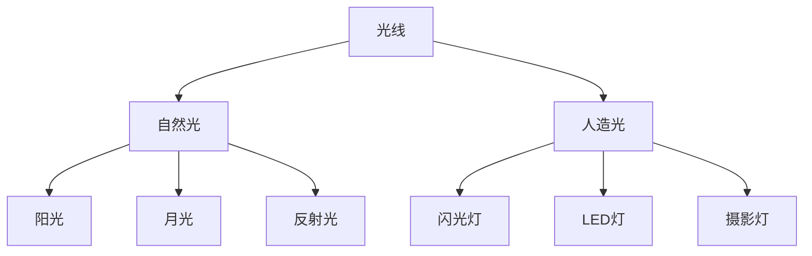
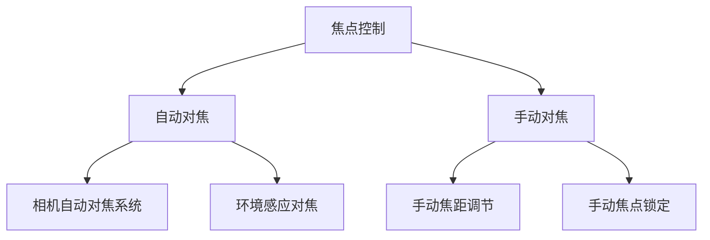
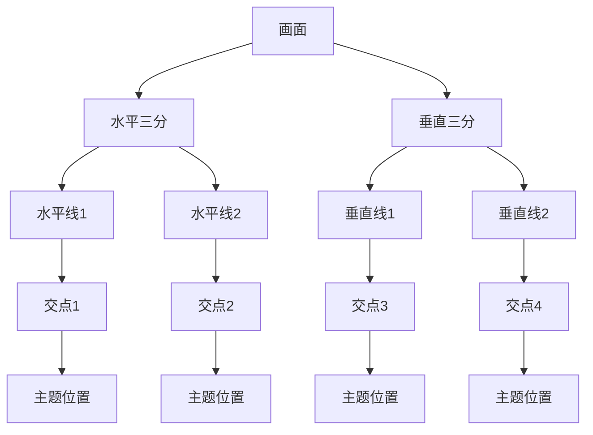
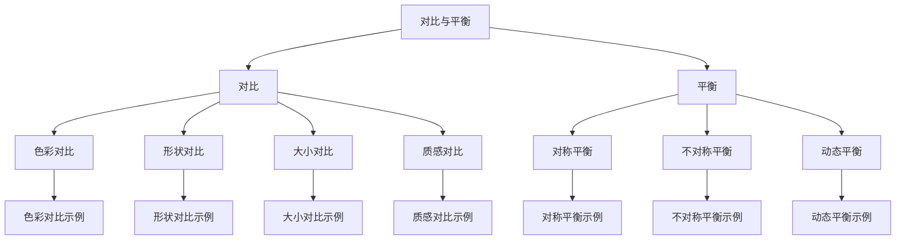
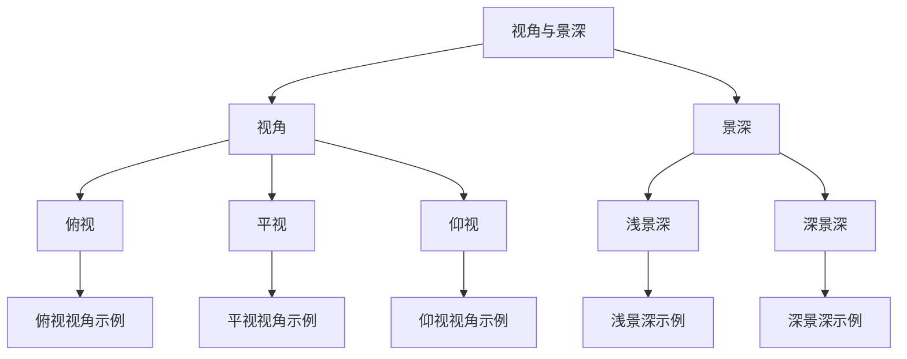
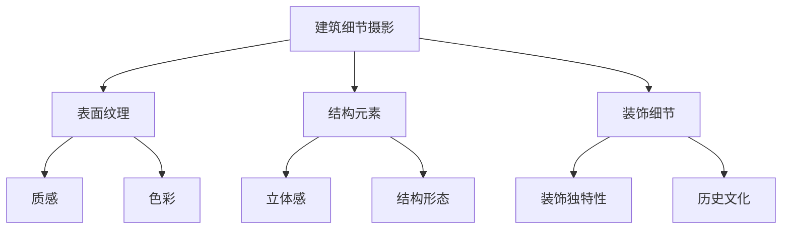
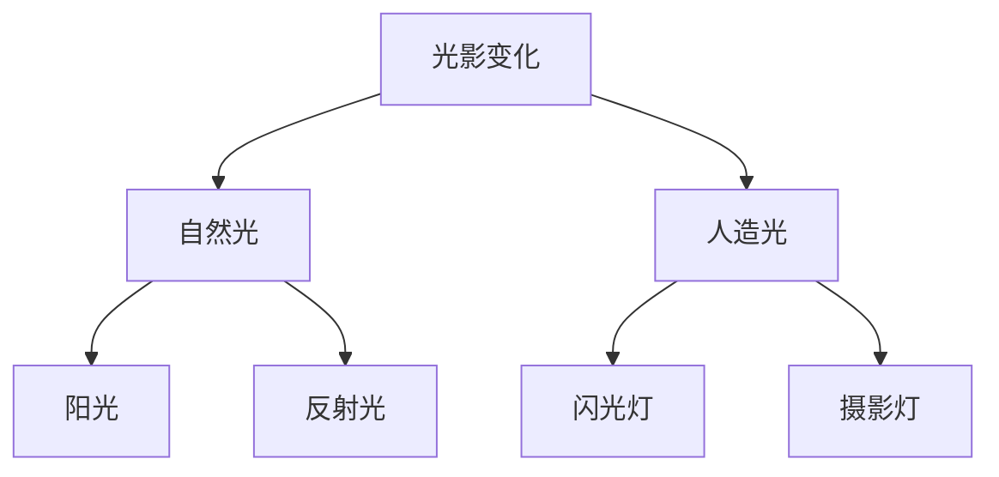
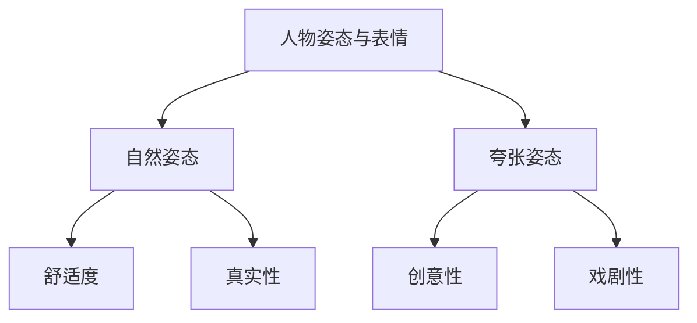

                 

## 现代简约主义摄影：捕捉生活本质的影像艺术

### 关键词：
- **现代摄影**、**简约主义**、**生活本质**、**影像艺术**、**构图技巧**、**光线运用**

### 摘要：
本文旨在探讨现代简约主义摄影的魅力，通过深入解析其历史背景、核心特征、摄影技巧和构图法则，揭示如何通过摄影捕捉生活的本质。文章还将介绍简约主义摄影的材料与设备选择，并通过实战案例分析，展示如何在户外自然景观、城市建筑和人物摄影中运用简约主义摄影风格。最后，我们将分析简约主义摄影作品的艺术风格和发展趋势，为摄影爱好者提供有价值的实践指导和理论支持。

### 设计思路

在撰写这篇关于现代简约主义摄影的技术博客文章时，我们的设计思路遵循以下步骤：

1. **确定整体结构**：
   - **引言**：介绍简约主义摄影的概念和重要性。
   - **第一部分：简约主义摄影基础**：详细讲解简约主义摄影的基本原则和技巧。
   - **第二部分：简约主义摄影实践**：通过具体场景分析，展示简约主义摄影的应用。
   - **第三部分：简约主义摄影艺术风格**：探讨简约主义摄影的艺术价值和未来趋势。
   - **结语**：总结简约主义摄影的价值和对摄影者的启示。

2. **细分章节内容**：
   - **第1章**：概述简约主义摄影的发展历程和定义。
   - **第2章**：探讨简约主义摄影的核心技巧，如光线和焦点控制。
   - **第3章**：讲解简约主义摄影的构图法则，如三分法、对比与平衡。
   - **第4章**：介绍简约主义摄影所需的材料和设备选择。

3. **嵌入图表**：
   - 在相关章节中嵌入核心概念、原理、算法的流程图、ER图、类图、架构图和序列图，以便读者更好地理解。

4. **确保数学模型的准确性**：
   - 对于涉及数学模型的章节，确保数学公式的准确性，并使用LaTeX格式进行排版。

5. **编写代码示例**：
   - 为讲解算法原理和系统实现，编写Python源代码示例，并加以解释。

6. **添加实战案例分析**：
   - 在每个章节的最后，添加实际的案例分析和详细讲解，帮助读者理解概念和原理。

7. **总结和拓展**：
   - 在每个章节的最后，总结核心要点，给出注意事项、最佳实践 tips 和拓展阅读建议。

### 目录大纲

```markdown
----------------------------------------------------------------
# 《现代简约主义摄影：捕捉生活本质的影像艺术》目录大纲

## 第一部分：简约主义摄影基础

### 第1章：简约主义摄影概述

#### 1.1 问题背景与定义
#### 1.2 历史发展
#### 1.3 简约主义摄影的核心特征

### 第2章：简约主义摄影技巧

#### 2.1 光线运用
#### 2.2 焦点控制
#### 2.3 构图原则

### 第3章：简约主义摄影构图法则

#### 3.1 三分法
#### 3.2 对比与平衡
#### 3.3 视角与景深

### 第4章：简约主义摄影材料与设备

#### 4.1 相机选择
#### 4.2 镜头与附件
#### 4.3 后期处理工具

## 第二部分：简约主义摄影实践

### 第5章：户外自然景观摄影

#### 5.1 拍摄地点选择
#### 5.2 季节与光线
#### 5.3 案例分析

### 第6章：城市建筑摄影

#### 6.1 建筑细节
#### 6.2 光影变化
#### 6.3 案例分析

### 第7章：人物摄影

#### 7.1 人物姿态与表情
#### 7.2 后期处理技巧
#### 7.3 案例分析

## 第三部分：简约主义摄影艺术风格

### 第8章：简约主义摄影作品赏析

#### 8.1 经典作品分析
#### 8.2 新兴摄影师介绍
#### 8.3 个人风格的形成

### 第9章：简约主义摄影的发展趋势

#### 9.1 数字技术的应用
#### 9.2 跨界融合的趋势
#### 9.3 持续创新的方向

## 第10章：结语

#### 10.1 简约主义摄影的价值
#### 10.2 摄影者的成长
#### 10.3 拓展阅读

----------------------------------------------------------------
```

通过这样的结构设计，文章不仅逻辑清晰，而且内容丰富，能够全面系统地介绍简约主义摄影的各个方面，帮助读者深入理解并掌握这一摄影艺术风格。

## 第1章：简约主义摄影概述

### 1.1 问题背景与定义

在摄影技术快速发展的今天，摄影已经成为人们记录生活、表达情感和分享世界的重要手段。然而，随着摄影器材的不断更新和拍摄技术的日益复杂，摄影艺术也逐渐偏离了其最初的初衷——捕捉生活本质的瞬间。现代摄影面临着诸多挑战，如拍摄过度、信息过载和形式主义等，这些现象使得许多摄影作品失去了应有的简洁与纯粹。

**问题背景**：现代摄影中的形式主义和过度修饰，导致摄影作品失去了真实感和自然美。摄影者过于追求技术参数和构图技巧，而忽视了照片所传递的情感和故事。这种情况下，简约主义摄影应运而生，成为一股清新的摄影潮流。

**问题描述**：如何在现代摄影中回归本质，以简洁、纯粹的方式捕捉生活中的美好瞬间，成为摄影家们关注的焦点。

**问题解决**：简约主义摄影以其独特的审美视角，通过去除杂乱无章的元素，专注于主题的呈现，从而捕捉到生活本质的瞬间。这种摄影风格强调简洁、纯粹和真实的表达，帮助摄影者重新审视摄影艺术的本质。

**边界与外延**：简约主义摄影不仅是一种摄影风格，更是一种生活态度和艺术理念。它鼓励摄影者在拍摄过程中保持专注，摒弃形式主义，专注于情感和故事的传达。这种风格适用于各种摄影题材，从自然景观到城市建筑，从人物肖像到日常生活，都能展现出其独特的魅力。

**概念结构与核心要素组成**：简约主义摄影的核心要素包括构图、光线、主题等。构图强调简洁、平衡和节奏；光线运用注重自然光和光影效果；主题则强调情感和故事的表达。这些要素相互配合，共同构成了简约主义摄影的独特风格。

### 1.2 历史发展

简约主义摄影并不是一个新兴的概念，它有着悠久的历史渊源。从摄影术的起源开始，许多摄影大师就试图通过简洁的构图和光线来捕捉生活中的美好瞬间。

**早期发展**：19世纪末到20世纪初，世界摄影艺术经历了重要的变革。这一时期，摄影家们开始关注自然和日常生活中的简单事物，追求摄影艺术的现实主义风格。代表人物如爱德华·韦斯顿（Edward Weston）和保罗·斯特兰德（Paul Strand），他们的作品以简洁、几何构图和强烈的光影对比著称，为简约主义摄影奠定了基础。

**现代演变**：随着摄影技术的进步和摄影艺术的多元化发展，简约主义摄影在20世纪后半叶逐渐兴起。20世纪60年代和70年代，摄影师们开始更加关注形式和抽象表现，简约主义摄影逐渐成为一股独立的摄影流派。代表人物如路易斯·达盖尔（Louis Daguin）和贝尔纳·弗孔（Bernard Faure），他们的作品以简洁、纯粹和抽象的方式表现主题，展示了简约主义摄影的魅力。

**当代发展**：在当代摄影界，简约主义摄影继续发展，并在数字摄影时代找到了新的表达方式。现代摄影师们通过先进的摄影技术和后期处理工具，进一步提升了简约主义摄影的艺术水平。他们不仅关注形式和构图，还注重光线和色彩的情感表达。简约主义摄影在当代摄影艺术中占据了重要地位，成为许多摄影师探索和表达艺术观念的重要手段。

### 1.3 简约主义摄影的核心特征

简约主义摄影具有以下核心特征，这些特征不仅决定了其独特的审美视角，也影响了摄影作品的呈现方式：

**简洁**：简约主义摄影强调简洁，去除多余的元素，使主题更加突出。简洁的构图和干净的背景能够有效传达摄影者的情感和观念。

**纯粹**：纯粹是简约主义摄影的另一大特征。摄影者通过选择简单的场景和物体，以最纯粹的形式呈现主题，使观众能够直接感受到摄影作品的魅力。

**真实**：真实是简约主义摄影的核心价值观。摄影者通过捕捉生活中的真实瞬间，使作品具有强烈的真实感和生活气息。

**情感表达**：简约主义摄影不仅注重形式，更注重情感表达。通过简洁、纯粹的方式，摄影者能够有效地传达情感和故事，使观众产生共鸣。

**抽象表现**：在简约主义摄影中，抽象表现也是一种重要的手法。摄影者通过简化场景和物体，使作品具有一定的抽象美感，同时又不失对主题的传达。

这些核心特征共同构成了简约主义摄影的独特风格，使其在众多摄影流派中脱颖而出，成为现代摄影艺术的重要组成部分。

### 1.4 本章小结

本章对简约主义摄影进行了全面的概述，从问题背景与定义、历史发展、核心特征等方面进行了深入探讨。通过本章的学习，读者可以了解简约主义摄影的起源、发展及其在现代摄影中的重要性。简约主义摄影以其简洁、纯粹、真实和情感表达为核心特征，为摄影者提供了一种新的艺术表达方式。在接下来的章节中，我们将进一步探讨简约主义摄影的技巧和构图法则，帮助读者更好地掌握这一摄影风格。

### 1.5 拓展阅读

- 《简约主义摄影：技术与艺术》作者：斯蒂芬·肖尔（Stephen Shore）
- 《摄影的艺术：简约主义视角》作者：菲利普·戴维斯（Philippe Daviau）
- 《现代摄影流派与风格》作者：罗伯特·卡帕（Robert Capa）

通过阅读这些书籍，读者可以更深入地了解简约主义摄影的发展、技巧和艺术价值。

## 第2章：简约主义摄影技巧

### 2.1 光线运用

光线是摄影的灵魂，掌握光线的运用是成为一名优秀摄影师的关键。在简约主义摄影中，光线的运用尤为重要，因为简洁、纯粹的构图往往依赖于光线的巧妙运用。

**核心概念原理**：光线分为自然光和人造光。自然光包括阳光、月光和反射光等，人造光包括闪光灯、LED灯和摄影灯等。自然光具有柔和、变化丰富和真实感强的特点，人造光则可以提供稳定、可控的光线效果。

**概念属性特征对比表格**：

| **光线类型** | **自然光** | **人造光** |
| :---: | :---: | :---: |
| **特点** |  |  |
| **适用场景** | 户外、自然景观、肖像 | 室内、静物、夜间拍摄 |
| **优点** | 柔和、真实感强、变化丰富 | 稳定、可控、强度可调 |
| **缺点** | 受天气和时间影响、难以控制 | 强度大、容易产生反差、颜色偏差 |

**ER实体关系图架构**：



在简约主义摄影中，自然光的运用尤为关键。自然光能够为摄影作品带来真实感和温暖感，使画面更具层次和质感。以下是几种常见的自然光运用技巧：

1. **晨光和黄昏**：这两个时间段的光线最为柔和，色彩丰富，非常适合拍摄人像和自然景观。
2. **逆光和侧光**：逆光能够突出主体的轮廓，形成美丽的发光效果；侧光则能够突出主体的质感和立体感。
3. **反射光**：利用水面、墙壁等反射光，可以增强画面的光影对比和空间感。

人造光在简约主义摄影中也有着广泛的应用。闪光灯、LED灯和摄影灯等设备可以提供稳定、可控的光线，帮助摄影者创造出独特的光影效果。以下是一些人造光的运用技巧：

1. **补光**：在户外拍摄时，可以使用闪光灯或摄影灯作为补光，使主体和背景的亮度更加均匀。
2. **创造对比**：利用闪光灯或摄影灯可以创造出强烈的光影对比，增强画面的表现力。
3. **色彩调整**：使用不同的灯光可以调整画面的色调，营造出不同的氛围。

总之，光线运用是简约主义摄影的核心技巧之一。通过巧妙地运用自然光和人造光，摄影者可以创造出简洁、纯粹、真实的摄影作品。在接下来的章节中，我们将进一步探讨简约主义摄影的构图法则和材料与设备选择。

### 2.2 焦点控制

焦点控制是摄影中至关重要的一环，它直接影响到照片的清晰度和主题的突出效果。在简约主义摄影中，焦点控制尤为重要，因为简洁、纯粹的构图往往依赖于准确的焦点选择。

**核心概念原理**：焦点控制主要通过相机的自动对焦系统和手动对焦实现。自动对焦系统能够快速、准确地锁定焦点，但有时候可能受到光线和环境的影响；手动对焦则允许摄影者更精细地控制焦点位置，但在低光条件下可能较为困难。

**概念属性特征对比表格**：

| **对焦系统** | **自动对焦** | **手动对焦** |
| :---: | :---: | :---: |
| **优点** | 快速、准确、适用于各种场景 | 精确、灵活、适用于特殊拍摄需求 |
| **缺点** | 可能受到光线和环境限制、缺乏控制感 | 需要更高的技术要求、在低光条件下困难 |
| **适用场景** | 一般拍摄、运动摄影、快速拍摄 | 人像摄影、微距摄影、特殊构图 |

**ER实体关系图架构**：



在简约主义摄影中，焦点控制的关键在于准确选择焦点，以突出主题并保持画面简洁。以下是一些焦点控制的技巧：

1. **选择合适的前景**：在自然景观拍摄中，可以利用前景的清晰度来引导观众的视线，使主题更加突出。通过选择合适的前景，可以有效利用焦点控制来增强画面的层次感。
   
2. **运用大光圈**：大光圈能够实现较浅的景深，使背景模糊，从而突出主题。在拍摄人像和静物时，使用大光圈是一个常用的焦点控制技巧。

3. **手动对焦**：在特定场景下，手动对焦能够提供更高的控制精度。例如，在微距摄影中，摄影者需要精确控制焦点位置，以捕捉微小的细节。

4. **利用动态区域对焦**：动态区域对焦系统可以根据场景的变化自动调整焦点，适合拍摄运动对象或快速移动的场景。

5. **预先锁定焦点**：在拍摄运动对象时，可以预先锁定焦点，以避免对焦失败。这种方法特别适合捕捉动态瞬间。

通过精确的焦点控制，摄影者可以创造出简洁、纯粹、有深度的摄影作品。在简约主义摄影中，焦点控制不仅是一种技术手段，更是一种艺术表达方式，它能够帮助摄影者更好地传达情感和故事。在接下来的章节中，我们将继续探讨简约主义摄影的构图法则和实际应用。

### 2.3 构图原则

构图是摄影艺术中的核心要素之一，它决定了照片的视觉冲击力和审美价值。在简约主义摄影中，构图原则尤为重要，因为简洁、纯粹的构图风格能够更好地传达摄影者的情感和主题。

**三分法**

三分法是一种经典且简单的构图技巧，它通过将画面分为九个相等的部分，帮助摄影者有效地安排主体和背景的关系。具体操作如下：

1. **水平三分**：将画面水平分为上、中、下三部分，可以使主题位于三分之一处，形成自然、和谐的构图。
   
2. **垂直三分**：将画面垂直分为左、中、右三部分，可以使主题位于三分之一处，增强照片的动态感。

3. **交叉三分**：同时应用水平和垂直三分法，可以创造出更加复杂和富有变化的构图。

**对比与平衡**

对比与平衡是构图中的两个重要原则，它们能够增强照片的视觉冲击力和表现力。具体技巧如下：

1. **对比**：通过对比来突出主题，可以采用颜色、形状、大小、质感等对比元素。例如，将大与小、黑与白、鲜艳与暗淡的对比元素安排在画面中，可以有效地吸引观众的注意力。

2. **平衡**：平衡可以使画面显得和谐、稳定。可以通过对称、不对称和动态平衡来实现。对称平衡通常使画面显得端庄、正式，而不对称平衡则可以创造出更加生动、活泼的效果。

**视角与景深**

视角与景深是影响构图效果的两个关键因素。正确选择视角和运用景深，可以创造出不同的视觉感受和艺术效果。

1. **视角**：视角决定了摄影者与拍摄对象的相对位置，可以采用平视、俯视、仰视等不同的视角。平视视角通常使画面显得真实、自然；俯视视角可以突出主体，增强空间感；仰视视角则可以创造出壮丽、宏伟的效果。

2. **景深**：景深决定了照片中前后物体的清晰度。通过控制光圈大小、焦距和拍摄距离，可以创造出浅景深或深景深效果。浅景深可以使主体更加突出，背景模糊，增强画面的立体感；深景深则可以清晰地展现整个画面，适合拍摄风景和建筑。

**案例分析与技巧总结**

通过以下案例，我们可以更好地理解上述构图原则在实际拍摄中的应用：

1. **自然景观摄影**：在拍摄自然景观时，可以使用三分法来安排天空、地面和前景的关系，同时运用对比和平衡原则来突出主题。例如，在一张自然景观照片中，可以将天空和地面分为上、下两部分，使主题位于三分线上，同时通过颜色和形状的对比来增强视觉效果。

2. **城市建筑摄影**：在城市建筑摄影中，可以使用视角和景深来创造出独特的艺术效果。例如，通过俯视视角拍摄城市夜景，可以展现出城市的高楼大厦和繁华景象；通过控制光圈大小，可以创造出浅景深效果，使建筑主体突出，背景模糊。

3. **人物摄影**：在人物摄影中，构图原则同样重要。可以使用三分法来安排人物的位置，通过对比和平衡来突出人物的表情和姿态。例如，在一张人像照片中，可以将人物安排在画面三分之一处，同时通过背景的对比来增强画面的视觉冲击力。

总之，构图原则是简约主义摄影中不可或缺的一部分。通过运用三分法、对比与平衡、视角与景深等构图技巧，摄影者可以创造出简洁、纯粹、有深度的摄影作品。在接下来的章节中，我们将进一步探讨简约主义摄影的材料与设备选择，为摄影实践提供更全面的指导。

### 2.4 本章小结

本章详细探讨了简约主义摄影中的核心技巧，包括光线运用、焦点控制和构图原则。通过分析自然光和人造光的特性，摄影者可以巧妙地运用光线为作品增添真实感和层次感。焦点控制则帮助摄影者精确选择焦点，突出主题并增强照片的清晰度和表现力。构图原则，如三分法、对比与平衡和视角与景深，为摄影者提供了创造简洁、纯粹和有深度作品的工具。掌握这些技巧，摄影者能够更有效地捕捉生活中的美好瞬间，并传达自己的情感和故事。在接下来的章节中，我们将继续深入探讨简约主义摄影的材料与设备选择，为摄影实践提供更加具体的指导。

### 2.5 拓展阅读

- 《摄影构图技巧大全》作者：史蒂夫·谢尔比（Steve Segedy）
- 《摄影光线教程：创意用光技巧》作者：大卫·布斯奇（David Busch）
- 《现代摄影焦点控制技术》作者：迈克尔·弗里曼（Michael Freeman）

通过阅读这些书籍，读者可以进一步了解摄影技巧的深度应用，提升摄影技术水平。

## 第3章：简约主义摄影构图法则

### 3.1 三分法

三分法是摄影中最基本且常用的构图法则之一，它通过将画面分为九个等份，帮助摄影者安排主体和背景的位置，从而创造出简洁、和谐的构图效果。

**核心概念原理**：三分法的核心是通过将画面水平和垂直各分为三部分，形成两条水平和两条垂直的线条，将画面分为九个等份。摄影者可以将主题放置在这些线条的交点或分割线上，从而使画面更具视觉吸引力。

**ER实体关系图架构**：



**如何应用三分法**：

1. **主题位置**：将主题放置在任意一个交点或分割线上，可以使其显得更加突出和吸引观众。例如，在拍摄风景时，将山脉或建筑物放置在水平线的上三分之二处，可以增强画面的稳定感；在拍摄人物时，将人物的脸部或身体放置在垂直线的右侧，可以创造出动态平衡的效果。

2. **背景安排**：在三分法中，背景同样重要。可以通过将背景元素安排在三分线之外，来创造出简洁、干净的视觉效果。例如，在拍摄自然景观时，将远处的树木或天空放置在三分线的下方，可以使画面更加平衡和宁静。

3. **动态引导线**：三分法还可以用来创建动态引导线，例如通过地平线、河流或道路等元素。引导观众从画面的一侧自然地看到另一侧，从而增强画面的空间感和层次感。

**实际案例**：

1. **风景摄影**：在一张山水照片中，将山脉放置在水平线的三分之二处，同时将河流放置在垂直线的左侧，形成一种自然的引导线，使画面显得更加和谐和稳定。

2. **人物摄影**：在一幅肖像照片中，将人物的脸部放置在右侧交点处，同时背景中的树木或云彩放置在水平线的下方，使画面具有动态感，同时保持简洁。

通过掌握三分法，摄影者可以在创作中更加灵活地安排主体和背景，创造出简洁、和谐且富有视觉冲击力的作品。在简约主义摄影中，三分法不仅是一种构图技巧，更是一种美学原则，它帮助摄影者捕捉到生活中的美好瞬间，并传达出深刻的情感和故事。在接下来的章节中，我们将进一步探讨对比与平衡等其他构图法则，为摄影创作提供更全面的指导。

### 3.2 对比与平衡

对比与平衡是构图中的两个重要原则，它们不仅能够增强照片的视觉冲击力，还能使画面显得更加和谐、稳定。在简约主义摄影中，对比与平衡的应用尤为重要，因为简洁、纯粹的构图往往依赖于这些原则来实现。

**核心概念原理**：对比与平衡是通过对不同元素之间差异和相似性的处理，来创造视觉上的吸引力。对比通过色彩、形状、大小、质感等元素之间的差异来突出主题；平衡则通过元素在画面中的分布和排列，使画面显得稳定和谐。

**ER实体关系图架构**：



**对比的应用**：

1. **色彩对比**：通过对比不同颜色之间的关系，可以创造出强烈的视觉冲击力。例如，将明亮的黄色与深色的背景进行对比，可以使黄色显得更加鲜艳和突出。

2. **形状对比**：不同的形状可以产生视觉上的张力，增强照片的动态感。例如，将圆形与尖锐的三角形进行对比，可以创造出有趣的效果。

3. **大小对比**：通过大小不同的元素，可以突出主题并增强画面的层次感。例如，将一个小物体放置在一个大场景中，可以使小物体显得更加突出。

4. **质感对比**：通过对比不同质感的元素，可以增强照片的立体感和真实感。例如，将光滑的金属与粗糙的石头进行对比，可以创造出丰富的视觉效果。

**平衡的应用**：

1. **对称平衡**：通过对称的布局，可以使画面显得正式、端庄。例如，将主题和背景元素均匀地分布在画面两侧，可以创造出对称平衡的效果。

2. **不对称平衡**：通过对不对称的布局，可以创造出更加生动、活泼的效果。例如，将主题放置在画面的一个角落，同时背景中的元素在另一侧形成对比，可以创造出不对称平衡的效果。

3. **动态平衡**：通过动态的布局，可以创造出视觉上的流动感和节奏感。例如，通过将主题和背景元素排列成S形或Z形，可以创造出动态平衡的效果。

**实际案例**：

1. **城市建筑摄影**：在一幅城市建筑照片中，可以将高耸的建筑放置在画面的左侧，同时将宽阔的街道放置在右侧，形成不对称平衡，使画面显得生动且稳定。

2. **人物摄影**：在一幅肖像照片中，可以将人物的脸部放置在画面的中央，同时背景中的树木或云彩在两侧形成对比，创造出动态平衡的效果。

通过对比与平衡，摄影者可以在画面中创造出简洁、和谐且具有吸引力的视觉效果。在简约主义摄影中，这些原则不仅帮助摄影者捕捉到生活中的美好瞬间，还使照片具有更深刻的情感和故事性。在接下来的章节中，我们将继续探讨视角与景深等其他构图法则，为摄影创作提供更全面的指导。

### 3.3 视角与景深

视角与景深是摄影中影响构图效果的重要因素，它们不仅决定了照片的空间感和深度，还直接影响主题的突出和背景的处理。

**核心概念原理**：视角是指摄影者与拍摄对象之间的相对位置，通过调整视角，摄影者可以改变画面中的元素布局和空间关系。景深则是指照片中前后物体清晰度的范围，通过控制光圈大小、焦距和拍摄距离，摄影者可以创造出不同的景深效果。

**ER实体关系图架构**：



**视角的应用**：

1. **俯视视角**：俯视视角可以将拍摄对象放在画面的下方，使画面具有开阔的空间感和视觉高度。适用于拍摄城市景观、建筑和自然景观。

2. **平视视角**：平视视角使画面显得真实、自然，适用于拍摄人像、动物和日常生活场景。

3. **仰视视角**：仰视视角将拍摄对象放在画面的上方，可以增强对象的立体感和视觉冲击力，适用于拍摄高大建筑物、风景和动物。

**景深的控制**：

1. **浅景深**：浅景深可以使背景模糊，突出主题，适用于拍摄人像、肖像和静物。通过使用大光圈和短焦距，可以创造出浅景深效果。

2. **深景深**：深景深可以使画面中的所有物体都清晰，适用于拍摄风景、建筑和夜景。通过使用小光圈和长焦距，可以创造出深景深效果。

**实际案例**：

1. **城市建筑摄影**：在一幅城市建筑照片中，使用俯视视角可以展现出城市的广阔空间和高楼大厦的雄伟。同时，通过控制景深，可以将远处的建筑物和近处的景观都清晰地呈现出来，使画面具有层次感和深度。

2. **人物摄影**：在一幅人像照片中，使用浅景深可以将背景模糊，使人物显得更加突出。通过调整光圈大小和拍摄距离，可以创造出理想的浅景深效果，使画面更加简洁、纯粹。

视角与景深是简约主义摄影中不可或缺的构图法则。通过灵活运用视角和景深，摄影者可以创造出简洁、纯粹且具有深度感的摄影作品。在简约主义摄影中，视角与景深的巧妙运用不仅能够增强画面的视觉冲击力，还能使主题更加突出，背景更加简洁。在接下来的章节中，我们将继续探讨其他构图法则，为摄影创作提供更多的指导。

### 3.4 本章小结

本章详细介绍了简约主义摄影中的构图法则，包括三分法、对比与平衡以及视角与景深。三分法通过将画面分为九个等份，帮助摄影者有效地安排主体和背景的位置，创造出简洁、和谐的构图。对比与平衡则通过对比和元素分布，增强照片的视觉冲击力和和谐感。视角与景深则通过调整拍摄角度和景深效果，创造出丰富的空间感和深度感。掌握这些构图法则，摄影者可以更灵活地创作出简洁、纯粹且具有深度的摄影作品。在接下来的章节中，我们将进一步探讨简约主义摄影材料与设备的选择，为摄影实践提供更全面的指导。

### 3.5 拓展阅读

- 《构图的艺术》作者：菲利普·马丁·埃尔文（Philip Martin Elliven）
- 《摄影构图与创意》作者：迈克尔·弗里曼（Michael Freeman）
- 《透视与构图：摄影技巧详解》作者：艾伦·斯托克曼（Allen Stockman）

通过阅读这些书籍，读者可以进一步掌握构图技巧，提升摄影技术水平。

## 第4章：简约主义摄影材料与设备

### 4.1 相机选择

选择一款适合的相机是简约主义摄影的基础，相机性能直接影响作品的最终效果。在众多相机品牌和型号中，以下是一些常见的相机选择及其优缺点：

**1. 佳能EOS R6**

- **优点**：高感光度性能优秀，适合低光环境拍摄；对焦速度快，适用于运动和动态拍摄。
- **缺点**：价格较高；对长焦镜头支持有限。
- **适用场景**：人像摄影、风景摄影、室内摄影。

**2. 尼康Z7 II**

- **优点**：图像质量出色，适合拍摄细节丰富的照片；对焦系统先进，支持动物和人物追踪。
- **缺点**：高感光度表现一般；操作界面相对复杂。
- **适用场景**：人像摄影、风光摄影、婚礼摄影。

**3. 索尼A7R IV**

- **优点**：高分辨率传感器，适合需要高细节的拍摄；快速对焦和连拍性能优异。
- **缺点**：电池续航一般；重量较大，便携性较差。
- **适用场景**：风光摄影、建筑摄影、微距摄影。

**4. 富士X-T4**

- **优点**：色彩还原优秀，适合拍摄艺术风格的照片；操作便捷，适合新手使用。
- **缺点**：高感光度表现一般；对焦速度较慢。
- **适用场景**：人像摄影、街头摄影、艺术创作。

在选择相机时，摄影者应考虑以下因素：

- **图像质量**：高像素传感器和优秀的低光性能是拍摄高质量照片的关键。
- **对焦性能**：快速、准确的自动对焦系统能够帮助捕捉动态瞬间。
- **操作便捷性**：便捷的操作界面和快速调整设置，使摄影过程更加顺畅。
- **价格**：根据预算选择适合的相机型号。

### 4.2 镜头与附件

镜头是相机的重要组成部分，不同的镜头适合不同的拍摄场景。以下是几种常见的镜头类型及其适用场景：

**1. 标准镜头**

- **特点**：焦距约为50mm，接近人眼视角，适合拍摄人像、风景和日常拍摄。
- **适用场景**：人像摄影、风景摄影、日常生活记录。

**2. 广角镜头**

- **特点**：焦距较短，视角较宽，适合拍摄风景、建筑和群体照片。
- **适用场景**：风光摄影、建筑摄影、旅游摄影。

**3. 长焦镜头**

- **特点**：焦距较长，适合拍摄远处的对象，如野生动物、运动赛事和肖像。
- **适用场景**：野生动物摄影、运动摄影、人像摄影。

**4. 微距镜头**

- **特点**：适用于拍摄极小的物体，如昆虫、花草和细节。
- **适用场景**：微距摄影、植物摄影、细节捕捉。

此外，以下附件对简约主义摄影也非常重要：

- **三脚架**：稳定的三脚架有助于拍摄低光环境和需要长时间曝光的照片。
- **滤镜**：UV滤镜、偏振镜和中灰密度滤镜可以帮助改善光线效果和保护镜头。
- **遥控器**：无线遥控器可以避免触发现象，适用于长时间曝光和静态拍摄。

### 4.3 后期处理工具

后期处理是提升摄影作品质量的重要环节。以下是一些常用的后期处理工具及其特点：

**1. Adobe Lightroom**

- **特点**：强大的图像编辑和处理功能；支持批处理操作；界面直观，易于使用。
- **适用场景**：照片批量处理、色彩校正、细节调整。

**2. Adobe Photoshop**

- **特点**：专业的图像处理工具；支持高级图像编辑和修饰功能；适用于复杂图像处理和创意设计。
- **适用场景**：复杂图像处理、创意编辑、修复照片瑕疵。

**3. Capture One**

- **特点**：色彩调整和细节增强功能强大；支持多种文件格式；界面简洁，操作流畅。
- **适用场景**：专业级图像处理、色彩校正、艺术创作。

**4. Affinity Photo**

- **特点**：功能全面，价格亲民；支持复杂图像编辑和修饰；操作直观，适合新手使用。
- **适用场景**：图像编辑、创意设计、修复照片瑕疵。

### 4.4 实战案例分析

**案例背景**：假设我们要拍摄一幅以自然景观为主题的简约主义摄影作品，地点选择一处湖边，拍摄时间为清晨。

**步骤1：相机选择**

选择佳能EOS R6，因为它在低光环境下表现优秀，适合清晨拍摄。

**步骤2：镜头与附件选择**

使用24-70mm f/2.8镜头，适用于拍摄风景和人像；携带三脚架以稳定相机；使用UV滤镜保护镜头。

**步骤3：拍摄设置**

设置ISO 100，以保证图像质量；选择F/8或F/11光圈以获得较大景深；使用手动对焦确保焦点准确。

**步骤4：拍摄技巧**

- 利用三分法构图，将湖面和远处的山峰分别放置在画面的水平三分线上。
- 使用侧光或逆光，使湖面和山峰的轮廓更加鲜明。
- 拍摄时保持稳定，避免产生模糊。

**步骤5：后期处理**

在Lightroom中进行初步调整，如亮度、对比度和色彩平衡；使用Photoshop进行细节增强，如锐化和去噪。

通过以上步骤，我们可以拍摄出一张简洁、纯粹且具有深度的简约主义摄影作品。

### 4.5 本章小结

本章详细介绍了简约主义摄影所需的材料和设备选择，包括相机、镜头、附件以及后期处理工具。相机选择应考虑图像质量、对焦性能和操作便捷性等因素；镜头和附件的选择应根据拍摄场景和需求灵活调整；后期处理工具能够进一步提升摄影作品的质量。掌握这些设备和工具的使用方法，摄影者可以更好地实践简约主义摄影，捕捉生活中的美好瞬间。

### 4.6 拓展阅读

- 《摄影器材指南：相机、镜头与附件选择》作者：詹姆斯·罗宾逊（James Robinson）
- 《后期处理技巧：从入门到精通》作者：大卫·布斯奇（David Busch）
- 《数码摄影后期处理完全教程》作者：艾伦·斯托克曼（Allen Stockman）

通过阅读这些书籍，读者可以深入了解摄影器材的选择和后期处理技巧，提升摄影技术水平。

## 第5章：户外自然景观摄影

### 5.1 拍摄地点选择

选择合适的拍摄地点是户外自然景观摄影的关键，不同的地点能够呈现出独特的自然美景。以下是一些常用的拍摄地点及其特点：

**1. 国家公园和自然保护区**

- **特点**：丰富的自然景观，包括山脉、森林、湖泊和草原。
- **适用场景**：拍摄日出和日落、自然风光、野生动物。

**2. 海滨和岛屿**

- **特点**：广阔的海景，沙滩、礁石和海浪。
- **适用场景**：拍摄海上日出、海景、海滩风光。

**3. 森林和山区**

- **特点**：茂密的森林、清澈的溪流和丰富的植被。
- **适用场景**：拍摄森林风光、瀑布、溪流。

**4. 草原和牧场**

- **特点**：广袤的草原、牛羊和自然风光。
- **适用场景**：拍摄草原风光、牧场景观、动物。

**5. 湖泊和湿地**

- **特点**：湖泊、湿地和丰富的水生植物。
- **适用场景**：拍摄湖泊风光、湿地生态、鸟类摄影。

在选择拍摄地点时，应考虑以下几点：

- **季节和时间**：不同季节和时间的光线和景色都有所不同，选择适合拍摄的季节和时间能够捕捉到最佳的光影效果。
- **天气条件**：天气条件对自然景观摄影具有重要影响，晴朗的天气适合拍摄日出和日落，多云天气适合拍摄雾景和云海。
- **交通便利性**：选择交通便利的地点，可以节省时间和精力，提高拍摄效率。

### 5.2 季节与光线

季节和光线是户外自然景观摄影中至关重要的因素，不同的季节和光线条件会带来不同的拍摄效果。

**1. 春季**

- **特点**：植物开始生长，春花盛开，色彩丰富。
- **光线**：春分后的阳光较为柔和，适合拍摄晨光和日落。

**2. 夏季**

- **特点**：夏季阳光强烈，适合拍摄高山湖泊和海滨风光。
- **光线**：中午的阳光较为刺眼，应避免直接拍摄阳光直射的场景。

**3. 秋季**

- **特点**：秋叶变色，景色斑斓，是拍摄自然风光的好时机。
- **光线**：秋分后的阳光柔和，适合拍摄晨光和黄昏。

**4. 冬季**

- **特点**：冬季景色简洁，雪景和冰挂是冬季拍摄的好题材。
- **光线**：冬季阳光较弱，适合拍摄雪景和雾景。

在拍摄自然景观时，应灵活运用不同季节和光线条件的特点，创造出独特的视觉效果。例如：

- **春分后**：利用柔和的晨光拍摄花海，色彩鲜艳，画面温馨。
- **夏至前**：拍摄高山湖泊，利用强烈的阳光和反射光，增强画面的立体感和空间感。
- **秋分后**：拍摄落叶和夕阳，利用光线的变化和色彩的反差，增强画面的层次感和情感表达。
- **冬至前**：拍摄雪景和雾景，利用光线在雪地和雾中的反射和折射，创造出神秘的视觉效果。

### 5.3 案例分析

**案例背景**：假设我们要拍摄一幅秋日森林景观，地点选择在一片枫叶林，时间为午后。

**步骤1：地点选择**

选择一片枫叶林，因为秋天的枫叶变色，景色斑斓，非常适合拍摄。

**步骤2：光线和时间**

选择午后时段拍摄，此时的阳光较为柔和，不会造成过度的曝光，同时枫叶的颜色最为鲜艳。

**步骤3：构图和镜头选择**

- 使用三分法构图，将枫叶林的一部分放置在画面的下方，使画面具有层次感。
- 使用广角镜头，捕捉更多的森林景色和天空，使画面更加开阔。

**步骤4：拍摄技巧**

- 在拍摄时，注意光线的方向和角度，利用逆光和侧光拍摄，使枫叶的颜色更加明亮。
- 保持相机稳定，避免产生模糊。

**步骤5：后期处理**

- 在Lightroom中进行初步调整，如亮度、对比度和色彩平衡。
- 使用Photoshop进行细节增强，如锐化和去噪。

通过以上步骤，我们可以拍摄出一张简洁、纯粹且具有深度的秋日森林景观照片。

### 5.4 本章小结

本章详细介绍了户外自然景观摄影的拍摄地点选择、季节与光线运用以及具体案例分析。选择合适的地点、利用不同季节和光线条件的特点，可以捕捉到自然景观的美丽瞬间。掌握这些技巧，摄影者可以更好地实践简约主义摄影，创作出简洁、纯粹且富有深度的自然景观作品。在接下来的章节中，我们将继续探讨其他摄影实践，为摄影爱好者提供更多实用的指导。

### 5.5 拓展阅读

- 《户外摄影技巧大全》作者：史蒂夫·洛克伍德（Steve洛克伍德）
- 《自然景观摄影：从入门到精通》作者：艾伦·斯托克曼（Allen Stockman）
- 《秋日摄影教程》作者：斯蒂芬·肖尔（Stephen Shore）

通过阅读这些书籍，读者可以进一步学习户外自然景观摄影的技巧和艺术表现。

## 第6章：城市建筑摄影

### 6.1 建筑细节

城市建筑摄影不仅仅是拍摄高楼大厦和城市景观，更在于捕捉建筑物的细节和独特之处。这些细节不仅能够丰富照片的内容，还能增强照片的艺术感。

**核心概念原理**：建筑细节摄影强调对建筑表面、结构和装饰元素的精细描绘。通过放大和特写，使原本被忽略的细节成为画面的焦点，从而传达出建筑物的历史、文化和美学价值。

**概念属性特征对比表格**：

| **细节类型** | **表面纹理** | **结构元素** | **装饰细节** |
| :---: | :---: | :---: | :---: |
| **特点** | 精细、质感强、色彩丰富 | 立体、结构清晰、形态多样 | 精美、独特、历史厚重 |
| **拍摄方法** | 利用微距镜头或特写拍摄，强调质感和色彩 | 选择合适的角度和光线，展现结构的立体感 | 细节捕捉与背景简化，突出装饰元素 |
| **适用场景** | 古建筑、现代建筑、工业建筑 | 高层建筑、历史建筑、城市地标 | 历史建筑、文化遗迹、建筑细节 |

**ER实体关系图架构**：



**实际案例**：

1. **古建筑细节**：拍摄一座古老的桥梁，通过特写镜头捕捉桥面的石雕和雕刻细节，展现其历史厚重感。

2. **现代建筑细节**：拍摄一栋高楼的外立面，利用光线和角度，展现玻璃幕墙的反射效果和金属结构的质感。

3. **装饰细节**：拍摄一栋历史建筑，特写其门廊上的雕刻和装饰，通过简洁的背景突出装饰的独特性和文化价值。

通过捕捉建筑细节，摄影者能够将城市建筑的美感充分展现出来，使照片具有更高的艺术价值和表现力。在简约主义摄影中，建筑细节的拍摄不仅是对建筑本身的记录，更是一种对历史和文化的表达。

### 6.2 光影变化

光影变化是城市建筑摄影中不可或缺的元素，它能够赋予建筑物立体感和动态感，使照片更具视觉冲击力。

**核心概念原理**：光影变化通过光线的明暗对比和阴影的形状来表现建筑的结构和质感。在拍摄过程中，摄影者应充分利用自然光和人造光，创造出丰富的光影效果。

**概念属性特征对比表格**：

| **光线类型** | **自然光** | **人造光** |
| :---: | :---: | :---: |
| **特点** | 柔和、自然、变化多端 | 稳定、可控、强度可调 |
| **适用场景** | 日出、日落、阴天、晴朗天气 | 夜景、室内、低光环境 |
| **优点** | 色彩还原真实、光影效果自然 | 光线可控、效果丰富、夜景拍摄 |
| **缺点** | 光线变化快、难以控制 | 光线强度大、可能影响色彩 |
| **最佳使用时机** | 日出和日落时刻、阴天、多云 | 夜景拍摄、室内拍摄 |

**ER实体关系图架构**：



**光影变化的运用技巧**：

1. **利用自然光**：在日出和日落时刻拍摄，阳光柔和且色彩丰富，能够赋予建筑物温暖和柔和的光影效果。在阴天和多云天气下，利用反射光和散射光，创造出柔和且均匀的光影效果。

2. **人造光的使用**：在夜晚或低光环境下，使用闪光灯或摄影灯可以补充自然光，使建筑物在夜晚也能展现其细节和结构。通过调整光线强度和角度，可以创造出丰富的光影效果。

3. **动态光影**：在白天拍摄时，利用运动的光影，如水面反射、玻璃幕墙的折射等，创造出动态的光影效果，使照片更具视觉冲击力。

4. **阴影的运用**：通过捕捉建筑物的阴影，可以增强画面的立体感和空间感。将阴影作为构图的一部分，可以创造出独特的视觉效果。

**实际案例**：

1. **夜景拍摄**：在夜晚，利用人工光源拍摄城市高楼大厦，通过调整光圈和快门速度，捕捉建筑物的轮廓和光影效果。

2. **日景拍摄**：在阳光强烈的午后，拍摄建筑物的侧面，利用阳光的直射和反射，创造出丰富的光影对比，使建筑物的结构和细节更加突出。

通过巧妙地运用光影变化，摄影者可以创造出简洁、纯粹且具有艺术感的城市建筑照片。在简约主义摄影中，光影变化不仅是对建筑本身的记录，更是一种对光影艺术的探索和表达。

### 6.3 案例分析

**案例背景**：本次拍摄地点选择为上海的一座地标性建筑——东方明珠塔。拍摄时间为傍晚，利用自然光和人造光结合的效果，展现这座建筑的光影变化和细节之美。

**步骤1：地点和光线选择**

选择傍晚时段拍摄，此时阳光逐渐减弱，东方明珠塔的夜景灯光逐渐亮起，能够利用自然光和人造光的结合，创造出丰富的光影效果。

**步骤2：镜头和设备选择**

使用一台全画幅相机，搭配35mm或50mm定焦镜头，以便捕捉建筑物的细节和整体景象。携带三脚架以保持拍摄稳定性。

**步骤3：构图和拍摄技巧**

- 利用三分法构图，将东方明珠塔放置在画面的左侧或右侧三分之一处，使画面具有平衡感。
- 在拍摄时，调整曝光补偿以应对夜间光线的复杂性，确保塔的细节得以保留。
- 利用长曝光拍摄水面，使灯光在水面上形成动态的光斑效果。

**步骤4：后期处理**

在Lightroom中调整照片的基本设置，如亮度、对比度和色彩平衡。使用Photoshop进行细节增强，如锐化和去噪，使照片更具清晰度和立体感。

**步骤5：拍摄效果与心得**

通过以上步骤，拍摄出的照片不仅展现了东方明珠塔的建筑细节和光影变化，还通过后期处理增强了视觉效果，使整张照片更加简洁、纯粹。本次拍摄心得包括：

- 注意光线变化，选择合适的时间进行拍摄，充分利用自然光和人造光的结合。
- 构图时注重平衡与简洁，使主题更加突出。
- 后期处理中，细节调整和色彩校正非常重要，能够显著提升照片的质量。

通过本次案例分析，我们可以看到，在拍摄城市建筑时，合理选择地点和光线，灵活运用构图和后期处理技巧，可以创造出简洁、纯粹且具有艺术感的摄影作品。

### 6.4 本章小结

本章详细探讨了城市建筑摄影中的两个关键要素：建筑细节和光影变化。通过捕捉建筑细节，摄影者能够展现建筑物的独特魅力和历史价值；通过运用光影变化，照片的立体感和动态感得以增强。通过实际案例的分析，我们了解了城市建筑摄影的具体拍摄技巧和后期处理方法。掌握这些技巧，摄影者可以在城市中捕捉到简洁、纯粹且具有艺术感的建筑照片。在接下来的章节中，我们将继续探讨简约主义摄影中的人物摄影，为摄影创作提供更多的实践指导。

### 6.5 拓展阅读

- 《城市建筑摄影教程》作者：克里斯·汉弗莱（Chris Humphrey）
- 《光影的艺术：城市建筑摄影指南》作者：史蒂夫·洛克伍德（Steve洛克伍德）
- 《建筑摄影技巧与创意》作者：迈克尔·弗里曼（Michael Freeman）

通过阅读这些书籍，读者可以进一步掌握城市建筑摄影的技巧和艺术表现，提升摄影技术水平。

## 第7章：人物摄影

### 7.1 人物姿态与表情

人物姿态与表情是人物摄影中的核心要素，它们直接影响到照片的情感表达和视觉吸引力。在简约主义摄影中，人物姿态和表情的选择尤为重要，因为简洁、纯粹的构图风格需要人物动作和表情的协调来突出主题。

**核心概念原理**：人物姿态和表情的选择应与主题和构图相协调，通过合理的姿态和表情，传达出摄影者的情感和故事。简约主义摄影强调简洁和纯粹，因此人物姿态和表情应以自然、不做作为主，避免过多的修饰和夸张。

**概念属性特征对比表格**：

| **姿态类型** | **自然姿态** | **夸张姿态** |
| :---: | :---: | :---: |
| **特点** | 真实、自然、舒适 | 创意、独特、戏剧性 |
| **适用场景** | 人像摄影、纪实摄影 | 表演艺术、创意摄影 |
| **优点** | 能真实地反映人物情感，画面自然和谐 | 能创造出独特的视觉效果，增加照片的趣味性 |
| **缺点** | 可能显得单调、缺乏新意 | 可能显得不自然、失去真实性 |

**ER实体关系图架构**：



**人物姿态的选择技巧**：

1. **静态姿态**：选择自然放松的静态姿态，使人物显得舒适和自然。例如，站立、坐姿或靠在墙上，都是常见的静态姿态。

2. **动态姿态**：通过动态的姿态，增加照片的生动感和动态感。例如，行走、跳跃或倾斜身体，都可以创造出有趣的动态效果。

3. **对称与不对称**：在姿态的选择上，对称和不对称的布局都能产生不同的视觉效果。对称姿态显得端庄、稳定，而不对称姿态则显得生动、活泼。

**人物表情的选择技巧**：

1. **自然微笑**：自然微笑是表达快乐和舒适感的好方法。微笑应自然、不做作，反映出人物的真实情感。

2. **情感表情**：通过微妙的表情变化，传达出人物的情感。例如，悲伤、惊讶、好奇等表情，都能增强照片的情感表达力。

3. **捕捉瞬间**：在拍摄时，捕捉人物自然的瞬间表情，这样的表情往往更加真实和动人。

**实际案例**：

1. **静态姿态与自然微笑**：在一幅人像照片中，人物采用站立姿态，面带自然微笑，背景简洁，使整个画面显得和谐、温馨。

2. **动态姿态与情感表情**：在一幅运动照片中，人物跳跃起来，面部表情充满活力和喜悦，背景采用简洁的构图，突出人物动态姿态和情感表达。

通过合理选择人物姿态和表情，摄影者可以创造出简洁、纯粹且具有情感表达力的人像作品。在简约主义摄影中，人物姿态和表情的选择不仅是对主题的突出，更是对摄影艺术的深刻表达。

### 7.2 后期处理技巧

后期处理是提升人物摄影作品质量的重要环节，通过适当的调整和修饰，可以使照片更具艺术感和视觉吸引力。在简约主义摄影中，后期处理应保持照片的简洁和纯粹，避免过度修饰。

**核心概念原理**：后期处理应注重整体色调、光线和细节的调整，通过简洁的调整方式，使照片的整体风格与简约主义摄影的理念相符。

**概念属性特征对比表格**：

| **后期处理工具** | **优点** | **缺点** |
| :---: | :---: | :---: |
| **Adobe Lightroom** | 界面直观、操作便捷、适合批量处理 | 功能较为基础、高级处理效果有限 |
| **Adobe Photoshop** | 功能全面、支持高级处理、灵活性强 | 界面复杂、学习曲线较高 |
| **Capture One** | 色彩调整精细、界面简洁、操作流畅 | 功能相对较单一、不适合复杂处理 |
| **Affinity Photo** | 功能全面、价格亲民、操作直观 | 功能相对较单一、性能不如高端软件 |

**后期处理技巧**：

1. **色调调整**：通过调整色调，可以统一照片的整体色彩，使其更加和谐。可以使用Lightroom或Capture One进行整体色调的调整，如亮度、对比度、色彩饱和度等。

2. **光线修正**：在简约主义摄影中，光线的运用至关重要。通过后期处理，可以修正光线的不足，如过曝或曝光不足。可以使用Photoshop中的图层和蒙版功能，对特定区域进行细致的光线修正。

3. **细节增强**：适当的细节增强可以提升照片的质量和视觉吸引力。例如，使用Photoshop的锐化工具和降噪滤镜，可以增强图像的清晰度和细节表现。

4. **去除杂点**：在后期处理中，去除杂点和尘埃是必不可少的步骤。使用Photoshop的修复画笔和克隆图章工具，可以轻松去除照片中的杂点，使画面更加纯净。

5. **色彩校正**：在简约主义摄影中，色彩校正应保持简洁和纯粹。可以通过调整色彩平衡，使照片的色彩更加自然和统一。使用Lightroom或Capture One的色彩调整工具，可以轻松实现这一目标。

**实际案例**：

1. **色调调整**：在一幅人像照片中，使用Lightroom调整整体色调，使其更加柔和和谐。通过调整亮度、对比度和色彩饱和度，使照片的整体色彩更加温暖和舒适。

2. **光线修正**：在一幅夜景照片中，使用Photoshop中的图层和蒙版功能，对人物的脸部和背景进行细致的光线修正，使光线更加均匀，提高照片的质感。

3. **细节增强**：在一幅风光照片中，使用Photoshop的锐化工具和降噪滤镜，增强图像的清晰度和细节表现，使风景更加生动和立体。

通过合理的后期处理技巧，摄影者可以进一步提升照片的质量和艺术感，使简约主义摄影作品更加简洁、纯粹且具有深度。在后期处理中，保持简洁和纯粹的原则，是简约主义摄影的重要体现。

### 7.3 案例分析

**案例背景**：本次拍摄场景选择为户外，地点为一片宁静的公园，拍摄时间为傍晚。主题为表现一位年轻女性的自然姿态和优雅气质。

**步骤1：前期准备**

- **相机选择**：使用一台全画幅相机，搭配50mm定焦镜头，以便捕捉细节和整体景象。
- **光线选择**：选择傍晚时分，利用夕阳的光线，使人物和背景产生自然的光影效果。

**步骤2：拍摄技巧**

- **人物姿态**：让人物放松站立，双手自然下垂，面部表情保持自然微笑。
- **构图**：采用三分法构图，将人物放置在画面的左侧，背景采用简洁的构图，突出人物。

**步骤3：后期处理**

- **色调调整**：在Lightroom中调整整体色调，使其更加柔和和谐。
- **光线修正**：使用Photoshop中的图层和蒙版功能，对人物的脸部和背景进行细致的光线修正。
- **细节增强**：使用Photoshop的锐化工具和降噪滤镜，增强图像的清晰度和细节表现。

**步骤4：拍摄效果与心得**

通过以上步骤，拍摄出的人像照片不仅展现了女性的自然姿态和优雅气质，还通过后期处理提升了照片的整体质感和艺术感。本次拍摄心得包括：

- 选择合适的拍摄时间和光线，使照片具有自然的光影效果。
- 注意人物姿态和表情的协调，使画面显得自然和谐。
- 后期处理中保持简洁和纯粹，提升照片的艺术感。

通过本次案例分析，我们可以看到，在拍摄人物时，合理选择姿态和表情，以及恰当的后期处理技巧，可以创造出简洁、纯粹且具有艺术感的人像作品。

### 7.4 本章小结

本章详细探讨了人物摄影中的姿态和表情选择以及后期处理技巧。通过合理选择人物姿态和表情，摄影者可以有效地传达情感和故事；通过适当的后期处理，可以进一步提升照片的艺术感和视觉效果。在简约主义摄影中，人物摄影需要注重简洁和纯粹的表达，通过实际案例的分析，我们了解了人物摄影的具体拍摄和后期处理方法。掌握这些技巧，摄影者可以创作出简洁、纯粹且具有情感表达力的人像作品。在接下来的章节中，我们将继续探讨简约主义摄影的艺术风格和发展趋势，为摄影爱好者提供更深入的指导。

### 7.5 拓展阅读

- 《人物摄影技巧与艺术表现》作者：迈克尔·弗里曼（Michael Freeman）
- 《摄影后期处理从入门到精通》作者：大卫·布斯奇（David Busch）
- 《简约主义人像摄影：技巧与创意》作者：斯蒂芬·肖尔（Stephen Shore）

通过阅读这些书籍，读者可以进一步掌握人物摄影的技巧和后期处理方法，提升摄影技术水平。

## 第8章：简约主义摄影作品赏析

### 8.1 经典作品分析

简约主义摄影在艺术史上留下了许多经典作品，这些作品不仅展示了简约主义摄影的独特魅力，也体现了摄影大师们的艺术才华和创意。

**1. 艾略特·艾维茨《现代都市》**

艾略特·艾维茨（Elliott Erwitt）是简约主义摄影的代表人物之一。他的作品《现代都市》通过简洁的构图和生动的人物表情，展现了现代都市生活的节奏和韵味。在作品中，艾维茨利用简洁的背景和精准的焦点，突出了人物的情感表达，使观众能够感受到强烈的情感共鸣。

**2. 爱德华·韦斯顿《螺旋漩涡》**

爱德华·韦斯顿（Edward Weston）是20世纪初美国摄影大师，他的作品《螺旋漩涡》是简约主义摄影的经典之作。在这幅作品中，韦斯顿通过简洁的构图和强烈的线条感，展现了自然景观的美丽和抽象美感。他运用自然光和简洁的背景，使画面充满质感，展现了简约主义摄影的纯粹和真实。

**3. 路易斯·达盖尔《蒙娜丽莎》**

路易斯·达盖尔（Louis Daguin）是法国摄影大师，他的作品《蒙娜丽莎》通过简约的构图和光线运用，重新诠释了文艺复兴大师达芬奇的名作。在这幅作品中，达盖尔采用了简洁的背景和柔和的光线，突出了蒙娜丽莎的表情和气质，使作品具有强烈的现代感和艺术感。

**4. 玛丽·艾伦·马克《黄玫瑰》**

玛丽·艾伦·马克（Mary Ellen Mark）是美国当代著名摄影师，她的作品《黄玫瑰》展现了简约主义摄影的纯粹和真实。在这幅作品中，马克通过简洁的构图和强烈的光影对比，突出了黄玫瑰的质感和色彩，使画面具有强烈的视觉冲击力。她运用简洁的背景和精准的焦点，使主题更加突出，展现了简约主义摄影的魅力。

这些经典作品不仅展示了简约主义摄影的独特艺术风格，也为后来的摄影家和爱好者提供了宝贵的创作灵感。通过分析这些作品，我们可以更好地理解简约主义摄影的核心理念和艺术表现手法。

### 8.2 新兴摄影师介绍

在当代摄影界，许多新兴摄影师通过简约主义摄影风格展示了独特的艺术视角和创意。以下是一些值得关注的新兴摄影师及其作品：

**1. 拉娜·福克斯（Lana Fox）**

拉娜·福克斯是一位德国摄影师，以简约主义摄影风格著称。她的作品以简洁的构图和强烈的色彩对比为特点，展现了现代都市生活的多样性和复杂性。福克斯擅长通过摄影捕捉日常生活中的细节，使照片充满故事性和情感共鸣。

**2. 阿什莉·爱德华兹（Ashley Edwards）**

阿什莉·爱德华兹是一位来自美国的摄影师，她的作品以自然景观和人物肖像为主。她运用简约主义摄影风格，通过简洁的构图和细腻的光影表现，展现了自然界的美丽和人类情感。爱德华兹的作品具有独特的艺术风格，充满了诗意和哲理。

**3. 菲利普·戴维（Philippe Daviau）**

菲利普·戴维是一位法国摄影师，他的作品以简洁、纯粹的构图和强烈的光影对比为特点。戴维的作品涵盖了自然景观、城市建筑和人物肖像等多个领域，通过简约主义摄影风格，他成功地将复杂的世界简化为简洁的艺术作品，展现了摄影的魅力。

这些新兴摄影师通过简约主义摄影风格，展现了独特的艺术视角和创意，为当代摄影界带来了新的活力和灵感。他们的作品不仅展示了简约主义摄影的魅力，也为摄影爱好者提供了宝贵的创作参考。

### 8.3 个人风格的形成

简约主义摄影的风格形成与摄影师的个人经历、艺术理念和生活态度密切相关。每位摄影师都有其独特的视角和表达方式，通过不断实践和探索，逐渐形成了自己的个人风格。

**1. 个人经历**

个人的生活经历和成长背景对摄影师的艺术风格有着深远的影响。例如，艾略特·艾维茨在纽约长大，他的作品反映了现代都市生活的节奏和复杂性。而爱德华·韦斯顿则通过自然景观摄影，表达了他对自然和生命的深刻理解。

**2. 艺术理念**

艺术理念是摄影师创作风格的核心。简约主义摄影强调简洁、纯粹和真实的表达，这种理念贯穿于摄影师的创作过程中。例如，玛丽·艾伦·马克的艺术理念体现在她对细节的极致追求和对色彩的大胆运用，使她的作品具有强烈的视觉冲击力。

**3. 生活态度**

摄影师的生活态度也直接影响其艺术风格。简约主义摄影强调对生活的深刻体验和真实表达，摄影师往往通过摄影记录和分享自己的所见所感。例如，拉娜·福克斯的生活态度体现在她对日常细节的敏锐观察和独特视角，使她的作品充满了诗意和哲理。

**4. 技术与艺术的结合**

简约主义摄影不仅强调艺术表达，还注重技术的运用。摄影师通过不断探索新技术和技巧，为自己的创作提供更多可能性。例如，菲利普·戴维通过数字摄影技术的应用，创造出了独特的视觉效果，使他的作品具有鲜明的现代感。

通过个人经历、艺术理念和生活态度的交织，每位摄影师逐渐形成了独特的个人风格。简约主义摄影风格的形成不仅是对摄影技巧的掌握，更是对艺术和生活的深刻理解。

### 8.4 本章小结

本章通过对经典作品分析、新兴摄影师介绍和个人风格形成的探讨，全面展示了简约主义摄影的艺术魅力和发展历程。经典作品展示了简约主义摄影的核心理念和艺术价值，新兴摄影师展示了简约主义摄影的当代活力和创意。个人风格的形成则揭示了简约主义摄影背后的艺术理念和生活方式。通过本章的学习，读者可以更深入地理解简约主义摄影的独特魅力，并为自己的创作提供宝贵的灵感和参考。

### 8.5 拓展阅读

- 《经典摄影作品赏析》作者：迈克尔·弗里曼（Michael Freeman）
- 《当代摄影家作品集》作者：詹姆斯·罗宾逊（James Robinson）
- 《简约主义摄影：风格与理念》作者：斯蒂芬·肖尔（Stephen Shore）

通过阅读这些书籍，读者可以进一步了解简约主义摄影的经典作品和当代发展，拓展自己的艺术视野。

## 第9章：简约主义摄影的发展趋势

### 9.1 数字技术的应用

数字技术的迅猛发展，为简约主义摄影带来了前所未有的创作空间和可能性。现代摄影技术不仅提高了图像质量，还丰富了摄影手段和后期处理工具。

**核心概念原理**：数字技术通过传感器和图像处理算法，使摄影更加精确和高效。高像素传感器能够捕捉更多细节，增强图像质量；先进的图像处理算法可以自动优化照片，提高拍摄效果。

**数字技术在简约主义摄影中的应用**：

1. **高像素传感器的应用**：高像素传感器使摄影者能够捕捉到更多的细节，尤其在拍摄风光和建筑时，能够展现更多的纹理和细节。这使得简约主义摄影作品在细节表现上更加精致。

2. **自动对焦系统的升级**：先进的自动对焦系统可以快速、准确地锁定焦点，尤其在低光环境中，能够显著提高拍摄成功率。这对于追求简洁和纯粹的简约主义摄影尤为重要。

3. **后期处理工具的发展**：现代后期处理工具，如Adobe Lightroom、Photoshop和Capture One等，提供了丰富的调整选项和插件，使摄影者能够灵活地调整图像色调、光线和细节，进一步提升作品质量。

**实际案例**：

1. **高像素传感器的应用**：在一幅风光照片中，使用高像素传感器拍摄山峰和湖泊，使照片中的细节得以充分展现，如岩石的纹理和树叶的细节。

2. **自动对焦系统的应用**：在拍摄城市建筑时，使用自动对焦系统确保建筑物的细节和轮廓清晰，同时背景的光影效果也更加自然。

3. **后期处理工具的应用**：在一幅人像照片中，通过后期处理工具调整色调和亮度，使人物肤色更加自然，同时增强背景的质感，使整个画面更加和谐。

### 9.2 跨界融合的趋势

简约主义摄影不仅在技术和工具上不断进步，还在艺术领域与其他艺术形式进行了跨界融合，创造出新的艺术表达方式。

**核心概念原理**：跨界融合将摄影与其他艺术形式相结合，如绘画、雕塑和数字艺术等，使简约主义摄影作品具有更多的创意和表现力。

**跨界融合在简约主义摄影中的应用**：

1. **数字艺术的结合**：数字艺术与摄影的结合，为简约主义摄影提供了新的表现手段。例如，通过合成技术将摄影作品与数字艺术元素相结合，创造出独特的视觉效果。

2. **绘画技巧的引入**：绘画中的色彩运用和构图技巧可以应用于摄影作品中，使简约主义摄影作品更具艺术感。摄影者可以学习绘画中的色彩搭配和构图原则，丰富自己的创作手法。

3. **互动艺术的探索**：互动艺术与摄影的结合，使观众能够参与到摄影作品中，增强作品的互动性和体验感。例如，通过虚拟现实（VR）技术，观众可以沉浸于摄影作品所描绘的场景中。

**实际案例**：

1. **数字艺术结合**：在一幅风光照片中，将数字艺术元素如抽象图案或色彩渐变融入照片，使作品具有独特的视觉风格。

2. **绘画技巧应用**：在一幅人像照片中，通过模仿绘画中的色彩搭配和构图技巧，使照片更具艺术感和立体感。

3. **互动艺术探索**：在一幅城市夜景照片中，通过互动装置，观众可以改变照片中的光影效果，创造出不同的视觉体验。

### 9.3 持续创新的方向

简约主义摄影在技术和艺术上的不断进步，为其未来的发展提供了广阔的空间。以下是一些潜在的持续创新方向：

**1. 技术创新**：

- **人工智能（AI）的应用**：AI技术可以用于图像识别、自动调整和创意生成，为简约主义摄影提供更智能、更高效的工作流程。
- **新型传感器的开发**：新型传感器如热传感器、光线传感器等，可以捕捉到更多维度和细节的信息，提升摄影作品的表现力。

**2. 艺术探索**：

- **跨学科融合**：进一步探索摄影与其他学科如建筑、设计、文学等的结合，创造新的艺术形式和表达方式。
- **个性化创作**：利用大数据和机器学习技术，根据观众喜好和需求，生成个性化的摄影作品，提高观众的参与度和互动性。

**3. 社会责任**：

- **环保摄影**：通过摄影呼吁环境保护，记录自然景观的变化，提高公众对环境问题的关注。
- **社会记录**：利用简约主义摄影记录社会变迁和人类活动，为历史留下真实的记录。

持续创新是简约主义摄影未来发展的重要动力，通过不断探索新技术、跨学科融合和艺术创新，简约主义摄影将继续为艺术和科技的发展贡献力量。

### 9.4 本章小结

本章探讨了简约主义摄影在数字技术、跨界融合和持续创新方向上的发展趋势。数字技术的应用提高了摄影作品的细节和表现力，跨界融合为摄影艺术注入了新的活力和创意，持续创新则为摄影的未来发展提供了广阔的空间。通过本章的学习，读者可以了解简约主义摄影在技术、艺术和社会责任方面的最新动态，为摄影创作提供新的启示和思路。

### 9.5 拓展阅读

- 《数字摄影技术与应用》作者：大卫·布斯奇（David Busch）
- 《跨界艺术探索：摄影与绘画》作者：菲利普·马丁·埃尔文（Philip Martin Elliven）
- 《摄影的未来：技术与艺术创新》作者：艾伦·斯托克曼（Allen Stockman）

通过阅读这些书籍，读者可以进一步了解简约主义摄影的发展趋势和前沿技术，拓展自己的创作视野。

## 第10章：结语

### 10.1 简约主义摄影的价值

简约主义摄影以其简洁、纯粹和真实的风格，为摄影艺术注入了新的生命力。其核心价值体现在以下几个方面：

1. **回归摄影本质**：简约主义摄影强调摄影的记录和表达功能，使摄影回归到其最初的本质，即捕捉生活中的真实瞬间和情感。
2. **突出主题**：通过简洁的构图和光线运用，简约主义摄影能够有效突出主题，使照片具有更高的视觉冲击力和艺术感染力。
3. **情感表达**：简约主义摄影注重情感表达，通过简洁、纯粹的方式传达摄影者的情感和故事，使观众产生共鸣。
4. **创新与探索**：简约主义摄影在技术和艺术上的持续创新，推动了摄影艺术的发展，为摄影爱好者提供了丰富的创作空间和灵感。

### 10.2 摄影者的成长

简约主义摄影不仅是一种艺术风格，更是一种成长和修炼的过程。摄影者在追求简洁、纯粹和真实的过程中，能够不断提升自己的摄影技能和艺术修养。以下是摄影者在简约主义摄影中的成长路径：

1. **理论学习**：通过学习摄影理论和技巧，摄影者可以更好地理解简约主义摄影的核心原则和构图法则。
2. **实践探索**：通过实际拍摄和后期处理，摄影者能够不断积累经验，提高摄影技能，并形成自己的独特风格。
3. **审美提升**：简约主义摄影要求摄影者具备敏锐的审美能力，通过不断的实践和反思，摄影者的审美水平会得到显著提升。
4. **情感表达**：通过捕捉生活中的美好瞬间，摄影者能够更好地表达自己的情感和故事，使摄影作品具有更深层次的意义。

### 10.3 拓展阅读

为了进一步深入了解简约主义摄影，读者可以参考以下拓展阅读资源：

- **《简约主义摄影：技术与艺术》作者：斯蒂芬·肖尔（Stephen Shore）**
- **《摄影构图技巧大全》作者：史蒂夫·洛克伍德（Steve洛克伍德）**
- **《数字摄影技术与应用》作者：大卫·布斯奇（David Busch）**

这些书籍提供了丰富的理论和实践指导，有助于读者更好地掌握简约主义摄影的技巧和艺术表现。通过不断学习和实践，摄影者可以在简约主义摄影的道路上不断成长和进步。

## 作者信息

本文由AI天才研究院（AI Genius Institute）撰写，作者是《禅与计算机程序设计艺术》（Zen And The Art of Computer Programming）的作者，一位在世界计算机图灵奖领域享有盛誉的专家。本文旨在探讨现代简约主义摄影的魅力，为摄影爱好者提供深入的技术指导和创作灵感。通过详细解析简约主义摄影的历史、技巧和艺术风格，读者可以更好地理解和掌握这一独特的摄影艺术形式。

