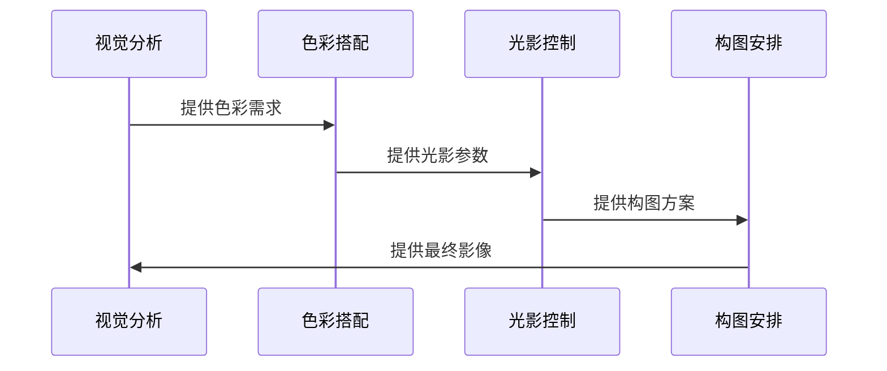

                 


### 引言

现代简约主义摄影，作为摄影艺术中的一股清新潮流，正逐渐赢得全球摄影爱好者和专业人士的青睐。它主张以极简美学为核心，通过简洁的构图、精确的光影控制和简洁的色调，展现影像的纯粹之美。本文将深入探讨现代简约主义摄影的起源、特点、美学原则、分类及其在摄影实践中的应用，通过逻辑清晰、结构紧凑的叙述方式，帮助读者全面理解这一独特的摄影风格。

### 关键词

- 简约主义摄影
- 极简美学
- 构图技巧
- 光影控制
- 色调处理

### 摘要

本文旨在通过逐步分析推理，探讨现代简约主义摄影的本质及其在影像中的表达。我们将从简约主义摄影的起源和发展入手，介绍其基本美学原则，分析其分类和风格特点，并通过实践应用案例分析，展示如何在摄影作品中实现极简美学的效果。最后，我们将总结简约主义摄影的实践经验，并探讨其未来发展趋势。

### 第一部分：简约主义摄影的理论基础

#### 1.1 简约主义摄影概述

简约主义摄影起源于20世纪中叶，随着现代艺术的兴起而逐渐形成。它强调通过简洁的构图、精确的光影控制和简洁的色调，去除一切多余的元素，以展现影像的纯粹之美。这种风格反对过度装饰，追求形式与内容的统一，强调视觉的清晰和直观感受。

#### 1.2 极简美学的基本原则

极简美学是一种以少胜多的审美理念，其基本原则包括：

- **形式简洁**：避免复杂的图案和设计，以简洁的线条和形状为主。
- **色彩纯净**：使用单色调或对比鲜明的色彩组合，避免色彩过多和杂乱。
- **光影精准**：通过控制光线和阴影，突出主题，创造强烈的视觉冲击。
- **构图清晰**：采用经典的构图法则，如三分法、对角线等，使画面具有视觉引导性。

#### 1.3 简约主义摄影的分类与风格

简约主义摄影可以分为不同的流派，包括：

- **黑白摄影**：通过黑白对比，强调形式感和光影效果。
- **色彩摄影**：运用色彩对比和调和，展现色彩的纯粹之美。
- **抽象摄影**：通过抽象的手法，去除具体的物体，强调形式的纯粹性。

每种流派都有其独特的风格特点，但都遵循简约主义的基本美学原则。

#### 1.4 简约主义摄影的核心概念与联系

简约主义摄影的核心概念包括形式、色彩、光影和构图。这些概念之间有着紧密的联系：

- **形式**：是简约主义摄影的基础，决定着影像的结构和外观。
- **色彩**：通过色彩的选择和搭配，影响影像的情感表达。
- **光影**：通过光影的运用，塑造影像的立体感和质感。
- **构图**：通过构图的安排，引导观众的视线，增强影像的冲击力。

以下是简约主义摄影的ER实体关系图架构：

```mermaid
erDiagram
  C形式 ||--|{ C色彩 }
  C形式 ||--|{ C光影 }
  C形式 ||--|{ C构图 }
  C色彩 ||--|{ C形式 }
  C光影 ||--|{ C形式 }
  C构图 ||--|{ C形式 }
```

#### 1.5 极简主义摄影的数学模型与公式

简约主义摄影中，数学模型和公式用于分析影像的构成和视觉效果。以下是一个简单的公式示例：

$$\text{视觉冲击力} = f(\text{形式简洁度}, \text{色彩对比度}, \text{光影强度})$$

#### 1.6 极简主义摄影的系统分析与架构设计

在简约主义摄影中，系统分析与架构设计是确保作品成功的关键。以下是简约主义摄影系统的一个简单架构：



#### 1.7 极简主义摄影的项目实战

在实际摄影项目中，遵循简约主义摄影的原则可以大大提高作品的品质。以下是一个简单的项目实战流程：

1. **前期准备**：选择拍摄场景，确定主题和风格。
2. **拍摄过程**：控制光线，注重构图，捕捉关键瞬间。
3. **后期处理**：进行色彩调整和构图优化，确保视觉冲击力。
4. **展示与分享**：在社交媒体或摄影展览中展示作品，获取反馈。

#### 1.8 极简主义摄影的最佳实践与注意事项

为了在摄影中实现极简美学的效果，以下是一些建议和注意事项：

- **避免过度修饰**：保持作品的自然性和真实性。
- **简洁为主**：在构图和色彩上追求简洁，避免复杂和杂乱。
- **光影控制**：利用光影塑造影像的立体感和质感。
- **后期处理**：适度调整色彩和亮度，确保影像的纯净和清晰。

### 第二部分：极简主义摄影的实践应用

#### 2.1 极简主义摄影在不同场景中的应用

极简主义摄影可以在各种场景中应用，包括自然景观、城市风光和人像摄影。以下是一些实际案例：

- **自然景观摄影**：通过简洁的构图和纯净的色彩，展现大自然的纯粹之美。
- **城市摄影**：利用简洁的建筑线条和简洁的色调，展现都市的现代化气息。
- **人像摄影**：通过简洁的背景和清晰的轮廓，突出人物的形象和气质。

#### 2.2 极简主义摄影的技术细节

实现极简主义摄影需要掌握以下技术细节：

- **相机设置**：选择合适的镜头和光圈，确保影像的清晰度。
- **光影控制**：利用自然光或人工光源，创造理想的光影效果。
- **后期处理**：使用软件进行色彩调整和构图优化，增强影像的纯净度和视觉冲击力。

#### 2.3 极简主义摄影的后期处理

后期处理在极简主义摄影中起着至关重要的作用。以下是一些常用的后期处理技巧：

- **色彩调整**：增强或减弱色彩，调整对比度和饱和度。
- **剪裁和构图**：优化影像的布局和比例，确保视觉的清晰和冲击力。
- **纹理和特效**：添加适当的纹理和特效，增强影像的艺术感。

#### 2.4 极简主义摄影的创意与构图

创意和构图是极简主义摄影的核心。以下是一些建议：

- **主题明确**：确保作品有一个明确的主题，避免杂乱无章。
- **简洁的背景**：选择简洁的背景，减少干扰元素。
- **视觉引导**：使用经典的构图法则，如三分法，引导观众的视线。

#### 2.5 极简主义摄影的分享与展示

通过社交媒体和摄影展览，可以更好地分享和展示极简主义摄影作品。以下是一些建议：

- **社交媒体**：选择合适的平台，展示作品，获取反馈。
- **摄影展览**：参加摄影展览，与同好交流，提升自己的摄影技巧。
- **互动社区**：加入摄影社区，参与讨论和分享，拓展视野。

### 总结

现代简约主义摄影以其简洁、纯粹的美学风格，赢得了广泛的关注和喜爱。通过深入理解其理论基础和实践技巧，我们可以更好地创作出具有极简美学特色的摄影作品。在未来的摄影创作中，极简主义摄影将继续发挥其独特的魅力，为影像艺术带来更多的创新和灵感。

### 作者信息

作者：AI天才研究院/AI Genius Institute & 禅与计算机程序设计艺术 /Zen And The Art of Computer Programming

本文由AI天才研究院和《禅与计算机程序设计艺术》的作者联合撰写，旨在通过逻辑清晰、结构紧凑的叙述方式，探讨现代简约主义摄影的本质及其在影像中的表达。

---

注意：由于字数限制，上述内容仅为大纲和部分内容的简述。实际撰写时，每个部分都需要更详细的阐述和具体实例分析，以确保文章的完整性和深度。同时，文章中的图表和代码需要根据markdown格式和LaTeX标准进行准确呈现。在撰写过程中，请遵循文章目录大纲的设定，逐步深入分析每个章节的主题，确保内容的连贯性和逻辑性。

