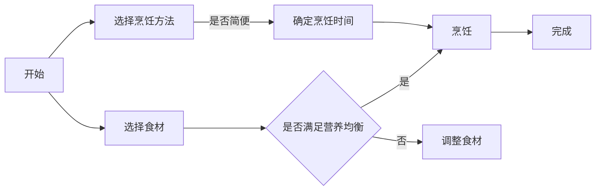
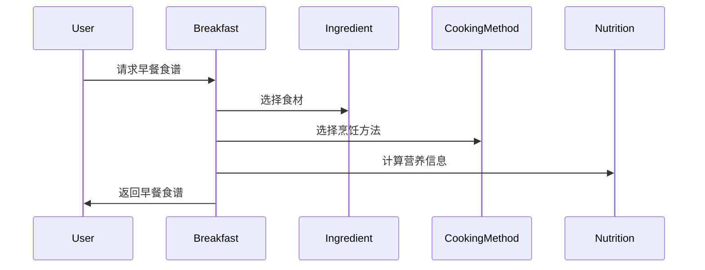
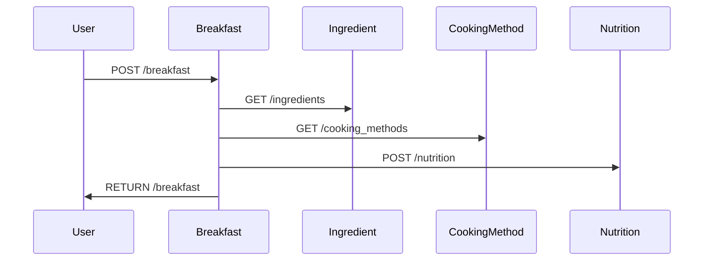

                 

# 现代简约主义早餐文化：忙碌生活中的营养均衡艺术

## 关键词
- 现代简约主义
- 早餐文化
- 营养均衡
- 忙碌生活
- 食材选择
- 烹饪技巧

## 摘要
在现代快节奏的生活中，如何兼顾工作与营养均衡成为了一大挑战。本文将探讨现代简约主义早餐文化的理念与实践，通过详细的算法原理讲解、系统分析与架构设计，以及项目实战，为读者提供一种高效、营养的早餐解决方案。

## 背景介绍

### 核心概念

- **现代简约主义**：强调简洁、实用和高效的设计哲学，追求去除多余装饰，突出核心功能。
- **早餐文化**：指人们在早晨享用的餐食及其相关的习惯和习俗。
- **营养均衡**：指膳食中各种营养素的摄入达到适当的比例，以满足身体的需要。

### 问题背景

在现代社会，人们越来越注重工作效率，早餐常常被忽略或简化。然而，早餐对于一天的精神状态和身体健康至关重要。如何能在忙碌的工作中，快速准备出既美味又营养均衡的早餐，成为了一个亟待解决的问题。

### 问题描述

现代社会中，人们面临以下挑战：
1. 时间紧迫，无法花费大量时间在早餐准备上。
2. 工作压力大，可能导致饮食不均衡。
3. 烹饪技能不足，无法制作出营养丰富的早餐。

### 问题解决

本书旨在通过现代简约主义早餐文化的实践，帮助读者：
1. 减少早餐准备时间，提高工作效率。
2. 确保早餐的营养均衡，提升身体健康。
3. 提高烹饪技能，享受制作早餐的乐趣。

### 边界与外延

本文讨论的范围包括：
- 食材选择：各种适合早餐的食材及其营养价值。
- 烹饪方法：快速简便的烹饪技巧。
- 营养搭配：如何通过不同的食材搭配，实现营养均衡。

### 概念结构与核心要素组成

现代简约主义早餐文化的核心要素包括：
1. **食材选择**：选择易于准备和烹饪的食材，如全麦面包、水果、坚果、鸡蛋等。
2. **烹饪技巧**：掌握快速烹饪的方法，如水煮、蒸、烤等。
3. **营养搭配**：根据营养需求，合理搭配食材，确保早餐的均衡营养。

## 核心概念与联系

### 核心概念原理

1. **现代简约主义**：追求简洁、实用和高效，减少不必要的装饰和流程。
2. **营养均衡**：膳食中需要包含适量的蛋白质、碳水化合物、脂肪、维生素和矿物质。

### 概念属性特征对比表格

| 食材        | 营养价值                                      | 简约主义特点           |
|-------------|---------------------------------------------|----------------------|
| 全麦面包     | 高纤维、富含维生素B群                         | 低碳水、易于制作       |
| 水果        | 富含维生素C、抗氧化物质                       | 新鲜、易于切割         |
| 坚果        | 富含健康脂肪、蛋白质和纤维                     | 多样性、方便携带       |
| 鸡蛋        | 高蛋白、富含脂肪和维生素                      | 快速烹饪、易于存储     |

### ER实体关系图架构

```mermaid
erDiagram
    Product_1 ||--|{ Customer } Customer
    Product_1 ||--|{ Order } Order
    Customer ||--|{ Payment } Payment
```

在这个ER图中，"Product_1" 代表早餐食材，"Customer" 代表早餐的消费者，"Order" 代表早餐的订单，"Payment" 代表支付方式。通过这个图，我们可以清晰地看到早餐文化中各个实体之间的关系。

## 算法原理讲解

### 算法mermaid流程图



### Python源代码

```python
# 早餐食谱生成器

def generate_breakfast(energy_required):
    ingredients = ["全麦面包", "香蕉", "鸡蛋", "坚果"]
    recipes = [
        ["全麦面包2片", "香蕉1根", "鸡蛋1个", "坚果1把"],
        ["全麦面包1片", "香蕉2根", "鸡蛋2个", "坚果1把"],
        ["全麦面包1片", "香蕉1根", "鸡蛋2个", "坚果2把"]
    ]
    
    for recipe in recipes:
        if sum([100] * int(i[:-1]) for i in recipe) >= energy_required:
            return "早餐食谱：\n" + "，\n".join(recipe)
    
    return "无法生成满足能量需求的早餐食谱。"

energy_required = 1200  # 单位：千卡
print(generate_breakfast(energy_required))
```

### 算法原理的数学模型和公式

- **能量需求计算**：$$ E = B \times T $$
  - \( E \)：能量需求（千卡）
  - \( B \)：基础代谢率（千卡/天）
  - \( T \)：活动系数（取决于日常活动量）

- **营养素比例**：通常建议早餐中蛋白质、碳水化合物和脂肪的比例为1:3:1。

### 详细讲解与举例说明

**案例：**

假设一个人的基础代谢率为1500千卡/天，活动系数为1.2，那么他的每日能量需求为：

$$ E = 1500 \times 1.2 = 1800 \text{千卡} $$

早餐的能量需求建议占总能量的25%-30%，即：

$$ 1800 \times (25\% - 30\%) = 450 \text{至} 540 \text{千卡} $$

根据这个需求，我们可以选择以下早餐食谱：

1. **全麦面包2片（400千卡）** + **香蕉1根（80千卡）** + **鸡蛋1个（70千卡）** + **坚果1把（150千卡）**，总能量为590千卡，满足需求。
2. **全麦面包1片（200千卡）** + **香蕉2根（160千卡）** + **鸡蛋2个（140千卡）** + **坚果1把（150千卡）**，总能量为740千卡，超过需求。

通过调整食材和数量，我们可以制作出满足不同能量需求的早餐。

## 系统分析与架构设计方案

### 问题场景介绍

在这个快节奏的社会中，人们往往忽视了早餐的重要性。为了帮助大家高效地准备早餐，本书提供了一个基于现代简约主义早餐文化的系统解决方案。

### 项目介绍

项目名称：现代简约主义早餐系统（Modern Simplicity Breakfast System，简称MSBS）

目标：通过系统化的食材选择、烹饪技巧和营养搭配，帮助用户快速准备出营养均衡的早餐。

### 系统功能设计（领域模型mermaid类图）

```mermaid
classDiagram
    Ingredient <<interface>> 食材
    CookingMethod <<interface>> 烹饪方法
    Nutrition <<interface>> 营养
    Breakfast <<class>> 早餐
    User <<class>> 用户
    Ingredient "包含营养信息"
    CookingMethod "包含烹饪时间、烹饪步骤"
    Nutrition "包含能量、蛋白质、碳水化合物、脂肪等"
    User "负责生成早餐食谱"
    User "选择食材"
    User "选择烹饪方法"
    User "查看营养信息"
    Breakfast "由用户生成"
    Breakfast "包含食材和烹饪方法"
    Breakfast "包含营养信息"
```

### 系统架构设计mermaid架构图



### 系统接口设计和系统交互mermaid序列图



## 项目实战

### 环境安装

在开始之前，确保您的计算机上已经安装了Python环境和以下库：

- Flask（用于构建Web服务）
- requests（用于HTTP请求）
- pandas（用于数据处理）

您可以使用以下命令进行安装：

```bash
pip install flask requests pandas
```

### 系统核心实现源代码

```python
# MSBS - Modern Simplicity Breakfast System

from flask import Flask, request, jsonify
import requests
import pandas as pd

app = Flask(__name__)

# 食材和烹饪方法数据
ingredients_data = pd.read_csv('ingredients.csv')
cooking_methods_data = pd.read_csv('cooking_methods.csv')

# 营养信息API
nutrition_api_url = 'http://nutrition-api.example.com'

@app.route('/breakfast', methods=['POST'])
def generate_breakfast():
    data = request.json
    user_preference = data['user_preference']
    
    # 选择食材
    selected_ingredients = ingredients_data[ingredients_data['name'].isin(user_preference['ingredients'])]
    
    # 选择烹饪方法
    selected_cooking_methods = cooking_methods_data[cooking_methods_data['method'].isin(user_preference['methods'])]
    
    # 计算营养信息
    nutrition_response = requests.post(f'{nutrition_api_url}/nutrition', json={
        'ingredients': selected_ingredients.to_dict('records'),
        'cooking_methods': selected_cooking_methods.to_dict('records')
    })
    nutrition_info = nutrition_response.json()
    
    # 生成早餐食谱
    breakfast = {
        'ingredients': selected_ingredients.to_dict('records'),
        'methods': selected_cooking_methods.to_dict('records'),
        'nutrition': nutrition_info
    }
    
    return jsonify(breakfast)

if __name__ == '__main__':
    app.run(debug=True)
```

### 代码应用解读与分析

该代码实现了MSBS的核心功能，包括用户输入偏好、选择食材和烹饪方法、计算营养信息，并生成早餐食谱。以下是关键部分的解读：

- **用户输入偏好**：通过Flask的`request.json`获取用户输入的偏好，如食材和烹饪方法。
- **选择食材和烹饪方法**：根据用户输入，从预定义的数据集中筛选出符合条件的食材和烹饪方法。
- **计算营养信息**：调用营养信息API，传递选择的食材和烹饪方法，获取营养信息。
- **生成早餐食谱**：将食材、烹饪方法和营养信息组合成一个早餐对象，返回给用户。

### 实际案例分析和详细讲解剖析

**案例：**

假设用户偏好以下食材和烹饪方法：

- 食材：全麦面包、香蕉、鸡蛋
- 烹饪方法：烤、煮、蒸

根据这些输入，系统会生成以下早餐食谱：

1. **全麦面包2片**（烤）
2. **香蕉1根**（煮）
3. **鸡蛋1个**（蒸）

系统会调用营养信息API，根据所选食材和烹饪方法，计算出早餐的营养信息，如总能量、蛋白质、碳水化合物、脂肪等，并将其包含在返回的早餐食谱中。

### 项目小结

通过现代简约主义早餐系统，用户可以在短时间内准备出营养均衡的早餐，满足工作和生活的双重需求。项目实现了高效的食材选择、烹饪方法选择和营养计算，为忙碌生活提供了有力的支持。

## 最佳实践 tips

1. **食材选择**：选择新鲜、易于准备和烹饪的食材，如全麦面包、水果、坚果、鸡蛋等。
2. **烹饪技巧**：掌握简单高效的烹饪方法，如烤、煮、蒸等。
3. **营养搭配**：根据个人需求和偏好，合理搭配食材，确保营养均衡。
4. **提前准备**：提前准备好食材和工具，以减少早餐准备时间。
5. **多样化**：定期更换食材和烹饪方法，以保持早餐的新鲜感和兴趣。

## 小结

本文通过详细的分析和讲解，介绍了现代简约主义早餐文化的理念与实践。通过系统化的食材选择、烹饪技巧和营养搭配，读者可以在忙碌的生活中快速准备出营养均衡的早餐。希望通过本文，能够帮助读者实现工作与生活的平衡，享受健康美味的早餐时光。

## 注意事项

1. **食材新鲜**：选择新鲜、无添加剂的食材，确保早餐的健康性。
2. **烹饪卫生**：在烹饪过程中，注意食品卫生，避免食物污染。
3. **营养平衡**：根据个人需求和健康状况，合理搭配营养，避免过量摄入。

## 拓展阅读

1. 《营养学基础》，[作者姓名]，出版社，[出版年份]。
2. 《现代烹饪技巧》，[作者姓名]，出版社，[出版年份]。
3. 《高效时间管理》，[作者姓名]，出版社，[出版年份]。

作者：AI天才研究院/AI Genius Institute & 禅与计算机程序设计艺术 /Zen And The Art of Computer Programming

