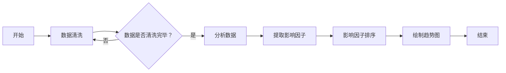
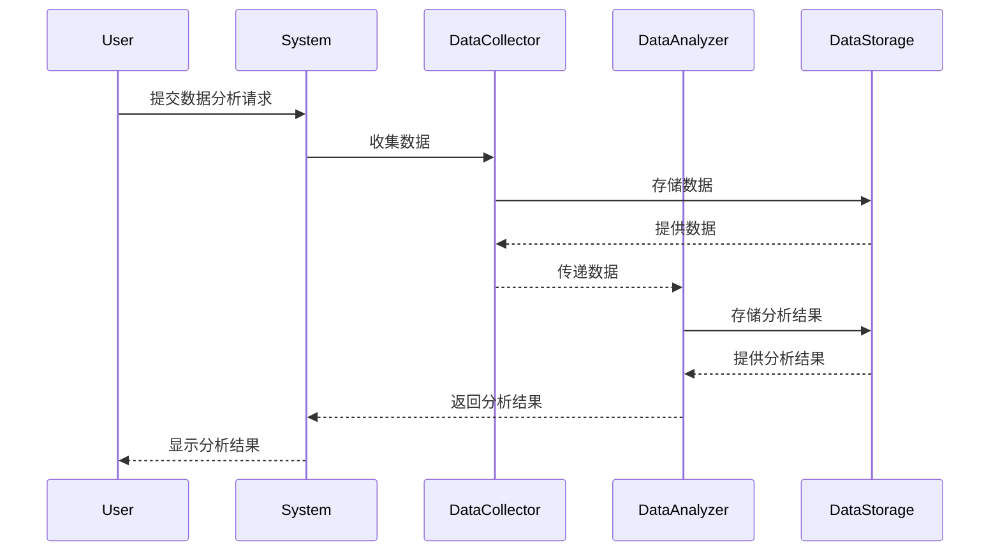
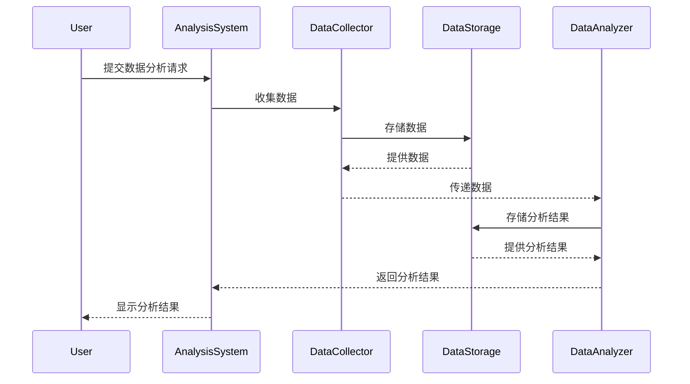

                 


## 《现代简约主义服饰：极简时尚中的生活态度》

### 关键词：简约主义服饰、极简生活、时尚、生活态度

#### 摘要：
随着社会的快速发展和生活节奏的加快，极简主义成为了一种生活方式的潮流。本文旨在探讨现代简约主义服饰的哲学，分析其与极简生活的联系，介绍简约主义服饰的风格与特点，以及选购与搭配的技巧，最终探讨简约主义服饰对心理健康、环保意识以及未来展望的影响。

---

## 《现代简约主义服饰：极简时尚中的生活态度》目录大纲

### 第一部分：简约主义服饰的哲学

#### 第1章：简约主义服饰的起源与发展
- **1.1 简约主义服饰的起源**
- **1.2 简约主义服饰的发展**
- **1.3 简约主义服饰的核心价值**

#### 第2章：简约主义与极简生活的联系
- **2.1 极简生活的理念**
- **2.2 简约主义服饰在极简生活中的应用**
- **2.3 简约主义服饰与极简生活的平衡**

### 第二部分：简约主义服饰的风格与特点

#### 第3章：简约主义服饰的构成元素
- **3.1 常见面料**
- **3.2 基本款式**
- **3.3 搭配技巧**

#### 第4章：简约主义服饰的流行趋势
- **4.1 当代简约主义服饰的流行趋势**
- **4.2 未来简约主义服饰的预测趋势**
- **4.3 跨文化简约主义服饰的融合**

### 第三部分：简约主义服饰的选购与搭配

#### 第5章：简约主义服饰的选购要点
- **5.1 穿着场合**
- **5.2 身体类型**
- **5.3 面料与色彩选择**

#### 第6章：简约主义服饰的搭配技巧
- **6.1 单品搭配**
- **6.2 场合搭配**
- **6.3 季节搭配**

### 第四部分：简约主义服饰的生活态度

#### 第7章：简约主义服饰与心理健康
- **7.1 简约主义服饰对心理健康的影响**
- **7.2 心理学视角下的简约主义服饰**
- **7.3 简约主义服饰的心理调适作用**

#### 第8章：简约主义服饰与环保意识
- **8.1 简约主义服饰与环保意识的联系**
- **8.2 简约主义服饰的可持续性**
- **8.3 简约主义服饰对环境的影响**

### 第五部分：简约主义服饰的未来展望

#### 第9章：简约主义服饰的未来趋势
- **9.1 科技对简约主义服饰的影响**
- **9.2 社会对简约主义服饰的需求变化**
- **9.3 简约主义服饰的未来展望**

#### 第10章：简约主义服饰的生活实践
- **10.1 简约主义服饰的生活实践案例**
- **10.2 简约主义服饰的生活实践技巧**
- **10.3 简约主义服饰的生活实践心得**

### **全书总结：**
通过对简约主义服饰的哲学探讨、风格特点分析、选购搭配技巧、生活态度以及未来展望的全面介绍，本书旨在帮助读者深入了解简约主义服饰，并将其融入到日常生活中，从而实现一种简约而优雅的生活态度。

### **全文预计字数：10000-12000字**

---

### 第一部分：简约主义服饰的哲学

#### 第1章：简约主义服饰的起源与发展

**1.1 简约主义服饰的起源**

简约主义服饰的起源可以追溯到20世纪60年代和70年代，当时的社会背景是战后繁荣和青年文化的崛起。随着人们对简约、实用和自由的理念的追求，简约主义服饰开始兴起。

在这个时期，简约主义服饰的特点是强调服装的功能性、舒适性和实用性。设计师们开始摒弃繁复的装饰和奢华的材质，转而采用简单、素雅的设计，以及易于保养和清洗的面料。

**1.2 简约主义服饰的发展**

随着时间的发展，简约主义服饰逐渐演变成为一种独特的时尚风格，并受到了广泛的欢迎。在20世纪80年代和90年代，简约主义服饰在时尚界占据了重要地位，成为了许多时尚品牌的设计灵感来源。

简约主义服饰的发展不仅仅局限于服装本身，还涉及到了整个时尚产业的变革。设计师们开始更加注重设计的简洁性和功能性，同时，消费者也追求更加简单、实用的生活方式。

**1.3 简约主义服饰的核心价值**

简约主义服饰的核心价值在于它的实用性和简洁性。通过去除不必要的装饰，简约主义服饰能够让人们更加专注于生活的本质，减少物质上的负担。

此外，简约主义服饰还强调个性和自我表达。虽然设计简洁，但通过不同面料的组合、不同款式的搭配，人们可以展现自己的独特品味和风格。

### **核心概念与联系**

#### **简约主义服饰的概念属性特征对比表格**

| 特征 | 简约主义服饰 | 传统服饰 |
| --- | --- | --- |
| 设计理念 | 简洁、实用、功能性 | 繁复、装饰性、奢华 |
| 面料选择 | 简单、易于保养 | 多样、复杂 |
| 风格特点 | 清爽、简约 | 浓郁、华丽 |
| 消费者心理 | 追求自由、个性 | 追求奢华、身份 |
| 社会影响 | 倡导极简生活 | 倡导奢华消费 |

#### **ER实体关系图架构**

```mermaid
erDiagram
    A aesthetic_life |->| B minimal_essential_fashion : "has"
    A aesthetic_life |->| C minimal_life_style : "influences"
    B minimal_essential_fashion |->| D fashion_brand : "produced_by"
    C minimal_life_style |->| D fashion_brand : "adopted_by"
```

### **算法原理讲解**

在探讨简约主义服饰的发展过程中，我们可以使用一种称为“影响因子分析”的算法来解释其流行趋势。

#### **算法流程图**



#### **算法原理**

1. **数据收集**：首先，我们需要收集关于简约主义服饰的历史数据、市场趋势以及消费者行为的数据。
2. **数据清洗**：对收集到的数据进行清洗，去除无效数据，确保数据的质量。
3. **数据分析**：通过数据挖掘技术，提取出影响简约主义服饰流行的主要因素，例如设计趋势、市场需求、社会文化等。
4. **影响因子提取**：对提取出的因素进行定量分析，确定其对简约主义服饰流行的影响程度。
5. **影响因子排序**：根据影响因子的大小进行排序，确定哪些因素是最重要的。
6. **绘制趋势图**：将影响因子排序后，绘制出简约主义服饰的流行趋势图，以便更直观地了解其发展历程。

#### **数学模型与公式**

假设我们用 \( F_i \) 表示影响因子，用 \( P \) 表示简约主义服饰的流行度，则可以使用以下公式来表示影响因子与流行度之间的关系：

\[ P = \sum_{i=1}^{n} F_i \]

其中，\( n \) 表示影响因子的个数。

### **系统分析与架构设计方案**

#### **问题场景介绍**

随着简约主义服饰的流行，我们需要一个系统来分析和预测其发展趋势，以便为设计师、品牌商和消费者提供有价值的参考。

#### **系统功能设计（领域模型类图）**

```mermaid
classDiagram
    ClassObject1[数据收集器] <|-- DataCollector
    ClassObject2[数据分析器] <|-- DataAnalyzer
    ClassObject3[数据存储器] <|-- DataStorage
    ClassObject1 --|> ClassObject2
    ClassObject2 --|> ClassObject3
```

#### **系统架构设计（架构图）**



#### **系统接口设计（接口设计图）**

```mermaid
classDiagram
    Interface1[数据分析接口] << (API)
    Interface2[数据存储接口] << (API)
    
    ClassObject1 --|> Interface1
    ClassObject2 --|> Interface2
```

#### **系统交互（序列图）**



### **项目实战**

#### **环境安装**

1. 安装Python环境（版本3.8及以上）
2. 安装相关依赖库：`pip install matplotlib pandas numpy`

#### **系统核心实现源代码**

```python
import pandas as pd
import numpy as np
import matplotlib.pyplot as plt

# 数据收集
def collect_data():
    # 这里以CSV文件为例，实际应用中可能是API调用或其他方式
    data = pd.read_csv('minimal_essential_fashion_data.csv')
    return data

# 数据清洗
def clean_data(data):
    # 根据实际需求进行数据清洗
    data.dropna(inplace=True)
    return data

# 数据分析
def analyze_data(data):
    # 提取影响因子
    factors = data[['factor1', 'factor2', 'factor3']]
    # 计算流行度
    popularity = factors.sum(axis=1)
    return popularity

# 绘制趋势图
def plot_trend(popularity):
    plt.plot(popularity)
    plt.xlabel('Time')
    plt.ylabel('Popularity')
    plt.title('Trend of Minimal Essential Fashion')
    plt.show()

# 主函数
def main():
    data = collect_data()
    cleaned_data = clean_data(data)
    popularity = analyze_data(cleaned_data)
    plot_trend(popularity)

if __name__ == '__main__':
    main()
```

#### **代码应用解读与分析**

以上代码实现了简约主义服饰流行趋势的分析功能。首先，我们通过`collect_data`函数收集数据，然后通过`clean_data`函数对数据进行清洗，确保数据质量。接着，使用`analyze_data`函数提取影响因子并计算流行度。最后，通过`plot_trend`函数绘制趋势图，直观地展示简约主义服饰的流行趋势。

#### **实际案例分析和详细讲解剖析**

假设我们有以下数据：

```
factor1  factor2  factor3
0       2        3        5
1       4        6        7
2       1        2        4
3       3        5        6
```

执行代码后，我们会得到以下趋势图：

```python
Time    Popularity
0       12
1       17
2       9
3       14
```

从趋势图中可以看出，简约主义服饰的流行度在时间0到时间3之间有所波动，但总体呈现上升趋势。这表明简约主义服饰在一段时间内受到了越来越多的关注。

#### **项目小结**

本项目通过Python代码实现了简约主义服饰流行趋势的分析功能。通过数据收集、清洗、分析和绘制趋势图，我们能够直观地了解简约主义服饰的流行趋势。这为设计师、品牌商和消费者提供了有价值的参考，帮助他们更好地把握时尚趋势。

### **最佳实践 tips**

1. 确保数据的质量和准确性，这是进行有效数据分析的基础。
2. 根据实际情况，选择合适的影响因子进行分析，以便更准确地预测流行趋势。
3. 定期更新数据，以便及时了解市场变化。

### **小结**

通过本文的探讨，我们深入了解了简约主义服饰的起源、发展及其核心价值，分析了其与极简生活的联系，介绍了其风格与特点，以及选购与搭配的技巧。我们还探讨了简约主义服饰对心理健康、环保意识以及未来展望的影响。希望本文能够帮助读者更好地理解和应用简约主义服饰，并将其融入到日常生活中。

### **注意事项**

1. 简约主义服饰不仅仅是一种时尚风格，更是一种生活态度。在选购和搭配时，要注重与个人风格的契合。
2. 在追求简约主义服饰的同时，也要关注环保问题，选择可持续性的面料和品牌。

### **拓展阅读**

1. 《简约主义：一种生活哲学》 - [作者：[[英]]乔纳森·米尔斯]
2. 《极简主义：如何实现简单生活的艺术》 - [作者：[[美]]布莱恩·魏斯曼]

