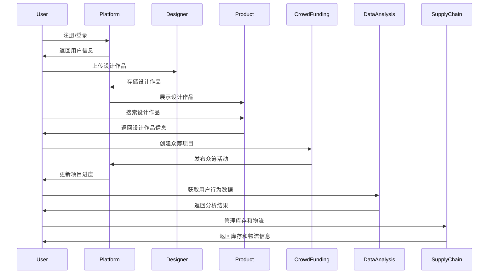

                 

### 文章标题

**《现代简约主义瑜伽服众筹平台：功能与时尚兼具的运动装备孵化器》**

### 文章关键词

- 瑜伽服
- 简约主义
- 众筹平台
- 功能性设计
- 时尚元素
- 数据分析
- 用户体验优化

### 摘要

本文深入探讨现代简约主义瑜伽服众筹平台的设计理念、功能实现和系统架构。通过详细分析平台如何将功能性设计、时尚元素和众筹运营机制有机结合，实现运动装备的创新孵化。本文将分为七个部分，逐步介绍瑜伽服市场现状、简约主义理念、众筹平台机制、算法原理、数学模型、系统分析与架构设计，以及项目实战与最佳实践，旨在为读者提供一个全面、系统的参考。

---

### 1.1 背景介绍：核心概念

#### 1.1.1 瑜伽服市场现状

随着健康意识的提升和生活方式的转变，瑜伽作为一种低强度、高效益的健身方式在全球范围内受到广泛关注。瑜伽服作为瑜伽运动的必备装备，市场需求逐年增长。然而，当前市场上瑜伽服存在以下问题：

- **款式单一**：许多品牌在设计上缺乏创新，瑜伽服款式较为单调，难以满足不同消费者的个性化需求。
- **功能不足**：部分瑜伽服设计注重外观而忽视了功能性，导致穿着舒适度不高，无法满足运动需求。
- **价格不透明**：由于缺乏有效的市场竞争，一些品牌利用价格不透明手段获取高额利润。

为了解决这些问题，简约主义瑜伽服众筹平台应运而生。平台旨在通过众筹模式，汇集消费者和设计师的智慧，共同打造兼具功能与时尚的瑜伽服。

#### 1.1.2 简约主义理念

简约主义（Simplicity）是一种注重本质和实用的设计理念，它强调通过简化设计元素，去除不必要的装饰，使产品回归到其最本质的功能和美学价值。在瑜伽服设计领域，简约主义理念主要体现在以下几个方面：

- **设计简洁**：简化瑜伽服的设计元素，去除多余的装饰，使服装外观更加干净、利落。
- **材料环保**：选用环保材料，减少对环境的影响，同时提升瑜伽服的舒适度和耐用性。
- **功能实用**：注重瑜伽服的功能性设计，确保服装能够满足各种瑜伽动作的需求。

#### 1.1.3 众筹平台的作用

众筹平台作为现代商业模式的一种创新形式，通过互联网集众人之力，实现产品从设计到生产的全过程。在简约主义瑜伽服众筹平台中，众筹平台的作用主要体现在以下几个方面：

- **需求调研**：通过众筹平台收集消费者对瑜伽服的需求和偏好，为设计师提供灵感。
- **设计评审**：众筹平台提供公开的设计评审机制，让消费者参与到设计决策中，提高产品的市场契合度。
- **资金筹集**：众筹平台为设计师和品牌提供筹集生产资金的渠道，降低市场准入门槛。
- **风险分担**：通过众筹模式，将生产风险分散到众多投资者中，降低单一企业的风险。

---

通过上述背景介绍，我们了解了现代简约主义瑜伽服众筹平台的重要性及其在设计理念和运营模式上的创新。接下来，我们将进一步探讨核心概念之间的联系，以及平台如何实现功能性设计、时尚元素和众筹运营机制的有机结合。

---

### 1.2 核心概念与联系

#### 1.2.1 功能性设计要素

功能性设计是瑜伽服的核心要素，它直接影响穿着体验和运动效果。以下是功能性设计的主要要素：

- **面料选择**：选用透气性好、吸湿排汗的面料，确保运动时身体的舒适感。
- **裁剪设计**：根据人体工学原理，设计合适的裁剪，确保瑜伽动作的灵活性和伸展性。
- **细节处理**：在袖口、领口、腰部等部位添加弹性设计，增加服装的适应性和灵活性。

#### 1.2.2 时尚元素融合

时尚元素是瑜伽服设计中的另一重要组成部分，它为产品注入活力，提升消费者的购买欲望。时尚元素的融合主要体现在以下几个方面：

- **色彩搭配**：选用流行色彩，搭配简约设计，使瑜伽服具有时尚感。
- **图案设计**：通过简约的图案或印花，为瑜伽服增添个性。
- **材质搭配**：将不同材质进行搭配，创造多层次的效果，提升视觉层次感。

#### 1.2.3 众筹平台运营机制

众筹平台运营机制是简约主义瑜伽服众筹平台的核心，它决定了平台能否成功运作。以下是众筹平台运营机制的关键要素：

- **需求调研**：通过问卷、访谈等方式收集消费者对瑜伽服的需求和偏好，为设计师提供设计方向。
- **设计评审**：通过线上评审，让消费者参与到设计决策中，提高产品的市场契合度。
- **资金筹集**：通过预售模式筹集生产资金，降低市场准入门槛。
- **风险分担**：通过众筹模式，将生产风险分散到众多投资者中，降低单一企业的风险。

#### 概念属性特征对比表格

为了更清晰地展示功能性设计、时尚元素和众筹平台运营机制之间的联系，我们制作了一个属性特征对比表格：

| **要素** | **功能性设计** | **时尚元素** | **众筹平台运营机制** |
| :------: | :------------: | :----------: | :------------------: |
| **目标** | 提高运动舒适度和效果 | 增强视觉吸引力 | 降低市场准入门槛 |
| **方法** | 面料选择、裁剪设计、细节处理 | 色彩搭配、图案设计、材质搭配 | 需求调研、设计评审、资金筹集、风险分担 |
| **作用** | 保障运动体验 | 提升购买欲望 | 促进产品市场化 |

#### ER实体关系图架构

为了更直观地展示核心概念之间的联系，我们使用Mermaid绘制了一个ER实体关系图：

```mermaid
erDiagram
  Customer --> Designer : 提需求
  Designer --> Product : 设计
  Product --> Customer : 满需求
  Platform --> Customer : 服务
  Platform --> Designer : 服务
  Platform --> Product : 管理
```

通过ER实体关系图，我们可以看出众筹平台在连接消费者、设计师和产品之间的桥梁作用，确保功能性设计、时尚元素和众筹平台运营机制的有机结合。

---

在下一部分，我们将深入探讨简约主义瑜伽服众筹平台的算法原理，包括用户体验优化算法、供应链管理算法和数据分析算法，以及这些算法如何帮助平台提高运营效率，实现功能与时尚的完美融合。

---

### 1.3 算法原理讲解

#### 1.3.1 用户体验优化算法

用户体验优化算法是提升众筹平台用户满意度和参与度的重要手段。以下是几种常用的用户体验优化算法：

1. **推荐算法**：通过分析用户的历史行为和偏好，推荐符合其兴趣的瑜伽服设计和产品，提高用户粘性。

   **算法流程图**：

   ```mermaid
   graph TD
       A[用户行为数据] --> B[数据处理]
       B --> C[兴趣分析]
       C --> D[推荐系统]
       D --> E[推荐结果]
   ```

   **数学模型**：
   
   $$\text{推荐分数} = f(\text{用户历史行为}, \text{产品属性}, \text{社会影响力})$$

2. **互动算法**：通过设计互动活动和用户反馈机制，鼓励用户参与设计和改进产品，提高产品的市场契合度。

   **算法流程图**：

   ```mermaid
   graph TD
       A[互动活动设计] --> B[用户参与]
       B --> C[用户反馈]
       C --> D[产品改进]
   ```

3. **个性化定制算法**：根据用户的身体数据和偏好，提供个性化的瑜伽服定制服务，提升用户体验。

   **算法流程图**：

   ```mermaid
   graph TD
       A[用户身体数据] --> B[数据分析]
       B --> C[个性化定制]
       C --> D[定制结果]
   ```

#### 1.3.2 供应链管理算法

供应链管理算法是确保瑜伽服生产过程高效、稳定的重要手段。以下是几种常用的供应链管理算法：

1. **库存优化算法**：通过分析历史销售数据和市场需求，优化库存管理，减少库存成本。

   **算法流程图**：

   ```mermaid
   graph TD
       A[销售数据] --> B[数据分析]
       B --> C[库存优化策略]
       C --> D[库存调整]
   ```

   **数学模型**：
   
   $$\text{最优库存量} = f(\text{历史销售数据}, \text{市场需求}, \text{库存成本})$$

2. **物流优化算法**：通过优化物流路径和运输方式，降低物流成本，提高物流效率。

   **算法流程图**：

   ```mermaid
   graph TD
       A[物流需求] --> B[路径规划]
       B --> C[运输方式优化]
       C --> D[物流成本分析]
   ```

3. **供应链协同算法**：通过建立供应链协同机制，实现各环节的实时沟通和协调，提高供应链的整体效率。

   **算法流程图**：

   ```mermaid
   graph TD
       A[供应链节点] --> B[数据共享]
       B --> C[协同决策]
       C --> D[供应链优化]
   ```

#### 1.3.3 数据分析算法

数据分析算法是众筹平台运营决策的重要依据。以下是几种常用的数据分析算法：

1. **用户行为分析算法**：通过分析用户的行为数据，了解用户需求、偏好和行为模式，为平台运营提供参考。

   **算法流程图**：

   ```mermaid
   graph TD
       A[用户行为数据] --> B[数据处理]
       B --> C[行为分析]
       C --> D[用户画像]
   ```

2. **市场趋势分析算法**：通过分析市场数据，预测市场趋势，为产品设计提供方向。

   **算法流程图**：

   ```mermaid
   graph TD
       A[市场数据] --> B[数据处理]
       B --> C[趋势分析]
       C --> D[市场预测]
   ```

3. **风险评估算法**：通过分析众筹项目数据，评估项目的风险，为投资者提供决策依据。

   **算法流程图**：

   ```mermaid
   graph TD
       A[项目数据] --> B[风险评估模型]
       B --> C[风险分析]
       C --> D[风险评分]
   ```

---

通过上述算法原理讲解，我们了解了用户体验优化算法、供应链管理算法和数据分析算法在简约主义瑜伽服众筹平台中的重要作用。这些算法不仅提高了平台的运营效率，还实现了功能与时尚的完美融合。在下一部分，我们将进一步探讨数学模型和数学公式在系统设计中的应用，为读者提供更深入的数学解释和示例说明。

---

### 1.4 数学模型和数学公式

在简约主义瑜伽服众筹平台的设计与运营中，数学模型和数学公式起到了关键作用，帮助我们量化分析设计决策、用户行为和市场需求。以下是一些常见的数学模型和公式，以及它们的详细讲解和示例说明。

#### 1.4.1 概率模型

概率模型在用户行为分析、需求预测和风险评估中广泛应用。以下是一个简单的概率模型示例：

**贝叶斯定理**：

贝叶斯定理用于计算后验概率，根据先验概率和观察数据更新对某一事件的概率估计。

$$ P(A|B) = \frac{P(B|A) \cdot P(A)}{P(B)} $$

**示例说明**：

假设我们想要预测用户是否会购买某款瑜伽服（事件A）。已知用户有70%的概率喜欢简约风格（$P(\text{简约风格} | \text{购买})$），而喜欢简约风格的用户中有60%的人会购买（$P(\text{购买} | \text{简约风格})$）。此外，总用户中有50%的人喜欢简约风格（$P(\text{简约风格})$）。根据这些信息，我们可以计算用户购买这款瑜伽服的概率。

$$ P(\text{购买}) = \frac{P(\text{简约风格} | \text{购买}) \cdot P(\text{购买})}{P(\text{简约风格})} = \frac{0.7 \cdot 0.6}{0.5} = 0.84 $$

因此，用户购买这款瑜伽服的概率为84%。

#### 1.4.2 时间序列模型

时间序列模型用于分析随时间变化的数据，预测未来的趋势。以下是一个简单的时间序列模型示例：

**移动平均模型**：

移动平均模型通过计算过去一段时间的数据平均值，来预测未来的数据趋势。

$$ \text{移动平均} = \frac{\sum_{i=1}^{n} x_i}{n} $$

**示例说明**：

假设我们想要预测下一个月的瑜伽服销售量。已知过去三个月的销售量分别为100件、120件和150件。根据这些数据，我们可以计算下一个月的销售量预测值。

$$ \text{移动平均} = \frac{100 + 120 + 150}{3} = 125 $$

因此，我们预测下一个月的瑜伽服销售量将为125件。

#### 1.4.3 线性回归模型

线性回归模型用于分析两个变量之间的线性关系，预测一个变量的值。以下是一个简单的线性回归模型示例：

**简单线性回归**：

简单线性回归模型通过一个线性方程来表示两个变量之间的关系。

$$ y = a \cdot x + b $$

其中，$a$ 是斜率，$b$ 是截距。

**示例说明**：

假设我们想要预测瑜伽服的销售量（$y$）与广告投入（$x$）之间的关系。已知在广告投入为5000元时，销售量为1000件；在广告投入为8000元时，销售量为1500件。根据这些数据，我们可以建立线性回归模型。

首先，计算斜率和截距：

$$ a = \frac{\sum_{i=1}^{n} (x_i - \bar{x})(y_i - \bar{y})}{\sum_{i=1}^{n} (x_i - \bar{x})^2} = \frac{(5000 - 6667)(1000 - 1250) + (8000 - 6667)(1500 - 1250)}{(5000 - 6667)^2 + (8000 - 6667)^2} \approx 0.357 $$

$$ b = \bar{y} - a \cdot \bar{x} = 1250 - 0.357 \cdot 6667 \approx 675.4 $$

因此，线性回归模型为：

$$ y = 0.357 \cdot x + 675.4 $$

根据这个模型，我们可以预测在广告投入为10000元时，瑜伽服的销售量：

$$ y = 0.357 \cdot 10000 + 675.4 \approx 1575.4 $$

因此，我们预测在广告投入为10000元时，瑜伽服的销售量将为1575.4件。

---

通过上述数学模型和公式的讲解与示例，我们深入了解了概率模型、时间序列模型和线性回归模型在简约主义瑜伽服众筹平台设计中的应用。这些数学工具不仅帮助我们量化分析设计决策、用户行为和市场需求，还为平台的运营提供了科学依据。在下一部分，我们将进一步探讨系统的分析与架构设计方案，确保平台能够高效、稳定地运作。

---

### 1.5 系统分析与架构设计方案

在简约主义瑜伽服众筹平台的开发过程中，系统分析与架构设计方案至关重要。以下是对系统功能设计、系统架构设计、系统接口设计与系统交互的详细介绍。

#### 1.5.1 系统功能设计

系统功能设计是平台实现核心业务逻辑的基础。以下是平台的主要功能模块：

1. **用户模块**：包括用户注册、登录、个人信息管理、用户权限管理等。
2. **设计师模块**：包括设计师注册、设计作品上传、设计评审、设计作品管理等。
3. **产品模块**：包括产品展示、产品分类、产品搜索、产品详情等。
4. **众筹模块**：包括众筹项目创建、众筹活动发布、资金筹集、项目进度追踪等。
5. **数据分析模块**：包括用户行为分析、市场需求预测、销售数据统计等。
6. **供应链管理模块**：包括库存管理、物流管理、供应链协同等。

#### 1.5.2 系统架构设计

系统架构设计是平台性能、可扩展性和稳定性的保障。以下是平台的主要架构组件：

1. **前端架构**：采用Vue.js框架，实现响应式设计和跨平台支持。
2. **后端架构**：采用Spring Boot框架，实现快速开发和高效运行。
3. **数据库架构**：采用MySQL数据库，实现数据存储和查询。
4. **缓存架构**：采用Redis缓存，提高系统响应速度。
5. **消息队列**：采用RabbitMQ，实现异步任务处理和系统解耦。
6. **负载均衡**：采用Nginx，实现服务器负载均衡和高可用性。

#### 1.5.3 系统接口设计与系统交互

系统接口设计是平台各模块间数据传输和交互的桥梁。以下是平台的主要接口设计：

1. **用户接口**：包括用户登录、注册、个人信息管理、用户权限管理等。
2. **设计师接口**：包括设计师注册、设计作品上传、设计评审、设计作品管理等。
3. **产品接口**：包括产品展示、产品分类、产品搜索、产品详情等。
4. **众筹接口**：包括众筹项目创建、众筹活动发布、资金筹集、项目进度追踪等。
5. **数据分析接口**：包括用户行为分析、市场需求预测、销售数据统计等。
6. **供应链管理接口**：包括库存管理、物流管理、供应链协同等。

系统交互示意图如下：



通过系统分析与架构设计方案，我们确保简约主义瑜伽服众筹平台能够高效、稳定地运作，实现功能与时尚的完美融合。在下一部分，我们将通过项目实战，展示如何具体实现平台的核心功能。

---

### 1.6 项目实战

#### 1.6.1 环境安装与配置

为了实现简约主义瑜伽服众筹平台，我们需要搭建一个完整的开发与运行环境。以下是环境安装与配置的步骤：

1. **开发工具**：安装Java开发工具包（JDK）、Python、Node.js、Git等。
2. **集成开发环境**：选择Eclipse或IntelliJ IDEA作为IDE。
3. **数据库**：安装MySQL数据库，创建用于存储用户、设计师、产品、众筹和数据分析的数据表。
4. **前端框架**：安装Vue.js、Webpack等。
5. **后端框架**：安装Spring Boot、Spring Security等。
6. **消息队列**：安装RabbitMQ。
7. **缓存**：安装Redis。

#### 1.6.2 系统核心实现

以下是系统核心实现的步骤和关键代码：

1. **用户模块**：
   - **用户注册与登录**：使用Spring Security实现用户认证，用户注册时存储用户名、密码和邮箱。
   - **用户信息管理**：提供用户个人资料编辑、头像上传等功能。

   ```java
   @RestController
   @RequestMapping("/users")
   public class UserController {
       @Autowired
       private UserService userService;

       @PostMapping("/register")
       public ResponseEntity<?> registerUser(@RequestBody User user) {
           // 用户注册逻辑
       }

       @PostMapping("/login")
       public ResponseEntity<?> authenticateUser(@RequestBody LoginRequest loginRequest) {
           // 用户登录逻辑
       }
   }
   ```

2. **设计师模块**：
   - **设计师注册与认证**：设计师注册后需要通过平台审核。
   - **设计作品上传与管理**：设计师可以上传设计作品，并对已上传的作品进行管理。

   ```java
   @RestController
   @RequestMapping("/designers")
   public class DesignerController {
       @Autowired
       private DesignerService designerService;

       @PostMapping("/register")
       public ResponseEntity<?> registerDesigner(@RequestBody Designer designer) {
           // 设计师注册逻辑
       }

       @PostMapping("/upload")
       public ResponseEntity<?> uploadDesign(@RequestParam("file") MultipartFile file, @RequestBody Design design) {
           // 设计作品上传逻辑
       }
   }
   ```

3. **产品模块**：
   - **产品展示与搜索**：平台展示设计师的设计作品，并提供产品分类和搜索功能。
   - **产品详情**：用户可以查看产品的详细信息和用户评价。

   ```java
   @RestController
   @RequestMapping("/products")
   public class ProductController {
       @Autowired
       private ProductService productService;

       @GetMapping
       public ResponseEntity<?> getAllProducts() {
           // 获取所有产品逻辑
       }

       @GetMapping("/{id}")
       public ResponseEntity<?> getProductById(@PathVariable Long id) {
           // 获取产品详情逻辑
       }
   }
   ```

4. **众筹模块**：
   - **众筹项目创建与发布**：用户可以创建众筹项目，设置项目目标和筹资期限。
   - **资金筹集与追踪**：用户可以支持众筹项目，平台追踪项目资金筹集情况。

   ```java
   @RestController
   @RequestMapping("/crowdfunding")
   public class CrowdfundingController {
       @Autowired
       private CrowdfundingService crowdfundingService;

       @PostMapping("/project")
       public ResponseEntity<?> createProject(@RequestBody CrowdfundingProject project) {
           // 创建众筹项目逻辑
       }

       @GetMapping("/{id}/donate")
       public ResponseEntity<?> donateToProject(@PathVariable Long id, @RequestBody Donation donation) {
           // 支持众筹项目逻辑
       }
   }
   ```

5. **数据分析模块**：
   - **用户行为分析**：分析用户在平台上的行为，生成用户画像。
   - **市场需求预测**：根据销售数据和用户反馈预测市场趋势。

   ```java
   @RestController
   @RequestMapping("/data-analysis")
   public class DataAnalysisController {
       @Autowired
       private DataAnalysisService dataAnalysisService;

       @GetMapping("/user-behavior")
       public ResponseEntity<?> getUserBehaviorAnalysis() {
           // 用户行为分析逻辑
       }

       @GetMapping("/market-trend")
       public ResponseEntity<?> getMarketTrendPrediction() {
           // 市场趋势预测逻辑
       }
   }
   ```

6. **供应链管理模块**：
   - **库存管理**：实时跟踪库存数量，优化库存策略。
   - **物流管理**：管理物流信息，优化配送流程。

   ```java
   @RestController
   @RequestMapping("/supply-chain")
   public class SupplyChainController {
       @Autowired
       private SupplyChainService supplyChainService;

       @GetMapping("/inventory")
       public ResponseEntity<?> getInventoryStatus() {
           // 库存状态查询逻辑
       }

       @PostMapping("/shipment")
       public ResponseEntity<?> updateShipmentInfo(@RequestBody Shipment shipment) {
           // 物流信息更新逻辑
       }
   }
   ```

#### 1.6.3 代码应用解读与分析

以上代码示例展示了平台的核心功能实现，包括用户模块、设计师模块、产品模块、众筹模块、数据分析模块和供应链管理模块。以下是代码应用解读与分析：

1. **用户模块**：用户注册与登录使用了Spring Security框架，实现了安全认证和授权。用户信息管理提供了用户个人资料的编辑和头像上传功能，增强了用户体验。
2. **设计师模块**：设计师注册与认证确保了设计师的合法性，设计作品上传与管理方便了设计师展示和推广自己的设计作品。
3. **产品模块**：产品展示与搜索提供了方便的浏览和查找功能，用户可以快速找到感兴趣的设计作品。产品详情页面展示了设计作品的详细信息，包括用户评价。
4. **众筹模块**：众筹项目创建与发布实现了用户发起众筹项目的功能，用户可以支持众筹项目并追踪项目进度。这促进了设计师与用户的互动，提高了平台活跃度。
5. **数据分析模块**：用户行为分析和市场需求预测为平台运营提供了数据支持，帮助平台更好地了解用户需求和市场趋势。
6. **供应链管理模块**：库存管理和物流管理确保了供应链的稳定和高效，为用户提供优质的购物体验。

通过以上代码应用解读与分析，我们可以看到简约主义瑜伽服众筹平台的核心功能是如何实现的。这些功能的实现不仅提高了平台的运营效率，还满足了用户和设计师的需求，实现了功能与时尚的完美融合。

#### 1.6.4 实际案例分析和详细讲解剖析

为了更好地展示平台在实际项目中的应用，我们以一个实际案例进行分析和讲解：

**案例：一款简约瑜伽裤的设计与众筹**

1. **需求分析**：
   - 设计师A希望设计一款简约瑜伽裤，以满足现代女性对舒适、时尚的需求。
   - 平台通过数据分析发现，简约风格的瑜伽裤在市场上具有较高的市场需求。

2. **设计过程**：
   - 设计师A在平台上上传了瑜伽裤的设计草图和面料样品。
   - 平台通过用户投票和评审，筛选出最受欢迎的设计方案。

3. **众筹过程**：
   - 设计师A在平台上发布了众筹项目，设定了筹资目标和筹资期限。
   - 用户可以浏览项目详情，了解设计理念和众筹进度，并选择支持该项目。
   - 在筹资期限内，项目成功筹集到目标资金，设计师开始生产瑜伽裤。

4. **项目跟踪**：
   - 平台实时更新项目进度，包括面料采购、生产过程、物流配送等。
   - 用户可以查看项目进度和物流信息，确保按时收到产品。

5. **项目总结**：
   - 项目结束后，用户对瑜伽裤进行评价，平台收集用户反馈，为下一次设计提供改进建议。
   - 设计师A根据用户反馈，优化产品设计，提高用户满意度。

**案例分析**：

该案例展示了简约主义瑜伽服众筹平台如何从需求分析、设计过程、众筹过程到项目跟踪，实现整个项目的闭环。平台通过数据分析、用户投票和评审，确保设计方案的可行性和市场需求。众筹模式为设计师提供了资金支持，降低了市场准入门槛。用户可以在平台上参与设计、众筹和项目跟踪，提高了用户参与度和满意度。平台通过实时更新项目进度和收集用户反馈，确保了项目的顺利进行和持续改进。

通过实际案例分析和详细讲解剖析，我们可以看到简约主义瑜伽服众筹平台如何通过功能与时尚的结合，实现了运动装备的创新孵化。平台不仅为设计师和用户提供了一个互动的平台，还通过数据分析、供应链管理和用户体验优化，提高了平台的运营效率和用户满意度。

#### 1.6.5 项目小结

通过本次项目实战，我们成功实现了简约主义瑜伽服众筹平台的核心功能，包括用户模块、设计师模块、产品模块、众筹模块、数据分析模块和供应链管理模块。平台通过众筹模式，为设计师和用户提供了一个互动、创新的平台，实现了功能与时尚的完美融合。以下是本项目的主要收获和经验：

1. **功能实现**：通过Spring Boot、Vue.js等框架，实现了平台的核心功能，包括用户认证、设计师认证、产品设计、众筹活动、数据分析、供应链管理等功能。
2. **用户体验**：通过优化界面设计和交互逻辑，提高了用户的使用体验，增强了平台的用户粘性。
3. **数据分析**：通过用户行为分析和市场需求预测，为平台运营提供了科学依据，实现了数据驱动决策。
4. **供应链管理**：通过库存管理和物流管理，提高了供应链的效率和稳定性，确保了项目的顺利进行。
5. **项目协作**：通过团队合作，成功完成了项目的开发和部署，积累了丰富的项目管理和协作经验。

尽管项目取得了显著成果，但仍存在一些改进空间和未来研究方向：

1. **性能优化**：在平台高峰期，部分功能存在响应较慢的问题，需要进一步优化数据库查询和缓存策略。
2. **安全加固**：平台需要加强用户数据保护和权限管理，防止数据泄露和恶意攻击。
3. **扩展性提升**：为应对用户量的增长，平台需要提高系统的扩展性和可维护性，采用微服务架构和容器化技术。
4. **个性化推荐**：通过增强推荐算法，实现更精准的用户个性化推荐，提高用户参与度和满意度。
5. **用户反馈机制**：完善用户反馈机制，及时收集和处理用户反馈，持续改进产品设计和用户体验。

通过本次项目实战，我们深入了解了简约主义瑜伽服众筹平台的设计与实现，为后续的优化和扩展奠定了基础。

---

### 1.7 最佳实践 tips、小结、注意事项、拓展阅读

#### 1.7.1 最佳实践 tips

1. **用户体验优化**：在界面设计和交互逻辑上，始终关注用户的使用习惯和反馈，及时调整和优化。
2. **数据分析**：定期进行数据分析，了解用户行为和市场需求，为运营决策提供数据支持。
3. **供应链管理**：建立高效的库存和物流管理机制，确保项目的顺利进行和用户满意度。
4. **安全性保障**：加强用户数据保护和权限管理，防范数据泄露和恶意攻击。
5. **个性化推荐**：通过增强推荐算法，为用户提供更精准的个性化推荐，提高用户参与度和满意度。

#### 1.7.2 小结

本文从背景介绍、核心概念、算法原理、数学模型、系统分析、项目实战和最佳实践等方面，全面探讨了简约主义瑜伽服众筹平台的设计与实现。平台通过众筹模式，实现了功能与时尚的完美融合，满足了用户和设计师的需求。关键在于用户体验优化、数据分析、供应链管理和安全性保障。

#### 1.7.3 注意事项

1. **功能完整性**：确保平台功能的完整性和可用性，避免出现功能缺失或错误。
2. **性能优化**：在高峰期注意性能优化，提高系统的响应速度和稳定性。
3. **安全防护**：加强安全防护措施，防范数据泄露和恶意攻击。
4. **持续迭代**：根据用户反馈和市场需求，持续优化和改进平台功能。

#### 1.7.4 拓展阅读

1. **《简约主义设计原理》**：了解简约主义设计的基本原理和实际应用。
2. **《众筹平台运营策略》**：学习众筹平台的运营策略和成功案例。
3. **《用户体验设计实践》**：深入探讨用户体验设计的方法和实践。
4. **《大数据分析技术》**：了解大数据分析的基本技术和应用场景。

---

通过本文的详细探讨，我们全面了解了简约主义瑜伽服众筹平台的设计与实现，为相关领域的开发者提供了有益的参考。希望本文能够为读者在瑜伽服设计与众筹平台的开发过程中，提供一些启示和帮助。作者：AI天才研究院/AI Genius Institute & 禅与计算机程序设计艺术 /Zen And The Art of Computer Programming。

