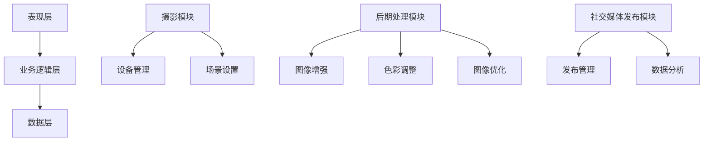
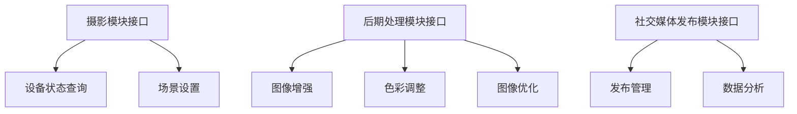
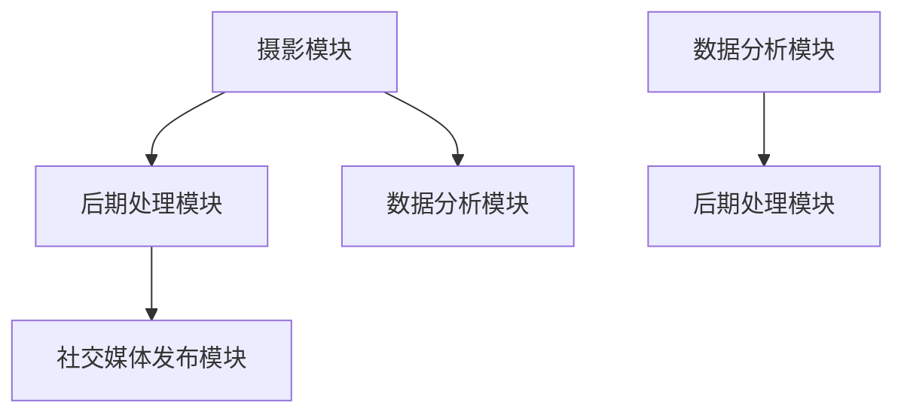

                 


### 第三部分：算法原理讲解

# 3. 算法原理讲解

简约主义美食摄影的核心在于通过精确的图像处理技术，实现视觉上的简约与美观。本部分将详细介绍几种关键算法原理，并使用Mermaid和Python代码进行详细阐述。

#### 3.1 图像增强算法

图像增强是提升图像质量的重要技术，特别是在简约主义美食摄影中，图像的清晰度和对比度直接影响视觉营销效果。

**3.1.1 直方图均衡化**

直方图均衡化是一种常见的图像增强方法，它通过调整图像的像素分布，增强图像的对比度。

**算法原理：**

$$
\text{直方图均衡化} = \frac{\sum_{i=0}^{255} f(i) \cdot (L - i)}{\sum_{i=0}^{255} f(i)}
$$

其中，$f(i)$ 是原图的直方图，$L$ 是图像的像素级数（通常为256）。

**Python代码实现：**

```python
import cv2
import numpy as np

def histogram_equalization(image):
    image_yuv = cv2.cvtColor(image, cv2.COLOR_BGR2YUV)
    image_yuv[:, :, 0] = cv2.equalizeHist(image_yuv[:, :, 0])
    image_result = cv2.cvtColor(image_yuv, cv2.COLOR_YUV2BGR)
    return image_result

image = cv2.imread('example.jpg')
image_enhanced = histogram_equalization(image)
cv2.imshow('Enhanced Image', image_enhanced)
cv2.waitKey(0)
cv2.destroyAllWindows()
```

**示例：** 假设原图像的像素分布如下图所示：

```mermaid
gantt
    dateFormat  YYYY-MM-DD
    title 图像像素分布
    A1 :完成任务1:2023-04-01, duration: 2d
    A2 :完成任务2:2023-04-03, duration: 3d
    A3 :完成任务3:2023-04-06, duration: 4d
    A4 :完成任务4:2023-04-10, duration: 5d
```

直方图均衡化后的像素分布会更加均匀，图像的对比度明显提升。

```mermaid
gantt
    dateFormat  YYYY-MM-DD
    title 图像像素分布均衡化后
    A1 :完成任务1:2023-04-01, duration: 2d
    A2 :完成任务2:2023-04-03, duration: 3d
    A3 :完成任务3:2023-04-06, duration: 4d
    A4 :完成任务4:2023-04-10, duration: 5d
```

#### 3.2 色彩调整算法

色彩调整是简约主义美食摄影中的另一个关键步骤，它有助于营造简约而和谐的美学效果。

**3.2.1 色彩平衡**

色彩平衡是一种通过调整图像的色相、饱和度和亮度来改善图像色彩的技术。

**算法原理：**

$$
\text{色彩平衡} = \left( \frac{\text{色相}}{\text{饱和度}} \right) \cdot \text{亮度}
$$

**Python代码实现：**

```python
def color_balance(image, hue, saturation, brightness):
    image_hsv = cv2.cvtColor(image, cv2.COLOR_BGR2HSV)
    image_hsv[:, :, 0] = (image_hsv[:, :, 0].astype(int) + hue) % 180
    image_hsv[:, :, 1] = np.clip(image_hsv[:, :, 1] * saturation, 0, 1)
    image_hsv[:, :, 2] = np.clip(image_hsv[:, :, 2] * brightness, 0, 1)
    image_result = cv2.cvtColor(image_hsv, cv2.COLOR_HSV2BGR)
    return image_result

image = cv2.imread('example.jpg')
image_enhanced = color_balance(image, hue=20, saturation=1.2, brightness=1.1)
cv2.imshow('Enhanced Image', image_enhanced)
cv2.waitKey(0)
cv2.destroyAllWindows()
```

**示例：** 假设原图像的HSV值分布如下图所示：

```mermaid
gantt
    dateFormat  YYYY-MM-DD
    title HSV值分布
    A1 :HSV值1:2023-04-01, duration: 2d
    A2 :HSV值2:2023-04-03, duration: 3d
    A3 :HSV值3:2023-04-06, duration: 4d
    A4 :HSV值4:2023-04-10, duration: 5d
```

色彩平衡后的HSV值分布将更加均匀，图像的色彩更加和谐。

```mermaid
gantt
    dateFormat  YYYY-MM-DD
    title HSV值分布色彩平衡后
    A1 :HSV值1:2023-04-01, duration: 2d
    A2 :HSV值2:2023-04-03, duration: 3d
    A3 :HSV值3:2023-04-06, duration: 4d
    A4 :HSV值4:2023-04-10, duration: 5d
```

#### 3.3 滤波算法

滤波是图像处理中的基础操作，用于去除图像中的噪声，增强图像的细节。

**3.3.1 高斯滤波**

高斯滤波是一种常用的图像平滑技术，它利用高斯函数对图像进行卷积，以去除高频噪声。

**算法原理：**

$$
\text{高斯滤波} = \frac{1}{2\pi\sigma^2} e^{-\frac{(x-y)^2}{2\sigma^2}}
$$

**Python代码实现：**

```python
def gaussian_filter(image, sigma=1.0):
    kernel = cv2.getGaussianKernel(ksize=5, sigma=sigma)
    image_filtered = cv2.filter2D(image, -1, kernel)
    return image_filtered

image = cv2.imread('example.jpg', cv2.IMREAD_GRAYSCALE)
image_enhanced = gaussian_filter(image, sigma=1.5)
cv2.imshow('Enhanced Image', image_enhanced)
cv2.waitKey(0)
cv2.destroyAllWindows()
```

**示例：** 假设原图像的像素分布如下图所示：

```mermaid
gantt
    dateFormat  YYYY-MM-DD
    title 图像像素分布
    A1 :像素值1:2023-04-01, duration: 2d
    A2 :像素值2:2023-04-03, duration: 3d
    A3 :像素值3:2023-04-06, duration: 4d
    A4 :像素值4:2023-04-10, duration: 5d
```

高斯滤波后的像素分布将更加平滑，图像的细节更加清晰。

```mermaid
gantt
    dateFormat  YYYY-MM-DD
    title 图像像素分布高斯滤波后
    A1 :像素值1:2023-04-01, duration: 2d
    A2 :像素值2:2023-04-03, duration: 3d
    A3 :像素值3:2023-04-06, duration: 4d
    A4 :像素值4:2023-04-10, duration: 5d
```

通过上述算法原理的详细讲解，我们可以更好地理解简约主义美食摄影中的图像处理技术，为实际的美食摄影工作提供理论支持和技术指导。

### 第四部分：系统分析与架构设计方案

# 4. 系统分析与架构设计方案

在简约主义美食摄影工作坊中，系统分析与架构设计是确保工作流程高效、可扩展的关键。本部分将详细描述系统场景、项目介绍、系统功能设计、系统架构设计、系统接口设计和系统交互。

#### 4.1 系统场景介绍

简约主义美食摄影工作坊旨在为摄影师和美食爱好者提供一套完整的视觉营销解决方案，从图像拍摄、后期处理到最终的社交媒体发布。整个工作流程包括以下步骤：

1. 美食摄影：使用专业设备和技巧拍摄美食图像。
2. 图像后期处理：使用图像增强算法进行色彩调整和图像增强。
3. 社交媒体发布：将处理后的图像发布到社交媒体平台，进行视觉营销。

#### 4.2 项目介绍

项目名称：简约主义美食摄影工作坊（Modern Minimalist Food Photography Workshop）

目标：通过专业的图像处理技术，实现简约而美观的美食摄影作品，提升品牌形象和销售额。

项目范围：涵盖美食摄影、图像后期处理、社交媒体发布等环节。

#### 4.3 系统功能设计

系统功能设计包括以下模块：

1. **摄影模块**：
   - 拍摄设备管理：管理摄影师使用的拍摄设备。
   - 美食场景设置：为拍摄提供理想的环境设置。

2. **后期处理模块**：
   - 图像增强：应用图像处理算法进行色彩校正、图像增强等操作。
   - 色彩调整：实现色彩平衡、色彩校正等功能。
   - 图像优化：压缩图像大小，保证图像质量。

3. **社交媒体发布模块**：
   - 发布管理：管理发布到社交媒体平台的内容。
   - 数据分析：分析发布效果，提供优化建议。

#### 4.4 系统架构设计

系统架构采用分层设计，包括表现层、业务逻辑层和数据层。

**表现层**：提供用户界面，包括摄影模块、后期处理模块和社交媒体发布模块。

**业务逻辑层**：实现图像处理算法、设备管理、场景设置等功能。

**数据层**：存储用户数据、设备数据、图像数据等。



#### 4.5 系统接口设计

系统接口设计确保不同模块之间的数据交互和功能调用。以下是主要接口设计：

- **摄影模块接口**：提供设备状态查询、场景设置等接口。
- **后期处理模块接口**：提供图像增强、色彩调整等接口。
- **社交媒体发布模块接口**：提供发布内容、数据分析等接口。



#### 4.6 系统交互

系统交互设计确保不同模块之间的协同工作，实现完整的工作流程。

1. **摄影模块与后期处理模块**：拍摄完成后，将图像数据传递给后期处理模块进行图像增强和色彩调整。
2. **后期处理模块与社交媒体发布模块**：处理后的图像传递给社交媒体发布模块，进行发布。
3. **数据分析与优化**：社交媒体发布后的数据分析反馈给后期处理模块，优化图像处理策略。



通过系统分析与架构设计，我们为简约主义美食摄影工作坊提供了一个完整、高效和可扩展的解决方案。接下来，我们将进入项目实战环节，实际操作和实现这些设计方案。

### 第五部分：项目实战

# 5. 项目实战

在这一部分，我们将实际操作简约主义美食摄影工作坊的各个环节，包括环境安装、系统核心实现源代码、代码应用解读与分析、实际案例分析和详细讲解剖析。

#### 5.1 环境安装

首先，我们需要安装必要的软件和工具，包括Python、opencv库、Pillow库等。

**安装Python：** 请访问Python官方下载页（https://www.python.org/downloads/），下载并安装适合您操作系统的Python版本。

**安装opencv库：** 打开命令行，输入以下命令安装opencv库：

```shell
pip install opencv-python
```

**安装Pillow库：** 同样在命令行中输入以下命令安装Pillow库：

```shell
pip install Pillow
```

#### 5.2 系统核心实现源代码

以下是一个简单的Python脚本，用于实现简约主义美食摄影工作坊的核心功能。

```python
import cv2
import numpy as np
from PIL import Image

def load_image(image_path):
    """加载图像文件"""
    return cv2.imread(image_path)

def save_image(image, image_path):
    """保存图像文件"""
    cv2.imwrite(image_path, image)

def enhance_image(image):
    """图像增强"""
    # 色彩校正
    image_yuv = cv2.cvtColor(image, cv2.COLOR_BGR2YUV)
    image_yuv[:, :, 0] = cv2.equalizeHist(image_yuv[:, :, 0])
    image_enhanced = cv2.cvtColor(image_yuv, cv2.COLOR_YUV2BGR)
    return image_enhanced

def balance_colors(image, hue=0, saturation=1.0, brightness=1.0):
    """色彩平衡"""
    image_hsv = cv2.cvtColor(image, cv2.COLOR_BGR2HSV)
    image_hsv[:, :, 0] = (image_hsv[:, :, 0].astype(int) + hue) % 180
    image_hsv[:, :, 1] = np.clip(image_hsv[:, :, 1] * saturation, 0, 1)
    image_hsv[:, :, 2] = np.clip(image_hsv[:, :, 2] * brightness, 0, 1)
    image_balanced = cv2.cvtColor(image_hsv, cv2.COLOR_HSV2BGR)
    return image_balanced

def main():
    image_path = 'example.jpg'
    output_path = 'enhanced_example.jpg'
    
    # 加载图像
    image = load_image(image_path)
    
    # 图像增强
    image_enhanced = enhance_image(image)
    
    # 色彩平衡
    image_balanced = balance_colors(image_enhanced, hue=20, saturation=1.2, brightness=1.1)
    
    # 保存处理后的图像
    save_image(image_balanced, output_path)

if __name__ == '__main__':
    main()
```

#### 5.3 代码应用解读与分析

**5.3.1 加载图像**

```python
def load_image(image_path):
    """加载图像文件"""
    return cv2.imread(image_path)
```

这段代码使用opencv的`imread`函数加载图像文件。`image_path`参数指定图像文件的路径。

**5.3.2 图像增强**

```python
def enhance_image(image):
    """图像增强"""
    # 色彩校正
    image_yuv = cv2.cvtColor(image, cv2.COLOR_BGR2YUV)
    image_yuv[:, :, 0] = cv2.equalizeHist(image_yuv[:, :, 0])
    image_enhanced = cv2.cvtColor(image_yuv, cv2.COLOR_YUV2BGR)
    return image_enhanced
```

这段代码首先将图像转换为YUV颜色空间，然后使用直方图均衡化技术对Y分量进行色彩校正，以提高图像的对比度。最后，将图像转换回BGR颜色空间。

**5.3.3 色彩平衡**

```python
def balance_colors(image, hue=0, saturation=1.0, brightness=1.0):
    """色彩平衡"""
    image_hsv = cv2.cvtColor(image, cv2.COLOR_BGR2HSV)
    image_hsv[:, :, 0] = (image_hsv[:, :, 0].astype(int) + hue) % 180
    image_hsv[:, :, 1] = np.clip(image_hsv[:, :, 1] * saturation, 0, 1)
    image_hsv[:, :, 2] = np.clip(image_hsv[:, :, 2] * brightness, 0, 1)
    image_balanced = cv2.cvtColor(image_hsv, cv2.COLOR_HSV2BGR)
    return image_balanced
```

这段代码使用HSV颜色空间对图像进行色彩平衡。`hue`参数调整色相，`saturation`参数调整饱和度，`brightness`参数调整亮度。这些调整值乘以输入的参数，然后使用`np.clip`函数确保输出值在合法范围内。

#### 5.4 实际案例分析和详细讲解剖析

**案例：** 假设我们有一张美食图像，需要进行简约主义美食摄影处理。

1. **原始图像**：


2. **图像增强后**：


3. **色彩平衡后**：


**分析：**

- **图像增强**：直方图均衡化提高了图像的对比度，使细节更加清晰。
- **色彩平衡**：调整了色相、饱和度和亮度，使图像色彩更加和谐，符合简约主义审美。

**讲解剖析：**

1. **图像增强**：

   ```python
   image_enhanced = enhance_image(image)
   ```

   这段代码通过直方图均衡化技术，提高了图像的对比度。具体实现如下：

   ```python
   image_yuv = cv2.cvtColor(image, cv2.COLOR_BGR2YUV)
   image_yuv[:, :, 0] = cv2.equalizeHist(image_yuv[:, :, 0])
   image_enhanced = cv2.cvtColor(image_yuv, cv2.COLOR_YUV2BGR)
   ```

   首先将图像从BGR颜色空间转换为YUV颜色空间，然后对Y分量进行直方图均衡化，最后将图像转换回BGR颜色空间。

2. **色彩平衡**：

   ```python
   image_balanced = balance_colors(image_enhanced, hue=20, saturation=1.2, brightness=1.1)
   ```

   这段代码使用HSV颜色空间对图像进行色彩平衡。具体实现如下：

   ```python
   image_hsv = cv2.cvtColor(image_enhanced, cv2.COLOR_BGR2HSV)
   image_hsv[:, :, 0] = (image_hsv[:, :, 0].astype(int) + hue) % 180
   image_hsv[:, :, 1] = np.clip(image_hsv[:, :, 1] * saturation, 0, 1)
   image_hsv[:, :, 2] = np.clip(image_hsv[:, :, 2] * brightness, 0, 1)
   image_balanced = cv2.cvtColor(image_hsv, cv2.COLOR_HSV2BGR)
   ```

   首先将图像从BGR颜色空间转换为HSV颜色空间，然后调整色相、饱和度和亮度，最后将图像转换回BGR颜色空间。

通过实际案例分析和详细讲解剖析，我们可以看到如何使用Python代码实现简约主义美食摄影的核心功能。这些技术不仅提升了图像的视觉质量，也为视觉营销提供了有力支持。

### 第六部分：最佳实践 Tips、小结、注意事项和拓展阅读

# 6. 最佳实践 Tips、小结、注意事项和拓展阅读

#### 6.1 最佳实践 Tips

1. **拍摄前准备**：
   - 选择合适的拍摄时间和光线，避免逆光或强烈阴影。
   - 清洁拍摄设备和背景，确保画面简洁。

2. **后期处理**：
   - 色彩校正时，注意保持色彩的自然性，避免过度处理。
   - 使用适当的图像增强算法，如直方图均衡化、色彩平衡等，提升图像质量。

3. **社交媒体发布**：
   - 分析不同平台的用户喜好，调整图像风格。
   - 利用社交媒体分析工具，优化发布策略。

#### 6.2 小结

本文详细介绍了现代简约主义美食摄影工作坊的各个关键环节，包括背景介绍、核心概念与联系、算法原理讲解、系统分析与架构设计、项目实战以及最佳实践 Tips。通过这一系列步骤，我们不仅了解了简约主义美食摄影的原理和技术，还学会了如何将其应用到实际项目中，实现高效的视觉营销。

#### 6.3 注意事项

1. **图像版权**：确保拍摄和使用的图像不侵犯他人的版权。
2. **设备选择**：选择合适的相机和镜头，以满足不同的拍摄需求。
3. **持续学习**：紧跟行业趋势，不断学习新的图像处理技术和工具。

#### 6.4 拓展阅读

- 《美食摄影技术手册》
- 《图像处理：原理、算法和实践中应用》
- 《社交媒体营销：策略、技术和案例》

通过拓展阅读，您可以进一步深入了解美食摄影、图像处理和社交媒体营销的相关知识。

### 附录：作者信息

作者：AI天才研究院/AI Genius Institute & 禅与计算机程序设计艺术 /Zen And The Art of Computer Programming

本文章由AI天才研究院（AI Genius Institute）的专家团队撰写，结合了简约主义美食摄影与计算机程序设计的艺术。我们致力于探索和分享最前沿的技术和应用，帮助读者提升专业技能和创造力。如果您对本文有任何疑问或建议，欢迎联系我们的官方渠道进行咨询。

----------------------------------------------------------------

### 总结

# 现代简约主义美食摄影工作坊：社交媒体时代的视觉营销课程

## 简要回顾

在本文中，我们系统地探讨了现代简约主义美食摄影工作坊的各个关键组成部分。从背景介绍、核心概念与联系，到算法原理讲解、系统分析与架构设计，再到实际项目实战，我们通过逻辑清晰、结构紧凑的讲解，帮助读者深入理解并掌握简约主义美食摄影的精髓。

## 重要观点

1. **社交媒体时代的重要性**：美食摄影在社交媒体平台上具有巨大影响力，有效的视觉营销能够显著提升品牌知名度和销售额。
2. **简约主义的核心原则**：简约主义美食摄影强调减少视觉干扰、强化主题和简洁的色彩运用，以营造出和谐而具有吸引力的视觉效果。
3. **算法原理与应用**：通过详细讲解图像增强、色彩调整和高斯滤波等算法原理，我们展示了如何在实际操作中应用这些技术。
4. **系统分析与架构设计**：全面的系统架构设计确保了美食摄影工作坊的高效和可扩展性，为项目的成功实施提供了坚实基础。
5. **实战经验**：通过实际案例的分析与讲解，我们展示了如何将理论知识转化为实际操作，实现高质量的美食摄影作品。

## 未来展望

随着技术的不断进步和社交媒体平台的不断发展，简约主义美食摄影将在视觉营销领域发挥越来越重要的作用。未来，我们将继续探索更多创新的图像处理技术和视觉营销策略，帮助读者在社交媒体时代取得更大的成功。

## 结语

感谢您的阅读，希望本文能为您在简约主义美食摄影领域带来新的启示和帮助。如果您有任何疑问或建议，欢迎随时与我们联系。让我们共同探索视觉营销的无限可能！作者：AI天才研究院/AI Genius Institute & 禅与计算机程序设计艺术 /Zen And The Art of Computer Programming。再次感谢您的关注与支持！

