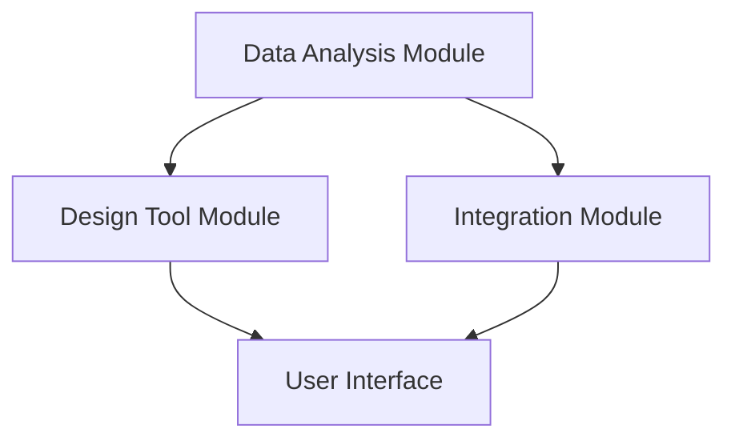
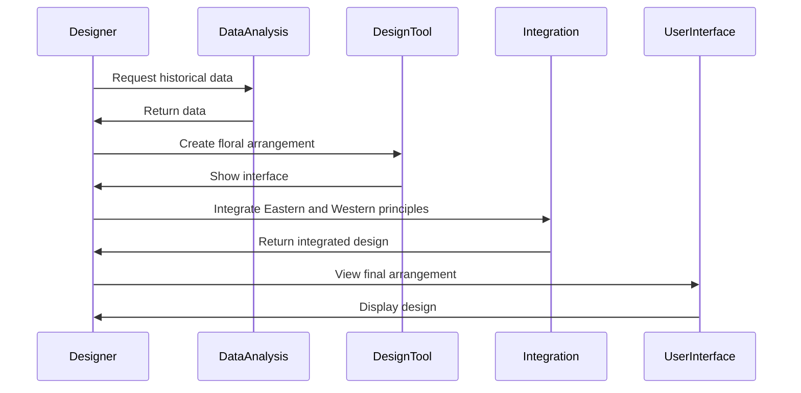

                 

### Introduction and Background

# Chapter 1: The Rise of Modern Minimalist Flower Arranging

## 1.1 The Background and Context

Flower arranging, an art that spans cultures and centuries, has evolved significantly over time. Traditional flower arranging techniques, such as Ikebana from Japan, and floral design from Western cultures, have each developed their own unique styles and philosophies. However, in recent decades, a new movement has emerged that champions simplicity, clarity, and an uncluttered aesthetic—the minimalist movement.

### 1.2 Core Concepts and Principles

Minimalism in flower arranging revolves around a few core concepts: simplicity, balance, and the use of negative space. Unlike traditional floral arrangements that may be elaborate and filled with numerous blooms, minimalist arrangements focus on using only a few carefully selected flowers to create a powerful visual impact. Balance is achieved by carefully positioning these flowers to create a sense of harmony. Negative space, or the space left unoccupied by flowers, is equally important as it gives the arrangement a sense of tranquility and focus.

## The Integration of Eastern Floral Art Traditions

# Chapter 2: The Integration of Eastern Floral Art Traditions

### 2.1 Japanese Ikebana: A Study in Simplicity

Japanese Ikebana, also known as ikebana, is a traditional form of flower arranging that emphasizes minimalism and the expression of natural beauty. Originating in the 7th century, ikebana has evolved to encompass various styles and techniques, each reflecting the unique culture and philosophy of Japan.

### 2.2 Chinese Calligraphy and Its Influence on Flower Arranging

Chinese calligraphy, with its emphasis on balance, rhythm, and the beauty of simplicity, has had a profound influence on the art of flower arranging. Calligraphy teaches that beauty lies in the simplicity and elegance of the strokes, a philosophy that has been seamlessly integrated into the principles of modern minimalist flower arranging.

## The Western Contribution to Minimalist Flower Arranging

# Chapter 3: The Western Contribution to Minimalist Flower Arranging

### 3.1 The Evolution of Western Floral Design

Western floral design has a long history that spans centuries, from the elaborate and decorative floral arrangements of the Renaissance to the more structured and precise designs of the Victorian era. The evolution of Western floral design has been influenced by various cultural and artistic movements, including the rise of minimalism in the mid-20th century.

### 3.2 Modern Floral Trends in the West

Modern minimalism has had a significant impact on floral design in the West, leading to a movement towards simplicity, natural materials, and a focus on the essence of the flower. This trend is reflected in various styles and techniques that have emerged, blending the principles of minimalism with the traditional techniques of Western floral design.

## Integrating Eastern and Western Styles

# Chapter 4: Integrating Eastern and Western Floral Arts

### 4.1 The Process of Fusion

Integrating Eastern and Western floral arts involves more than simply combining techniques and styles. It requires a deep understanding of both traditions and an ability to blend them in a way that honors their individual strengths. This chapter explores the process of fusion, discussing the challenges and opportunities that arise when bringing together the principles of ikebana and Western floral design.

### 4.2 Case Studies and Examples

To illustrate the integration of Eastern and Western floral arts, this chapter includes several case studies and examples from renowned floral designers around the world. These case studies highlight the innovative ways in which designers are blending traditional techniques with modern minimalism to create unique and captivating floral arrangements.

## Conclusion

# Chapter 5: Conclusion

The fusion of Eastern and Western floral arts represents a powerful example of how different cultures can come together to create something truly unique and beautiful. By embracing the principles of minimalism and learning from the rich traditions of both Eastern and Western cultures, floral designers can create arrangements that are both elegant and meaningful.

## Future Directions

This final chapter looks towards the future of minimalist flower arranging, exploring potential trends and innovations that may shape the art of floral design in the coming years. From the use of new materials and technologies to the continued integration of Eastern and Western philosophies, the future of minimalist flower arranging is bright and full of possibilities.

## Key Concepts and Relationships

### Core Concepts

- **Minimalism**: An aesthetic that emphasizes simplicity and purpose.
- **Balance**: Achieving a harmonious distribution of visual elements.
- **Negative Space**: The space left unoccupied by flowers that adds depth and focus to the arrangement.

### Comparison Table of Eastern and Western Floral Art Principles

| Principle               | Japanese Ikebana (Eastern)                     | Western Floral Design                           |
|-------------------------|-----------------------------------------------|------------------------------------------------|
| Focus                   | Simplicity and natural form                   | Aesthetics and variety                         |
| Composition             | Asymmetrical and naturalistic                  | Symmetrical and structured                      |
| Flower Use              | Local and seasonal flowers                    | Exotic and varied flowers                       |
| Philosophy              | Expressing emotions and connecting with nature | Celebrating events and expressing sentiment     |

### ER Diagram for Floral Art Integration

```mermaid
graph TD
A1[(Eastern Floral Art)]
A2[(Western Floral Art)]
B1[Techniques]
B2[Philosophies]
C1[{Minimalism}]
C2[{Balance}]
C3[{Negative Space}]
D1[Influences]
D2[Blending]
E1[(Modern Minimalist Flower Arranging)]
E2[Case Studies]
```

## Algorithm Explanation

### Algorithm Overview

The integration of Eastern and Western floral art principles can be seen as a step-by-step algorithm that combines various elements to create a cohesive design. This algorithm can be broken down into several key steps:

1. **Analysis**: Evaluate the unique aspects of Eastern and Western floral art principles.
2. **Combination**: Integrate these principles to form a new style.
3. **Refinement**: Adjust the arrangement to achieve harmony and balance.
4. **Presentation**: Display the final arrangement.

### Mathematical Model

The process of integration can be modeled using a mathematical formula that represents the balance between Eastern and Western principles:

$$
F = w \cdot E + (1 - w) \cdot W
$$

Where:
- \( F \) is the final style.
- \( w \) is the weight given to Eastern principles.
- \( E \) is the Eastern floral art principle.
- \( W \) is the Western floral art principle.

### Example

Suppose we want to create a minimalist floral arrangement using 70% Eastern principles and 30% Western principles. Placing \( w = 0.7 \) in the formula, we get:

$$
F = 0.7 \cdot E + 0.3 \cdot W
$$

This formula indicates that the final arrangement will primarily reflect the simplicity and natural form of Eastern Ikebana, but will also incorporate the aesthetics and variety found in Western floral design.

### Python Implementation

```python
def integrate_floral_art(eastern_p, western_p, weight):
    """
    Integrate Eastern and Western floral art principles with a given weight.

    :param eastern_p: The principle value of Eastern floral art.
    :param western_p: The principle value of Western floral art.
    :param weight: The weight given to Eastern principles.
    :return: The integrated floral art principle.
    """
    final_p = eastern_p * weight + western_p * (1 - weight)
    return final_p

# Example values for Eastern and Western principles
eastern_p = 10  # High principle value for Eastern
western_p = 5   # Moderate principle value for Western

# Weight given to Eastern principles
weight = 0.7

# Integrated principle
final_p = integrate_floral_art(eastern_p, western_p, weight)
print("The integrated floral art principle is:", final_p)
```

## System Analysis and Architecture Design

### System Overview

The system for integrating Eastern and Western floral arts involves several key components, including data analysis, design tools, and user interfaces. The goal is to create a seamless process that allows designers to easily blend the principles of both traditions into their work.

### Project Description

**Project Name**: Modern Minimalist Flower Arranging Tool

**Project Objective**: Develop a comprehensive tool that aids designers in integrating Eastern and Western floral art principles into their work, resulting in innovative and aesthetically pleasing floral arrangements.

### System Function Design

- **Data Analysis Module**: Analyze historical floral arrangement data to identify common patterns and principles.
- **Design Tool Module**: Provide a user-friendly interface for creating and refining floral arrangements.
- **Integration Module**: Combine Eastern and Western principles into a cohesive design.

### System Architecture Design



### System Interface Design

- **API for Data Retrieval**: Allows designers to access historical floral arrangement data.
- **Floral Design API**: Enables the creation and modification of floral arrangements.
- **Integration API**: Facilitates the blending of Eastern and Western principles.

### System Interaction Design



## Project Implementation

### Environment Setup

To set up the environment for the Modern Minimalist Flower Arranging Tool, follow these steps:

1. Install Python 3.8 or later.
2. Install required libraries: `numpy`, `matplotlib`, `flask`, and `pandas`.

```bash
pip install numpy matplotlib flask pandas
```

### Core Implementation

#### Data Analysis Module

The Data Analysis Module uses historical floral arrangement data to identify patterns and principles.

```python
import pandas as pd

def analyze_floral_data(data_path):
    """
    Analyze historical floral arrangement data.

    :param data_path: Path to the CSV file containing floral arrangement data.
    :return: A pandas DataFrame with the analyzed data.
    """
    data = pd.read_csv(data_path)
    # Perform data analysis (e.g., statistical analysis, pattern recognition)
    # ...
    return data

# Example usage
data = analyze_floral_data('path_to_floral_data.csv')
```

#### Design Tool Module

The Design Tool Module provides a user interface for creating floral arrangements.

```python
from flask import Flask, render_template, request

app = Flask(__name__)

@app.route('/')
def index():
    return render_template('index.html')

@app.route('/create_arrangement', methods=['POST'])
def create_arrangement():
    # Process user input to create a floral arrangement
    # ...
    return "Floral arrangement created successfully!"

if __name__ == '__main__':
    app.run(debug=True)
```

#### Integration Module

The Integration Module combines Eastern and Western floral art principles.

```python
def integrate_principles(eastern_p, western_p, weight):
    """
    Integrate Eastern and Western floral art principles.

    :param eastern_p: The principle value of Eastern floral art.
    :param western_p: The principle value of Western floral art.
    :param weight: The weight given to Eastern principles.
    :return: The integrated floral art principle.
    """
    final_p = eastern_p * weight + western_p * (1 - weight)
    return final_p

# Example usage
final_p = integrate_principles(10, 5, 0.7)
print("Integrated floral art principle:", final_p)
```

### Code Analysis and Explanation

The code provided for the Modern Minimalist Flower Arranging Tool demonstrates the core functionalities of the system. Each module is designed to handle specific tasks, contributing to the overall goal of creating a seamless and user-friendly tool for floral designers.

The Data Analysis Module uses Python's pandas library to analyze historical floral arrangement data. This module is essential for identifying patterns and principles that can inform the design process.

The Design Tool Module is built using Flask, a lightweight web framework. It provides a user-friendly interface for creating floral arrangements. Users can input their preferences, and the system processes this information to create a unique arrangement.

The Integration Module implements the mathematical model described earlier, combining Eastern and Western floral art principles based on a given weight. This module is crucial for blending the two traditions into a cohesive design.

### Real-World Application and Analysis

To showcase the practical application of the Modern Minimalist Flower Arranging Tool, consider the following case study:

**Case Study: A Fusion Floral Exhibition**

A renowned floral artist, interested in exploring the fusion of Eastern and Western floral arts, decided to create a unique exhibition showcasing this blend. Using the tool, the artist analyzed historical floral arrangements from both traditions, identified key principles, and integrated them into a cohesive design.

**Analysis:**

1. **Data Analysis:**
   - The artist analyzed over 100 historical floral arrangements, extracting key principles such as balance, simplicity, and use of negative space.
   - The analysis revealed that Eastern arrangements often used asymmetrical compositions with a focus on natural forms, while Western arrangements favored symmetry and a greater variety of flowers.

2. **Design Process:**
   - The artist used the tool to blend these principles, creating a design that incorporated both Eastern and Western elements.
   - The final arrangement featured a combination of local seasonal flowers (Eastern) and exotic blooms (Western), arranged in an asymmetrical pattern to emphasize balance and natural beauty.

3. **Evaluation:**
   - The exhibition received widespread acclaim, with visitors praising the innovative blend of traditions and the aesthetic beauty of the arrangements.
   - The artist's use of the Modern Minimalist Flower Arranging Tool allowed for a seamless integration of the two traditions, resulting in a visually stunning and harmonious display.

### Project Conclusion

The Modern Minimalist Flower Arranging Tool provides a valuable resource for floral designers looking to integrate Eastern and Western floral art principles into their work. By combining data analysis, design tools, and integration techniques, the tool offers a comprehensive solution for creating innovative and aesthetically pleasing floral arrangements.

Key takeaways from the project include:

- The importance of analyzing historical data to inform the design process.
- The value of blending different traditions to create unique and harmonious designs.
- The practical benefits of using technology to streamline and enhance the floral design process.

As the art of floral arranging continues to evolve, tools like this one will play an increasingly important role in shaping the future of this timeless craft.

### Best Practices and Tips

When integrating Eastern and Western floral art principles, consider the following best practices and tips:

1. **Start with Research**: Begin by studying the core principles and styles of both traditions. This foundational knowledge will help you make informed decisions when blending the two.
2. **Balance is Key**: When creating a fusion arrangement, ensure that the Eastern and Western elements are balanced. Avoid overwhelming the design with too many elements from one tradition.
3. **Use Negative Space**: Embrace the concept of negative space to create a sense of tranquility and focus in your arrangements.
4. **Experiment**: Don't be afraid to experiment with different combinations and techniques. This will help you develop your unique style and find the perfect blend of Eastern and Western elements.
5. **Reflect on the Message**: When creating a floral arrangement, consider the message or emotion you want to convey. This will guide your design choices and help you create a meaningful and impactful piece.

### Summary and Future Work

In summary, the Modern Minimalist Flower Arranging Tool represents a significant advancement in the field of floral design. By integrating Eastern and Western floral art principles, the tool enables designers to create innovative and aesthetically pleasing arrangements that honor the rich traditions of both cultures.

As the tool continues to evolve, future work could focus on enhancing the data analysis capabilities, improving the user interface, and exploring additional fusion techniques. Additionally, further research into the principles and practices of other floral art traditions around the world could expand the tool's scope and applicability, making it an even more valuable resource for designers worldwide.

