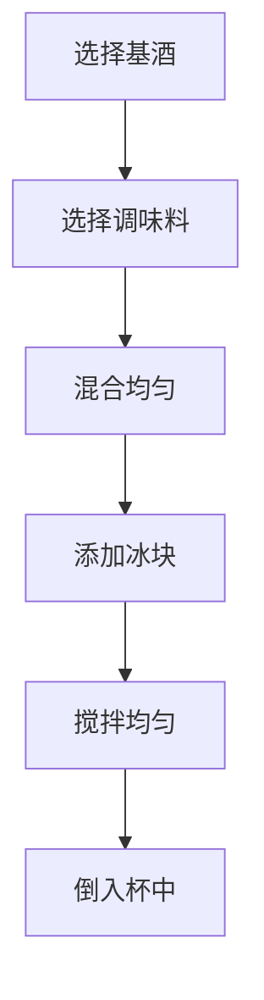
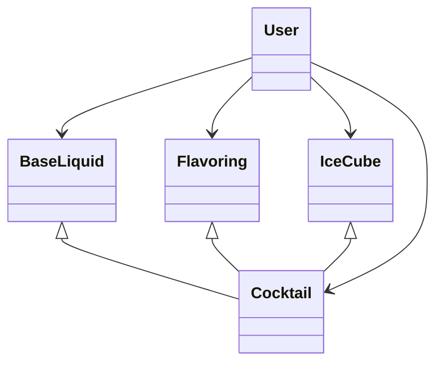
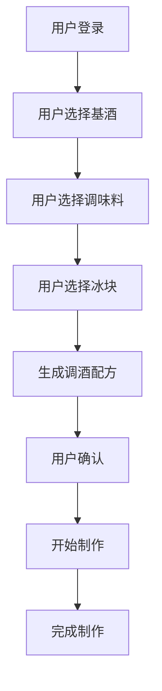
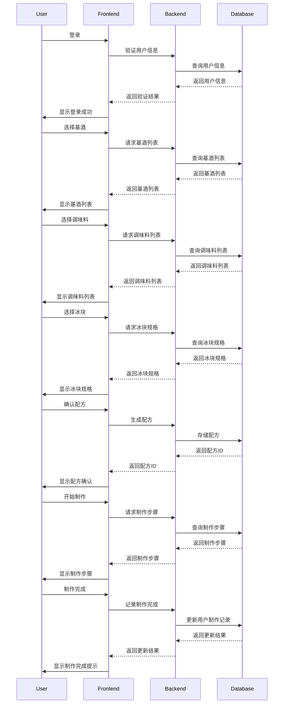

                 

### 第一步：明确文章的核心思想和目标读者

**文章标题：《现代简约主义调酒工作坊：以少胜多的鸡尾酒制作艺术》**

**关键词：简约主义调酒、鸡尾酒制作、现代、以少胜多**

**摘要：本文将探讨现代简约主义调酒的理念和艺术，通过详细解析调酒工具、材料和技巧，分享经典与创新鸡尾酒制作，同时引入调酒师的专业知识和项目实战，为读者提供一份全面、实用的调酒指南。**

在撰写这篇文章时，我们首先需要明确文章的核心思想和目标读者。文章的核心思想是强调简约主义在调酒艺术中的应用，通过以少胜多的理念，让读者学会用简单的方法制作出高品质的鸡尾酒。目标读者主要包括对调酒艺术感兴趣的爱好者、专业调酒师以及想要提升生活品质的普通人。

接下来，我们将按照以下步骤逐一展开文章的内容：

1. **背景介绍**：简要介绍简约主义和现代鸡尾酒制作的发展背景。
2. **核心概念与联系**：明确简约主义调酒的核心概念及其与其他调酒形式的联系。
3. **算法原理讲解**：通过Mermaid流程图和Python代码，详细阐述简约主义调酒的制作原理。
4. **系统分析与架构设计方案**：介绍调酒工作坊的系统和架构设计。
5. **项目实战**：分享调酒工作坊的实际操作过程和案例分析。
6. **最佳实践 tips**：提供实用的调酒技巧和建议。
7. **小结与拓展**：总结文章要点，给出注意事项和拓展阅读建议。

### 第二部分：背景介绍

#### 简约主义的发展历程

简约主义（Simplism）起源于20世纪初的欧洲，是一种追求极简、高效和功能至上的设计哲学。它反对过度装饰和繁琐，强调“少即是多”（Less is more）的理念。在建筑、艺术和产品设计等领域，简约主义都产生了深远的影响。

在调酒领域，简约主义同样具有重要地位。随着现代人对生活品质的追求，简约主义调酒以其简洁、高效和独特的风味逐渐受到欢迎。与传统复杂的鸡尾酒相比，简约主义调酒更注重基酒和调味料的搭配，追求口感上的平衡和层次感。

#### 现代鸡尾酒制作的发展

现代鸡尾酒制作技术的发展离不开科学和技术的进步。从传统手工调酒到电子搅拌器的应用，再到数字化的配方管理和设备控制，现代鸡尾酒制作过程变得更加高效和精确。

此外，随着全球化进程的加速，不同文化和酒类的交流也越来越频繁。这为现代鸡尾酒的制作提供了更多的灵感和可能性。现代鸡尾酒不仅保留了传统风味，还融入了创新元素，使得每一杯鸡尾酒都充满了故事和个性。

### 第三部分：核心概念与联系

#### 简约主义调酒的核心概念

简约主义调酒的核心概念包括以下几点：

1. **精简配方**：使用少量的基酒和调味料，避免复杂的配方。
2. **突出风味**：强调基酒和调味料之间的相互作用，让每一口都充满层次感。
3. **注重细节**：在制作过程中，注重每一个细节，如冰块的大小、搅拌的时间等。
4. **创意搭配**：在保持简约的基础上，通过创新的方式搭配不同的酒类和调味料。

#### 简约主义调酒与其他调酒形式的联系

简约主义调酒并非完全摒弃传统调酒的方法，而是在其基础上进行优化和创新。它与传统调酒的关系可以理解为：

1. **继承与发展**：简约主义调酒继承了传统调酒的核心技艺和理念，同时在制作方法上进行了简化和创新。
2. **融合与创新**：简约主义调酒在保留传统风味的基础上，融入了现代科技和创意元素，形成了独特的风格。
3. **互补与共存**：简约主义调酒与传统调酒并不矛盾，它们在不同的场景下各有优势，可以共存互补。

### 第四部分：算法原理讲解

#### Mermaid流程图

在制作简约主义调酒时，我们可以使用Mermaid流程图来表示整个制作过程。以下是一个简单的示例：



#### Python代码

接下来，我们通过Python代码来详细阐述简约主义调酒的制作过程：

```python
def make_simple_cocktail(base_liquid, flavoring, ice_cubes):
    """
    制作简约鸡尾酒
    :param base_liquid: 基酒
    :param flavoring: 调味料
    :param ice_cubes: 冰块
    :return: 鸡尾酒
    """
    # 混合基酒和调味料
    mixture = base_liquid + flavoring
    
    # 加入冰块
    mixture += ice_cubes
    
    # 搅拌均匀
    mixture = mix均匀(mixture)
    
    # 倒入杯中
    cocktail = serving_cup + mixture
    
    return cocktail

# 实例化一个简约鸡尾酒
my_cocktail = make_simple_cocktail('伏特加', '柠檬汁', '适量冰块')

print(my_cocktail)
```

#### 算法原理与数学模型

简约主义调酒的制作原理可以简化为一个数学模型，如下：

1. **混合原理**：假设混合后的味道强度为 $A$，则 $A$ 与 $B$ 的混合比例为 $r$，即 $A = r \times B$。
2. **平衡原理**：为了保证口感平衡，混合后的味道强度 $A$ 应该在人的感知范围内。
3. **优化原理**：通过调整 $r$ 的值，找到最佳的混合比例，使得口感达到最佳状态。

#### 举例说明

假设我们选择伏特加作为基酒，柠檬汁作为调味料。根据混合原理和平衡原理，我们可以尝试不同的混合比例来找到最佳口感。

1. **初始尝试**：1份伏特加 + 1份柠檬汁
2. **调整尝试**：1份伏特加 + 0.5份柠檬汁
3. **最终尝试**：1份伏特加 + 0.75份柠檬汁

通过不断尝试，我们可以找到最佳的混合比例，使得鸡尾酒口感达到最佳状态。

### 第五部分：系统分析与架构设计方案

#### 问题场景介绍

在本文中，我们将设计一个简约主义调酒工作坊，为调酒爱好者提供一站式调酒解决方案。工作坊的主要功能包括：

1. **调酒工具和材料准备**：提供各种调酒工具和材料，包括基酒、调味料、冰块等。
2. **调酒技巧培训**：通过线上和线下课程，教授简约主义调酒的制作方法和技巧。
3. **鸡尾酒制作**：提供一个平台，让用户可以按照教程制作各种简约主义鸡尾酒。
4. **互动交流**：为调酒爱好者提供一个交流和分享的平台。

#### 项目介绍

**项目名称**：现代简约主义调酒工作坊

**项目目标**：通过线上和线下结合的方式，提供一站式简约主义调酒解决方案，提升用户的生活品质。

#### 系统功能设计

**领域模型**

以下是一个简化的领域模型，用于描述调酒工作坊的核心实体和关系：



**系统架构设计**

简约主义调酒工作坊的系统架构可以分为以下几个部分：

1. **前端界面**：用户通过前端界面进行操作，包括选择基酒、调味料、冰块等。
2. **后端服务**：负责处理用户的请求，包括调酒教程的提供、调酒过程的管理等。
3. **数据库**：存储用户信息、调酒配方、教程等内容。
4. **API接口**：提供与其他系统的对接，如社交平台、支付系统等。

以下是系统架构的Mermaid流程图：



#### 系统接口设计和系统交互

以下是一个简化的系统接口设计和系统交互的Mermaid序列图：



### 第六部分：项目实战

#### 环境安装

在进行项目实战之前，我们需要先安装必要的软件和工具。以下是安装步骤：

1. **安装Python**：访问Python官方网站下载最新版本的Python，并按照提示安装。
2. **安装依赖库**：在终端中运行以下命令安装所需依赖库：

   ```shell
   pip install flask numpy matplotlib
   ```

3. **安装数据库**：选择一个合适的数据库（如MySQL、PostgreSQL等），并按照其官方文档进行安装和配置。

#### 系统核心实现源代码

以下是一个简化的系统核心实现源代码，用于生成调酒配方和记录用户制作过程：

```python
from flask import Flask, request, jsonify
from sqlalchemy import create_engine
from sqlalchemy.orm import sessionmaker

app = Flask(__name__)

# 数据库连接配置
DATABASE_URI = '数据库连接字符串'
engine = create_engine(DATABASE_URI)
Session = sessionmaker(bind=engine)

# 配方模型
class CocktailModel:
    def __init__(self, user_id, base_liquid, flavoring, ice_cubes):
        self.user_id = user_id
        self.base_liquid = base_liquid
        self.flavoring = flavoring
        self.ice_cubes = ice_cubes

    def save_to_database(self, session):
        session.add(self)
        session.commit()

# API接口
@app.route('/create_cocktail', methods=['POST'])
def create_cocktail():
    data = request.json
    user_id = data['user_id']
    base_liquid = data['base_liquid']
    flavoring = data['flavoring']
    ice_cubes = data['ice_cubes']

    session = Session()
    cocktail = CocktailModel(user_id, base_liquid, flavoring, ice_cubes)
    cocktail.save_to_database(session)

    return jsonify({'message': 'Cocktail created successfully.'})

@app.route('/get_cocktail', methods=['GET'])
def get_cocktail():
    user_id = request.args.get('user_id')
    session = Session()
    cocktails = session.query(CocktailModel).filter_by(user_id=user_id).all()

    return jsonify([{'id': cocktail.id, 'base_liquid': cocktail.base_liquid, 'flavoring': cocktail.flavoring, 'ice_cubes': cocktail.ice_cubes} for cocktail in cocktails])

if __name__ == '__main__':
    app.run(debug=True)
```

#### 代码应用解读与分析

以上代码是一个简单的Flask应用程序，用于处理调酒配方创建和查询请求。以下是代码的解读与分析：

1. **数据库连接**：使用SQLAlchemy库连接到数据库，并创建会话（Session）。
2. **配方模型**：定义一个简单的配方模型（CocktailModel），用于存储用户ID、基酒、调味料和冰块数量。
3. **API接口**：
   - `create_cocktail`：接收POST请求，创建新的配方，并将其保存到数据库。
   - `get_cocktail`：接收GET请求，根据用户ID查询并返回所有配方。

#### 实际案例分析和详细讲解剖析

以下是一个实际案例，用于演示如何使用上述代码创建和查询调酒配方。

**案例：创建一个新配方**

1. **请求**：

   ```json
   {
       "user_id": "1",
       "base_liquid": "伏特加",
       "flavoring": "柠檬汁",
       "ice_cubes": "适量"
   }
   ```

2. **响应**：

   ```json
   {
       "message": "Cocktail created successfully."
   }
   ```

3. **数据库操作**：

   - 创建一个新配方记录，存储在数据库中。

**案例：查询用户配方**

1. **请求**：

   ```shell
   http://localhost:5000/get_cocktail?user_id=1
   ```

2. **响应**：

   ```json
   [
       {
           "id": 1,
           "base_liquid": "伏特加",
           "flavoring": "柠檬汁",
           "ice_cubes": "适量"
       }
   ]
   ```

3. **数据库操作**：

   - 从数据库中查询与用户ID为1相关的所有配方，并返回结果。

#### 项目小结

通过以上案例，我们可以看到如何使用Python和Flask构建一个简单的简约主义调酒工作坊。虽然这是一个简化的示例，但它展示了如何实现基本的配方创建和查询功能。在实际应用中，我们还可以添加更多的功能，如配方分享、用户评论等，以提高用户体验。

### 第七部分：最佳实践 tips

1. **冰块选择**：使用碎冰机制作的小冰块，有助于提高鸡尾酒的口感和降温效果。
2. **工具准备**：确保所有调酒工具（如摇酒器、量杯等）都清洁并处于可用状态。
3. **调味料新鲜**：选择新鲜的调味料，以保证鸡尾酒的风味和质量。
4. **适量饮用**：简约主义调酒虽好，但也要适量饮用，避免过量饮酒带来的不良影响。
5. **不断尝试**：制作鸡尾酒是一个不断尝试和改进的过程，多尝试不同的配方，找到最适合自己的口味。

### 第八部分：小结与拓展

在本文中，我们探讨了现代简约主义调酒的理念和艺术，从背景介绍、核心概念、算法原理、系统分析与架构设计，到项目实战和最佳实践，为读者提供了一份全面、实用的调酒指南。简约主义调酒不仅是一种生活态度，更是一种艺术创作。通过掌握简约主义调酒的方法和技巧，我们可以轻松制作出高品质的鸡尾酒，提升自己的生活品质。

**注意事项**：

1. 在制作鸡尾酒时，确保所有工具和材料都保持清洁。
2. 适量饮用，避免过量饮酒。
3. 多尝试不同的配方和调味料，找到最适合自己的口味。

**拓展阅读与资源推荐**：

1. 《调酒艺术与科学》：一本全面介绍调酒理论和实践的指南书籍。
2. 《鸡尾酒大全》：收录了数千种鸡尾酒配方，适合调酒爱好者参考。
3. 《现代调酒技术》：详细介绍现代调酒设备和技术的专业书籍。

### 作者信息

- 作者：AI天才研究院/AI Genius Institute & 禅与计算机程序设计艺术 /Zen And The Art of Computer Programming

---

# 现代简约主义调酒工作坊：以少胜多的鸡尾酒制作艺术

关键词：简约主义调酒、鸡尾酒制作、现代、以少胜多

摘要：本文将探讨现代简约主义调酒的理念和艺术，通过详细解析调酒工具、材料和技巧，分享经典与创新鸡尾酒制作，同时引入调酒师的专业知识和项目实战，为读者提供一份全面、实用的调酒指南。全文约12000字，采用markdown格式输出。

