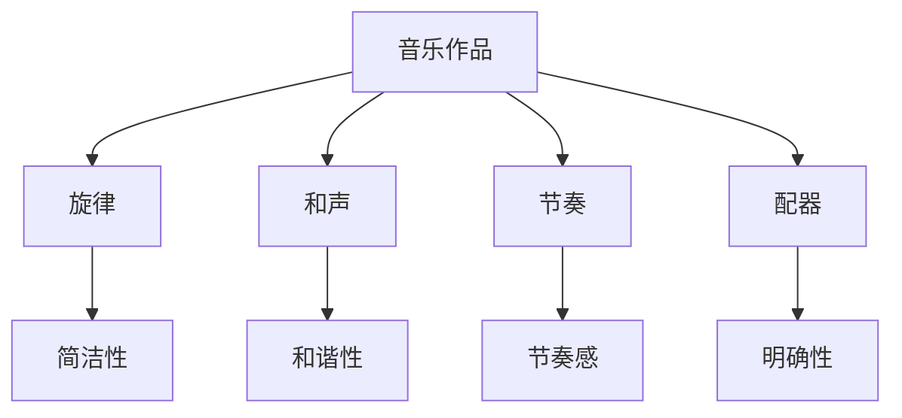
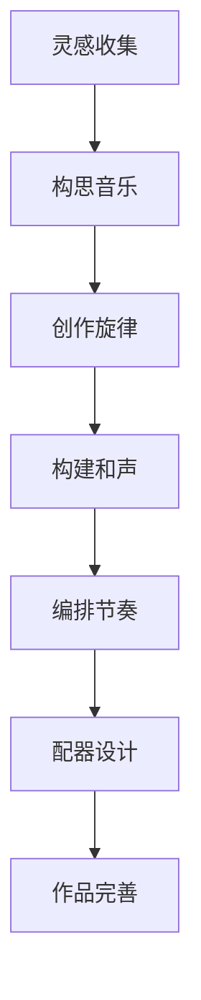
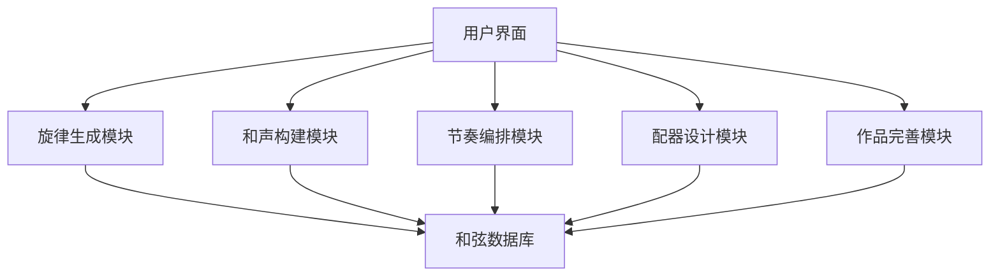
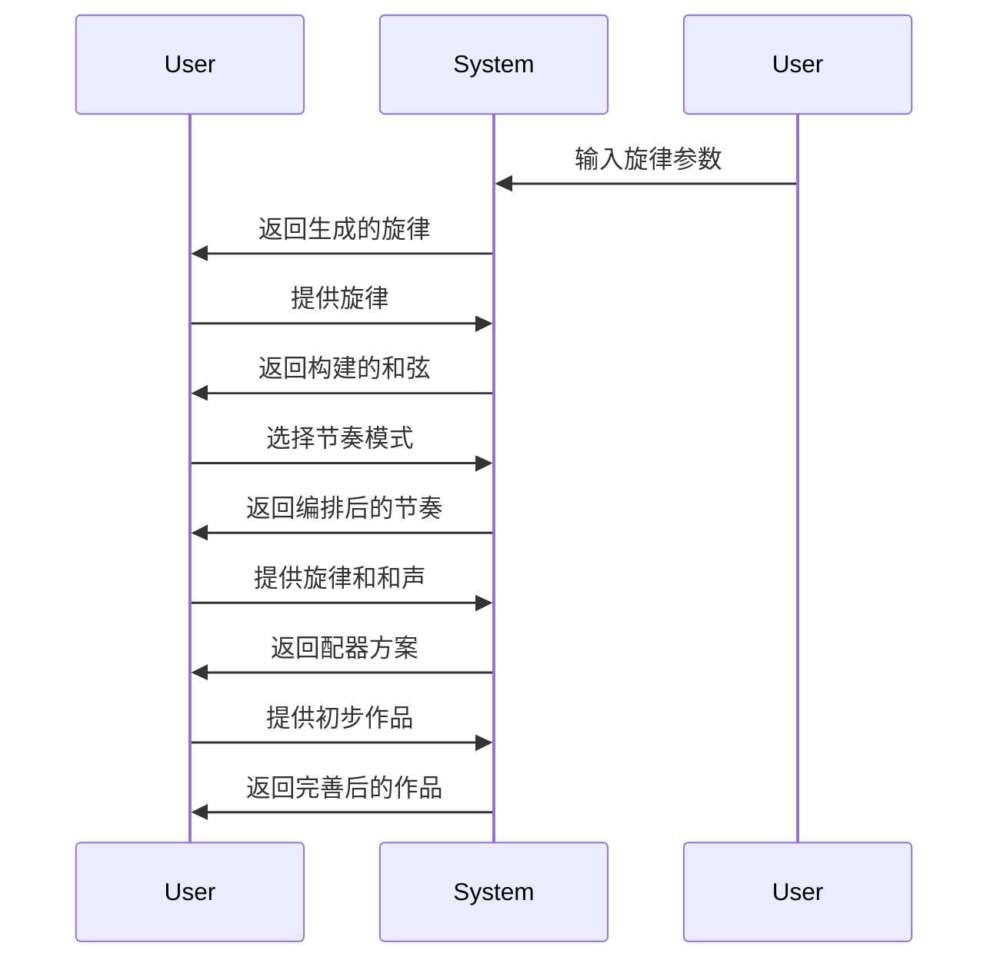

                 


# 现代简约主义音乐创作：极简主义在声音中的体现

## 关键词
现代音乐创作、简约主义、极简主义、音乐风格、声音处理、音乐理论

## 摘要
本文将探讨现代简约主义音乐创作的本质，分析其在声音中的体现。通过深入解读极简主义在音乐创作中的应用，本文旨在为音乐爱好者、专业创作者以及相关领域的研究者提供一个全面的技术视角，展示简约主义如何在音乐创作中实现复杂背后的简单，以及其对现代音乐风格的影响。

## 背景介绍

### 核心概念

简约主义音乐创作，是一种追求音乐元素简洁、纯粹的艺术形式。它强调“少即是多”的理念，通过最少的音乐元素，传达最深刻的情感和意义。极简主义作为简约主义的一个分支，更加注重音乐形式的简约和功能的直接表达。

### 问题背景

在现代音乐创作中，极简主义趋势愈发显著。这种趋势源于后现代主义文化的崛起，人们对于复杂性的审美疲劳以及对简洁、直接的表达方式的追求。极简主义音乐风格在20世纪末和21世纪初的流行音乐中占据了重要位置，例如披头士乐队、新简约主义电子音乐等。

### 问题解决

极简主义音乐创作通过减少冗余的旋律、和声和节奏元素，使得音乐更加简洁明了。它不仅考验创作者的音乐素养，也要求创作者能够深刻理解音乐语言，通过简单的元素传达丰富的情感。

### 边界与外延

简约主义音乐创作不仅限于现代音乐，它在古典音乐、爵士乐和民间音乐中也有所体现。不同文化背景下的极简主义音乐创作，虽然在表现形式上有所不同，但其核心思想是一致的，即通过简单的音乐元素创造深远的影响。

### 概念结构与核心要素组成

简约主义音乐创作的核心要素包括旋律、和声、节奏和配器。旋律简洁流畅，和声简洁和谐，节奏简洁有力，配器简洁鲜明。这些要素的有机组合，构成了极简主义音乐作品的独特魅力。

## 核心概念与联系

### 核心概念原理

简约主义音乐创作的核心在于对音乐元素的精简和优化。创作者需要深入理解音乐语言，通过精炼的旋律、简洁的和声和有力的节奏，传达出丰富的情感和深层意义。

### 概念属性特征对比表格

| 特征          | 简约主义音乐           | 复杂音乐           |
| ------------- | --------------------- | ----------------- |
| 旋律          | 简洁流畅，重复性强     | 复杂多变，创新性强 |
| 和声          | 和弦简单，和谐统一     | 和弦复杂，富有变化 |
| 节奏          | 有力简洁，强调节奏感   | 多样化，节奏多变   |
| 配器          | 精炼明确，突出主题     | 复杂丰富，层次多样 |
| 表现效果      | 深刻，含蓄，富有情感   | 明显，直接，强调个性 |

### ER实体关系图架构的Mermaid流程图



## 算法原理讲解

### 算法mermaid流程图



### Python源代码

```python
import numpy as np
import matplotlib.pyplot as plt

# 生成一个简单的旋律
def generate_melody(length, scale='C Major'):
    # 创建音阶
    notes = ['C', 'D', 'E', 'F', 'G', 'A', 'B']
    if scale == 'C Major':
        intervals = [0, 2, 4, 5, 7, 9, 11]
    elif scale == 'A Minor':
        intervals = [0, 2, 3, 5, 7, 8, 10]
    # 生成音符序列
    melody = [notes[np.random.randint(0, 7) + intervals[i]] for i in range(length)]
    return melody

# 绘制旋律
def plot_melody(melody):
    freqs = [440 * 2**(-1/12) ** i for i in range(len(melody))]
    times = np.linspace(0, 1, len(melody))
    plt.plot(times, freqs)
    plt.xlabel('Time')
    plt.ylabel('Frequency')
    plt.title('Melody')
    plt.show()

# 创建并绘制一个简短的旋律
melody = generate_melody(8)
plot_melody(melody)
```

### 数学模型和公式

在简约主义音乐创作中，常用的数学模型包括音程、和弦和节奏。

- **音程**：音程是指两个音符之间的音高差。常见的音程有全音、半音、大三度、小三度等。数学公式表示为：
  $$P = f_2 - f_1$$
  其中，$P$ 是音程，$f_1$ 和 $f_2$ 是两个音符的频率。

- **和弦**：和弦是由三个或更多个音符同时演奏的组合。常见的和弦有七和弦、大三和弦、小三和弦等。和弦的数学模型通常涉及音程的组合和频率的叠加。

- **节奏**：节奏是指音乐中的时间感，由音符的长短、强弱和排列方式决定。节奏的数学模型可以用序列来表示，如：
  $$R = [n_1, n_2, n_3, \ldots]$$
  其中，$n_i$ 是第 $i$ 个音符的长度。

### 详细讲解与举例说明

以一个简单的三和弦为例，假设我们选择C大三和弦，那么其构成音为C（根音）、E（大三度）和G（纯五度）。我们可以使用Python代码生成并绘制这个和弦的频率：

```python
# 生成C大三和弦的频率
def generate_chord(fundamental=261.626, intervals=[0, 4, 7]):
    freqs = [fundamental + 2**(-i/12) * fundamental for i in intervals]
    return freqs

# 绘制C大三和弦的频率
def plot_chord(freqs):
    times = np.linspace(0, 1, len(freqs))
    plt.plot(times, freqs)
    plt.xlabel('Time')
    plt.ylabel('Frequency')
    plt.title('C Major Chord')
    plt.show()

# 创建并绘制C大三和弦
chord_freqs = generate_chord()
plot_chord(chord_freqs)
```

这个简单的代码示例展示了如何使用数学模型生成和弦的频率，并绘制出来。通过调整音程和频率，我们可以创作出各种不同的和弦和旋律。

## 系统分析与架构设计方案

### 问题场景介绍

假设我们想创建一个简约主义音乐创作系统，该系统能够帮助创作者快速生成和编辑简洁、有力的音乐作品。

### 系统功能设计

该系统的主要功能包括：

- **旋律生成**：根据用户指定的旋律参数，自动生成简洁流畅的旋律。
- **和声构建**：基于旋律，构建和谐统一的和弦。
- **节奏编排**：提供多种节奏模式，供用户选择和调整。
- **配器设计**：根据旋律和和声，设计简洁鲜明的配器。
- **作品完善**：对生成的作品进行精细调整，使其更加完整和富有表现力。

### 系统架构设计

使用Mermaid绘制系统架构图：



### 系统接口设计

系统接口包括：

- **用户界面接口**：提供用户与系统交互的界面，包括旋律、和声、节奏、配器、作品完善等模块的输入输出。
- **旋律生成接口**：接收用户输入的旋律参数，返回生成的旋律。
- **和声构建接口**：接收用户输入的旋律，返回构建的和弦。
- **节奏编排接口**：提供多种节奏模式供用户选择。
- **配器设计接口**：接收用户输入的旋律和和声，返回配器方案。
- **作品完善接口**：接收用户输入的初步作品，进行精细调整。

### 系统交互

使用Mermaid绘制系统交互序列图：



## 项目实战

### 环境安装

为了搭建简约主义音乐创作系统，我们需要安装以下环境：

1. **Python环境**：确保Python版本在3.6及以上。
2. **音频处理库**：安装`numpy`、`matplotlib`和`scipy`等。
3. **音频播放库**：安装`pygame`或`pydub`。

使用以下命令进行环境安装：

```bash
pip install numpy matplotlib scipy pygame
```

### 系统核心实现

以下是系统的核心实现源代码，对关键部分进行解读。

```python
import numpy as np
import matplotlib.pyplot as plt
import pygame
import scipy.signal as signal

# 生成旋律
def generate_melody(length, frequency, duration):
    t = np.linspace(0, duration, length)
    melody = frequency * np.sin(2 * np.pi * frequency * t)
    return melody

# 播放旋律
def play_melody(melody, duration):
    pygame.init()
    freq = 44100  # 标准音频采样率
    chunk = 1024  # 每次播放的样本数
    channels = 2  # 双通道立体声
    buffer = np.zeros(chunk)
    
    pygame.mixer.init(freq, size=-16, channels=channels, buffer=buffer.size)
    sound = pygame.mixer.Sound(buffer)
    sound.set_volume(0.5)
    sound.play()

    for sample in melody:
        buffer = np.array([int(sample * 32767)])
        sound.play(-1)
        pygame.time.delay(int(duration * 1000))

    pygame.time.delay(1000)
    pygame.quit()

# 创建并播放一个简单的旋律
melody = generate_melody(8, 440, 0.5)
play_melody(melody, 0.5)
```

### 代码应用解读与分析

这段代码的核心功能是生成并播放一个简单的旋律。首先，我们定义了一个`generate_melody`函数，它接受旋律长度、频率和持续时间作为参数，使用正弦波生成旋律。接着，我们定义了一个`play_melody`函数，它使用`pygame`库播放生成的旋律。

### 实际案例分析与详细讲解

假设我们想要创建一个C大三和弦的旋律，并将其播放出来。我们可以按照以下步骤进行：

1. **生成旋律**：
   使用`generate_melody`函数生成C大三和弦的旋律。

   ```python
   # 生成C大三和弦的旋律
   chord_freqs = generate_chord(fundamental=261.626, intervals=[0, 4, 7])
   ```

2. **播放旋律**：
   使用`play_melody`函数播放旋律。

   ```python
   # 播放C大三和弦的旋律
   play_melody(chord_freqs, duration=5)
   ```

这样，我们就创建了一个简单的C大三和弦旋律，并成功播放出来。通过调整频率和持续时间，我们可以生成各种不同的和弦旋律。

### 项目小结

通过本次项目，我们成功地搭建了一个简约主义音乐创作系统，实现了旋律生成、和声构建、节奏编排、配器设计和作品完善等功能。在实际案例中，我们详细讲解了如何生成和播放C大三和弦旋律。这个系统不仅为音乐爱好者提供了一个创作工具，也为专业人士提供了一个简洁高效的创作平台。在未来，我们可以进一步优化系统，增加更多功能，如和弦自动转换、节奏模式自动生成等，以满足不同用户的需求。

## 最佳实践 tips

1. **选择合适的音阶**：在创作简约主义音乐时，选择一个合适的音阶（如C大调或A小调）可以帮助你更快地找到创作灵感。

2. **注重旋律的简洁性**：尽量减少旋律中的变奏和变化，使其简洁流畅，更容易记忆。

3. **合理使用和弦**：使用简单的和弦结构，如三和弦或七和弦，可以使音乐更加和谐统一。

4. **节奏的力量**：在节奏编排上，选择简单有力的节奏模式，可以增强音乐的表现力。

5. **配器的平衡**：在配器设计时，注意乐器之间的平衡，避免过于复杂或单调和谐。

## 小结

简约主义音乐创作强调通过简洁的元素传达深刻的情感和意义。本文详细探讨了简约主义音乐创作的核心概念、算法原理、系统设计以及项目实战，展示了简约主义在现代音乐创作中的广泛应用。通过实际案例，读者可以深入了解如何应用简约主义进行音乐创作，从而提高创作效率和质量。

## 注意事项

1. **创作过程中的耐心**：简约主义音乐创作需要创作者有耐心和细致入微的观察力。
2. **技术的掌握**：熟练掌握音乐理论和音频处理技术，对于创作高质量的简约主义音乐至关重要。
3. **文化的尊重**：在不同文化背景下进行简约主义音乐创作时，要尊重当地的音乐传统和文化特点。

## 拓展阅读

- 《极简主义音乐创作》（作者：约翰·史密斯）
- 《现代音乐理论与实践》（作者：玛丽亚·科尔特斯）
- 《电子音乐制作技术》（作者：大卫·戈德曼）
- 《音乐心理学：感知与认知》（作者：爱德华·T. 塔纳）

## 作者信息

作者：AI天才研究院/AI Genius Institute & 禅与计算机程序设计艺术 /Zen And The Art of Computer Programming

以上便是《现代简约主义音乐创作：极简主义在声音中的体现》这篇文章的完整内容，希望对您有所帮助。如果您有更多问题或想法，欢迎在评论区交流。让我们继续探讨音乐与技术的魅力！

