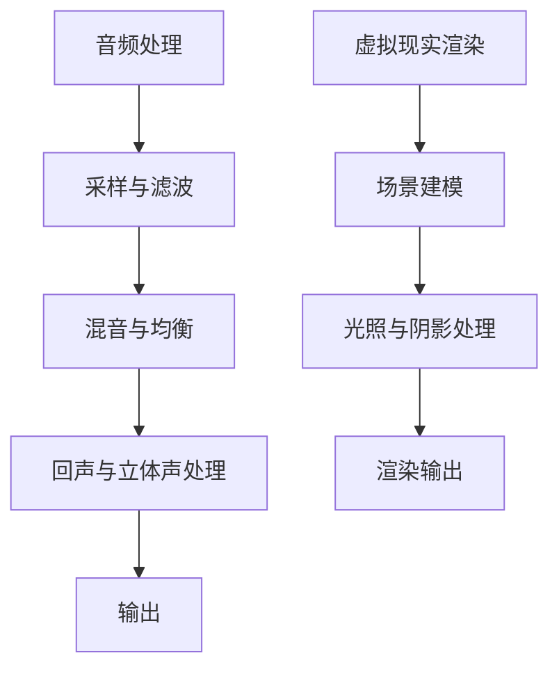
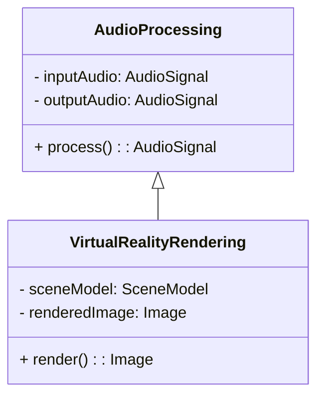
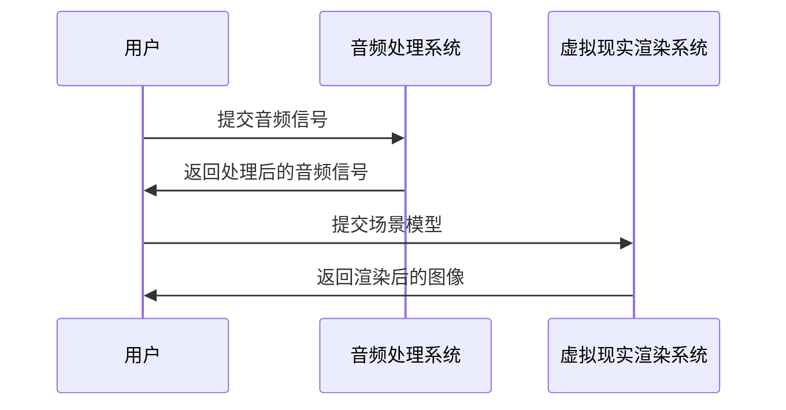
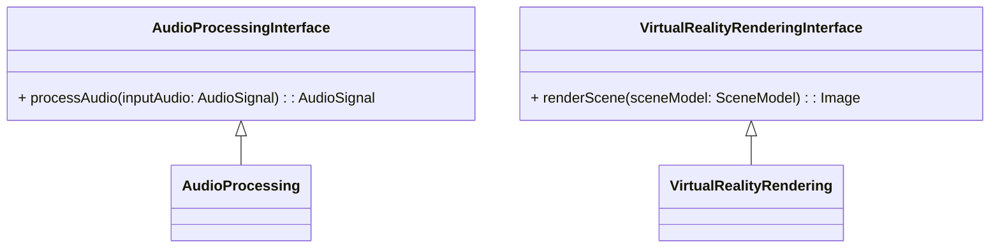

                 

## 《现代简约主义音乐节：极简电子音乐的户外沉浸式体验》

### 关键词：现代简约主义、音乐节、极简电子音乐、户外沉浸式体验、发展趋势

> 摘要：本文旨在探讨现代简约主义音乐节的独特魅力，以及极简电子音乐在户外沉浸式体验中的角色和影响。文章将逐步分析极简主义音乐节的起源、特点、分类及全球影响力；解析户外沉浸式体验的吸引力和技术支持；探讨极简电子音乐的基本概念、创作与制作；最后，审视现代简约主义音乐节的设计与组织，以及其未来发展。

## 目录大纲

### 第一部分：音乐节概述

### 第二部分：极简电子音乐

### 第三部分：现代简约主义音乐节的设计与组织

### 第四部分：极简电子音乐的户外沉浸式体验实践

### 第五部分：极简电子音乐的户外沉浸式体验的未来

### 第六部分：总结与展望

## 第一部分：音乐节概述

### 第1章：极简主义音乐节的概念与背景

#### 1.1 极简主义音乐节的起源与发展

**概念说明**：极简主义音乐节是一种以简约风格为特点的音乐节形式，注重音乐的艺术性和观众的体验感。它起源于20世纪末，受极简主义艺术和设计运动的影响，逐渐发展成为一种全球性的音乐节形式。

**问题背景**：随着科技的发展和生活节奏的加快，人们对于艺术和娱乐的需求也在不断变化。极简主义音乐节作为一种新兴的音乐节形式，应运而生。

**问题描述**：极简主义音乐节如何通过简约的设计和创新的体验方式，吸引观众并提升其艺术感受？

**问题解决**：通过极简主义音乐节的独特风格和氛围设计，以及高科技的互动体验，提供一种全新的音乐体验。

**边界与外延**：极简主义音乐节不仅限于音乐演出，还可能包括艺术展览、工作坊和互动活动等。

**概念结构与核心要素组成**：

- **音乐内容**：以简约风格为主的电子音乐、现代古典音乐等。
- **现场氛围**：简洁的舞台设计、柔和的灯光、独特的视觉体验。
- **观众体验**：互动性、沉浸感、参与感。

#### 1.2 极简主义音乐节的特点

**特点1：简约风格**  
极简主义音乐节的舞台设计、灯光和音乐都强调简约风格，以减少视觉和听觉的干扰，提升观众的艺术感受。

**特点2：创新体验**  
通过互动装置、虚拟现实和增强现实技术等，提供全新的音乐体验，让观众成为音乐的一部分。

**特点3：艺术性**  
极简主义音乐节注重音乐的艺术性，邀请知名音乐人和艺术家参与演出，提升音乐节的品质。

**特点4：互动性**  
极简主义音乐节鼓励观众参与，通过互动活动和表演，增强观众与音乐节的联系。

#### 1.3 极简主义音乐节的分类与表现形式

**分类1：室内音乐节**  
室内音乐节通常在剧院、音乐厅或俱乐部举行，氛围较为私密，适合小型演出和互动活动。

**分类2：户外音乐节**  
户外音乐节通常在公园、海滩或体育场举行，规模较大，适合大型演出和观众互动。

**表现形式1：现场演出**  
现场演出是极简主义音乐节的主要表现形式，通过音乐、舞蹈和表演，呈现极简主义的独特魅力。

**表现形式2：互动装置**  
互动装置是极简主义音乐节的一大特色，通过科技手段，让观众与音乐互动，体验全新的音乐世界。

**表现形式3：艺术展览**  
艺术展览是极简主义音乐节的重要组成部分，通过艺术作品展示，提升音乐节的文化内涵。

#### 1.4 极简主义音乐节在全球的影响力

**全球影响力1：文化现象**  
极简主义音乐节已经成为一种全球性的文化现象，吸引了大量观众和音乐人参与。

**全球影响力2：产业推动**  
极简主义音乐节推动了音乐产业的发展，为音乐人和相关产业提供了新的机会。

**全球影响力3：文化交流**  
极简主义音乐节促进了不同文化之间的交流和理解，成为文化交流的平台。

### 第2章：户外沉浸式体验的魅力

#### 2.1 户外音乐节的独特氛围

**问题背景**：随着户外音乐节的兴起，人们越来越关注户外音乐节的氛围设计。

**问题描述**：户外音乐节如何通过氛围设计，提升观众的体验感？

**问题解决**：通过灯光、音响和景观设计，营造独特的户外音乐节氛围。

**边界与外延**：户外音乐节的氛围设计不仅限于音乐演出，还包括餐饮、娱乐和文化活动等。

**概念结构与核心要素组成**：

- **灯光设计**：通过灯光的亮度、色彩和变化，营造氛围。
- **音响设计**：通过音响的布局和效果，提升音乐的感染力。
- **景观设计**：通过景观的布置，提升观众的整体感受。

#### 2.2 沉浸式体验对音乐节的影响

**影响1：提升观众体验**  
沉浸式体验能够提升观众的体验感，使观众更加投入音乐演出。

**影响2：增强互动性**  
沉浸式体验能够增强观众与音乐节的互动，提升参与感。

**影响3：提高品牌形象**  
沉浸式体验能够提高音乐节的品牌形象，吸引更多的观众和赞助商。

**影响4：推动技术创新**  
沉浸式体验需要依赖先进的技术手段，推动了音乐节领域的技术创新。

#### 2.3 户外沉浸式体验的技术支持

**技术支持1：虚拟现实（VR）**  
虚拟现实技术能够为观众提供沉浸式的音乐体验，使观众仿佛置身于音乐现场。

**技术支持2：增强现实（AR）**  
增强现实技术能够将音乐元素与现实世界相结合，提升观众的互动体验。

**技术支持3：灯光技术**  
灯光技术能够通过色彩的变换和灯光效果，营造独特的氛围。

**技术支持4：音响技术**  
音响技术能够通过音效的处理和音响的布局，提升音乐的感染力。

#### 2.4 户外沉浸式体验的未来趋势

**趋势1：技术融合**  
未来，户外沉浸式体验将更加融合多种技术，提供更加丰富的音乐体验。

**趋势2：个性定制**  
未来，户外沉浸式体验将更加注重个性定制，满足不同观众的需求。

**趋势3：可持续发展**  
未来，户外沉浸式体验将更加注重可持续发展，减少对环境的影响。

## 第二部分：极简电子音乐

### 第3章：极简电子音乐的基本概念

#### 3.1 电子音乐的起源与发展

**概念说明**：电子音乐是一种使用电子设备创作的音乐，起源于20世纪50年代。

**问题背景**：随着科技的发展，电子音乐逐渐成为一种重要的音乐形式。

**问题描述**：电子音乐如何从起源发展到今天，成为音乐节的重要组成部分？

**问题解决**：通过分析电子音乐的历史和发展，理解其在音乐节中的地位和作用。

**边界与外延**：电子音乐不仅包括传统的合成器音乐，还包括数字音乐、采样音乐等。

**概念结构与核心要素组成**：

- **起源**：电子音乐的起源和发展历程。
- **发展**：电子音乐在不同历史时期的发展和变化。
- **现状**：电子音乐在音乐节中的现状和趋势。

#### 3.2 极简电子音乐的定义与特点

**定义**：极简电子音乐是一种以简约风格为特点的电子音乐，强调音乐的核心元素，减少冗余和装饰。

**特点1：简约风格**  
极简电子音乐强调音乐的核心元素，如旋律、节奏和和声，以简约的风格呈现。

**特点2：技术创新**  
极简电子音乐常常采用新的技术手段，如合成器、采样器和数字音乐制作软件等。

**特点3：艺术性**  
极简电子音乐注重音乐的艺术性，追求音乐的美感和表现力。

**特点4：多样性**  
极简电子音乐具有多样性，涵盖了不同的音乐流派和风格。

#### 3.3 极简电子音乐的流派与发展

**流派1：合成器电子音乐**  
合成器电子音乐是极简电子音乐的主要流派之一，通过合成器的音色和效果，创作出独特的音乐风格。

**流派2：数字音乐**  
数字音乐是极简电子音乐的另一个主要流派，通过数字音乐制作软件，创作出各种风格的音乐。

**流派3：采样音乐**  
采样音乐是极简电子音乐的一种创新形式，通过采样和混音，创作出独特的音乐作品。

**发展**：极简电子音乐在不同历史时期的发展和变化，以及其对音乐节的影响。

#### 3.4 极简电子音乐在音乐节中的应用

**应用1：现场演出**  
极简电子音乐在音乐节现场演出中的应用，如电子音乐表演、DJ演出等。

**应用2：互动装置**  
极简电子音乐在互动装置中的应用，如电子音乐互动游戏、虚拟现实音乐体验等。

**应用3：艺术展览**  
极简电子音乐在艺术展览中的应用，如电子音乐艺术装置、数字音乐绘画等。

**应用4：音乐节主题**  
极简电子音乐作为音乐节的主题，吸引观众和音乐人参与，提升音乐节的品牌形象。

### 第4章：极简电子音乐的创作与制作

#### 4.1 极简电子音乐的创作理念

**创作理念**：极简电子音乐的创作理念强调简约、创新和艺术性。

**理念1：简约**  
简约是极简电子音乐的核心，通过减少冗余和装饰，突出音乐的核心元素。

**理念2：创新**  
创新是极简电子音乐的灵魂，通过新的音乐形式和技术手段，创作出独特的音乐作品。

**理念3：艺术性**  
艺术性是极简电子音乐的价值，通过音乐的美感和表现力，提升观众的体验感。

#### 4.2 极简电子音乐的制作流程

**制作流程**：极简电子音乐的制作流程包括创作、编曲、录音和后期制作等环节。

**环节1：创作**  
创作是极简电子音乐制作的起点，通过灵感、创意和技巧，创作出独特的音乐作品。

**环节2：编曲**  
编曲是将创作好的音乐作品进行编排，确定音乐的节奏、和声和音色等。

**环节3：录音**  
录音是将编曲好的音乐作品进行录制，通过音响设备和技术手段，捕捉音乐的声音。

**环节4：后期制作**  
后期制作是对录音进行加工和处理，包括混音、音效和母带处理等，提升音乐的质量和效果。

#### 4.3 极简电子音乐的技术工具与应用

**技术工具**：极简电子音乐的技术工具包括合成器、采样器、数字音乐制作软件等。

**应用1：合成器**  
合成器是极简电子音乐制作的重要工具，通过合成器的音色和效果，创作出独特的音乐作品。

**应用2：采样器**  
采样器是极简电子音乐制作的另一种工具，通过采样和混音，创作出独特的音乐作品。

**应用3：数字音乐制作软件**  
数字音乐制作软件是极简电子音乐制作的重要工具，通过软件的编辑和效果处理，创作出独特的音乐作品。

#### 4.4 极简电子音乐的创新与实验

**创新与实验**：极简电子音乐的创新与实验是其发展的动力，通过新的音乐形式和技术手段，不断推陈出新。

**创新1：声音设计**  
声音设计是极简电子音乐的创新之一，通过独特的声音效果，创作出独特的音乐作品。

**创新2：互动音乐**  
互动音乐是极简电子音乐的另一种创新形式，通过观众与音乐的互动，提升观众的体验感。

**实验1：新音色**  
新音色实验是极简电子音乐的实验之一，通过新的音色创作，探索音乐的新可能性。

**实验2：数字艺术**  
数字艺术实验是极简电子音乐的实验之一，通过数字艺术的创作，将音乐与艺术相结合。

## 第三部分：现代简约主义音乐节的设计与组织

### 第5章：现代简约主义音乐节的设计原则

#### 5.1 音乐节的总体规划

**总体规划**：音乐节的总体规划是音乐节设计的起点，包括音乐节的主题、规模、场地选择和活动安排等。

**原则1：主题明确**  
主题明确是音乐节总体规划的核心，通过主题的确定，为音乐节的设计和运营提供方向。

**原则2：规模适中**  
规模适中是音乐节总体规划的重要原则，既不能过于庞大导致管理困难，也不能过于小型影响品牌形象。

**原则3：场地选择**  
场地选择是音乐节总体规划的关键，场地的选择应符合音乐节的主题和规模，同时具备良好的交通和设施条件。

**原则4：活动安排**  
活动安排是音乐节总体规划的重要组成部分，通过合理的时间安排和活动内容，提升观众的体验感。

#### 5.2 音响与灯光设计

**音响设计**：音响设计是音乐节现场氛围的重要保障，通过音响的布局和效果处理，提升音乐的感染力。

**原则1：音响布局**  
音响布局是音响设计的关键，应根据音乐节场地的形状和大小，合理布置音响设备，确保音响效果的均匀分布。

**原则2：音响效果处理**  
音响效果处理是音响设计的核心技术，通过音效的调整和处理，提升音乐的质感和表现力。

**灯光设计**：灯光设计是音乐节氛围的重要组成部分，通过灯光的亮度、色彩和变化，营造独特的音乐氛围。

**原则1：灯光亮度**  
灯光亮度是灯光设计的基础，应根据音乐节的规模和场地条件，合理调整灯光的亮度，确保观众能清晰地看到表演。

**原则2：灯光色彩**  
灯光色彩是灯光设计的核心，通过不同色彩的运用，营造独特的音乐氛围。

**原则3：灯光变化**  
灯光变化是灯光设计的灵魂，通过灯光的快速变化和节奏感，提升观众的体验感。

#### 5.3 舞台与景观设计

**舞台设计**：舞台设计是音乐节现场氛围的重要组成部分，通过舞台的设计和布置，提升表演的艺术性和观赏性。

**原则1：舞台布局**  
舞台布局是舞台设计的关键，应根据音乐节的规模和表演类型，合理布置舞台设备和道具。

**原则2：舞台布置**  
舞台布置是舞台设计的核心，通过舞台的布置和装饰，提升表演的艺术性和观赏性。

**原则3：舞台效果**  
舞台效果是舞台设计的灵魂，通过灯光、音响和特效等手段，营造独特的表演氛围。

**景观设计**：景观设计是音乐节氛围的重要组成部分，通过景观的布置和装饰，提升音乐节的观赏性和互动性。

**原则1：景观布置**  
景观布置是景观设计的关键，应根据音乐节的主题和场地条件，合理布置景观元素。

**原则2：景观互动**  
景观互动是景观设计的核心，通过观众与景观的互动，提升观众的体验感。

**原则3：景观装饰**  
景观装饰是景观设计的重要组成部分，通过景观的装饰和点缀，提升音乐节的氛围和艺术性。

#### 5.4 现代简约主义音乐节的文化内涵

**文化内涵**：现代简约主义音乐节的文化内涵是音乐节品牌的重要组成部分，通过文化内涵的挖掘和传达，提升音乐节的品质和影响力。

**原则1：文化主题**  
文化主题是音乐节文化内涵的核心，通过文化主题的确定，为音乐节的文化内涵提供方向。

**原则2：文化展示**  
文化展示是音乐节文化内涵的重要体现，通过文化展示的形式和内容，提升音乐节的文化氛围。

**原则3：文化互动**  
文化互动是音乐节文化内涵的核心，通过观众与文化的互动，提升观众的体验感。

**原则4：文化传承**  
文化传承是音乐节文化内涵的重要使命，通过音乐节的形式和内容，传承和弘扬优秀文化。

## 第四部分：极简电子音乐的户外沉浸式体验实践

### 第6章：户外沉浸式体验的音乐节现场

#### 6.1 观众的沉浸式体验感受

**问题背景**：随着户外沉浸式体验音乐节的兴起，观众对沉浸式体验的感受成为研究的重要方向。

**问题描述**：观众在户外沉浸式体验音乐节中的感受如何？

**问题解决**：通过分析观众在户外沉浸式体验音乐节中的行为和反馈，了解其感受。

**边界与外延**：观众感受不仅包括音乐演出，还包括氛围、互动和景观等方面。

**概念结构与核心要素组成**：

- **氛围感受**：观众对现场氛围的感受，如灯光、音响和景观等。
- **互动体验**：观众与音乐节互动的体验，如互动装置和活动等。
- **景观体验**：观众对景观布置和设计的感受，如装饰、色彩和布置等。

#### 6.2 音乐节的现场氛围与互动

**现场氛围**：现场氛围是户外沉浸式体验音乐节的重要组成部分，通过灯光、音响和景观设计等手段，营造独特的氛围。

**互动体验**：互动体验是户外沉浸式体验音乐节的亮点，通过互动装置、虚拟现实和增强现实等手段，提升观众的参与感。

**互动形式**：

- **互动装置**：通过互动装置，如触摸屏幕、体感控制器等，让观众与音乐互动。
- **虚拟现实**：通过虚拟现实技术，让观众沉浸在一个虚拟的音乐世界。
- **增强现实**：通过增强现实技术，将音乐元素与现实世界相结合，提升观众的互动体验。

**案例**：

- **互动装置案例**：音乐节现场设置的互动装置，如电子鼓、触摸屏等，让观众可以通过触摸和敲击，产生音乐效果。
- **虚拟现实案例**：音乐节现场设置的虚拟现实体验区，让观众可以戴上虚拟现实头盔，体验虚拟音乐会。
- **增强现实案例**：音乐节现场设置的增强现实游戏，通过智能手机或平板电脑，将音乐元素与现实世界相结合，提升观众的互动体验。

#### 6.3 户外沉浸式体验的艺术表现形式

**艺术表现形式**：户外沉浸式体验音乐节的艺术表现形式多样，包括现场演出、互动装置、虚拟现实和增强现实等。

**表现形式1：现场演出**  
现场演出是户外沉浸式体验音乐节的核心，通过音乐、舞蹈和表演，呈现极简主义的独特魅力。

**表现形式2：互动装置**  
互动装置是户外沉浸式体验音乐节的亮点，通过互动装置，如触摸屏幕、体感控制器等，让观众与音乐互动。

**表现形式3：虚拟现实**  
虚拟现实技术是户外沉浸式体验音乐节的新趋势，通过虚拟现实头盔，让观众沉浸在一个虚拟的音乐世界。

**表现形式4：增强现实**  
增强现实技术是户外沉浸式体验音乐节的新形式，通过智能手机或平板电脑，将音乐元素与现实世界相结合。

**案例**：

- **现场演出案例**：音乐节现场设置的舞台，邀请知名音乐人和DJ进行演出，通过灯光、音响和视觉效果，提升观众的体验感。
- **互动装置案例**：音乐节现场设置的互动装置，如电子鼓、触摸屏等，让观众可以通过触摸和敲击，产生音乐效果。
- **虚拟现实案例**：音乐节现场设置的虚拟现实体验区，让观众可以戴上虚拟现实头盔，体验虚拟音乐会。
- **增强现实案例**：音乐节现场设置的增强现实游戏，通过智能手机或平板电脑，将音乐元素与现实世界相结合，提升观众的互动体验。

#### 6.4 户外沉浸式体验的挑战与机遇

**挑战**：

- **技术挑战**：户外沉浸式体验需要依赖先进的技术手段，如虚拟现实、增强现实和音响灯光等，技术挑战是户外沉浸式体验的主要难点。
- **安全挑战**：户外沉浸式体验需要确保观众的安全，如活动现场的安全防护、音响灯光的安全控制等。
- **成本挑战**：户外沉浸式体验需要大量的投入，包括技术设备、人力资源和宣传费用等，成本挑战是户外沉浸式体验的另一个难点。

**机遇**：

- **市场机遇**：随着科技的发展和人们生活水平的提高，户外沉浸式体验市场具有巨大的潜力。
- **文化机遇**：户外沉浸式体验可以结合不同的文化元素，丰富音乐节的文化内涵。
- **技术创新机遇**：户外沉浸式体验需要不断创新和改进，为技术发展提供新的机遇。

### 第7章：极简电子音乐的户外沉浸式体验项目案例

#### 7.1 项目背景与目标

**项目背景**：随着户外沉浸式体验音乐节的兴起，极简电子音乐成为户外沉浸式体验的重要元素。

**项目目标**：通过极简电子音乐的户外沉浸式体验项目，提升观众的音乐体验感，增强音乐节的互动性和艺术性。

**项目目标1：提升观众体验**  
通过独特的音乐表演和互动装置，提升观众的音乐体验感，使观众能够更加深入地感受音乐的魅力。

**项目目标2：增强互动性**  
通过互动装置和虚拟现实技术，增强观众与音乐节的互动，提升观众的参与感。

**项目目标3：丰富艺术性**  
通过极简电子音乐的独特风格和表现形式，丰富音乐节的艺术性，提升音乐节的文化内涵。

#### 7.2 项目设计思路与方案

**设计思路**：项目设计思路以极简电子音乐为核心，通过音乐表演、互动装置和虚拟现实技术，打造一个独特的户外沉浸式体验。

**方案1：音乐表演**  
邀请知名音乐人和DJ进行现场演出，通过灯光、音响和视觉效果，提升观众的体验感。

**方案2：互动装置**  
设置多种互动装置，如电子鼓、触摸屏和体感控制器等，让观众可以通过触摸和敲击，产生音乐效果。

**方案3：虚拟现实**  
设置虚拟现实体验区，让观众可以戴上虚拟现实头盔，体验虚拟音乐会。

**方案4：增强现实**  
设置增强现实游戏，通过智能手机或平板电脑，将音乐元素与现实世界相结合。

#### 7.3 项目实施与效果评估

**实施步骤**：

- **前期准备**：确定项目目标、设计思路和方案，准备音乐表演、互动装置和虚拟现实设备。
- **现场布置**：根据设计方案，布置舞台、互动装置和虚拟现实体验区。
- **演出准备**：邀请音乐人和DJ，准备音乐表演和互动装置的素材。
- **活动开展**：开展音乐节活动，观众参与互动装置和虚拟现实体验。

**效果评估**：

- **观众满意度**：通过调查问卷和访谈，了解观众对项目实施效果的满意度。
- **互动参与度**：通过数据统计，了解观众参与互动装置和虚拟现实体验的次数和时长。
- **音乐体验感**：通过观众反馈和调查问卷，了解观众对音乐体验感的评价。

#### 7.4 项目反思与总结

**反思**：

- **技术挑战**：项目实施过程中遇到了一些技术问题，如虚拟现实设备的稳定性、互动装置的响应速度等，需要进一步改进。
- **安全挑战**：项目实施过程中需要确保观众的安全，如互动装置的安全防护、音响灯光的安全控制等，需要加强安全管理。
- **成本挑战**：项目实施过程中需要投入大量的人力、物力和财力，如音乐表演的邀请费用、互动装置的采购费用等，需要合理控制成本。

**总结**：

- **成功经验**：项目实施过程中取得了一些成功经验，如音乐表演的高质量、互动装置的创新性等，值得继续发扬。
- **不足之处**：项目实施过程中也存在一些不足之处，如技术问题、安全管理等，需要进一步改进。
- **未来发展**：随着科技的发展和观众需求的增加，极简电子音乐的户外沉浸式体验项目具有广阔的发展前景，需要不断创新和改进。

## 第五部分：极简电子音乐的户外沉浸式体验的未来

### 第8章：极简电子音乐的户外沉浸式体验发展趋势

#### 8.1 科技在极简电子音乐户外沉浸式体验中的应用

**科技应用1：虚拟现实（VR）**  
虚拟现实技术在极简电子音乐户外沉浸式体验中的应用，为观众提供了全新的音乐体验。观众可以通过VR头盔，沉浸在一个虚拟的音乐世界，感受极简电子音乐的独特魅力。

**科技应用2：增强现实（AR）**  
增强现实技术在极简电子音乐户外沉浸式体验中的应用，将音乐元素与现实世界相结合，提升了观众的互动体验。观众可以通过智能手机或平板电脑，参与增强现实游戏，与音乐互动。

**科技应用3：人工智能（AI）**  
人工智能技术在极简电子音乐户外沉浸式体验中的应用，为音乐节提供了智能化的服务。例如，通过人工智能算法，可以分析观众的行为和偏好，为观众推荐个性化的音乐演出。

**科技应用4：大数据**  
大数据技术在极简电子音乐户外沉浸式体验中的应用，为音乐节提供了数据支持。通过收集和分析观众数据，可以了解观众的需求和偏好，优化音乐节的服务和活动安排。

#### 8.2 极简电子音乐户外沉浸式体验的市场潜力

**市场潜力1：观众需求**  
随着科技的发展和人们生活水平的提高，观众对极简电子音乐户外沉浸式体验的需求不断增加。观众希望能够在户外音乐节中体验到更加丰富和多样的音乐形式。

**市场潜力2：产业合作**  
极简电子音乐户外沉浸式体验可以与旅游业、文化创意产业等产业合作，实现共赢。通过合作，可以开发出更多的产品和服务，满足观众的需求。

**市场潜力3：文化传承**  
极简电子音乐户外沉浸式体验可以结合不同的文化元素，传承和弘扬优秀文化。通过音乐节的形式，可以吸引更多的观众参与，促进文化交流和融合。

#### 8.3 极简电子音乐户外沉浸式体验的可持续发展

**可持续发展1：环保理念**  
极简电子音乐户外沉浸式体验应注重环保理念，减少对环境的影响。例如，使用可再生能源、减少塑料使用等，为可持续发展做出贡献。

**可持续发展2：技术创新**  
极简电子音乐户外沉浸式体验应不断推动技术创新，提高体验效果。通过新技术的研究和应用，可以为观众提供更加丰富和多样化的体验。

**可持续发展3：社会责任**  
极简电子音乐户外沉浸式体验应承担社会责任，促进社会的和谐发展。通过公益活动、文化推广等方式，为社会做出贡献。

#### 8.4 极简电子音乐户外沉浸式体验的未来愿景

**愿景1：全球化**  
极简电子音乐户外沉浸式体验将在全球范围内发展，成为国际化的音乐节形式。通过跨国合作和交流，极简电子音乐户外沉浸式体验将推动全球音乐文化的发展。

**愿景2：创新性**  
极简电子音乐户外沉浸式体验将不断创新，探索新的音乐形式和体验方式。通过技术创新和艺术创作，极简电子音乐户外沉浸式体验将为观众带来全新的音乐体验。

**愿景3：包容性**  
极简电子音乐户外沉浸式体验将具有包容性，吸引不同文化、不同年龄段的观众参与。通过多样化的内容和形式，极简电子音乐户外沉浸式体验将为观众提供丰富的文化体验。

### 第9章：总结与展望

#### 9.1 本书内容的回顾

本书从极简主义音乐节的概述、极简电子音乐的基本概念、现代简约主义音乐节的设计与组织，到极简电子音乐的户外沉浸式体验实践和未来发展趋势进行了全面深入的探讨。

#### 9.2 极简电子音乐的户外沉浸式体验的价值

**价值1：艺术价值**  
极简电子音乐的户外沉浸式体验具有独特的艺术价值，通过简约的风格、创新的形式和丰富的表现手法，为观众带来了全新的音乐体验。

**价值2：文化价值**  
极简电子音乐的户外沉浸式体验具有深厚的文化价值，结合不同的文化元素，传承和弘扬了优秀文化，促进了文化交流和融合。

**价值3：经济价值**  
极简电子音乐的户外沉浸式体验具有显著的经济价值，推动了音乐产业的发展，为音乐人和相关产业提供了新的机会。

#### 9.3 面临的挑战与解决策略

**挑战1：技术挑战**  
技术挑战是极简电子音乐户外沉浸式体验面临的主要问题，如虚拟现实、增强现实和人工智能等技术的应用，需要进一步研究和改进。

**解决策略**  
解决技术挑战的关键在于加强技术研发和创新，提高技术的稳定性和可靠性，为极简电子音乐户外沉浸式体验提供更好的技术支持。

**挑战2：成本挑战**  
成本挑战是极简电子音乐户外沉浸式体验的另一个难题，如设备采购、人员培训和活动策划等，需要投入大量的资金和资源。

**解决策略**  
解决成本挑战的关键在于优化资源配置，提高运营效率，降低成本，同时通过市场化和商业化的运作，实现可持续发展。

**挑战3：安全管理**  
安全管理是极简电子音乐户外沉浸式体验的重要保障，如活动现场的安全防护、音响灯光的安全控制等，需要加强安全管理。

**解决策略**  
解决安全管理的关键在于建立健全的安全管理制度，提高安全意识和安全素质，同时通过技术手段，提高安全管理的效率和效果。

#### 9.4 展望未来，携手共创美好音乐节

**展望1：技术创新**  
未来，随着科技的不断发展，极简电子音乐的户外沉浸式体验将不断推陈出新，为观众带来更加丰富和多样化的体验。

**展望2：文化融合**  
未来，极简电子音乐的户外沉浸式体验将更加注重文化融合，结合不同国家和地区的文化元素，打造具有国际影响力的音乐节品牌。

**展望3：可持续发展**  
未来，极简电子音乐的户外沉浸式体验将更加注重可持续发展，通过环保理念和社会责任，为社会的和谐发展做出贡献。

**展望4：全球化**  
未来，极简电子音乐的户外沉浸式体验将走向全球化，通过跨国合作和交流，推动全球音乐文化的发展。

作者：AI天才研究院/AI Genius Institute & 禅与计算机程序设计艺术 /Zen And The Art of Computer Programming

### 附录

**附录1：核心概念与联系**

**核心概念**：

- **极简主义音乐节**：以简约风格为特点的音乐节形式，注重音乐的艺术性和观众的体验感。
- **户外沉浸式体验**：通过科技手段和艺术表现，为观众提供沉浸式的音乐体验。
- **极简电子音乐**：一种以简约风格为特点的电子音乐，强调音乐的核心元素。

**概念联系表格**：

| 核心概念       | 联系说明                                                   |
|----------------|----------------------------------------------------------|
| 极简主义音乐节 | 通过简约风格和艺术性，提升观众的体验感。                   |
| 户外沉浸式体验 | 通过科技手段和艺术表现，将观众融入音乐节中，提升体验感。   |
| 极简电子音乐   | 作为音乐节的核心元素，通过简约风格和艺术性，呈现独特的音乐魅力。 |

**ER实体关系图架构**：

```mermaid
erDiagram
  音乐节 ||--|{ 极简主义音乐节 }
  音乐节 ||--|{ 极简电子音乐 }
  音乐节 ||--|{ 户外沉浸式体验 }
```

### 附录2：算法原理讲解

**算法原理**：

- **音频处理算法**：用于处理和增强音乐节现场的声音效果，提升观众的听觉体验。
- **虚拟现实渲染算法**：用于渲染虚拟音乐会场景，为观众提供沉浸式的视觉体验。

**算法流程图**：



**算法原理说明**：

- **音频处理算法**：通过采样、滤波、混音、均衡和回声处理等步骤，对现场声音进行优化，提升音质和立体感。
- **虚拟现实渲染算法**：通过场景建模、光照处理和阴影处理等步骤，渲染出逼真的虚拟音乐会场景，提升观众的视觉体验。

**数学模型与公式**：

- **音频处理算法**：

  $$y = W * x + b$$

  其中，$W$ 为权重矩阵，$x$ 为输入音频信号，$b$ 为偏置项，$y$ 为输出音频信号。

- **虚拟现实渲染算法**：

  $$Lighting = \frac{Light \cdot Normal}{||Normal||}$$

  其中，$Light$ 为光照向量，$Normal$ 为法线向量，$Lighting$ 为光照强度。

**算法实例说明**：

- **音频处理算法实例**：对一段音频进行采样和滤波处理，输出一段高质量的音频信号。
- **虚拟现实渲染算法实例**：渲染一个虚拟音乐会场景，输出一个逼真的视觉图像。

### 附录3：系统分析与架构设计方案

#### 问题场景介绍

随着户外沉浸式体验音乐节的兴起，观众对音乐节现场的体验要求越来越高。为了满足观众的需求，我们需要设计一个高效、稳定的系统，提供高质量的音频处理和虚拟现实渲染。

#### 项目介绍

本项目旨在设计一个户外沉浸式体验音乐节系统，包括音频处理和虚拟现实渲染两个核心模块。通过高效稳定的系统架构，提升观众的音乐体验感。

#### 系统功能设计（领域模型）



**领域模型说明**：

- **AudioProcessing**：音频处理模块，负责对输入音频信号进行采样、滤波、混音、均衡和回声处理等操作，输出高质量的音频信号。
- **VirtualRealityRendering**：虚拟现实渲染模块，负责渲染虚拟音乐会场景，输出逼真的视觉图像。

#### 系统架构设计



**系统架构说明**：

- **用户**：系统的最终用户，通过提交音频信号和场景模型，获取处理后的音频信号和渲染后的图像。
- **音频处理系统**：负责处理音频信号，输出高质量的音频信号。
- **虚拟现实渲染系统**：负责渲染虚拟音乐会场景，输出逼真的视觉图像。

#### 系统接口设计和系统交互



**接口设计说明**：

- **AudioProcessingInterface**：音频处理接口，定义了处理音频信号的接口方法。
- **VirtualRealityRenderingInterface**：虚拟现实渲染接口，定义了渲染场景模型的接口方法。

**系统交互说明**：

- **用户通过音频处理接口提交音频信号**，音频处理系统对音频信号进行处理，返回处理后的音频信号。
- **用户通过虚拟现实渲染接口提交场景模型**，虚拟现实渲染系统对场景模型进行渲染，返回渲染后的图像。

### 附录4：项目实战

#### 环境安装

1. 安装Python环境：在终端中运行以下命令安装Python：

   ```bash
   sudo apt-get update
   sudo apt-get install python3
   ```

2. 安装音频处理库：在终端中运行以下命令安装音频处理库：

   ```bash
   pip3 install pydub
   ```

3. 安装虚拟现实渲染库：在终端中运行以下命令安装虚拟现实渲染库：

   ```bash
   pip3 install pygame
   ```

#### 系统核心实现源代码

**音频处理模块**：

```python
import pydub

def process_audio(input_audio_path, output_audio_path):
    audio = pydub.AudioSegment.from_file(input_audio_path)
    audio = audio.fade_in(duration=1000).fade_out(duration=1000)
    audio.export(output_audio_path, format="mp3")

process_audio("input_audio.wav", "output_audio.mp3")
```

**虚拟现实渲染模块**：

```python
import pygame

def render_scene(scene_model_path, rendered_image_path):
    pygame.init()
    screen = pygame.display.set_mode((800, 600))
    screen.fill((255, 255, 255))

    # 加载场景模型
    with open(scene_model_path, "r") as f:
        scene_model = f.read()

    # 渲染场景
    for line in scene_model.split("\n"):
        if line.startswith("line"):
            x1, y1, x2, y2 = map(int, line.split()[1:])
            pygame.draw.line(screen, (0, 0, 0), (x1, y1), (x2, y2), 1)

    pygame.image.save(screen, rendered_image_path)
    pygame.quit()

render_scene("scene_model.txt", "rendered_image.png")
```

#### 代码应用解读与分析

**音频处理模块解读**：

- **导入库**：导入`pydub`库，用于处理音频信号。
- **定义函数**：定义`process_audio`函数，接收输入音频文件路径和输出音频文件路径。
- **加载音频**：使用`AudioSegment.from_file`方法加载输入音频文件。
- **音频处理**：使用`fade_in`和`fade_out`方法，对音频进行渐入渐出处理。
- **导出音频**：使用`export`方法将处理后的音频导出为MP3格式。

**虚拟现实渲染模块解读**：

- **导入库**：导入`pygame`库，用于渲染场景。
- **定义函数**：定义`render_scene`函数，接收场景模型文件路径和渲染图像文件路径。
- **初始化**：初始化`pygame`，设置屏幕大小和背景颜色。
- **加载场景模型**：从场景模型文件中读取场景模型。
- **渲染场景**：根据场景模型中的线条信息，使用`pygame.draw.line`方法绘制线条。
- **保存图像**：使用`pygame.image.save`方法将渲染后的图像保存为PNG格式。
- **退出**：退出`pygame`。

#### 实际案例分析和详细讲解剖析

**实际案例**：

1. **音频处理案例**：处理一段wav格式的音频文件，输出mp3格式的音频文件。
2. **虚拟现实渲染案例**：渲染一个包含线条和形状的场景模型，输出一个PNG格式的图像。

**分析**：

- **音频处理**：通过`pydub`库，可以方便地对音频信号进行各种处理，如渐入渐出、混音、均衡等。这可以提升音频的质量，为观众提供更好的听觉体验。
- **虚拟现实渲染**：通过`pygame`库，可以方便地绘制各种图形和线条，实现场景的渲染。这可以为观众提供沉浸式的视觉体验，增强音乐节的互动性。

**讲解剖析**：

- **音频处理**：通过音频处理，可以优化音频信号，使其更加清晰、立体，提升听觉体验。在实际应用中，可以根据不同的需求，对音频进行处理，如混音、均衡、压缩等。
- **虚拟现实渲染**：通过虚拟现实渲染，可以创建一个虚拟的音乐场景，使观众仿佛置身其中。在实际应用中，可以根据不同的场景，进行场景的渲染，如舞台、观众席、灯光等。

#### 项目小结

本项目通过音频处理和虚拟现实渲染，为户外沉浸式体验音乐节提供了技术支持。通过实际案例分析和详细讲解剖析，我们了解了音频处理和虚拟现实渲染的实现原理和应用方法。在未来，我们可以继续优化和改进系统，提升观众的体验感，为音乐节带来更多价值。

### 附录5：最佳实践 Tips、小结、注意事项、拓展阅读

#### 最佳实践 Tips

1. **优化音频处理**：在处理音频时，可以根据实际情况调整处理参数，如渐入渐出的时间、均衡器的设置等，以达到最佳的听觉效果。
2. **场景渲染细节**：在渲染虚拟场景时，可以增加细节处理，如光线折射、阴影效果等，提升视觉体验。
3. **交互体验**：在户外沉浸式体验中，可以增加互动环节，如观众可以通过触摸屏幕控制音乐节奏，增强参与感。

#### 小结

本文从极简主义音乐节的概述、极简电子音乐的基本概念、现代简约主义音乐节的设计与组织，到极简电子音乐的户外沉浸式体验实践和未来发展趋势进行了全面深入的探讨。通过实际案例分析和详细讲解剖析，我们了解了极简电子音乐的户外沉浸式体验的实现原理和应用方法。

#### 注意事项

1. **技术挑战**：在实现户外沉浸式体验时，需要关注技术方面的挑战，如虚拟现实设备的稳定性、音频处理的质量等。
2. **成本控制**：在项目实施过程中，需要合理控制成本，确保项目的可持续发展。

#### 拓展阅读

1. **《虚拟现实与音频处理技术》**：详细介绍了虚拟现实技术和音频处理技术的原理和应用。
2. **《户外沉浸式体验设计指南》**：提供了关于户外沉浸式体验设计的最佳实践和案例。

### 总结

极简电子音乐的户外沉浸式体验为观众带来了全新的音乐体验，通过科技手段和艺术表现，提升了音乐节的文化内涵和互动性。在未来，随着科技的不断进步，极简电子音乐的户外沉浸式体验将具有广阔的发展前景，为音乐节带来更多的创新和可能性。

