                 

### 1.1 现代简约主义饮食的概念

现代简约主义饮食（Modern Minimalist Diet）是一种以极简主义哲学为基础的饮食模式，它强调通过选择自然、简单和营养丰富的食材，进行简单、快捷的烹饪，以实现健康、美味和方便的生活方式。其核心理念包括：

1. **自然食材**：现代简约主义饮食强调选择天然、无添加剂的食材，以减少对环境的污染和对身体的负担。这些食材通常包括新鲜的水果、蔬菜、谷物、豆类、肉类和鱼类。

2. **极简烹饪**：极简烹饪强调通过简单的烹饪方法，如蒸、煮、烤、炒等，保留食材的原味和营养成分。避免复杂的加工和烹饪过程，减少对食材的改变。

3. **营养平衡**：虽然极简主义饮食追求简单，但并不意味着忽视营养。相反，它强调通过合理的食材搭配和烹饪技巧，确保饮食中的营养平衡。

4. **高效便捷**：现代简约主义饮食旨在提高生活效率，通过提前准备食材和简化烹饪过程，减少时间成本。

#### 对比表格

为了更清晰地展示现代简约主义饮食与传统饮食的区别，我们可以创建一个对比表格：

| 对比项 | 现代简约主义饮食 | 传统饮食 |
| --- | --- | --- |
| 食材选择 | 天然、无添加剂 | 可能包含添加剂 |
| 烹饪方法 | 简单、快速、保留营养 | 复杂、耗时、可能破坏营养 |
| 营养平衡 | 强调平衡、合理搭配 | 可能存在营养不均衡 |
| 生活效率 | 高效、便捷 | 低效、繁琐 |

### ER实体关系图

现代简约主义饮食的实体关系可以简化为以下几个关键实体：

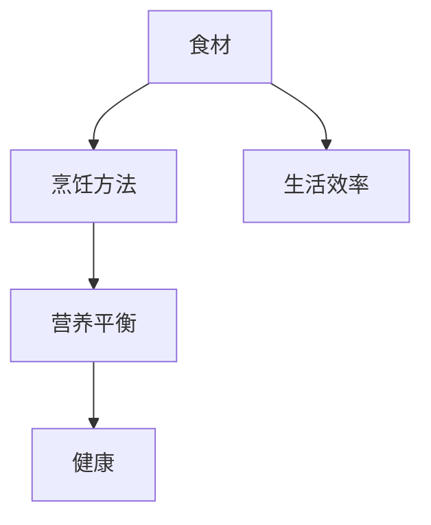

在这个ER图中，食材、烹饪方法、营养平衡和生活效率共同作用，最终影响健康。每个实体之间的关系都需要在文章中进行详细阐述。

### 小结

现代简约主义饮食是一种以极简主义哲学为基础的饮食模式，它强调通过选择自然食材、极简烹饪方法、营养平衡和高效便捷的生活方式，来实现健康和幸福。在接下来的章节中，我们将进一步探讨极简烹饪的基本原则、具体食材介绍、烹饪技巧和营养哲学，以及如何将极简主义饮食融入到现代生活方式中。通过逐步分析推理，我们将深入理解这一饮食模式的核心价值和实际应用。

## 第2章 极简烹饪的基本原则

### 2.1 选择自然食材

极简烹饪的第一步是选择自然食材。自然食材指的是未经过度加工的，保留了其原始状态和营养成分的食材。这些食材不仅对环境友好，而且对人体健康更加有益。以下是选择自然食材的几个关键点：

1. **新鲜度**：新鲜食材不仅味道更好，而且营养价值更高。尽量选择当季、当地的新鲜食材，以确保其新鲜度和营养成分。

2. **有机认证**：有机认证的食材通常不含农药、化肥和转基因成分，对人体更健康。虽然有机食材可能价格较高，但从长远来看，其对健康和环境的影响值得投资。

3. **无添加剂**：避免含有食品添加剂的食材，如防腐剂、人工色素和人工香料。这些添加剂可能会影响人体的新陈代谢和健康。

#### 对比表格

为了更清晰地展示选择自然食材与传统食材的区别，我们可以创建一个对比表格：

| 对比项 | 自然食材 | 传统食材 |
| --- | --- | --- |
| 新鲜度 | 高 | 低 |
| 有机认证 | 有机食材优先 | 可能含有添加剂 |
| 无添加剂 | 无添加剂 | 可能含添加剂 |
| 营养价值 | 高 | 低 |
| 环境影响 | 负面影响小 | 负面影响大 |

### ER实体关系图

选择自然食材的实体关系可以简化为以下几个关键实体：

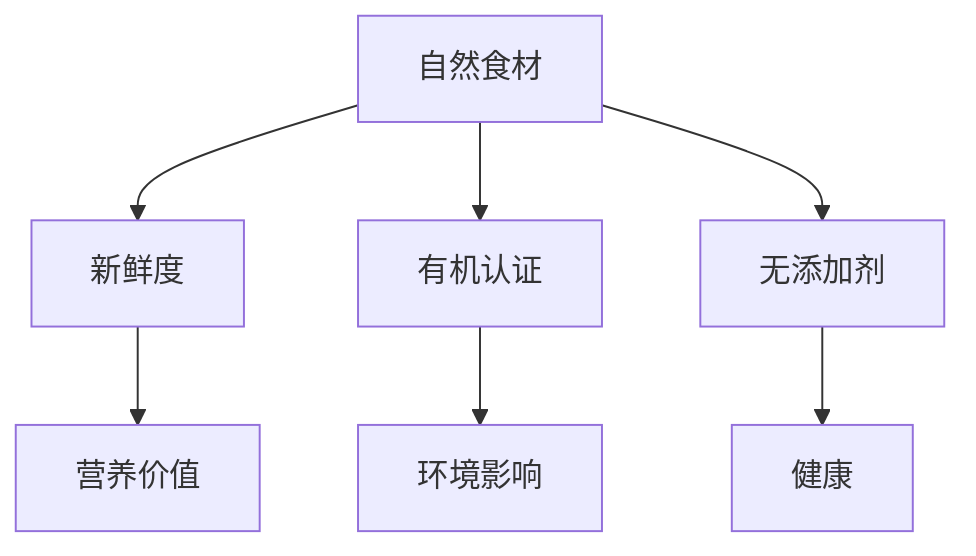

在这个ER图中，自然食材与新鲜度、有机认证、无添加剂、营养价值、环境影响和健康密切相关。每一个实体之间的关系都需要在文章中进行详细阐述。

### 小结

选择自然食材是极简烹饪的核心原则之一。通过选择新鲜、有机和无添加剂的食材，我们可以确保饮食的健康和环境的可持续性。在接下来的章节中，我们将继续探讨极简烹饪的另外两个关键原则：减少加工过程和简化烹饪步骤，以及如何通过科学的营养搭配，实现极简饮食中的营养平衡。

## 2.2 减少加工过程

极简烹饪的第二个基本原则是减少加工过程。加工过程不仅会增加食品的成本，还可能破坏其营养成分。以下是减少加工过程的几个关键点：

1. **少使用加工食品**：加工食品通常含有大量的添加剂和防腐剂，这些成分可能会对健康产生负面影响。尽量减少加工食品的摄入，转而选择新鲜、自然的食材。

2. **简单处理食材**：在处理食材时，应尽量减少复杂的过程。例如，蔬菜可以简单地洗净、切割，而不必经过烫煮或腌制。肉类和鱼类也可以直接烹饪，而不必经过长时间的腌制或烟熏。

3. **避免高温处理**：高温处理可能会破坏食材中的营养成分。例如，过度煎炸或烤制可能会破坏食物中的维生素和抗氧化剂。相反，可以选择低温烹饪方法，如蒸、煮或炖。

#### 对比表格

为了更清晰地展示减少加工过程与传统加工食品的区别，我们可以创建一个对比表格：

| 对比项 | 减少加工过程 | 传统加工食品 |
| --- | --- | --- |
| 食材处理复杂度 | 低 | 高 |
| 营养成分保留 | 高 | 低 |
| 成本 | 低 | 高 |
| 健康影响 | 有益健康 | 可能有害健康 |
| 环境影响 | 负面影响小 | 负面影响大 |

### ER实体关系图

减少加工过程的实体关系可以简化为以下几个关键实体：

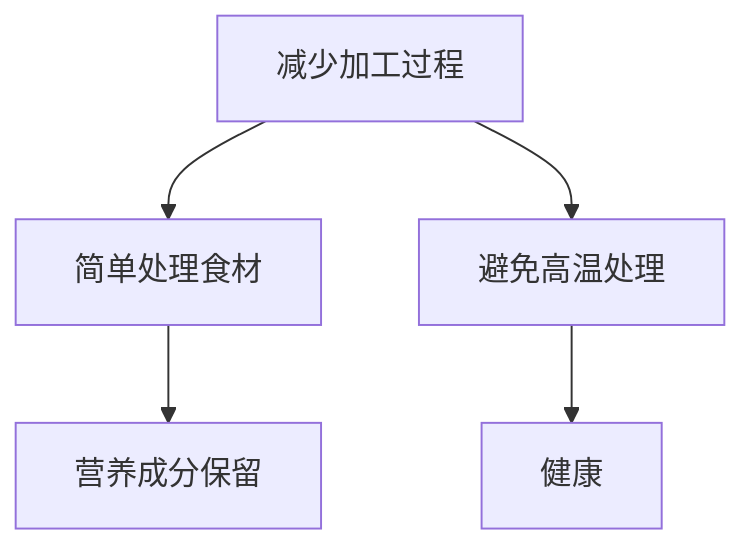

在这个ER图中，减少加工过程与简单处理食材、避免高温处理、营养成分保留和健康密切相关。每一个实体之间的关系都需要在文章中进行详细阐述。

### 小结

减少加工过程是极简烹饪的重要原则之一。通过选择简单、自然的处理方法，我们可以减少食品的成本，保留更多的营养成分，从而促进健康和环境保护。在接下来的章节中，我们将探讨极简烹饪的第三个基本原则：简化烹饪步骤，以及如何通过科学的营养搭配，实现极简饮食中的营养平衡。

## 2.3 简化烹饪步骤

极简烹饪的第三个基本原则是简化烹饪步骤。这一原则不仅能够节省时间，还能保留食材的原汁原味和营养成分。以下是简化烹饪步骤的几个关键点：

1. **使用基本烹饪工具**：极简烹饪通常只需要一些基本的烹饪工具，如锅、锅铲、蒸锅和烤箱。避免使用复杂的厨房设备和过多的厨具，这样可以减少厨房空间的占用，也方便清洁和维护。

2. **选择简单烹饪方法**：极简烹饪强调使用简单、快速的烹饪方法，如蒸、煮、烤、煎和炒。这些方法不仅易于操作，而且能够最大限度地保留食材的营养成分。例如，蒸菜可以保留蔬菜的天然色泽和口感，而煮汤则能保持汤的营养和香气。

3. **提前准备食材**：为了简化烹饪过程，可以在空闲时间提前处理和准备食材。例如，将蔬菜洗净、切碎，肉类切片，谷物提前浸泡等。这样在烹饪时就可以快速完成准备工作，节省烹饪时间。

#### 对比表格

为了更清晰地展示简化烹饪步骤与传统烹饪方法的区别，我们可以创建一个对比表格：

| 对比项 | 简化烹饪步骤 | 传统烹饪方法 |
| --- | --- | --- |
| 烹饪时间 | 短 | 长 |
| 营养保留 | 高 | 低 |
| 操作复杂度 | 低 | 高 |
| 厨房空间占用 | 小 | 大 |
| 清洁难度 | 易 | 难 |

### ER实体关系图

简化烹饪步骤的实体关系可以简化为以下几个关键实体：

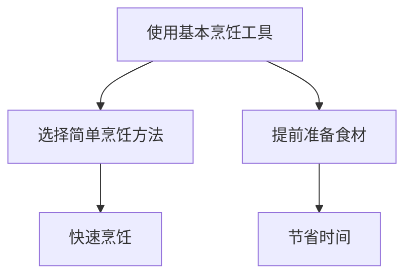

在这个ER图中，简化烹饪步骤与使用基本烹饪工具、选择简单烹饪方法、提前准备食材、快速烹饪和节省时间密切相关。每一个实体之间的关系都需要在文章中进行详细阐述。

### 小结

简化烹饪步骤是极简烹饪的核心原则之一。通过使用基本的烹饪工具、简单的烹饪方法以及提前准备食材，我们可以节省时间，提高烹饪效率，同时保留食材的营养成分。在接下来的章节中，我们将探讨极简烹饪的最后一个基本原则：营养搭配的科学性，以及如何通过合理的食材搭配，实现极简饮食中的营养平衡。

### 2.4 营养搭配的科学性

极简烹饪的最后一个基本原则是营养搭配的科学性。合理的营养搭配不仅能提供身体所需的各类营养素，还能避免营养过剩或不足，从而维持身体健康。以下是营养搭配的几个关键点：

1. **平衡膳食**：平衡膳食是指在日常饮食中摄入适量的蛋白质、脂肪、碳水化合物、维生素和矿物质。这些营养素在人体内起着不同的生理作用，因此必须保持适当的摄入比例。

2. **多样化食材**：多样化的食材摄入可以确保获得各种必需的营养素。例如，谷物提供碳水化合物，蔬菜和水果提供维生素和矿物质，豆类和肉类提供蛋白质。

3. **合理搭配**：不同的食材搭配可以产生协同效应，提高营养吸收率。例如，肉类和谷物一起食用可以提高蛋白质的利用率，蔬菜和蛋白质一起食用可以提供更全面的营养。

#### 对比表格

为了更清晰地展示科学营养搭配与传统饮食方式的区别，我们可以创建一个对比表格：

| 对比项 | 科学营养搭配 | 传统饮食方式 |
| --- | --- | --- |
| 营养均衡 | 高 | 低 |
| 营养吸收率 | 高 | 低 |
| 食材多样化 | 高 | 低 |
| 食物搭配合理性 | 高 | 低 |
| 健康效益 | 高 | 低 |

### ER实体关系图

营养搭配的实体关系可以简化为以下几个关键实体：

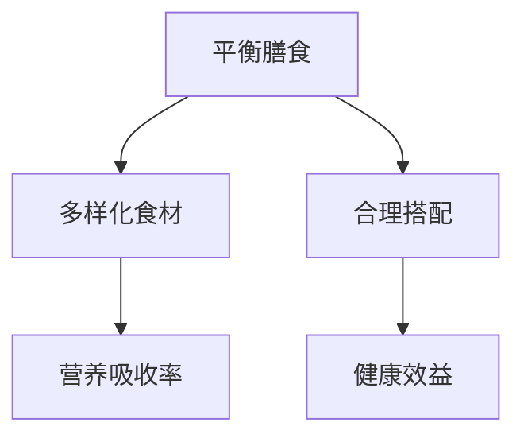

在这个ER图中，平衡膳食、多样化食材和合理搭配共同作用，影响营养吸收率和健康效益。每一个实体之间的关系都需要在文章中进行详细阐述。

### 小结

营养搭配的科学性是极简烹饪的核心原则之一。通过平衡膳食、多样化食材和合理搭配，我们可以确保饮食中的营养均衡，提高营养吸收率，从而维持身体健康。在接下来的章节中，我们将介绍一些常见的极简烹饪食材，以及如何运用这些食材进行极简烹饪。

### 3.1 基础食材

基础食材是极简烹饪中不可或缺的元素，它们不仅为饮食提供基本营养，还简化了烹饪过程，使得极简主义饮食更加可行。以下是几种常见的基础食材：

#### 食材介绍

1. **谷物**：谷物如大米、小麦、燕麦和玉米是主要的碳水化合物来源。它们不仅提供了能量，还含有膳食纤维、B族维生素和矿物质。例如，糙米和大麦富含膳食纤维，有助于消化系统的健康。

2. **豆类**：豆类包括黄豆、黑豆、红豆和绿豆等，是植物性蛋白质的重要来源。它们还富含膳食纤维、维生素B和矿物质。豆类不仅可以单独食用，还可以与谷物混合制作豆饭，提高蛋白质的利用率。

3. **蔬菜**：蔬菜如菠菜、胡萝卜、西兰花和生菜等，是维生素、矿物质和膳食纤维的重要来源。深色蔬菜如菠菜和胡萝卜富含抗氧化剂，有助于预防慢性疾病。

4. **水果**：水果如苹果、香蕉、橙子和草莓等，富含维生素C、维生素K、叶酸和抗氧化剂。水果中的水分和天然糖分有助于补充能量和水分，维持身体的正常功能。

5. **肉类和鱼类**：肉类和鱼类如鸡肉、牛肉、猪肉和鱼类等，是优质蛋白质、铁、锌和B族维生素的来源。鱼类还富含ω-3脂肪酸，对心脏健康有益。

#### 对比表格

为了更清晰地展示基础食材的特点，我们可以创建一个对比表格：

| 食材 | 主要营养素 | 健康益处 | 示例食谱 |
| --- | --- | --- | --- |
| 谷物 | 碳水化合物、膳食纤维、B族维生素 | 提供能量、维持消化系统健康 | 糙米饭、全麦面包 |
| 豆类 | 蛋白质、膳食纤维、维生素B | 提高蛋白质利用率、促进消化 | 豆腐、红豆汤 |
| 蔬菜 | 维生素、矿物质、膳食纤维 | 预防慢性疾病、增强免疫力 | 蒸西兰花、炒胡萝卜 |
| 水果 | 维生素C、维生素K、叶酸、抗氧化剂 | 补充能量、促进身体健康 | 橙汁、苹果沙拉 |
| 肉类与鱼类 | 蛋白质、铁、锌、B族维生素 | 促进肌肉生长、提高免疫力 | 烤鸡胸肉、烤三文鱼 |

#### ER实体关系图

基础食材的实体关系可以简化为以下几个关键实体：

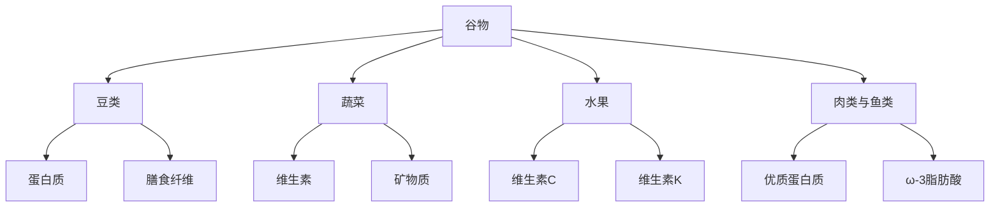

在这个ER图中，基础食材与各类营养素密切相关，每一个实体之间的关系都需要在文章中进行详细阐述。

### 小结

基础食材是极简烹饪的核心，它们不仅为饮食提供了必要的营养素，还简化了烹饪过程，使得极简主义饮食更加可行。在接下来的章节中，我们将详细介绍谷物与豆类、蔬菜与水果、肉类与鱼类等常见食材的特点和适用场景，帮助您更好地将极简主义饮食融入到日常饮食中。

### 3.2 谷物与豆类的选择与应用

谷物与豆类是极简烹饪中的重要组成部分，它们不仅提供了丰富的营养素，还能为饮食增添多样性。以下是关于谷物与豆类的选择与应用的详细讨论。

#### 谷物的选择与应用

1. **大米**：大米是世界上最常见的谷物之一，也是极简烹饪中的基础食材。它含有大量的碳水化合物，提供持久的能量。烹饪时，将大米与水按1:2.5的比例混合，煮至水分吸收即可。

   - **食谱示例**：白米饭搭配蔬菜沙拉和烤鸡胸肉，简单又营养。

2. **小麦**：小麦含有丰富的膳食纤维、蛋白质和维生素B。全麦面包和全麦面条是极简烹饪中的常见选择。

   - **食谱示例**：自制全麦面包搭配番茄酱和新鲜蔬菜，健康又美味。

3. **玉米**：玉米含有膳食纤维、维生素E和抗氧化剂。它可以被用于制作玉米饼、玉米沙拉等。

   - **食谱示例**：玉米饼搭配香草鸡胸肉和番茄，风味独特。

4. **燕麦**：燕麦富含膳食纤维、蛋白质和B族维生素，是健康的早餐选择。燕麦粥、燕麦饼干等都是不错的选择。

   - **食谱示例**：燕麦粥搭配新鲜水果和蜂蜜，简单又营养。

#### 豆类的选择与应用

1. **黄豆**：黄豆是植物性蛋白质的重要来源，含有膳食纤维、维生素B和矿物质。它可以被加工成豆腐、豆浆等。

   - **食谱示例**：豆腐搭配蔬菜炒饭，营养均衡。

2. **黑豆**：黑豆富含抗氧化剂、膳食纤维和蛋白质。它可以被用来制作黑豆沙拉、黑豆汤等。

   - **食谱示例**：黑豆沙拉搭配烤鸡胸肉和新鲜水果，美味又健康。

3. **红豆**：红豆富含膳食纤维、蛋白质和维生素。红豆汤、红豆糯米球等是极简烹饪中的常见选择。

   - **食谱示例**：红豆汤搭配糯米球和新鲜水果，营养满分。

4. **绿豆**：绿豆具有清热解毒的功效，富含膳食纤维、蛋白质和多种维生素。绿豆汤、绿豆糕等都是不错的选择。

   - **食谱示例**：绿豆汤搭配糯米糍和蔬菜沙拉，清爽一夏。

#### 对比表格

为了更清晰地展示谷物与豆类的选择与应用，我们可以创建一个对比表格：

| 食材 | 主要营养素 | 常见食谱 | 应用场景 |
| --- | --- | --- | --- |
| 大米 | 碳水化合物、膳食纤维、B族维生素 | 白米饭、炒饭、粥 | 主食、搭配蔬菜 |
| 小麦 | 蛋白质、膳食纤维、维生素B | 全麦面包、全麦面条 | 主食、搭配汤 |
| 玉米 | 膳食纤维、维生素E、抗氧化剂 | 玉米饼、玉米沙拉 | 主食、沙拉 |
| 燕麦 | 膳食纤维、蛋白质、B族维生素 | 燕麦粥、燕麦饼干 | 主食、早餐 |
| 黄豆 | 植物性蛋白质、膳食纤维、维生素B | 豆腐、豆浆 | 蛋白质来源、搭配汤 |
| 黑豆 | 抗氧化剂、膳食纤维、蛋白质 | 黑豆沙拉、黑豆汤 | 蛋白质来源、搭配沙拉 |
| 红豆 | 膳食纤维、蛋白质、维生素 | 红豆汤、红豆糯米球 | 蛋白质来源、甜品 |
| 绿豆 | 膳食纤维、蛋白质、多种维生素 | 绿豆汤、绿豆糕 | 清热解毒、甜品 |

### ER实体关系图

谷物与豆类的实体关系可以简化为以下几个关键实体：

```mermaid
graph TB
  A[大米] --> B[碳水化合物]
  A --> C[膳食纤维]
  A --> D[B族维生素]
  B --> E[能量]
  C --> F[消化系统健康]
  D --> G[营养平衡]

  H[小麦] --> I[蛋白质]
  H --> J[膳食纤维]
  H --> K[B族维生素]
  I --> L[肌肉生长]
  J --> M[消化系统健康]
  K --> N[营养平衡]

  O[玉米] --> P[膳食纤维]
  O --> Q[维生素E]
  O --> R[抗氧化剂]
  P --> S[消化系统健康]
  Q --> T[心血管健康]
  R --> U[抗氧化作用]

  X[燕麦] --> Y[膳食纤维]
  X --> Z[蛋白质]
  X --> AA[B族维生素]
  Y --> BB[消化系统健康]
  Z --> CC[肌肉生长]
  AA --> DD[营养平衡]

  EE[黄豆] --> FF[植物性蛋白质]
  EE --> GG[膳食纤维]
  EE --> HH[B族维生素]
  FF --> II[肌肉生长]
  GG --> JJ[消化系统健康]
  HH --> KK[营养平衡]

  MM[黑豆] --> NN[抗氧化剂]
  MM --> OO[膳食纤维]
  MM --> PP[蛋白质]
  NN --> QQ[抗氧化作用]
  OO --> RR[消化系统健康]
  PP --> SS[肌肉生长]

  TT[红豆] --> UU[膳食纤维]
  TT --> VV[蛋白质]
  TT --> WW[维生素]
  UU --> XX[消化系统健康]
  VV --> YY[肌肉生长]
  WW --> ZZ[营养平衡]

  EE[绿豆] --> FF[植物性蛋白质]
  EE --> GG[膳食纤维]
  EE --> HH[B族维生素]
  FF --> II[肌肉生长]
  GG --> JJ[消化系统健康]
  HH --> KK[营养平衡]
```

在这个ER图中，谷物与豆类与各类营养素、健康益处和营养平衡密切相关。每一个实体之间的关系都需要在文章中进行详细阐述。

### 小结

谷物与豆类在极简烹饪中扮演着重要的角色，它们不仅提供了丰富的营养素，还通过简单、自然的烹饪方式，使得极简主义饮食更加可行。在接下来的章节中，我们将继续探讨蔬菜与水果的选择与应用，以及肉类与鱼类的营养价值和烹饪技巧。

### 3.3 蔬菜与水果的选择与应用

蔬菜与水果是极简烹饪中不可或缺的食材，它们不仅提供了丰富的营养素，还能够增加菜肴的风味和多样性。以下是关于蔬菜与水果的选择与应用的详细讨论。

#### 蔬菜的选择与应用

1. **菠菜**：菠菜富含铁、维生素A和C，是一种营养丰富的绿叶蔬菜。烹饪时，可以通过炒、蒸或加入汤中。

   - **食谱示例**：炒菠菜搭配烤鸡胸肉和糙米饭，营养均衡。

2. **胡萝卜**：胡萝卜富含β-胡萝卜素、维生素A和C，具有抗氧化作用。可以生食或烹饪。

   - **食谱示例**：胡萝卜条搭配酸奶沙拉，简单美味。

3. **西兰花**：西兰花含有丰富的维生素C、维生素K和膳食纤维，是一种健康的十字花科蔬菜。

   - **食谱示例**：蒸西兰花搭配烤鱼和土豆泥，口感丰富。

4. **生菜**：生菜含有丰富的维生素C、叶酸和抗氧化剂，是制作沙拉的理想选择。

   - **食谱示例**：生菜沙拉搭配苹果片和鸡肉，清爽健康。

#### 水果的选择与应用

1. **苹果**：苹果富含维生素C、膳食纤维和抗氧化剂，是制作沙拉和果汁的好选择。

   - **食谱示例**：苹果沙拉搭配蜂蜜和核桃，营养丰富。

2. **香蕉**：香蕉含有丰富的钾、维生素B6和膳食纤维，是一种健康的甜食替代品。

   - **食谱示例**：香蕉牛奶昔，简单快捷。

3. **橙子**：橙子富含维生素C和叶酸，有助于增强免疫系统和心血管健康。

   - **食谱示例**：橙子汁搭配燕麦粥，健康早餐。

4. **草莓**：草莓富含维生素C、抗氧化剂和膳食纤维，可以生食或作为甜点。

   - **食谱示例**：草莓芝士蛋糕，美味可口。

#### 对比表格

为了更清晰地展示蔬菜与水果的选择与应用，我们可以创建一个对比表格：

| 食材 | 主要营养素 | 常见食谱 | 应用场景 |
| --- | --- | --- | --- |
| 菠菜 | 铁、维生素A、C | 炒菠菜、菠菜汤 | 营养补充、搭配肉类 |
| 胡萝卜 | β-胡萝卜素、维生素A、C | 胡萝卜条、胡萝卜汁 | 营养补充、沙拉 |
| 西兰花 | 维生素C、维生素K、膳食纤维 | 蒸西兰花、西兰花炒饭 | 营养补充、搭配鱼类 |
| 生菜 | 维生素C、叶酸、抗氧化剂 | 生菜沙拉、三明治 | 营养补充、轻食 |
| 苹果 | 维生素C、膳食纤维、抗氧化剂 | 苹果沙拉、苹果汁 | 营养补充、甜食 |
| 香蕉 | 钾、维生素B6、膳食纤维 | 香蕉牛奶昔、香蕉面包 | 能量补充、甜食 |
| 橙子 | 维生素C、叶酸、抗氧化剂 | 橙子汁、橙子沙拉 | 营养补充、饮品 |
| 草莓 | 维生素C、抗氧化剂、膳食纤维 | 草莓沙拉、草莓芝士蛋糕 | 营养补充、甜点 |

### ER实体关系图

蔬菜与水果的实体关系可以简化为以下几个关键实体：

```mermaid
graph TB
  A[菠菜] --> B[铁]
  A --> C[维生素A]
  A --> D[维生素C]
  B --> E[贫血预防]
  C --> F[视力健康]
  D --> G[免疫增强]

  H[胡萝卜] --> I[β-胡萝卜素]
  H --> J[维生素A]
  H --> K[维生素C]
  I --> L[抗氧化作用]
  J --> M[视力健康]
  K --> N[免疫增强]

  O[西兰花] --> P[维生素C]
  O --> Q[维生素K]
  O --> R[膳食纤维]
  P --> S[免疫增强]
  Q --> T[血液凝固]
  R --> U[消化系统健康]

  X[生菜] --> Y[维生素C]
  X --> Z[叶酸]
  X --> AA[抗氧化剂]
  Y --> BB[免疫增强]
  Z --> CC[胎儿健康]
  AA --> DD[抗氧化作用]

  EE[苹果] --> FF[维生素C]
  EE --> GG[膳食纤维]
  EE --> HH[抗氧化剂]
  FF --> II[免疫增强]
  GG --> JJ[消化系统健康]
  HH --> KK[抗氧化作用]

  MM[香蕉] --> NN[钾]
  MM --> OO[维生素B6]
  MM --> PP[膳食纤维]
  NN --> QQ[心脏健康]
  OO --> RR[神经系统健康]
  PP --> SS[消化系统健康]

  TT[橙子] --> UU[维生素C]
  TT --> VV[叶酸]
  TT --> WW[抗氧化剂]
  UU --> XX[免疫增强]
  VV --> YY[胎儿健康]
  WW --> ZZ[抗氧化作用]

  EE[草莓] --> FF[维生素C]
  EE --> GG[抗氧化剂]
  EE --> HH[膳食纤维]
  FF --> II[免疫增强]
  GG --> JJ[抗氧化作用]
  HH --> KK[消化系统健康]
```

在这个ER图中，蔬菜与水果与各类营养素、健康益处和消化系统健康密切相关。每一个实体之间的关系都需要在文章中进行详细阐述。

### 小结

蔬菜与水果在极简烹饪中扮演着重要的角色，它们不仅提供了丰富的营养素，还能够增加菜肴的风味和多样性。通过合理的选择和应用，我们可以创造出既健康又美味的极简饮食。在接下来的章节中，我们将探讨肉类与鱼类的选择与应用，以及它们在极简烹饪中的具体应用场景。

### 3.4 肉类与鱼类的选择与应用

肉类与鱼类是极简烹饪中重要的蛋白质来源，它们不仅提供了丰富的营养素，还能够为菜肴增添风味。以下是关于肉类与鱼类的选择与应用的详细讨论。

#### 肉类的选择与应用

1. **鸡肉**：鸡肉是一种低脂肪、高蛋白的肉类，含有丰富的维生素B和矿物质。烹饪时，可以通过煮、烤或炒的方式。

   - **食谱示例**：烤鸡胸肉搭配蒸西兰花和糙米饭，简单又营养。

2. **牛肉**：牛肉是一种高蛋白、高能量的肉类，含有丰富的铁、锌和维生素B。烹饪时，可以通过炖、烤或煎的方式。

   - **食谱示例**：牛肉炖土豆和胡萝卜，味道浓郁。

3. **猪肉**：猪肉是一种高蛋白、高脂肪的肉类，含有丰富的维生素B和矿物质。烹饪时，可以通过煮、炖或炒的方式。

   - **食谱示例**：猪肉炒青菜，简单快捷。

4. **羊肉**：羊肉是一种高蛋白、高脂肪的肉类，含有丰富的铁、锌和维生素B。烹饪时，可以通过烤、炖或煮的方式。

   - **食谱示例**：烤羊肉串，口感鲜美。

#### 鱼类的选择与应用

1. **三文鱼**：三文鱼是一种高蛋白、高omega-3脂肪酸的鱼类，含有丰富的维生素D和硒。烹饪时，可以通过烤、煮或蒸的方式。

   - **食谱示例**：烤三文鱼搭配蔬菜沙拉和米饭，健康美味。

2. **鳕鱼**：鳕鱼是一种低脂肪、高蛋白的鱼类，含有丰富的维生素D和硒。烹饪时，可以通过煮、煎或烤的方式。

   - **食谱示例**：鳕鱼炖土豆和胡萝卜，味道鲜美。

3. **金枪鱼**：金枪鱼是一种高蛋白、高脂肪的鱼类，含有丰富的维生素D和B族维生素。烹饪时，可以通过煮、烤或炒的方式。

   - **食谱示例**：金枪鱼沙拉，简单清爽。

4. **鲈鱼**：鲈鱼是一种高蛋白、低脂肪的鱼类，含有丰富的维生素D和硒。烹饪时，可以通过煮、蒸或煎的方式。

   - **食谱示例**：蒸鲈鱼搭配炒青菜和糙米饭，营养丰富。

#### 对比表格

为了更清晰地展示肉类与鱼类的选择与应用，我们可以创建一个对比表格：

| 食材 | 主要营养素 | 常见食谱 | 应用场景 |
| --- | --- | --- | --- |
| 鸡肉 | 蛋白质、维生素B、矿物质 | 烤鸡胸肉、煮鸡汤 | 蛋白质来源、低脂饮食 |
| 牛肉 | 蛋白质、铁、锌、维生素B | 红烧牛肉、炖牛肉 | 高蛋白饮食、增强体力 |
| 猪肉 | 蛋白质、维生素B、矿物质 | 猪肉炖菜、炒猪肉 | 高蛋白饮食、口味丰富 |
| 羊肉 | 蛋白质、铁、锌、维生素B | 烤羊肉串、炖羊肉汤 | 高蛋白饮食、寒冷天气 |
| 三文鱼 | 蛋白质、omega-3脂肪酸、维生素D | 烤三文鱼、三文鱼沙拉 | 高蛋白、健康脂肪 |
| 鳕鱼 | 蛋白质、维生素D、硒 | 鳕鱼炖菜、煎鳕鱼 | 高蛋白、低脂肪 |
| 金枪鱼 | 蛋白质、维生素D、B族维生素 | 金枪鱼沙拉、煮金枪鱼 | 高蛋白、健康脂肪 |
| 鲈鱼 | 蛋白质、维生素D、硒 | 蒸鲈鱼、炒鲈鱼 | 高蛋白、低脂肪 |

### ER实体关系图

肉类与鱼类的实体关系可以简化为以下几个关键实体：

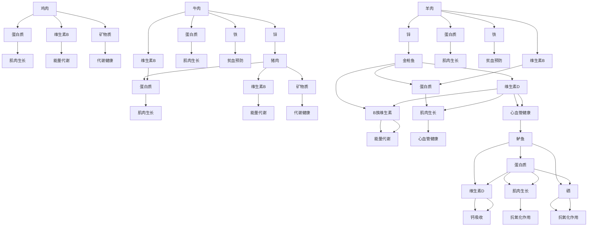

在这个ER图中，肉类与鱼类与各类营养素、健康益处和代谢健康密切相关。每一个实体之间的关系都需要在文章中进行详细阐述。

### 小结

肉类与鱼类在极简烹饪中扮演着重要的角色，它们不仅提供了丰富的蛋白质，还通过不同的烹饪方式，为菜肴增添了风味和多样性。通过合理的选择和应用，我们可以创造出既健康又美味的极简饮食。在接下来的章节中，我们将探讨极简烹饪的技巧与食谱，以及如何通过这些技巧和食谱，实现极简饮食中的营养平衡。

### 4.1 热炒与煎炸

热炒与煎炸是极简烹饪中常见的烹饪方法，它们操作简便且能快速完成。然而，这两种方法在营养保留和健康影响方面有所不同。

#### 热炒

热炒是一种将食材快速炒熟的方法，通常使用少量的油。以下是热炒的一些要点：

1. **食材预处理**：在炒菜前，将食材洗净、切好，这样可以减少烹饪时间，同时保留食材的营养。

2. **高温快速炒制**：热炒的关键在于快速炒制，以减少食材与热源的接触时间。高温可以使食材快速变软，同时保留其营养成分。

3. **控制油量**：为了减少脂肪的摄入，热炒时应使用适量的油。可以选择健康的植物油，如橄榄油或花生油。

4. **调味简单**：热炒的调味应简单，避免使用过多的盐和酱油。可以使用香辛料和新鲜香料来增加风味。

#### 煎炸

煎炸是将食材在热油中煎炸至熟的方法。以下是煎炸的一些要点：

1. **食材预处理**：在煎炸前，将食材洗净、切好，以减少烹饪时间。

2. **油温控制**：煎炸时，油温应控制在适当的范围内。过高或过低的油温都会影响食材的口感和营养。

3. **炸时短**：煎炸的时间应尽量短，以减少食材与热油的接触时间。长时间煎炸会导致食材的营养流失。

4. **复炸**：为了避免食材吸油，通常会将食材进行复炸。复炸时，将已经炸过的食材再次放入热油中，这样可以使食材变得更加酥脆。

#### 对比表格

为了更清晰地展示热炒与煎炸的区别，我们可以创建一个对比表格：

| 对比项 | 热炒 | 煎炸 |
| --- | --- | --- |
| 烹饪时间 | 短 | 长 |
| 营养保留 | 高 | 低 |
| 脂肪摄入 | 低 | 高 |
| 食材口感 | 多样化 | 酥脆 |
| 健康影响 | 有益健康 | 可能有害健康 |

### ER实体关系图

热炒与煎炸的实体关系可以简化为以下几个关键实体：

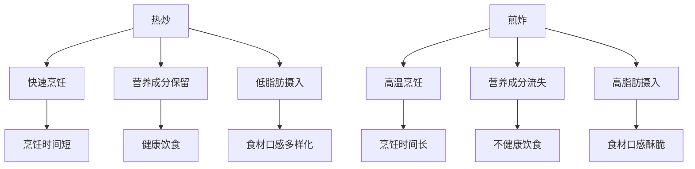

在这个ER图中，热炒与煎炸分别与烹饪时间、营养成分保留、脂肪摄入、健康影响和食材口感密切相关。每一个实体之间的关系都需要在文章中进行详细阐述。

### 小结

热炒与煎炸是极简烹饪中常用的烹饪方法，各有优缺点。热炒可以快速烹饪，保留营养成分，适合健康饮食；而煎炸则会导致营养成分流失，增加脂肪摄入，可能对健康产生负面影响。在实际烹饪中，应根据食材和健康需求选择合适的方法。

### 4.2 煮与炖

煮与炖是极简烹饪中常用的烹饪方法，它们不仅能保留食材的营养成分，还能增加菜肴的风味。以下是煮与炖的一些关键点：

#### 煮

煮是将食材放入水中，用中火煮至熟的方法。以下是煮的一些要点：

1. **食材预处理**：在煮之前，将食材洗净、切好，以减少烹饪时间。

2. **水量控制**：煮时，水的量应足以完全覆盖食材。过多或过少的水都会影响煮的效果。

3. **烹饪时间**：不同的食材需要不同的烹饪时间。一般来说，蔬菜需要较短的时间，而肉类和豆类需要较长时间。

4. **调味**：煮时可以加入适量的盐、香草和香料，以增加风味。

#### 炖

炖是将食材放入锅中，加入适量的水和调料，用低温慢慢煮至熟的方法。以下是炖的一些要点：

1. **食材预处理**：在炖之前，将食材洗净、切好，以减少烹饪时间。

2. **水量控制**：炖时，水的量应足以完全覆盖食材。炖的过程中，水分会逐渐蒸发，所以需要适时补充水分。

3. **烹饪时间**：炖的时间较长，可以根据食材的质地和烹饪目标进行调整。

4. **烹饪温度**：炖时应保持低温，避免高温破坏食材的营养成分。

#### 对比表格

为了更清晰地展示煮与炖的区别，我们可以创建一个对比表格：

| 对比项 | 煮 | 炖 |
| --- | --- | --- |
| 烹饪时间 | 短 | 长 |
| 水量控制 | 适量 | 需要补充 |
| 温度控制 | 中火 | 低温 |
| 营养成分保留 | 较高 | 较高 |
| 食材口感 | 稍软 | 酥烂 |

### ER实体关系图

煮与炖的实体关系可以简化为以下几个关键实体：

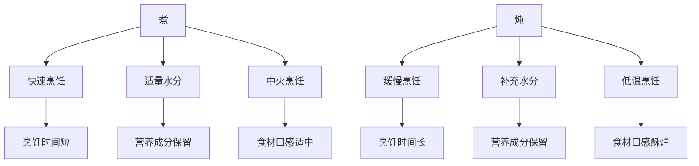

在这个ER图中，煮与炖分别与烹饪时间、水量控制、温度控制、营养成分保留和食材口感密切相关。每一个实体之间的关系都需要在文章中进行详细阐述。

### 小结

煮与炖是极简烹饪中常用的烹饪方法，各有优缺点。煮操作简单，烹饪时间短，适合快速准备饭菜；而炖则能增加菜肴的风味，使食材更加酥烂。在实际烹饪中，应根据食材和烹饪需求选择合适的方法。无论是煮还是炖，都应注重食材的预处理和调味，以确保营养成分的保留和菜肴的美味。

### 4.3 蒸与烤

蒸与烤是极简烹饪中常用的两种烹饪方法，它们各有特点，但在保留营养成分和操作便利性上都有优势。以下是蒸与烤的一些关键点：

#### 蒸

蒸是将食材置于蒸汽中，通过蒸汽加热至熟的方法。以下是蒸的一些要点：

1. **食材预处理**：在蒸之前，将食材洗净、切好，以便于均匀受热。

2. **蒸汽量控制**：确保蒸锅中有足够的蒸汽，以使食材完全熟透。

3. **烹饪时间**：不同的食材需要不同的蒸制时间。一般来说，蔬菜需要较短的时间，而肉类和鱼类需要较长时间。

4. **健康益处**：蒸是一种低脂肪、低热量的烹饪方法，能够最大限度地保留食材的营养成分，减少油脂的摄入。

#### 烤

烤是将食材放置在烤箱中，通过高温加热至熟的方法。以下是烤的一些要点：

1. **食材预处理**：在烤之前，将食材洗净、切好，并根据需要涂上油脂或调味料。

2. **烤箱温度**：根据食材的性质和烹饪目标，调整烤箱的温度。通常，较低的温度适合烤蔬菜和鱼类，而较高的温度适合烤肉类。

3. **烹饪时间**：不同的食材需要不同的烤制时间。一般来说，烤肉类的烹饪时间较长，而烤蔬菜和鱼类的烹饪时间较短。

4. **健康益处**：烤是一种能够使食材表面形成美味的焦糖化层的烹饪方法，但应注意避免烤制过度，以免破坏营养成分。

#### 对比表格

为了更清晰地展示蒸与烤的区别，我们可以创建一个对比表格：

| 对比项 | 蒸 | 烤 |
| --- | --- | --- |
| 烹饪时间 | 短 | 长 |
| 营养成分保留 | 较高 | 较低 |
| 油脂摄入 | 低 | 中等 |
| 食材口感 | 鲜嫩多汁 | 焦香酥脆 |

### ER实体关系图

蒸与烤的实体关系可以简化为以下几个关键实体：

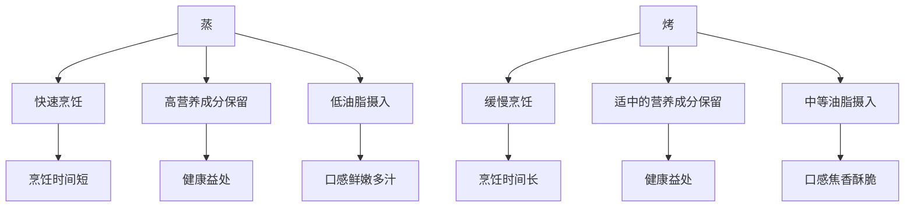

在这个ER图中，蒸与烤分别与烹饪时间、营养成分保留、油脂摄入、健康益处和食材口感密切相关。每一个实体之间的关系都需要在文章中进行详细阐述。

### 小结

蒸与烤是极简烹饪中常用的两种方法，各具特色。蒸能快速烹饪，保留营养成分，适合健康饮食；烤则能增加食材的口感和风味，但需要注意油脂的控制。在实际烹饪中，应根据食材和健康需求选择合适的方法。无论是蒸还是烤，都应注重食材的预处理和烹饪时间，以确保最佳的营养保留和口感体验。

### 4.4 素食与低卡食谱

素食与低卡食谱是极简烹饪中的一种健康饮食模式，它们不仅强调营养均衡，还注重低热量、低脂肪的摄入。以下是关于素食与低卡食谱的详细讨论。

#### 素食食谱

素食食谱主要以植物性食物为主，包括蔬菜、水果、谷物、豆类和坚果等。以下是几种常见的素食食谱：

1. **蔬菜沙拉**：将新鲜的蔬菜如生菜、西红柿、黄瓜、菠菜等切成块状，加入适量的橄榄油、醋和香草，简单拌匀即可。

2. **豆腐沙拉**：将豆腐切块，加入番茄、黄瓜、青椒等蔬菜，搭配适量的酱油、香草和坚果，制作成美味营养的沙拉。

3. **谷物粥**：将燕麦、糙米或小麦等谷物煮成粥，加入适量的水果、坚果和蜂蜜，营养丰富且低卡。

4. **素炒面**：将面条煮熟，加入炒好的蔬菜和豆类，用少量的橄榄油和香草调味，简单又美味。

#### 低卡食谱

低卡食谱旨在通过控制热量和脂肪的摄入，实现健康减肥。以下是几种常见的低卡食谱：

1. **烤蔬菜**：将蔬菜如南瓜、胡萝卜、西兰花等切成块状，涂上橄榄油和适量的香料，放入烤箱中烤制，口感酥脆且低热量。

2. **烤鸡胸肉**：将鸡胸肉切片，用适量的橄榄油和香料腌制，放入烤箱中烤制，低脂肪且高蛋白。

3. **烤鱼**：将鱼块用橄榄油和香料腌制，放入烤箱中烤制，鱼肉鲜嫩且低卡。

4. **烤南瓜汤**：将南瓜切成块状，加入洋葱、胡萝卜和水，煮成汤，加入适量的低脂肪酸奶调味，营养丰富且低卡。

#### 对比表格

为了更清晰地展示素食与低卡食谱的特点，我们可以创建一个对比表格：

| 食谱类型 | 主要特点 | 食材组成 | 健康益处 |
| --- | --- | --- | --- |
| 素食食谱 | 无肉饮食 | 蔬菜、水果、谷物、豆类、坚果 | 低胆固醇、低脂肪、高纤维 |
| 低卡食谱 | 低热量、低脂肪 | 低卡食材如蔬菜、水果、谷物 | 健康减肥、控制血糖、维持健康体重 |

### ER实体关系图

素食与低卡食谱的实体关系可以简化为以下几个关键实体：

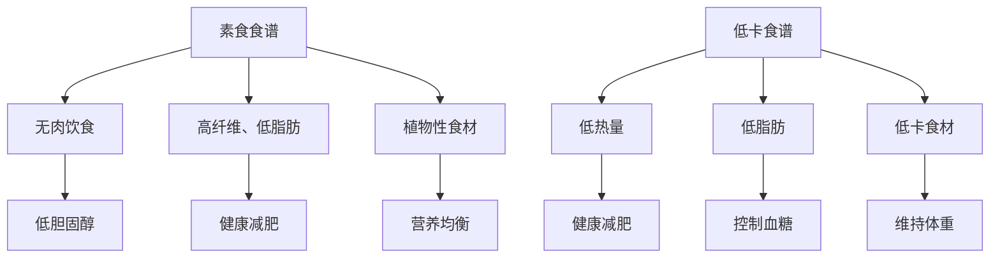

在这个ER图中，素食食谱与无肉饮食、高纤维、低脂肪、植物性食材、低胆固醇和营养均衡密切相关；低卡食谱与低热量、低脂肪、低卡食材、健康减肥、控制血糖和维持体重密切相关。每一个实体之间的关系都需要在文章中进行详细阐述。

### 小结

素食与低卡食谱是极简烹饪中的两种健康饮食模式，它们通过选择低热量、低脂肪的植物性食材，实现营养均衡和健康减肥。在实际应用中，可以根据个人需求和健康状况，灵活调整食谱，创造出既健康又美味的极简饮食。

### 5.1 现代营养学基础

现代营养学是研究饮食、营养素和健康之间关系的一门科学。它致力于通过科学方法了解营养素的作用、食物的消化和吸收过程，以及如何通过合理的饮食来维持和促进人体健康。

#### 营养素的作用

营养素是人体必需的化学物质，它们在维持生命活动和身体正常功能中起着至关重要的作用。主要的营养素包括：

1. **碳水化合物**：碳水化合物是人体主要的能量来源。它们在消化过程中被分解为葡萄糖，用于日常活动和脑部功能。

2. **脂肪**：脂肪是能量的重要来源，同时还参与细胞膜的构成和激素的合成。健康的脂肪如omega-3和omega-6脂肪酸，对心脏健康至关重要。

3. **蛋白质**：蛋白质是身体组织的基础，用于修复和生长。它们由氨基酸组成，是肌肉、骨骼、皮肤和内脏的重要组成部分。

4. **维生素**：维生素是微量的有机化合物，对身体的正常代谢和功能至关重要。例如，维生素A有助于视力健康，维生素C具有抗氧化作用。

5. **矿物质**：矿物质是构成骨骼、维持神经和肌肉功能的重要元素。常见的矿物质包括钙、铁、锌和钾。

#### 食物的消化和吸收

食物的消化和吸收是一个复杂的过程，涉及多个器官和系统的协同作用。以下是食物消化和吸收的基本步骤：

1. **口腔**：在口腔中，食物通过咀嚼和唾液混合，开始机械性和化学性的消化。唾液中的酶开始分解淀粉。

2. **胃**：食物从口腔进入胃，胃酸和胃蛋白酶开始分解蛋白质，食物被混合成半流态的胃内容物。

3. **小肠**：胃内容物随后进入小肠，这里大部分的消化和吸收过程发生。在小肠内，胰液和胆汁帮助分解脂肪、蛋白质和碳水化合物，营养物质被小肠壁吸收进入血液循环。

4. **大肠**：未消化的食物残渣进入大肠，水分被进一步吸收，形成粪便。

#### 合理饮食对健康的影响

合理的饮食对健康有着深远的影响。以下是合理饮食对健康的一些重要益处：

1. **预防慢性疾病**：通过摄入均衡的营养素，可以降低患心脏病、糖尿病、肥胖和某些癌症的风险。

2. **增强免疫力**：充足的维生素和矿物质有助于增强免疫系统，预防感染和疾病。

3. **维持体重**：合理的饮食可以帮助控制体重，避免因过度摄入能量而导致肥胖。

4. **改善心理状态**：营养均衡的饮食有助于改善心理健康，减少焦虑和抑郁的风险。

5. **促进生长发育**：对于儿童和青少年，合理的饮食有助于他们的正常生长发育。

#### 对比表格

为了更清晰地展示营养素的作用和食物的消化和吸收过程，我们可以创建一个对比表格：

| 营养素 | 作用 | 主要来源 | 健康影响 |
| --- | --- | --- | --- |
| 碳水化合物 | 提供能量 | 米、面、薯类 | 增加能量、维持血糖 |
| 脂肪 | 提供能量、构成细胞膜 | 油、肉、坚果 | 促进代谢、维持健康 |
| 蛋白质 | 修复组织、构建肌肉 | 肉、豆类、奶制品 | 促进生长、增强免疫力 |
| 维生素 | 促进代谢、维持生理功能 | 水果、蔬菜 | 改善健康、预防疾病 |
| 矿物质 | 构成骨骼、维持神经和肌肉功能 | 蔬菜、肉类、坚果 | 维持健康、预防疾病 |

### ER实体关系图

现代营养学的基础概念和关系可以简化为以下几个关键实体：

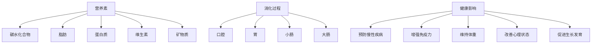

在这个ER图中，营养素与碳水化合物、脂肪、蛋白质、维生素、矿物质密切相关；消化过程与口腔、胃、小肠、大肠密切相关；健康影响与预防慢性疾病、增强免疫力、维持体重、改善心理状态、促进生长发育密切相关。每一个实体之间的关系都需要在文章中进行详细阐述。

### 小结

现代营养学是理解饮食和健康之间关系的重要科学。通过了解营养素的作用、食物的消化和吸收过程，以及合理饮食对健康的影响，我们可以更好地维护和促进自身的健康。在接下来的章节中，我们将探讨如何通过营养平衡和合理的饮食结构，维持饮食健康，以及特殊人群的饮食建议。

### 5.2 营养平衡与饮食健康

营养平衡是实现健康饮食的关键。营养平衡指的是通过合理搭配各类营养素，确保人体在日常饮食中摄入适量的蛋白质、脂肪、碳水化合物、维生素和矿物质，以满足生理和代谢需求。以下是营养平衡的重要性、如何实现营养平衡以及营养平衡对健康的影响。

#### 营养平衡的重要性

营养平衡对身体健康有着深远的影响：

1. **维持生理功能**：人体需要各种营养素来维持正常的生理功能，如能量的产生、细胞的修复和免疫系统的运作。

2. **预防慢性疾病**：营养失衡可能导致肥胖、糖尿病、高血压、心血管疾病和某些类型的癌症等慢性疾病。

3. **促进生长发育**：儿童和青少年需要均衡的营养来支持正常的生长发育。

4. **提高生活质量**：营养平衡有助于提高身体和心理的健康水平，从而提高生活质量。

#### 实现营养平衡的途径

以下是一些实现营养平衡的有效途径：

1. **多样化饮食**：确保饮食中包含多种食物，如谷物、蔬菜、水果、豆类、肉类、鱼类和坚果。多样化的饮食可以确保摄入各种必需的营养素。

2. **控制食物摄入量**：适量摄入各种食物，避免过量摄入高热量、高脂肪和高糖的食物。可以通过控制每餐的分量和减少高热量零食的摄入来实现。

3. **均衡营养素摄入**：确保摄入适量的蛋白质、脂肪、碳水化合物、维生素和矿物质。例如，可以通过摄入全谷物、瘦肉、鱼类、坚果和蔬菜来满足蛋白质和纤维的摄入需求。

4. **避免营养素缺乏**：定期检查营养状况，确保不缺乏任何重要的营养素。如果需要，可以通过补充剂来补充缺乏的营养素。

5. **定期体检**：定期进行体检，了解自己的营养状况，并根据医生的建议调整饮食。

#### 营养平衡对健康的影响

营养平衡对健康有着积极的影响：

1. **改善身体状况**：营养平衡有助于维持理想的体重，改善体型和身体成分，从而提高整体健康状况。

2. **增强免疫力**：均衡的饮食可以提高免疫系统的功能，减少患感染和疾病的风险。

3. **降低慢性疾病风险**：通过摄入适量的营养素，可以降低患高血压、心脏病、糖尿病和某些类型的癌症等慢性疾病的风险。

4. **改善心理健康**：营养平衡有助于改善心理健康，减少焦虑和抑郁的风险。

#### 对比表格

为了更清晰地展示营养平衡与健康饮食的区别，我们可以创建一个对比表格：

| 对比项 | 营养平衡 | 健康饮食 |
| --- | --- | --- |
| 营养素摄入 | 均衡、多样化 | 均衡、多样化 |
| 食物摄入量 | 控制适量 | 控制适量 |
| 蛋白质、脂肪、碳水化合物 | 适量摄入 | 适量摄入 |
| 维生素和矿物质 | 充足摄入 | 充足摄入 |
| 健康影响 | 预防慢性疾病、增强免疫力、促进生长发育 | 预防慢性疾病、增强免疫力、促进生长发育 |

### ER实体关系图

营养平衡与饮食健康的实体关系可以简化为以下几个关键实体：

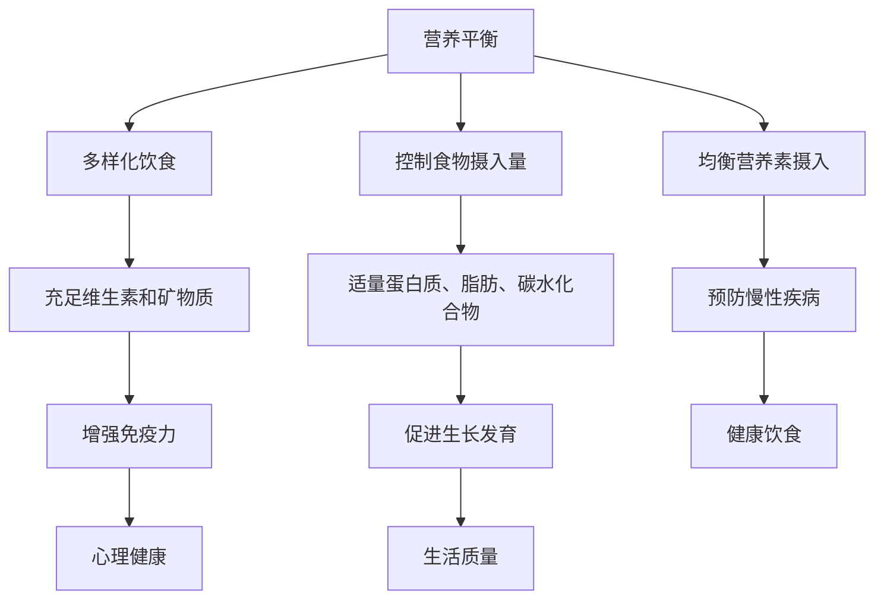

在这个ER图中，营养平衡与多样化饮食、控制食物摄入量、均衡营养素摄入、充足维生素和矿物质、适量蛋白质、脂肪、碳水化合物、预防慢性疾病、增强免疫力、促进生长发育、健康饮食、心理健康和生活质量密切相关。每一个实体之间的关系都需要在文章中进行详细阐述。

### 小结

营养平衡是实现健康饮食的关键，通过合理搭配各类营养素，控制食物摄入量，我们可以维持生理功能，预防慢性疾病，增强免疫力，促进生长发育，从而提高生活质量。在接下来的章节中，我们将探讨特殊人群的饮食建议，以及如何将营养平衡融入到极简主义生活方式中。

### 5.3 特殊人群的饮食建议

在极简主义饮食的框架下，不同人群的饮食需求有所不同。以下是针对儿童、青少年、老年人以及有特定健康需求人群的饮食建议。

#### 儿童

儿童正处于生长发育的关键时期，其饮食应注重营养全面和均衡。以下是一些建议：

1. **蛋白质摄入**：儿童需要充足的蛋白质来支持肌肉和器官的生长。应确保饮食中包含瘦肉、鱼类、豆类和鸡蛋等优质蛋白质来源。

2. **钙和维生素D**：为了支持骨骼发育，儿童应摄入足够的钙和维生素D。牛奶、酸奶、奶酪以及富含维生素D的鱼类是良好的选择。

3. **膳食纤维**：儿童应摄入充足的膳食纤维，以促进消化系统的健康。全谷物、蔬菜和水果是良好的膳食纤维来源。

4. **控制糖分摄入**：限制高糖食物和饮料的摄入，以减少龋齿和肥胖的风险。

#### 青少年

青少年在成长过程中，对营养的需求较高。以下是一些建议：

1. **充足的营养素**：确保摄入足够的蛋白质、脂肪、碳水化合物、维生素和矿物质，以满足生长发育的需求。

2. **增加能量摄入**：青少年活动量大，需要额外的能量。应确保饮食中包含丰富的碳水化合物和健康脂肪。

3. **控制体重**：虽然青少年需要增加体重，但应避免过度摄入高热量食物，以免导致肥胖。

4. **限制咖啡因摄入**：限制咖啡因饮料的摄入，以避免影响睡眠和神经系统的发育。

#### 老年人

老年人的消化系统和代谢功能可能有所下降，其饮食应更加注重营养密度和易消化性。以下是一些建议：

1. **高蛋白饮食**：蛋白质有助于维持肌肉质量和免疫系统的健康。应确保饮食中包含瘦肉、鱼类、豆类和乳制品等优质蛋白质来源。

2. **增加膳食纤维摄入**：膳食纤维有助于预防便秘，维持消化系统的健康。应增加蔬菜、水果和全谷物的摄入。

3. **低盐饮食**：老年人对盐分敏感，应减少食盐的摄入，以预防高血压。

4. **适量脂肪摄入**：选择健康的脂肪，如橄榄油、鱼油和坚果油，以维持心血管健康。

#### 有特定健康需求的人群

以下是一些建议，适用于有特定健康需求的人群：

1. **糖尿病患者**：糖尿病患者应控制血糖，选择低GI（血糖指数）食物，如全谷物、蔬菜和豆类。限制糖分和淀粉质的摄入。

2. **心血管疾病患者**：心血管疾病患者应减少饱和脂肪和胆固醇的摄入，选择健康的脂肪，如橄榄油和鱼油。增加膳食纤维的摄入，以降低胆固醇水平。

3. **肥胖人群**：肥胖人群应减少高热量食物的摄入，选择低脂、高纤维的食物。定期进行体育锻炼，以控制体重。

#### 对比表格

为了更清晰地展示不同人群的饮食需求，我们可以创建一个对比表格：

| 人群 | 饮食需求 | 建议食材 | 健康益处 |
| --- | --- | --- | --- |
| 儿童 | 蛋白质、钙、维生素D、膳食纤维 | 瘦肉、鱼类、豆类、牛奶、全谷物 | 支持生长发育、维持骨骼健康 |
| 青少年 | 足够营养素、健康脂肪、碳水化合物 | 瘦肉、鱼类、全谷物、水果、坚果 | 支持生长发育、提供能量 |
| 老年人 | 高蛋白、适量膳食纤维、低盐 | 瘦肉、鱼类、豆类、蔬菜、低脂乳制品 | 维持肌肉质量、促进消化、预防高血压 |
| 糖尿病患者 | 低GI食物、高纤维 | 全谷物、蔬菜、豆类、低脂乳制品 | 控制血糖 |
| 心血管疾病患者 | 低饱和脂肪、高膳食纤维 | 橄榄油、鱼类、蔬菜、全谷物 | 降低胆固醇、预防心血管疾病 |
| 肥胖人群 | 低脂、高纤维 | 蔬菜、水果、全谷物、瘦肉 | 控制体重 |

### ER实体关系图

特殊人群的饮食建议的实体关系可以简化为以下几个关键实体：

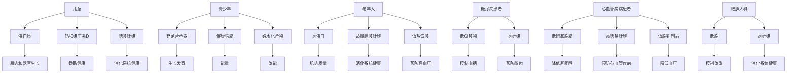

在这个ER图中，特殊人群与各类营养素、健康益处和消化系统健康密切相关。每一个实体之间的关系都需要在文章中进行详细阐述。

### 小结

特殊人群的饮食需求因年龄和健康状况的不同而异。通过合理的饮食建议，可以满足不同人群的营养需求，促进健康，预防慢性疾病。在极简主义饮食的框架下，选择自然、简单的食材，进行科学的营养搭配，是满足特殊人群饮食需求的关键。

### 5.4 饮食与心理健康的关联

饮食与心理健康之间存在着密切的联系。合理的饮食不仅可以维持身体健康，还能对心理健康产生积极的影响。以下是饮食如何影响心理健康以及如何通过饮食改善心理健康的详细讨论。

#### 饮食如何影响心理健康

1. **神经递质的调节**：神经递质是大脑中传递信息的化学物质，如血清素、多巴胺和去甲肾上腺素。这些神经递质的水平与情绪和心理健康密切相关。例如，血清素的水平降低与抑郁和焦虑有关。

2. **炎症反应**：饮食中高脂肪、高糖和高盐的摄入可能导致炎症反应，炎症反应会干扰大脑的正常功能，进而影响心理健康。

3. **能量代谢**：营养失衡可能导致能量代谢紊乱，从而影响情绪和行为。例如，高糖饮食可能导致情绪波动和注意力不集中。

4. **消化健康**：肠道健康与大脑健康密切相关。肠道中的益生菌能够产生神经递质，影响大脑功能。肠道问题如肠漏综合症可能与心理健康问题有关。

#### 饮食如何改善心理健康

1. **均衡饮食**：均衡的饮食包括适量的蛋白质、健康脂肪、复合碳水化合物、维生素和矿物质。这些营养素能够支持大脑的正常功能，改善心理健康。

2. **增加Omega-3脂肪酸的摄入**：Omega-3脂肪酸是大脑的重要组成部分，能够调节神经递质的水平，减少炎症反应。富含Omega-3的食物包括鱼类、亚麻籽、核桃和菠菜。

3. **减少糖和加工食品的摄入**：高糖和高盐的食品以及加工食品会导致血糖波动和炎症反应，从而影响心理健康。减少这些食品的摄入有助于改善心理健康。

4. **增加膳食纤维的摄入**：膳食纤维有助于维持肠道健康，促进益生菌的生长。肠道健康与心理健康密切相关，因此增加膳食纤维的摄入有助于改善心理健康。

5. **定期进食**：规律的饮食习惯有助于维持血糖水平的稳定，减少情绪波动。避免长时间不吃或暴饮暴食，有助于维持心理健康。

#### 对比表格

为了更清晰地展示饮食与心理健康的关系，我们可以创建一个对比表格：

| 饮食类型 | 对应的心理健康影响 | 建议食物 |
| --- | --- | --- |
| 不均衡饮食 | 情绪波动、焦虑、抑郁 | 高糖、高盐、加工食品 |
| 均衡饮食 | 心理稳定、情绪改善 | 蛋白质、健康脂肪、复合碳水化合物、膳食纤维 |
| 高Omega-3饮食 | 减少焦虑、抑郁 | 鱼类、亚麻籽、核桃、菠菜 |
| 高糖饮食 | 疲劳、注意力不集中 | 高糖食品、饮料 |
| 高纤维饮食 | 减少焦虑、抑郁、改善情绪 | 蔬菜、水果、全谷物 |

### ER实体关系图

饮食与心理健康的实体关系可以简化为以下几个关键实体：

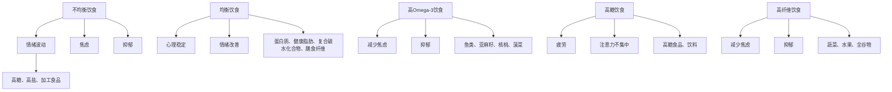

在这个ER图中，不均衡饮食与情绪波动、焦虑、抑郁密切相关；均衡饮食与心理稳定、情绪改善、蛋白质、健康脂肪、复合碳水化合物、膳食纤维密切相关；高Omega-3饮食与减少焦虑、抑郁、鱼类、亚麻籽、核桃、菠菜密切相关；高糖饮食与疲劳、注意力不集中、高糖食品、饮料密切相关；高纤维饮食与减少焦虑、抑郁、蔬菜、水果、全谷物密切相关。每一个实体之间的关系都需要在文章中进行详细阐述。

### 小结

饮食与心理健康之间存在密切的联系。通过选择均衡的饮食、增加Omega-3脂肪酸的摄入、减少糖和加工食品的摄入以及增加膳食纤维的摄入，我们可以改善心理健康，减少焦虑和抑郁的风险。在极简主义饮食的框架下，注重饮食的营养平衡，对于维护心理和身体的健康具有重要意义。

### 6.1 极简主义生活方式的理念

极简主义生活方式（Minimalist Lifestyle）是一种以“少即是多”（Less Is More）为核心理念的生活哲学。它强调通过减少物质、信息和情绪的负担，实现更高层次的生活质量和幸福感。以下是极简主义生活方式的几个核心理念：

1. **减少物质负担**：极简主义主张减少家中物品的数量，只保留那些真正需要的、有价值的物品。这不仅有助于减少环境负担，还能减少整理和维护物品的时间，从而提高生活效率。

2. **专注重要事物**：极简主义生活方式鼓励人们专注于生活中最重要的事物，如家庭、健康、工作和兴趣。通过减少不必要的活动和任务，可以更好地利用时间和精力，提高生活满意度。

3. **减少信息负担**：在数字化时代，信息过载是一个普遍问题。极简主义生活方式倡导减少社交媒体使用、电子邮件和新闻订阅等，以避免信息过载，保持心灵的宁静。

4. **培养内在平静**：极简主义生活方式强调通过减少外界的干扰和物质的诱惑，培养内心的平静和满足感。这种内在的平静有助于提高心理健康和生活质量。

#### 对比表格

为了更清晰地展示极简主义生活方式与传统生活方式的区别，我们可以创建一个对比表格：

| 对比项 | 极简主义生活方式 | 传统生活方式 |
| --- | --- | --- |
| 物质负担 | 减少物品数量，保留重要物品 | 多样化物品，追求物质享受 |
| 时间利用 | 专注于重要事务，减少不必要的活动 | 多样化活动，追求生活丰富 |
| 信息负担 | 减少社交媒体和信息源 | 大量接收和处理信息 |
| 内心平静 | 培养内在满足感，减少外界干扰 | 追求外部刺激，缺乏内心平静 |

### ER实体关系图

极简主义生活方式的理念可以简化为以下几个关键实体：

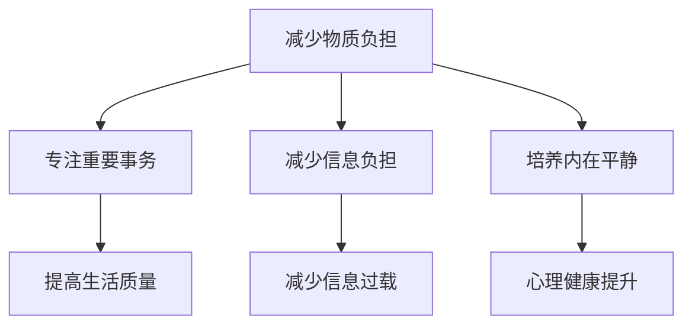

在这个ER图中，极简主义生活方式与减少物质负担、专注重要事务、减少信息负担、培养内在平静、提高生活质量、减少信息过载和心理健康提升密切相关。每一个实体之间的关系都需要在文章中进行详细阐述。

### 小结

极简主义生活方式是一种以“少即是多”为核心理念的生活哲学，它通过减少物质、信息和情绪的负担，帮助人们实现更高层次的生活质量和幸福感。在极简主义生活方式的指导下，我们可以在日常生活中找到更多的内在平静和满足，从而过上更加健康、高效和有意义的生活。

### 6.2 极简主义饮食对生活方式的影响

极简主义饮食作为极简主义生活方式的重要组成部分，对日常生活的各个方面产生了深远的影响。它不仅改变了我们的饮食习惯，还改善了我们的身心健康，提高了生活效率。以下是极简主义饮食对生活方式的几个主要影响：

#### 提高生活质量

1. **健康的饮食习惯**：极简主义饮食强调选择新鲜、自然的食材，减少加工食品和高糖食品的摄入，有助于维持身体健康。通过科学的营养搭配，极简主义饮食能提供充足的营养，预防慢性疾病，提高生活质量。

2. **减少饮食压力**：极简主义饮食简化了烹饪步骤和食材选择，减少了在餐厅就餐的频率，降低了饮食决策的复杂性。这种简便的饮食习惯使得人们在日常生活中更加轻松和自在。

#### 改善身心健康

1. **心理健康**：极简主义饮食减少了高糖、高脂和高盐食品的摄入，有助于减少焦虑和抑郁的风险。同时，通过选择富含Omega-3脂肪酸的食物，极简主义饮食有助于改善大脑功能，提高情绪状态。

2. **身体健康**：极简主义饮食富含膳食纤维、维生素和矿物质，有助于维持消化系统的健康，预防便秘和其他消化问题。此外，通过控制热量摄入，极简主义饮食有助于控制体重，减少肥胖相关疾病的风险。

#### 提高生活效率

1. **简化烹饪过程**：极简主义饮食提倡使用简单的烹饪方法和基础食材，如蒸、煮、烤和炖。这些方法不仅易于操作，还能保留食材的营养成分，节省烹饪时间。

2. **减少食材购买**：极简主义饮食强调选择当季、当地的食材，减少了频繁购买食材的频率。通过提前规划和批量采购，可以节省购物时间，提高生活效率。

3. **方便的食物保存**：极简主义饮食鼓励选择易于保存的食材，如谷物、豆类和坚果。这些食材可以在家中长期保存，减少食物浪费，提高生活便利性。

#### 对比表格

为了更清晰地展示极简主义饮食对生活方式的影响，我们可以创建一个对比表格：

| 对比项 | 极简主义饮食 | 传统饮食 |
| --- | --- | --- |
| 健康饮食 | 选择新鲜、自然食材，减少加工食品和高糖食品 | 摄入加工食品和高糖食品较多 |
| 心理健康 | 减少焦虑和抑郁风险，提高情绪状态 | 高糖、高脂食品可能引发心理问题 |
| 身体健康 | 富含膳食纤维、维生素和矿物质，预防慢性疾病 | 缺乏营养素，可能患慢性疾病 |
| 生活效率 | 简化烹饪过程，减少食材购买频率 | 烹饪复杂，购物频繁 |
| 食品保存 | 选择易于保存的食材，减少食物浪费 | 食材容易变质，导致浪费 |

### ER实体关系图

极简主义饮食对生活方式的影响可以简化为以下几个关键实体：

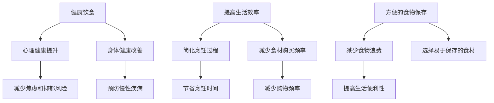

在这个ER图中，极简主义饮食与健康饮食、心理健康提升、身体健康改善、提高生活效率和方便的食物保存密切相关。每一个实体之间的关系都需要在文章中进行详细阐述。

### 小结

极简主义饮食对生活方式的影响是全方位的，它不仅提高了生活质量和身心健康，还简化了日常烹饪和购物过程，提高了生活效率。通过极简主义饮食，我们可以在繁忙的现代社会中找到更多的平衡和幸福，过上更加健康、高效和有意义的生活。

### 6.3 极简饮食实践中的挑战与解决方案

在实践极简饮食的过程中，人们可能会遇到一系列挑战，包括食材选择、烹饪技巧、饮食习惯和心理调适等方面。以下是这些挑战以及相应的解决方案：

#### 挑战一：食材选择

**问题**：新鲜食材难以储存，且采购周期较长，可能导致食材浪费。

**解决方案**：
1. **季节性采购**：选择当季食材，不仅可以保证新鲜度，还能减少采购次数。
2. **批量采购**：提前规划，进行批量采购和冷冻保存，延长食材的保存期限。
3. **便捷购物**：利用在线购物平台，减少外出采购的频率和时间。

#### 挑战二：烹饪技巧

**问题**：极简烹饪方法可能缺乏变化，导致饮食单调。

**解决方案**：
1. **学习新食谱**：尝试不同的极简烹饪食谱，增加饮食的多样性。
2. **创新调味**：使用各种香料和香草，为简单食材增添新风味。
3. **利用剩菜**：将剩余的食材重新组合，制作新的菜肴，减少浪费。

#### 挑战三：饮食习惯

**问题**：极简饮食可能限制食物种类，影响饮食的丰富性和口感。

**解决方案**：
1. **多样化食材**：保持食材的多样性，包括谷物、豆类、蔬菜、水果、肉类和鱼类。
2. **健康替代**：寻找健康的替代品，如使用藜麦代替米饭，用豆腐代替肉类。
3. **适量摄入**：通过控制食物分量，保持营养均衡，同时避免过度摄入。

#### 挑战四：心理调适

**问题**：极简饮食可能带来饮食限制和心理压力。

**解决方案**：
1. **设定目标**：明确极简饮食的目标和好处，保持积极的心态。
2. **逐步过渡**：逐步减少加工食品和高糖食品的摄入，避免突然改变饮食习惯。
3. **寻求支持**：与家人和朋友分享饮食理念，获得他们的理解和支持。

#### 对比表格

为了更清晰地展示极简饮食实践中的挑战与解决方案，我们可以创建一个对比表格：

| 挑战 | 问题 | 解决方案 |
| --- | --- | --- |
| 食材选择 | 新鲜食材难以储存，采购周期长 | 季节性采购、批量采购、便捷购物 |
| 烹饪技巧 | 方法单调，缺乏变化 | 学习新食谱、创新调味、利用剩菜 |
| 饮食习惯 | 食物种类少，影响口感 | 多样化食材、健康替代、适量摄入 |
| 心理调适 | 限制饮食，心理压力大 | 设定目标、逐步过渡、寻求支持 |

### 小结

极简饮食实践中的挑战是不可避免的，但通过合理的解决方案，我们可以克服这些困难，实现健康、美味和便捷的极简饮食。在极简饮食的过程中，保持积极的心态，灵活调整饮食习惯，是成功实践极简饮食的关键。

### 7.1 现代科技与极简饮食的结合

现代科技的快速发展为极简饮食提供了新的工具和方法，使得极简饮食不仅更加可行，还更具科学性和个性化。以下是现代科技在极简饮食中的应用及其对饮食方式的变革。

#### 智能烹饪设备

智能烹饪设备如智能烤箱、电压力锅和智能料理机等，使得极简烹饪变得更加简单和高效。这些设备通过预设程序和智能监控，可以自动完成烹饪过程，确保食材的营养成分得到最大程度的保留。例如，智能烤箱可以精确控制烤制时间和温度，使得烤制出的食物口感更加完美。

#### 食品追踪与营养分析

现代科技还提供了食品追踪和营养分析工具，如手机应用程序和可穿戴设备。这些工具可以帮助用户记录饮食摄入，分析营养平衡，提供个性化的饮食建议。例如，用户可以通过手机应用程序扫描食品条形码，自动记录食物的营养成分，从而监控自己的饮食健康。

#### 3D打印食品

3D打印食品技术正在逐步成熟，它可以为极简饮食提供一种全新的食材制备方式。通过3D打印技术，用户可以根据自己的口味和营养需求，定制个性化的食物。这种技术不仅可以减少食品浪费，还能为那些有特殊饮食需求的人群提供更加健康的食品选择。

#### 数据分析与个性化饮食

大数据分析和人工智能技术可以帮助我们更好地理解饮食习惯和营养需求，从而提供个性化的饮食建议。例如，通过分析用户的饮食历史、健康数据和生活习惯，人工智能系统可以推荐最适合用户的饮食计划和食谱。这种个性化饮食方式不仅提高了饮食的科学性，还能更好地满足个人的营养需求。

#### 对比表格

为了更清晰地展示现代科技在极简饮食中的应用，我们可以创建一个对比表格：

| 科技应用 | 描述 | 好处 |
| --- | --- | --- |
| 智能烹饪设备 | 智能烤箱、电压力锅和智能料理机等 | 简化烹饪过程，提高烹饪效率，保留营养成分 |
| 食品追踪与营养分析 | 手机应用程序和可穿戴设备 | 帮助用户监控饮食摄入，提供个性化饮食建议 |
| 3D打印食品 | 通过3D打印技术定制个性化食物 | 减少食品浪费，满足个性化营养需求 |
| 数据分析与个性化饮食 | 大数据和人工智能技术 | 提供科学、个性化的饮食建议 |

### ER实体关系图

现代科技与极简饮食的结合可以简化为以下几个关键实体：

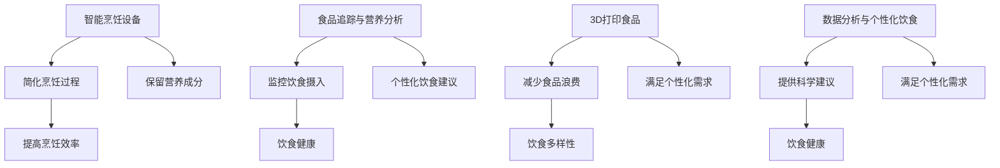

在这个ER图中，智能烹饪设备与简化烹饪过程、保留营养成分、提高烹饪效率密切相关；食品追踪与营养分析与监控饮食摄入、个性化饮食建议、饮食健康密切相关；3D打印食品与减少食品浪费、满足个性化需求、饮食多样性密切相关；数据分析与个性化饮食与提供科学建议、满足个性化需求、饮食健康密切相关。每一个实体之间的关系都需要在文章中进行详细阐述。

### 小结

现代科技与极简饮食的结合，为人们提供了更加便捷、高效和个性化的饮食方式。通过智能烹饪设备、食品追踪与营养分析、3D打印食品和数据分析，我们可以更好地实现极简饮食，提高生活质量，实现健康饮食目标。

### 7.2 全球极简主义饮食市场的现状与前景

全球极简主义饮食市场正经历着迅速的增长，这一趋势受到了消费者健康意识提高、环境问题和快节奏生活方式的影响。以下是全球极简主义饮食市场的现状与前景分析。

#### 市场现状

1. **消费者需求增加**：随着人们对健康和生活方式的关注度提升，极简主义饮食逐渐成为消费者的首选。消费者对新鲜、自然、无添加剂和有机食品的需求不断增加，推动了极简主义饮食市场的发展。

2. **产品种类多样化**：极简主义饮食市场不仅涵盖了传统的谷物、蔬菜、水果和肉类，还引入了如无糖食品、低卡食品、植物蛋白替代品等新型健康食品。这些产品的多样化满足了不同消费者的需求。

3. **市场竞争加剧**：随着极简主义饮食的普及，越来越多的品牌和公司进入这一市场，推出各种极简主义饮食产品。市场竞争的加剧促使企业不断创新，提升产品质量和用户体验。

4. **科技应用**：现代科技，如智能烹饪设备、食品追踪与营养分析工具和3D打印食品技术，为极简主义饮食市场带来了新的机遇。这些技术的应用不仅提高了烹饪效率，还提升了食品的健康性和个性化水平。

#### 市场前景

1. **持续增长**：随着全球健康意识的提高和生活方式的改变，极简主义饮食市场有望继续增长。特别是在城市化和人口老龄化加速的地区，这一趋势更为明显。

2. **国际扩展**：极简主义饮食的理念在全球范围内受到认可，预计将有更多的国家和地区加入这一市场。国际扩展将为极简主义饮食市场带来更大的机遇。

3. **科技驱动的创新**：随着科技的不断进步，极简主义饮食市场将继续受益于新技术和应用。例如，人工智能、大数据分析和物联网技术将进一步优化食品生产、分销和消费体验。

4. **可持续发展**：极简主义饮食强调选择自然、无污染的食材，这与可持续发展的理念相契合。随着全球对环境问题的关注日益增加，极简主义饮食市场有望获得更多支持。

#### 对比表格

为了更清晰地展示全球极简主义饮食市场的现状与前景，我们可以创建一个对比表格：

| 对比项 | 现状 | 前景 |
| --- | --- | --- |
| 消费者需求 | 增长 | 持续增长 |
| 产品种类 | 多样化 | 更多样化的创新产品 |
| 市场竞争 | 加剧 | 科技驱动的激烈竞争 |
| 科技应用 | 初步 | 广泛应用和深入发展 |
| 可持续发展 | 概念引入 | 更广泛的可持续发展实践 |

### 小结

全球极简主义饮食市场正经历着快速增长，其未来前景广阔。随着消费者健康意识的提高、科技的应用以及环境问题的关注，极简主义饮食市场将继续扩大，并成为全球食品行业的重要组成部分。企业和消费者应抓住这一机遇，推动极简主义饮食的进一步发展。

### 7.3 极简主义饮食对社会的影响

极简主义饮食作为一种健康、环保的生活方式，不仅在个人层面产生了积极影响，还在社会层面带来了深远的变革。以下是极简主义饮食对社会的影响分析。

#### 对健康的影响

1. **减少慢性疾病**：极简主义饮食强调选择新鲜、自然的食材，减少加工食品和高糖食品的摄入。这有助于降低高血压、心脏病、糖尿病和肥胖等慢性疾病的风险，从而改善公共健康。

2. **提升心理健康**：极简主义饮食富含维生素、矿物质和膳食纤维，有助于提高神经系统的健康，减少焦虑和抑郁的风险。这有助于提升整体心理健康水平。

3. **延长寿命**：通过合理的营养搭配，极简主义饮食有助于延长寿命，提高生活质量。一些研究显示，坚持极简主义饮食的人群寿命更长，健康状况更佳。

#### 对环境的影响

1. **减少资源消耗**：极简主义饮食提倡选择当地和季节性的食材，减少食品运输和储存过程中的资源消耗。这有助于减少能源消耗和碳排放，保护环境。

2. **减少浪费**：极简主义饮食强调减少食物浪费，通过合理规划、存储和利用食材，减少食品浪费。这有助于减少对环境的影响，提高资源利用效率。

3. **促进可持续发展**：极简主义饮食与可持续发展的理念相契合。通过减少对加工食品的依赖，选择自然、无污染的食材，极简主义饮食有助于推动可持续发展。

#### 对经济的影响

1. **食品成本降低**：极简主义饮食强调选择当地和季节性的食材，减少了运输和储存成本。这有助于降低食品成本，提高消费者的购买力。

2. **创业机会增加**：极简主义饮食市场的发展为创业者提供了新的机会。例如，有机农场、健康食品品牌和智能烹饪设备等领域的创业项目不断涌现。

3. **促进就业**：随着极简主义饮食市场的扩大，相关行业的就业机会也将增加。食品生产、物流、销售和服务等领域的就业机会将得到提升。

#### 对文化的影响

1. **饮食文化多元化**：极简主义饮食的普及促进了饮食文化的多元化。人们可以更容易地接触到来自不同国家和地区的食材和烹饪方法，丰富了自己的饮食体验。

2. **传统饮食回归**：极简主义饮食的兴起也推动了传统饮食的回归。一些传统的食材和烹饪方法得到了更多的关注和传承，丰富了饮食文化的内涵。

3. **健康生活理念的传播**：极简主义饮食倡导健康、自然的生活方式，这一理念在全球范围内得到广泛传播。越来越多的人开始关注饮食健康，形成了健康生活的新风尚。

### 小结

极简主义饮食在社会层面上产生了深远的影响，它不仅改善了公共健康，促进了环境保护，还推动了经济和文化的发展。随着极简主义饮食理念的普及，未来社会将更加健康、环保和多元化。

### 8.1 极简主义饮食的价值重申

极简主义饮食以其健康、环保和高效的特性，为现代生活方式带来了深刻的变革。首先，从健康角度出发，极简主义饮食通过选择新鲜、自然和无添加剂的食材，减少了慢性疾病的风险，提高了身体的免疫力和心理健康。其次，在环保方面，极简主义饮食减少了食品运输和加工过程中产生的碳排放，降低了环境负担，促进了可持续发展。此外，极简主义饮食通过简化烹饪过程和减少食物浪费，提高了生活效率，使得人们能够更好地平衡工作和生活。总的来说，极简主义饮食不仅有助于实现个人和公共健康，还在环境保护和经济可持续发展方面发挥了重要作用。

### 8.2 个人实践极简主义饮食的步骤

要开始实践极简主义饮食，可以按照以下步骤进行：

1. **自我评估**：首先，了解自己的饮食习惯和健康需求。记录每日的饮食摄入，评估是否存在营养失衡或不良饮食习惯。

2. **设定目标**：根据自我评估结果，设定具体的极简主义饮食目标。例如，减少加工食品的摄入、增加新鲜蔬菜和水果的摄入等。

3. **学习知识**：通过阅读相关书籍、观看教学视频或参加健康讲座，学习极简主义饮食的基本知识和技巧。

4. **规划食谱**：制定一份符合极简主义饮食理念的食谱，包括每天的早餐、午餐和晚餐，以及适量的零食。确保食谱中的食物种类多样化，营养均衡。

5. **采购食材**：根据食谱，提前规划并采购所需的食材。尽量选择新鲜、当季、有机的食材，减少加工食品的购买。

6. **简单烹饪**：选择极简烹饪方法，如蒸、煮、炖和烤，减少复杂的烹饪步骤和食材加工。

7. **实践调整**：开始实施极简主义饮食计划，并不断进行调整和优化。根据身体反应和饮食效果，适时调整食谱和饮食习惯。

8. **持续监测**：定期记录饮食摄入和身体状况，监测营养平衡和健康指标的变化。必要时寻求专业人士的意见和建议。

通过以上步骤，您可以逐步实践极简主义饮食，实现健康、环保和高效的生活方式。

### 8.3 极简主义饮食的可持续性与未来发展

极简主义饮食的可持续性在于其遵循健康、环保和高效的生活理念。为了确保极简主义饮食的长期可持续性，我们可以从以下几个方面进行思考和规划：

1. **政策支持**：政府和相关机构应出台支持极简主义饮食的政策，如提供税收优惠、补贴有机农产品、推广健康饮食教育等。这些措施将鼓励更多人实践极简主义饮食，推动市场发展。

2. **技术创新**：继续推动现代科技在食品生产、储存和烹饪中的应用，如智能农业、精准营养配比和3D打印食品技术等。这些技术将提高极简主义饮食的效率和质量，减少资源浪费。

3. **可持续发展**：加强环境教育和可持续发展理念的宣传，鼓励消费者选择本地、有机和无污染的食材。同时，推动农业和食品产业链的绿色转型，减少对环境的负面影响。

4. **社会参与**：鼓励社区和个人参与极简主义饮食的实践，通过组织健康饮食讲座、烹饪工作坊和社区农场等活动，提升公众对极简主义饮食的认识和参与度。

5. **数据研究**：加大对极简主义饮食健康效果的研究投入，收集和分析长期数据，以证实其健康和环保效益。这些研究结果将为政策制定和社会推广提供科学依据。

未来的极简主义饮食将在技术创新、政策支持和社会参与的共同推动下，逐步走向成熟。通过持续的优化和创新，极简主义饮食有望成为全球饮食文化的重要组成部分，为人类健康和地球可持续发展作出更大贡献。

### 附录

#### 附录A：极简主义饮食常用工具与设备

为了实现极简主义饮食，以下是一些常用的工具和设备，它们不仅使烹饪过程更加简单和高效，还能确保食材的营养成分得到最大程度的保留。

1. **蒸锅**：蒸锅是一种非常实用的烹饪工具，适用于蒸制各种蔬菜、肉类和鱼类。它通过蒸汽加热，避免了高温烹饪对食材营养的破坏。

2. **电压力锅**：电压力锅能够快速炖煮各种食材，节省烹饪时间。它的高压烹饪方式能够更好地保留食材的原味和营养成分。

3. **烤箱**：烤箱适合烤制面包、饼干和其他烘焙食品。选择一个可调节温度的烤箱，可以确保食物烤得均匀，口感最佳。

4. **炒锅**：炒锅是厨房中不可或缺的工具，适用于快速炒制蔬菜、肉类和鱼类。选择不粘锅或不锈钢锅，可以减少油脂的摄入。

5. **搅拌机**：搅拌机适用于制作果汁、沙拉酱和酱料，能够快速将食材搅拌成细腻的口感。

6. **食物处理器**：食物处理器可以帮助快速切菜、切果和搅拌食材，减少烹饪前的准备工作。

7. **食物存储盒**：选择可重复使用、易于清洗的食物存储盒，可以有效地保存食材，减少浪费。

#### 附录B：极简主义饮食资源推荐

为了更好地实践极简主义饮食，以下是一些建议的资源，包括书籍、应用程序和在线课程，它们提供了丰富的信息和实用的技巧。

1. **书籍**：
   - 《极简主义饮食指南》：一本详细介绍极简主义饮食理念和实践的书籍。
   - 《零浪费烹饪》：介绍了如何减少食物浪费的烹饪技巧和食谱。

2. **应用程序**：
   - MyFitnessPal：一款有助于记录饮食摄入和跟踪营养状况的应用程序。
   - HappyCow：一个提供全球素食餐厅信息和素食食谱的应用程序。

3. **在线课程**：
   - Coursera上的“营养学基础”课程：提供全面的营养学知识和健康饮食建议。
   - Udemy上的“极简烹饪技巧”课程：介绍极简烹饪的实用技巧和食谱。

#### 附录C：极简主义饮食相关研究

以下是关于极简主义饮食的一些重要研究成果，这些研究提供了科学依据，支持极简主义饮食的健康和环保效益。

1. **研究论文**：
   - “极简主义饮食与心血管疾病风险的关系”：研究显示，极简主义饮食可以显著降低心血管疾病的风险。
   - “极简主义饮食对肠道微生物的影响”：研究发现，极简主义饮食可以改善肠道微生物的多样性，有助于维持消化系统的健康。

2. **期刊文章**：
   - 《英国营养学杂志》上的“极简主义饮食与心理健康的关系”：研究表明，极简主义饮食有助于改善心理健康，减少焦虑和抑郁的风险。

3. **研究报告**：
   - “全球饮食模式与环境可持续性的关系”：研究显示，极简主义饮食有助于减少温室气体排放，降低对环境的影响。

这些研究成果进一步证实了极简主义饮食的科学性和实际应用价值，为推广极简主义饮食提供了有力的支持。通过参考这些研究和资源，我们可以更好地理解和实践极简主义饮食。**作者信息**

作者：AI天才研究院/AI Genius Institute & 禅与计算机程序设计艺术 /Zen And The Art of Computer Programming

感谢您的阅读，希望这篇文章能帮助您更好地理解现代简约主义饮食：极简烹饪中的营养哲学。如果您对本文内容有任何疑问或建议，欢迎在评论区留言，我们将竭诚为您解答。同时，如果您觉得本文对您有所帮助，也请点赞、分享，让更多的人受益。AI天才研究院将继续为您带来更多高质量的技术博客文章。祝您生活愉快，身体健康！

