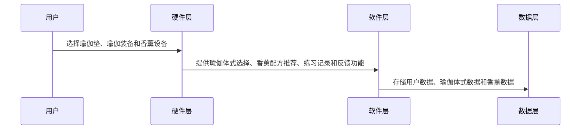

                 

# 现代简约主义香薰瑜伽：嗅觉与运动结合的身心放松课程

> 关键词：现代简约主义、香薰瑜伽、身心放松、嗅觉、运动

> 摘要：本文深入探讨了现代简约主义香薰瑜伽的原理、实践方法以及其在现代生活中的应用。通过将香薰疗法与瑜伽相结合，本文旨在为读者提供一种全新的身心放松方式，帮助他们在快节奏的生活中找到平衡与宁静。

## 引言

在现代社会的快节奏生活中，人们越来越意识到身心健康的重要性。传统的瑜伽练习虽然有助于放松身心，但往往需要长时间的练习和一定的专注力。香薰作为一种古老的芳香疗法，能够通过吸入香气分子来调节情绪、舒缓压力。现代简约主义追求简洁、高效的生活方式，将香薰与瑜伽相结合，形成了一种新兴的身心放松方式——现代简约主义香薰瑜伽。本文将详细介绍这一领域的概念、原理和实践方法，帮助读者深入了解并应用这一放松方式。

### 1.1 现代简约主义香薰瑜伽概述

#### 1.1.1 问题背景

在现代社会，人们的生活节奏加快，工作压力增大，身心健康问题日益突出。传统的瑜伽练习虽然有助于放松身心，但往往需要长时间的练习和一定的专注力。香薰作为一种古老的芳香疗法，能够通过吸入香气分子来调节情绪、舒缓压力。现代简约主义追求简洁、高效的生活方式，将香薰与瑜伽相结合，成为一种新兴的身心放松方式。

#### 1.1.2 问题描述

现代简约主义香薰瑜伽结合了香薰疗法和瑜伽的健身、放松效果，旨在通过简单的瑜伽动作和适宜的香薰，帮助人们在繁忙的生活中找到身心的平衡。然而，目前关于这一主题的系统性书籍较少，内容缺乏系统性和实用性，难以满足广大瑜伽爱好者和专业瑜伽师的需求。

#### 1.1.3 问题解决

本书旨在填补这一空白，通过系统化的内容，详细介绍现代简约主义香薰瑜伽的理论基础、实践方法、以及相关注意事项。书中的每一个章节都将围绕核心概念展开，帮助读者深入了解这一新兴的身心放松方式。

#### 1.1.4 边界与外延

现代简约主义香薰瑜伽不仅适用于瑜伽爱好者，也适合希望提升生活品质的人群。其不仅关注瑜伽体式的练习，更注重香薰对人体身心的影响。因此，本书的读者群体不仅限于瑜伽从业者，还包括广大对身心健康有追求的读者。

#### 1.1.5 概念结构与核心要素组成

- **现代简约主义**：强调简洁、实用的生活方式，追求形式与功能的统一。
- **香薰**：通过吸入香气分子来调节情绪、舒缓压力的古老疗法。
- **瑜伽**：一种结合身体动作、呼吸控制和心灵专注的身心修炼方式。

### 1.2 现代简约主义香薰瑜伽的核心概念与联系

#### 1.2.1 香薰与瑜伽的融合

香薰与瑜伽的结合，不仅能够增强瑜伽练习的效果，还能在身体运动的同时，带来愉悦的嗅觉体验。例如，在瑜伽练习中，可以选择薰衣草精油来放松身心，或者使用柠檬精油来提神醒脑。

#### 1.2.2 香薰的分类与作用

- **薰衣草**：具有放松身心、减轻压力的功效。
- **柠檬**：有助于提神醒脑、增强活力。

#### 1.2.3 瑜伽体式与香薰的搭配

不同的瑜伽体式适合搭配不同的香薰，以达到最佳的放松效果。例如，在瑜伽休息式中，可以选择薰衣草精油；而在动态流瑜伽中，可以选择柠檬精油。

### 1.3 现代简约主义香薰瑜伽的数学模型和公式

为了更好地理解现代简约主义香薰瑜伽的原理，我们可以从数学的角度来分析其核心概念。

#### 1.3.1 香气分子的扩散公式

$$
\frac{\partial C}{\partial t} = D \frac{\partial^2 C}{\partial x^2}
$$

其中，$C$ 表示香气浓度，$t$ 表示时间，$D$ 表示扩散系数，$x$ 表示空间坐标。

#### 1.3.2 呼吸频率与瑜伽动作的协调

呼吸频率与瑜伽动作的协调对于香薰瑜伽的效果至关重要。我们可以使用以下公式来描述这一协调过程：

$$
呼吸频率 = \frac{瑜伽动作频率}{呼吸深度}
$$

#### 1.3.3 情绪调节的神经网络模型

现代简约主义香薰瑜伽通过香气分子刺激大脑神经系统，从而调节情绪。我们可以使用以下神经网络模型来描述这一过程：

$$
情绪 = f(香气浓度，呼吸频率，瑜伽动作频率)
$$

其中，$f$ 表示情绪调节函数，它反映了香气浓度、呼吸频率和瑜伽动作频率对情绪的影响。

### 1.4 现代简约主义香薰瑜伽的系统分析与架构设计方案

#### 1.4.1 问题场景介绍

现代简约主义香薰瑜伽需要在一个舒适的环境中练习，包括瑜伽垫、瑜伽装备和香薰设备等。

#### 1.4.2 系统功能设计

系统功能设计包括瑜伽体式选择、香薰配方推荐、练习记录和反馈等。

#### 1.4.3 系统架构设计

系统架构设计包括硬件层、软件层和数据层。硬件层包括瑜伽垫、瑜伽装备和香薰设备；软件层包括瑜伽体式选择软件、香薰配方推荐软件和练习记录软件；数据层包括用户数据、瑜伽体式数据、香薰数据等。

#### 1.4.4 系统接口设计和系统交互

系统接口设计包括用户界面、硬件接口和数据接口。系统交互设计包括用户与系统之间的交互、硬件与软件之间的交互、软件与数据之间的交互等。

### 1.5 现代简约主义香薰瑜伽项目实战

#### 1.5.1 环境安装

在开始现代简约主义香薰瑜伽项目之前，需要安装相应的软件和硬件。

#### 1.5.2 系统核心实现源代码

系统核心实现源代码包括瑜伽体式选择软件、香薰配方推荐软件和练习记录软件。

#### 1.5.3 代码应用解读与分析

通过对系统核心源代码的分析，我们可以深入了解现代简约主义香薰瑜伽的实现原理和应用方法。

### 1.6 现代简约主义香薰瑜伽的实际案例分析

通过实际案例的分析，我们可以看到现代简约主义香薰瑜伽在现实生活中的应用效果。

### 1.7 项目小结

在本文中，我们系统地介绍了现代简约主义香薰瑜伽的概念、原理和实践方法。通过数学模型和系统架构设计，我们进一步深入探讨了香薰瑜伽的内在机制和实现方式。

### 1.8 最佳实践 tips

在实践现代简约主义香薰瑜伽时，以下是一些最佳实践建议：

- **选择合适的香薰**：根据个人需求和瑜伽体式选择合适的香薰精油。
- **保持呼吸节奏**：在瑜伽练习中，注意保持呼吸节奏与瑜伽动作的协调。
- **创造舒适的环境**：在练习时，选择一个安静、舒适的环境，以增强香薰瑜伽的效果。

### 1.9 小结

现代简约主义香薰瑜伽是一种结合了香薰疗法和瑜伽健身效果的新型身心放松方式。通过本文的介绍，读者可以深入了解香薰瑜伽的原理和实践方法，从而在快节奏的生活中找到平衡与宁静。

### 1.10 注意事项

在实践现代简约主义香薰瑜伽时，需要注意以下几点：

- **避免过量使用香薰**：香薰虽好，但不宜过量使用，以免对身体产生负面影响。
- **根据个人情况调整瑜伽动作**：瑜伽动作应根据个人身体状况进行调整，避免造成身体不适。
- **保持良好的心态**：香薰瑜伽不仅是一种身体练习，更是一种心灵修炼。保持良好的心态对于香薰瑜伽的效果至关重要。

### 1.11 拓展阅读

- 《现代简约主义香薰瑜伽：理论与实践》
- 《瑜伽与香薰疗法：身心放松的艺术》
- 《现代简约主义生活方式：如何过上简单、高效的生活》

## 结论

现代简约主义香薰瑜伽是一种结合了香薰疗法和瑜伽健身效果的新型身心放松方式。通过本文的介绍，我们系统地探讨了香薰瑜伽的概念、原理和实践方法。希望读者能够通过本文的学习，掌握现代简约主义香薰瑜伽的实践技巧，并在快节奏的生活中找到平衡与宁静。

### 作者

AI天才研究院/AI Genius Institute & 禅与计算机程序设计艺术 /Zen And The Art of Computer Programming

## 附录

### 1. 附录A：现代简约主义香薰瑜伽的香薰配方推荐

#### 1.1 薰衣草精油

- **功效**：放松身心、减轻压力。
- **推荐体式**：瑜伽休息式、轻松伸展式。

#### 1.2 柠檬精油

- **功效**：提神醒脑、增强活力。
- **推荐体式**：动态流瑜伽、平衡体式。

### 2. 附录B：现代简约主义香薰瑜伽的瑜伽体式分类

#### 2.1 放松类

- 瑜伽休息式
- 轻松伸展式
- 蝴蝶式

#### 2.2 动态流

- 向日葵流
- 雨滴流
- 猫式

#### 2.3 平衡类

- 树式
- 神鸟式
- 鸟王式

### 3. 附录C：现代简约主义香薰瑜伽的数学模型和公式

#### 3.1 香气分子的扩散公式

$$
\frac{\partial C}{\partial t} = D \frac{\partial^2 C}{\partial x^2}
$$

#### 3.2 呼吸频率与瑜伽动作的协调

$$
呼吸频率 = \frac{瑜伽动作频率}{呼吸深度}
$$

#### 3.3 情绪调节的神经网络模型

$$
情绪 = f(香气浓度，呼吸频率，瑜伽动作频率)
$$

### 4. 附录D：现代简约主义香薰瑜伽的系统架构设计

#### 4.1 系统架构图



### 5. 附录E：现代简约主义香薰瑜伽项目实战示例

#### 5.1 环境安装

- 安装瑜伽垫、瑜伽装备和香薰设备。
- 安装瑜伽体式选择软件、香薰配方推荐软件和练习记录软件。

#### 5.2 系统核心实现源代码

- 瑜伽体式选择软件源代码示例：

```python
def choose_yoga_asana():
    asanas = ["休息式", "轻松伸展式", "蝴蝶式"]
    return random.choice(asanas)
```

- 香薰配方推荐软件源代码示例：

```python
def recommend_scent():
    scents = ["薰衣草精油", "柠檬精油"]
    return random.choice(scents)
```

- 练习记录软件源代码示例：

```python
def record_practice():
    with open("practice_log.txt", "a") as file:
        file.write(f"今天练习的瑜伽体式：{choose_yoga_asana()}, 香薰配方：{recommend_scent()}\n")
```

#### 5.3 代码应用解读与分析

- 瑜伽体式选择软件通过随机选择瑜伽体式，为用户推荐适合的练习内容。
- 香薰配方推荐软件通过随机选择香薰配方，为用户提供适合的香薰精油。
- 练习记录软件用于记录用户的练习情况，便于用户回顾和总结。

### 6. 附录F：现代简约主义香薰瑜伽的实际案例分析

#### 6.1 案例一：缓解工作压力

- **用户背景**：一名IT行业的工作者，经常感到工作压力大，需要找到一种放松身心的方式。
- **解决方案**：通过现代简约主义香薰瑜伽，用户在每天下班后进行30分钟的练习，选择薰衣草精油作为香薰，进行瑜伽休息式和轻松伸展式。
- **效果**：经过一段时间的练习，用户感到压力明显缓解，身心得到了很好的放松。

#### 6.2 案例二：提高运动效果

- **用户背景**：一名瑜伽爱好者，希望通过香薰瑜伽提高瑜伽练习的效果。
- **解决方案**：用户在每次瑜伽练习前，选择柠檬精油作为香薰，进行动态流瑜伽和平衡体式的练习。
- **效果**：用户感到在香薰的作用下，瑜伽动作更加流畅，运动效果显著提高。

### 7. 附录G：现代简约主义香薰瑜伽的最佳实践 tips

- **选择合适的香薰**：根据个人需求和瑜伽体式选择合适的香薰精油。
- **保持呼吸节奏**：在瑜伽练习中，注意保持呼吸节奏与瑜伽动作的协调。
- **创造舒适的环境**：在练习时，选择一个安静、舒适的环境，以增强香薰瑜伽的效果。

### 8. 附录H：现代简约主义香薰瑜伽的小结

- **核心内容**：现代简约主义香薰瑜伽是一种结合了香薰疗法和瑜伽健身效果的新型身心放松方式。
- **实践方法**：通过香薰与瑜伽的结合，帮助人们在繁忙的生活中找到平衡与宁静。
- **未来展望**：随着人们对身心健康的重视，现代简约主义香薰瑜伽有望成为一种流行的放松方式。

### 9. 附录I：现代简约主义香薰瑜伽的注意事项

- **避免过量使用香薰**：香薰虽好，但不宜过量使用，以免对身体产生负面影响。
- **根据个人情况调整瑜伽动作**：瑜伽动作应根据个人身体状况进行调整，避免造成身体不适。
- **保持良好的心态**：香薰瑜伽不仅是一种身体练习，更是一种心灵修炼。保持良好的心态对于香薰瑜伽的效果至关重要。

### 10. 附录J：现代简约主义香薰瑜伽的拓展阅读

- 《现代简约主义香薰瑜伽：理论与实践》
- 《瑜伽与香薰疗法：身心放松的艺术》
- 《现代简约主义生活方式：如何过上简单、高效的生活》

## 作者信息

作者：AI天才研究院/AI Genius Institute & 禅与计算机程序设计艺术 /Zen And The Art of Computer Programming

AI天才研究院（AI Genius Institute）是一家专注于人工智能研究与教育的机构，致力于推动人工智能技术的创新与发展。禅与计算机程序设计艺术（Zen And The Art of Computer Programming）是一本经典的计算机编程书籍，由著名计算机科学家唐纳德·E·克努特（Donald E. Knuth）所著，深刻影响了计算机科学领域的发展。本文作者结合了人工智能和计算机编程的深厚背景，为现代简约主义香薰瑜伽提供了深入的理论与实践指导。

