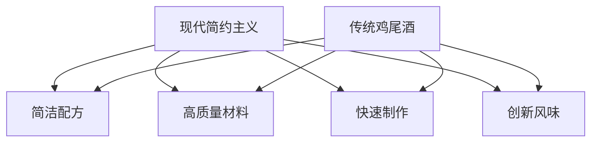
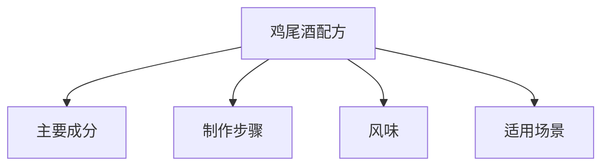
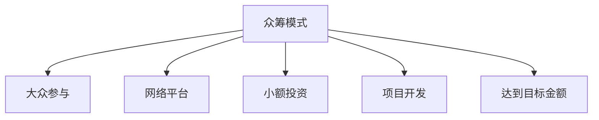
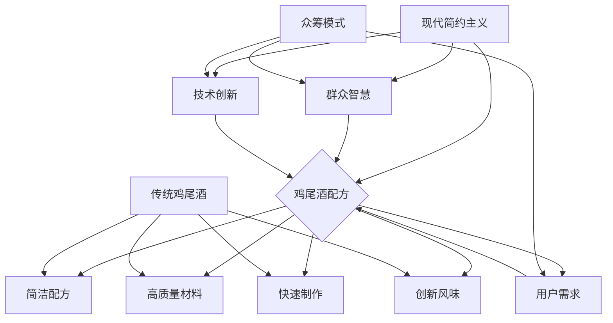

                 

### 引言

在现代快节奏的生活中，人们越来越追求简约与高效。这种趋势不仅在日常生活中体现，也在餐饮行业，特别是鸡尾酒文化中得到了广泛应用。现代简约主义鸡尾酒以其简洁的配方、精致的口感和快速的制作流程，逐渐成为消费者青睐的对象。而众筹作为一种创新融资模式，也逐渐在餐饮业崭露头角。将两者结合，我们可以设想一个创新调酒的群众智慧平台，通过众筹模式，汇集大众智慧，共同创造现代简约主义鸡尾酒的新品类。

本文将围绕这个主题展开，首先介绍现代鸡尾酒文化的发展背景，探讨群众智慧在餐饮业的应用，以及现代简约主义的概念。接着，我们将具体描述问题的核心要素，分析现代简约主义鸡尾酒配方的需求，并讨论众筹模式在鸡尾酒制作中的优势。随后，文章将深入探讨群众智慧平台的设计原则、架构与功能模块，以及用户参与机制。在边界与外延部分，我们将讨论平台的适用范围和法律法规考虑。接下来，通过核心概念与联系的分析，我们将绘制Mermaid实体关系图，以帮助读者更好地理解。随后，文章将详细讲解平台运行原理，并通过案例分析，总结成功与失败的启示。最后，我们将展望平台的未来发展方向，探讨技术创新与挑战。

通过这篇文章，我们希望读者能够对现代简约主义鸡尾酒配方众筹平台有一个全面、深入的理解，并认识到这种模式在餐饮行业中的巨大潜力。

---

### 第一部分：背景介绍

#### 第1章：问题背景

**1.1.1 现代鸡尾酒文化的发展**

鸡尾酒作为一种兼具艺术与品味的饮品，自其诞生以来，便以其丰富的品种和独特的风味赢得了广泛的喜爱。从19世纪末期的美国诞生，鸡尾酒逐渐传播到世界各地，成为社交场合的重要饮品。随着时间的推移，鸡尾酒文化也在不断演变和进化，形成了各种流派和风格。

现代鸡尾酒文化的发展，离不开几个关键因素。首先，是酒吧和餐饮业的繁荣。随着城市化进程的加速，酒吧和餐饮业迅速发展，为鸡尾酒提供了广阔的市场空间。其次，是消费者需求的多样化。现代消费者追求个性化、品质化和快节奏的生活方式，这促使调酒师不断创新，推出更多样化的鸡尾酒品种。再者，是信息技术的进步。互联网和社交媒体的普及，使得鸡尾酒文化得以快速传播，各种创意配方和调酒技巧得以共享。

在这个背景下，现代鸡尾酒文化呈现出以下几个特点：

1. **品种多样化**：现代鸡尾酒品种繁多，从经典的马天尼、曼哈顿，到创新的龙舌兰日出、恶魔之眼，每一种鸡尾酒都有其独特的风味和故事。
2. **个性化定制**：许多酒吧提供个性化鸡尾酒定制服务，消费者可以根据自己的口味和喜好，选择不同的基酒、调味剂和装饰物，打造独一无二的饮品。
3. **艺术化呈现**：调酒师不仅仅是调配鸡尾酒，更是艺术家。他们通过精美的鸡尾酒装饰和独特的调制技巧，将鸡尾酒打造成一件件艺术品，为消费者带来视觉和味觉的双重享受。
4. **文化交融**：随着全球化的进程，不同国家和地区的鸡尾酒文化相互交融，形成了新的鸡尾酒风格，如亚洲风味鸡尾酒、非洲风味鸡尾酒等。

**1.1.2 群众智慧在餐饮业的应用**

群众智慧，又称集体智慧，指的是通过广泛收集和整合大众的意见、知识和创意，来解决复杂问题或创造创新方案的能力。在餐饮业，群众智慧的应用已经得到了广泛的探索和实践。

首先，在菜单设计方面，许多餐厅会通过线上问卷调查、用户评论和社交媒体互动等方式，收集消费者的意见和喜好，从而设计出更符合市场需求的菜单。这种方式不仅能够提高菜单的受欢迎程度，还能增强顾客的参与感和满意度。

其次，在食材选择和供应链管理方面，许多餐厅也开始利用群众智慧。例如，一些餐厅会通过众筹平台，邀请大众参与食材的采购和选择，从而确保食材的新鲜度和质量。此外，一些餐厅还会邀请顾客参与后厨的监控和管理，提高食材的使用效率和餐厅的整体运营效率。

再者，在烹饪技巧和创新方面，群众智慧也得到了广泛应用。许多厨师会通过社交媒体和博客，分享自己的烹饪经验和创新思路，从而激发更多的创意和灵感。此外，一些餐厅还会举办烹饪比赛和交流活动，邀请厨师和消费者共同参与，共同探索新的烹饪方法和口味组合。

**1.1.3 现代简约主义的概念**

现代简约主义，是一种追求简单、实用和高效的设计理念，旨在通过减少不必要的元素，突出产品的核心功能和美学价值。在餐饮业，现代简约主义体现在鸡尾酒的配方设计、酒吧的装修风格和消费者的消费习惯等方面。

在鸡尾酒配方设计方面，现代简约主义强调简洁的配方和精致的口感。调酒师通过选择高质量的基酒和调味剂，以及精确的调制技巧，创造出风味独特、口感丰富的鸡尾酒。这种简约的配方设计不仅能够提高鸡尾酒的品质，还能降低制作成本和时间，提高生产效率。

在酒吧装修风格方面，现代简约主义追求简洁、明快和时尚。酒吧的装修设计注重空间利用和光线效果，通过简约的线条和材质，营造出舒适、轻松的社交氛围。这种装修风格不仅能够提高酒吧的吸引力和竞争力，还能提升顾客的消费体验。

在消费者消费习惯方面，现代简约主义也发挥了重要作用。随着消费者对生活品质的追求，越来越多的人开始关注健康、环保和可持续的生活方式。现代简约主义的鸡尾酒和酒吧风格，正是满足了这种消费需求，成为了消费者青睐的对象。

总的来说，现代简约主义鸡尾酒配方众筹平台，不仅是对现代鸡尾酒文化和群众智慧的应用和创新，更是对消费者需求的深刻理解和满足。通过这种模式，我们可以期待一个更加多样化、个性化和高效化的鸡尾酒市场，为消费者带来全新的饮酒体验。

---

### 第2章：问题描述

#### 2.1.1 问题的核心要素

在现代鸡尾酒文化和群众智慧广泛应用的大背景下，现代简约主义鸡尾酒配方众筹平台应运而生。这个平台旨在通过众筹模式，汇聚大众智慧，共同创造现代简约主义鸡尾酒的新品类。问题的核心要素主要包括以下几个方面：

1. **现代简约主义鸡尾酒的配方**：这是平台的核心内容，通过众筹方式收集和筛选出简洁、高效、优质的鸡尾酒配方，满足消费者的需求。
2. **众筹模式**：作为问题解决的主要手段，众筹模式能够有效地调动大众参与，为平台提供资金和创意支持。
3. **群众智慧**：平台通过众筹方式，汇聚了大量用户的创意和意见，这些群众智慧将成为平台创新和发展的关键。
4. **用户参与**：用户不仅是配方的提供者，也是平台的参与者和评判者，他们的反馈和参与将直接影响平台的发展和运营。

#### 2.1.2 现代简约主义鸡尾酒配方的需求

现代简约主义鸡尾酒配方的需求源于多个方面：

1. **消费者需求**：现代消费者追求简单、高效的生活方式，他们希望鸡尾酒不仅具有独特的风味，而且制作过程简洁、方便。现代简约主义鸡尾酒正满足了这种需求。
2. **调酒师创新**：调酒师在追求创新的过程中，越来越倾向于使用简洁的配方和高质量的基酒，以提升鸡尾酒的品质和口感。
3. **市场趋势**：随着餐饮市场的不断变化，消费者对于鸡尾酒的需求也日益多样化。现代简约主义鸡尾酒以其独特的风格和优势，逐渐成为市场的新宠。

具体来说，现代简约主义鸡尾酒配方的需求体现在以下几个方面：

1. **简洁性**：配方应尽量简洁，减少不必要的成分和步骤，使制作过程更加高效。
2. **高质量**：使用高质量的基酒和调味剂，确保鸡尾酒的风味和口感达到最佳。
3. **多样化**：尽管配方简洁，但应具有足够的多样性，以满足不同消费者的口味和需求。
4. **创新性**：鼓励调酒师和创新者尝试新的配方和组合，为市场带来新的惊喜。

#### 2.1.3 众筹模式在鸡尾酒制作中的优势

众筹模式在鸡尾酒制作中的优势主要体现在以下几个方面：

1. **资金支持**：通过众筹，平台可以迅速获得大量的资金支持，用于开发新配方、扩大生产规模和提升品牌影响力。
2. **创意汇聚**：众筹模式能够吸引大量的创意和意见，为平台提供丰富的创意资源，促进创新和发展。
3. **用户参与**：众筹模式鼓励用户参与，用户不仅是配方的提供者，也是平台的支持者和评判者，他们的参与将直接影响平台的发展和运营。
4. **市场验证**：通过众筹，平台可以在产品上市前进行市场验证，了解消费者的真实需求和反馈，降低市场风险。

具体优势如下：

1. **快速融资**：众筹平台如Kickstarter、Indiegogo等，提供了快速融资的渠道，使创业者能够迅速获得资金支持。
2. **广泛传播**：众筹活动通常伴随着大量的宣传和推广，能够快速提升品牌知名度和市场影响力。
3. **市场反馈**：众筹模式可以收集用户反馈，帮助企业了解市场需求，调整产品策略。
4. **风险共担**：众筹参与者通常以小额资金参与，降低了创业者的资金压力和风险。

总的来说，现代简约主义鸡尾酒配方众筹平台通过众筹模式，不仅可以满足消费者对鸡尾酒的需求，还能促进调酒师的创新和发展，为整个餐饮行业带来新的活力和机遇。

---

### 第3章：问题解决

在现代简约主义鸡尾酒配方众筹平台的设计过程中，我们需要深入思考并解决一系列关键问题，以确保平台能够有效运作，激发群众的智慧和创造力。以下是针对这些问题的解决方案：

#### 3.1.1 群众智慧平台的设计原则

设计一个成功的群众智慧平台，需要遵循以下设计原则：

1. **用户友好性**：平台的界面和交互设计应简洁易用，确保不同技能水平的用户都能快速上手。
2. **安全性**：保护用户数据和隐私至关重要，平台必须采取严格的安全措施，防止数据泄露和滥用。
3. **互动性**：鼓励用户之间的互动，通过评论、点赞、分享等功能，提高平台的活跃度和参与度。
4. **可持续性**：平台应具备长期运营的能力，能够持续吸引和留住用户。

#### 3.1.2 平台架构与功能模块

平台的架构与功能模块是确保其有效运作的核心。以下是平台的主要功能模块：

1. **用户注册与登录**：新用户可以通过邮箱或社交媒体账号注册，并登录平台参与各种活动。
2. **配方上传与展示**：用户可以上传自己的鸡尾酒配方，包括配方图片、材料清单和制作步骤等，并在平台上展示。
3. **社区互动**：用户可以在社区中评论、点赞和分享配方，与其他用户交流心得和技巧。
4. **数据分析**：后台系统会收集用户行为数据，用于分析流行配方、用户偏好等，为平台运营提供支持。
5. **奖励机制**：根据用户贡献的质量和数量，平台可以设置积分奖励，鼓励用户积极参与。

#### 3.1.3 用户参与机制

用户参与是平台成功的关键，以下机制有助于激励用户积极参与：

1. **意见反馈**：用户可以通过反馈机制提出意见和建议，帮助平台不断改进。
2. **投票机制**：对于热门配方，可以设置用户投票功能，决定哪些配方能够进入精选推荐。
3. **专家评审**：邀请调酒师和行业专家对优质配方进行评审，提升平台的专业性。
4. **用户教育**：平台可以提供鸡尾酒制作教程和相关知识，帮助用户提升调酒技能。

#### 3.1.4 平台运行原理

平台的核心运行原理是“群众智慧+技术创新”。以下是平台运行的具体步骤：

1. **配方上传**：用户上传自己的鸡尾酒配方，包括配方图片、材料清单和制作步骤等。
2. **配方审核**：后台系统对上传的配方进行初步审核，确保其符合平台标准。
3. **用户投票**：用户对上传的配方进行投票，决定哪些配方能够进入精选推荐。
4. **专家评审**：邀请调酒师和行业专家对优质配方进行评审，提升配方质量。
5. **数据收集**：后台系统收集用户行为数据，用于分析流行配方、用户偏好等。
6. **奖励发放**：根据用户的贡献和投票结果，平台发放积分奖励，激励用户参与。

#### 3.1.5 平台优势分析

现代简约主义鸡尾酒配方众筹平台具有以下优势：

1. **创新性**：通过众筹模式，平台能够汇集大量的创新配方和创意，推动鸡尾酒文化的创新和发展。
2. **高效性**：平台提供简洁易用的界面和快速审核流程，使用户能够高效地参与和互动。
3. **专业性**：通过专家评审和用户投票，平台能够筛选出高质量的配方，确保用户获得优质的体验。
4. **可持续发展**：平台通过奖励机制和用户教育，激励用户持续参与，保持平台的活力和竞争力。

#### 3.1.6 平台未来发展方向

未来，平台将致力于以下方向的发展：

1. **扩展功能**：增加更多功能模块，如配方评分、用户点评、食谱分享等，提高用户互动体验。
2. **国际化**：将平台推广到全球市场，吸引更多国家和地区的用户参与。
3. **技术创新**：引入人工智能和数据挖掘技术，提升平台的数据分析和推荐能力。
4. **品牌合作**：与知名酒吧和品牌合作，共同推广现代简约主义鸡尾酒，提升平台影响力。

通过以上解决方案，现代简约主义鸡尾酒配方众筹平台将能够充分发挥群众智慧的优势，为消费者带来全新的饮酒体验，为餐饮行业注入新的活力。

---

### 第4章：边界与外延

在现代简约主义鸡尾酒配方众筹平台的运作过程中，我们需要明确平台的适用范围、简约主义鸡尾酒的特点，以及众筹模式在法律法规方面的考量。这不仅有助于平台的有效运作，也有助于保障用户和平台的长远利益。

#### 4.1.1 平台的适用范围

现代简约主义鸡尾酒配方众筹平台主要适用于以下场景：

1. **个人调酒师和爱好者**：平台为个人调酒师和爱好者提供了一个展示和分享创意配方的平台，他们可以上传自己的配方，获得反馈和认可。
2. **酒吧和餐饮企业**：平台为酒吧和餐饮企业提供了丰富的配方资源，他们可以根据市场需求和用户反馈，选择和优化鸡尾酒菜单，提高顾客满意度。
3. **饮品品牌**：饮品品牌可以利用平台进行市场调研和产品推广，通过众筹模式获取资金支持，同时吸引消费者参与，提高品牌影响力。

平台的适用范围不仅限于鸡尾酒制作，还可以扩展到其他餐饮品类，如咖啡、茶饮等，通过类似的方式，激发群众的智慧和创造力。

#### 4.1.2 简约主义鸡尾酒的特点

简约主义鸡尾酒的特点主要体现在以下几个方面：

1. **简洁的配方**：简约主义鸡尾酒的配方通常由2-3种主要成分组成，减少不必要的调味剂和步骤，使制作过程更加简单高效。
2. **优质的材料**：尽管配方简洁，但强调使用高质量的基酒和调味剂，确保鸡尾酒的风味和口感达到最佳。
3. **创新的口感**：简约主义鸡尾酒不仅追求简洁，还注重创新，通过独特的配方和组合，为消费者带来全新的味觉体验。
4. **快速的制作**：简约主义鸡尾酒的制作过程通常较短，适合快节奏的餐饮环境和消费需求。

#### 4.1.3 众筹模式的法律法规考量

众筹模式作为一种新兴的融资方式，在法律法规方面需要特别注意以下几点：

1. **合规性**：平台必须遵循当地的法律法规，确保众筹活动的合规性。例如，在美国，平台必须注册为证券经纪人，并遵守《证券法》等相关法规。
2. **透明度**：平台需要确保众筹过程的透明度，包括资金使用情况、用户隐私保护、项目进展报告等，以增强用户信任。
3. **风险披露**：平台必须向用户提供充分的风险披露，确保用户了解众筹项目的风险和潜在损失。
4. **投资者保护**：平台应采取有效的措施，保护投资者的合法权益，防止欺诈和不当行为。

具体措施包括：

1. **法律顾问**：聘请专业的法律顾问，确保平台运作符合相关法律法规。
2. **用户协议**：制定详细的用户协议，明确用户权益和责任，确保双方权益得到保障。
3. **信息披露**：定期发布项目进展报告和财务报告，确保用户了解项目的实际情况。
4. **风险提示**：在项目页面和用户协议中明确提示众筹风险，确保用户在参与前充分了解风险。

通过明确平台的适用范围、简约主义鸡尾酒的特点，以及众筹模式的法律法规考量，我们可以更好地规范平台的运作，保护用户的利益，推动现代简约主义鸡尾酒配方众筹平台的健康发展。

---

### 第5章：核心概念与联系

在现代简约主义鸡尾酒配方众筹平台的构建过程中，理解核心概念之间的联系至关重要。以下是本文所涉及的核心概念及其相互关系，我们将通过Mermaid实体关系图和概念属性特征对比表格，帮助读者更清晰地理解这些概念。

#### 5.1.1 现代简约主义

**概念属性特征对比表格：**

| 特征 | 现代简约主义 | 传统鸡尾酒 |
| ---- | ------------ | ---------- |
| 配方简洁性 | 强调简洁的配方 | 复杂的配方，多种成分 |
| 材料质量 | 高质量材料 | 普遍材料 |
| 制作时间 | 快速制作 | 长时间制作 |
| 风味 | 独特创新风味 | 传统的风味 |
| 设计理念 | 简约、实用 | 艺术性、装饰性 |

**Mermaid实体关系图：**

#### 5.1.2 鸡尾酒配方

**概念属性特征对比表格：**

| 特征 | 鸡尾酒配方 |
| ---- | ---------- |
| 成分 | 2-3种主要成分 |
| 制作步骤 | 简单、高效 |
| 风味 | 独特、创新 |
| 适用场景 | 餐饮、社交、娱乐 |

**Mermaid实体关系图：**

#### 5.1.3 众筹模式

**概念属性特征对比表格：**

| 特征 | 众筹模式 |
| ---- | -------- |
| 融资方式 | 大众参与 |
| 项目发布 | 网络平台 |
| 风险共担 | 小额投资 |
| 资金用途 | 项目开发 |
| 成功标准 | 达到目标金额 |

**Mermaid实体关系图：**

#### 5.1.4 Mermaid实体关系图

为了更直观地展示各概念之间的联系，我们使用Mermaid绘制了以下实体关系图：

通过以上核心概念与联系的分析和Mermaid实体关系图的绘制，我们可以更清晰地理解现代简约主义鸡尾酒配方众筹平台的设计思路和运作机制，为后续章节的深入探讨打下坚实基础。

---

### 第6章：平台运行原理

在现代简约主义鸡尾酒配方众筹平台的构建过程中，平台运行原理是其核心，它决定了平台能否有效地汇聚群众智慧，为用户提供优质的服务。本章节将详细阐述配方上传与审核流程、互动社区功能以及数据分析与反馈机制，通过这些核心环节，解释平台的运行原理。

#### 6.1.1 配方上传与审核流程

**配方上传流程：**

1. **用户注册与登录**：用户在平台注册并登录，通过个人账号进行操作。
2. **上传配方**：用户点击“上传配方”按钮，进入配方上传页面。在页面上，用户需填写配方名称、主要成分、制作步骤、所需工具等信息，并上传相关图片和视频。
3. **初步审核**：平台系统对上传的配方进行初步审核，检查配方是否完整、图片是否清晰、步骤是否合理等。初步审核通过后，配方将进入社区展示。
4. **用户投票**：社区中的其他用户可以对上传的配方进行投票，投票结果将影响配方在平台上的展示位置和推荐度。

**审核流程：**

1. **人工审核**：在初步审核的基础上，平台管理员会进行人工审核，确保配方符合平台标准。审核内容包括配方创意性、制作难度、安全性等。
2. **专家评审**：对于具有较高创意性和创新性的配方，平台会邀请行业专家进行评审，进一步提升配方的质量和认可度。

#### 6.1.2 互动社区功能

互动社区是平台的核心功能之一，它不仅为用户提供了一个分享和交流的场所，还能激发更多创意和灵感。以下是互动社区的主要功能：

1. **评论与点赞**：用户可以对上传的配方进行评论和点赞，表达自己的看法和喜好。评论和点赞数量将影响配方在平台上的展示位置和推荐度。
2. **分享与传播**：用户可以将喜欢的配方分享到社交媒体，吸引更多人参与讨论和投票。
3. **食谱分享**：用户可以分享自己的食谱和经验，与其他用户交流调酒技巧和心得。
4. **社区管理**：平台设有社区管理员，负责维护社区秩序，处理不当言论和违规行为，确保社区的健康发展。

#### 6.1.3 数据分析与反馈机制

数据分析与反馈机制是平台优化运营的重要手段。以下是平台的数据分析方法和反馈机制：

1. **用户行为数据收集**：平台会记录用户浏览、点赞、评论等行为数据，用于分析用户偏好、热门配方等。
2. **数据分析**：通过数据挖掘和机器学习技术，平台可以对用户行为数据进行分析，识别出用户需求和趋势。
3. **反馈机制**：平台会根据分析结果，对用户反馈进行及时处理和优化。例如，调整推荐算法、优化用户界面、改进审核流程等。
4. **用户反馈**：用户可以通过反馈机制，提出对平台运营的建议和意见，平台将根据用户反馈进行改进。

#### 6.1.4 平台运行原理小结

现代简约主义鸡尾酒配方众筹平台的运行原理可以概括为以下几点：

1. **用户参与**：用户通过上传、投票、评论等方式参与平台互动，共同推动平台的发展。
2. **数据分析**：平台通过数据分析，了解用户需求和趋势，优化运营策略。
3. **专家评审**：邀请行业专家参与评审，确保配方的质量和专业性。
4. **互动社区**：通过互动社区，用户可以交流心得、分享经验，激发更多创意。
5. **持续改进**：平台根据用户反馈和分析结果，不断优化和改进，提升用户体验。

通过以上运行原理，现代简约主义鸡尾酒配方众筹平台不仅能够有效地汇聚群众智慧，还能为用户提供优质的服务和创新的体验，推动鸡尾酒文化的不断发展。

---

### 第7章：案例分析

在现代简约主义鸡尾酒配方众筹平台的实际运行过程中，既有成功的案例，也有失败的教训。通过分析这些案例，我们可以总结出成功与失败的启示，为平台的进一步发展提供参考。

#### 7.1.1 成功案例介绍

**案例1：简易薄荷玛格丽特**

在Kickstarter平台上，一款名为“简易薄荷玛格丽特”的鸡尾酒配方众筹项目获得了巨大的成功。该配方由一位个人调酒师上传，仅需三种主要成分：龙舌兰酒、柠檬汁和糖浆。配方简洁易做，却以其清新口感和独特风味吸引了大量用户。项目在短短一个月内就筹集到了超过10万美元，远远超出了预期的目标金额。

**成功原因分析：**

1. **简洁配方**：简易薄荷玛格丽特的配方简单易懂，无需复杂的工具和技巧，易于用户上手。
2. **独特风味**：薄荷的清新口感和龙舌兰酒的醇厚味道完美结合，为用户带来了全新的味觉体验。
3. **高质量材料**：配方强调使用高质量的基酒和调味剂，确保了鸡尾酒的品质。
4. **用户互动**：项目吸引了大量用户参与评论、点赞和分享，增强了社区的活跃度和参与感。

**案例2：都市丛林**

另一个成功的案例是名为“都市丛林”的鸡尾酒配方众筹项目。该项目由一家小型酒吧推出，通过众筹方式筹集资金，用于制作一系列以城市景观为主题的鸡尾酒。该项目不仅成功筹集到了目标资金，还吸引了众多媒体和消费者的关注。

**成功原因分析：**

1. **创新主题**：都市丛林以城市景观为灵感，创造出一系列独特的鸡尾酒，为消费者带来了全新的主题体验。
2. **专业团队**：酒吧拥有专业的调酒师团队，确保了配方的质量和制作工艺。
3. **市场调研**：项目在众筹前进行了充分的市场调研，确保了配方能够满足目标消费者的需求。
4. **品牌合作**：项目得到了知名饮品品牌的支持，通过品牌合作提高了项目的知名度和影响力。

#### 7.1.2 失败案例剖析

**案例1：香草星空**

在一个失败的案例中，一款名为“香草星空”的鸡尾酒配方众筹项目未能达到预期目标。该项目试图通过复杂的配方和高端材料吸引消费者，但最终未能获得足够的支持。

**失败原因分析：**

1. **配方复杂**：“香草星空”的配方包含多种罕见的材料，制作过程繁琐，对用户来说难以实现。
2. **高成本**：由于使用了高端材料和复杂的制作工艺，该配方成本较高，消费者难以接受。
3. **市场定位不准确**：项目未能准确把握目标市场的需求，导致项目缺乏吸引力。
4. **缺乏宣传**：项目在众筹期间缺乏有效的宣传和推广，导致参与度低。

**案例2：午夜玫瑰**

另一个失败的案例是“午夜玫瑰”鸡尾酒配方众筹项目。该项目试图通过独特的制作工艺和精美的视觉效果吸引消费者，但最终未能获得足够的支持。

**失败原因分析：**

1. **视觉效果不足**：“午夜玫瑰”的视觉效果未能达到预期，未能吸引足够的用户关注。
2. **制作难度大**：该配方制作难度较高，对调酒师的技术要求较高，限制了用户的参与。
3. **用户体验差**：配方在用户体验方面存在一定问题，如口感不平衡、材料浪费等，影响了用户的满意度。
4. **用户反馈机制不足**：项目在众筹期间缺乏有效的用户反馈机制，未能及时解决用户问题，导致用户流失。

#### 7.1.3 案例启示与总结

通过对成功与失败案例的分析，我们可以得出以下启示和总结：

1. **简洁配方**：简洁的配方更容易被用户接受，特别是对于初学者来说，简单的步骤和材料更能激发他们的兴趣。
2. **高质量材料**：使用高质量的基酒和调味剂，可以提升鸡尾酒的品质，增加用户的满意度。
3. **创新主题**：独特的主题和创意可以吸引更多用户的关注，提高项目的吸引力。
4. **市场调研**：在众筹前进行充分的市场调研，了解目标市场的需求和偏好，是项目成功的关键。
5. **用户互动**：鼓励用户参与互动，如评论、点赞和分享，可以提高社区的活跃度和参与感。
6. **有效宣传**：有效的宣传和推广可以提升项目的知名度和影响力，吸引更多用户参与。
7. **用户体验**：确保配方在用户体验方面达到预期，如口感、视觉效果等，是项目成功的重要保障。
8. **及时反馈**：建立有效的用户反馈机制，及时解决用户问题，可以提高用户的满意度，促进项目的持续发展。

通过以上案例的分析和总结，现代简约主义鸡尾酒配方众筹平台可以更好地优化其运营策略，提高项目成功率，为用户提供优质的服务和体验。

---

### 第8章：未来展望

在现代简约主义鸡尾酒配方众筹平台的不断发展中，我们不仅要总结过去成功的经验和失败的教训，更要展望未来，探索平台的发展潜力、行业趋势以及技术创新与挑战。

#### 8.1.1 平台发展潜力

现代简约主义鸡尾酒配方众筹平台具有巨大的发展潜力。首先，随着消费者对鸡尾酒品质和个性化需求的不断提升，平台可以吸引更多的用户参与。其次，平台通过众筹模式，不仅可以为用户带来创新的鸡尾酒配方，还可以为调酒师和餐饮企业提供市场调研和资金支持。此外，随着大数据和人工智能技术的发展，平台可以更加精准地分析用户需求，提供个性化的推荐和服务，进一步提升用户满意度。

#### 8.1.2 行业趋势分析

餐饮行业的趋势正在发生变化，现代简约主义鸡尾酒配方众筹平台正是顺应了这种变化。以下是几个重要的行业趋势：

1. **个性化定制**：消费者越来越追求个性化的餐饮体验，现代简约主义鸡尾酒配方众筹平台可以通过用户数据，实现个性化定制，满足消费者的个性化需求。
2. **健康饮食**：健康饮食理念正在逐渐深入人心，平台可以通过推广低糖、低酒精度等健康鸡尾酒配方，迎合消费者的健康需求。
3. **科技融合**：随着人工智能、大数据和物联网技术的发展，餐饮行业正在向智能化、数字化方向迈进。平台可以通过引入这些新技术，提升用户体验和运营效率。
4. **跨界合作**：餐饮行业正在与其他行业进行跨界合作，如与文化、艺术、科技等领域的结合。平台可以通过跨界合作，提升品牌影响力和市场竞争力。

#### 8.1.3 技术创新与挑战

在未来的发展中，技术创新将是现代简约主义鸡尾酒配方众筹平台面临的重要挑战和机遇。以下是几个关键的技术创新领域：

1. **大数据分析**：通过大数据分析，平台可以深入了解用户行为和需求，实现精准营销和个性化推荐。然而，这也对数据隐私和安全提出了更高的要求。
2. **人工智能**：人工智能技术可以用于配方优化、口味预测和推荐系统。例如，通过机器学习算法，平台可以分析用户评价，预测哪些配方会受欢迎，从而提高项目成功率。
3. **区块链技术**：区块链技术可以用于确保众筹过程的透明性和安全性，保护用户数据和资金安全。然而，区块链技术的应用也面临着技术复杂性和成本高昂的挑战。
4. **物联网**：物联网技术可以用于智能厨房设备，实现自动化鸡尾酒制作，提高生产效率。然而，物联网设备的部署和维护也需要大量资金和技术支持。

总之，现代简约主义鸡尾酒配方众筹平台在未来的发展中，需要不断创新技术，提升用户体验，同时应对各种挑战，以实现可持续的发展。

---

### 结论

通过本文的深入探讨，我们全面了解了现代简约主义鸡尾酒配方众筹平台的背景、问题、解决方案、边界与外延、核心概念与联系、运行原理以及未来展望。这个平台不仅是对现代鸡尾酒文化和群众智慧的应用和创新，更是对消费者需求的深刻理解和满足。它通过众筹模式，有效地汇聚了群众的智慧和创意，推动了鸡尾酒文化的创新与发展。

平台的成功运营离不开以下几个关键因素：简洁易用的用户界面、严格的安全措施、多样化的用户参与机制、有效的数据分析与反馈机制，以及持续的技术创新。同时，平台也需要不断优化和改进，以应对市场变化和技术挑战，保持其竞争力和吸引力。

我们希望本文能够为读者提供有价值的见解，激发更多对现代简约主义鸡尾酒配方众筹平台的思考和研究。未来，随着技术的不断进步和消费者需求的变化，这个平台有望成为餐饮行业的一个重要创新力量，为消费者带来全新的饮酒体验。

### 作者信息

作者：AI天才研究院/AI Genius Institute & 禅与计算机程序设计艺术 /Zen And The Art of Computer Programming

---

### 附录：拓展阅读

1. **《现代鸡尾酒文化与创新》**：该书籍详细介绍了现代鸡尾酒文化的发展历程、创新趋势以及市场前景，对鸡尾酒行业的从业者具有很高的参考价值。
2. **《众筹：从概念到实践》**：这本书深入探讨了众筹模式的理论和实践，提供了丰富的案例分析，对于想要了解众筹模式的人士具有指导意义。
3. **《大数据与人工智能：商业应用与挑战》**：本书系统地介绍了大数据和人工智能的基本概念、应用场景以及面临的挑战，是了解这两项技术的重要参考书籍。
4. **《区块链技术简明教程》**：这本书以简洁明了的语言介绍了区块链技术的基本原理、应用场景以及技术发展趋势，适合对区块链技术感兴趣的读者。
5. **《物联网技术与应用》**：本书全面介绍了物联网技术的基本原理、技术架构和应用场景，是了解物联网技术的重要参考资料。

