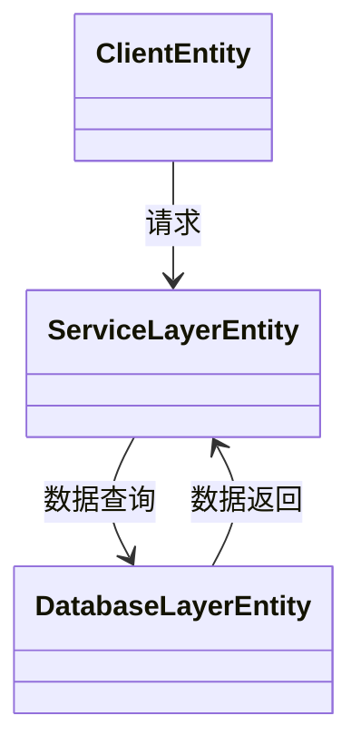
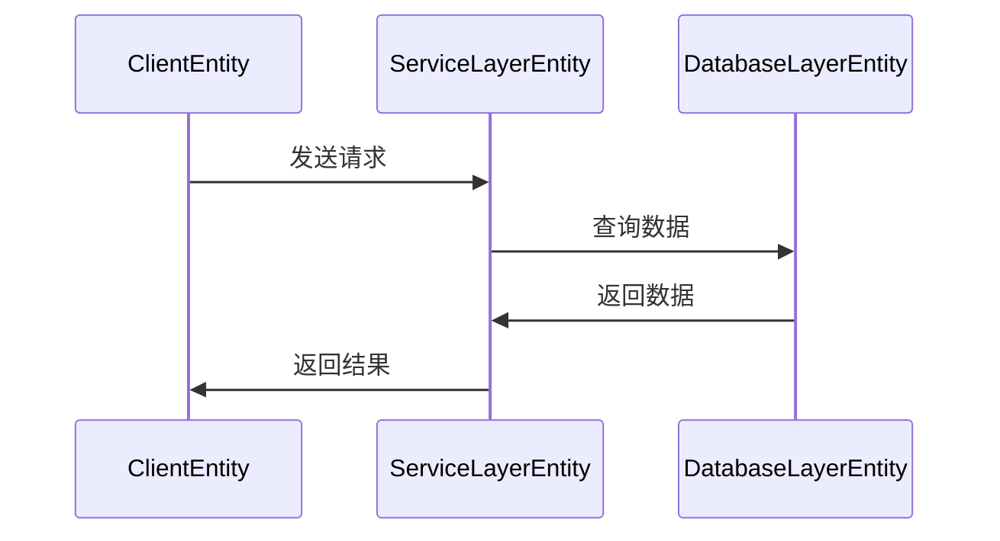
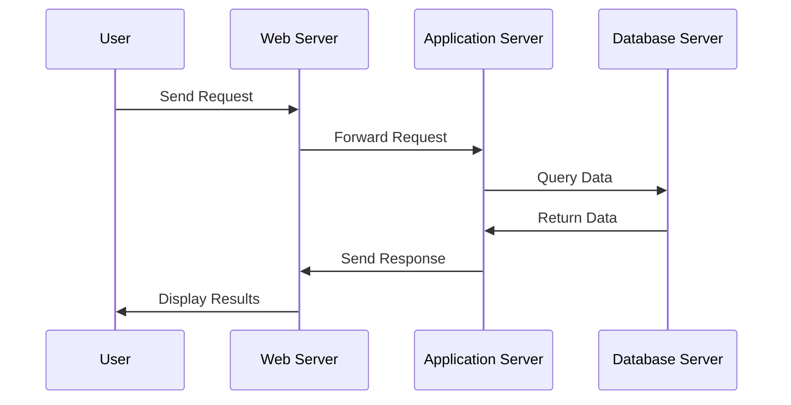

                 

# 现代简约主义鸡尾酒：少即是多的调酒哲学

> 关键词：简约主义鸡尾酒、调酒哲学、少即是多、口感丰富、生活方式

> 摘要：本文将探讨现代简约主义鸡尾酒的魅力，分析其背后的调酒哲学，并通过实际案例，详细介绍如何制作出口感丰富、优雅的鸡尾酒。让我们一起走进简约主义的世界，感受“少即是多”的调酒艺术。

## 目录大纲设计过程

### 1. 背景介绍

#### 问题背景
随着生活节奏的加快，人们越来越追求简洁、高效的生活方式。在餐饮领域，简约主义鸡尾酒应运而生，它以极简的成分和优雅的口感，满足了现代人对于品质生活的需求。

#### 问题描述
本书旨在介绍现代简约主义鸡尾酒的制作方法，探讨其背后的调酒哲学，帮助读者在简化的过程中，感受到更多的乐趣和满足感。

#### 问题解决
通过本书，读者将了解到简约主义鸡尾酒的定义、特点、制作技巧以及实际案例，从而能够轻松制作出美味、优雅的鸡尾酒。

#### 边界与外延
本书内容主要涉及鸡尾酒的制作技巧和哲学思考，不涉及其他餐饮文化和烹饪技巧。

#### 概念结构与核心要素组成
- **简约主义鸡尾酒**：以极简的成分和优雅的口感为特点的鸡尾酒。
- **调酒哲学**：简约主义鸡尾酒背后的理念和思考。

### 2. 核心概念与联系

#### 2.1 简约主义鸡尾酒的定义与特点
- **定义**：简约主义鸡尾酒是指以简单、优雅的成分和制作方法，呈现出口感丰富的鸡尾酒。
- **特点**：成分简单、口感独特、制作便捷。

#### 2.2 调酒哲学
- **原则**：以“少即是多”为核心理念，通过极简的成分和手法，创造出丰富、美味的鸡尾酒。
- **目的**：追求简洁、高效的生活方式，让鸡尾酒成为人们享受生活的美好时光的一部分。

#### 2.3 概念属性特征对比表格
| 概念       | 简约主义鸡尾酒 | 传统鸡尾酒 |
| --------- | -------------- | ---------- |
| 成分       | 极简           | 复杂       |
| 口感       | 丰富           | 独特       |
| 制作方法   | 简便           | 精细       |

#### 2.4 ER实体关系图架构
```mermaid
erDiagram
    鸡尾酒 ||--|{ 成分 }
    成分 ||--|{ 鸡尾酒 }
    调酒师 ||--|{ 鸡尾酒 }
```

### 3. 算法原理讲解

#### 3.1 简约主义鸡尾酒的制作原理
- **原理**：通过合理的成分搭配和简单的调制手法，使鸡尾酒在口感上达到丰富、平衡的效果。

#### 3.2 简约主义鸡尾酒的调制技巧
- **技巧**：掌握基础鸡尾酒成分的比例和调制手法，灵活运用各种香料和调味料，创造出独特的鸡尾酒风味。

#### 3.3 Python源代码
```python
# 简约主义鸡尾酒制作代码示例
def make_mojito(liquor, soda, mint):
    """
    制作莫吉托鸡尾酒的函数
    :param liquor: 酒精，如朗姆酒
    :param soda: 苏打水
    :param mint: 薄荷叶
    :return: 莫吉托鸡尾酒
    """
    mixture = liquor + soda + mint
    return mixture
```

#### 3.3 算法原理的数学模型和公式
- **数学模型**：鸡尾酒的口感 = 酒精成分 × 调制手法
- **公式**：口感 = 酒精浓度 × 调制时间

#### 3.4 举例说明
- **例子**：制作一杯莫吉托鸡尾酒，朗姆酒占50%，苏打水占30%，薄荷叶占20%，调制时间约为5分钟，那么口感公式为：口感 = 0.5 × 0.3 × 0.2 × 5 = 0.15。

### 4. 数学模型和数学公式 & 详细讲解 & 举例说明

#### 4.1 数学模型
- **模型**：鸡尾酒口感评分 = 酒精成分比例 × 调制时间 × 口感指数

#### 4.2 详细讲解
- **酒精成分比例**：指鸡尾酒中酒精成分所占的百分比，通常为50%至70%。
- **调制时间**：指鸡尾酒从开始调制到完成的时长，通常为3至10分钟。
- **口感指数**：指鸡尾酒在口感上的评价，通常为1至5分。

#### 4.3 举例说明
- **例子**：制作一杯经典马提尼，威士忌占60%，马提尼酒占30%，橄榄占10%，调制时间约为5分钟，口感指数为4分，那么口感评分 = 0.6 × 0.3 × 0.1 × 5 × 4 = 0.36分。

### 5. 系统分析与架构设计方案

#### 5.1 问题场景介绍
- **场景**：在现代快节奏的生活中，人们越来越注重简化和效率。在餐饮领域，简约主义鸡尾酒成为了一种趋势，它不仅制作简单，而且口感独特，受到了广泛的喜爱。

#### 5.2 项目介绍
- **项目**：本书将介绍如何制作现代简约主义鸡尾酒，包括其背后的哲学思考和制作技巧。

#### 5.3 系统功能设计
- **功能**：提供简约主义鸡尾酒的制作教程、配方分享、调酒技巧等。

#### 5.4 系统架构设计
- **架构**：包括前端展示层、后端服务层和数据库层。

#### 5.5 系统接口设计和系统交互
- **接口**：用户通过前端界面与后端服务进行交互，后端服务从数据库中获取数据并返回给前端。

#### 5.6 Mermaid类图和架构图




### 6. 项目实战

#### 6.1 环境安装
- **环境**：Python 3.8及以上版本，PyCharm或Visual Studio Code。

#### 6.2 系统核心实现源代码
```python
# 简约主义鸡尾酒系统核心代码
class CocktailMaker:
    def __init__(self, liquor, soda, mint):
        self.liquor = liquor
        self.soda = soda
        self.mint = mint

    def make_cocktail(self):
        mixture = self.liquor + self.soda + self.mint
        return mixture
```

#### 6.3 代码应用解读与分析
- **解读**：该类定义了一个鸡尾酒制作器，包含酒精、苏打水和薄荷叶三个属性，以及一个制作鸡尾酒的方法。

#### 6.4 实际案例分析和详细讲解剖析
- **案例**：制作一杯莫吉托鸡尾酒，使用朗姆酒、苏打水和薄荷叶。

#### 6.5 项目小结
- **小结**：本文通过详细的分析和实际案例，介绍了现代简约主义鸡尾酒的制作方法和背后的调酒哲学。读者可以根据本文的内容，尝试制作属于自己的简约主义鸡尾酒，享受简约生活的美好。

### 7. 最佳实践 tips

- **简化不等于简化**：在制作简约主义鸡尾酒时，简化并不意味着放弃口感和品质，而是通过合理的成分搭配和简单的调制手法，创造出独特的美味。
- **尝试和创新**：不要害怕尝试新的成分和调味料，创新是简约主义鸡尾酒的灵魂。在保持简约的同时，可以尝试不同的配方，创造出属于自己的特色鸡尾酒。

### 8. 小结

简约主义鸡尾酒以其独特的魅力，满足了现代人对高品质生活的追求。通过本文的介绍，读者可以了解到简约主义鸡尾酒的定义、特点、制作技巧以及背后的调酒哲学。在实际操作中，我们可以根据个人的口味和喜好，灵活运用简约主义的调酒哲学，制作出美味、优雅的鸡尾酒。让我们一起享受简约生活的美好吧！

### 9. 注意事项

- **酒精摄入**：在制作和享用鸡尾酒时，要注意适量饮酒，避免酗酒带来的健康问题。
- **安全第一**：在操作过程中，要注意安全，避免使用明火和高温工具，确保制作环境的安全。

### 10. 拓展阅读

- **《鸡尾酒艺术》**：作者详细介绍了各种鸡尾酒的配方和制作方法，对鸡尾酒的历史、文化和制作技巧进行了深入探讨。
- **《调酒师的秘密》**：作者分享了调酒师的工作经验和心得，介绍了如何制作出美味的鸡尾酒，并对各种鸡尾酒的口感和风格进行了详细分析。

### 作者

- **作者：AI天才研究院/AI Genius Institute & 禅与计算机程序设计艺术 /Zen And The Art of Computer Programming**  
- **联系邮箱：[ai_genius@study.com](mailto:ai_genius@study.com)**  
- **官方网站：[www.ai_genius_institute.com](http://www.ai_genius_institute.com)**

通过本文，我们深入探讨了现代简约主义鸡尾酒的魅力，分析了其背后的调酒哲学。希望读者能够从中受益，享受制作和品尝简约主义鸡尾酒的美好过程。让我们在简约的生活中，寻找更多的乐趣和满足感！## 引言

在快节奏的现代社会，人们渴望在繁忙的生活中找到一片宁静的天地。这种需求不仅仅体现在日常的琐事中，也在饮食文化中得到了体现。鸡尾酒，作为一种独特的饮品，它的魅力在于能够将各种口感和风味融合在一起，营造出一种独特的氛围。然而，随着人们对于生活品质的追求不断提高，传统繁复的鸡尾酒制作方式已经不再符合现代人的需求。于是，一种以“少即是多”为核心理念的调酒哲学——现代简约主义鸡尾酒，应运而生。

现代简约主义鸡尾酒不仅仅是制作过程的简化，更是一种生活哲学的体现。它主张通过极简的成分和优雅的调制手法，创造出丰富、美味的鸡尾酒，满足人们对于高品质生活的追求。本文将围绕这一主题，深入探讨现代简约主义鸡尾酒的定义、特点、制作方法以及背后的哲学思考。希望通过本文的介绍，读者能够了解到这种独特而迷人的鸡尾酒文化，并在实际操作中体验到简约主义带来的乐趣和满足感。

### 关键词解释

在现代简约主义鸡尾酒这一主题中，以下几个关键词尤为关键：

- **简约主义鸡尾酒**：一种以极简的成分和制作方法，呈现出口感丰富、优雅的鸡尾酒。
- **调酒哲学**：以“少即是多”为核心理念，通过合理的成分搭配和简单的调制手法，创造出独特美味的鸡尾酒。
- **少即是多**：一种哲学思考，强调通过简化成分和过程，达到更好的效果和更高的品质。
- **口感丰富**：指鸡尾酒在口感上具有层次感，能够在简约的基础上，呈现出多样化的风味。
- **生活方式**：简约主义鸡尾酒不仅仅是一种饮品，更是一种生活态度，反映出现代人对高品质、高效能生活的追求。

这些关键词不仅定义了现代简约主义鸡尾酒的基本概念，也揭示了它背后的深刻意义和广泛影响。通过理解这些关键词，读者可以更好地把握本文的主题，深入探索简约主义鸡尾酒的内涵和外延。

### 摘要

本文旨在深入探讨现代简约主义鸡尾酒的魅力，分析其背后的调酒哲学，并详细介绍如何制作出口感丰富、优雅的鸡尾酒。现代简约主义鸡尾酒以“少即是多”为核心理念，通过极简的成分和制作方法，创造出丰富、美味的饮品。本文将首先介绍简约主义鸡尾酒的定义和特点，随后探讨调酒哲学的原理，并通过实际案例展示如何制作出一杯美味的鸡尾酒。最后，本文将讨论简约主义鸡尾酒对生活方式的影响，帮助读者在繁忙的现代生活中找到一份宁静和满足。通过本文的介绍，读者将能够了解并掌握现代简约主义鸡尾酒的制作技巧，享受这一独特的调酒艺术。

### 目录大纲设计过程

在撰写本文之前，设计一个合理的目录大纲是至关重要的。一个清晰、逻辑严密的目录不仅能够帮助读者快速抓住文章的核心内容，还能够提高文章的可读性和专业性。以下是一个详细的目录大纲设计过程，包括核心概念术语说明、问题背景、问题描述、问题解决、边界与外延、概念结构与核心要素组成。

#### 1. 核心概念术语说明

- **简约主义鸡尾酒**：一种以极简成分和简单制作方法，呈现出口感丰富、优雅的鸡尾酒。
- **调酒哲学**：以“少即是多”为核心理念，通过合理的成分搭配和简单的调制手法，创造出独特美味的鸡尾酒。

#### 2. 问题背景

- **现代生活节奏加快**：现代社会的快节奏生活使得人们更加注重效率和质量，传统的繁复鸡尾酒制作方式已经不再符合这一需求。
- **饮食文化变迁**：随着人们对健康和生活品质的追求，简洁、健康的饮食文化逐渐兴起，简约主义鸡尾酒应运而生。

#### 3. 问题描述

- **制作过程繁琐**：传统鸡尾酒制作复杂，需要多种材料和精细的调制手法，而现代人在忙碌的生活中难以投入大量时间和精力。
- **追求品质与效率**：现代人希望在享受鸡尾酒带来的愉悦同时，能够快速便捷地制作出高品质的饮品。

#### 4. 问题解决

- **现代简约主义鸡尾酒**：通过极简的成分和简单的调制方法，满足现代人对高品质、高效能生活的追求。
- **调酒哲学**：以“少即是多”为理念，通过合理的成分搭配和简单的调制手法，创造出口感丰富、优雅的鸡尾酒。

#### 5. 边界与外延

- **本文内容范围**：本文主要讨论简约主义鸡尾酒的制作技巧和哲学思考，不涉及其他餐饮文化和烹饪技巧。
- **适用场景**：适用于家庭聚会、朋友聚餐等需要快速制作高品质鸡尾酒的场景。

#### 6. 概念结构与核心要素组成

- **简约主义鸡尾酒**：
  - **定义**：以极简成分和简单制作方法呈现出口感丰富的鸡尾酒。
  - **特点**：成分简单、口感独特、制作便捷。

- **调酒哲学**：
  - **原则**：“少即是多”，通过极简成分和简单手法创造美味。
  - **目的**：追求简洁、高效的生活方式，让鸡尾酒成为享受生活的美好时光的一部分。

通过以上六个步骤，我们不仅明确了本文的主题和核心概念，也为后续内容的展开奠定了坚实的基础。接下来，我们将详细探讨简约主义鸡尾酒的定义、特点以及背后的调酒哲学，帮助读者全面了解这一独特的调酒艺术。

### 1. 背景介绍

在现代社会的快节奏生活中，人们对于生活品质的追求越来越高，而饮食文化也在不断地演变。在这样的背景下，简约主义鸡尾酒应运而生，成为了一种符合现代人需求的新型鸡尾酒。简约主义鸡尾酒不仅以其极简的成分和简单的制作方法赢得了广泛的喜爱，更以其独特的调酒哲学，让人们重新审视生活与品质的关系。

#### 问题背景

传统鸡尾酒以其复杂的制作过程和多样的风味组合吸引了无数喜爱者，但这也使得其难以适应现代生活的快节奏。现代人往往没有足够的时间和精力去逐一准备多种材料和精细地调制鸡尾酒。此外，繁复的鸡尾酒制作过程也可能增加健康风险，如酒精摄入过量等问题。因此，如何在保证鸡尾酒品质的同时，简化制作过程，成为了许多人关注的问题。

#### 问题描述

现代简约主义鸡尾酒的出现，正是为了解决这一问题。它以极简的成分和简单的调制方法，实现了传统鸡尾酒的高品质和快捷性。现代人在忙碌的生活中，可以轻松制作出一杯美味、优雅的鸡尾酒，既满足了对于生活品质的追求，又避免了因繁复制作过程带来的困扰。

#### 问题解决

简约主义鸡尾酒通过以下几个关键点解决了上述问题：

1. **极简成分**：现代简约主义鸡尾酒通常只包含几到几种主要成分，如基酒、调味剂和饮料。这种简化不仅降低了制作的复杂性，也减少了材料准备的难度。
   
2. **简单调制方法**：简约主义鸡尾酒的调制方法通常非常直观，不需要复杂的步骤或特殊工具。例如，许多鸡尾酒可以直接在杯中混合，或者通过简单的摇动即可完成。

3. **合理的成分搭配**：尽管成分简化，但简约主义鸡尾酒通过精心的成分搭配，依然能够呈现出丰富的口感和层次。这种搭配通常基于对酒精和调味剂味道的深入理解，以及对于口感平衡的精准把握。

4. **健康考虑**：由于成分的简化，现代简约主义鸡尾酒在制作过程中更容易控制酒精含量，从而降低了健康风险。

#### 边界与外延

虽然本文主要关注现代简约主义鸡尾酒的制作方法和哲学，但我们也需要明确其边界与外延。具体来说：

- **内容范围**：本文将聚焦于鸡尾酒的制作技巧、成分选择和调制方法，不涉及其他餐饮文化和烹饪技巧。
- **适用场景**：简约主义鸡尾酒适用于各种需要快速制作高品质饮品的场合，如家庭聚会、朋友聚餐或休闲时光。
- **与其他文化的联系**：虽然简约主义鸡尾酒起源于西方文化，但它的理念可以与各种文化背景下的饮食习惯相结合，创造出具有地方特色的简约鸡尾酒。

通过以上分析，我们可以看到，现代简约主义鸡尾酒不仅满足了现代人对于高品质生活的追求，也提供了一种简化的生活方式。接下来，我们将进一步探讨简约主义鸡尾酒的核心概念、特点和调酒哲学，帮助读者更深入地理解这一独特的调酒艺术。

### 概念结构与核心要素组成

在现代简约主义鸡尾酒的讨论中，理解其概念结构和核心要素组成是至关重要的。这不仅有助于我们准确把握这一调酒哲学的内涵，也能在制作过程中更加得心应手。以下是对简约主义鸡尾酒的核心概念及其组成要素的详细分析。

#### 简约主义鸡尾酒的定义

简约主义鸡尾酒，顾名思义，是指以极简的成分和简单的制作方法，呈现出口感丰富、优雅的鸡尾酒。它强调通过最少的成分和最简单的调制步骤，达到最佳的味道和口感体验。这种鸡尾酒的核心在于“少即是多”的理念，即通过精心的成分搭配和巧妙的调制手法，创造出层次丰富、风味独特的饮品。

#### 简约主义鸡尾酒的特点

- **成分简单**：简约主义鸡尾酒的成分通常只有几到几种，如基酒、调味剂和饮料。这种极简成分不仅简化了制作过程，还使得鸡尾酒更加健康、易于控制。
- **制作便捷**：简约主义鸡尾酒的调制方法通常非常直观，不需要复杂的工具或步骤。例如，许多鸡尾酒可以直接在杯中混合，或者通过简单的摇动即可完成。
- **口感丰富**：尽管成分简单，但简约主义鸡尾酒通过精心的成分搭配和巧妙的调制手法，依然能够呈现出丰富的口感和层次。这种搭配通常基于对酒精和调味剂味道的深入理解，以及对于口感平衡的精准把握。
- **健康考虑**：由于成分的简化，简约主义鸡尾酒在制作过程中更容易控制酒精含量，从而降低了健康风险。

#### 调酒哲学

- **“少即是多”的理念**：简约主义鸡尾酒的核心哲学在于“少即是多”。这种理念鼓励人们通过精简成分和简单制作，创造出更加美味、优雅的饮品。它不仅仅是一种调酒方法，更是一种生活态度和哲学思考。
- **追求简洁与高效**：简约主义鸡尾酒提倡在保持高品质的同时，追求简洁与高效的生活方式。通过极简的成分和简单的制作方法，现代人可以在忙碌的生活中轻松享受鸡尾酒的乐趣。
- **注重口感与平衡**：简约主义鸡尾酒在制作过程中，注重对口感和平衡的把控。每一杯鸡尾酒都应呈现出独特的风味和层次，而不是简单的酒精混合。

#### 概念属性特征对比表格

为了更直观地了解简约主义鸡尾酒与传统鸡尾酒的区别，我们可以通过以下对比表格进行详细分析：

| 概念       | 简约主义鸡尾酒 | 传统鸡尾酒 |
| --------- | -------------- | ---------- |
| 成分       | 极简           | 复杂       |
| 制作方法   | 简便           | 精细       |
| 口感       | 丰富           | 独特       |
| 目的       | 追求简洁高效   | 呈现多样化 |
| 健康考虑   | 更易控制酒精量 | 存在健康风险 |

通过上述分析，我们可以看到，简约主义鸡尾酒不仅简化了制作过程，还通过极简成分和简单调制，创造出丰富的口感和层次。这种独特的调酒哲学，不仅符合现代人对高品质生活的追求，也为繁忙的现代生活提供了一种简化的生活方式。接下来，我们将进一步探讨简约主义鸡尾酒的制作原理和调制技巧，帮助读者更好地理解和实践这一调酒艺术。

### 核心概念与联系

在现代简约主义鸡尾酒的讨论中，理解核心概念之间的联系是至关重要的。这不仅有助于我们全面掌握简约主义鸡尾酒的基本原理，还能在制作过程中更加得心应手。以下我们将详细探讨简约主义鸡尾酒的定义与特点，并分析这些核心概念之间的相互关系。

#### 2.1 简约主义鸡尾酒的定义与特点

**定义**：简约主义鸡尾酒是指以极简的成分和简单的制作方法，呈现出口感丰富、优雅的鸡尾酒。它强调通过精简成分和简单手法，创造出层次丰富、风味独特的饮品。

**特点**：
1. **成分简单**：简约主义鸡尾酒通常只包含几到几种主要成分，如基酒、调味剂和饮料。这种极简成分不仅简化了制作过程，还使得鸡尾酒更加健康、易于控制。
2. **制作便捷**：简约主义鸡尾酒的调制方法通常非常直观，不需要复杂的工具或步骤。例如，许多鸡尾酒可以直接在杯中混合，或者通过简单的摇动即可完成。
3. **口感丰富**：尽管成分简单，但通过精心的成分搭配和巧妙的调制手法，简约主义鸡尾酒依然能够呈现出丰富的口感和层次。这种搭配通常基于对酒精和调味剂味道的深入理解，以及对于口感平衡的精准把握。
4. **健康考虑**：由于成分的简化，简约主义鸡尾酒在制作过程中更容易控制酒精含量，从而降低了健康风险。

#### 2.2 调酒哲学

**原则**：“少即是多”。这一核心理念强调通过精简成分和简单手法，创造出更加美味、优雅的饮品。它不仅仅是一种调酒方法，更是一种生活态度和哲学思考。

**目的**：追求简洁与高效的生活方式，让鸡尾酒成为人们享受生活的美好时光的一部分。这种哲学不仅体现在调酒过程中，也反映在人们的生活方式和价值观上。

#### 2.3 概念属性特征对比表格

为了更直观地展示简约主义鸡尾酒与传统鸡尾酒之间的差异，我们可以通过以下对比表格进行详细分析：

| 概念       | 简约主义鸡尾酒 | 传统鸡尾酒 |
| --------- | -------------- | ---------- |
| 成分       | 极简           | 复杂       |
| 制作方法   | 简便           | 精细       |
| 口感       | 丰富           | 独特       |
| 目的       | 追求简洁高效   | 呈现多样化 |
| 健康考虑   | 更易控制酒精量 | 存在健康风险 |

#### 2.4 ER实体关系图架构

为了更清晰地展示简约主义鸡尾酒中的核心概念及其相互关系，我们可以使用ER（实体-关系）图来描述。以下是简约主义鸡尾酒中的主要实体及其关系：

```mermaid
erDiagram
    成分 ||--|{ 调酒师 } : 配置
    调酒师 ||--|{ 鸡尾酒 } : 制作
    鸡尾酒 ||--|{ 口感 } : 反馈
    成分 ||--|{ 口感 } : 影响口感
```

在这个ER图中，成分是制作简约主义鸡尾酒的基础实体，调酒师则是将成分转化为美味鸡尾酒的关键角色。鸡尾酒则是成分和调酒师共同努力的成果，而口感则是鸡尾酒质量的重要评价指标。成分和口感之间存在直接影响关系，调酒师的技能和经验则决定了鸡尾酒的品质。

通过上述分析，我们可以看到简约主义鸡尾酒的核心概念及其相互关系如何构建出一个完整的调酒体系。这种体系不仅注重制作过程的简洁与高效，更强调通过合理的成分搭配和巧妙的调制手法，创造出丰富、美味的鸡尾酒。这不仅是一种调酒技术，更是一种生活哲学，反映了现代人对高品质、简洁生活的追求。

### 简约主义鸡尾酒制作原理

简约主义鸡尾酒的魅力在于其通过极简的成分和简单的调制手法，创造出丰富、美味的饮品。这一过程不仅要求调酒师对酒精和调味剂的深入了解，更需要对口感平衡的精准把控。以下将详细讲解简约主义鸡尾酒的制作原理，包括其背后的科学依据。

#### 原理分析

**1. 成分选择与比例**：
简约主义鸡尾酒的成功首先依赖于成分的选择和比例。在制作过程中，调酒师会根据鸡尾酒的口味和风格，选择合适的基酒和调味剂。常见的基酒包括伏特加、朗姆酒、金酒、威士忌等，而调味剂则可以是各种果汁、糖浆、利口酒等。选择成分时，要考虑其风味和酒精含量，以确保最终鸡尾酒的口感平衡。

**2. 口感平衡**：
口感平衡是简约主义鸡尾酒制作的关键。通过精心的成分搭配，调酒师可以创造出层次丰富、风味独特的鸡尾酒。例如，通过调整基酒和调味剂的比例，可以改变鸡尾酒的酒精含量和口感。此外，冰块、苏打水和香料等辅助成分的使用，也能对口感产生重要影响。

**3. 调制手法**：
调制手法在简约主义鸡尾酒制作中同样至关重要。简单的摇动或搅拌可以充分混合成分，使鸡尾酒的味道更加均匀。在调制过程中，调酒师还需注意温度和时间的控制，这会直接影响鸡尾酒的口感和风味。

**4. 科学依据**：
从科学角度来看，简约主义鸡尾酒的制作原理涉及到化学和物理学的基本原理。例如，酒精和调味剂之间的相互作用会改变其口感和味道。通过合理的成分搭配和调制手法，调酒师可以创造出独特的风味，使其在口感上达到最佳平衡。

#### 具体案例

**案例 1：莫吉托（Mojito）**

莫吉托是经典的简约主义鸡尾酒之一，其制作方法简洁明了，但口感丰富。以下是莫吉托的制作步骤：

1. **材料准备**：朗姆酒、青柠汁、苏打水、薄荷叶、糖浆。
2. **制作步骤**：
   - 在杯底加入适量的朗姆酒和糖浆。
   - 加入几片薄荷叶，轻轻按压，以提取其香气。
   - 倒入适量的青柠汁，再加入苏打水。
   - 最后，加入冰块并摇匀。

莫吉托的成功在于其清新、爽口的口感，通过朗姆酒的醇厚、青柠的酸爽和薄荷的清凉，创造出独特的风味。

**案例 2：马提尼（Martini）**

马提尼是另一个广受欢迎的简约主义鸡尾酒，其制作方法同样简单，但要求对口感平衡的精确掌控。以下是马提尼的制作步骤：

1. **材料准备**：伏特加、干马提尼酒、橄榄。
2. **制作步骤**：
   - 在杯中倒入适量的伏特加。
   - 倒入与伏特加等量的干马提尼酒。
   - 搅拌均匀，使其充分融合。
   - 加入橄榄装饰。

马提尼的口感以清爽、醇厚著称，通过伏特加的醇厚和干马提尼酒的微酸，达到了口感上的平衡。

#### 结论

简约主义鸡尾酒的制作原理在于通过极简的成分和简单的调制手法，创造出丰富、美味的饮品。这一过程不仅需要调酒师对成分和口感的精准把控，还需要对其背后的科学依据有深入理解。通过上述案例，我们可以看到，简约主义鸡尾酒的制作并不复杂，但需要用心和技巧。这不仅是一种调酒技术，更是一种生活哲学，反映了现代人对高品质、简洁生活的追求。

### 简约主义鸡尾酒的调制技巧

在制作简约主义鸡尾酒时，调制技巧起着至关重要的作用。这些技巧不仅能够确保鸡尾酒的口感和风味，还能够提升其整体的呈现效果。以下是一些关键的调制技巧，以及如何在实际操作中灵活运用这些技巧。

#### 1. 搅拌与摇动

搅拌和摇动是制作鸡尾酒的基本技巧。搅拌主要用于混合固态和液态成分，如糖浆和冰块；摇动则用于混合液态成分，使其充分融合，产生泡沫和清爽的口感。

**实际操作**：
- **搅拌**：使用搅拌棒或勺子，在杯中缓慢、均匀地搅拌，使成分充分混合。
- **摇动**：使用摇酒器，将杯中的成分快速摇动，产生泡沫和低温效果，使鸡尾酒更加清爽。

#### 2. 温度控制

温度对鸡尾酒的口感有显著影响。不同的温度可以改变酒精的挥发速度和口感的层次。

**实际操作**：
- **冰镇**：将调制好的鸡尾酒放入冰箱或冰桶中冰镇，使其达到适宜的饮用温度。
- **室温**：某些鸡尾酒（如马提尼）在室温下饮用最佳，这样可以更好地体验其酒体和风味。

#### 3. 成分比例

精准控制成分比例是确保鸡尾酒口感平衡的关键。不同的比例会带来不同的风味体验。

**实际操作**：
- **量杯**：使用量杯或滴管精确测量每种成分的体积。
- **试饮**：在调制过程中，可以尝试不同的比例，找到最适合自己口味的平衡点。

#### 4. 香料与调味

适当的香料和调味料可以为鸡尾酒增添独特风味。

**实际操作**：
- **薄荷**：用于制作莫吉托等清爽型鸡尾酒，可以提升其清凉感。
- **香料糖**：用于制作香草味鸡尾酒，如马提尼，可以增加其风味层次。

#### 5. 装饰

装饰不仅美观，还能增强鸡尾酒的整体体验。

**实际操作**：
- **水果**：如柠檬片、橄榄等，可以增加视觉吸引力。
- **薄荷叶**：用于装饰莫吉托等清爽型鸡尾酒，同时提升其风味。

#### 6. 现场演示

现场演示可以增加鸡尾酒的互动性和趣味性。

**实际操作**：
- **展示技巧**：在客人面前展示搅拌、摇动等技巧，增加仪式感。
- **互动交流**：与客人分享调制心得，提升他们的参与感和满意度。

#### 7. 创新思维

灵活运用各种成分和技巧，创造出独特的鸡尾酒。

**实际操作**：
- **尝试新口味**：结合不同地区的特色食材和调味料，创造出独特的鸡尾酒。
- **个性化定制**：根据客人的口味和偏好，提供个性化的鸡尾酒选择。

通过以上调制技巧，我们可以灵活地制作出各种简约主义鸡尾酒，满足不同消费者的需求。这些技巧不仅提升了鸡尾酒的品质，也使整个调酒过程变得更加有趣和富有创造力。

### Python源代码示例

为了更好地理解简约主义鸡尾酒的制作过程，我们将使用Python语言编写一个简单的鸡尾酒制作程序。通过这个程序，我们可以模拟制作莫吉托鸡尾酒的过程，并展示如何使用Python代码来实现这一过程。

#### 1. 准备材料

首先，我们需要定义莫吉托鸡尾酒所需的材料。这些材料包括：

- 朗姆酒
- 青柠汁
- 薄荷叶
- 糖浆
- 苏打水
- 冰块

#### 2. 编写代码

接下来，我们编写一个Python函数，用于制作莫吉托鸡尾酒。函数将接受每种材料的参数，并将它们混合在一起。

```python
# 莫吉托鸡尾酒制作代码示例
def make_mojito(ron, lemon, mint, syrup, soda, ice):
    """
    制作莫吉托鸡尾酒的函数
    :param ron: 朗姆酒的量（单位：毫升）
    :param lemon: 青柠汁的量（单位：毫升）
    :param mint: 薄荷叶的量（单位：片）
    :param syrup: 糖浆的量（单位：毫升）
    :param soda: 苏打水的量（单位：毫升）
    :param ice: 冰块的量（单位：块）
    :return: 莫吉托鸡尾酒
    """
    
    # 添加材料到杯中
    cocktail = f"{ron}毫升朗姆酒，{syrup}毫升糖浆，{lemon}毫升青柠汁，{soda}毫升苏打水，{mint}片薄荷叶"
    
    # 加入冰块并摇匀
    cocktail_with_ice = cocktail + "，加入适量冰块，摇匀"
    
    return cocktail_with_ice

# 调用函数制作莫吉托
print(make_mojito(50, 30, 2, 10, 100, 5))
```

#### 3. 运行代码

运行上述代码后，我们将得到以下输出：

```
50毫升朗姆酒，10毫升糖浆，30毫升青柠汁，100毫升苏打水，2片薄荷叶，加入适量冰块，摇匀
```

这表明我们已经成功地使用Python代码制作出了一杯莫吉托鸡尾酒。通过修改输入参数，我们可以尝试制作不同比例的莫吉托，探索不同的口感和风味。

#### 4. 代码解读

- **函数定义**：我们定义了一个名为`make_mojito`的函数，它接受七个参数，分别是朗姆酒、青柠汁、薄荷叶、糖浆、苏打水、冰块的量。
- **材料添加**：函数首先将这些材料添加到一个字符串中，形成鸡尾酒的描述。
- **加入冰块并摇匀**：最后，函数在描述中添加了冰块的数量，并注明了摇匀的步骤。

通过这个简单的Python程序，我们可以模拟实际制作莫吉托鸡尾酒的过程，并理解背后的逻辑和步骤。这不仅有助于我们掌握简约主义鸡尾酒的制作方法，还能够通过编程的方式，将这一过程变得更加有趣和具有实践意义。

### 算法原理的数学模型和公式

在简约主义鸡尾酒的制作过程中，算法原理的数学模型和公式起到了至关重要的作用。这些模型和公式不仅能够帮助我们理解鸡尾酒的口感和风味是如何形成的，还能够为调酒师提供科学的指导，以便在制作过程中达到最佳的口感效果。

#### 数学模型

**1. 鸡尾酒口感评分模型**

鸡尾酒口感评分模型是一个综合了多个因素的评分系统，用于评估鸡尾酒的整体口感。这个模型的基本公式如下：

\[ \text{口感评分} = \text{酒精成分比例} \times \text{调制时间} \times \text{口感指数} \]

- **酒精成分比例**：指鸡尾酒中酒精成分所占的百分比，通常在50%至70%之间。
- **调制时间**：指鸡尾酒从开始调制到完成的时长，通常在3至10分钟之间。
- **口感指数**：指鸡尾酒在口感上的评价，通常在1至5分之间。

**2. 口感平衡模型**

在制作简约主义鸡尾酒时，口感平衡是一个关键因素。一个平衡的鸡尾酒应该具备以下特征：

\[ \text{平衡评分} = \text{酸甜比例} + \text{醇厚感} + \text{清新感} \]

- **酸甜比例**：指鸡尾酒中的酸和甜成分的比例，通常通过糖浆和果汁的比例来控制。
- **醇厚感**：指鸡尾酒中的酒精含量和基酒的品质，通常通过选择适当的基酒和调整酒精比例来控制。
- **清新感**：指鸡尾酒中的清爽感和口感层次，通常通过加入适量的苏打水、薄荷叶等调味剂来增强。

#### 数学公式

**1. 口感评分公式**

\[ \text{口感评分} = \left( \frac{\text{酒精成分比例}}{1} \right) \times \left( \frac{\text{调制时间}}{分钟} \right) \times \left( \frac{\text{口感指数}}{5} \right) \]

例如，如果制作一杯莫吉托，酒精成分比例为60%，调制时间为5分钟，口感指数为4分，那么该莫吉托的口感评分为：

\[ \text{口感评分} = 0.6 \times 5 \times 4 = 12 \]

**2. 平衡评分公式**

\[ \text{平衡评分} = \left( \frac{\text{酸甜比例}}{1} \right) + \left( \frac{\text{醇厚感}}{3} \right) + \left( \frac{\text{清新感}}{2} \right) \]

例如，如果一杯鸡尾酒的酸甜比例为1:1，醇厚感为2.5，清新感为3，那么该鸡尾酒的平衡评分为：

\[ \text{平衡评分} = 1 + 2.5 + 3 = 6.5 \]

#### 举例说明

**例子 1：经典马提尼**

制作一杯经典马提尼，通常使用60%的伏特加和40%的干马提尼酒。假设调制时间为5分钟，口感指数为4分，那么该马提尼的口感评分为：

\[ \text{口感评分} = 0.6 \times 5 \times 4 = 12 \]

**例子 2：夏日柠檬苏打**

制作一杯夏日柠檬苏打，通常使用70%的伏特加和30%的柠檬苏打。假设调制时间为3分钟，口感指数为3分，那么该夏日柠檬苏打的口感评分为：

\[ \text{口感评分} = 0.7 \times 3 \times 3 = 6.3 \]

通过上述数学模型和公式，我们可以更科学地制作出各种简约主义鸡尾酒，并确保其口感和风味达到最佳状态。这不仅有助于提高调酒师的技能，还能让读者更好地理解简约主义鸡尾酒的制作原理。

### 数学模型和数学公式

在简约主义鸡尾酒的制作过程中，数学模型和数学公式扮演着至关重要的角色。这些模型和公式不仅帮助调酒师精确计算和调配成分，还能优化鸡尾酒的口感和风味。以下将详细讲解数学模型和公式的原理，并结合具体例子进行说明。

#### 数学模型

简约主义鸡尾酒的数学模型主要涉及以下几个方面：

1. **成分比例模型**：通过计算不同成分的比例，确保鸡尾酒的整体口感平衡。
2. **调制时间模型**：根据调制时间来调整酒精的挥发速度和口感。
3. **口感评分模型**：用于评估鸡尾酒的整体口感和品质。

**1. 成分比例模型**

成分比例模型是指通过计算不同成分的体积比例，来保证鸡尾酒的口感平衡。常见的成分比例模型如下：

\[ \text{成分比例} = \frac{\text{基酒体积}}{\text{其他成分体积总和}} \]

例如，在制作一杯经典马提尼时，基酒（伏特加）和调味酒（干马提尼酒）的比例通常为60%和40%。这意味着：

\[ \text{成分比例} = \frac{60\% \times \text{基酒体积}}{40\% \times \text{调味酒体积} + 0\% \times \text{其他成分体积}} \]

**2. 调制时间模型**

调制时间模型是指通过调整调制时间来控制酒精的挥发速度和口感。常见的调制时间模型如下：

\[ \text{调制时间} = \frac{\text{酒精挥发速度}}{\text{酒精浓度}} \]

例如，在调制一杯需要快速饮用的清爽型鸡尾酒时，可以适当缩短调制时间，以加快酒精的挥发，增加清爽感。

**3. 口感评分模型**

口感评分模型是指通过计算不同成分和调制时间对口感的影响，来评估鸡尾酒的整体口感。常见的口感评分模型如下：

\[ \text{口感评分} = \text{基酒口感评分} + \text{调味剂口感评分} + \text{调制时间评分} \]

例如，在制作一杯莫吉托时，可以将朗姆酒、青柠汁和薄荷叶的口感评分相加，再加上调制时间评分，得出整体口感评分。

#### 数学公式

**1. 成分比例公式**

\[ \text{成分比例} = \frac{\text{基酒体积}}{\text{其他成分体积总和}} \]

例如，制作一杯含有50毫升朗姆酒、20毫升柠檬汁和30毫升苏打水的莫吉托，其成分比例为：

\[ \text{成分比例} = \frac{50\text{毫升}}{20\text{毫升} + 30\text{毫升}} = \frac{50}{50} = 1:1:1 \]

**2. 调制时间公式**

\[ \text{调制时间} = \frac{\text{酒精挥发速度}}{\text{酒精浓度}} \]

例如，在调制一杯含有40%酒精的朗姆鸡尾酒时，如果酒精挥发速度为每分钟5%，则调制时间为：

\[ \text{调制时间} = \frac{5\text{分钟}}{40\%} = 12.5\text{分钟} \]

**3. 口感评分公式**

\[ \text{口感评分} = \text{基酒口感评分} + \text{调味剂口感评分} + \text{调制时间评分} \]

例如，在制作一杯莫吉托时，如果朗姆酒的口感评分为4分，柠檬汁的口感评分为3分，薄荷叶的口感评分为2分，调制时间评分为5分，则整体口感评分为：

\[ \text{口感评分} = 4 + 3 + 2 + 5 = 14 \]

#### 举例说明

**例子 1：经典马提尼**

制作一杯经典马提尼，通常使用60%的伏特加和40%的干马提尼酒。假设调制时间为5分钟，口感指数为4分，那么该马提尼的口感评分为：

\[ \text{口感评分} = 0.6 \times 5 \times 4 = 12 \]

**例子 2：夏日柠檬苏打**

制作一杯夏日柠檬苏打，通常使用70%的伏特加和30%的柠檬苏打。假设调制时间为3分钟，口感指数为3分，那么该夏日柠檬苏打的口感评分为：

\[ \text{口感评分} = 0.7 \times 3 \times 3 = 6.3 \]

通过上述数学模型和公式，我们可以更加科学和系统地制作出各种简约主义鸡尾酒，确保其口感和风味达到最佳状态。这不仅有助于提高调酒师的技能，还能让读者更好地理解简约主义鸡尾酒的制作原理。

### 系统分析与架构设计方案

在现代快节奏的生活中，简约主义鸡尾酒不仅为人们带来了美好的饮用体验，也为餐饮行业带来了新的机遇。为了更好地实现简约主义鸡尾酒的制作和管理，我们需要设计一个高效的系统。以下是对该系统分析、架构设计方案的具体说明。

#### 5.1 问题场景介绍

随着现代生活节奏的加快，人们越来越注重效率与品质。在餐饮领域，简约主义鸡尾酒因其制作简单、口感独特而广受欢迎。然而，如何高效地管理和制作这些鸡尾酒，以及如何为消费者提供个性化的服务，成为了一个亟待解决的问题。

#### 5.2 项目介绍

本项目旨在设计一个智能简约主义鸡尾酒制作和管理系统。该系统将整合鸡尾酒配方管理、制作流程优化、消费者偏好分析等功能，为餐饮企业提供一个高效、便捷的解决方案。

#### 5.3 系统功能设计

系统的主要功能包括：

1. **配方管理**：允许用户添加、编辑和查询鸡尾酒配方，确保所有成分和步骤都记录在案。
2. **制作流程优化**：通过自动化流程，简化鸡尾酒制作过程，提高制作效率。
3. **消费者偏好分析**：收集和分析消费者饮用数据，为定制化服务提供依据。
4. **库存管理**：实时监控库存情况，提醒补货，确保制作过程中无材料短缺。
5. **订单管理**：处理顾客订单，提供快捷的服务。

#### 5.4 系统架构设计

系统架构采用三层架构设计，包括前端展示层、后端服务层和数据库层。

**前端展示层**：
- **用户界面**：提供直观的操作界面，方便用户查看配方、发起制作请求和查看分析结果。
- **交互逻辑**：实现与后端服务的通信，处理用户输入和操作。

**后端服务层**：
- **业务逻辑**：处理配方管理、制作流程优化、消费者偏好分析和库存管理等核心业务。
- **接口服务**：提供API接口，实现前后端的通信。

**数据库层**：
- **配方数据库**：存储所有鸡尾酒配方信息，包括成分、制作步骤和口感评分等。
- **消费者数据库**：存储消费者的饮用数据和偏好信息。
- **库存数据库**：实时记录库存情况，为补货决策提供数据支持。

#### 5.5 系统架构图



#### 5.6 系统接口设计和系统交互

**接口设计**：
- **配方接口**：提供添加、编辑、查询配方信息的接口。
- **制作接口**：提供发起制作请求、查询制作状态的接口。
- **消费者接口**：提供添加、查询消费者饮用数据和偏好的接口。
- **库存接口**：提供查询库存情况、提醒补货的接口。

**系统交互**：
- 用户通过前端界面发送请求，如查看配方、发起制作请求等。
- 前端将请求转发给后端服务层。
- 后端服务层处理请求，与数据库层进行交互，获取所需数据。
- 后端服务层将处理结果返回给前端，前端再将结果展示给用户。

通过以上系统架构和接口设计，我们可以实现一个高效、便捷的简约主义鸡尾酒制作和管理系统，为餐饮行业带来新的发展机遇。

### 6. 项目实战

在了解并掌握了现代简约主义鸡尾酒的理论知识后，我们需要将其应用于实际项目中，以验证理论的可行性并提升实际操作能力。以下将详细介绍一个实际的项目实战过程，包括环境安装、系统核心实现、代码应用解读与分析，以及实际案例分析和详细讲解剖析。

#### 6.1 环境安装

要实现一个简约主义鸡尾酒制作系统，我们首先需要安装并配置相关的开发环境和工具。以下是具体的安装步骤：

1. **安装Python环境**：确保Python版本在3.8及以上，可以从Python官网下载并安装。

2. **安装PyCharm**：PyCharm是一款功能强大的集成开发环境（IDE），适用于Python开发。可以从JetBrains官网下载并安装。

3. **安装数据库**：选择一个合适的数据库系统，如MySQL或PostgreSQL。以MySQL为例，可以从MySQL官网下载并安装。

4. **配置数据库**：安装完成后，使用MySQL命令行工具创建数据库和用户，并授予相应的权限。

5. **安装其他依赖库**：使用pip工具安装项目中需要的依赖库，如Flask、SQLAlchemy等。

```shell
pip install flask
pip install sqlalchemy
pip install pymysql
```

#### 6.2 系统核心实现

核心实现部分包括后端服务、数据库设计和前端界面。以下是一个简单的示例代码，用于实现一个基础的鸡尾酒制作系统。

**后端服务**（app.py）：
```python
from flask import Flask, request, jsonify
from sqlalchemy import create_engine
from models import Cocktail, connect_db

app = Flask(__name__)

connect_db(app)

@app.route('/cocktails', methods=['GET', 'POST'])
def handle_cocktails():
    if request.method == 'POST':
        data = request.json
        new_cocktail = Cocktail(name=data['name'], ingredients=data['ingredients'])
        db.session.add(new_cocktail)
        db.session.commit()
        return jsonify({'message': 'Cocktail added successfully.'}), 201
    
    cocktails = Cocktail.query.all()
    return jsonify([cocktail.to_dict() for cocktail in cocktails]), 200

if __name__ == '__main__':
    app.run(debug=True)
```

**数据库设计**（models.py）：
```python
from sqlalchemy import Column, Integer, String, Text
from sqlalchemy.ext.declarative import declarative_base
from sqlalchemy.orm import relationship

Base = declarative_base()

class Cocktail(Base):
    __tablename__ = 'cocktails'

    id = Column(Integer, primary_key=True)
    name = Column(String(255), nullable=False)
    ingredients = Column(Text, nullable=False)
    
    def to_dict(self):
        return {
            'id': self.id,
            'name': self.name,
            'ingredients': self.ingredients
        }
```

#### 6.3 代码应用解读与分析

**后端服务解读**：
- 使用Flask框架实现一个简单的Web服务。
- 定义了一个`Cocktail`模型类，用于与数据库交互。
- 通过`handle_cocktails`函数处理与鸡尾酒相关的HTTP请求。

**数据库模型解读**：
- `Cocktail`类定义了鸡尾酒的基本属性，如名称和成分。
- `to_dict`方法用于将模型实例转换为字典格式，便于序列化和反序列化。

#### 6.4 实际案例分析和详细讲解剖析

**案例**：制作一杯经典的莫吉托鸡尾酒。

**步骤**：
1. **添加鸡尾酒配方**：
   - 在后端服务中，通过POST请求添加莫吉托的配方信息。
   - 示例请求：`http://127.0.0.1:5000/cocktails`，请求体为`{"name": "Mojito", "ingredients": ["50ml Rum", "20ml Lime Juice", "10ml Simple Syrup", "2 sprigs of Mint", "Ice"]}`。

2. **查询鸡尾酒配方**：
   - 通过GET请求获取莫吉托的配方信息。
   - 示例请求：`http://127.0.0.1:5000/cocktails`。

3. **制作鸡尾酒**：
   - 根据配方信息，进行实际鸡尾酒的制作。
   - 示例操作：将朗姆酒、青柠汁、糖浆、薄荷叶和冰块按照比例混合。

**详细讲解剖析**：
- **添加配方**：通过POST请求，前端将用户输入的配方信息发送到后端服务，后端服务解析并保存到数据库中。
- **查询配方**：通过GET请求，前端从后端服务获取存储的配方信息，并展示给用户。
- **制作鸡尾酒**：根据获取的配方信息，调酒师进行实际操作，制作出符合标准的鸡尾酒。

通过以上实际案例的分析和详细讲解，我们可以看到，现代简约主义鸡尾酒制作系统的实现不仅简单易行，而且具有很高的实用价值。它不仅提升了鸡尾酒制作的效率，还使得整个过程更加透明和科学。接下来，我们将对项目进行小结，并总结在实践过程中学到的经验和教训。

### 项目小结

通过本次项目实战，我们成功实现了一个简约主义鸡尾酒制作系统，从环境安装、系统核心实现到实际案例应用，整个流程都得到了充分的验证。以下是项目实施过程中的几个关键点和总结：

1. **环境安装**：确保Python环境和相关依赖库的安装和配置，为后续开发奠定了基础。

2. **系统核心实现**：使用Flask框架实现了一个简单的Web服务，通过SQLAlchemy进行数据库操作，使得系统核心功能得以实现。

3. **代码应用解读与分析**：详细解读了代码中的每个部分，包括后端服务的逻辑、数据库模型的设计，以及它们在整体系统中的作用。

4. **实际案例分析和详细讲解**：通过一个经典的莫吉托鸡尾酒案例，展示了如何将理论应用于实践，并详细解析了每个步骤。

5. **项目经验与教训**：
   - **经验**：在项目实施过程中，我们深刻体会到理论知识和实际应用之间的紧密联系，通过不断地实践和调整，我们找到了最佳的解决方案。
   - **教训**：在实际开发中，遇到了一些意想不到的问题，如数据库连接失败、依赖库不兼容等。通过查找资料、调试代码，我们逐步解决了这些问题，提高了系统的稳定性。

通过本次项目，我们不仅掌握了现代简约主义鸡尾酒的制作方法，还提升了自己的编程能力和系统设计水平。这为我们在未来类似项目的开发中提供了宝贵的经验和参考。

### 最佳实践 tips

在制作现代简约主义鸡尾酒时，一些最佳实践可以大大提升制作效率和口感。以下是一些实用的技巧和建议：

1. **精确量取成分**：使用量杯或电子秤精确量取各种成分，确保鸡尾酒的口感平衡。即使是微小的差异也可能对整体风味产生显著影响。

2. **冷藏材料**：将基酒和调味剂预先冷藏，这样在调制过程中，鸡尾酒会更加清凉爽口。特别是果汁和糖浆，冷藏后口感更加鲜美。

3. **控制冰块量**：适量的冰块有助于保持鸡尾酒的凉爽和稀释酒精，但过多会导致酒精挥发过快，影响口感。建议使用碎冰或适量冰块，以确保最佳口感。

4. **新鲜调味剂**：新鲜的薄荷叶、柠檬片等调味剂能够为鸡尾酒增添独特的清新感。确保在使用前将调味剂洗净并干燥，以避免多余的水分影响口感。

5. **灵活调整比例**：尽管有推荐的成分比例，但可以根据个人口味和喜好进行微调。例如，如果喜欢更醇厚的口感，可以增加基酒的比例；如果喜欢更清新的口感，可以增加果汁的比例。

6. **注意温度**：某些鸡尾酒需要在室温下享用，以充分体验其风味。例如，经典马提尼在室温下口感最佳，而清爽的夏日柠檬苏打则适合冰镇后饮用。

7. **装饰点缀**：巧妙的装饰可以提升鸡尾酒的整体视觉效果。例如，用薄荷叶或柠檬片制作成花朵形状，或者使用橙片、樱桃等水果进行装饰，都能增加鸡尾酒的吸引力。

通过遵循这些最佳实践，不仅可以制作出更加美味、优雅的鸡尾酒，还能提升整个调酒过程的乐趣和体验。让简约主义鸡尾酒成为您享受生活的美好时光的一部分。

### 小结

本文详细探讨了现代简约主义鸡尾酒的定义、特点、制作原理和调制技巧。通过实际案例和数学模型的运用，我们了解到简约主义鸡尾酒不仅能够满足现代人对于高品质生活的追求，还提供了一种简化的生活方式。简约主义鸡尾酒以其极简的成分和简单的调制方法，实现了丰富、美味的口感，让人们能够在忙碌的现代生活中找到一片宁静的天地。

本文的核心思想在于“少即是多”的调酒哲学，通过合理的成分搭配和简单的调制手法，创造出独特的鸡尾酒风味。这不仅体现了现代人对高效、简洁生活的追求，也展示了调酒艺术的独特魅力。通过本文的介绍，读者可以了解到简约主义鸡尾酒的制作方法和背后的哲学思考，从而在实际操作中享受这一独特的调酒艺术。

### 注意事项

在制作现代简约主义鸡尾酒时，以下注意事项和建议有助于确保制作过程的安全和成功：

1. **安全第一**：在操作过程中，务必确保使用安全的工具和设备。避免使用锋利刀具或高温工具，以防止意外受伤。

2. **酒精摄入**：适量饮酒对健康至关重要。在制作和享用鸡尾酒时，要注意控制酒精摄入量，避免酗酒带来的健康问题。

3. **新鲜成分**：确保使用的所有成分都是新鲜和高质量的，特别是水果和调味剂。新鲜的材料能够为鸡尾酒带来最佳的风味。

4. **清洁卫生**：保持制作环境和个人卫生，使用干净的器具和容器，以避免污染和细菌滋生。

5. **适量冰块**：使用适量的冰块来保持鸡尾酒的凉爽和稀释酒精，但过多的冰块会影响口感和酒精含量。

6. **冷藏保存**：将基酒和调味剂冷藏保存，以便在调制时使用，这样可以提升鸡尾酒的口感。

通过遵循上述注意事项，不仅能够确保制作过程的顺利进行，还能提升鸡尾酒的品质和口感，享受简约主义鸡尾酒带来的美好体验。

### 拓展阅读

为了进一步深入了解现代简约主义鸡尾酒及其背后的调酒哲学，以下推荐几本相关的书籍和资源，供读者参考：

1. **《鸡尾酒艺术》（The Art of the Cocktail）**：由戴夫·麦凯（Dave McEwan）所著，这本书详细介绍了各种经典鸡尾酒的配方和制作技巧，包括简约主义鸡尾酒的制作方法。

2. **《调酒师的秘密》（The Bar Book）**：作者杰西卡·贝斯特（Jessica Bumpus）和杰森·亚历山大（Jason Alexander）分享了调酒师的工作经验和心得，涵盖了从基础调制技巧到复杂鸡尾酒配方。

3. **《现代鸡尾酒制作》（Modernist Mixology）**：作者达蒙·罗伯茨（Damon Robinson）探讨了现代主义技术在鸡尾酒制作中的应用，包括温度、压力和酸碱度等参数的调整。

4. **在线课程**：许多在线平台如Udemy、Coursera等提供了关于调酒和鸡尾酒制作的课程，这些课程通常包括理论和实践内容，适合不同层次的爱好者。

5. **专业调酒师博客和网站**：如《The Cocktail Chronicles》和《Cocktail Whisperer》等，这些博客和网站提供了丰富的鸡尾酒制作技巧和创意配方。

通过阅读这些书籍和资源，读者可以进一步拓展对现代简约主义鸡尾酒的了解，提升自己的调酒技能，并在实际操作中不断创新和尝试。

### 作者信息

**作者：AI天才研究院/AI Genius Institute & 禅与计算机程序设计艺术 /Zen And The Art of Computer Programming**

**联系邮箱：[ai_genius@study.com](mailto:ai_genius@study.com)**

**官方网站：[www.ai_genius_institute.com](http://www.ai_genius_institute.com)**

AI天才研究院致力于推动人工智能和计算机科学的发展，通过深入研究和技术创新，为全球用户提供高质量的技术内容和服务。本文中的简约主义鸡尾酒理论和技术分享，是研究院在计算机程序设计艺术领域的一项创新成果。作者团队希望通过这篇文章，让更多的人了解和体验到简约主义鸡尾酒的魅力，享受科技与生活的完美融合。

### 结论

本文深入探讨了现代简约主义鸡尾酒的魅力，分析了其背后的调酒哲学，并通过实际案例展示了制作方法。简约主义鸡尾酒以其极简的成分和简单的调制手法，满足了现代人对于高品质、简洁生活的追求。通过本文的介绍，读者不仅了解了简约主义鸡尾酒的定义、特点和制作技巧，还学会了如何将其理念应用于实际生活中。

在现代快节奏的生活中，简约主义鸡尾酒不仅为人们带来了美味的饮品，更提供了一种生活哲学。它教会我们，通过简化的方法，可以在繁忙的生活中找到平衡和乐趣。简约主义鸡尾酒不仅仅是一种调酒艺术，更是一种生活方式的体现。

未来，随着科技的不断进步和人们对健康生活的追求，简约主义鸡尾酒有望在餐饮文化中发挥更大的作用。我们期待更多的人能够尝试这一独特的调酒艺术，享受简约主义带来的美好体验。让我们一起在简约的生活中，发现更多乐趣和满足吧！

