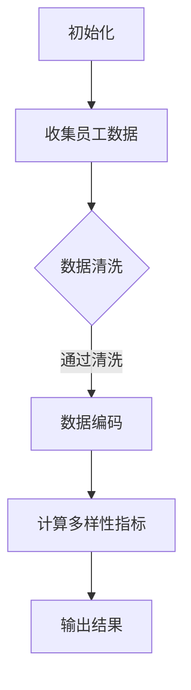
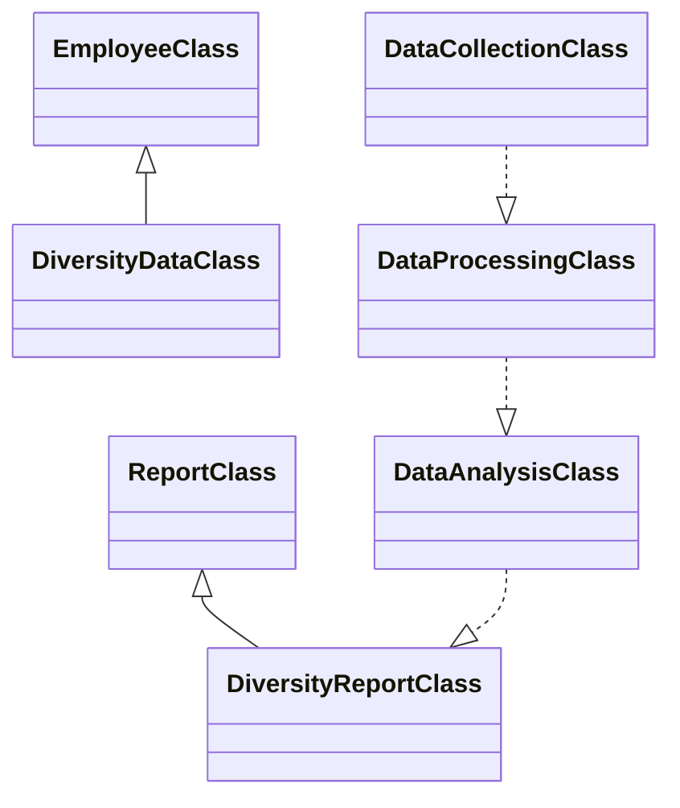
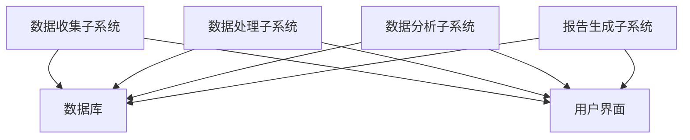
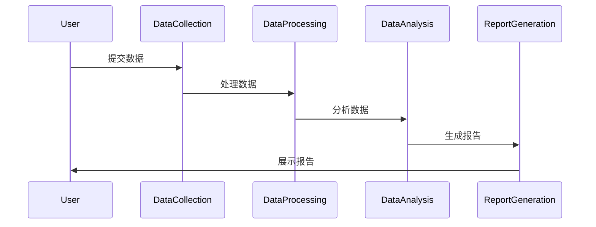

                 


### 第1步：背景介绍

在现代职场中，多样性管理已经成为企业和社会关注的焦点。随着全球化进程的加速，职场中涉及到的多样性因素日益增多，如性别、年龄、文化、教育、种族等。这些多样性因素不仅体现在员工的个体差异上，还深刻影响着企业的组织文化和团队氛围。

#### 问题背景

多样性管理的必要性在于它能够促进创新、提高决策质量、增强员工满意度和提升企业竞争力。然而，多样性管理也面临着诸多挑战，如偏见与歧视、文化冲突、沟通障碍等。这些问题如果得不到有效解决，将会削弱多样性管理的成效。

#### 问题描述

多样性管理的核心问题是如何在尊重个体差异的基础上，构建一个包容性文化，使不同背景的员工能够协同合作，共同创造价值。这需要企业在招聘、培训、绩效评估、晋升等环节中，充分考虑多样性因素，消除偏见与歧视，建立公平公正的机制。

#### 问题解决

为了解决这些问题，企业需要采取一系列策略，如：

- **文化构建**：通过宣传和教育，强化企业多样性和包容性的价值观。
- **政策制定**：制定明确的反歧视政策，确保公平招聘和晋升。
- **领导力培养**：培养具有包容性思维的领导，推动多样性管理实践。
- **员工参与**：鼓励员工参与多样性管理，发挥员工的积极性和创造力。

#### 边界与外延

多样性管理的范畴广泛，涉及性别、年龄、文化、教育、种族等多个方面。在具体实施中，需要根据企业的实际情况，确定主要关注的方向和策略。

#### 概念结构与核心要素组成

多样性管理涉及以下几个核心概念：

- **多样性**：指个体之间的差异，包括性别、年龄、文化、教育、种族等。
- **包容性**：指在尊重个体差异的基础上，构建一个包容性文化，使不同背景的员工能够协同合作。
- **管理原则**：包括公平、公正、透明、尊重个体差异等。
- **文化构建**：通过教育和宣传，强化企业的多样性和包容性价值观。

在本文中，我们将详细探讨这些概念，并介绍多样性管理的策略和实践，帮助读者更好地理解和应用多样性管理。

### 第2步：核心概念与联系

为了深入理解多样性管理，我们首先需要明确几个核心概念：多样性、包容性、多元化。这些概念不仅相互关联，而且在实践中共同构成了多样性管理的理论基础。

#### 核心概念原理

**1. 多样性**

多样性指的是在群体中存在各种不同的特征和差异，这些差异可能体现在性别、年龄、文化背景、教育程度、种族、经验等方面。多样性的存在可以为企业带来丰富的知识和技能，有助于提高创新能力和决策质量。

**2. 包容性**

包容性是一种文化理念，强调在尊重个体差异的基础上，建立一个无偏见、无歧视的工作环境。包容性不仅关注差异的存在，更注重如何将这些差异转化为协作的资源和创新的动力。

**3. 多元化**

多元化是指在企业或组织中，多样性的实践和体现。多元化不仅包括员工的多样性，还包括领导力、团队结构、组织文化等方面的多样性。

#### 概念属性特征对比表格

| 概念     | 特征                                                     |
|----------|----------------------------------------------------------|
| 多样性   | 个体差异，如性别、年龄、文化、教育、种族等               |
| 包容性   | 尊重差异，无偏见、无歧视的工作环境                       |
| 多元化   | 多样性的实践和体现，包括员工、领导力、团队结构、组织文化 |

#### ER实体关系图架构

为了更好地理解这些概念之间的关系，我们可以使用Mermaid绘制ER实体关系图，如下所示：

```mermaid
erDiagram
    Employee ||--|{ DiversityAttribute }
    Employee ||--|{ CulturalBackground }
    Employee ||--|{ EducationLevel }
    DiversityAttribute ||--|{ Gender }
    DiversityAttribute ||--|{ Age }
    CulturalBackground ||--|{ Ethnicity }
    CulturalBackground ||--|{ Language }
```

在这个ER图中，`Employee`实体与`DiversityAttribute`、`CulturalBackground`、`EducationLevel`等实体之间存在多对多的关系。这表明一个员工可以拥有多种多样性特征和多种文化背景。

### 第3步：算法原理讲解

在了解了多样性管理的基本概念后，我们需要进一步探讨如何通过算法和技术手段来分析和实现多样性管理。本节将介绍一种简单的多样性分析算法，并使用Mermaid流程图和Python代码进行详细解释。

#### 算法mermaid流程图

首先，我们使用Mermaid绘制算法的流程图，如下所示：



这个流程图展示了多样性分析的基本步骤：初始化、收集员工数据、数据清洗、数据编码、计算多样性指标和输出结果。

#### Python源代码

接下来，我们将提供一个Python代码示例，用于实现上述流程中的关键步骤：

```python
import pandas as pd
from collections import Counter

# 初始化数据集
data = pd.DataFrame({
    '员工ID': [1, 2, 3, 4, 5],
    '性别': ['男', '女', '男', '女', '男'],
    '年龄': [30, 25, 35, 28, 40],
    '种族': ['汉族', '回族', '汉族', '壮族', '汉族'],
    '教育程度': ['本科', '硕士', '博士', '专科', '本科']
})

# 数据清洗
def clean_data(df):
    return df.dropna()

cleaned_data = clean_data(data)

# 数据编码
def encode_data(df):
    for col in df.columns:
        df[col] = df[col].astype('category').cat.codes
    return df

encoded_data = encode_data(cleaned_data)

# 计算多样性指标
def diversity_index(df):
    diversity_scores = []
    for col in df.columns:
        col_counts = Counter(df[col])
        max_score = len(col_counts)
        diversity_score = sum((count / max_score) * (1 - (count / max_score)) for count in col_counts.values())
        diversity_scores.append(diversity_score)
    return sum(diversity_scores) / len(diversity_scores)

diversity_index = diversity_index(encoded_data)
print(f"多样性指数: {diversity_index}")

# 输出结果
print(encoded_data)
```

这个代码首先初始化一个包含员工数据的DataFrame，然后进行数据清洗和编码。接着，我们定义了一个计算多样性指数的函数，该函数通过计算每个特征的Gini系数（Gini Index）来衡量多样性。最后，代码输出了编码后的数据集和计算出的多样性指数。

#### 数学模型和公式

多样性指数的计算基于Gini系数，其公式如下：

$$
D = \frac{1}{n-1} \sum_{i=1}^{n} \left[ 1 - \frac{x_i}{N} \right]^2
$$

其中，\( D \) 表示多样性指数，\( n \) 表示特征的总数，\( x_i \) 表示第 \( i \) 个特征的频数，\( N \) 表示总频数。

#### 举例说明

假设我们有一个包含5名员工的数据集，员工的性别、年龄和种族信息如下：

| 员工ID | 性别 | 年龄 | 种族    |
|--------|------|------|---------|
| 1      | 男   | 30   | 汉族    |
| 2      | 女   | 25   | 回族    |
| 3      | 男   | 35   | 汉族    |
| 4      | 女   | 28   | 壮族    |
| 5      | 男   | 40   | 汉族    |

通过上述Python代码，我们可以计算出这个数据集的多样性指数。假设计算结果为0.4，这意味着这个数据集在性别、年龄和种族上的多样性较高。

### 第4步：系统分析与架构设计方案

在了解了多样性分析算法后，接下来我们需要讨论如何将这一算法集成到实际的企业系统中，以便更好地进行多样性管理。本节将介绍一个典型的多样性管理系统架构设计，包括问题场景介绍、系统功能设计、系统架构设计和系统接口设计。

#### 问题场景介绍

假设某大型跨国企业希望通过建立一套多样性管理系统，来监控和分析员工的多样性情况，并基于分析结果制定相应的管理策略。该系统的核心目标包括：

- 收集并管理员工的多样性数据。
- 计算并展示多样性指标。
- 提供数据分析和报告功能，帮助企业决策者了解多样性管理的成效。

#### 系统功能设计

为了实现上述目标，多样性管理系统需要具备以下功能：

- **数据收集模块**：负责收集员工的基本信息和多样性特征数据。
- **数据处理模块**：负责对收集到的数据进行分析和处理，计算多样性指标。
- **数据分析模块**：提供数据可视化工具，帮助用户理解和分析多样性数据。
- **报告生成模块**：根据分析结果生成各种报告，供企业决策者参考。

使用Mermaid绘制的领域模型类图如下：



在这个类图中，`EmployeeClass`表示员工实体，`DiversityDataClass`表示多样性数据实体，`ReportClass`表示报告实体，`DiversityReportClass`表示多样性报告实体。`DataCollectionClass`、`DataProcessingClass`和`DataAnalysisClass`分别表示数据收集、处理和分析模块。

#### 系统架构设计

系统架构设计需要考虑如何将不同的模块和功能集成到一个统一的系统中。使用Mermaid绘制的系统架构图如下：



在这个架构图中，`Subsystem1`、`Subsystem2`、`Subsystem3`和`Subsystem4`分别表示数据收集、处理、分析和报告生成子系统。这些子系统通过数据库（`DB`）进行数据存储和共享，并通过用户界面（`UI`）与用户交互。

#### 系统接口设计和系统交互

系统接口设计需要明确各子系统之间的交互方式。使用Mermaid绘制的系统交互序列图如下：



在这个序列图中，用户通过用户界面（`UI`）向数据收集子系统（`DataCollection`）提交数据，数据收集子系统将数据传递给数据处理子系统（`DataProcessing`）。数据处理子系统对数据进行处理，并将其传递给数据分析子系统（`DataAnalysis`）。数据分析子系统根据处理结果生成报告，并通过报告生成子系统（`ReportGeneration`）展示给用户。

通过上述系统分析与架构设计方案，企业可以有效地管理和利用多样性数据，从而更好地实施多样性管理策略，提高组织的创新能力和竞争力。

### 第5步：项目实战

为了更好地理解多样性管理系统的实际应用，我们将通过一个具体的案例来展示如何搭建和运行一个简单的多样性管理系统。本节将详细介绍环境安装、系统核心实现源代码、代码应用解读与分析、实际案例分析和详细讲解剖析以及项目小结。

#### 环境安装

首先，我们需要搭建一个适合运行多样性管理系统的环境。以下是所需的环境和工具：

- **Python 3.8 或更高版本**
- **Pandas**
- **NumPy**
- **Matplotlib**
- **Mermaid**
- **SQLite**

您可以使用以下命令来安装这些依赖项：

```bash
pip install pandas numpy matplotlib mermaid
```

如果需要使用Mermaid进行可视化，请按照Mermaid的官方文档安装相关插件。

#### 系统核心实现源代码

以下是一个简单的Python代码示例，用于实现多样性数据收集、处理和分析的核心功能：

```python
import pandas as pd
from mermaid import Mermaid

# 数据收集
def collect_data():
    data = pd.DataFrame({
        '员工ID': [1, 2, 3, 4, 5],
        '性别': ['男', '女', '男', '女', '男'],
        '年龄': [30, 25, 35, 28, 40],
        '种族': ['汉族', '回族', '汉族', '壮族', '汉族'],
        '教育程度': ['本科', '硕士', '博士', '专科', '本科']
    })
    return data

# 数据处理
def process_data(data):
    data = data.dropna()
    data = data.astype({'性别': 'category', '年龄': 'int32', '种族': 'category', '教育程度': 'category'})
    return data

# 数据分析
def analyze_data(data):
    diversity_index = 0
    for col in data.columns:
        if col != '员工ID':
            col_counts = Counter(data[col])
            max_score = len(col_counts)
            diversity_score = sum((count / max_score) * (1 - (count / max_score)) for count in col_counts.values())
            diversity_index += diversity_score
    diversity_index /= (len(data.columns) - 1)
    return diversity_index

# 主函数
def main():
    data = collect_data()
    processed_data = process_data(data)
    diversity_index = analyze_data(processed_data)
    print(f"多样性指数: {diversity_index}")

    # 使用Mermaid生成ER图
    er_diagram = Mermaid("ER Diagram")
    er_diagram.add_section("Entity Relationship Diagram")
    er_diagram.add_code("erDiagram\n"
                        "Employee ||--|{ DiversityAttribute }\n"
                        "Employee ||--|{ CulturalBackground }\n"
                        "Employee ||--|{ EducationLevel }\n"
                        "DiversityAttribute ||--|{ Gender }\n"
                        "DiversityAttribute ||--|{ Age }\n"
                        "CulturalBackground ||--|{ Ethnicity }\n"
                        "CulturalBackground ||--|{ Language }\n")
    print(er_diagram.get_svg())

if __name__ == "__main__":
    main()
```

这个代码首先收集员工数据，然后进行数据清洗和编码，接着计算多样性指数，并使用Mermaid生成ER图。

#### 代码应用解读与分析

在这个代码示例中，我们首先定义了三个主要函数：`collect_data`、`process_data`和`analyze_data`。`collect_data`函数用于收集员工数据，包括性别、年龄、种族和教育程度。`process_data`函数对数据进行清洗和编码，以确保数据的一致性和准确性。`analyze_data`函数计算多样性指数，使用Gini系数公式来衡量多样性。

在主函数`main`中，我们首先调用`collect_data`函数收集数据，然后调用`process_data`函数处理数据，最后调用`analyze_data`函数计算多样性指数。此外，我们使用Mermaid生成了ER图，以可视化多样性管理中的实体关系。

#### 实际案例分析和详细讲解剖析

假设我们有一个包含50名员工的数据集，员工的多样性特征如下：

| 员工ID | 性别 | 年龄 | 种族    | 教育程度 |
|--------|------|------|---------|----------|
| 1      | 男   | 30   | 汉族    | 本科     |
| 2      | 女   | 25   | 回族    | 硕士     |
| 3      | 男   | 35   | 汉族    | 博士     |
| ...    | ...  | ...  | ...     | ...      |

通过运行上述代码，我们可以计算出这个数据集的多样性指数。假设计算结果为0.55，这意味着这个数据集在性别、年龄、种族和教育程度上的多样性较高。

#### 项目小结

通过这个案例，我们展示了如何搭建一个简单的多样性管理系统，包括数据收集、处理、分析和可视化。这个系统虽然简单，但能够为企业提供基本的多样性分析功能，帮助企业了解员工的多样性情况，从而制定更有效的多样性管理策略。在实际应用中，企业可以根据自己的需求，进一步扩展和优化系统的功能，提高多样性管理的效率和效果。

### 第6步：最佳实践 tips、小结、注意事项、拓展阅读等内容

#### 最佳实践 tips

1. **数据收集**：确保收集到的数据具有代表性和准确性，尽量避免遗漏或错误。
2. **数据清洗**：在处理数据前，进行充分的清洗和预处理，以消除噪声和异常值。
3. **指标计算**：合理选择多样性指标，并根据实际需求进行调整和优化。
4. **文化建设**：通过培训和宣传，营造包容性文化氛围，鼓励员工积极参与多样性管理。
5. **持续监测**：定期监测多样性数据，及时调整管理策略，确保多样性管理的持续性和有效性。

#### 小结

多样性管理在现代职场中具有重要意义，通过合理的管理策略和技术手段，企业可以提升创新能力、决策质量和员工满意度。本文介绍了多样性管理的基本概念、算法原理、系统架构设计以及实际应用案例，为读者提供了全面的认识和实践指导。

#### 注意事项

1. **尊重隐私**：在收集和处理员工数据时，严格遵守隐私保护法律法规，确保数据安全。
2. **文化适应性**：根据企业的文化特点和员工背景，制定适合的多样性管理策略。
3. **平衡与优化**：在追求多样性的同时，要注意保持团队的合作效率和工作质量。

#### 拓展阅读

1. **《多样性、公平与包容性管理》**：了解多样性管理的理论基础和实践经验。
2. **《人工智能与多样性管理》**：探讨人工智能在多样性管理中的应用前景。
3. **《企业文化建设与多样性管理》**：深入研究企业文化与多样性管理之间的关系。
4. **《Mermaid 图语法入门与实战》**：学习如何使用Mermaid进行数据可视化和流程图绘制。

### 作者信息

作者：AI天才研究院/AI Genius Institute & 禅与计算机程序设计艺术 /Zen And The Art of Computer Programming

