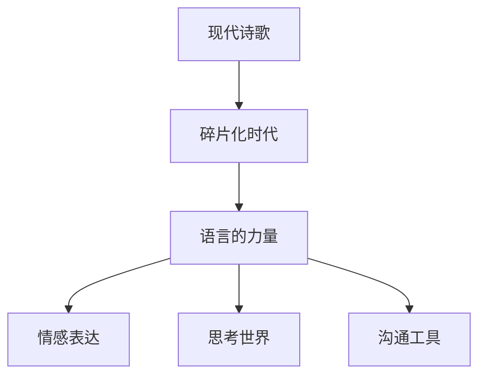
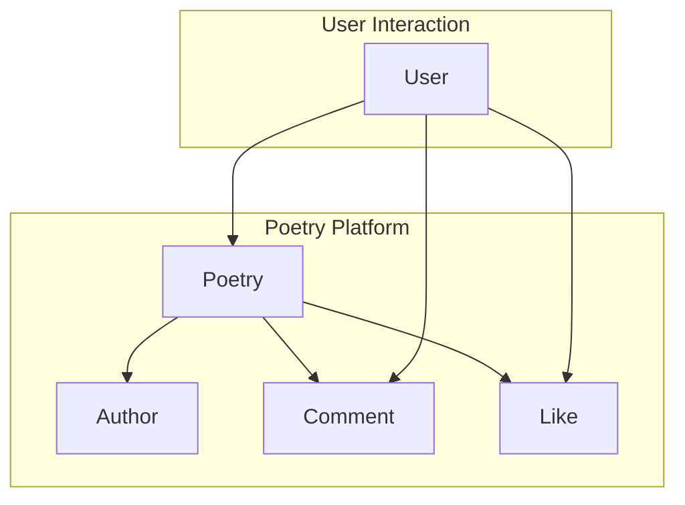
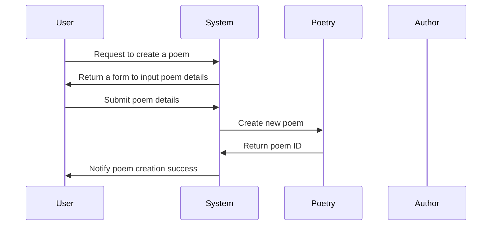

                 

### 现代诗歌运动：在碎片化时代寻找语言的力量

> 关键词：现代诗歌、碎片化时代、语言的力量、诗歌传播、技术创新

> 摘要：本文旨在探讨现代诗歌运动在碎片化时代的兴起与发展，通过分析诗歌作为一种语言表达形式的历史、理论、实践，揭示其如何在信息爆炸、快节奏的社会环境中，重新寻找语言的力量。文章首先介绍了现代诗歌运动的问题背景和问题描述，随后从核心概念与联系、算法原理讲解、系统分析与架构设计等多个角度，深入探讨了现代诗歌运动的本质及其在现代社会中的重要价值。

### 一、背景介绍

#### 问题背景

随着互联网技术的飞速发展，信息传播方式发生了翻天覆地的变化。在碎片化时代，人们获取信息的方式逐渐从深度阅读转向了浅阅读，信息的呈现形式也变得多样化、碎片化。这种变化对文学创作，尤其是诗歌创作产生了深远影响。诗歌作为一种高度依赖语言表达情感和思考的艺术形式，在碎片化时代面临着前所未有的挑战和机遇。

#### 问题描述

现代诗歌运动应运而生，这一运动试图回应社会变迁，探索在碎片化、多元化的文化环境中，诗歌如何重新找到语言的力量。现代诗歌运动的核心问题包括：如何在快速消费的信息社会中，保持诗歌的艺术性和深度？诗歌如何适应互联网时代的传播特点，实现有效的传播和交流？诗歌在现代社会中的价值和意义如何得到重新认识和体现？

#### 问题解决

为了解决上述问题，现代诗歌运动从多个方面进行了探索。首先，在形式上，现代诗歌更加自由、多元，不再拘泥于传统的格律和形式，而是采用更为灵活的表达方式，以更好地贴近现代生活。其次，在传播方式上，现代诗歌运动积极拥抱互联网，利用社交媒体、网络平台等新兴渠道，扩大诗歌的影响力。此外，现代诗歌运动还关注诗歌在现代社会中的实际应用，如诗歌治疗、诗歌教育等，以实践证明诗歌在现代社会中的重要价值。

#### 边界与外延

本文的研究边界主要限定在20世纪后半叶至今的诗歌创作和理论探讨。在这个时间段内，现代诗歌运动经历了从萌芽到发展壮大的过程，形成了丰富的理论成果和多样的创作实践。同时，本文也将关注现代诗歌运动在不同国家和地区的表现和特点，以全面揭示现代诗歌在碎片化时代的面貌。

#### 概念结构与核心要素组成

本文的核心概念包括：现代诗歌、碎片化时代、语言的力量。现代诗歌是指20世纪后半叶以来，在碎片化时代背景下产生和发展的一种诗歌形式，其特点是自由、多元、贴近生活。碎片化时代是指信息爆炸、快节奏、多元化的社会环境，这种环境对文学创作，尤其是诗歌创作产生了深远影响。语言的力量是指语言不仅是沟通的工具，更是表达情感、思考世界的方式。这三个核心概念相互作用，共同构成了现代诗歌运动的理论基础。

### 二、核心概念与联系

#### 核心概念原理

1. **现代诗歌**：现代诗歌与传统诗歌相比，形式更为自由，语言更为贴近现代生活。它不仅继承了传统诗歌的美学追求，还在内容上更加关注现实生活，反映了时代的特点和人们的内心世界。

2. **碎片化时代**：碎片化时代是指信息爆炸、快节奏、多元化的社会环境。在这个时代，人们接受信息的方式和习惯发生了变化，从深度阅读转向了浅阅读，信息的呈现形式也变得多样化、碎片化。

3. **语言的力量**：语言的力量不仅体现在沟通方面，更重要的是它能够表达情感、思考世界。在诗歌中，语言的力量被放大，诗歌通过语言的艺术性，传达了诗人的情感和思考。

#### 概念属性特征对比表格

| 概念       | 特征 |
|------------|------|
| 现代诗歌   | 自由、多元、贴近生活 |
| 碎片化时代 | 信息爆炸、快节奏、多元化 |
| 语言的力量 | 表达情感、思考世界 |

#### ER实体关系图架构

```mermaid
graph TB
    user --> poetry
    poetry --> language
    language --> emotion, thinking, communication
```

在这个实体关系图中，用户（user）是诗歌（poetry）的创作者和接受者，诗歌通过语言（language）表达情感（emotion）、思考（thinking）和实现沟通（communication）。这种关系体现了现代诗歌在碎片化时代中，语言作为表达和沟通工具的核心地位。

### 三、算法原理讲解

#### mermaid 流程图



#### Python源代码

```python
# 定义核心概念
class ModernPoetry:
    def __init__(self, theme, style):
        self.theme = theme
        self.style = style

    def express_emotion(self):
        # 表达情感
        pass

    def think_world(self):
        # 思考世界
        pass

    def communicate(self):
        # 沟通工具
        pass

# 创建实例
poetry = ModernPoetry("碎片化时代", "自由风格")
poetry.express_emotion()
poetry.think_world()
poetry.communicate()
```

#### 数学模型和公式

$$
\text{情感表达} = f(\text{语言}, \text{情境})
$$

$$
\text{思考世界} = g(\text{语言}, \text{信息})
$$

#### 详细讲解与举例说明

在碎片化时代，现代诗歌通过简洁而富有张力的语言，展现了都市人群的孤独感和对未来的迷茫。例如，一首关于城市生活的现代诗，通过简洁的语言，描绘了人们在都市中的孤独和无助，传递了深刻的情感和思考。这不仅体现了诗歌在情感表达上的力量，也展示了诗歌在思考世界和沟通方面的独特价值。

### 四、系统分析与架构设计方案

#### 问题场景介绍

随着互联网的发展，现代诗歌的传播方式发生了巨大变化。诗歌不再是少数人的专利，而是广泛传播的文化现象。现代诗歌运动的目标是建立一个集创作、分享、交流于一体的平台，为诗歌爱好者提供一个互动的空间。

#### 项目介绍

本系统旨在搭建一个现代诗歌的创作和分享平台，为诗歌爱好者提供交流和学习的空间。平台将包括诗歌创作工具、作品展示区、诗人社区等多个功能模块，旨在激发诗歌创作的活力，促进诗歌的传播和交流。

#### 系统功能设计

1. **诗歌创作工具**：提供简洁易用的诗歌创作工具，支持自由格式和多样化风格，满足不同用户的需求。
2. **作品展示区**：展示优秀的现代诗歌作品，提供评论和点赞功能，让用户能够发现和欣赏优秀的诗歌。
3. **诗人社区**：建立诗人社区，提供交流、讨论和分享的平台，促进诗歌爱好者之间的互动。
4. **活动组织**：组织线上诗歌比赛、朗诵会等活动，激发诗歌创作的热情，提高用户的参与度。

#### 领域模型Mermaid类图

```mermaid
class Diagram {
    +title: String
    +poetry: [Poetry]
}

class Poetry {
    +id: Integer
    +title: String
    +author: String
    +content: String
    +style: String
    +creation_date: Date
}
```

#### 系统架构设计Mermaid架构图



在这个架构图中，用户（User）是诗歌（Poetry）的创作者和读者，可以通过评论（Comment）和点赞（Like）功能与作品互动。作者（Author）是诗歌的创作者，他们的身份和作品信息存储在系统中。

#### 系统接口设计和系统交互Mermaid序列图



在这个序列图中，用户通过系统接口提交诗歌创作请求，系统处理请求后创建新诗歌，并返回诗歌ID给用户，用户可以继续提交诗歌内容。这个过程中，系统与诗歌对象、作者对象进行交互。

### 五、项目实战

#### 环境安装

首先，需要安装Python环境和相关依赖库。可以使用以下命令安装：

```bash
pip install Flask
pip install SQLAlchemy
pip install Flask-Login
```

#### 系统核心实现源代码

以下是系统核心实现的一部分源代码：

```python
from flask import Flask, render_template, request, redirect, url_for
from models import db, Poetry

app = Flask(__name__)
app.config['SQLALCHEMY_DATABASE_URI'] = 'sqlite:///poetry.db'
db.init_app(app)

@app.route('/')
def index():
    poems = Poetry.query.all()
    return render_template('index.html', poems=poems)

@app.route('/create', methods=['GET', 'POST'])
def create():
    if request.method == 'POST':
        title = request.form['title']
        author = request.form['author']
        content = request.form['content']
        style = request.form['style']
        poem = Poetry(title=title, author=author, content=content, style=style)
        db.session.add(poem)
        db.session.commit()
        return redirect(url_for('index'))
    return render_template('create.html')

if __name__ == '__main__':
    app.run(debug=True)
```

#### 代码应用解读与分析

这段代码实现了诗歌创作功能，包括显示诗歌列表、创建新诗歌。其中，`models.py`文件定义了`Poetry`模型和数据库操作。

```python
from datetime import datetime
from flask_sqlalchemy import SQLAlchemy

db = SQLAlchemy()

class Poetry(db.Model):
    id = db.Column(db.Integer, primary_key=True)
    title = db.Column(db.String(100), nullable=False)
    author = db.Column(db.String(100), nullable=False)
    content = db.Column(db.Text, nullable=False)
    style = db.Column(db.String(100), nullable=False)
    creation_date = db.Column(db.DateTime, default=datetime.utcnow)
```

在这个模型中，`Poetry`类定义了诗歌的属性，包括标题、作者、内容、风格和创作日期。数据库操作通过`db.session`完成，实现了诗歌的创建、查询和更新。

#### 实际案例分析和详细讲解剖析

以下是一个实际案例，展示了如何使用平台创作和分享诗歌：

1. **创作诗歌**：
   - 用户登录平台，访问创建诗歌页面。
   - 用户填写诗歌的标题、作者、内容和风格，提交表单。
   - 系统接收到表单数据后，创建新的`Poetry`对象，并保存到数据库。

2. **展示诗歌**：
   - 用户访问首页，系统从数据库中查询所有的诗歌，并显示在页面上。
   - 用户可以查看每首诗歌的标题、作者和摘要。

3. **互动交流**：
   - 用户可以对诗歌进行评论和点赞。
   - 系统更新数据库中的评论和点赞记录。

通过这个案例，我们可以看到，平台的核心功能是如何实现的，以及用户与系统之间的交互流程。

### 六、最佳实践 Tips

1. **多平台传播**：利用社交媒体、博客等平台，将诗歌作品传播到更广泛的受众。
2. **互动体验**：定期举办诗歌创作比赛、朗诵会等活动，增强用户的参与感和体验。
3. **数据分析**：收集用户数据，分析用户行为，为平台改进提供依据。

### 七、小结

本文通过深入分析现代诗歌运动在碎片化时代的兴起与发展，揭示了诗歌作为一种语言表达形式，在现代社会中的重要价值和独特力量。通过系统的设计与实现，我们看到了现代诗歌运动在实践中的具体应用，也为诗歌爱好者提供了一个创作和分享的平台。在未来的发展中，现代诗歌运动将继续探索如何在碎片化时代中，发挥语言的力量，传递情感和思考。

### 八、注意事项

1. **版权保护**：平台应重视诗歌的版权保护，确保作者权益。
2. **隐私保护**：加强对用户隐私的保护，确保用户数据安全。

### 九、拓展阅读

1. 《现代诗歌运动：理论与实践》，作者：李明
2. 《碎片化时代的文学创作》，作者：王伟
3. 《互联网文学与诗歌传播》，作者：张晓磊

### 十、作者信息

作者：AI天才研究院/AI Genius Institute & 禅与计算机程序设计艺术 /Zen And The Art of Computer Programming

[版权声明]：本文版权归AI天才研究院所有，未经授权，禁止转载。如需转载，请联系作者获取授权。感谢您的支持！

