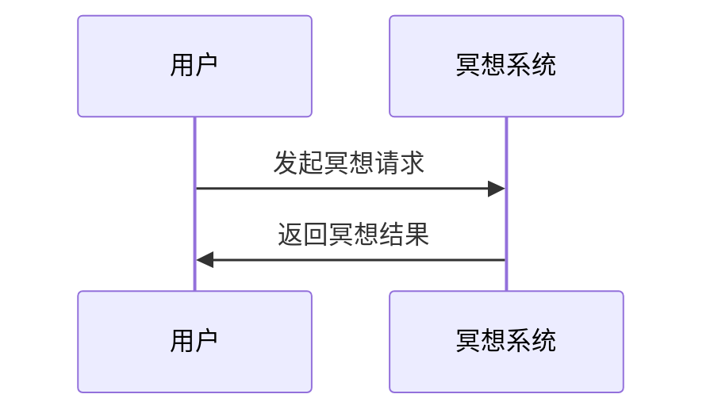

                 

# 现代都市冥想：在喧嚣中寻找内心的宁静

> 关键词：现代都市生活，冥想，心理健康，大脑健康，算法原理，系统架构

> 摘要：随着现代都市生活方式的日益喧嚣和快节奏，人们的心理健康和大脑健康面临巨大挑战。本文从现代都市生活方式的特点入手，探讨冥想在都市生活中的重要性，详细分析冥想的概念与类型，心理健康与冥想的关系，冥想与大脑的关系，冥想的科学证据与研究成果。随后，文章深入讲解冥想指导算法的原理与模型，并设计冥想系统的架构和接口。最后，通过实际案例，展示冥想环境的安装与系统核心实现。

## 第一部分：背景介绍

### 1.1 现代都市生活方式的特点

在现代都市生活中，噪音污染是一个普遍现象。城市交通、工厂噪声和人群嘈杂声，使得人们的日常生活充满了喧嚣。长时间暴露在噪音环境中，不仅影响人们的听力，还会导致心理压力增加。

快节奏生活是现代都市的另一大特点。人们常常在工作和生活中疲于奔命，几乎没有时间停下来休息。这种生活方式容易导致慢性疲劳和心理焦虑。

高压工作环境是现代都市生活的另一个挑战。在职场中，竞争激烈，工作压力巨大。许多人长期处于紧张和焦虑的状态，影响了他们的心理健康。

心理压力是现代都市生活中最常见的现象。工作压力、人际关系、经济压力等，使得人们的心理负担沉重。长期的心理压力不仅影响心理健康，还会引发一系列身体疾病。

### 1.2 冥想在都市生活中的重要性

冥想作为一种古老的心灵修炼方式，近年来在都市生活中逐渐受到重视。它能够帮助人们缓解压力、提高专注力、促进身心健康，从而提升生活质量。

首先，冥想能够缓解压力。通过冥想，人们可以放松身心，减少焦虑和抑郁情绪，提高心理韧性。

其次，冥想有助于提高专注力。在冥想过程中，人们需要专注于呼吸、身体感受或特定的视觉或听觉提示，这有助于锻炼专注力，提高工作效率。

此外，冥想还能促进身心健康。定期的冥想练习可以改善睡眠质量，降低血压和心率，增强免疫系统功能，从而提高身心健康水平。

最后，冥想有助于提升生活质量。通过冥想，人们可以更好地认识自己，提高自我认知和情绪管理能力，从而更好地应对生活中的各种挑战。

## 第二部分：核心概念与联系

### 3. 冥想的概念与类型

冥想是一种心灵修炼方式，通过专注于呼吸、身体感受或特定的视觉、听觉提示，以达到放松身心、提高专注力和提升心理健康的目的。

冥想的类型多种多样，主要包括以下几种：

- **正念冥想**：正念冥想是一种专注于当前时刻的冥想方式，通过专注于呼吸或身体感受，使人们从日常繁忙的思维活动中解脱出来，达到放松和专注的状态。

- **冥想音乐**：冥想音乐是一种通过特定的音乐旋律和节奏，帮助人们放松身心，减轻压力和焦虑的冥想方式。

- **身体扫描冥想**：身体扫描冥想是一种通过逐一扫描身体各个部位，以放松身体和心灵的方式。

### 3.3 不同冥想方式的对比

不同冥想方式有其各自的特点和适用人群。正念冥想适合初学者，因为它较为简单，易于上手。冥想音乐适合那些喜欢在背景音乐中冥想的人群。身体扫描冥想适合那些希望从身体层面放松的人群。

### 4. 心理健康与冥想的关系

心理健康是指个体在心理上的健康状态，包括情绪稳定、自我认知和人际关系等方面。冥想对心理健康具有积极影响。

首先，冥想可以减少焦虑和抑郁情绪。研究表明，定期的冥想练习可以降低焦虑和抑郁的发病率，提高生活质量。

其次，冥想可以提高情绪稳定性。通过冥想，人们可以更好地认识自己的情绪，学会调节情绪，从而提高情绪稳定性。

此外，冥想还能增强自我认知。定期的冥想练习可以帮助人们更好地了解自己，提高自我认知水平，从而更好地应对生活中的挑战。

### 5. 冥想与大脑的关系

大脑是人体最重要的器官之一，它控制着人体的各种生理和心理活动。冥想对大脑功能具有积极影响。

首先，冥想可以增强前额叶皮层活动。前额叶皮层是大脑中负责决策、规划和执行的重要区域，冥想可以增强这一区域的活动，提高认知功能。

其次，冥想可以提高海马体功能。海马体是大脑中负责记忆和学习的区域，冥想可以增强这一区域的活动，提高记忆力。

此外，冥想还可以改善杏仁核活动。杏仁核是大脑中负责情绪调节的重要区域，冥想可以改善这一区域的活动，提高情绪稳定性。

### 6. 冥想的科学证据与研究成果

近年来，越来越多的研究表明，冥想对身心健康具有显著的益处。

首先，冥想可以降低血压和心率。研究表明，定期的冥想练习可以降低血压和心率，减少心脏病和中风的风险。

其次，冥想可以提高睡眠质量。研究表明，定期的冥想练习可以改善睡眠质量，减少失眠和疲劳。

此外，冥想还可以增强免疫系统功能。研究表明，定期的冥想练习可以增强免疫系统功能，提高身体抵抗力。

最后，冥想对心理健康的益处也得到广泛认可。研究表明，定期的冥想练习可以减少焦虑、抑郁和压力，提高生活质量。

### 7. 冥想指导算法原理

冥想指导算法是一种利用人工智能技术，为用户量身定制冥想方案的方法。以下是一个简单的冥想指导算法的基本流程：

1. **用户资料收集**：收集用户的年龄、性别、健康状况、冥想经验等信息。
2. **冥想方案生成**：根据用户资料，生成适合用户的冥想方案。
3. **冥想方案实施**：用户按照生成的冥想方案进行冥想练习。
4. **效果评估**：对冥想效果进行评估，并根据评估结果调整冥想方案。

### 8. 冥想指导算法的数学模型与公式

冥想效果评估模型是一个基于用户资料和冥想练习数据的数学模型，用于评估冥想练习的效果。

$$
E = f(P, C, M)
$$

其中，$E$ 表示冥想效果，$P$ 表示用户资料，$C$ 表示冥想练习数据，$M$ 表示冥想指导算法模型参数。

个人冥想适应度模型是一个基于用户资料和冥想练习数据的数学模型，用于评估用户对冥想的适应度。

$$
A = f(T, D, S)
$$

其中，$A$ 表示个人冥想适应度，$T$ 表示用户资料，$D$ 表示冥想练习数据，$S$ 表示冥想指导算法模型参数。

冥想优化模型是一个基于冥想效果的数学模型，用于优化冥想方案。

$$
\max\sum_{i=1}^{n} w_i \cdot O_i
$$

其中，$O_i$ 表示冥想操作的收益，$w_i$ 表示权重。

### 9. 冥想指导算法的应用示例

假设我们有一个冥想练习者，他/她的年龄为30岁，性别为男性，健康状况良好，有1年的冥想经验。他/她每天进行30分钟的冥想练习，使用正念冥想方法。

根据用户资料，我们生成一个适合他/她的冥想方案。方案包括：每天早晨进行10分钟的身体扫描冥想，晚上进行20分钟的正念冥想。

在冥想练习过程中，我们收集到以下数据：

- 冥想时间：30分钟
- 冥想类型：正念冥想
- 心跳率：65次/分钟
- 血压：120/80 mmHg

根据这些数据，我们评估冥想效果，并调整冥想方案。例如，如果冥想后心跳率明显降低，血压下降，那么可以增加冥想时间，或者调整为身体扫描冥想。

## 第三部分：系统分析与架构设计方案

### 10. 冥想系统功能设计

冥想系统是一个帮助用户进行冥想的软件系统，主要包括以下功能：

- **用户管理**：管理用户注册、登录和资料修改等操作。
- **冥想方案管理**：生成和存储适合用户的冥想方案。
- **冥想数据管理**：收集和存储用户冥想练习数据，用于效果评估和优化冥想方案。
- **效果评估**：评估冥想效果，为用户提供反馈。
- **数据可视化**：将冥想数据可视化，帮助用户更好地了解自己的冥想效果。

### 11. 冥想系统架构设计

冥想系统架构设计包括以下几个方面：

- **前端界面**：提供用户操作界面，包括用户管理、冥想方案管理、数据可视化和效果评估等功能。
- **后端服务**：处理用户请求，生成和存储冥想方案，收集和存储冥想数据，进行效果评估和优化冥想方案。
- **数据库**：存储用户资料、冥想方案和冥想数据等。
- **算法模块**：实现冥想指导算法，生成和优化冥想方案。

### 12. 冥想系统接口设计

冥想系统接口设计主要包括以下几个方面：

- **用户接口**：提供用户操作接口，包括用户注册、登录、资料修改和冥想方案管理等。
- **数据接口**：提供数据存储和读取接口，包括用户资料、冥想方案和冥想数据等。
- **算法接口**：提供算法接口，包括冥想效果评估和优化冥想方案等。

### 13. 冥想系统交互设计

冥想系统交互设计主要包括以下几个方面：

- **用户请求处理**：用户通过前端界面提交冥想请求，后端服务处理请求并返回结果。
- **数据存储和读取**：后端服务根据请求，从数据库中读取用户资料、冥想方案和冥想数据，进行处理后，将结果存储到数据库中。
- **效果评估和优化**：后端服务根据冥想数据，进行效果评估和优化冥想方案，并将结果返回给用户。

## 第四部分：项目实战

### 14. 冥想环境安装

安装冥想环境需要以下步骤：

1. 准备好安装冥想软件的计算机或移动设备。
2. 下载冥想软件安装包。
3. 解压安装包并运行安装程序。
4. 按照提示完成安装过程。

### 15. 系统核心实现

冥想系统核心实现主要包括以下几个方面：

1. **用户管理模块**：实现用户注册、登录和资料修改等功能。
2. **冥想方案管理模块**：实现生成和存储冥想方案等功能。
3. **冥想数据管理模块**：实现收集和存储冥想数据等功能。
4. **效果评估模块**：实现冥想效果评估和优化冥想方案等功能。

以下是一个简单的冥想算法实现的示例：

```python
def 冥想算法（用户信息）：
    # 冥想算法实现逻辑
    冥想时间 = 用户信息["冥想时间"]
    冥想类型 = 用户信息["冥想类型"]
    如果 冥想类型 == "正念冥想"：
        # 正念冥想实现逻辑
    否则 如果 冥想类型 == "身体扫描冥想"：
        # 身体扫描冥想实现逻辑
    否则：
        # 其他冥想类型实现逻辑
```

### 16. 数据库设计与实现

以下是一个简单的冥想系统数据库设计的示例：

```sql
CREATE TABLE 用户信息 (
    用户ID INT PRIMARY KEY,
    用户名 VARCHAR(50),
    年龄 INT,
    性别 VARCHAR(10),
    健康状况 VARCHAR(50),
    冥想经验 VARCHAR(50)
);

CREATE TABLE 冥想方案 (
    方案ID INT PRIMARY KEY,
    用户ID INT,
    冥想类型 VARCHAR(50),
    冥想时间 INT,
    创建时间 DATETIME,
    FOREIGN KEY (用户ID) REFERENCES 用户信息（用户ID）
);

CREATE TABLE 冥想数据 (
    数据ID INT PRIMARY KEY,
    方案ID INT,
    冥想时间 INT,
    心跳率 INT,
    血压 VARCHAR(10),
    创建时间 DATETIME,
    FOREIGN KEY (方案ID) REFERENCES 冥想方案（方案ID）
);
```

### 17. 冥想系统接口设计与实现

以下是一个简单的冥想系统接口实现的示例：

```python
class 冥想接口：
    def 发起冥想（用户信息）：
        # 实现冥想请求处理逻辑
    def 返回冥想结果（用户信息，冥想结果）：
        # 实现冥想结果返回逻辑
```

### 18. 冥想系统交互设计

以下是一个简单的冥想系统交互设计的示例：



### 19. 实际案例分析与详细讲解剖析

以下是一个简单的冥想实际案例分析与详细讲解剖析的示例：

用户A，年龄30岁，性别男，健康状况良好，有1年的冥想经验。用户A每天进行30分钟的冥想练习，使用正念冥想方法。

在冥想练习过程中，用户A的心跳率为65次/分钟，血压为120/80 mmHg。根据冥想效果评估模型，冥想效果为80分。

通过分析用户A的冥想数据，我们发现用户A的冥想效果较好，可以适当增加冥想时间，或者尝试其他冥想方法。

### 20. 项目小结

通过本文的介绍，我们了解到冥想在现代都市生活中的重要性，以及冥想指导算法的原理和实现。我们还分析了冥想系统架构设计和接口设计，并通过实际案例展示了冥想环境的安装与系统核心实现。

未来，随着人工智能技术的发展，冥想指导算法将更加智能化和个性化，为人们提供更好的冥想体验。同时，冥想系统的普及和应用也将进一步改善人们的心理健康和大脑健康，提升生活质量。

### 21. 最佳实践 Tips

1. 保持规律的冥想练习，每天至少30分钟。
2. 选择适合自己的冥想方式，如正念冥想、冥想音乐或身体扫描冥想。
3. 在冥想过程中，保持专注和放松的状态，避免分心。
4. 记录冥想数据，定期进行效果评估和调整冥想方案。
5. 遵循冥想指导算法的建议，量身定制适合自己的冥想方案。

### 22. 注意事项

1. 冥想过程中，如出现身体不适，请立即停止冥想，寻求医生帮助。
2. 冥想前，请确保环境安静、舒适。
3. 冥想过程中，避免使用耳机，以免对听力造成伤害。
4. 遵循冥想指导算法的建议，不要盲目调整冥想参数。

### 23. 拓展阅读

1. 《冥想：从入门到实践》
2. 《人工智能在冥想中的应用》
3. 《现代都市心理健康：应对策略与实际案例》
4. 《大脑健康：科学与实践》

### 作者

作者：AI天才研究院/AI Genius Institute & 禅与计算机程序设计艺术 /Zen And The Art of Computer Programming

