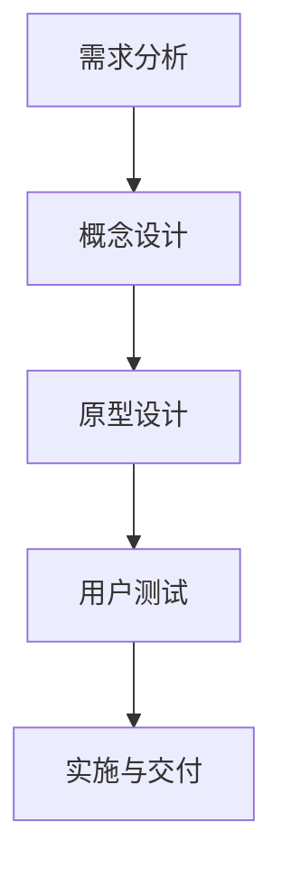

                 

## 第1章：现代都市微型度假概述

### 1.1 现代都市微型度假的兴起

现代都市微型度假是近年来迅速崛起的一种旅游趋势，其核心在于为城市居民提供一种高效、便捷的休闲方式。在快节奏的现代生活中，人们越来越渴望在有限的时间内获得充分的放松和体验。都市微型度假正是这种需求的具体体现。

**城市生活压力与休闲需求**  
现代都市生活充满竞争与压力，工作压力、生活压力使得城市居民难以抽出时间进行长途旅行。根据2019年全球压力报告，超过60%的城市居民认为生活压力大，其中35-44岁的人群压力最大。因此，他们更倾向于选择短期、高效、轻松的度假方式来缓解压力。

**微型度假的市场潜力**  
随着生活水平的提高和消费观念的转变，微型度假市场展现出巨大的潜力。根据市场研究公司Statista的数据，全球微型度假市场预计将在2025年达到2800亿美元。特别是在亚洲地区，随着城市化进程的加快和人们生活质量的提升，微型度假市场增长迅速。

**现代都市微型度假的特点**  
现代都市微型度假具有以下几个显著特点：

1. **短途性**：微型度假通常持续时间为一天或两天，适合周末或短期假期。
2. **高效率**：游客可以在短时间内体验丰富的活动和景点。
3. **多样化**：从自然风光到文化体验，从美食探索到购物休闲，微型度假提供了多样化的选择。
4. **便捷性**：随着交通设施的完善和智能化的提升，城市间的出行变得更加便捷。

### 1.2 跨文化体验设计的重要性

跨文化体验设计在现代都市微型度假中扮演着至关重要的角色。随着全球化进程的加速，人们越来越渴望在度假中体验到不同文化的魅力。跨文化体验不仅能满足游客的好奇心，还能增强他们对其他文化的理解和尊重。

**跨文化交流的意义**  
跨文化交流有助于促进不同文化间的相互理解与合作，减少文化冲突，增强世界和谐。同时，它也能提高个人的文化素养和全球视野，为个人的职业发展提供更多机会。

**跨文化设计的挑战与机遇**  
跨文化设计面临一系列挑战，包括文化差异、沟通障碍和设计适应等。但同时也带来了巨大的机遇，通过巧妙的设计，可以将不同文化元素融合，创造出独特的体验，满足不同游客的需求。

**跨文化设计的原则与方法**  
成功的跨文化体验设计需要遵循以下原则：

1. **尊重文化差异**：在设计过程中，要充分尊重和理解不同文化的价值观和习惯。
2. **融入本土文化**：将当地的文化元素巧妙地融入度假体验中，使其更加丰富和有吸引力。
3. **培养跨文化意识**：通过教育和培训，提高设计者和从业者的跨文化意识，确保他们能够胜任跨文化工作。

跨文化设计的方法包括文化研究、用户调研、设计迭代和测试等。通过这些方法，设计者可以更好地理解游客的需求，创造出符合他们期望的跨文化体验。

### 1.3 本书结构安排与内容概述

**本书结构安排**  
本书共分为七个部分，分别从不同的角度探讨现代都市微型度假的设计与实践。

**各章节内容分布**  
- **第一部分：引言**：介绍现代都市微型度假的背景和跨文化体验设计的重要性。
- **第二部分：目的地选择**：讨论如何选择合适的微型度假目的地，包括交通便捷性、娱乐活动多样性和饮食文化体验。
- **第三部分：体验设计**：探讨微型度假体验设计的基本概念、策略和实践。
- **第四部分：活动策划与组织**：介绍微型度假活动策划与组织的原则、策略和实践。
- **第五部分：体验营销与宣传**：探讨微型度假的体验营销和宣传策略。
- **第六部分：服务设计与优化**：讨论微型度假服务设计的基本原则、跨文化挑战与策略、服务质量监测与改进。
- **第七部分：未来趋势与挑战**：分析现代都市微型度假的发展趋势和面临的挑战。

**读者群体与适用范围**  
本书旨在为广大旅游从业者和对微型度假设计感兴趣的读者提供一本实用的指南。无论您是旅游公司经理、度假村策划者，还是普通的旅游爱好者，本书都能为您提供宝贵的知识和经验。

## 第2章：现代都市微型度假目的地选择

### 2.1 目的地选择的原则

选择合适的微型度假目的地是成功开展都市微型度假体验的关键。一个理想的度假目的地应具备交通便捷、娱乐活动多样和饮食文化体验丰富等特点。

#### 2.1.1 交通便捷性

交通便捷性是选择微型度假目的地的重要考虑因素之一。现代化的交通设施能够确保游客快速、便捷地到达目的地，从而提高度假的体验质量。以下是评估交通便捷性的几个关键点：

1. **公共交通**：目的地附近应有发达的公共交通系统，包括地铁、公交车和出租车等。这样，游客可以选择乘坐公共交通工具，减少自驾带来的交通压力。
2. **机场和火车站**：目的地附近应具备良好的机场和火车站设施，方便国内外游客的到达。
3. **自驾**：目的地应提供便捷的自驾路线，以便自驾游客自由探索。

#### 2.1.2 娱乐活动多样性

娱乐活动的多样性是吸引游客的重要因素。一个具备丰富娱乐活动的目的地能够满足不同游客的需求，使他们在有限的时间内充分体验到不同的乐趣。以下是评估娱乐活动多样性的几个关键点：

1. **文化体验**：目的地应提供丰富的文化体验活动，如传统节日庆典、博物馆参观、艺术展览等。
2. **自然风光**：目的地应拥有美丽的自然风光，如公园、海滩、山区等，以满足游客对大自然的热爱。
3. **美食体验**：目的地应提供多样的美食选择，让游客品尝到当地的特色美食。
4. **休闲娱乐**：目的地应设有丰富的休闲娱乐设施，如酒吧、电影院、游乐场等。

#### 2.1.3 饮食文化体验

饮食文化体验是跨文化体验的重要组成部分。一个具有丰富饮食文化的目的地能够为游客提供独特的味觉体验，加深他们对当地文化的了解和认同。以下是评估饮食文化体验的几个关键点：

1. **本地特色菜**：目的地应提供具有本地特色的菜肴，如传统小吃、地方美食等。
2. **餐厅氛围**：目的地应设有不同风格的餐厅，如高端餐厅、街头小吃摊等，以满足游客的多样化需求。
3. **饮食习俗**：目的地应尊重和展示当地的饮食习俗，让游客在品尝美食的同时，也能了解到当地的文化传统。

### 2.2 跨文化目的地推荐

#### 2.2.1 传统与现代相结合的都市

传统与现代相结合的都市是微型度假的理想目的地，这些城市不仅拥有悠久的历史和文化底蕴，还展现了现代化的城市风貌。以下是几个推荐的跨文化目的地：

1. **北京**：作为中国首都，北京拥有丰富的历史文化遗迹，如故宫、长城等，同时也拥有现代化的商业区和科技园区，如三里屯、中关村等。
2. **东京**：作为日本首都，东京融合了传统和现代元素。东京塔、浅草寺等景点展现了日本的文化传统，而新宿、涉谷等区域则充满了现代化气息。

#### 2.2.2 跨国城市的特色景点

跨国城市因其多元文化的交融，提供了独特的旅游体验。以下是几个推荐的跨国城市：

1. **纽约**：纽约作为国际化大都市，拥有诸如自由女神像、中央公园等标志性景点，同时也能体验到不同族裔的文化特色，如唐人街、小意大利等。
2. **巴黎**：巴黎是法国的文化中心，拥有埃菲尔铁塔、卢浮宫等著名景点，同时也是时尚之都，提供了丰富的艺术和时尚体验。

#### 2.2.3 现代化度假区的选择标准

现代化度假区的建设为游客提供了舒适、便捷的度假体验。以下是选择现代化度假区的几个关键标准：

1. **设施完备**：度假区应拥有完善的设施，如酒店、餐厅、娱乐中心、SPA等。
2. **交通便利**：度假区应靠近主要交通枢纽，如机场、火车站等，方便游客的到达和离开。
3. **环境优美**：度假区应具备良好的自然环境，如花园、湖泊、海滩等。
4. **安全性**：度假区应具备较高的安全水平，确保游客的人身和财产安全。

### 2.3 目的地调研方法与实践

#### 2.3.1 网络信息搜集

网络信息搜集是目的地调研的重要手段。通过搜索引擎、旅游网站和社交媒体等渠道，可以获取大量的目的地信息，如景点介绍、交通状况、住宿选择等。以下是网络信息搜集的几个关键步骤：

1. **关键词搜索**：使用与目的地相关的关键词进行搜索，如“东京旅游攻略”、“巴黎美食推荐”等。
2. **网站筛选**：从搜索结果中筛选出权威的旅游网站和论坛，如TripAdvisor、携程等。
3. **信息整理**：整理搜集到的信息，制作目的地信息表格或地图，便于后续分析和参考。

#### 2.3.2 问卷与访谈调查

问卷与访谈调查是获取游客真实反馈的有效方法。通过设计问卷和访谈提纲，可以直接了解游客的需求和偏好。以下是问卷与访谈调查的几个关键步骤：

1. **问卷设计**：根据调研目的，设计包括目的地选择、活动偏好、住宿需求等问题的问卷。
2. **样本选择**：选择具有代表性的游客群体，如城市居民、商务旅行者等。
3. **数据收集**：通过线上问卷平台或面对面访谈收集数据。
4. **数据分析**：对收集到的数据进行整理和分析，得出游客的偏好和需求。

#### 2.3.3 实地考察与体验

实地考察与体验是获取第一手资料的重要手段。通过亲自走访目的地，可以深入了解当地的交通、娱乐设施和饮食文化。以下是实地考察与体验的几个关键步骤：

1. **制定考察计划**：根据调研目的，制定详细的考察计划和路线。
2. **实地考察**：亲自走访目的地，观察和体验当地的环境和设施。
3. **记录与反馈**：记录实地考察的感受和体验，形成考察报告，并根据反馈进行调整和改进。

通过上述方法，可以有效了解和评估微型度假目的地的各个方面，为游客提供更好的旅游体验。

### 3.1 体验设计的基本概念

#### 3.1.1 体验设计的定义

体验设计（Experience Design）是一种以用户为中心的设计方法，旨在通过创造有意义的、引人入胜的体验，满足用户的需求和期望。它不仅仅关注产品或服务的功能，更注重用户的情感、行为和心理感受。

**体验设计的核心要素**  
体验设计包括以下几个核心要素：

1. **用户需求**：了解并满足用户的需求是体验设计的首要任务。
2. **情感体验**：创造积极的情感体验，使用户感到愉悦和满足。
3. **情境设计**：设计特定的情境，使体验更加真实和有代入感。
4. **交互设计**：优化用户与产品或服务的交互过程，使其更加直观和便捷。

#### 3.1.2 体验设计的要素

体验设计由多个要素组成，每个要素都对最终体验产生重要影响。以下是体验设计的几个关键要素：

1. **视觉设计**：视觉设计是体验设计的重要组成部分，它通过色彩、字体、图标等视觉元素，为用户传递信息和情感。
2. **交互设计**：交互设计关注用户与产品或服务的交互过程，通过优化用户界面和交互流程，提高用户体验。
3. **内容设计**：内容设计包括文本、图像、视频等，它是体验的核心，直接影响用户的理解和感受。
4. **情感设计**：情感设计旨在通过设计策略激发用户的情感反应，如愉悦、兴奋、感动等。
5. **情境设计**：情境设计通过创造特定的情境，使体验更加真实和有代入感。例如，在一个度假村的体验设计中，可以通过布置室内外环境、播放背景音乐等手段，营造出放松、温馨的氛围。

#### 3.1.3 体验设计的流程

体验设计通常遵循以下流程：

1. **需求分析**：通过用户调研、访谈等方法，了解用户的需求和期望。
2. **概念设计**：根据需求分析的结果，制定体验概念和初步设计。
3. **原型设计**：创建体验的原型，通过视觉设计、交互设计等手段，展示体验的初步效果。
4. **用户测试**：邀请用户参与测试，收集反馈，并根据反馈进行迭代优化。
5. **实施与交付**：将最终设计的体验实施到产品或服务中，并交付给用户。

**体验设计的流程**流程图：

通过以上流程，体验设计能够不断迭代优化，最终为用户创造出满意和有意义的体验。

### 3.2 跨文化体验设计的策略

跨文化体验设计（Cross-cultural Experience Design）是一种特殊类型的体验设计，旨在为不同文化背景的用户创造有意义的、引人入胜的体验。在设计过程中，设计者需要充分考虑文化差异，以确保体验既能吸引目标用户，又不会产生文化冲突或误解。

#### 3.2.1 跨文化意识培养

跨文化意识培养是跨文化体验设计的基础。设计者需要具备一定的跨文化知识和意识，以便在设计中充分考虑文化差异，避免文化误解和冲突。以下是培养跨文化意识的一些方法：

1. **文化教育**：通过阅读相关书籍、参加文化课程或研讨会，了解不同文化的特点和历史背景。
2. **交流与学习**：与来自不同文化背景的人交流和互动，了解他们的行为习惯、价值观和信仰。
3. **跨文化培训**：为设计师提供专业的跨文化培训，提高他们在设计过程中的文化敏感性和应对能力。

#### 3.2.2 本土文化融入

本土文化融入是跨文化体验设计的关键策略之一。通过将本土文化元素巧妙地融入体验设计中，可以增强体验的文化特色和吸引力。以下是本土文化融入的一些方法：

1. **文化符号**：在体验设计中融入当地的文化符号和象征，如建筑、艺术品、传统服饰等。
2. **传统活动**：组织或推广当地的传统活动和节日，让游客能够亲身体验和了解当地文化。
3. **文化美食**：提供当地的特色美食，让游客在品尝美食的同时，也能感受到当地的文化魅力。

#### 3.2.3 跨文化沟通技巧

跨文化沟通技巧是跨文化体验设计的重要组成部分。有效的跨文化沟通可以帮助设计者更好地理解用户需求，减少文化冲突，提高用户体验。以下是跨文化沟通的一些技巧：

1. **倾听与尊重**：在沟通过程中，要耐心倾听对方的意见和需求，并尊重他们的文化和价值观。
2. **清晰表达**：确保自己的表达清晰、简洁，避免使用过于专业或复杂的概念。
3. **文化适应**：根据对方的文化背景和沟通习惯，调整自己的沟通方式和语言表达。

#### 3.2.4 跨文化体验设计的方法

跨文化体验设计的方法包括以下几种：

1. **文化地图**：通过绘制文化地图，了解目标用户的文化背景和偏好，为体验设计提供参考。
2. **用户调研**：进行详细的用户调研，了解用户的需求和期望，特别是在文化方面的需求。
3. **原型迭代**：创建体验原型，通过用户测试和反馈，不断优化和迭代体验设计。
4. **文化顾问**：在设计和实施过程中，邀请具有专业文化知识和经验的顾问提供指导和建议。

通过以上策略和方法，设计者可以创造出既具有文化特色又符合用户需求的跨文化体验，为游客提供难忘的旅游体验。

### 3.3 案例研究：成功的微型度假体验设计

#### 3.3.1 案例背景与分析

本案例研究的对象是一个位于东京的微型度假体验项目，名为“一日京都文化之旅”。该项目旨在为东京居民提供一种高效、便捷的文化体验，使他们能够在一天内感受到京都的传统魅力。

**案例背景**  
东京是日本的首都，拥有现代化和繁忙的城市生活。然而，许多东京居民对日本传统文化，特别是京都文化充满好奇。因此，设计一个能够吸引东京居民、提供丰富文化体验的微型度假项目具有重要的市场潜力。

**设计目标**  
该项目的设计目标是为游客提供以下体验：

1. **传统与现代化结合**：在一天内体验京都的传统与现代文化。
2. **文化深度**：通过参观历史遗迹、传统手工艺品制作体验等，深入了解京都文化。
3. **便捷性**：确保游客能够轻松、高效地完成整个体验。

#### 3.3.2 体验设计策略与实践

**1. 跨文化意识培养**  
项目团队首先进行了跨文化意识培养，包括参加文化研讨会、阅读相关书籍等，以确保设计者对京都文化和东京居民的需求有充分的了解。

**2. 本土文化融入**  
在体验设计中，项目团队将京都的传统元素与现代元素巧妙结合。具体措施包括：

- **传统景点参观**：安排游客参观京都著名的传统景点，如金阁寺、银阁寺、二条城等。
- **文化体验活动**：组织游客参与京都传统手工艺品制作体验，如茶道、插花等。
- **传统美食体验**：提供京都特色美食，如抹茶蛋糕、怀石料理等。

**3. 跨文化沟通技巧**  
项目团队注重跨文化沟通技巧的运用，包括：

- **多语言服务**：提供日语和英语的讲解服务，确保游客能够理解体验内容。
- **互动交流**：在体验过程中，鼓励游客与当地人互动，了解他们的生活和文化。

#### 3.3.3 案例评估与反思

**游客反馈**  
项目实施后，通过问卷调查和用户访谈，收集了游客的反馈。结果显示：

- **满意度**：大多数游客对体验设计表示满意，特别是对传统与文化体验部分。
- **改进建议**：部分游客建议增加更多互动环节，如文化讲座、互动游戏等。

**评估与反思**  
通过对游客反馈的分析，项目团队得出以下评估与反思：

1. **文化融入度**：体验设计中成功地将京都的传统元素融入，得到了游客的好评。
2. **沟通有效性**：多语言服务和互动交流策略有效提升了游客的体验质量。
3. **改进方向**：为提高游客的满意度，项目团队计划增加更多互动环节和互动游戏，以增强游客的参与感和体验深度。

通过以上案例研究，我们可以看到，成功的微型度假体验设计需要充分考虑文化差异和用户需求，通过本土文化融入和跨文化沟通技巧，创造出富有吸引力和深度的体验。

### 4.1 活动策划的原则

微型度假活动策划是确保游客在有限时间内获得丰富、有趣体验的关键环节。成功的活动策划需要遵循一系列原则，确保活动目的明确、参与者需求得到满足，并且资源配置合理。

**1. 活动目的明确**  
活动策划的首要原则是明确活动目的。活动目的决定了活动的方向和内容，是整个策划的基石。以下是明确活动目的的几个关键点：

- **目标人群**：明确活动面向的目标人群，如家庭游客、商务人士或情侣等，以便设计出符合他们需求的活动。
- **活动主题**：根据目标人群的特点和需求，确定活动主题，如文化体验、自然探险或美食之旅等。
- **核心价值**：确定活动的核心价值，如增进对文化的了解、放松身心或享受美食等。

**2. 参与者需求分析**  
了解参与者的需求和期望是活动策划的重要步骤。通过用户调研、问卷调查和访谈等方式，收集参与者的意见和建议，确保活动内容符合他们的期望。以下是参与者需求分析的几个关键点：

- **需求识别**：通过调研，识别参与者在活动中的主要需求，如文化体验、娱乐活动、餐饮服务等。
- **期望值**：评估参与者的期望值，了解他们对活动的期望和需求，以便在策划中加以考虑。
- **个性化需求**：考虑参与者的个性化需求，如特殊饮食要求、身体条件等，确保活动能够满足他们的个性化需求。

**3. 活动预算与资源配置**  
活动预算和资源配置是活动策划的另一个重要原则。合理的预算和资源配置可以确保活动的顺利进行，同时避免资源浪费。以下是活动预算与资源配置的几个关键点：

- **预算制定**：根据活动目的和需求，制定合理的预算。预算应包括活动场地租赁、活动材料、人力资源和交通费用等。
- **资源配置**：合理配置资源，确保每个活动环节都有足够的支持。例如，在文化体验活动中，需要安排专业导游和讲解人员；在自然探险活动中，需要提供必要的装备和安全保障。

**4. 活动安全与风险管理**  
活动策划还需要考虑安全和风险管理。确保活动的安全性是保障参与者利益和活动顺利进行的关键。以下是活动安全与风险管理的几个关键点：

- **风险评估**：对活动过程中可能出现的风险进行评估，如自然灾害、意外伤害等，并制定相应的应对措施。
- **安全培训**：对活动参与者进行安全培训，提高他们的安全意识和应对能力。
- **应急准备**：制定应急预案，确保在突发情况下能够迅速响应和处理。

通过遵循上述原则，微型度假活动策划可以更加科学、合理，从而为游客提供丰富、有趣的体验。

### 4.2 跨文化活动策划与组织

跨文化活动策划与组织是一个复杂且充满挑战的过程，需要充分考虑文化差异、沟通障碍和活动执行的各个环节。以下是一些建议和策略，以帮助策划者成功组织跨文化活动。

#### 4.2.1 跨文化活动特色

为了确保跨文化活动的独特性和吸引力，策划者需要在活动中融入不同文化的元素，使活动具有鲜明的特色。以下是一些关键策略：

1. **文化符号展示**：通过展示不同文化的符号和象征，如传统服饰、艺术作品、民俗物品等，让参与者直观地感受到不同文化的魅力。
2. **文化表演**：邀请来自不同文化的艺术家和表演者，为活动带来精彩的表演，如民族舞蹈、音乐演奏等。
3. **互动体验**：设计互动环节，使参与者能够亲身体验不同文化的活动，如茶道、烹饪课、手工艺品制作等。

#### 4.2.2 跨文化活动准备

在跨文化活动准备阶段，策划者需要仔细规划和准备，以确保活动的顺利进行。以下是几个关键步骤：

1. **文化研究**：深入了解目标文化的背景、习俗和价值观，为活动设计提供基础。
2. **场地布置**：根据活动主题和文化特色，设计合适的场地布置，创造独特的氛围。
3. **物资准备**：准备必要的活动物资，如道具、音乐设备、食品等，确保活动的每个环节都能顺利进行。
4. **志愿者培训**：对志愿者进行培训，提高他们的跨文化意识和沟通技巧，确保他们能够有效协助活动。

#### 4.2.3 跨文化活动执行与反馈

跨文化活动的执行是整个策划过程中最为关键的环节。以下是一些建议，以帮助策划者确保活动顺利进行：

1. **现场协调**：活动现场需要有专人负责协调各个环节，确保时间安排和活动流程的准确性。
2. **现场管理**：建立有效的现场管理制度，确保活动秩序和安全。
3. **互动引导**：通过互动引导，鼓励参与者积极参与，提升活动的参与度和趣味性。
4. **实时反馈**：在活动过程中，及时收集参与者的反馈，并根据反馈进行调整和改进。

活动结束后，及时进行总结和反馈分析，了解活动的成功之处和不足之处，为未来的跨文化活动提供参考和改进方向。

### 4.3 案例研究：微型度假活动的策划与组织

#### 4.3.1 活动策划与组织过程

本案例研究的对象是一个名为“一日京都文化之旅”的微型度假活动。该活动由一家旅游公司策划并组织，旨在为东京居民提供一种独特的文化体验。

**活动背景**  
东京居民对日本传统文化，特别是京都文化有着浓厚的兴趣。然而，由于时间紧张，他们往往无法安排长途旅行。因此，该旅游公司决定策划一场为期一天的京都文化之旅，以满足他们的需求。

**策划与组织过程**  
1. **需求分析**：通过问卷调查和用户访谈，了解东京居民对京都文化的兴趣点和期望。结果显示，大多数参与者希望能够在有限的时间内深入了解京都的历史、文化和传统习俗。
2. **活动设计**：根据需求分析的结果，设计了一系列活动，包括京都传统景点参观、茶道体验、京都美食之旅等。
3. **场地与物资准备**：选择京都著名的景点和茶馆作为活动场地，并准备了茶具、传统服饰、美食等物资。
4. **志愿者培训**：对志愿者进行跨文化意识和沟通技巧的培训，确保他们在活动中的表现能够满足参与者的需求。
5. **宣传推广**：通过社交媒体、旅行社和本地媒体等多渠道宣传，吸引参与者报名参加。

#### 4.3.2 活动效果评估

活动结束后，通过问卷调查和用户访谈，对活动效果进行了评估。以下是主要结果：

1. **参与者满意度**：大多数参与者对活动表示满意，特别是对文化体验和美食之旅部分。其中，87%的参与者表示愿意再次参加类似的微型度假活动。
2. **活动亮点**：茶道体验和京都美食之旅是活动中的亮点，参与者普遍认为这些活动让他们更深入地了解了京都文化。
3. **改进建议**：部分参与者建议增加更多互动环节，如文化讲座、互动游戏等，以增强活动的趣味性和参与度。

#### 4.3.3 经验与教训

通过本案例研究，我们可以得出以下经验和教训：

1. **充分了解用户需求**：在策划过程中，充分了解用户的需求和期望，是确保活动成功的关键。
2. **注重文化融入**：在活动中融入本土文化元素，能够增强活动的吸引力和文化体验的深度。
3. **跨文化沟通技巧**：有效的跨文化沟通能够提高活动的参与度和满意度。
4. **持续改进**：通过收集用户反馈，不断改进和优化活动设计，是提高活动效果的重要手段。

通过以上经验和教训，未来的微型度假活动策划与组织可以更加科学和有效，为参与者提供更好的体验。

### 5.1 体验营销的概念与策略

体验营销（Experience Marketing）是一种以用户体验为核心的市场营销策略，旨在通过创造独特的、有意义的体验，吸引和留住顾客。在微型度假领域，体验营销尤为重要，因为它直接关系到游客的满意度和忠诚度。以下是体验营销的基本概念和策略：

**体验营销的定义**  
体验营销是指企业通过精心设计和提供独特、有吸引力的体验，满足消费者需求和期望，从而建立品牌忠诚度和提升品牌价值的一种营销方式。与传统的产品营销不同，体验营销更注重消费者的情感体验和心理满足。

**体验营销的要素**  
体验营销包含以下几个关键要素：

1. **情境**：创造特定的环境和情境，使消费者在特定的氛围中体验产品或服务。
2. **互动**：通过与消费者的互动，提高他们的参与感和满意度。
3. **个性**：根据消费者的个性化需求，提供定制化的体验。
4. **记忆点**：打造难忘的体验，使消费者对品牌产生深刻的记忆。

**体验营销的流程**  
体验营销通常遵循以下流程：

1. **需求分析**：通过市场调研，了解消费者的需求和期望。
2. **情境设计**：根据需求分析的结果，设计符合消费者期望的体验情境。
3. **互动规划**：规划与消费者的互动方式，提高他们的参与度。
4. **个性定制**：根据消费者的个性化需求，提供定制化的体验。
5. **反馈收集**：通过用户反馈，不断优化和改进体验。

**体验营销的优势**  
体验营销相较于传统的营销方式，具有以下优势：

1. **提升品牌价值**：通过创造独特的体验，提升品牌在消费者心中的地位和认可度。
2. **增强顾客忠诚度**：通过满足消费者的情感需求，提高他们的满意度和忠诚度。
3. **提高用户参与度**：通过互动和情境设计，提高消费者的参与度和体验感。
4. **增加口碑传播**：通过消费者的满意和推荐，提高品牌的口碑和影响力。

### 5.2 跨文化体验宣传的方法

跨文化体验宣传是微型度假体验营销的重要组成部分，它旨在通过有效的宣传策略，吸引不同文化背景的游客，并提供符合他们期望的体验。以下是几种常见的跨文化体验宣传方法：

**1. 品牌故事传播**

品牌故事传播是一种通过讲述品牌背后的故事，传递品牌价值观和特色的方法。通过品牌故事，可以增强游客对品牌的认同感和信任感。以下是一些建议：

- **故事内容**：选择具有吸引力和共鸣性的品牌故事，如创业历程、品牌使命、文化传承等。
- **传播渠道**：利用社交媒体、官方网站、线下活动等多种渠道，传播品牌故事。
- **互动形式**：通过互动活动，如故事分享会、在线问答等，增强用户参与感。

**2. 社交媒体营销**

社交媒体营销是跨文化体验宣传的重要手段，它能够迅速传播信息，吸引广泛的关注。以下是一些建议：

- **内容创意**：创作有趣、生动的多媒体内容，如短视频、图片、博客等，提高用户参与度。
- **平台选择**：根据目标受众的社交媒体使用习惯，选择合适的平台，如微信、微博、Facebook、Instagram等。
- **互动互动**：积极与用户互动，回答问题、收集反馈，提高用户满意度和忠诚度。

**3. 线上线下融合营销**

线上线下融合营销是将线上和线下渠道相结合，创造全面、立体的营销体验。以下是一些建议：

- **线上推广**：通过官网、社交媒体等线上渠道，宣传微型度假体验项目。
- **线下活动**：举办线下活动，如展览、推广会、文化体验活动等，吸引游客参与。
- **线上线下联动**：通过线上预约、线下体验，实现线上线下互动，提高游客的参与度和满意度。

**4. 体验分享**

通过用户的体验分享，可以增强其他潜在游客的信任和兴趣。以下是一些建议：

- **用户生成内容**：鼓励游客在社交媒体上分享他们的体验，如照片、视频、评价等。
- **用户评价**：在官方网站和第三方平台上展示用户评价，增加游客的信任感。
- **体验分享会**：举办体验分享会，邀请游客分享他们的体验，吸引更多游客参与。

通过以上方法，可以有效提升微型度假的跨文化体验宣传效果，吸引更多游客，提高品牌知名度和市场份额。

### 5.3 营销案例分析

在本节中，我们将通过两个成功的微型度假体验营销案例，深入分析其具体策略、实施过程和取得的成果。

#### 案例一：京都“一日文化探索之旅”

**背景**  
京都作为日本的文化中心，拥有丰富的历史遗产和文化景点。为了吸引更多国内外游客，京都的一家旅游公司推出了“一日文化探索之旅”项目。

**策略与实施**  
1. **品牌故事传播**  
   该旅游公司通过官方网站和社交媒体，讲述京都的历史文化故事，如平安京的建立、传统节日的庆祝等。他们制作了一系列精美的视频和图文内容，通过生动的叙述，使游客对项目产生浓厚的兴趣。

2. **社交媒体营销**  
   旅游公司积极利用Instagram、微信、微博等社交媒体平台，发布项目宣传内容。他们定期举办线上互动活动，如“京都文化知识问答”，吸引了大量用户参与和分享。

3. **线上线下融合营销**  
   该公司在线上推出项目预订服务，同时在线下举办推广活动，如京都传统文化展览和推广会。他们还在主要交通枢纽设立宣传点，提供项目介绍和咨询。

4. **用户生成内容**  
   该公司鼓励游客在社交媒体上分享他们的体验，并在官方账号上展示这些内容，形成良好的口碑效应。

**成果**  
该项目在推出后迅速吸引了大量游客，预订量大幅增加。用户反馈显示，大部分游客对项目的体验感到满意，尤其是在文化体验和互动环节方面。此外，该项目的品牌知名度显著提升，成为京都旅游的新亮点。

#### 案例二：新加坡“城市微旅行”

**背景**  
新加坡是一个充满活力和多样性的城市国家，吸引了大量的国际游客。为了进一步提升游客的旅游体验，新加坡的一家旅行社推出了“城市微旅行”项目。

**策略与实施**  
1. **个性化体验**  
   该旅行社根据游客的兴趣和需求，设计了一系列个性化旅游路线，如美食之旅、艺术之旅、购物之旅等。他们提供定制化的旅行服务，确保每个游客都能获得独特的体验。

2. **社交媒体互动**  
   旅行社在社交媒体上开设了官方账号，定期发布旅游路线介绍、活动预告和用户分享。他们通过互动活动，如“微旅行体验挑战”，鼓励游客参与和分享他们的旅行故事。

3. **线上线下推广**  
   旅行社在线上平台发布优惠信息，吸引游客预订。同时，他们在主要旅游景点和购物中心设立宣传点，提供项目介绍和咨询服务。

4. **合作伙伴关系**  
   旅行社与当地商家、酒店和旅游机构建立了紧密的合作关系，提供一站式服务，确保游客在旅行过程中的便利和舒适。

**成果**  
“城市微旅行”项目在推出后取得了巨大的成功。游客对项目的满意度和忠诚度显著提高，预订量持续增长。此外，项目的成功也为旅行社带来了新的商业机会，进一步提升了其在旅游市场的竞争力。

通过以上两个案例，我们可以看到，成功的微型度假体验营销需要结合品牌故事传播、社交媒体互动、个性化服务和合作伙伴关系等多种策略。这些策略不仅能够提高游客的满意度和忠诚度，还能为旅游企业带来显著的商业收益。

### 6.1 服务设计的基本原则

服务设计（Service Design）是一种以人为本的设计方法，旨在通过系统的规划和设计，优化用户与服务提供者之间的互动，提升用户体验和服务质量。在微型度假领域，服务设计尤为关键，因为它直接影响游客的满意度和忠诚度。以下是服务设计的基本原则：

**1. 以用户为中心**  
以用户为中心是服务设计的核心原则。这意味着在设计过程中，需要始终关注用户的需求和期望，确保服务的各个环节都满足用户的需求。以下是一些关键点：

- **用户调研**：通过用户调研，深入了解用户的需求、偏好和痛点，为服务设计提供依据。
- **用户体验**：在设计过程中，模拟用户的实际体验，确保服务流程、界面和交互设计符合用户的使用习惯和心理预期。
- **个性化服务**：根据用户的不同需求，提供个性化的服务，使每个用户都能获得最佳的体验。

**2. 可持续发展**  
可持续发展是现代社会的重要议题，也应当成为服务设计的一个重要原则。以下是一些关键点：

- **资源优化**：在设计过程中，考虑资源的有效利用，减少浪费，提高服务效率。
- **环境友好**：在服务提供过程中，注重环保，减少对环境的负面影响，如减少碳排放、使用环保材料等。
- **社会责任**：承担社会责任，通过服务设计提升用户和社会的福祉。

**3. 创新与个性化**  
创新和个性化是提升服务竞争力的关键。以下是一些关键点：

- **技术创新**：利用先进的技术，如人工智能、大数据等，优化服务流程和用户体验。
- **个性化定制**：根据用户的不同需求和偏好，提供个性化的服务方案，提高用户的满意度和忠诚度。
- **用户体验创新**：不断探索新的用户体验模式，提供新颖、有趣的体验，吸引和留住用户。

通过遵循这些基本原则，服务设计能够为游客提供高质量、个性化的服务，提升他们的满意度，同时为企业带来竞争优势。

### 6.2 跨文化服务设计的挑战与策略

在微型度假体验中，跨文化服务设计面临一系列独特的挑战，这些挑战包括文化差异、沟通障碍和用户期望的差异。为了克服这些挑战，设计者需要采取一系列策略来优化服务。

#### 6.2.1 跨文化服务设计的挑战

**1. 文化差异**  
文化差异是跨文化服务设计中最显著的挑战之一。不同文化在价值观、行为习惯和沟通方式上存在显著差异，这可能导致服务误解、不满甚至冲突。例如，日本文化强调礼节和谦逊，而西方文化可能更加直接和开放。

**2. 沟通障碍**  
跨文化沟通障碍源于语言、非语言沟通方式和文化习俗的差异。即使语言相通，文化背景的差异也可能导致误解和沟通不畅。例如，肢体语言在不同文化中可能有不同的含义，这就需要设计者具备跨文化沟通的技巧。

**3. 用户期望的差异**  
不同文化背景的用户对服务有着不同的期望和需求。一些用户可能更注重服务的效率和便捷性，而另一些用户可能更看重服务的个性化和文化体验。这要求服务设计能够灵活应对多样化的用户需求。

#### 6.2.2 跨文化服务设计的策略

**1. 文化敏感性和适应性**  
为了克服文化差异，设计者需要具备文化敏感性和适应性。以下是一些建议：

- **文化培训**：为员工提供跨文化培训，提高他们的文化敏感性和沟通技巧。
- **文化指南**：在服务设计中，提供文化指南和提示，帮助员工更好地理解不同文化的行为和习俗。
- **文化融合**：在服务中融入多元文化元素，使服务更加包容和多样化。

**2. 有效的沟通策略**  
沟通障碍是跨文化服务设计的另一个挑战。以下是一些沟通策略：

- **语言支持**：提供多语言服务，确保用户能够无障碍地与服务提供者沟通。
- **非语言沟通**：注重非语言沟通方式，如肢体语言、面部表情和语音语调，以增强沟通效果。
- **文化中介**：在必要时，聘请文化中介或翻译，帮助解决沟通难题。

**3. 用户需求分析**  
为了满足用户期望的差异，设计者需要深入了解用户需求，以下是一些建议：

- **用户调研**：通过用户调研，收集用户的期望和需求，为服务设计提供依据。
- **个性化服务**：根据用户的不同需求和偏好，提供个性化的服务方案，提高用户的满意度和忠诚度。
- **文化适应性**：设计出能够适应不同文化背景用户需求的服务，确保每个用户都能获得最佳的体验。

通过以上策略，跨文化服务设计能够更好地满足游客的需求，提升他们的满意度，从而为微型度假体验的成功奠定基础。

### 6.3 服务质量监测与改进

在微型度假体验中，服务质量对游客的整体体验至关重要。为了确保服务质量达到预期，并持续改进，服务提供者需要建立一套有效的服务质量监测与改进机制。以下是服务质量监测与改进的方法和步骤：

#### 6.3.1 服务质量监测的方法

**1. 用户反馈调查**  
用户反馈调查是监测服务质量的重要手段。通过定期向游客发送问卷或在线调查，收集他们对服务各个方面的反馈，如接待服务、活动组织、餐饮质量、设施设备等。以下是用户反馈调查的关键点：

- **问卷设计**：设计简洁、直观的问卷，包括服务满意度、改进建议等问题，确保游客能够轻松填写。
- **样本选择**：选择具有代表性的游客群体，确保调查结果能够反映整体服务质量。
- **数据分析**：对收集到的反馈数据进行整理和分析，识别出服务中的问题和不足。

**2. 监控关键绩效指标（KPI）**  
通过监控关键绩效指标（KPI），可以实时了解服务的运行情况。以下是一些常见的KPI：

- **客户满意度**：通过用户满意度评分来衡量客户对服务的整体满意度。
- **活动参与率**：通过参与活动的游客数量来衡量活动的吸引力。
- **投诉率**：通过投诉数量来衡量服务的缺陷和问题。
- **员工表现**：通过员工的服务表现评分来评估员工的工作效率和质量。

**3. 定期审计**  
定期审计是确保服务质量持续改进的重要手段。通过内部审计或第三方审计，对服务的各个环节进行系统性检查，发现潜在问题和改进空间。以下是定期审计的关键点：

- **审计计划**：制定详细的审计计划，确保审计覆盖服务的各个领域。
- **审计执行**：按照审计计划执行审计，确保审计的全面性和准确性。
- **审计报告**：编写审计报告，总结审计发现和改进建议。

#### 6.3.2 服务质量问题分析

在收集到用户反馈和KPI数据后，需要对服务质量问题进行分析，以便找到根本原因并制定改进措施。以下是服务质量问题分析的关键步骤：

**1. 问题识别**  
通过数据分析，识别出服务质量的主要问题，如游客满意度低、投诉率高、活动参与率不高等。

**2. 原因分析**  
分析问题的根本原因，如服务流程不合理、员工培训不足、设施设备老化等。

**3. 影响评估**  
评估问题对游客体验和服务质量的影响程度，确定优先解决的关键问题。

**4. 改进方案**  
根据原因分析和影响评估，制定具体的改进方案，如优化服务流程、加强员工培训、更新设施设备等。

#### 6.3.3 服务质量改进措施

在分析出服务质量问题后，需要采取有效的改进措施，提升服务质量。以下是几种常见的改进措施：

**1. 优化服务流程**  
重新设计服务流程，简化操作步骤，提高服务效率。例如，在接待服务环节，设置快速通道，缩短游客的等待时间。

**2. 培训员工**  
加强对员工的培训，提高他们的服务意识和专业技能。例如，开展跨文化沟通培训，提升员工在不同文化背景下的服务能力。

**3. 改进设施设备**  
更新和改进设施设备，提高服务的舒适度和便捷性。例如，升级餐饮设施，提供更多健康和美味的食品选择。

**4. 提高客户满意度**  
通过个性化服务和定制化体验，提高客户的满意度和忠诚度。例如，提供VIP服务，为高端客户提供更加贴心的服务。

通过上述方法和措施，服务提供者可以持续监测和改进服务质量，为游客提供高质量的微型度假体验。

### 7.1 现代都市微型度假的发展趋势

现代都市微型度假作为一种新兴的旅游方式，正逐渐成为全球旅游市场的重要趋势。以下是当前现代都市微型度假的发展趋势：

**1. 数字化技术的应用**  
随着数字化技术的发展，现代都市微型度假正逐渐实现智能化和个性化。例如，智能预订系统、虚拟现实（VR）体验、人工智能（AI）导览等技术的应用，不仅提高了游客的便利性和体验质量，还优化了服务流程。通过数字化技术，游客可以轻松预订度假活动，享受个性化推荐和定制化服务。

**2. 环保理念的融合**  
随着环境保护意识的提高，现代都市微型度假越来越注重环保。度假目的地和旅游企业开始采取一系列环保措施，如减少碳足迹、使用可再生能源、提供环保交通工具等。这些措施不仅有助于保护环境，还能提高游客的满意度和社会责任感。

**3. 个性化体验的深化**  
个性化体验是现代都市微型度假的一大特点。游客越来越倾向于根据自己的兴趣和需求选择度假活动，从文化体验、美食探索到户外探险，应有尽有。为了满足个性化需求，旅游企业不断推出多样化的微型度假产品，并通过大数据分析和人工智能技术，提供个性化的推荐和定制化服务。

**4. 多元化目的地选择**  
现代都市微型度假的目的地选择越来越多元化。除了传统的热门旅游城市，一些新兴的微型度假目的地也受到游客的青睐。例如，一些小城市和乡村地区因其独特的文化和自然风光，成为了微型度假的新宠。此外，跨国微型度假也逐渐流行，游客可以轻松地在不同国家体验丰富的文化。

**5. 社交媒体与口碑营销**  
社交媒体和口碑营销在现代都市微型度假中发挥着重要作用。游客通过社交媒体分享他们的度假经历和体验，为其他游客提供参考。同时，旅游企业也利用社交媒体平台进行宣传和营销，提高品牌知名度和影响力。

**6. 跨界合作与整合**  
现代都市微型度假的跨界合作和整合趋势日益明显。旅游企业开始与当地的文化机构、餐饮企业、娱乐场所等合作，提供一站式服务，为游客创造更加丰富和多样化的体验。这种跨界合作不仅有助于提升游客的满意度，还能促进旅游产业的整体发展。

通过上述趋势，现代都市微型度假正不断发展壮大，为游客提供更加丰富、便捷和个性化的旅游体验。

### 7.2 现代都市微型度假面临的挑战

尽管现代都市微型度假呈现出良好的发展趋势，但这一领域仍面临诸多挑战，这些挑战不仅影响了游客的体验，也限制了行业的发展。以下是现代都市微型度假面临的几个主要挑战：

**1. 竞争激烈**  
现代都市微型度假市场竞争激烈，众多旅游企业纷纷推出类似的产品和服务。这使得企业需要不断创新和提升服务质量，才能在激烈的市场中脱颖而出。然而，创新和提升服务质量往往需要大量的时间和资源投入，这对中小企业来说是一个巨大的挑战。

**2. 文化差异与误解**  
跨文化服务设计是现代都市微型度假的一个重要方面，但文化差异和误解仍然是一个严峻的挑战。不同文化背景的游客对服务的期望和需求存在显著差异，服务提供者需要具备较高的跨文化沟通和适应能力。然而，由于文化差异的存在，服务提供者有时可能会误解游客的需求，导致服务不到位或产生不满。

**3. 个性化需求与资源限制**  
现代都市微型度假强调个性化体验，这要求旅游企业能够灵活地满足游客的多样化需求。然而，个性化服务的提供往往需要大量的资源和人力支持，这对于资源有限的企业来说是一个挑战。此外，如何在不增加成本的前提下，提供高质量的个性化服务，也是一个亟待解决的问题。

**4. 环保与可持续发展**  
随着环保意识的提高，现代都市微型度假企业越来越注重环保和可持续发展。然而，实现环保和可持续发展需要企业采取一系列环保措施，如减少碳足迹、使用可再生能源、提供环保交通工具等。这些措施不仅增加了企业的运营成本，还可能影响服务质量和效率。

**5. 安全与风险管理**  
现代都市微型度假活动通常涉及大量的户外活动和互动体验，这使得安全与风险管理成为一个重要的挑战。旅游企业需要确保活动的安全性，预防意外事故的发生。然而，户外活动的风险难以完全消除，如何平衡安全和体验，成为旅游企业需要面对的问题。

**6. 政策法规的限制**  
现代都市微型度假的发展还受到政策法规的限制。不同国家和地区对旅游业的监管政策不同，一些严格的法规可能限制了企业的运营模式和灵活性。此外，政策法规的变化也要求企业不断调整和优化业务，增加了运营成本和难度。

通过上述挑战的分析，我们可以看到，现代都市微型度假领域虽然前景广阔，但企业仍需面对诸多挑战。只有通过不断创新、优化服务、提高环保意识、加强安全管理和政策合规，才能在竞争激烈的市场中脱颖而出，为游客提供高质量的微型度假体验。

