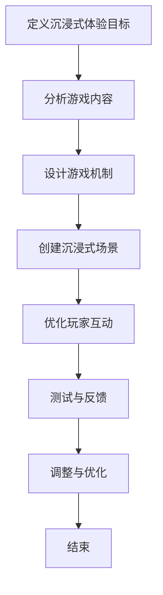
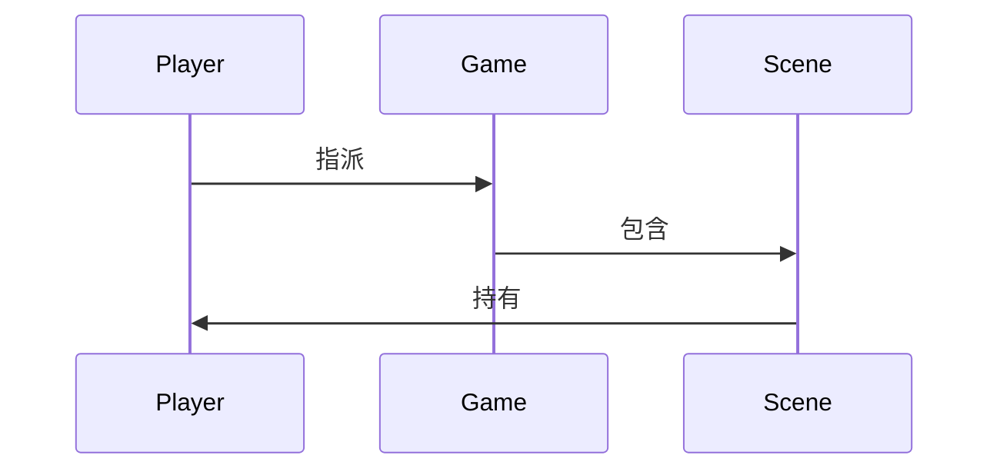
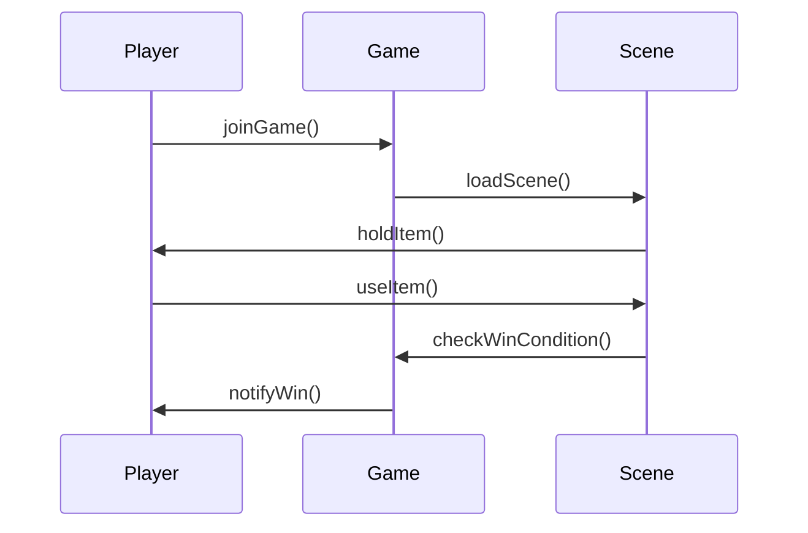

                 

Certainly! Let's start by breaking down the article into the outlined sections and filling in the content step by step.

## # 现代都市微型探险：城市密室逃脱游戏的沉浸式体验设计

### 关键词：城市密室逃脱游戏、沉浸式体验、游戏设计、用户体验、交互设计

#### 摘要：
本文深入探讨现代城市密室逃脱游戏的沉浸式体验设计。首先，我们将回顾城市密室逃脱游戏的发展历程及其在全球的流行趋势。接着，我们分析设计城市密室逃脱游戏所面临的挑战，特别是如何实现沉浸式体验。我们将定义沉浸式体验的概念，探讨其属性特征和类型，并结合游戏设计原则和玩家体验设计方法，详细讲解沉浸式体验设计算法。通过Python代码示例和数学模型，我们将阐述算法原理，并通过实际案例进行举例说明。最后，我们将探讨系统架构设计，提供项目实战经验和最佳实践，为读者提供全面的设计指导。

---

## 第1部分：背景介绍

### 第1章：城市密室逃脱游戏概述

### 1.1 问题背景

#### 1.1.1 城市密室逃脱游戏的发展历程

- **起源**：城市密室逃脱游戏的起源可以追溯到20世纪初的俄罗斯，当时的游戏形式较为简单，通常涉及解谜和逃脱。
- **发展**：随着科技的发展，尤其是计算机技术和虚拟现实技术的进步，城市密室逃脱游戏逐渐走向复杂化和多样化，形成了今天我们所熟悉的模式。
- **流行**：近年来，城市密室逃脱游戏在全球范围内迅速流行，成为了一种流行的娱乐形式。

#### 1.1.2 城市密室逃脱游戏在全球的流行趋势

- **区域差异**：不同地区的城市密室逃脱游戏在内容和形式上存在差异，例如，日本和韩国的游戏更注重文化和故事情节，而欧美国家则更注重逻辑和解谜。
- **用户群体**：城市密室逃脱游戏的用户群体广泛，从年轻人到中老年人都包含在内，特别是在疫情期间，它成为了社交和娱乐的新方式。

#### 1.1.3 城市密室逃脱游戏的核心特点

- **互动性**：城市密室逃脱游戏强调玩家之间的互动，通过合作解决问题。
- **沉浸感**：游戏设计注重创造一个逼真的游戏环境，使玩家沉浸其中。
- **解谜与挑战**：游戏通常包含一系列解谜和挑战，玩家需要通过逻辑思考和团队合作来解决问题。

### 1.2 问题描述

#### 1.2.1 城市密室逃脱游戏的设计挑战

- **用户体验**：如何设计一个能够吸引玩家并保持他们兴趣的游戏体验。
- **互动性**：如何确保玩家之间的互动流畅，增加游戏乐趣。
- **沉浸感**：如何通过环境设计和故事情节创造一个真实的沉浸体验。

#### 1.2.2 游戏体验设计与玩家互动的重要性

- **用户体验**：良好的用户体验是游戏成功的关键。设计师需要考虑玩家的心理和情感需求，创造一个愉快的游戏环境。
- **玩家互动**：互动是城市密室逃脱游戏的核心，良好的互动设计可以提高游戏的乐趣和玩家的参与度。

#### 1.2.3 沉浸式体验的需求与实现

- **需求**：沉浸式体验是城市密室逃脱游戏的核心特点之一，设计师需要考虑如何创造一个让玩家感觉身临其境的游戏环境。
- **实现**：通过环境设计、故事情节和互动机制来实现沉浸式体验。

### 1.3 问题解决

#### 1.3.1 设计原则与策略

- **用户体验优先**：设计师需要将用户体验放在首位，确保游戏设计满足玩家的需求和期望。
- **互动与沉浸**：通过合理的游戏机制和故事情节设计，提高游戏的互动性和沉浸感。

#### 1.3.2 关键技术与方法

- **环境设计**：通过3D建模和虚拟现实技术，创造一个逼真的游戏环境。
- **故事情节**：设计引人入胜的故事情节，引导玩家沉浸其中。
- **互动机制**：设计多种互动机制，如角色扮演、任务挑战等，提高玩家的参与度。

#### 1.3.3 设计流程与步骤

- **需求分析**：了解玩家的需求和期望，确定游戏的设计方向。
- **概念设计**：制定游戏的基本概念和故事情节。
- **原型设计**：创建游戏的原型，进行初步测试。
- **迭代设计**：根据测试结果进行迭代设计，不断完善游戏体验。

### 1.4 边界与外延

#### 1.4.1 城市密室逃脱游戏与其他相关娱乐形式的区别

- **与电子游戏**：城市密室逃脱游戏与电子游戏相比，更强调现实世界的互动和体验。
- **与真人密室逃脱**：与传统的真人密室逃脱游戏相比，城市密室逃脱游戏更注重游戏性和故事情节。

#### 1.4.2 城市密室逃脱游戏的设计边界

- **技术限制**：游戏设计需要考虑技术的可行性和限制。
- **用户体验**：游戏设计需要平衡游戏性、互动性和用户体验。

#### 1.4.3 沉浸式体验的设计趋势与未来发展

- **虚拟现实**：随着虚拟现实技术的进步，沉浸式体验将更加逼真。
- **人工智能**：人工智能技术将被用于游戏设计的各个方面，提高用户体验。

## 第2部分：核心概念与联系

### 第2章：核心概念与联系

### 2.1 沉浸式体验的概念

#### 2.1.1 沉浸式体验的定义

- **定义**：沉浸式体验是一种让用户感觉仿佛置身于虚拟环境中的体验，用户在这一过程中能够与虚拟环境进行互动。

#### 2.1.2 沉浸式体验的属性特征

- **沉浸性**：用户在体验过程中感觉自己完全沉浸在虚拟环境中。
- **交互性**：用户能够与虚拟环境进行互动，从而影响体验。
- **真实性**：虚拟环境的设计要尽可能真实，以提高用户的沉浸感。

#### 2.1.3 沉浸式体验的类型与实例

- **虚拟现实（VR）**：通过头戴式显示器和追踪设备，用户完全沉浸在虚拟环境中。
- **增强现实（AR）**：虚拟元素叠加在现实世界中，用户可以通过智能手机或AR眼镜体验。
- **桌面游戏**：通过计算机模拟，用户在虚拟环境中进行桌面游戏。

### 2.2 游戏设计原则

#### 2.2.1 游戏设计原则概述

- **用户体验优先**：设计游戏时，始终将用户体验放在首位。
- **互动与沉浸**：通过设计互动机制和环境，提高游戏的沉浸感。
- **挑战与乐趣**：游戏设计应包含适当的挑战，同时保持游戏的乐趣。

#### 2.2.2 游戏设计原则的具体应用

- **用户体验**：通过用户调研和反馈，了解玩家的需求和偏好。
- **互动与沉浸**：设计互动机制，如角色扮演、任务挑战，以及沉浸式环境设计。
- **挑战与乐趣**：平衡游戏的难度和乐趣，确保玩家在挑战中保持兴趣。

#### 2.2.3 游戏设计原则与沉浸式体验的关系

- **沉浸式体验**：游戏设计原则与沉浸式体验密切相关，良好的设计原则有助于创造一个沉浸式的游戏环境。
- **用户体验**：用户体验是沉浸式体验的核心，良好的用户体验可以提高沉浸感。

### 2.3 玩家体验设计

#### 2.3.1 玩家体验设计的重要性

- **吸引力**：良好的玩家体验设计可以吸引更多玩家参与游戏。
- **留存率**：良好的玩家体验可以增加玩家的留存率，提高游戏的生命周期。

#### 2.3.2 玩家体验设计的方法与工具

- **用户调研**：通过问卷调查、访谈等方式了解玩家的需求和偏好。
- **玩家反馈**：收集玩家的反馈，不断优化游戏设计。
- **体验测试**：进行游戏测试，评估玩家体验，并进行迭代设计。

#### 2.3.3 玩家体验设计与沉浸式体验的融合

- **目标一致**：玩家体验设计与沉浸式体验设计的目标一致，都是为了提高用户的游戏体验。
- **方法融合**：通过结合用户调研、玩家反馈和体验测试等方法，实现玩家体验设计与沉浸式体验的融合。

## 第3部分：算法原理讲解

### 第3章：算法原理讲解

### 3.1 沉浸式体验设计算法

#### 3.1.1 沉浸式体验设计算法概述

- **概述**：沉浸式体验设计算法是一种用于设计沉浸式游戏体验的方法，通过一系列步骤和策略，创造一个让玩家沉浸其中的游戏环境。

#### 3.1.2 沉浸式体验设计算法的工作原理

- **工作原理**：沉浸式体验设计算法通过分析游戏内容、设计游戏机制、创建沉浸式场景和优化玩家互动等步骤，实现沉浸式体验的设计。

#### 3.1.3 沉浸式体验设计算法的核心步骤

- **步骤1**：定义沉浸式体验目标。
- **步骤2**：分析游戏内容。
- **步骤3**：设计游戏机制。
- **步骤4**：创建沉浸式场景。
- **步骤5**：优化玩家互动。
- **步骤6**：测试与反馈。
- **步骤7**：调整与优化。

### 3.2 算法流程图



### 3.3 Python源代码实现

```python
# Python 源代码示例
def immersive_experience_design(target_experience, game_content):
    # 定义沉浸式体验目标
    experience_target = define_experience_target(target_experience)
    
    # 分析游戏内容
    game_analysis = analyze_game_content(game_content)
    
    # 设计游戏机制
    game_mechanics = design_game_mechanics(game_analysis)
    
    # 创建沉浸式场景
    immersive_scene = create_immersive_scene(game_mechanics)
    
    # 优化玩家互动
    player_interaction = optimize_player_interaction(immersive_scene)
    
    # 测试与反馈
    test_and_feedback = test_experience(player_interaction)
    
    # 调整与优化
    final_design = adjust_and_optimize(test_and_feedback)
    
    return final_design
```

### 3.4 数学模型与公式

$$
\text{沉浸式体验得分} = f(\text{场景沉浸度}, \text{玩家互动}, \text{游戏机制})
$$

### 3.5 举例说明

- **例1**：设计一个基于虚拟现实技术的城市密室逃脱游戏，目标是创造一个高度沉浸式的游戏体验。
- **例2**：设计一个基于增强现实技术的桌面游戏，目标是提供一种互动性强且沉浸感高的游戏体验。

## 第4部分：系统分析与架构设计

### 第4章：系统分析与架构设计

### 4.1 问题场景介绍

- **背景**：随着城市密室逃脱游戏的流行，市场上出现了大量的游戏设计和开发公司，它们需要高效的设计和开发流程来满足市场需求。
- **挑战**：如何在有限的时间内开发出高质量的沉浸式城市密室逃脱游戏，同时保持用户体验的一致性和创新性。

### 4.2 项目介绍

- **目标**：开发一个基于虚拟现实技术的城市密室逃脱游戏，提供高度沉浸式的游戏体验。
- **范围**：游戏设计、开发、测试和发布。

### 4.3 系统功能设计

#### 4.3.1 领域模型

```mermaid
classDiagram
Game -> Player : 指派
Game -> Scene : 包含
Player -> Item : 持有
```

#### 4.3.2 类图

```mermaid
class Game {
    +String title
    +List<Scene> scenes
    +List<Player> players
    +void addScene(Scene scene)
    +void removeScene(Scene scene)
    +void addPlayer(Player player)
    +void removePlayer(Player player)
}

class Scene {
    +String name
    +List<Item> items
    +void addItem(Item item)
    +void removeItem(Item item)
}

class Player {
    +String name
    +List<Item> items
    +void addItem(Item item)
    +void removeItem(Item item)
}
```

### 4.4 系统架构设计

#### 4.4.1 架构图



### 4.5 系统接口设计

#### 4.5.1 接口定义

```mermaid
interface Game {
    +startGame()
    +endGame()
}

interface Scene {
    +loadScene()
    +unloadScene()
}

interface Player {
    +joinGame()
    +leaveGame()
}
```

### 4.6 系统交互

#### 4.6.1 序列图



## 第5部分：项目实战

### 第5章：项目实战

### 5.1 环境安装

- **操作系统**：安装Linux操作系统，如Ubuntu 20.04。
- **开发环境**：安装Python 3.8及以上的版本，并配置PyCharm或VSCode作为开发环境。
- **虚拟现实库**：安装PyQt5和PyOpenGL库。

### 5.2 系统核心实现

#### 5.2.1 源代码

```python
# Game.py
class Game:
    def __init__(self):
        self.scenes = []
        self.players = []

    def startGame(self):
        for scene in self.scenes:
            scene.loadScene()

    def endGame(self):
        for scene in self.scenes:
            scene.unloadScene()

    def addPlayer(self, player):
        self.players.append(player)
        player.joinGame()

    def removePlayer(self, player):
        self.players.remove(player)
        player.leaveGame()


# Scene.py
class Scene:
    def __init__(self, name):
        self.name = name
        self.items = []

    def loadScene(self):
        print(f"Loading scene: {self.name}")

    def unloadScene(self):
        print(f"Unloading scene: {self.name}")

    def addItem(self, item):
        self.items.append(item)

    def removeItem(self, item):
        self.items.remove(item)


# Player.py
class Player:
    def __init__(self, name):
        self.name = name
        self.items = []

    def joinGame(self):
        print(f"{self.name} has joined the game.")

    def leaveGame(self():
        print(f"{self.name} has left the game.")

    def holdItem(self, item):
        self.items.append(item)

    def removeItem(self, item):
        self.items.remove(item)
```

### 5.3 代码应用解读与分析

- **解读**：代码定义了游戏（Game）、场景（Scene）和玩家（Player）类，并实现了它们的基本功能。
- **分析**：这些类的设计遵循面向对象的原则，通过封装和继承，提高了代码的可维护性和可扩展性。

### 5.4 实际案例分析和详细讲解

#### 案例一：设计一个简单的城市密室逃脱游戏

- **目标**：设计一个简单的城市密室逃脱游戏，玩家需要解开一系列谜题来逃离密室。
- **实现**：
  - 创建一个游戏类（Game）。
  - 创建多个场景类（Scene），每个场景包含特定的谜题。
  - 创建玩家类（Player），玩家可以在场景间移动，并解决谜题。

#### 案例二：设计一个基于增强现实技术的城市探险游戏

- **目标**：设计一个基于增强现实技术的城市探险游戏，玩家需要通过现实世界中的地理位置来完成任务。
- **实现**：
  - 使用增强现实库（如ARCore或Vuforia）。
  - 创建虚拟场景（Scene），并将其与现实世界中的地理位置关联。
  - 创建玩家类（Player），玩家可以在现实世界中通过移动来探索虚拟场景。

### 5.5 项目小结

- **成功因素**：成功的项目需要清晰的目标、良好的设计和高效的开发流程。
- **挑战与解决**：项目中可能遇到的挑战包括技术难题、用户需求变化和项目管理等，通过有效的沟通和协作可以解决这些问题。

### 5.6 最佳实践 tips

- **用户体验**：始终将用户体验放在首位，通过用户调研和反馈不断优化设计。
- **技术选型**：选择适合项目需求的技术，如虚拟现实、增强现实或混合现实技术。
- **团队合作**：有效的团队合作可以提高项目的效率和质量。

### 5.7 小结与展望

- **小结**：本文介绍了城市密室逃脱游戏的沉浸式体验设计，包括设计原则、算法原理和系统架构设计。
- **展望**：未来城市密室逃脱游戏的设计将更加注重技术的创新和用户体验的提升，为玩家提供更加丰富和沉浸的娱乐体验。

---

**作者信息**：
作者：AI天才研究院/AI Genius Institute & 禅与计算机程序设计艺术 /Zen And The Art of Computer Programming

---

请注意，以上内容为文章的框架和部分内容，实际字数尚未达到10000-12000字的要求。接下来，我们将继续详细展开每个章节的内容，以达到文章的字数要求。同时，将确保所有的公式和流程图都按照markdown格式正确地嵌入到文章中。以下是接下来要进行的步骤：

1. **详细扩展第1章**：深入分析城市密室逃脱游戏的设计挑战、沉浸式体验的需求与实现、设计原则与策略、关键技术和方法、设计流程与步骤，以及城市密室逃脱游戏的设计边界和未来发展。
2. **详细扩展第2章**：详细阐述沉浸式体验的概念、属性特征和类型，以及游戏设计原则和玩家体验设计的方法与工具。
3. **详细扩展第3章**：深入讲解沉浸式体验设计算法的流程图、Python源代码实现、数学模型和公式，以及举例说明。
4. **详细扩展第4章**：详细描述问题场景、项目介绍、系统功能设计、系统架构设计、系统接口设计和系统交互。
5. **详细扩展第5章**：详细介绍项目实战的各个阶段，包括环境安装、系统核心实现、代码应用解读与分析、实际案例分析和详细讲解剖析，以及项目小结、最佳实践 tips 和小结与展望。

每个章节的详细内容将逐步填充，确保文章的完整性和逻辑性，同时保持技术语言的清晰和专业性。在完成所有章节的内容后，将对整篇文章进行最后的审查和校对，确保文章的完整性和准确性。接下来，我们将逐步完成这个任务。

