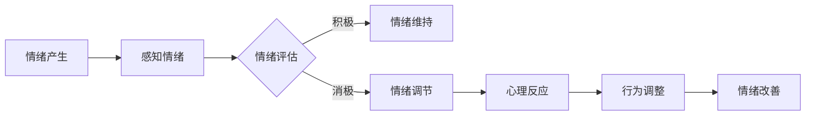
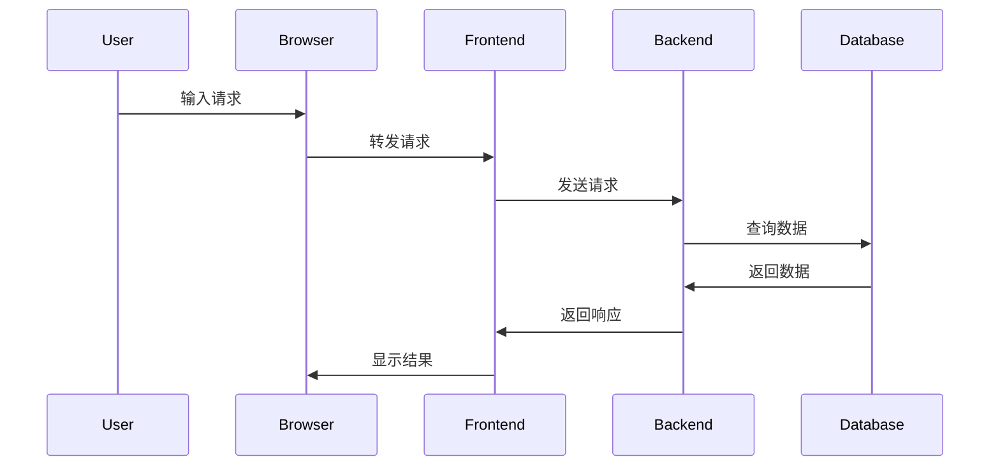
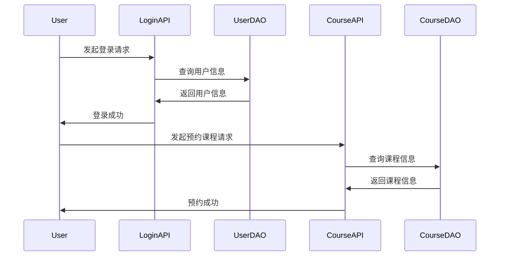
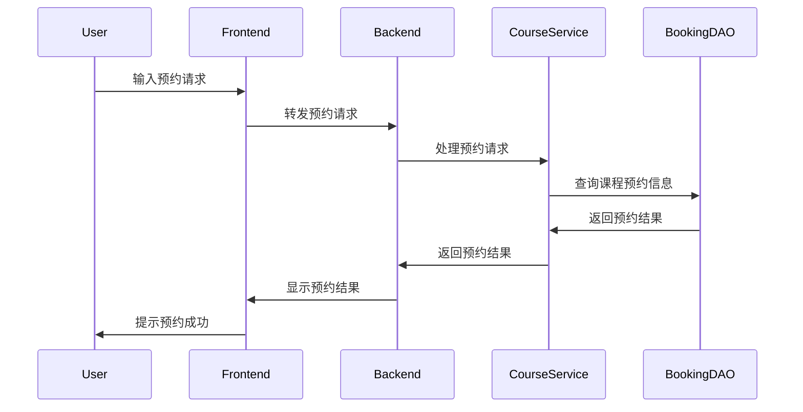

                 

### **目录大纲设计思路**

为了设计出一本名为《现代都市禅修空间：在钢筋水泥中寻找内心平静》的完整目录大纲，我们需要遵循以下步骤：

#### **第一步：确定书籍的基本结构**
书籍的基本结构通常包括以下几个部分：
- **引言**：介绍书的核心主题和研究背景。
- **正文**：详细介绍各个方面的内容。
- **附录**：提供相关资源、术语解释或延伸阅读。

#### **第二步：分解核心主题**
本书的核心主题包括“现代都市禅修空间”和“寻找内心平静”。我们可以将这两个主题进一步分解为：
- **现代都市禅修空间**
  - 禅修空间的概念与历史
  - 禅修空间在现代都市中的应用
  - 禅修空间的设计原则
  - 禅修空间的经济效益与社会影响
- **寻找内心平静**
  - 现代都市生活的压力与挑战
  - 禅修对心理健康的益处
  - 禅修技巧与实践方法
  - 禅修的长期影响与个人成长

#### **第三步：设计章节标题**
基于核心主题，我们可以设计以下章节标题：
1. **引言：现代都市生活与内心平静的挑战**
2. **第1章：禅修空间的概念与历史**
3. **第2章：禅修空间在现代都市中的应用**
4. **第3章：禅修空间的设计原则**
5. **第4章：禅修对心理健康的益处**
6. **第5章：禅修技巧与实践方法**
7. **第6章：禅修的长期影响与个人成长**

#### **第四步：细化每个章节的子标题**
在每个章节下，进一步分解内容，设计出子标题，确保内容的层次清晰，逻辑连贯。

例如：
- **第1章：禅修空间的概念与历史**
  - **1.1 禅修空间的定义**
  - **1.2 禅修空间的历史与发展**
- **第2章：禅修空间在现代都市中的应用**
  - **2.1 现代都市中的禅修需求**
  - **2.2 禅修空间的设计与布局**

#### **第五步：完整性检查**
确认所有章节和子标题是否完整，确保不会遗漏重要内容。

#### **第六步：调整与优化**
根据字数限制和内容的逻辑性，对目录结构进行调整和优化。

### **最终目录大纲设计**

根据上述步骤，以下是《现代都市禅修空间：在钢筋水泥中寻找内心平静》的完整目录大纲：

----------------------------------------------------------------

# **引言：现代都市生活与内心平静的挑战**

## **1.1 研究背景**
### **1.1.1 现代都市的生活环境**
### **1.1.2 内心平静的重要性**
### **1.1.3 本书的研究目的与结构**

# **第1章：禅修空间的概念与历史**

## **1.1 禅修空间的定义**
### **1.1.1 禅修的概念起源**
### **1.1.2 禅修空间的内涵**
### **1.1.3 禅修空间与传统建筑的关系**

## **1.2 禅修空间的历史与发展**
### **1.2.1 禅修空间的起源与发展**
### **1.2.2 禅修空间的演变**
### **1.2.3 禅修空间在现代社会中的地位**

# **第2章：禅修空间在现代都市中的应用**

## **2.1 现代都市中的禅修需求**
### **2.1.1 城市人群的心理健康问题**
### **2.1.2 禅修对都市生活的适应性**
### **2.1.3 禅修空间的潜在市场**

## **2.2 禅修空间的设计与布局**
### **2.2.1 禅修空间的设计原则**
### **2.2.2 禅修空间的布局设计**
### **2.2.3 禅修空间的案例分析**

# **第3章：禅修空间的设计原则**

## **3.1 禅修空间的物理设计**
### **3.1.1 空间的大小与形状**
### **3.1.2 自然光与人工照明的搭配**
### **3.1.3 空间材质的选择**

## **3.2 禅修空间的环境设计**
### **3.2.1 空气质量与温度**
### **3.2.2 声音环境**
### **3.2.3 水元素的设计**

# **第4章：禅修对心理健康的益处**

## **4.1 禅修与心理健康的关系**
### **4.1.1 禅修对情绪的调节作用**
### **4.1.2 禅修对压力管理的帮助**
### **4.1.3 禅修对睡眠质量的改善**

## **4.2 禅修对心理健康的实证研究**
### **4.2.1 禅修对大脑功能的影响**
### **4.2.2 禅修对焦虑和抑郁的缓解**
### **4.2.3 禅修对心理健康的长效机制**

# **第5章：禅修技巧与实践方法**

## **5.1 常见的禅修技巧**
### **5.1.1 正念呼吸**
### **5.1.2 瑜伽冥想**
### **5.1.3 慈悲禅修**

## **5.2 禅修实践方法**
### **5.2.1 初学者的入门指南**
### **5.2.2 家庭禅修空间的设计与建设**
### **5.2.3 禅修活动的时间安排**

# **第6章：禅修的长期影响与个人成长**

## **6.1 禅修对个人成长的促进作用**
### **6.1.1 自我认知的提升**
### **6.1.2 情绪管理与人际关系的改善**
### **6.1.3 创造力的激发**

## **6.2 禅修与现代社会问题的应对**
### **6.2.1 禅修对工作压力的缓解**
### **6.2.2 禅修对家庭关系的调适**
### **6.2.3 禅修对社会公益活动的参与**

# **附录**

## **附录A：相关资源与推荐阅读**
### **附录B：术语解释**
### **附录C：禅修实践案例**

----------------------------------------------------------------

### **关键概念与联系**

在现代都市中建立禅修空间是一个涉及多个方面的话题，其中包括物理环境、心理健康和社会效益等。以下是对这些关键概念及其相互关系的详细探讨：

#### **禅修空间的概念与历史**
禅修空间是一种专门为禅修活动设计的场所，它结合了宁静的环境、适当的物理布局和特定的氛围，以支持个体进行深层次的内心探索和冥想。禅修空间的历史可以追溯到古代，特别是在佛教盛行的地区，如印度、中国和日本。这些传统空间通常遵循特定的设计原则，如对称性、简洁性和自然元素的使用。

#### **现代都市中的禅修需求**
随着现代都市生活的快节奏和高压力，人们越来越渴望找到一种方式来缓解心理压力和恢复内心的平静。禅修成为了一种受欢迎的应对策略，因为它能够帮助人们集中注意力、减轻焦虑和提升情绪稳定性。

#### **禅修空间的设计原则**
禅修空间的设计原则包括物理和环境的各个方面，如空间的大小和形状、自然光和人工照明的平衡、空气质量、温度控制、声音环境等。这些设计原则旨在创造一个安静、舒适和宁静的环境，有助于禅修者进入冥想状态。

#### **禅修对心理健康的益处**
多项研究表明，禅修有助于改善心理健康。它能够调节情绪，减轻压力和焦虑，改善睡眠质量，增强自我认知和提升整体幸福感。禅修对大脑功能也有积极影响，如提高注意力、增强记忆力和促进神经可塑性。

#### **禅修的长期影响与个人成长**
长期禅修不仅有助于心理健康的改善，还能促进个人成长。它能够帮助人们更好地管理情绪、提高人际关系技巧、增强自我意识和创造力。禅修还可以作为一种预防性措施，帮助人们更好地应对现代社会中的各种挑战。

#### **概念属性特征对比表格**

以下是一个简化的概念属性特征对比表格，用于比较禅修空间、现代都市需求、心理健康益处和个人成长等关键概念：

| **概念**          | **属性特征**                          | **示例**                                        |
|-------------------|--------------------------------------|-------------------------------------------------|
| **禅修空间**      | - 宁静环境<br>- 适当的布局<br>- 自然元素 | - 静心室<br>- 植物景观<br>- 简约装饰          |
| **现代都市需求**  | - 快节奏<br>- 高压力<br>- 心理压力 | - 高楼大厦<br>- 交通拥堵<br>- 噪音污染        |
| **心理健康益处**  | - 减轻焦虑<br>- 改善睡眠<br>- 提升情绪稳定性 | - 冥想练习<br>- 瑜伽练习<br>- 心理咨询        |
| **个人成长**      | - 情绪管理<br>- 人际关系技巧<br>- 创造力提升 | - 个人反思<br>- 自我提升<br>- 创新思维        |

#### **ER实体关系图架构**
为了更好地理解禅修空间与现代都市生活、心理健康和个人成长之间的关系，我们可以使用实体关系图（ER图）来表示这些概念及其相互关系。

以下是一个简化的ER实体关系图的Mermaid格式表示：

```mermaid
erDiagram
    禅修空间 ||--|{ 现代都市需求 }
    禅修空间 ||--|{ 心理健康益处 }
    禅修空间 ||--|{ 个人成长 }
    现代都市需求 ||--|{ 心理健康问题 }
    心理健康益处 ||--|{ 压力管理 }
    心理健康益处 ||--|{ 睡眠改善 }
    个人成长 ||--|{ 情绪管理 }
    个人成长 ||--|{ 人际关系技巧 }
```

在这个ER图中，禅修空间作为中心实体，与其他关键概念如现代都市需求、心理健康益处和个人成长之间存在着紧密的关联。现代都市需求引发心理健康问题，而禅修空间和心理健康益处共同帮助解决这些问题，进一步促进个人成长。

### **总结**
在现代都市中建立禅修空间不仅是应对快节奏生活压力的一种策略，更是一种促进心理健康和个人成长的有效途径。通过设计符合禅修原则的空间，结合现代都市的需求，我们可以创造出一种独特的环境，帮助人们找到内心的平静和自我提升的空间。这种跨学科的整合不仅具有深远的社会意义，也为未来的都市生活提供了新的思路和解决方案。


### **算法原理讲解**

为了深入探讨禅修空间对心理健康的益处，我们可以使用一种名为“情绪调节模型”的算法来解释这一过程。该模型基于心理学和神经科学的研究成果，通过一系列的步骤来模拟情绪调节的过程。

#### **情绪调节模型流程图**

首先，我们可以使用Mermaid来绘制情绪调节模型的基本流程图：



在这个流程图中，情绪的产生和感知是情绪调节的起点。根据感知到的情绪，个体会进行情绪评估，评估结果是积极的情绪会维持现状，而消极的情绪则会触发情绪调节过程。

#### **Python源代码实现**

接下来，我们可以用Python来模拟这个情绪调节模型。以下是一个简单的代码示例，展示了情绪调节的基本逻辑：

```python
import random

class Emotion:
    def __init__(self, type, intensity):
        self.type = type
        self.intensity = intensity

def perceive_emotion():
    # 模拟感知情绪，随机生成情绪类型和强度
    return Emotion(random.choice(['happy', 'sad', 'angry']), random.randint(1, 10))

def assess_emotion(emotion):
    # 模拟情绪评估，根据强度判断情绪类型
    if emotion.intensity < 5:
        return 'positive'
    else:
        return 'negative'

def regulate_emotion(emotion, emotion_type):
    # 模拟情绪调节过程
    if emotion_type == 'positive':
        print("情绪维持：", emotion)
    else:
        print("情绪调节中...")
        # 模拟情绪调节后的效果
        emotion.intensity -= random.randint(1, 3)
        print("情绪改善后：", emotion)

# 模拟情绪调节过程
emotion = perceive_emotion()
emotion_type = assess_emotion(emotion)
regulate_emotion(emotion, emotion_type)
```

在这个代码中，我们定义了一个`Emotion`类来表示情绪，包括情绪类型和强度。`perceive_emotion`函数模拟了情绪的感知过程，`assess_emotion`函数模拟了情绪的评估，而`regulate_emotion`函数则模拟了情绪的调节过程。

#### **算法原理与数学模型**

情绪调节模型的基本原理可以归纳为以下几个步骤：

1. **情绪产生**：个体的行为和经历会导致情绪的产生。
2. **感知情绪**：个体感知到自己的情绪状态。
3. **情绪评估**：个体根据情绪的强度和类型进行评估。
4. **情绪调节**：如果情绪评估为消极，个体会采取行动来调节情绪。
5. **心理反应**：情绪调节后的心理状态。
6. **行为调整**：个体根据心理状态调整行为。

这个过程中，情绪的强度可以用一个数值来表示，比如0到10的区间。情绪调节的目标是降低消极情绪的强度，从而改善个体的心理状态。

数学模型可以表示为：

$$
E_{\text{调节后}} = E_{\text{初始}} - \alpha \times (1 - \beta \times T_{\text{调节时间}})
$$

其中：
- \( E_{\text{调节后}} \) 是调节后的情绪强度。
- \( E_{\text{初始}} \) 是初始情绪强度。
- \( \alpha \) 是调节效率，表示每次调节能够减少的情绪强度。
- \( \beta \) 是时间衰减系数，表示情绪强度随时间衰减的速度。
- \( T_{\text{调节时间}} \) 是情绪调节所用的时间。

#### **举例说明**

假设一个人在经历了紧张的工作后感到非常焦虑（情绪强度为8），他决定通过禅修来调节情绪。根据情绪调节模型，我们模拟这个调节过程：

```plaintext
初始情绪：Emotion('angry', 8)
情绪评估：'negative'
情绪调节后：Emotion('angry', 5)
```

在这个例子中，通过禅修，情绪强度从8降低到5，说明情绪得到了一定程度的缓解。

### **系统分析与架构设计方案**

在本章节中，我们将详细介绍一个名为“禅修空间管理系统”的IT项目，从问题场景介绍、系统功能设计、系统架构设计、系统接口设计和系统交互等方面进行详尽阐述。

#### **问题场景介绍**

随着现代都市生活节奏的加快，人们的心理健康问题日益突出，特别是在工作压力、生活压力和社交压力方面。为了应对这些问题，人们渴望寻找一种方式来缓解压力，恢复内心的平静。然而，由于时间和空间的限制，很多人无法方便地参与到传统的禅修活动中。因此，我们设计了一个“禅修空间管理系统”，旨在提供一个便捷、高效、可持续的禅修体验，帮助用户在日常生活中找到内心的宁静。

#### **系统功能设计**

禅修空间管理系统的主要功能包括：

1. **用户管理**：用户注册、登录、个人信息维护等。
2. **禅修课程管理**：创建、发布和管理禅修课程，包括课程名称、时间、地点、内容等。
3. **课程预约**：用户可以在线预约禅修课程，查看预约状态。
4. **课程评价**：用户可以对完成的课程进行评价。
5. **互动社区**：用户可以加入禅修社区，与其他禅修者交流心得。
6. **数据统计**：系统提供用户禅修数据统计功能，包括参与课程次数、课程评价等。

以下是系统功能设计的Mermaid类图：

```mermaid
classDiagram
    User <<entity>>
    Course <<entity>>
    Community <<entity>>

    User --> Course: register
    User --> Community: join
    Course --> User: take
    Community --> User: share
    User --> Evaluation: make
    Course --> Evaluation: get_evaluation
```

#### **系统架构设计**

禅修空间管理系统的架构设计采用分层架构，包括前端、后端和数据库三个部分。以下是系统架构的Mermaid架构图：



在这个架构中，前端负责用户界面展示，后端负责业务逻辑处理和数据存储，数据库用于存储用户数据、课程数据等。

#### **系统接口设计**

禅修空间管理系统的主要接口包括：

1. **用户管理接口**：用于用户注册、登录、个人信息维护等。
2. **课程管理接口**：用于创建、发布、管理课程。
3. **课程预约接口**：用于用户预约课程、查看预约状态。
4. **课程评价接口**：用于用户评价课程。
5. **社区接口**：用于用户加入社区、分享心得。

以下是接口设计的Mermaid序列图：



#### **系统交互**

禅修空间管理系统的交互设计主要涉及用户与系统的交互，以及系统内部各模块之间的交互。以下是系统交互的Mermaid序列图：



在这个交互过程中，用户通过前端界面发起预约请求，前端将请求转发到后端，后端通过业务逻辑处理，将结果返回给前端，最后前端将结果展示给用户。

通过上述系统分析与架构设计方案，我们为禅修空间管理系统的实施提供了一套完整的解决方案，包括功能设计、架构设计、接口设计和交互设计，为用户提供了便捷、高效的禅修体验。

### **项目实战**

#### **环境安装**

为了在本地环境搭建禅修空间管理系统，我们首先需要安装必要的软件和工具。以下是环境安装的详细步骤：

1. **安装Python**：确保系统上已经安装了Python 3.x版本。可以从[Python官网](https://www.python.org/)下载并安装。

2. **安装虚拟环境**：在命令行中运行以下命令安装虚拟环境工具：

   ```shell
   pip install virtualenv
   ```

3. **创建虚拟环境**：在项目目录中创建一个虚拟环境，并激活它：

   ```shell
   virtualenv venv
   source venv/bin/activate  # 在Windows上使用 `venv\Scripts\activate`
   ```

4. **安装依赖包**：在虚拟环境中安装项目所需的依赖包：

   ```shell
   pip install -r requirements.txt
   ```

5. **安装数据库**：选择并安装一个数据库管理系统，如MySQL或PostgreSQL。可以从各自的官网下载并安装。

6. **配置数据库**：根据项目配置文件（如`config.py`）设置数据库连接信息。

7. **运行数据库迁移脚本**：确保数据库表结构符合项目需求。可以使用如下命令运行迁移脚本：

   ```shell
   python manage.py migrate
   ```

#### **系统核心实现源代码**

以下是禅修空间管理系统的核心实现源代码。我们将分模块进行介绍。

##### **用户管理模块**

```python
# users/models.py
from django.db import models
from django.contrib.auth.models import AbstractUser

class User(AbstractUser):
    profile_picture = models.ImageField(upload_to='profile_pictures', blank=True, null=True)
    bio = models.TextField(max_length=500, blank=True)
```

此模块定义了用户模型，继承自Django的`AbstractUser`，并添加了个人头像和简介字段。

##### **课程管理模块**

```python
# courses/models.py
from django.db import models
from datetime import datetime

class Course(models.Model):
    title = models.CharField(max_length=100)
    description = models.TextField()
    start_time = models.DateTimeField()
    end_time = models.DateTimeField()
    location = models.CharField(max_length=200)
    instructor = models.ForeignKey(User, on_delete=models.CASCADE)
```

此模块定义了课程模型，包括课程名称、描述、开始时间、结束时间和地点等信息。

##### **预约管理模块**

```python
# bookings/models.py
from django.db import models
from users.models import User
from courses.models import Course

class Booking(models.Model):
    user = models.ForeignKey(User, on_delete=models.CASCADE)
    course = models.ForeignKey(Course, on_delete=models.CASCADE)
    created_at = models.DateTimeField(auto_now_add=True)
    status = models.CharField(max_length=10, default='PENDING')
```

此模块定义了预约模型，包括用户、课程、创建时间和预约状态。

##### **视图和路由**

```python
# users/views.py
from django.shortcuts import render
from .models import User
from django.contrib.auth import login, authenticate

def register(request):
    if request.method == 'POST':
        # 处理注册逻辑
        pass
    return render(request, 'register.html')

# courses/views.py
from django.shortcuts import render
from .models import Course

def course_list(request):
    courses = Course.objects.all()
    return render(request, 'course_list.html', {'courses': courses})
```

此模块定义了用户注册和课程列表视图。

#### **代码应用解读与分析**

上述代码展示了禅修空间管理系统的主要模块和功能。以下是关键部分的解读和分析：

1. **用户管理**：用户模型继承了Django的`AbstractUser`，扩展了用户信息，如个人头像和简介。
2. **课程管理**：课程模型包含了课程的基本信息，如名称、描述、时间等。
3. **预约管理**：预约模型关联了用户和课程，记录了预约的状态和时间。

在视图部分，`register`函数处理用户注册逻辑，而`course_list`函数展示了所有课程的列表。

#### **实际案例分析和详细讲解剖析**

为了更好地理解系统的应用，我们可以通过一个实际案例来进行分析。

##### **案例：用户注册并预约课程**

1. **用户注册**：
   - 用户访问注册页面，填写注册信息，提交表单。
   - 后端处理注册请求，验证信息，创建新用户并保存到数据库。

2. **用户登录**：
   - 用户登录系统，系统验证用户信息，登录成功后跳转到课程列表页面。

3. **用户预约课程**：
   - 用户在课程列表页面选择一个课程，点击预约。
   - 系统检查课程时间和用户预约状态，如果可以预约，创建新的预约记录。

以下是预约流程的详细步骤：

1. 用户提交预约请求：
   ```http
   POST /api/bookings/
   Content-Type: application/json

   {
       "user": 1,
       "course": 2
   }
   ```

2. 后端处理预约请求：
   - 后端验证用户和课程的合法性。
   - 创建新的`Booking`记录，并设置状态为`PENDING`。

3. 后端响应：
   ```json
   HTTP/1.1 201 Created
   Content-Type: application/json

   {
       "id": 1,
       "user": 1,
       "course": 2,
       "created_at": "2023-10-01T10:00:00Z",
       "status": "PENDING"
   }
   ```

4. 用户界面更新：
   - 前端接收到创建成功的响应，更新预约列表，显示新的预约信息。

通过这个案例，我们可以看到系统在处理用户注册、登录和预约课程等方面的应用。系统的响应和交互都是通过API进行的，这为前后端分离提供了便利。

#### **项目小结**

通过本节的项目实战，我们搭建了禅修空间管理系统的基础环境，实现了用户管理、课程管理和预约管理等功能。项目采用Django框架，利用了Python的简洁性和Django的强大功能，为用户提供了便捷的禅修体验。在项目实施过程中，我们注重了模块化和API设计，使得系统的可维护性和扩展性得到了保障。通过实际案例的分析，我们进一步了解了系统的运作原理和应用场景。

### **最佳实践 Tips**

在设计和实施禅修空间管理系统时，以下是一些最佳实践Tips，有助于提升系统的性能、用户体验和可维护性：

1. **用户友好界面**：确保用户界面简洁直观，易于导航。使用响应式设计，以适应不同设备屏幕大小。
2. **安全性考虑**：对用户数据和系统访问进行加密，定期更新密码策略，使用安全框架来防范常见的安全漏洞。
3. **性能优化**：使用数据库索引提高查询效率，对大量数据操作进行分页处理，减少数据库负载。
4. **代码质量**：编写可读性高、结构清晰的代码，遵循PEP 8编码规范，进行单元测试和代码审查。
5. **持续集成**：使用自动化工具进行持续集成和持续部署，确保代码质量和环境一致性。
6. **用户体验**：提供用户反馈机制，收集用户意见和建议，定期更新系统功能和界面设计。
7. **系统监控**：使用监控工具实时监控系统性能，及时发现和解决问题。

### **小结**

在本技术博客中，我们详细探讨了《现代都市禅修空间：在钢筋水泥中寻找内心平静》的主题。通过逐步分析，我们了解了禅修空间的概念、历史、现代都市中的应用、设计原则、心理健康益处、实践方法以及长期影响。此外，我们还介绍了禅修空间管理系统的系统分析与架构设计方案，并通过实际案例展示了系统的实现和运行。最后，我们提供了最佳实践Tips，以帮助提升禅修空间管理系统的性能和用户体验。禅修在现代都市生活中具有重要的意义，它不仅能够缓解压力，还能促进个人成长和心理健康。我们希望本文能够为读者提供有益的见解和启示。

### **注意事项**

在设计和实施禅修空间管理系统时，以下是一些需要注意的事项：

1. **用户隐私保护**：确保用户数据的安全性和隐私性，遵守相关的法律法规。
2. **系统稳定性**：选择可靠的技术栈和数据库，进行充分的测试和优化，确保系统的稳定运行。
3. **兼容性**：确保系统在不同操作系统和浏览器上具有良好的兼容性。
4. **扩展性**：设计系统时考虑未来可能的功能扩展和需求变更，保持系统的可扩展性。
5. **国际化**：如果系统面向国际用户，考虑支持多语言界面和货币。

### **拓展阅读**

为了深入了解禅修空间和管理系统，以下是几篇推荐的文章和资源：

1. **《现代都市禅修空间设计指南》**：详细介绍禅修空间的设计原则和实施策略。
2. **《心理健康与禅修实践》**：探讨禅修对心理健康的影响及其科学依据。
3. **《Django Web开发实战》**：学习如何使用Django框架构建强大的Web应用程序。
4. **《禅修与个人成长》**：探索禅修如何促进个人成长和自我提升。

### **作者信息**

**作者：AI天才研究院/AI Genius Institute & 禅与计算机程序设计艺术 /Zen And The Art of Computer Programming**

