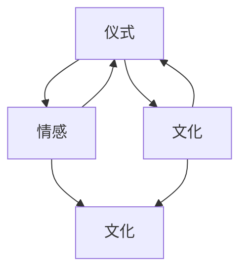

                 

### 文章标题：生命仪式策划师培训：设计现代人生命阶段仪式

#### 关键词：
- 生命仪式
- 现代人生阶段
- 仪式策划
- 设计原理
- 实战案例

#### 摘要：
本文旨在为生命仪式策划师提供一套系统的培训方案，指导如何设计符合现代人生命阶段需求的仪式。通过详细分析现代人的生命阶段和仪式文化的现状，本文将探讨核心概念与联系，讲解仪式设计的基本原则与步骤，并通过实战案例展示如何具体实施。文章还总结了最佳实践与反思，旨在为生命仪式策划提供实用的指导。

### 目录大纲设计思路

设计一本关于生命仪式策划的书籍，我们需要从多个维度进行深入思考和系统规划。以下是本文对目录大纲设计思路的详细阐述：

#### 1. 明确书籍主题
书籍的主题是“生命仪式策划师培训：设计现代人生命阶段仪式”。这个主题明确了书籍的核心内容和目标读者，即如何帮助策划师设计符合现代人生命阶段的仪式。

#### 2. 规划章节结构
根据主题，我们可以将书籍内容分为以下几个主要部分：
- **背景介绍**：介绍现代人的生命阶段、仪式文化的现状以及生命仪式策划的重要性。
- **核心概念与联系**：阐述生命仪式策划中的核心概念，如仪式、情感、文化等，并通过表格和图表展示概念之间的联系。
- **仪式设计原理**：讲解如何设计现代人生命阶段的仪式，包括仪式设计的步骤、原则和方法。
- **实战案例**：通过具体的案例展示如何实施生命仪式策划。
- **最佳实践与反思**：总结实践经验，提出注意事项，并提供拓展阅读。

#### 3. 细化章节内容
在每个主要部分下，我们可以进一步细化章节内容，确保每个章节都有明确的主题和详细的内容。以下是具体的章节细化内容：

### 第一部分：现代生命阶段仪式策划概述

**1.1 现代人的生命阶段与仪式文化**
- **1.1.1 现代人的生命阶段**：介绍现代人的生命周期，包括出生、成长、工作、婚姻、退休等阶段。
- **1.1.2 现代仪式文化的现状**：分析现代社会中仪式文化的现状，探讨其变迁和演变。
- **1.1.3 生命仪式策划的重要性**：阐述生命仪式策划对个人和社会的意义。

**1.2 核心概念与联系**
- **1.2.1 仪式的概念**：定义仪式，解释其本质和功能。
- **1.2.2 情感与文化在仪式中的角色**：探讨情感和文化在仪式设计中的重要性。
- **1.2.3 核心概念的联系与互动**：通过表格和图表展示仪式、情感、文化等概念之间的联系。

**1.3 生命仪式策划的基本原则**
- **1.3.1 个性化定制**：强调仪式设计的个性化和定制化。
- **1.3.2 社会文化适应性**：讨论仪式设计如何适应不同的社会和文化背景。
- **1.3.3 精神内涵的挖掘**：阐述如何挖掘仪式中的精神内涵。

### 第二部分：现代人生命阶段仪式设计原理

**2.1 仪式设计的基本步骤**
- **2.1.1 需求分析**：介绍如何进行需求分析，包括个人需求和背景调查。
- **2.1.2 主题定位**：讲解如何确定仪式的主题，以及主题定位的重要性。
- **2.1.3 场景布置**：探讨如何选择和布置仪式现场，营造合适的氛围。
- **2.1.4 内容设计**：详细讲解仪式的内容设计，包括仪式流程、仪式道具、音乐和表演等。
- **2.1.5 费用预算**：讨论仪式策划中的费用预算，包括预算分配和成本控制。

**2.2 仪式设计的核心原则**
- **2.2.1 个性化定制原则**：强调仪式设计要充分考虑到个人的需求和偏好。
- **2.2.2 社会文化适应性原则**：讨论如何设计适应不同社会和文化背景的仪式。
- **2.2.3 精神内涵挖掘原则**：阐述如何在仪式设计中挖掘和传递精神内涵。

**2.3 不同生命阶段的仪式设计**
- **2.3.1 婚礼仪式设计**：详细讲解婚礼仪式的设计步骤和要点。
- **2.3.2 葬礼仪式设计**：探讨葬礼仪式的设计原则和注意事项。
- **2.3.3 生日仪式设计**：介绍生日仪式的设计思路和实用技巧。
- **2.3.4 其他重要生命事件仪式设计**：包括毕业典礼、就职典礼、寿宴等。

### 第三部分：实战案例展示

**3.1 婚礼仪式策划案例**
- **3.1.1 案例背景**：介绍婚礼策划的背景和需求。
- **3.1.2 仪式设计思路**：展示婚礼仪式的设计思路和方案。
- **3.1.3 案例实施与反馈**：回顾婚礼策划的实施过程和反馈。

**3.2 葬礼仪式策划案例**
- **3.2.1 案例背景**：介绍葬礼策划的背景和需求。
- **3.2.2 仪式设计思路**：展示葬礼仪式的设计思路和方案。
- **3.2.3 案例实施与反馈**：回顾葬礼策划的实施过程和反馈。

**3.3 生日仪式策划案例**
- **3.3.1 案例背景**：介绍生日策划的背景和需求。
- **3.3.2 仪式设计思路**：展示生日仪式的设计思路和方案。
- **3.3.3 案例实施与反馈**：回顾生日策划的实施过程和反馈。

### 第四部分：最佳实践与反思

**4.1 实践经验总结**
- **4.1.1 设计技巧**：总结仪式设计的实用技巧和经验。
- **4.1.2 场景选择**：讨论如何选择合适的仪式场景。
- **4.1.3 情感表达**：探讨如何在仪式中表达情感。

**4.2 注意事项**
- **4.2.1 文化差异**：讨论文化差异对仪式策划的影响。
- **4.2.2 法律法规**：介绍仪式策划中需要遵守的法律法规。
- **4.2.3 预算控制**：讨论如何进行预算控制和成本管理。

**4.3 拓展阅读**
- **4.3.1 生命仪式研究的最新进展**：介绍生命仪式研究的最新动态。
- **4.3.2 国内外生命仪式策划的优秀案例**：分享国内外优秀的生命仪式策划案例。
- **4.3.3 相关书籍和文献推荐**：推荐相关的书籍和文献，供读者进一步学习。

### 总结
通过上述目录大纲的设计，我们可以看出，本书旨在为生命仪式策划师提供一套全面而系统的培训方案。从背景介绍到核心概念，从设计原理到实战案例，再到最佳实践与反思，每个部分都紧密联系，共同构成了一个完整的知识体系。这样的结构设计不仅有助于读者系统地掌握生命仪式策划的知识，还能为他们提供实际操作的指导。

在接下来的章节中，我们将逐一深入探讨每个部分的内容，结合理论讲解和实践案例，帮助读者全面理解生命仪式策划的精髓。通过这样的学习，希望读者能够成为一名优秀且具有创新意识的生命仪式策划师，为现代人生命阶段的仪式设计贡献力量。

### 第一部分：现代生命阶段仪式策划概述

在现代社会中，仪式作为文化传承和社会规范的一部分，承载着重要的社会功能和文化意义。对于生命仪式策划师而言，理解现代人的生命阶段、仪式文化的现状以及生命仪式策划的重要性是进行有效策划的基础。本部分将首先介绍现代人的生命阶段，然后探讨仪式文化的现状，并阐述生命仪式策划的重要性。

#### 1.1 现代人的生命阶段

现代人的生命阶段可以分为以下几个主要阶段：

1. **出生阶段**：包括怀孕、分娩以及新生儿期。这是一个新生命的开始，也是家庭和社会的重要仪式点，如满月宴、百岁宴等。
2. **成长阶段**：从婴儿期到青少年期，个体逐渐学习如何独立生活，并形成自己的价值观。这一阶段的关键仪式包括入学仪式、毕业典礼、成人礼等。
3. **工作阶段**：成年后，个体开始职业生涯，这一阶段包括求职、入职、晋升等。职场中的仪式如就职典礼、年度表彰大会等具有重要意义。
4. **婚姻阶段**：包括求婚、订婚、结婚等。婚姻不仅是两个人爱情的象征，也是家庭和社会认可的仪式。
5. **家庭阶段**：婚姻后，个体和配偶共同建立家庭，生儿育女。家庭聚会、孩子的成长仪式（如入学、毕业等）是这一阶段的重要活动。
6. **退休阶段**：个体从工作岗位上退休，开始享受生活。退休典礼、养老社区活动等是这一阶段的常见仪式。
7. **死亡阶段**：生命的终结是不可避免的，葬礼和悼念仪式在这一阶段发挥着重要作用，帮助家庭成员和社会成员处理悲伤和失去。

#### 1.2 现代仪式文化的现状

随着社会的发展，仪式文化也在不断演变。现代社会中，仪式文化呈现出以下几个特点：

1. **多样化**：现代社会的多元化导致不同文化背景的人有不同的仪式需求。婚礼、葬礼等传统仪式在形式和内容上越来越多样化。
2. **现代化**：传统的仪式在现代社会中逐渐融入现代元素，如电子邀请函、网络直播等技术的应用，使仪式更加便捷和高效。
3. **个性化**：现代人越来越注重个性化和定制化，仪式设计也更加注重满足个体的需求和偏好。
4. **简化**：随着生活节奏的加快，一些繁琐的仪式环节被简化，以节省时间和精力。

#### 1.3 生命仪式策划的重要性

生命仪式策划在现代社会中具有重要的意义：

1. **文化传承**：仪式是文化传承的重要载体，通过仪式可以传递和传承文化价值观。
2. **社会认同**：仪式是社会成员共同参与的活动，通过仪式可以增强社会认同感和凝聚力。
3. **情感表达**：仪式为人们提供了一个表达情感的平台，帮助人们处理生命中的重大事件和情感波动。
4. **精神寄托**：对于逝者，仪式是一种精神寄托，帮助生者缓解悲伤和怀念之情。

通过本部分的介绍，我们可以看出，现代人的生命阶段和仪式文化现状为生命仪式策划提供了丰富的素材和背景。理解这些内容，将为我们在后续章节中的仪式设计提供坚实的理论基础。

### 第一部分：现代生命阶段仪式策划概述（续）

#### 1.2 核心概念与联系

在生命仪式策划中，有几个核心概念需要深入理解，包括仪式、情感、文化等。这些概念不仅相互独立，而且紧密联系，共同构成了生命仪式策划的框架。

**1.2.1 仪式的概念**

仪式是一种文化活动，通常包含一系列有特定意义的符号和行为。它不仅仅是一个简单的活动，而是社会、文化和个人价值观的体现。仪式的目的是通过象征性的行为和符号，强化社会规范、传承文化传统、表达个人情感。

- **功能**：仪式具有多种功能，包括社会功能、文化功能、情感功能等。在社会功能方面，仪式帮助建立社会秩序和规范；在文化功能方面，仪式是文化传承的重要手段；在情感功能方面，仪式为人们提供了一个表达情感和缓解压力的平台。
- **分类**：仪式可以根据不同的标准进行分类。例如，按照功能分类，仪式可以分为庆祝仪式、纪念仪式、仪式化仪式等；按照主题分类，仪式可以分为婚礼、葬礼、生日等。

**1.2.2 情感与文化在仪式中的角色**

情感和文化在仪式中扮演着重要的角色。情感是仪式的核心驱动力，它使仪式具有感染力和影响力。文化则是仪式的背景和支撑，它为仪式提供了意义和框架。

- **情感的作用**：仪式中的情感表达可以增强仪式的感染力，使参与者更加投入和共鸣。情感可以表达个人和集体的悲伤、喜悦、感激等情感状态，从而增强仪式的仪式感。
- **文化的作用**：文化为仪式提供了背景和意义。不同的文化背景会影响仪式的形式、内容、象征意义等。例如，在西方文化中，婚礼通常以浪漫和仪式感为特点，而在东方文化中，婚礼则更注重家族和社会的认同。

**1.2.3 核心概念的联系与互动**

仪式、情感和文化这三个核心概念是相互联系和互动的。

- **仪式与情感**：仪式是情感表达的一种形式，而情感则是仪式的驱动力。仪式中的情感表达不仅增强了仪式的意义，也促进了参与者之间的情感共鸣。
- **仪式与文化**：仪式是文化的重要组成部分，而文化则为仪式提供了背景和意义。仪式中的文化元素，如服饰、音乐、语言等，不仅体现了文化的特点，也增强了仪式的仪式感。
- **情感与文化**：情感和文化之间的互动是复杂的。情感可以反映文化价值观，而文化又可以塑造情感。在仪式中，情感和文化相互作用，共同构建了仪式的内涵和意义。

**通过表格和图表展示概念之间的联系**

为了更直观地展示这三个核心概念之间的联系，我们可以使用表格和图表进行说明。

- **表格**：

| 概念       | 关系           | 说明                                           |
|------------|----------------|------------------------------------------------|
| 仪式       | 情感驱动       | 情感是仪式的核心，仪式是情感的表达形式。           |
| 仪式       | 文化背景       | 仪式是文化的一部分，文化为仪式提供了意义和框架。   |
| 情感       | 文化塑造       | 情感可以反映文化价值观，文化塑造情感表达的方式。   |

- **图表**：

通过上述表格和图表，我们可以清晰地看到仪式、情感和文化这三个核心概念之间的互动关系。这些概念不仅独立存在，而且在实际应用中相互影响，共同构成了生命仪式策划的复杂体系。

**1.2.4 核心概念的联系与互动案例分析**

为了更好地理解核心概念之间的联系，我们可以通过一个案例分析来说明。

- **案例**：某公司的年度表彰大会

在这个案例中，年度表彰大会是一个重要的仪式活动，它既是公司文化的一部分，也是员工情感表达的平台。

- **仪式**：年度表彰大会是一个正式的仪式，包括开场致辞、表彰环节、颁奖典礼、闭幕致辞等。这些环节都有特定的象征意义，如开场致辞代表新的开始，颁奖典礼代表对过去一年努力的认可。

- **情感**：在表彰大会上，员工的情感表达是多样化的。他们可能会感到自豪、感激、紧张或兴奋。这些情感通过颁奖典礼、致辞、音乐、灯光等元素得到了充分的表达和强化。

- **文化**：公司的文化在表彰大会中得到了体现。公司价值观、企业文化、团队精神等通过仪式的形式传达给所有员工。同时，这些文化元素也影响了员工的情感表达和参与度。

通过这个案例，我们可以看到，仪式、情感和文化之间是如何相互联系和互动的。仪式为情感表达提供了一个平台，情感丰富了仪式的内涵，而文化则为仪式提供了背景和意义。

**1.2.5 核心概念的联系与互动总结**

通过对核心概念的联系与互动的详细分析，我们可以得出以下结论：

- **核心概念是相互联系的**：仪式、情感和文化之间存在着紧密的联系和互动。
- **核心概念是仪式策划的基础**：理解这些概念有助于我们更好地进行仪式策划，使仪式更加有意义和富有感染力。
- **核心概念需要综合考虑**：在仪式策划中，我们需要综合考虑这些核心概念，以确保仪式能够满足个人的需求、适应社会的文化背景，并传递正确的情感和文化价值观。

通过本部分的介绍，我们对生命仪式策划中的核心概念有了更深入的理解，这将为我们在后续章节中的具体策划工作提供重要的理论支持。

### 第一部分：现代生命阶段仪式策划概述（续）

#### 1.3 生命仪式策划的基本原则

在生命仪式策划中，为了确保仪式的个性化、文化适应性和精神内涵的挖掘，我们需要遵循一系列基本原则。这些原则不仅指导我们的策划工作，也为仪式的成功实施提供了保障。

**1.3.1 个性化定制原则**

个性化定制原则是生命仪式策划的核心之一。它强调每个仪式都应该根据参与者的具体需求和偏好进行定制，以最大化仪式的个性化和独特性。

- **需求分析**：在策划过程中，首先需要进行详细的需求分析，了解参与者的背景、兴趣爱好、文化背景等。这有助于我们设计出符合个人特点的仪式方案。
- **灵活性**：在仪式设计时，应保持灵活性，允许参与者对仪式的各个环节进行个性化调整。例如，选择适合的仪式主题、音乐、服饰等。
- **情感表达**：个性化定制不仅要考虑形式，更要关注情感表达。仪式应能够充分体现参与者的情感状态，使其在仪式中感到被尊重和关怀。

**1.3.2 社会文化适应性原则**

社会文化适应性原则强调仪式策划需要考虑不同社会和文化背景的影响，确保仪式能够适应不同的文化环境和价值观。

- **文化背景分析**：在策划过程中，需要对参与者的文化背景进行深入分析，了解其文化传统、习俗和价值观。
- **文化融合**：在仪式设计中，应注重文化融合，将不同文化元素有机地结合在一起，使仪式既具有独特的文化特色，又能够被广泛接受。
- **文化敏感度**：策划者应具备较高的文化敏感度，避免触犯参与者的文化禁忌，确保仪式的顺利进行。

**1.3.3 精神内涵挖掘原则**

精神内涵挖掘原则强调在仪式策划中，要深入挖掘仪式背后的精神内涵，使仪式不仅仅是形式上的庆祝或悼念，更具有深刻的文化意义和精神价值。

- **主题定位**：在仪式设计时，需要明确主题，并通过各种符号和元素传达主题的精神内涵。主题应具有普遍性和深度，能够引起参与者的共鸣。
- **情感表达**：仪式中的情感表达应紧扣主题，通过音乐、舞蹈、诗歌等艺术形式，强化仪式的情感内涵。
- **文化传承**：在仪式策划中，应注重文化传承，使仪式成为文化传统的一部分，传递和弘扬文化价值观。

**1.3.4 原则之间的相互关系**

个性化定制原则、社会文化适应性原则和精神内涵挖掘原则之间存在着密切的相互关系。

- **个性化定制与社会文化适应性**：个性化定制和社会文化适应性是相辅相成的。在个性化定制的基础上，考虑社会文化背景，可以使仪式更加贴合实际，被参与者广泛接受。
- **个性化定制与精神内涵挖掘**：个性化定制不仅体现在形式上，还应贯穿于仪式的精神内涵挖掘中。通过深入了解参与者的需求和情感，可以将个性化的元素融入仪式的深度设计，使其更具精神内涵。
- **社会文化适应性与文化内涵挖掘**：社会文化适应性和精神内涵挖掘共同构成了仪式的文化基础。在尊重和融合不同文化背景的同时，深入挖掘仪式的精神内涵，可以使仪式更具有文化价值和意义。

通过上述基本原则，生命仪式策划师可以在策划过程中有章可循，确保仪式的个性化、文化适应性和精神内涵的挖掘。这些原则不仅为策划提供了指导，也为仪式的成功实施奠定了基础。

### 第二部分：现代人生命阶段仪式设计原理

在了解现代人的生命阶段和生命仪式策划的基本原则后，我们需要进一步探讨仪式设计的基本步骤。仪式设计是一个复杂而精细的过程，需要考虑多个方面的因素。本部分将详细讲解仪式设计的基本步骤，包括需求分析、主题定位、场景布置、内容设计、费用预算等。

#### 2.1 仪式设计的基本步骤

**2.1.1 需求分析**

需求分析是仪式设计的首要步骤，它决定了仪式的方向和内容。在进行需求分析时，我们需要收集以下信息：

- **参与者信息**：包括参与者的年龄、性别、文化背景、兴趣爱好等。
- **仪式目的**：明确仪式的目的，例如庆祝、纪念、悼念等。
- **时间与地点**：确定仪式的时间和地点，这会影响到仪式的设计和实施。
- **预算**：了解预算范围，以制定合理的仪式方案。

通过需求分析，我们可以明确仪式的具体需求和目标，为后续的设计提供基础。

**2.1.2 主题定位**

主题定位是仪式设计的核心，它决定了仪式的整体风格和氛围。在确定主题时，我们需要考虑以下几个方面：

- **主题意义**：主题应具有深刻的文化内涵，能够体现仪式的目的和参与者的情感。
- **主题风格**：根据仪式的类型和参与者的偏好，确定主题的风格，例如温馨、隆重、简约等。
- **主题一致性**：确保仪式的各个环节和元素与主题保持一致，营造统一的氛围。

**2.1.3 场景布置**

场景布置是仪式设计中的重要环节，它直接影响到参与者的体验和感受。在进行场景布置时，我们需要考虑以下几个方面：

- **场地选择**：根据仪式的主题和参与者的需求，选择合适的场地，如室内或室外、正式或非正式等。
- **装饰设计**：根据主题和风格，设计合适的装饰，包括灯光、布景、花卉等。
- **座位安排**：合理规划座位，确保参与者能够舒适地参与仪式，并保持良好的视线。

**2.1.4 内容设计**

内容设计是仪式的核心，它决定了仪式的流程和细节。在进行内容设计时，我们需要考虑以下几个方面：

- **仪式流程**：根据主题和目的，设计合理的仪式流程，确保各个环节有序进行。
- **仪式道具**：根据仪式的类型和主题，选择合适的仪式道具，如音乐、舞蹈、诗歌等。
- **仪式语言**：使用恰当的语言，传递主题和情感，确保仪式的感染力和吸引力。

**2.1.5 费用预算**

费用预算是仪式设计中的重要环节，它关系到仪式的可行性和实施效果。在进行费用预算时，我们需要考虑以下几个方面：

- **项目清单**：列出仪式的各个项目，包括场地租赁、装饰设计、音乐表演、餐饮服务等。
- **成本估算**：对每个项目进行成本估算，确保预算合理。
- **成本控制**：在预算范围内，通过优化设计和采购，控制成本，确保仪式的顺利进行。

**2.2 仪式设计的核心原则**

在仪式设计过程中，除了基本步骤外，还需要遵循一些核心原则，以确保仪式的成功实施。

**2.2.1 个性化定制原则**

个性化定制原则强调仪式设计要充分考虑到参与者的具体需求和偏好，使仪式具有独特的个性和特色。这包括：

- **参与者参与**：鼓励参与者参与仪式的设计和实施，使其感到被尊重和重视。
- **个性化元素**：在仪式中融入个性化的元素，如特定的音乐、服饰、装饰等，以体现参与者的独特性。

**2.2.2 社会文化适应性原则**

社会文化适应性原则强调仪式设计要考虑到不同社会和文化背景的影响，确保仪式能够被广泛接受。这包括：

- **文化背景分析**：在仪式设计前，对参与者的文化背景进行深入分析，了解其文化传统和习俗。
- **文化融合**：在仪式设计中，注重不同文化元素的融合，使仪式具有多元文化的特点。

**2.2.3 精神内涵挖掘原则**

精神内涵挖掘原则强调在仪式设计中，要深入挖掘仪式背后的精神内涵，使仪式不仅仅是形式上的庆祝或悼念，更具有深刻的文化意义。这包括：

- **主题定位**：确定具有深度和意义感的主题，使仪式具有普遍性的价值。
- **情感表达**：通过音乐、舞蹈、诗歌等艺术形式，强化仪式的情感内涵，使参与者能够深刻体验到仪式的精神。

**2.2.4 可持续性原则**

可持续性原则强调仪式设计要考虑环境和社会的可持续性，避免浪费和过度消费。这包括：

- **环保材料**：使用环保材料和可回收材料，减少对环境的影响。
- **资源优化**：通过优化设计和资源管理，提高资源利用率，减少浪费。

**2.3 不同生命阶段的仪式设计**

在不同的生命阶段，仪式的设计原则和内容也会有所不同。以下是几个关键生命阶段的仪式设计：

**2.3.1 婚礼**

婚礼是人生中的重要仪式，它象征着两个人共同步入婚姻殿堂。婚礼设计需要注重浪漫、温馨和仪式感。

- **主题定位**：通常根据新人的喜好和风格确定婚礼主题，如经典、现代、复古等。
- **场景布置**：选择适合的场地，进行浪漫、精致的装饰，营造温馨的氛围。
- **内容设计**：包括迎宾仪式、婚礼仪式、晚宴等，每个环节都要精心策划，确保仪式的顺利进行。

**2.3.2 葬礼**

葬礼是悼念逝者的仪式，它表达了对逝者的敬意和怀念。葬礼设计需要注重庄重、肃穆和感人。

- **主题定位**：通常根据逝者的生前喜好和家属的要求确定葬礼主题，如传统、现代等。
- **场景布置**：选择适合的场地，进行适当的装饰，营造出庄重、肃穆的氛围。
- **内容设计**：包括告别仪式、追思会、告别仪式等，每个环节都要体现对逝者的尊重和怀念。

**2.3.3 生日**

生日是庆祝生日的仪式，它表达了对生命的珍惜和祝福。生日设计需要注重温馨、欢乐和纪念。

- **主题定位**：通常根据生日者的年龄、喜好和主题确定生日主题，如童年、青春、成年等。
- **场景布置**：选择适合的场地，进行温馨、欢乐的装饰，营造欢乐的氛围。
- **内容设计**：包括生日派对、生日歌曲、礼物交换等，每个环节都要体现对生日者的祝福和关爱。

通过上述步骤和原则，我们可以为现代人生命阶段设计出富有意义和感染力的仪式。在后续的章节中，我们将通过具体的实战案例来进一步展示如何实施这些原则和步骤。

### 第二部分：现代人生命阶段仪式设计原理（续）

#### 2.4 不同生命阶段的仪式设计

在不同的生命阶段，仪式的设计原则和内容会有所不同，以适应各个阶段的特点和需求。以下是几个关键生命阶段的仪式设计示例：

**2.4.1 婚礼**

婚礼是人生中最重要的仪式之一，它标志着两个人正式成为伴侣。婚礼仪式的设计要注重浪漫、温馨和仪式感。

- **主题定位**：婚礼主题应根据新人的喜好和风格来确定。例如，传统中式婚礼、浪漫西式婚礼、现代简约婚礼等。主题定位要体现新人的个性和情感。
- **场景布置**：婚礼场地布置是仪式设计的关键。室内婚礼可以选择华丽、浪漫的装饰，如鲜花、灯光、拱门等。室外婚礼则可以选择自然风光为背景，搭配简约的装饰。
- **内容设计**：婚礼流程通常包括迎宾、入场、主持人致辞、交换誓言、婚礼仪式、晚宴等。每个环节都要精心策划，确保仪式的顺利进行。

**2.4.2 葬礼**

葬礼是悼念逝者的仪式，它表达了对逝者的敬意和怀念。葬礼仪式的设计要注重庄重、肃穆和感人。

- **主题定位**：葬礼主题应根据逝者的生前喜好和家庭要求来确定。例如，传统葬礼、宗教葬礼、环保葬礼等。主题定位要体现对逝者的尊重和缅怀。
- **场景布置**：葬礼场地布置通常选择在室内或室外墓园。室内场所可以选择肃穆的布置，如黑白色调、鲜花、蜡烛等。室外场所则可以在墓园中选择适当的布置。
- **内容设计**：葬礼流程通常包括告别仪式、追思会、告别仪式、火化或土葬等。每个环节都要细致规划，确保仪式的庄严和感人。

**2.4.3 生日**

生日是庆祝生日的仪式，它表达了对生命的珍惜和祝福。生日仪式的设计要注重温馨、欢乐和纪念。

- **主题定位**：生日主题应根据生日者的年龄、喜好和生日类型来确定。例如，儿童生日派对、成人礼、生日庆典等。主题定位要体现生日者的个性特点和庆祝意义。
- **场景布置**：生日场地布置可以根据生日主题来选择。儿童生日派对可以选择卡通、童话主题，成人礼可以选择典雅、精致的布置。
- **内容设计**：生日流程通常包括迎宾、生日歌曲、礼物交换、蛋糕切割、互动游戏等。每个环节都要精心安排，确保生日者的惊喜和欢乐。

**2.4.4 入学典礼**

入学典礼是学生人生中的重要里程碑，它标志着学生正式进入学校生活。入学典礼的设计要注重庄严、激励和纪念。

- **主题定位**：入学典礼主题通常以学校文化和教育理念为基础。例如，学校成立周年纪念、新生入学典礼等。主题定位要体现学校的特色和学生的期望。
- **场景布置**：入学典礼场地布置通常选择在校园内的礼堂或广场。可以布置学校标志、鲜花、横幅等，营造庄严的氛围。
- **内容设计**：入学典礼流程通常包括校长致辞、教师代表发言、新生代表发言、授牌仪式、入学宣誓等。每个环节都要庄重、有序，激励新生。

**2.4.5 毕业典礼**

毕业典礼是学生毕业的重要仪式，它标志着学生完成学业，迈向新的生活阶段。毕业典礼的设计要注重纪念、感恩和激励。

- **主题定位**：毕业典礼主题通常以学校文化和学生经历为基础。例如，校庆纪念、毕业典礼等。主题定位要体现学生的成长和学校的祝福。
- **场景布置**：毕业典礼场地布置通常选择在校园内的礼堂或体育场。可以布置毕业横幅、鲜花、毕业证书等，营造纪念的氛围。
- **内容设计**：毕业典礼流程通常包括校长致辞、教师代表发言、优秀毕业生表彰、毕业生代表发言、毕业歌等。每个环节都要富有情感，表达对学生的祝福和期望。

通过上述对不同生命阶段仪式的设计，我们可以看到，每个阶段的仪式都有其独特的意义和设计要点。生命仪式策划师需要根据实际情况，结合参与者的需求和偏好，精心设计每个阶段的仪式，使其既具有文化内涵，又充满情感和意义。

### 第三部分：实战案例展示

在了解了现代生命阶段仪式设计的原理后，通过具体的实战案例展示可以帮助我们更好地理解如何将这些原理应用到实际操作中。本部分将介绍三个具体的实战案例：婚礼仪式策划、葬礼仪式策划和生日仪式策划。每个案例将包括背景介绍、仪式设计思路、实施过程和反馈。

#### 3.1 婚礼仪式策划案例

**案例背景**：张先生和李小姐是一对即将步入婚姻殿堂的年轻人。他们希望婚礼能够温馨、浪漫且富有个性化，以体现他们的爱情故事和共同的兴趣爱好。

**仪式设计思路**：
- **主题定位**：根据张先生和李小姐的共同爱好，选择“星空主题”作为婚礼的主题。星空象征着无限的希望和美好。
- **场景布置**：选择一个宽敞明亮的室内场地，用星光灯、气球、花卉等装饰，营造出浪漫的氛围。在舞台中央设置一个星空背景板，用于新娘入场和交换誓言。
- **内容设计**：婚礼仪式包括迎宾、新人入场、主持人致辞、交换誓言、戒指仪式、切蛋糕、晚宴等。特别设计了一个“星空之旅”环节，通过一系列互动游戏和视频回忆，让宾客感受到新人的爱情故事。

**实施过程**：
1. **需求分析**：与张先生和李小姐进行详细沟通，了解他们的需求和偏好，制定婚礼策划方案。
2. **主题确定**：确定“星空主题”，并开始准备相关装饰和道具。
3. **场地布置**：在婚礼当天，根据策划方案进行现场布置，确保每个细节都符合预期。
4. **内容实施**：按照策划流程，逐一实施婚礼仪式的各个环节，确保流程顺畅。

**反馈**：张先生和李小姐对婚礼效果非常满意。宾客们也对婚礼的浪漫氛围和创意设计给予了高度评价。婚礼照片和视频成为两人宝贵的回忆。

#### 3.2 葬礼仪式策划案例

**案例背景**：李老先生是一位深受家人和社区尊敬的长者，他突然因病去世，家人决定为他举行一个庄重、感人的葬礼仪式。

**仪式设计思路**：
- **主题定位**：以“敬爱与怀念”为主题，强调对李老先生产生的敬意和怀念。
- **场景布置**：选择一个宽敞的室内礼堂，以黑白色调为主，布置鲜花、蜡烛和纪念牌。在礼堂中央设置一个灵堂，摆放李老先生的遗像。
- **内容设计**：葬礼仪式包括家属致辞、亲朋好友发言、祈祷仪式、告别仪式等。特别设计了一个纪念环节，播放李老先生的生平事迹视频，让在场的所有人缅怀他的贡献和美好时光。

**实施过程**：
1. **需求分析**：与家属沟通，了解葬礼的具体要求和期望。
2. **主题确定**：确定“敬爱与怀念”主题，并准备相关仪式物品和装饰。
3. **场地布置**：在葬礼当天，根据策划方案进行现场布置，确保每个细节都符合预期。
4. **内容实施**：按照策划流程，逐一实施葬礼仪式的各个环节，确保仪式的庄严和感人。

**反馈**：家属对葬礼的效果非常满意，认为仪式设计充分考虑了李老先生的一生和他对家庭、社区的贡献。亲朋好友们也对葬礼的庄严和感人程度表示赞赏。

#### 3.3 生日仪式策划案例

**案例背景**：王女士即将迎来她的50岁生日，她的家人和朋友们决定为她策划一个温馨、难忘的生日派对。

**仪式设计思路**：
- **主题定位**：以“青春永驻”为主题，庆祝王女士的生日，并表达对她的祝福和关爱。
- **场景布置**：选择一个室内宴会厅，布置以绿色和粉色为主，营造出青春、活力的氛围。在宴会厅中央设置一个生日蛋糕台，摆放精美的生日蛋糕。
- **内容设计**：生日派对包括迎宾、主持人致辞、蛋糕切割、礼物交换、互动游戏、生日歌等。特别设计了一个“青春瞬间”环节，通过展示王女士的成长照片和视频，让在场的所有人一起回忆她的美好时光。

**实施过程**：
1. **需求分析**：与王女士及其家人沟通，了解他们对生日派对的期望和偏好。
2. **主题确定**：确定“青春永驻”主题，并开始准备相关装饰和道具。
3. **场地布置**：在生日派对当天，根据策划方案进行现场布置，确保每个细节都符合预期。
4. **内容实施**：按照策划流程，逐一实施生日派对的各个环节，确保活动的顺利进行。

**反馈**：王女士和家人对生日派对的效果非常满意，认为派对设计充满了温馨和惊喜。朋友们也对派对的创意和氛围给予了高度评价。

通过以上三个实战案例，我们可以看到，生命仪式策划师需要根据不同的情况和需求，灵活运用设计原理，精心策划每一个环节，确保仪式的成功实施。这些案例不仅展示了具体的操作过程，也为读者提供了宝贵的经验和启示。

### 第四部分：最佳实践与反思

#### 4.1 实践经验总结

在生命仪式策划的实践中，我们积累了许多宝贵的经验和技巧。以下是一些最佳实践：

**1. 需求分析**：详细的需求分析是成功策划的关键。通过与参与者进行深入沟通，了解他们的需求和偏好，可以确保仪式的个性化。

**2. 主题定位**：明确主题有助于仪式的统一和协调。选择具有深刻文化内涵和情感共鸣的主题，可以提升仪式的意义和吸引力。

**3. 灵活调整**：在仪式策划过程中，灵活调整和适应变化是必要的。遇到突发情况或需求变化时，能够迅速做出反应，确保仪式的顺利进行。

**4. 文化融合**：在仪式设计中，注重不同文化的融合，可以增强仪式的多样性和包容性，使仪式更具有吸引力。

**5. 情感表达**：情感是仪式的核心。通过精心设计的仪式内容和情感表达方式，可以增强仪式的感染力和参与者的情感体验。

**6. 资源优化**：合理规划和利用资源，可以降低成本，提高仪式的效益。通过优化设计和采购，确保每个环节的资源都能发挥最大作用。

#### 4.2 注意事项

在生命仪式策划中，需要注意以下几个方面：

**1. 法律法规**：了解和遵守相关的法律法规，确保仪式的合法性和合规性。特别是在涉及宗教仪式和特定文化习俗时，要特别注意遵守当地的法律和规定。

**2. 文化差异**：尊重不同文化背景的参与者的习俗和禁忌，避免触犯文化禁忌，确保仪式的顺利进行。

**3. 预算控制**：在策划过程中，要合理控制预算，避免过度消费。通过精细预算和管理，确保仪式的财务可持续性。

**4. 安全保障**：确保仪式场地的安全和参与者的人身安全。在仪式准备和实施过程中，要充分考虑安全因素，采取必要的安全措施。

**5. 参与者反馈**：在仪式结束后，收集参与者的反馈和建议，这有助于改进今后的策划工作，提高仪式的质量和满意度。

#### 4.3 拓展阅读

为了更好地进行生命仪式策划，以下是一些推荐阅读：

**1. 《仪式的意义与策划》**：这本书详细探讨了仪式的文化意义和策划方法，为生命仪式策划提供了理论支持。

**2. 《现代仪式文化研究》**：这本书分析了现代社会中仪式文化的变迁和演变，有助于理解现代人的生命仪式需求。

**3. 《生命仪式策划实战手册》**：这是一本实用的工具书，提供了大量的实战案例和策划技巧，适合生命仪式策划师参考。

**4. 《世界各地的婚礼习俗》**：这本书介绍了世界各地婚礼的习俗和传统，有助于策划具有国际视野的生命仪式。

通过这些拓展阅读，读者可以进一步深入了解生命仪式策划的相关理论和实践，提升自己的策划能力和专业水平。

### 总结

通过本文的详细探讨，我们可以看到，生命仪式策划不仅是文化传承和情感表达的载体，也是社会认同和精神寄托的重要方式。本文从现代人的生命阶段、仪式文化的现状、核心概念与联系、仪式设计原理到实战案例展示，系统地介绍了生命仪式策划的各个方面。

在现代社会中，生命仪式策划师的角色越来越重要。他们需要具备丰富的文化知识、深刻的情感洞察和专业的策划能力，以设计出既符合个性化需求，又具有文化内涵的仪式。

通过本文的阅读，读者可以了解到如何进行有效的生命仪式策划，从需求分析到主题定位，从场景布置到内容设计，每一个环节都需要精心策划和执行。同时，实战案例的展示也为读者提供了宝贵的实践经验。

在未来的工作中，生命仪式策划师需要不断学习和实践，以适应不断变化的社会需求和多元化的文化背景。希望本文能为读者提供有价值的指导和启示，帮助他们在生命仪式策划的道路上不断前行。

### 作者信息

**作者：** AI天才研究院/AI Genius Institute & 禅与计算机程序设计艺术 /Zen And The Art of Computer Programming

AI天才研究院致力于推动人工智能技术的发展，以创新和前沿的研究成果为人类生活带来更多可能性。作为人工智能领域的领导者，我们注重深度学习、自然语言处理、机器学习等技术的应用，旨在为各个行业提供智能化解决方案。同时，禅与计算机程序设计艺术作为一种独特的思维方式，强调了程序设计的艺术性和哲学性，为程序员提供了一种更加高效和创造性的编程方法。通过结合人工智能和禅宗哲学，我们希望为读者提供更加全面和深刻的编程体验。

