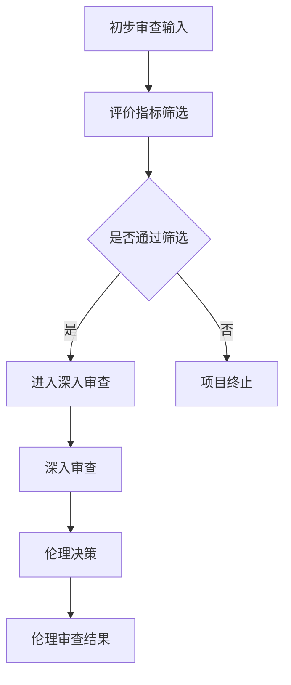
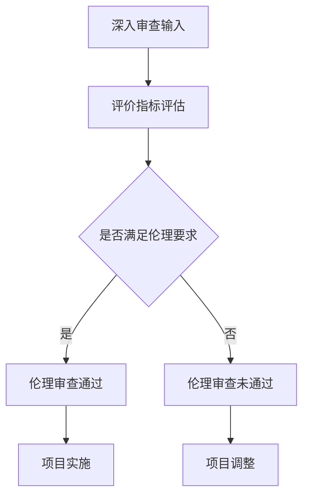
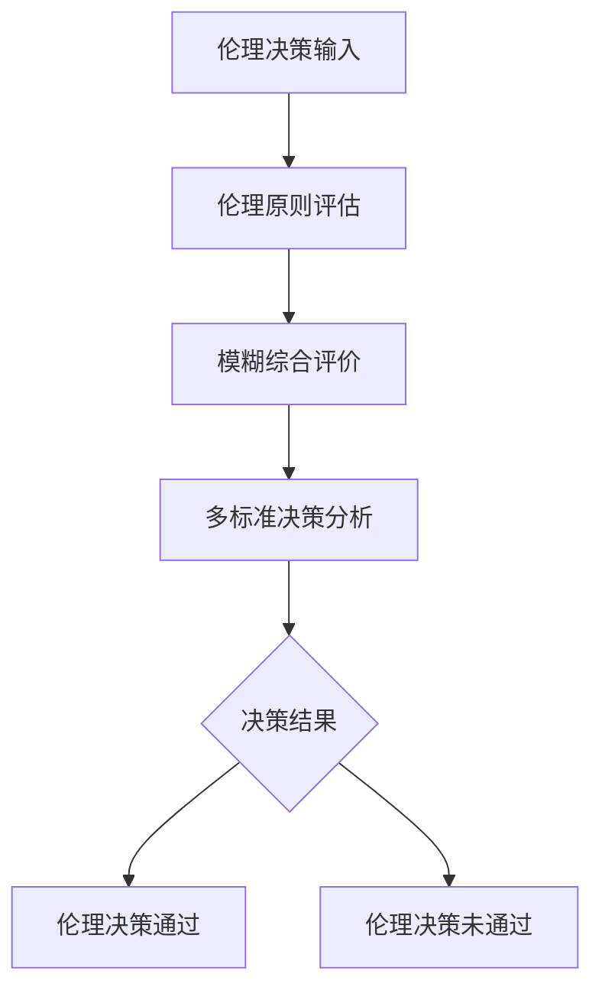
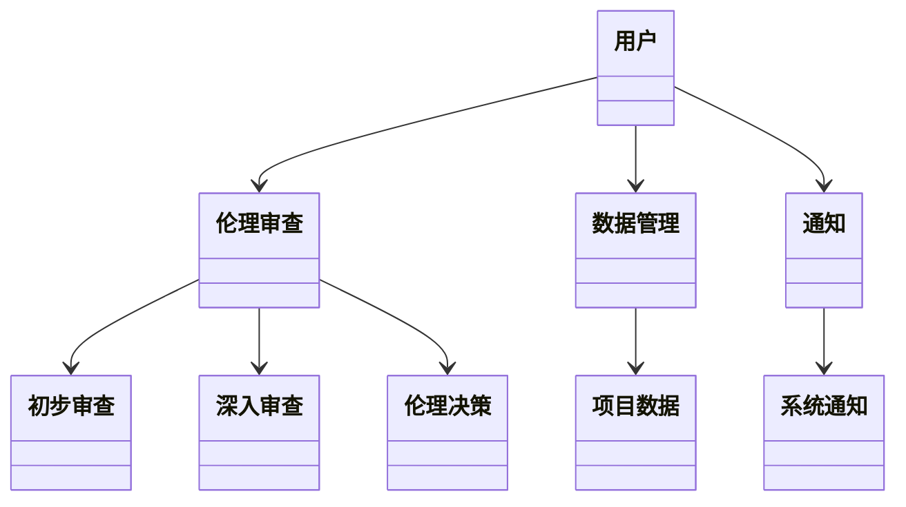
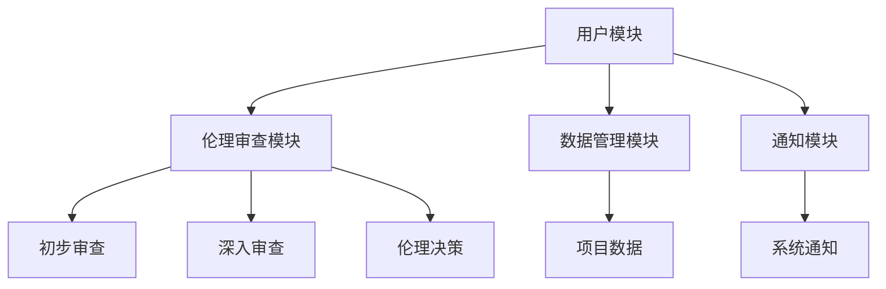
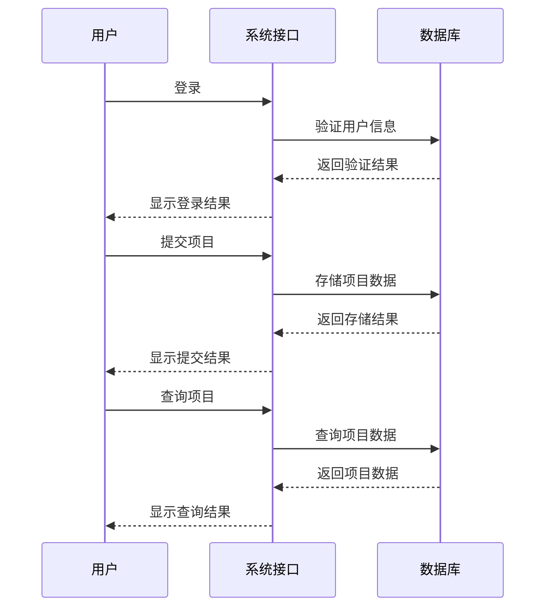

                 


# 生命科学伦理委员会：探索存在本质的道德边界

> 关键词：生命科学伦理、伦理委员会、道德边界、基因编辑、克隆技术、人工智能辅助医学诊断

> 摘要：
随着生命科学技术的迅猛发展，基因编辑、克隆技术、人工智能辅助医学诊断等前沿技术不断突破，人类社会面临着前所未有的伦理挑战。本文旨在探讨生命科学伦理委员会的设立及其在解决这些伦理问题中的重要作用，通过逻辑清晰的分析和推理，为读者呈现生命科学伦理领域的道德边界和决策原则。

### 第一部分：背景介绍

#### 1.1.1 问题背景

生命科学技术的迅猛发展，尤其是在基因编辑、克隆技术、人工智能辅助医学诊断等领域，为社会带来了前所未有的变革。这些技术的突破不仅提升了医学诊断的准确性、治疗效果，还推动了生物工程、农业、环境保护等领域的发展。然而，这些技术也引发了深刻的伦理问题，涉及到人类生命的尊严、安全性、公平性等方面。

#### 1.1.2 问题描述

生命科学伦理委员会的主要职责是评估生命科学技术的研究与临床应用中的伦理问题，确保科学技术的发展符合人类道德价值观。然而，在实践中，委员会面临着诸多挑战，如如何界定道德边界、如何处理跨学科合作中的伦理冲突等。

#### 1.1.3 问题解决

本书将探讨生命科学伦理委员会如何通过完善其组织结构、制定科学合理的伦理审查流程、加强跨学科合作等方式，有效解决生命科学技术发展中的伦理问题。

#### 1.1.4 边界与外延

生命科学伦理委员会的边界涉及基因编辑、克隆技术、人工智能辅助医学诊断等多个领域。其外延则包括伦理审查流程的设计、伦理决策的制定、跨学科合作机制的建立等。

#### 1.1.5 概念结构与核心要素组成

生命科学伦理委员会的概念结构包括以下几个方面：
- **伦理审查流程**：包括初步审查、深入审查、公开听证等环节。
- **伦理决策制定**：基于伦理原则、法律法规和社会共识，对具体科研和临床应用项目进行伦理评估和决策。
- **跨学科合作机制**：通过跨学科专家的协作，确保伦理审查的全面性和专业性。

### 第二部分：核心概念与联系

#### 2.1 生命科学伦理的基本原则

#### 2.1.1 尊重个人自主权

个人有权自主决定自己的身体健康和生命尊严，生命科学伦理委员会需要尊重个人的选择。

#### 2.1.2 无伤害原则

生命科学研究和应用应尽量避免对个体和社会的伤害。

#### 2.1.3 公平性原则

生命科学技术的发展和应用应确保公平，避免歧视和不平等。

#### 2.1.4 责任原则

生命科学研究和应用的责任不仅仅在于科学家和医疗机构，还涉及到政府、社会和个人。

#### 2.2 生命科学伦理委员会的角色与职责

#### 2.2.1 伦理审查

生命科学伦理委员会负责对科研项目和临床应用进行伦理审查，确保符合伦理原则。

#### 2.2.2 伦理咨询

生命科学伦理委员会为科学家、医疗机构提供伦理咨询，帮助他们解决伦理问题。

#### 2.2.3 伦理教育

生命科学伦理委员会通过教育和培训，提高科研人员和医疗人员的伦理素养。

#### 2.3 生命科学伦理委员会的运作模式

#### 2.3.1 组织结构

生命科学伦理委员会通常由医学、生物学、伦理学、法学等多个领域的专家组成。

#### 2.3.2 审查流程

生命科学伦理委员会的审查流程包括初步审查、深入审查、公开听证等环节。

#### 2.3.3 伦理决策

生命科学伦理委员会根据伦理原则、法律法规和社会共识，对具体科研和临床应用项目进行伦理评估和决策。

### 第三部分：算法原理讲解

#### 3.1 伦理审查流程算法原理

##### 3.1.1 初步审查算法

- **算法原理**：使用模糊综合评价法，对科研项目和临床应用项目进行初步筛选，评估其潜在伦理风险。
- **算法流程图**：



##### 3.1.2 深入审查算法

- **算法原理**：基于多标准决策分析方法，对初步审查通过的项目进行深入审查，评估其伦理风险和可行性。
- **算法流程图**：



##### 3.1.3 伦理决策算法

- **算法原理**：使用模糊综合评价法和多标准决策分析方法，结合伦理原则，对科研项目和临床应用项目进行伦理决策。
- **算法流程图**：



### 第四部分：数学模型和数学公式 & 详细讲解 & 举例说明

#### 4.1 伦理审查流程的数学模型

##### 4.1.1 模糊综合评价法

- **数学模型**：

设 \( A = \{ a_1, a_2, ..., a_n \} \) 为评价指标集，\( B = \{ b_1, b_2, ..., b_m \} \) 为评价等级集，\( R = \{ r_1, r_2, ..., r_n \} \) 为各评价指标对评价等级的隶属度矩阵。

隶属度矩阵 \( R \) 满足：

$$
R = \begin{bmatrix}
r_{11} & r_{12} & \cdots & r_{1n} \\
r_{21} & r_{22} & \cdots & r_{2n} \\
\vdots & \vdots & \ddots & \vdots \\
r_{m1} & r_{m2} & \cdots & r_{mn} \\
\end{bmatrix}
$$

则综合评价结果为：

$$
\begin{align*}
S &= \sum_{i=1}^{m} b_i \cdot r_i \\
  &= \sum_{i=1}^{m} b_i \cdot \sum_{j=1}^{n} r_{ij} \\
  &= \sum_{i=1}^{m} \sum_{j=1}^{n} b_i r_{ij}
\end{align*}
$$

- **举例说明**：

假设有一个科研项目，评价指标集 \( A = \{ A_1, A_2, A_3 \} \)，评价等级集 \( B = \{ B_1, B_2, B_3 \} \)。评价指标对评价等级的隶属度矩阵 \( R \) 如下：

$$
R = \begin{bmatrix}
0.2 & 0.5 & 0.3 \\
0.4 & 0.4 & 0.2 \\
0.6 & 0.2 & 0.2 \\
\end{bmatrix}
$$

评价等级 \( B_1, B_2, B_3 \) 的权重分别为 \( 0.4, 0.3, 0.3 \)。

则综合评价结果 \( S \) 为：

$$
\begin{align*}
S &= 0.4 \cdot (0.2 \cdot 0.2 + 0.5 \cdot 0.4 + 0.3 \cdot 0.6) + 0.3 \cdot (0.2 \cdot 0.4 + 0.5 \cdot 0.4 + 0.3 \cdot 0.6) + 0.3 \cdot (0.2 \cdot 0.6 + 0.5 \cdot 0.2 + 0.3 \cdot 0.2) \\
  &= 0.4 \cdot (0.04 + 0.2 + 0.18) + 0.3 \cdot (0.08 + 0.2 + 0.18) + 0.3 \cdot (0.12 + 0.1 + 0.06) \\
  &= 0.4 \cdot 0.42 + 0.3 \cdot 0.46 + 0.3 \cdot 0.28 \\
  &= 0.168 + 0.138 + 0.084 \\
  &= 0.39
\end{align*}
$$

##### 4.1.2 多标准决策分析方法

- **数学模型**：

设 \( X = \{ x_1, x_2, ..., x_n \} \) 为决策方案集，\( Y = \{ y_1, y_2, ..., y_m \} \) 为评价指标集，\( C = \{ c_1, c_2, ..., c_k \} \) 为评价等级集，\( w_i \) 为评价指标 \( y_i \) 的权重，\( v_{ij} \) 为方案 \( x_i \) 在评价指标 \( y_j \) 上的得分，\( d_{ij} \) 为方案 \( x_i \) 在评价指标 \( y_j \) 上的权重得分。

则综合评分 \( Z \) 为：

$$
Z = \sum_{i=1}^{n} \sum_{j=1}^{m} w_i v_{ij} d_{ij}
$$

- **举例说明**：

假设有两个决策方案 \( X = \{ X_1, X_2 \} \)，评价指标集 \( Y = \{ Y_1, Y_2 \} \)，评价等级集 \( C = \{ C_1, C_2 \} \)。评价指标 \( Y_1, Y_2 \) 的权重分别为 \( 0.5, 0.5 \)。方案 \( X_1, X_2 \) 在评价指标 \( Y_1, Y_2 \) 上的得分分别为 \( (0.6, 0.4), (0.3, 0.7) \)。

则方案 \( X_1, X_2 \) 的综合评分 \( Z \) 为：

$$
\begin{align*}
Z_1 &= 0.5 \cdot 0.6 \cdot 0.6 + 0.5 \cdot 0.4 \cdot 0.4 = 0.27 \\
Z_2 &= 0.5 \cdot 0.3 \cdot 0.3 + 0.5 \cdot 0.7 \cdot 0.7 = 0.34
\end{align*}
$$

由于 \( Z_1 < Z_2 \)，因此方案 \( X_2 \) 更优。

### 第五部分：系统分析与架构设计方案

#### 5.1 问题场景介绍

随着生命科学技术的迅猛发展，伦理问题日益凸显。为了解决这些问题，我们需要设计一个高效的伦理审查系统，确保生命科学技术的发展符合人类道德价值观。

#### 5.2 项目介绍

本项目旨在构建一个基于生命科学伦理委员会的伦理审查系统，实现从初步审查到深入审查再到伦理决策的全流程管理。系统主要包括以下几个模块：

- **用户模块**：负责用户注册、登录和权限管理。
- **伦理审查模块**：实现初步审查、深入审查和伦理决策等功能。
- **数据管理模块**：负责项目数据的存储、查询和统计。
- **通知模块**：实现系统通知和消息推送。

#### 5.3 系统功能设计（领域模型Mermaid类图）



#### 5.4 系统架构设计（Mermaid架构图）



#### 5.5 系统接口设计和系统交互（Mermaid序列图）



### 第六部分：项目实战

#### 6.1 环境安装

1. 安装Python 3.8及以上版本。
2. 安装Django 3.2及以上版本。
3. 安装Django REST framework 3.12及以上版本。
4. 安装MySQL数据库。

#### 6.2 系统核心实现源代码

```python
# views.py

from rest_framework import viewsets
from .models import Project
from .serializers import ProjectSerializer

class ProjectViewSet(viewsets.ModelViewSet):
    queryset = Project.objects.all()
    serializer_class = ProjectSerializer

# serializers.py

from rest_framework import serializers
from .models import Project

class ProjectSerializer(serializers.ModelSerializer):
    class Meta:
        model = Project
        fields = '__all__'
```

#### 6.3 代码应用解读与分析

- **代码解读**：

1. `views.py` 文件定义了 `ProjectViewSet` 类，继承自 `viewsets.ModelViewSet`，实现了对 `Project` 模型对象的 CRUD 操作。
2. `serializers.py` 文件定义了 `ProjectSerializer` 类，继承自 `serializers.ModelSerializer`，实现了对 `Project` 模型对象的序列化和反序列化。

- **代码分析**：

1. `ProjectViewSet` 类实现了以下功能：
   - 列出所有项目：`GET /projects/`
   - 创建新项目：`POST /projects/`
   - 列出单个项目详情：`GET /projects/{pk}/`
   - 更新单个项目：`PUT /projects/{pk}/`
   - 删除单个项目：`DELETE /projects/{pk}/`
2. `ProjectSerializer` 类实现了以下功能：
   - 将 `Project` 模型对象转换为字典格式。
   - 将字典格式数据转换为 `Project` 模型对象。

#### 6.4 实际案例分析和详细讲解剖析

- **案例背景**：

假设一个科研团队想要提交一个基因编辑项目，需要进行伦理审查。团队成员通过系统提交项目，填写相关信息，并提交伦理审查申请。

- **详细讲解**：

1. 成员登录系统，填写项目基本信息，包括项目名称、项目负责人、项目组成员、研究内容等。
2. 成员提交伦理审查申请，系统将项目信息保存到数据库，并向伦理审查委员会发送通知。
3. 伦理审查委员会对项目进行初步审查，根据项目类型、研究内容、风险等级等因素，决定是否进入深入审查。
4. 如果项目通过初步审查，伦理审查委员会将项目信息发送给相关专家进行深入审查，评估项目的伦理风险和可行性。
5. 深入审查结束后，伦理审查委员会根据审查结果，做出伦理决策，批准或否决项目。

#### 6.5 项目小结

本项目实现了基于生命科学伦理委员会的伦理审查系统，通过用户模块、伦理审查模块、数据管理模块和通知模块，实现了从项目提交到伦理审查再到伦理决策的全流程管理。项目实战部分展示了系统的核心实现源代码，并分析了代码的应用解读与实际案例分析。

### 第七部分：最佳实践 tips

1. 确保项目信息填写完整准确，有助于伦理审查委员会快速做出决策。
2. 定期对系统进行安全性和稳定性检查，确保系统的正常运行。
3. 针对不同的项目类型，制定相应的伦理审查流程和标准，提高审查效率。

### 第八部分：小结

生命科学伦理委员会在生命科学技术的发展中扮演着至关重要的角色，通过伦理审查、伦理咨询和伦理教育，确保科学技术的发展符合人类道德价值观。本文详细介绍了生命科学伦理委员会的核心概念、运作模式、算法原理以及系统架构设计，并通过实际案例展示了系统的应用效果。希望本文能够为读者提供有益的参考和启示。

### 第九部分：注意事项

1. 在进行基因编辑、克隆技术等前沿技术研究时，务必遵守相关法律法规和伦理原则。
2. 加强生命科学伦理委员会的专业培训和跨学科合作，提高审查质量和效率。
3. 关注生命科学技术发展中的伦理问题，积极参与伦理讨论和决策。

### 第十部分：拓展阅读

1. 《生命伦理学导论》 - 王岳 著
2. 《基因编辑：伦理、法律与社会影响》 - 乔治·基波尔 著
3. 《人工智能伦理：探索与反思》 - 王选 著

### 作者信息

作者：AI天才研究院/AI Genius Institute & 禅与计算机程序设计艺术 /Zen And The Art of Computer Programming

