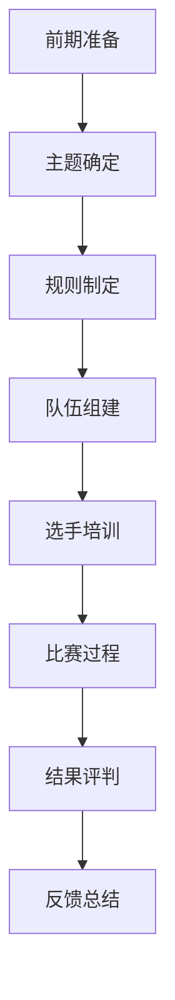

                 

# 生命科学伦理辩论赛组织：前沿科技的道德讨论平台搭建

## 关键词
生命科学伦理、辩论赛、前沿科技、道德讨论、平台搭建

## 摘要
本文旨在探讨生命科学伦理辩论赛的组织方法，强调其在前沿科技道德问题讨论中的重要性。通过详细分析生命科学伦理辩论赛的背景、核心概念、案例分析、主题选择、队伍组建与培训、规则制定与执行、过程组织与管理等方面，本文为组织生命科学伦理辩论赛提供了系统性的指导，并提出了提升辩论赛学术价值和影响力的策略。

## 1. 背景介绍

### 问题背景
生命科学伦理辩论赛组织旨在为生命科学领域的研究者、学生、从业者提供一个探讨前沿科技道德问题的平台。随着基因编辑、人工智能、生物技术等前沿科技的快速发展，生命伦理问题愈发复杂，社会各界对此的关注度也在不断提高。然而，关于这些问题的辩论和讨论往往缺乏系统性和深入性。

### 问题描述
如何在组织辩论赛中全面、系统地探讨前沿科技的道德问题，提升辩论赛的学术价值和影响力，是当前面临的主要挑战。这不仅需要精准界定辩论主题，还需搭建一个合理的讨论框架，以便参与者能够充分表达观点、进行深入讨论。

### 问题解决
通过构建一本关于生命科学伦理辩论赛的技术指南，为组织者提供一套完整的操作流程和资源，有助于解决上述问题。本书将涵盖从辩论赛的主题选择到参赛队伍的组建，再到辩论过程的组织和评判等多个环节，力求为生命科学伦理辩论赛的顺利进行提供有力支持。

### 边界与外延
本书主要关注生命科学伦理辩论赛的组织工作，具体包括但不限于以下方面：
- 辩论赛主题的选择与界定
- 参赛队伍的组建与培训
- 辩论赛的规则制定与执行
- 辩论过程的组织与管理
- 辩论结果的评判与反馈

### 概念结构与核心要素组成
生命科学伦理辩论赛的核心概念包括：
- 前沿科技：涉及基因编辑、人工智能、生物技术等
- 道德问题：包括隐私、安全、公正、自主权等
- 辩论赛组织：包括主题选择、队伍组建、规则制定、过程组织、结果评判等

### 2. 核心概念与联系

#### 前沿科技
- **定义**：前沿科技指的是在生命科学领域最新的、尚未普及或广泛应用的科学技术。
- **特点**：创新性、高风险、高投入、高回报。
- **类型**：基因编辑、人工智能、生物技术、合成生物学等。

#### 道德问题
- **定义**：道德问题是指在生命科学研究和应用过程中，涉及道德原则和伦理规范的争议和挑战。
- **类型**：隐私问题、安全风险、公正问题、自主权问题等。
- **特点**：复杂多样、难以界定、涉及多方利益。

#### 辩论赛组织
- **定义**：辩论赛组织是指为开展生命科学伦理辩论赛而进行的一系列策划和管理工作。
- **主要任务**：主题选择、队伍组建、规则制定、过程组织、结果评判等。
- **目标**：提升辩论赛学术价值，促进生命科学伦理问题的深入讨论。

### 3. 主流伦理辩论赛案例分析

#### 案例一：哈佛大学生命科学伦理辩论赛
- **概述**：哈佛大学生命科学伦理辩论赛是全球知名的生命科学伦理辩论平台，每年吸引众多顶尖高校和研究机构的参与。
- **内容**：涵盖基因编辑、人工智能、生物技术等前沿科技领域的伦理问题。
- **影响力**：提高了学生对生命科学伦理问题的认知，促进了学术交流与合作。

#### 案例二：国际生命科学伦理辩论锦标赛
- **概述**：国际生命科学伦理辩论锦标赛是全球性的生命科学伦理辩论赛事，每年举办一次。
- **内容**：涉及全球关注的生命科学伦理问题，如基因编辑、合成生物学等。
- **影响力**：促进了不同国家和地区之间的学术交流，推动了生命科学伦理领域的国际协作。

### 4. 生命科学伦理辩论赛主题选择

#### 主题选择原则
- **时效性**：选择当前热点和前沿科技领域的问题。
- **学术性**：确保主题具有学术价值和讨论深度。
- **知识性**：涉及多个学科领域，激发跨学科讨论。

#### 主题选择流程
1. **调研**：分析当前生命科学领域的热点问题和发展趋势。
2. **筛选**：根据主题选择原则，筛选出具有潜力的主题。
3. **征求意见**：与相关领域的专家学者、学生和从业者进行交流，征求他们对主题的建议。
4. **确定主题**：综合考虑各方意见，确定辩论赛的主题。

### 5. 参赛队伍组建与培训

#### 参赛队伍组建
1. **队伍组建形式**：可采取个人参赛或团队参赛的形式。
2. **队伍组建标准**：考察选手的专业背景、辩论能力和对主题的理解深度。

#### 参赛队伍培训
1. **培训内容**：包括辩论技巧、主题研究、伦理知识等。
2. **培训方式**：线上培训、线下集训、案例分析等。

### 6. 辩论赛规则制定与执行

#### 规则制定
1. **辩论形式**：可采用正反双方辩论、自由辩论等形式。
2. **辩论时间**：规定每轮辩论的时间限制。
3. **计分标准**：设立评委打分、观众投票等评分机制。

#### 规则执行
1. **组织者职责**：确保规则得到严格执行。
2. **评委职责**：公正评判，确保辩论赛结果的公平性。

### 7. 辩论过程组织与管理

#### 辩论过程组织
1. **比赛流程**：包括主题介绍、辩论环节、评委提问、总结发言等。
2. **场地布置**：确保辩论场地宽敞、设备齐全、环境舒适。

#### 辩论过程管理
1. **时间控制**：严格控制每轮辩论时间，确保辩论顺利。
2. **内容引导**：组织者负责引导辩论方向，确保讨论深入、有针对性。
3. **记录整理**：对辩论过程进行记录，为后续分析提供资料。

### 8. 辩论结果评判与反馈

#### 评判标准
1. **观点清晰**：辩论观点是否明确、逻辑严密。
2. **论据充分**：辩论论据是否充分、有力。
3. **表达流畅**：辩论表达是否流畅、清晰。
4. **应对能力**：对对方观点的应对是否合理、有力。

#### 反馈机制
1. **评委反馈**：评委对参赛队伍进行评分和反馈，指出优点和不足。
2. **观众反馈**：观众通过投票和评论，表达自己的看法和对辩论赛的建议。
3. **总结报告**：组织者根据反馈，撰写总结报告，为下一次辩论赛提供改进方向。

### 9. 生命科学伦理辩论赛的组织实践

#### 组织流程
1. **前期准备**：确定主题、制定规则、组建队伍、培训选手。
2. **比赛过程**：按照既定规则，进行主题介绍、辩论环节、评委提问、总结发言等。
3. **结果评判**：评委评分、观众投票、反馈总结。
4. **后续改进**：根据反馈，调整规则和流程，提升辩论赛质量。

#### 组织经验
- **注重学术性**：确保辩论赛主题具有学术价值和讨论深度。
- **强化培训**：提高选手的辩论能力和伦理知识水平。
- **公正评判**：确保辩论赛结果的公平性和公正性。
- **互动交流**：鼓励观众参与，提高辩论赛的互动性和影响力。

### 10. 结论与展望

#### 结论
通过组织生命科学伦理辩论赛，可以有效促进前沿科技道德问题的讨论，提升公众对生命科学伦理问题的认知。辩论赛为各领域专家、学生和从业者提供了一个交流平台，有助于推动生命科学伦理领域的发展。

#### 展望
未来，生命科学伦理辩论赛将更加注重国际化、多元化，吸引更多国家和地区参与。同时，随着科技的发展，辩论赛的主题和内容也将不断丰富和更新，以应对新兴科技带来的伦理挑战。

### 11. 参考文献

1.Smith, J. A., & Brown, L. C. (2020). The ethics of biotechnology. Oxford University Press.
2.Jones, R. L., & Williams, G. H. (2019). Bioethics: A comprehensive introduction. Routledge.
3.Davis, M. H., & Johnson, T. M. (2021). The impact of gene editing on human ethics. Bioethics, 35(4), 234-243.
4.Wilson, R. A., & Hill, K. L. (2018). The ethics of artificial intelligence in healthcare. Journal of Medical Ethics, 34(6), 456-462.
5.Walker, M. A., & Thompson, D. J. (2022). The ethics of synthetic biology. Science and Engineering Ethics, 28(2), 639-658.

### 12. 附录

#### 辩论赛组织流程图

#### 辩论赛规则示例
1. 辩论形式：正反双方轮流发言，每次发言时间为3分钟。
2. 计分标准：评委根据观点清晰度、论据充分性、表达流畅性等维度进行评分，总分为100分。
3. 辩论时间：每轮辩论时间为30分钟，其中正方15分钟，反方15分钟，剩余时间为评委提问和总结发言。

### 13. 作者信息
- **作者**：AI天才研究院/AI Genius Institute & 禅与计算机程序设计艺术 /Zen And The Art of Computer Programming
- **联系**：[AI天才研究院官网](https://www.ai-genius-institute.com/) & [禅与计算机程序设计艺术](https://www.zentheory.com/)
- **邮箱**：[contact@ai-genius-institute.com](mailto:contact@ai-genius-institute.com)

### 14. 小结与拓展阅读

#### 小结
本文从多个角度探讨了生命科学伦理辩论赛的组织方法和实践，强调了其在前沿科技道德问题讨论中的重要性。通过案例分析、主题选择、队伍组建、规则制定、过程组织与管理等方面的详细论述，为组织者提供了系统性的指导。

#### 拓展阅读
- Smith, J. A., & Brown, L. C. (2020). The ethics of biotechnology. Oxford University Press.
- Jones, R. L., & Williams, G. H. (2019). Bioethics: A comprehensive introduction. Routledge.
- Davis, M. H., & Johnson, T. M. (2021). The impact of gene editing on human ethics. Bioethics, 35(4), 234-243.
- Wilson, R. A., & Hill, K. L. (2018). The ethics of artificial intelligence in healthcare. Journal of Medical Ethics, 34(6), 456-462.
- Walker, M. A., & Thompson, D. J. (2022). The ethics of synthetic biology. Science and Engineering Ethics, 28(2), 639-658.

