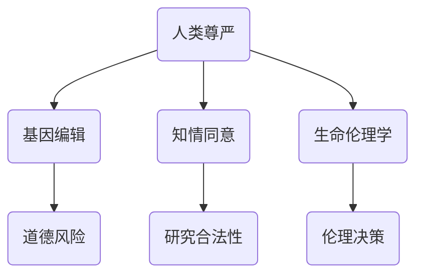
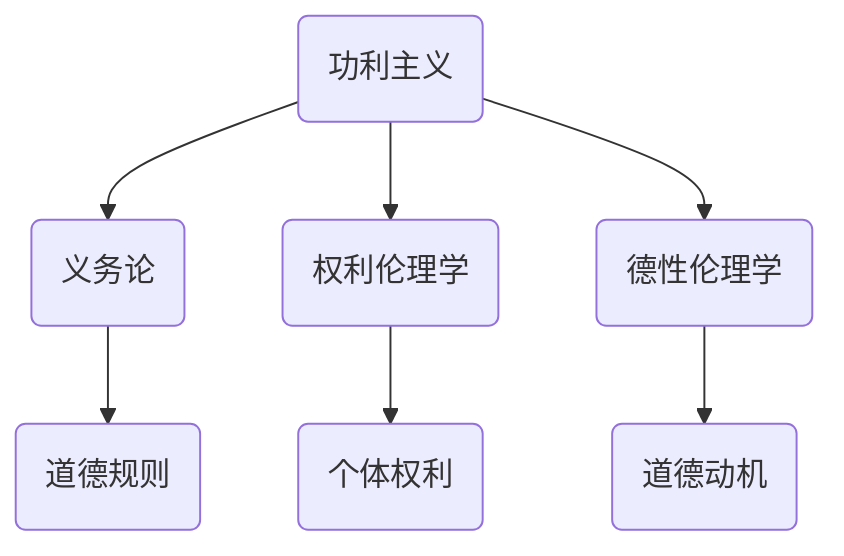
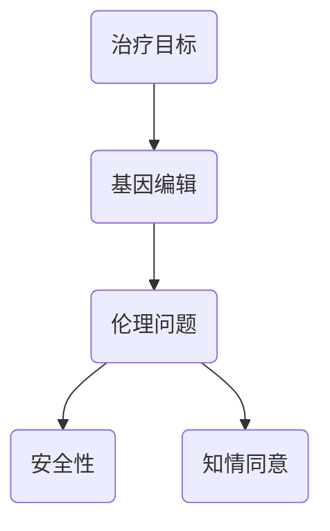
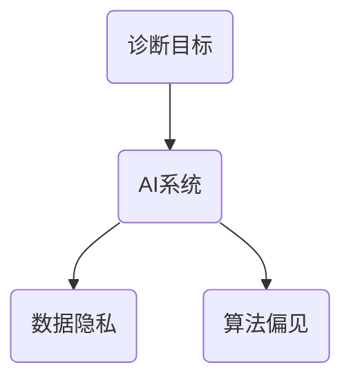
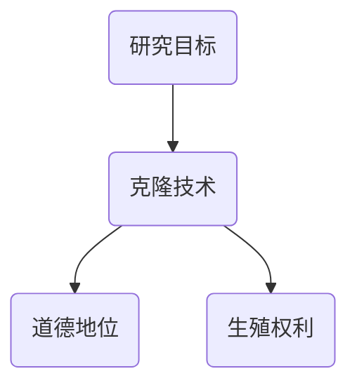
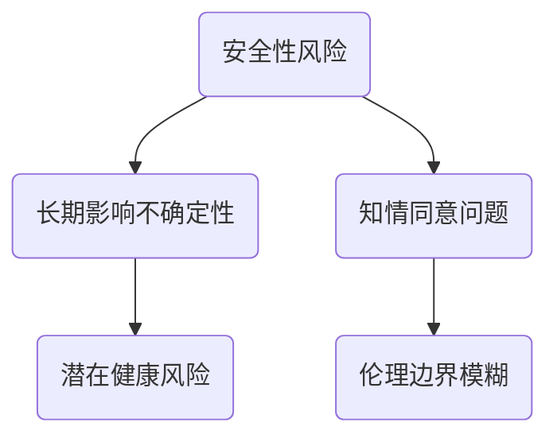
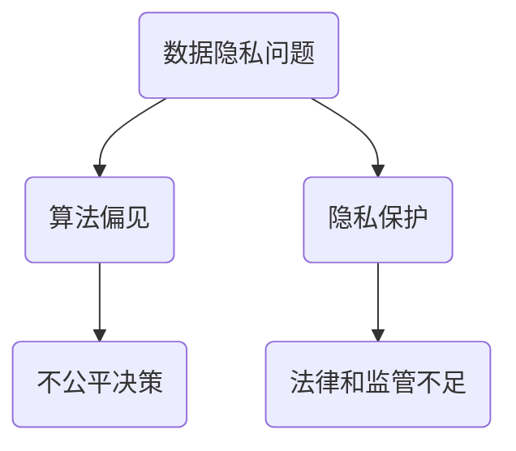
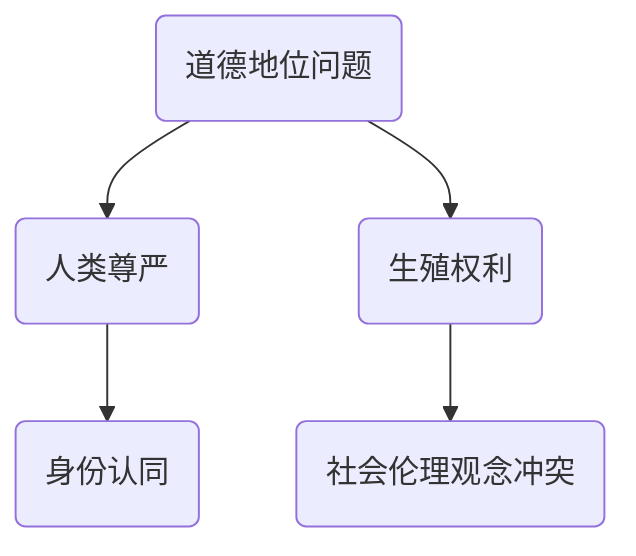
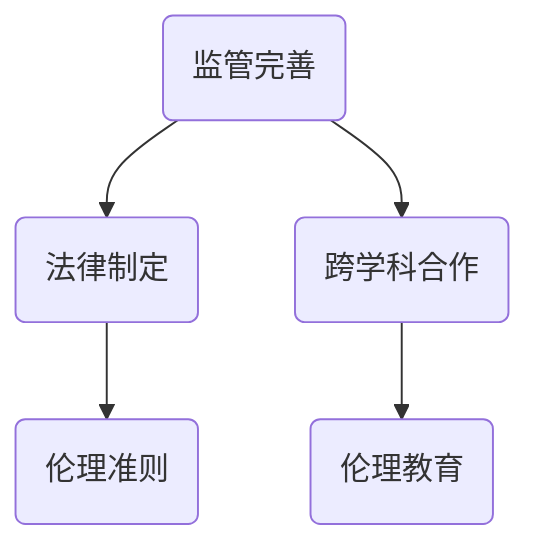

                 

# 生命科学伦理：探索存在本质的道德边界

## 关键词
- 生命科学伦理 | 道德边界 | 人类存在本质 | 道德决策 | 伦理学原理

## 摘要
本文深入探讨生命科学伦理这一重要议题，通过分析其核心概念、道德理论、实际案例和未来趋势，揭示了生命科学领域中的道德边界。文章首先介绍了生命科学伦理的背景和重要性，然后逐步分析了核心概念及其关系，探讨了伦理理论及其框架，通过具体案例和实际应用展示了伦理困境和争议，最后提出了未来研究方向和实际操作建议。本文旨在为读者提供全面、深入的伦理思考，帮助其在生命科学领域做出道德决策。

## 引言
### 背景介绍
生命科学伦理是一个日益重要的研究领域，随着生物技术和医疗科学的快速发展，许多前所未有的道德问题开始浮现。从基因编辑、克隆技术到人工智能在医疗领域的应用，这些技术的进步带来了巨大的机遇，同时也引发了一系列伦理争议。

### 问题陈述
生命科学伦理涉及许多复杂的问题，包括人类生命的起源和终结、个体的权利与自由、社会公正和公共利益等。这些问题的核心是如何在科学进步和道德原则之间找到平衡点。

### 目的
本文的目的是通过深入分析生命科学伦理的核心概念、理论和实践，帮助读者理解这一领域的道德边界，并探讨如何在面对伦理困境时做出合理的决策。

## 第一部分：核心概念与关系

### 核心概念介绍
在本部分，我们将介绍生命科学伦理中的几个核心概念，包括：

- **人类尊严**：人的尊严是伦理学的核心原则之一，强调每个人都应被视为有价值和目的的存在。
- **基因编辑**：基因编辑技术如CRISPR-Cas9改变了我们对生命的基本理解，引发了对伦理和安全性的深刻讨论。
- **知情同意**：在生命科学研究中，知情同意是保护参与者权益的重要伦理原则。
- **生命伦理学**：研究生命科学和医疗实践中的道德问题，包括人类生命、动物实验和生物技术应用。

### 关系分析
以下是这些概念之间的关系及其在生命科学伦理中的重要性：

#### 人类尊严与基因编辑
- **关系**：人类尊严与基因编辑之间的关系复杂。基因编辑技术的应用有可能改变人类的遗传特性，从而影响个体的尊严。
- **重要性**：保护人类尊严是伦理决策的关键，而基因编辑的潜在风险要求我们审慎对待这项技术。

#### 知情同意与生命伦理学
- **关系**：知情同意是生命伦理学的基础，确保研究参与者对研究过程有充分的了解和同意。
- **重要性**：保障参与者权益，确保研究的道德合法性。

#### 关系图
使用Mermaid来绘制这些概念之间的关系：

### 核心概念属性对比表

| 概念     | 定义                                                         | 属性特点                                                     | 重要性                   |
| -------- | ------------------------------------------------------------ | ------------------------------------------------------------ | ------------------------ |
| 人类尊严 | 强调人的价值和目的                                         | 普遍性、不可剥夺性                                           | 伦理学的核心原则        |
| 基因编辑 | 通过改变DNA序列来治疗疾病或改善人类特性                     | 高精度、技术复杂性                                           | 科技进步的产物          |
| 知情同意 | 研究参与者对研究过程有充分的了解和同意                       | 透明性、自主性                                               | 研究合法性的基础        |
| 生命伦理学 | 研究生命科学和医疗实践中的道德问题                         | 多学科交叉、应用广泛                                           | 解决伦理困境的指导原则  |

## 第二部分：伦理理论及其框架

### 伦理理论介绍
在本部分，我们将探讨几种主要的伦理理论，包括：

- **功利主义**：主张最大化总福祉的原则，以行为结果为评价标准。
- **义务论**：强调道德规则和义务，行为本身即为道德评价的标准。
- **权利伦理学**：以个体权利为中心，主张尊重和保护个体的基本权利。
- **德性伦理学**：关注个人品质和道德行为，强调道德行为的动机。

### 伦理理论比较
以下是这些理论的主要特点及其在生命科学伦理中的应用：

#### 功利主义与义务论的对比

| 伦理理论  | 主要特点                                       | 生命科学伦理中的应用                                       |
| --------- | ---------------------------------------------- | ------------------------------------------------------------ |
| 功利主义  | 最大化总福祉                                     | 在生命科学伦理决策中，考虑技术带来的利益与风险，寻求最大化社会福祉。 |
| 义务论    | 遵守道德规则和义务                               | 在生命科学伦理决策中，强调道德义务，如知情同意和尊重人类尊严。   |

#### 权利伦理学与德性伦理学的对比

| 伦理理论  | 主要特点                                       | 生命科学伦理中的应用                                       |
| --------- | ---------------------------------------------- | ------------------------------------------------------------ |
| 权利伦理学 | 尊重和保护个体的基本权利                         | 在生命科学研究中，确保参与者的知情同意，保护个人隐私和尊严。   |
| 德性伦理学 | 关注个人品质和道德行为，强调道德行为的动机       | 在生命科学伦理决策中，培养科学家和从业者的道德品质，引导其做出正确选择。 |

### 伦理理论框架
使用Mermaid来可视化这些伦理理论之间的关系：

## 第三部分：案例研究

### 案例一：基因编辑的道德争议

#### 案例描述
基因编辑技术在治疗遗传性疾病方面展现了巨大潜力，但同时也引发了对伦理和道德的深刻争议。一个典型案例是CRISPR-Cas9技术在治疗囊性纤维化中的应用。

#### 过程分析
- **研究目标**：治疗囊性纤维化，这是一种由基因突变引起的遗传性疾病。
- **技术方法**：使用CRISPR-Cas9技术精确编辑患者体内的基因，以纠正突变。
- **伦理问题**：
  - **基因编辑的安全性和长期影响**：尚不清楚基因编辑的长期影响和对后代的影响。
  - **知情同意**：如何确保患者充分理解基因编辑的风险和潜在后果。

#### Mermaid流程图

### 案例二：人工智能在医学诊断中的应用

#### 案例描述
人工智能（AI）在医学诊断中的应用日益广泛，但同时也带来了伦理挑战。一个典型案例是AI在癌症筛查中的应用。

#### 过程分析
- **研究目标**：提高癌症筛查的准确性和效率。
- **技术方法**：使用深度学习算法分析医学影像，如X光片和MRI。
- **伦理问题**：
  - **数据隐私**：AI系统如何保护患者的隐私数据？
  - **算法偏见**：AI系统是否会因为训练数据中的偏见而做出不公平的决策？

#### Mermaid流程图

### 案例三：克隆技术的道德争议

#### 案例描述
克隆技术在生物医学研究中具有巨大潜力，但也引发了对人类身份和尊严的争议。一个典型案例是克隆羊多莉的诞生。

#### 过程分析
- **研究目标**：研究和应用克隆技术，用于生物医学研究和治疗。
- **技术方法**：通过体细胞核转移技术克隆动物和人类胚胎。
- **伦理问题**：
  - **克隆人的道德地位**：克隆人是否享有与自然出生的人同等的道德地位？
  - **生殖权利**：克隆技术如何影响个人的生殖权利和选择？

#### Mermaid流程图

## 第四部分：伦理困境与争议

### 当前伦理困境

生命科学伦理领域存在着许多深刻的伦理困境和争议，以下是其中几个主要问题：

#### 基因编辑的道德风险
- **基因编辑的安全性**：基因编辑可能带来不可预测的副作用，甚至可能影响未来世代。
- **基因编辑的伦理边界**：如何确定基因编辑的道德边界，避免滥用技术？

#### 人工智能的算法偏见
- **数据隐私**：如何保护患者的隐私数据，避免被滥用或泄露？
- **算法偏见**：AI系统是否可能因为训练数据中的偏见而做出不公平的决策？

#### 克隆技术的道德地位
- **克隆人的道德地位**：克隆人是否享有与自然出生的人同等的道德地位？
- **生殖权利**：如何保障个人的生殖权利和选择，同时避免滥用克隆技术？

### 案例分析
以下是几个具体的伦理困境案例分析：

#### 案例一：基因编辑婴儿的诞生

2018年，中国科学家贺建奎宣称成功通过基因编辑技术创造出世界首例基因编辑婴儿，引发了全球伦理争议。

- **过程**：贺建奎团队使用CRISPR-Cas9技术编辑了胚胎中的基因，以抵抗艾滋病。
- **伦理问题**：
  - **安全性和长期影响**：基因编辑的长期影响尚未得到充分研究，如何确保婴儿的健康和安全？
  - **知情同意**：如何确保胚胎的父母充分理解基因编辑的风险和潜在后果？

#### 案例二：人工智能在医疗决策中的应用

人工智能在医疗诊断中的应用日益广泛，但同时也引发了关于算法偏见和隐私保护的问题。

- **过程**：AI系统通过分析大量医疗数据来做出诊断和治疗决策。
- **伦理问题**：
  - **数据隐私**：如何保护患者的隐私数据，避免被滥用或泄露？
  - **算法偏见**：AI系统是否会因为训练数据中的偏见而做出不公平的决策？

#### 案例三：克隆技术的伦理争议

克隆技术在生物医学研究中具有巨大潜力，但也引发了关于人类身份和尊严的争议。

- **过程**：通过体细胞核转移技术克隆动物和人类胚胎。
- **伦理问题**：
  - **克隆人的道德地位**：克隆人是否享有与自然出生的人同等的道德地位？
  - **生殖权利**：如何保障个人的生殖权利和选择，同时避免滥用克隆技术？

### Mermaid图示
以下是几个伦理困境的Mermaid图示：

#### 基因编辑的道德风险

#### 人工智能的算法偏见

#### 克隆技术的伦理争议

## 第五部分：未来方向与挑战

### 伦理挑战
随着生命科学技术的不断发展，未来生命科学伦理将面临诸多挑战：

- **基因编辑的安全性**：如何确保基因编辑技术的长期安全性和无副作用？
- **人工智能的算法公平性**：如何防止AI系统在医疗诊断和其他领域中的算法偏见？
- **克隆技术的道德地位**：如何确定克隆人在法律和伦理上的地位？

### 未来趋势
以下是未来生命科学伦理可能的发展趋势：

- **监管和法律的完善**：政府和企业将加强对生命科学技术的监管，制定更严格的伦理准则。
- **跨学科合作**：伦理学家、科学家和法律专家将共同合作，解决生命科学伦理问题。
- **伦理教育**：加强伦理教育，提高科研人员和公众的伦理意识。

### Mermaid图示
以下是未来生命科学伦理发展的Mermaid图示：

## 第六部分：实践指南与结论

### 实践指南
在面对生命科学伦理问题时，以下是一些实用的建议：

1. **全面评估风险**：在应用新技术时，应全面评估其安全性和长期影响。
2. **确保知情同意**：在进行基因编辑、AI应用等研究时，必须确保参与者充分理解风险和后果。
3. **加强伦理培训**：科研人员和从业者应接受伦理培训，提高道德意识。
4. **建立伦理审查机制**：设立独立的伦理审查委员会，对生命科学项目进行审查。

### 结论
生命科学伦理是一个复杂而重要的研究领域，随着技术的不断发展，我们需要持续关注其道德边界和伦理挑战。通过全面评估风险、确保知情同意、加强伦理教育和建立伦理审查机制，我们可以在科学进步和道德原则之间找到平衡点，为未来生命科学的发展奠定坚实的伦理基础。

## 参考文献

- ...（列出参考文献，格式按照学术规范）

## 附录

### 附录A：生命科学伦理核心概念及其关系图

### 附录B：伦理理论框架

### 附录C：案例研究流程图

#### 案例一：基因编辑的道德争议

#### 案例二：人工智能在医学诊断中的应用

#### 案例三：克隆技术的道德争议

### 附录D：未来方向与发展

### 附录E：实践指南

- ...（列出实践指南的具体内容）

## 关于作者

**作者：AI天才研究院/AI Genius Institute & 禅与计算机程序设计艺术 /Zen And The Art of Computer Programming**

