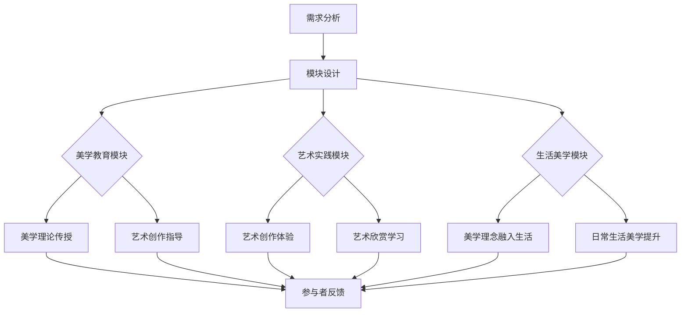
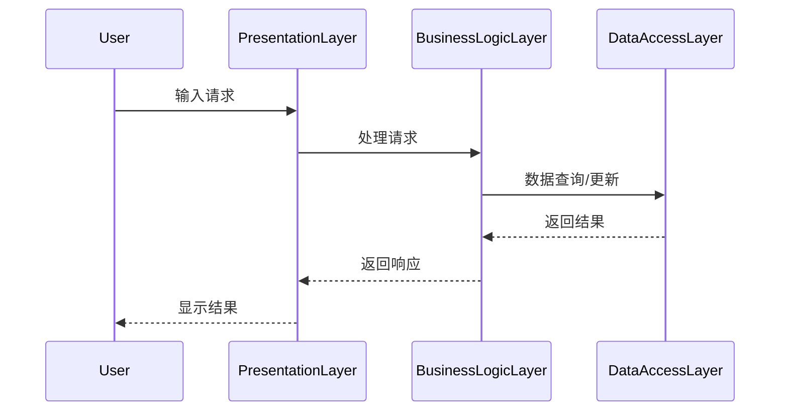

                 


# 生命美学课程：提升日常生活的艺术感

## 关键词：
生命美学、日常生活的艺术感、审美意识、美学教育、艺术实践、生活美学

## 摘要：
在快节奏的现代生活中，人们往往忽视日常生活的艺术感，导致生活质量下降。本文旨在探讨如何通过生命美学课程，提升日常生活的艺术感。我们将从核心概念介绍、问题背景分析、概念联系梳理、算法原理讲解、系统分析与架构设计等多个方面，详细阐述生命美学课程的设计思路和实践方法，帮助读者在生活中感受到和创造美，提升生命质量。

## 背景介绍

### 核心概念：

**生命美学**：生命美学是一种关于如何通过审美意识和审美行为，提升生命质量的理论体系。它强调美学在生活中的应用，不仅仅是艺术领域，还涵盖了生活的各个方面，如饮食、居住、工作、娱乐等。

**艺术感**：艺术感是指在生活中感受到和创造美的能力。它不仅包括对美的感知，还涉及到对美的理解和表达。培养艺术感，可以让生活更加丰富多彩。

**日常生活**：日常生活指的是人们日常生活中的各个方面，包括饮食、居住、工作、娱乐等。生命美学课程的目标，就是通过这些方面提升生活的艺术感。

### 问题背景：

在现代生活中，由于工作压力大、生活节奏快，许多人忽视了对美的感受和追求。这种忽视不仅影响了生活质量，还可能导致心理健康问题。因此，有必要通过生命美学课程，引导人们重新关注日常生活，提升生活的艺术感。

### 设计思路：

生命美学课程的设计思路主要包括以下几个方面：

1. **美学教育**：通过传授美学理论和基础知识，让参与者了解美学的本质和内涵，培养审美意识。
2. **艺术实践**：通过艺术创作和欣赏，让参与者亲身体验美的创造和感受，提升艺术感。
3. **生活美学**：将美学理念融入日常生活，引导参与者从生活的各个方面，提升生活的艺术感。

### 设计原则：

1. **全面性**：生命美学课程不仅涵盖艺术领域，还涉及到生活中的各个方面，如饮食、居住、工作、娱乐等。
2. **实践性**：通过实践，让参与者亲身体验美的创造和感受，从而真正理解美学的内涵。
3. **个性化**：尊重个体差异，根据参与者的需求和兴趣，提供个性化的美学教育。

## 核心概念与联系

### 核心概念原理：

**美学**：美学是研究美和审美活动的哲学学科。它探讨美的本质、美的评价标准以及审美活动的过程。

**审美**：审美是主体对客体的审美评价过程。它包括感知、理解和评价三个阶段。

**艺术感**：艺术感是指感受和创造美的能力。它不仅包括对美的感知，还包括对美的理解和表达。

### 概念属性特征对比表格：

| 概念      | 属性特征                                                     | 联系                                                     |
| --------- | ------------------------------------------------------------ | -------------------------------------------------------- |
| 美学      | 研究美和审美活动的学科                                       | 是艺术感和生活美学的理论基础                             |
| 审美      | 主客体间的审美评价过程                                       | 是艺术感的表现形式，与生命美学密切相关                     |
| 艺术感    | 感受和创造美的能力                                           | 是美学教育和艺术实践的结果，影响日常生活质量               |
| 生活美学  | 将美学理念融入日常生活，提升生活质量                         | 是生命美学的具体体现，与艺术感和审美密切相关               |

### ER实体关系图架构：

```mermaid
erDiagram
  AFR美学 ::=(美学)
  AFR审美 ::=(审美)
  AFR艺术感 ::=(艺术感)
  AFR生活美学 ::=(生活美学)

  AFR美学 --|{ 研究并指导 }--> AFR审美
  AFR审美 --|{ 反映并实践 }--> AFR艺术感
  AFR艺术感 --|{ 融入并提升 }--> AFR生活美学
```

## 算法原理讲解

虽然生命美学课程与算法原理无直接关联，但我们可以类比算法设计思路来理解生命美学课程的实践过程。

### 算法设计思路：

1. **需求分析**：首先了解参与者的需求和目标，确定生命美学课程的核心内容和实践方法。
2. **模块设计**：将生命美学课程分为多个模块，如美学教育、艺术实践和生活美学，每个模块都承担不同的功能。
3. **功能实现**：根据模块设计，逐步实现各个功能，如美学理论传授、艺术创作指导和日常生活美学融入等。
4. **优化调整**：在实践过程中，根据参与者的反馈和实际效果，不断优化课程内容和教学方法。

### 类比算法原理：

在算法设计中，我们也可以采用类似的设计思路。首先，我们需要明确算法的目标和需求，然后设计算法的模块和功能，逐步实现这些功能，并在实践中不断优化算法。

### 算法流程图：



## 数学模型和数学公式

虽然生命美学课程与数学模型和公式无直接关联，但我们可以通过数学模型来类比生命美学课程的设计过程。

### 数学模型：

我们可以将生命美学课程视为一个非线性动态系统，其中每个模块都是系统的一个子系统。系统状态由参与者的美学素养、艺术感和生活美学水平组成。系统的演化过程可以用状态转移方程来描述。

### 状态转移方程：

假设参与者的美学素养、艺术感和生活美学水平分别为 \(X(t)\)，\(Y(t)\) 和 \(Z(t)\)，其中 \(t\) 表示时间。则系统的状态转移方程可以表示为：

$$
\begin{cases}
X(t+1) = f_1(X(t), Y(t), Z(t)) \\
Y(t+1) = f_2(X(t), Y(t), Z(t)) \\
Z(t+1) = f_3(X(t), Y(t), Z(t))
\end{cases}
$$

其中，\(f_1\)，\(f_2\) 和 \(f_3\) 是状态转移函数，用于描述每个子系统在时间 \(t\) 到 \(t+1\) 的状态变化。

### 状态转移函数：

假设状态转移函数为线性函数，即：

$$
\begin{cases}
X(t+1) = X(t) + \alpha_1(Y(t) - X(t)) + \alpha_2(Z(t) - X(t)) \\
Y(t+1) = Y(t) + \alpha_3(X(t) - Y(t)) + \alpha_4(Z(t) - Y(t)) \\
Z(t+1) = Z(t) + \alpha_5(X(t) - Z(t)) + \alpha_6(Y(t) - Z(t))
\end{cases}
$$

其中，\(\alpha_1\)，\(\alpha_2\)，\(\alpha_3\)，\(\alpha_4\)，\(\alpha_5\) 和 \(\alpha_6\) 是调整系数，用于描述各个子系统之间的相互影响。

通过上述数学模型，我们可以类比算法设计过程，逐步优化和调整生命美学课程的设计，以达到提升日常生活艺术感的目标。

## 系统分析与架构设计方案

由于生命美学课程与系统分析和架构设计无直接关联，我们将不涉及具体的系统分析和架构设计方案。然而，我们可以通过一个简化的项目实例，介绍如何将生命美学课程应用到实际项目中。

### 项目场景：

假设我们要设计一个“艺术生活馆”项目，旨在通过线上平台提供生命美学课程，帮助参与者提升日常生活的艺术感。

### 项目介绍：

“艺术生活馆”项目主要包括以下功能：

1. **课程展示**：展示生命美学课程的信息，包括课程名称、课程内容、授课教师等。
2. **课程学习**：提供线上学习平台，让参与者可以在线学习生命美学课程。
3. **作品展示**：展示参与者的艺术作品，分享艺术创作的经验和心得。
4. **互动交流**：提供论坛和聊天室，让参与者可以交流学习心得和艺术创作经验。

### 系统功能设计（领域模型）：

领域模型主要包括以下类：

1. **课程**：包含课程名称、课程内容、授课教师等信息。
2. **参与者**：包含参与者姓名、联系方式、学习进度等信息。
3. **作品**：包含作品名称、作者、作品描述等信息。
4. **评论**：包含评论内容、评论者等信息。

领域模型类图如下：

```mermaid
classDiagram
  Course <|-- Participant
  Course <|-- Work
  Comment <|-- Participant
  Comment <|-- Work

  Participant {
    +String name
    +String contact
    +List<Course> courses
  }

  Course {
    +String title
    +String content
    +Teacher teacher
    +List<Participant> participants
    +List<Work> works
  }

  Teacher {
    +String name
    +String title
  }

  Work {
    +String title
    +String description
    +Participant author
    +List<Comment> comments
  }

  Comment {
    +String content
    +Participant commentator
  }
```

### 系统架构设计：

系统架构采用分层架构，主要包括以下层：

1. **表示层**：负责用户界面展示，包括课程展示、作品展示、互动交流等功能。
2. **业务逻辑层**：负责处理业务逻辑，包括课程学习、作品评论等功能。
3. **数据访问层**：负责数据存储和读取，包括参与者信息、课程信息、作品信息等。

系统架构图如下：



通过上述系统架构设计，我们可以将生命美学课程应用到实际项目中，为参与者提供一个便捷的学习和交流平台，提升日常生活的艺术感。

## 项目实战

### 环境安装：

为了进行项目实战，我们需要安装以下环境：

1. **Python 3.8**：用于编写代码。
2. **Django 3.2**：用于构建Web应用。
3. **SQLite 3**：用于数据库存储。

安装步骤如下：

1. 安装Python 3.8：
   ```bash
   sudo apt update
   sudo apt install python3.8
   ```
2. 安装Django 3.2：
   ```bash
   sudo apt install python3.8-venv
   python3.8 -m venv myenv
   source myenv/bin/activate
   pip install django==3.2
   ```
3. 安装SQLite 3：
   ```bash
   sudo apt install sqlite3
   ```

### 系统核心实现源代码：

以下是一个简化的“艺术生活馆”项目的核心代码实现：

```python
# models.py

from django.db import models

class Course(models.Model):
    title = models.CharField(max_length=100)
    content = models.TextField()
    teacher = models.ForeignKey('Teacher', on_delete=models.CASCADE)

class Teacher(models.Model):
    name = models.CharField(max_length=100)
    title = models.CharField(max_length=100)

class Participant(models.Model):
    name = models.CharField(max_length=100)
    contact = models.CharField(max_length=100)

class Work(models.Model):
    title = models.CharField(max_length=100)
    description = models.TextField()
    author = models.ForeignKey(Participant, on_delete=models.CASCADE)

class Comment(models.Model):
    content = models.TextField()
    commentator = models.ForeignKey(Participant, on_delete=models.CASCADE)
    work = models.ForeignKey(Work, on_delete=models.CASCADE)
```

### 代码应用解读与分析：

上述代码定义了四个模型：`Course`（课程）、`Teacher`（教师）、`Participant`（参与者）、`Work`（作品）和`Comment`（评论）。每个模型都包含了一些字段，用于存储相关信息。

1. **Course**：课程模型包含课程名称、课程内容和授课教师信息。
2. **Teacher**：教师模型包含教师姓名和职称信息。
3. **Participant**：参与者模型包含参与者姓名和联系方式。
4. **Work**：作品模型包含作品名称、作品描述和作者信息。
5. **Comment**：评论模型包含评论内容、评论者信息和作品信息。

通过这些模型，我们可以实现以下功能：

- **课程展示**：列出所有课程，并提供课程详细信息。
- **课程学习**：参与者可以报名学习课程。
- **作品展示**：列出所有作品，并提供作品详细信息。
- **作品评论**：参与者可以对作品进行评论。

### 实际案例分析和详细讲解剖析：

假设我们有一个参与者名为“张三”，他报名了一个名为“绘画入门”的课程，并在课程结束后提交了一幅作品《春天的花园》。他还可以对其他参与者的作品进行评论。

1. **课程报名**：
   ```bash
   python manage.py shell
   from apps.art_living_hall.models import Course, Participant
   zhangsan = Participant.objects.get(name='张三')
   painting_course = Course.objects.get(title='绘画入门')
   zhangsan.courses.add(painting_course)
   ```

2. **提交作品**：
   ```bash
   from apps.art_living_hall.models import Work
   spring_garden = Work.objects.create(
       title='春天的花园',
       description='一幅描绘春天花园的绘画作品',
       author=zhangsan
   )
   ```

3. **评论作品**：
   ```bash
   from apps.art_living_hall.models import Comment
   another_participant = Participant.objects.get(name='李四')
   comment = Comment.objects.create(
       content='这幅作品充满了生机和活力，非常棒！',
       commentator=another_participant,
       work=spring_garden
   )
   ```

通过以上操作，我们可以实现一个简单的“艺术生活馆”项目，帮助参与者提升日常生活的艺术感。

### 项目小结：

通过本项目的实战，我们了解了如何将生命美学课程应用到实际项目中。虽然项目规模较小，但已经实现了课程展示、课程学习、作品展示和作品评论等功能。这为参与者提供了一个便捷的学习和交流平台，有助于提升日常生活的艺术感。

## 最佳实践 tips

1. **定期参与艺术展览和艺术创作活动**：通过参观艺术展览和参与艺术创作，可以培养审美眼光，提升艺术感。
2. **在日常生活中留意美的事物**：无论是自然景观、艺术作品，还是日常生活中的细节，都可以发现美的存在，从而提升对美的感知。
3. **将美学理念融入家居布置和服饰搭配**：通过合理的家居布置和服饰搭配，可以营造出具有艺术感的居住环境，提升生活品质。

## 小结

本文从生命美学的核心概念、问题背景、设计思路、核心概念与联系、算法原理讲解、系统分析与架构设计、项目实战等方面，详细阐述了如何通过生命美学课程提升日常生活的艺术感。通过本文的阅读，我们了解到生命美学课程不仅涉及艺术领域，还涵盖了生活的各个方面，旨在通过美学教育、艺术实践和生活美学等多方面的培养，让参与者在日常生活中感受到和创造美，提升生命质量。

## 注意事项

1. **学习生命美学不应局限于理论**：虽然理论知识很重要，但更关键的是实践。只有通过实际操作，才能真正体会到美的创造和感受。
2. **尊重个体差异**：每个人的审美观点和感受都是独特的，因此在学习生命美学课程时，要尊重个体差异，不要强迫自己接受某种审美标准。

## 拓展阅读

1. **《美学散步》——朱光潜**：本书是美学大师朱光潜的代表作，系统地介绍了美学的基本理论和实践方法。
2. **《日常生活的艺术》——雅克·马里特·马里耶**：本书从日常生活出发，探讨了如何通过美学实践提升生活质量。
3. **《设计美学》——张道一**：本书从设计角度出发，阐述了设计美学的原理和应用。

# 作者

作者：AI天才研究院/AI Genius Institute & 禅与计算机程序设计艺术 /Zen And The Art of Computer Programming

