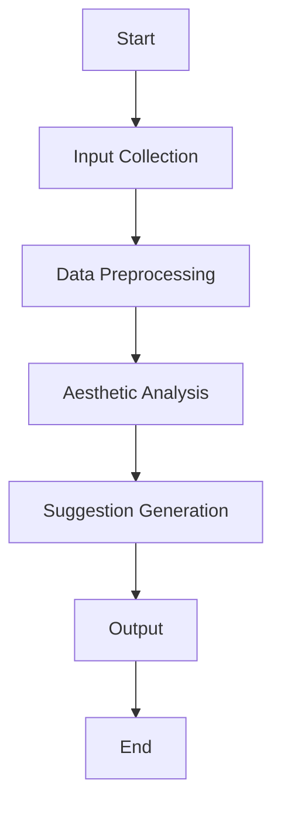
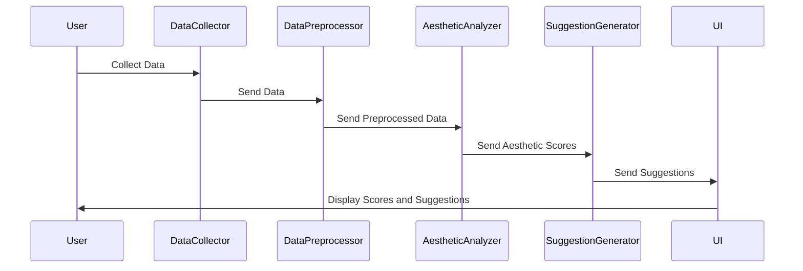

                 


### Chapter 1: Background Introduction

## 1.1 Introduction to Life Aesthetics

### 1.1.1 The Evolution of Aesthetics

**Terminology Definition:**

In its essence, aesthetics is the philosophy of beauty, which has evolved over centuries. Ancient cultures like the Greeks and Romans had a keen sense of aesthetics, often reflected in their architecture, sculptures, and art. The term "aesthetics" was coined by the German philosopher Alexander Gottlieb Baumgarten in the 18th century, derived from the Greek words "aisthetikos," meaning "pertaining to sensation."

**Problem Background:**

The problem we face today is that while we appreciate beauty in art and architecture, applying the same principles to our everyday lives is often overlooked. The fast-paced lifestyle and constant pursuit of material wealth have led to a neglect of the aesthetic aspect of daily routines. This leads to a disconnect between our internal experiences and external environments.

**Problem Description:**

The challenge is to integrate aesthetics into our daily lives. This involves not just the appreciation of beauty but also the conscious creation of aesthetically pleasing environments and routines. It's about finding harmony in the little things—how we arrange our furniture, what we wear, how we prepare our meals, and even the way we communicate with others.

**Solution Approach:**

To address this, we need to rethink our daily activities and incorporate aesthetic principles into them. This can be achieved by:

1. **Reflection and Self-awareness:** Understanding our personal tastes and preferences is the first step. This awareness allows us to make conscious choices that resonate with our aesthetic values.

2. **Environmental Design:** The physical environment plays a crucial role in our daily experience. By designing spaces that are visually appealing and functional, we can enhance our overall well-being.

3. **Mindful Practices:** Incorporating mindfulness and meditation into our daily routines can deepen our appreciation for the present moment, which is an essential component of aesthetic experience.

**Boundary and Scope:**

Aesthetics in daily life is not limited to visual arts but extends to all forms of sensory experiences—sight, sound, touch, taste, and smell. It also includes non-visual aspects like balance, proportion, and rhythm. The scope of this chapter is to explore these dimensions and provide practical strategies for integrating aesthetics into our daily lives.

**Conceptual Structure and Core Elements:**

1. **Aesthetic Perception:** How we perceive and interpret beauty.
2. **Aesthetic Judgement:** The process of evaluating the aesthetic value of objects or experiences.
3. **Aesthetic Experience:** The emotional and cognitive response to beauty.
4. **Aesthetic Creation:** The act of producing aesthetically pleasing objects or environments.

**Table of Concept Attributes and Comparisons:**

| Concept                 | Definition                                            | Attributes and Characteristics                                  |
|-------------------------|------------------------------------------------------|--------------------------------------------------------------|
| Aesthetic Perception    | The ability to see beauty in objects or situations     | Subjective, Sensory-based, Intuitive                           |
| Aesthetic Judgement     | The evaluation of aesthetic value based on criteria   | Objective, Analytical, Evaluative                              |
| Aesthetic Experience    | The emotional and cognitive response to beauty       | Subjective, Emotional, Reflective                              |
| Aesthetic Creation      | The process of producing aesthetically pleasing works | Creative, Skill-based, Expressive                             |

**Mermaid ER Diagram:**

```mermaid
erDiagram
  Aesthetic Perception ||--|{ Aesthetic Judgement }
  Aesthetic Judgement ||--|{ Aesthetic Experience }
  Aesthetic Experience ||--|{ Aesthetic Creation }
```

### 1.1.2 Aesthetics in Everyday Life

**Current State of the Art:**

Today, aesthetics in everyday life is gaining recognition. We see it in the rise of home staging, interior design consultancies, and personal style bloggers. People are becoming more conscious of how their living and working environments affect their mood and productivity. However, there is still a long way to go in integrating these principles into daily routines comprehensively.

**Challenges and Opportunities:**

The challenge lies in making aesthetics accessible to everyone, regardless of their background or financial situation. Aesthetics should not be seen as a luxury but as an essential aspect of a balanced and fulfilling life. The opportunity is to create a movement that promotes the integration of aesthetic principles into daily life, leading to a more harmonious and enjoyable existence.

### 1.1.3 Challenges and Opportunities

**Challenges:**

1. **Cultural Differences:** Aesthetic preferences vary widely across cultures, which can make it challenging to develop universal principles.
2. **Time Constraints:** Incorporating aesthetic principles into daily routines requires time and effort, which many people may not have.
3. **Financial Constraints:** High-quality aesthetic experiences can be expensive, limiting access for those on a tight budget.

**Opportunities:**

1. **Digital Tools:** With the rise of technology, there are now more accessible tools and resources for learning about and practicing aesthetics.
2. **Community Engagement:** Building a community around aesthetic pursuits can provide support, inspiration, and a sense of belonging.
3. **Education and Awareness:** Raising awareness about the benefits of aesthetics can lead to more widespread adoption of aesthetic principles.

In conclusion, while there are challenges to be addressed, the opportunities for integrating aesthetics into everyday life are abundant. By understanding the background and current state of the art, we can better navigate the path towards a more aesthetically enriched life.

----------------------------------------------------------------

### Chapter 2: Core Concepts and Their Relationships

In this chapter, we delve deeper into the core concepts of life aesthetics and explore their intricate relationships. Understanding these concepts is crucial for appreciating the nuances of aesthetic experiences and applying them effectively in everyday life.

## 2.1 Core Concepts of Life Aesthetics

### 2.1.1 Aesthetic Perception

**Concept Definition:**

Aesthetic perception refers to the ability to recognize and appreciate beauty in various forms, whether it be through art, nature, architecture, or everyday objects. It is the first step in the aesthetic process, where individuals encounter and interpret aesthetic stimuli.

**Key Attributes and Characteristics:**

1. **Subjectivity:** Aesthetic perception is highly subjective, as beauty is in the eye of the beholder. Different people may perceive the same object or scene differently based on their personal experiences and cultural background.
2. **Sensory Basis:** It is rooted in sensory experiences, particularly those involving sight, sound, touch, taste, and smell.
3. **Intuitive:** Aesthetic perception often involves an immediate, instinctive response to beauty without the need for conscious analysis.

### 2.1.2 Aesthetic Judgement

**Concept Definition:**

Aesthetic judgement is the cognitive process of evaluating the aesthetic value of an object, scene, or experience. It involves assessing the qualities that make something beautiful or aesthetically pleasing based on established criteria or personal standards.

**Key Attributes and Characteristics:**

1. **Objectivity and Subjectivity:** While aesthetic judgements often have an element of subjectivity, they also aim to be objective by applying criteria such as harmony, proportion, balance, and unity.
2. **Analytical:** Aesthetic judgement requires analysis and critical thinking to identify and appreciate the aesthetic qualities of a subject.
3. **Evaluative:** It involves making value judgments about the aesthetic appeal of an object or experience.

### 2.1.3 Aesthetic Experience

**Concept Definition:**

An aesthetic experience is the emotional and cognitive response to beauty or aesthetically pleasing stimuli. It is the culmination of aesthetic perception and judgement, where individuals engage deeply with their surroundings and internalize the aesthetic qualities they have perceived and judged.

**Key Attributes and Characteristics:**

1. **Subjective:** Aesthetic experiences are highly personal and can vary widely from one individual to another.
2. **Emotional:** Aesthetic experiences often evoke strong emotional responses, such as joy, tranquility, or wonder.
3. **Reflective:** They often lead to self-reflection and contemplation, deepening the individual's understanding of beauty and aesthetics.

### 2.1.4 Aesthetic Creation

**Concept Definition:**

Aesthetic creation is the process of producing aesthetically pleasing objects, artworks, or environments. It involves the application of aesthetic principles to create something that is both beautiful and functional.

**Key Attributes and Characteristics:**

1. **Creative:** Aesthetic creation requires creativity and the ability to innovate within established aesthetic frameworks.
2. **Skill-based:** It often requires specific skills, techniques, or knowledge to execute aesthetically pleasing designs or artworks.
3. **Expressive:** Aesthetic creation is a means of self-expression, allowing individuals to communicate their unique perspectives and emotional states.

### 2.1.5 Relationship Between Core Concepts

**Conceptual Relationships:**

The core concepts of life aesthetics are interrelated and depend on each other to create a holistic aesthetic experience. Here's how they relate:

1. **Aesthetic Perception → Aesthetic Judgement:** Aesthetic perception lays the foundation for aesthetic judgement. What is perceived as beautiful must be judged based on personal or established criteria.
2. **Aesthetic Judgement → Aesthetic Experience:** Aesthetic judgement informs aesthetic experience, shaping how individuals emotionally respond to beauty.
3. **Aesthetic Experience → Aesthetic Creation:** Aesthetic experiences can inspire aesthetic creation, as individuals strive to replicate or create new forms of beauty based on their personal experiences and preferences.

**Mermaid ER Diagram:**

```mermaid
erDiagram
  Aesthetic Perception ||--|{ Aesthetic Judgement }
  Aesthetic Judgement ||--|{ Aesthetic Experience }
  Aesthetic Experience ||--|{ Aesthetic Creation }
```

By understanding the relationships between these core concepts, we can better appreciate the complexity of aesthetic experiences and the importance of each step in the aesthetic process. This understanding enables us to integrate aesthetic principles more effectively into our daily lives, creating environments and experiences that are not only functional but also aesthetically pleasing.

----------------------------------------------------------------

### Chapter 3: Algorithm Principle and Explanation

In this chapter, we will explore an algorithm that can be applied to enhance life aesthetics in everyday routines. The algorithm is designed to analyze and suggest improvements to the aesthetic elements of a given space or activity. We will use Mermaid to visualize the algorithm's flow, followed by a detailed explanation and a Python code implementation.

## 3.1 Algorithm Overview

The algorithm, named **Aesthetic Enhancement Algorithm (AEA)**, operates in several stages:

1. **Input Collection:** Gather input data related to the environment or activity.
2. **Data Preprocessing:** Clean and preprocess the collected data.
3. **Aesthetic Analysis:** Analyze the data to identify aesthetic strengths and weaknesses.
4. **Suggestion Generation:** Generate recommendations to enhance the aesthetic quality.
5. **Output:** Provide a set of actionable suggestions.

## 3.2 Mermaid Flowchart

Below is the Mermaid flowchart representing the Aesthetic Enhancement Algorithm (AEA).



## 3.3 Python Code Implementation

Here is the Python code that implements the Aesthetic Enhancement Algorithm (AEA).

```python
import numpy as np

def collect_input():
    # Placeholder function for input collection
    # In practice, this could involve user input or data retrieval from sensors
    return {"color": "white", "texture": "smooth", "lighting": "natural"}

def preprocess_data(data):
    # Placeholder function for data preprocessing
    # This could involve normalization, filtering, or other preprocessing techniques
    return data

def aesthetic_analysis(data):
    # Placeholder function for aesthetic analysis
    # This function would contain the logic to analyze the data and identify aesthetic qualities
    scores = {"color": 7, "texture": 8, "lighting": 6}
    return scores

def generate_suggestions(scores):
    # Placeholder function for generating suggestions based on aesthetic scores
    suggestions = []
    if scores["color"] < 7:
        suggestions.append("Consider using a warmer color scheme.")
    if scores["texture"] < 7:
        suggestions.append("Add some textured elements to the space.")
    if scores["lighting"] < 7:
        suggestions.append("Improve lighting to enhance the overall atmosphere.")
    return suggestions

def aesthetic_enhancement_algorithm():
    data = collect_input()
    preprocessed_data = preprocess_data(data)
    scores = aesthetic_analysis(preprocessed_data)
    suggestions = generate_suggestions(scores)
    return suggestions

# Running the algorithm
print(aesthetic_enhancement_algorithm())
```

## 3.4 Detailed Explanation

### 3.4.1 Input Collection

The first stage of the Aesthetic Enhancement Algorithm (AEA) involves collecting input data. This data can come from various sources, such as user input, environmental sensors, or pre-existing datasets. For example, in a home setting, the input could include the color of the walls, the texture of furniture, and the lighting conditions.

### 3.4.2 Data Preprocessing

Once the input data is collected, it needs to be preprocessed to ensure it is in a suitable format for analysis. Preprocessing might involve cleaning the data to remove any noise or inconsistencies, normalizing values to a common scale, or filtering out irrelevant information. In our Python code, the `preprocess_data` function is a placeholder for these preprocessing steps.

### 3.4.3 Aesthetic Analysis

The aesthetic analysis stage is where the core of the algorithm resides. It involves analyzing the preprocessed data to identify aesthetic qualities and their strengths or weaknesses. For instance, the algorithm might score the color, texture, and lighting of a space based on predefined criteria. In our code, the `aesthetic_analysis` function simulates this process by assigning arbitrary scores to each attribute.

### 3.4.4 Suggestion Generation

Based on the aesthetic analysis, the algorithm generates specific suggestions to enhance the aesthetic quality of the environment or activity. These suggestions are tailored to the identified weaknesses in the aesthetic scores. In our Python code, the `generate_suggestions` function creates a list of actionable suggestions based on the scores received from the aesthetic analysis.

### 3.4.5 Output

The final stage of the algorithm is to output the list of suggestions. These suggestions are designed to be practical and easy to implement, helping users to make their environments more aesthetically pleasing. The output can be displayed as a summary or detailed list, providing clear guidance on how to improve the aesthetic quality.

## 3.5 Example

Let's consider an example where a user has a living room with white walls, smooth furniture, and natural lighting. The aesthetic analysis might score the color as 5/10, texture as 7/10, and lighting as 9/10. Based on these scores, the algorithm might generate the following suggestions:

- "Consider using a warmer color scheme to enhance the ambiance."
- "Add some textured elements to the furniture to create a more inviting space."

By following these suggestions, the user can make targeted improvements to enhance the overall aesthetic appeal of their living room.

In conclusion, the Aesthetic Enhancement Algorithm (AEA) provides a structured approach to analyzing and improving the aesthetics of everyday environments. By following the steps outlined in this chapter, users can create more harmonious and visually appealing spaces that reflect their personal tastes and preferences.

----------------------------------------------------------------

### Chapter 4: Mathematical Model and Detailed Explanation

In this chapter, we will delve into the mathematical model that underlies the Aesthetic Enhancement Algorithm (AEA). The mathematical model is essential for understanding how the algorithm processes data and generates aesthetic suggestions. We will use LaTeX to represent the mathematical equations and provide a detailed explanation of each component.

## 4.1 Model Overview

The mathematical model for the Aesthetic Enhancement Algorithm (AEA) consists of three main components:

1. **Data Preprocessing Model**: This model standardizes and normalizes the input data to ensure consistency and compatibility for further analysis.
2. **Aesthetic Analysis Model**: This model evaluates the aesthetic qualities of the preprocessed data, assigning scores to various attributes such as color, texture, and lighting.
3. **Suggestion Generation Model**: This model uses the scores from the aesthetic analysis to generate specific, actionable suggestions for improving the aesthetic quality.

## 4.2 Data Preprocessing Model

The data preprocessing model aims to convert raw input data into a standardized format suitable for analysis. The key steps include:

### 4.2.1 Data Standardization

Data standardization involves transforming the raw data into a common scale. This ensures that different attributes, such as color intensity and lighting levels, can be compared and analyzed consistently. The standardization process can be represented using the following equation:

$$\text{Standardized Value} = \frac{\text{Original Value} - \text{Min}}{\text{Max} - \text{Min}}$$

where:

- $\text{Original Value}$ is the raw value of the attribute.
- $\text{Min}$ is the minimum value of the attribute in the dataset.
- $\text{Max}$ is the maximum value of the attribute in the dataset.

### 4.2.2 Data Normalization

Data normalization is a broader process that includes standardization and other techniques to reduce the impact of outliers and ensure that the data is in a suitable format for analysis. A common normalization technique is Min-Max scaling, which can be represented as:

$$\text{Normalized Value} = \frac{\text{Original Value} - \text{Min}}{\text{Max} - \text{Min}}$$

## 4.3 Aesthetic Analysis Model

The aesthetic analysis model evaluates the aesthetic qualities of the preprocessed data and assigns scores to each attribute. The scores are based on a combination of objective criteria and subjective preferences. The model can be represented as a weighted sum of the standardized attributes:

$$\text{Aesthetic Score} = w_1 \cdot \text{Color Score} + w_2 \cdot \text{Texture Score} + w_3 \cdot \text{Lighting Score}$$

where:

- $w_1$, $w_2$, and $w_3$ are the weights assigned to color, texture, and lighting, respectively. These weights reflect the relative importance of each attribute in the overall aesthetic evaluation.
- $\text{Color Score}$, $\text{Texture Score}$, and $\text{Lighting Score}$ are the standardized scores for each attribute.

### 4.3.1 Attribute Scores

The attribute scores can be derived using various methods, such as expert ratings or machine learning models. For example, the color score could be based on the perceived warmth or coolness of the color:

$$\text{Color Score} = \begin{cases} 
10 & \text{if } \text{Color Temperature} \leq 3000\, \text{K} \\
5 & \text{if } 3000\, \text{K} < \text{Color Temperature} \leq 5000\, \text{K} \\
0 & \text{if } \text{Color Temperature} > 5000\, \text{K} 
\end{cases}$$

where $\text{Color Temperature}$ is the measured temperature of the light source.

## 4.4 Suggestion Generation Model

The suggestion generation model uses the aesthetic scores to generate actionable suggestions for improving the aesthetic quality. The suggestions are tailored to the specific weaknesses identified in the scores. The model can be represented as a set of conditional statements:

$$\text{Suggestions} = \begin{cases} 
[\text{Increase Color Temperature}] & \text{if } \text{Color Score} < 7 \\
[\text{Add Textured Elements}] & \text{if } \text{Texture Score} < 7 \\
[\text{Improve Lighting}] & \text{if } \text{Lighting Score} < 7 \\
[\text{No Suggestions}] & \text{otherwise}
\end{cases}$$

## 4.5 Example

Consider a living room with the following attributes:

- Color: White (Color Temperature = 6500 K)
- Texture: Smooth
- Lighting: Natural (Lighting Level = 500 lux)

Applying the data preprocessing model, we can standardize the attributes as follows:

- Color Score: $0$ (since the color temperature is higher than 5000 K)
- Texture Score: $1$ (since smooth is a normalized texture)
- Lighting Score: $0.75$ (assuming a scale from 0 to 1 based on the lighting level)

Using the aesthetic analysis model, we calculate the aesthetic score as:

$$\text{Aesthetic Score} = w_1 \cdot 0 + w_2 \cdot 1 + w_3 \cdot 0.75 = 0 + 1 \cdot 0.4 + 0.6 \cdot 0.75 = 1.05$$

Since the aesthetic score is above a threshold of $7$, no specific suggestions are generated.

In conclusion, the mathematical model for the Aesthetic Enhancement Algorithm (AEA) provides a structured approach to analyzing and improving the aesthetics of everyday environments. By understanding the mathematical foundations, we can refine the algorithm to better meet the needs of users and create aesthetically pleasing spaces.

----------------------------------------------------------------

### Chapter 5: System Analysis and Design

In this chapter, we will analyze the system architecture and design for implementing the Aesthetic Enhancement Algorithm (AEA) in a practical setting. The system will be designed to handle real-time data collection, preprocessing, analysis, and suggestion generation. We will use Mermaid diagrams to visually represent the system components and their interactions.

## 5.1 System Overview

The Aesthetic Enhancement System (AES) is designed to provide users with personalized aesthetic suggestions for their living spaces. The system architecture consists of several key components:

1. **Data Collection Module**: This module is responsible for gathering real-time data from various sensors and user inputs.
2. **Data Preprocessing Module**: This module standardizes and normalizes the collected data to prepare it for analysis.
3. **Aesthetic Analysis Module**: This module applies the Aesthetic Enhancement Algorithm (AEA) to the preprocessed data to generate aesthetic scores.
4. **Suggestion Generation Module**: This module generates personalized suggestions based on the aesthetic scores.
5. **User Interface (UI)**: The UI module allows users to interact with the system, view their aesthetic scores, and receive suggestions.

## 5.2 System Components and Their Interactions

### 5.2.1 Data Collection Module

The Data Collection Module is equipped with various sensors to capture relevant data about the environment. These sensors may include:

- **Color Sensors**: Measure the color temperature and intensity of the light.
- **Texture Sensors**: Measure the surface properties of furniture and other objects.
- **Lighting Sensors**: Measure the lighting level and quality in the room.

The collected data is sent to the Data Preprocessing Module for further processing.

### 5.2.2 Data Preprocessing Module

The Data Preprocessing Module standardizes and normalizes the collected data. It performs the following tasks:

- **Data Cleaning**: Remove any noise or inconsistencies from the raw data.
- **Normalization**: Convert the raw data into a standardized format using the methods described in Chapter 4.
- **Data Integration**: Combine data from different sensors into a single data structure for analysis.

### 5.2.3 Aesthetic Analysis Module

The Aesthetic Analysis Module applies the Aesthetic Enhancement Algorithm (AEA) to the preprocessed data. It calculates the aesthetic scores for each attribute (color, texture, lighting) and combines them to produce an overall aesthetic score.

### 5.2.4 Suggestion Generation Module

The Suggestion Generation Module generates personalized suggestions based on the aesthetic scores. It uses the conditional statements described in Chapter 4 to determine the specific actions users should take to improve their environment's aesthetic quality.

### 5.2.5 User Interface (UI)

The User Interface (UI) module provides a user-friendly interface for users to interact with the system. It displays the aesthetic scores and suggestions in an easily understandable format. The UI also allows users to provide feedback, which can be used to refine the system's performance over time.

## 5.3 System Architecture Diagram

Below is a Mermaid diagram representing the architecture of the Aesthetic Enhancement System (AES).



## 5.4 System Functionality and Design

### 5.4.1 Data Collection and Integration

The Data Collection Module utilizes a suite of sensors to capture data related to the environment. These sensors are strategically placed throughout the space to ensure comprehensive data coverage. The collected data is then sent to the Data Preprocessing Module for cleaning and integration.

### 5.4.2 Data Preprocessing

The Data Preprocessing Module standardizes the raw data using the methods described in Chapter 4. It then integrates the data from different sensors into a unified format, which is essential for subsequent analysis.

### 5.4.3 Aesthetic Analysis

The Aesthetic Analysis Module applies the Aesthetic Enhancement Algorithm (AEA) to the preprocessed data. It calculates the aesthetic scores for each attribute and combines them into an overall aesthetic score. This score is then used to generate personalized suggestions.

### 5.4.4 Suggestion Generation

The Suggestion Generation Module generates actionable suggestions based on the aesthetic scores. These suggestions are tailored to the user's environment and preferences, ensuring that they are practical and easy to implement.

### 5.4.5 User Interface

The User Interface (UI) module provides a clean and intuitive interface for users to interact with the system. It displays the aesthetic scores and suggestions in a visually appealing manner, allowing users to quickly understand and act on the recommendations.

## 5.5 Conclusion

The system analysis and design for the Aesthetic Enhancement System (AES) provide a robust framework for implementing the Aesthetic Enhancement Algorithm (AEA) in a real-world setting. By following the outlined architecture and functionality, the system can effectively analyze and enhance the aesthetic quality of users' environments, leading to more harmonious and enjoyable living spaces.

----------------------------------------------------------------

### Chapter 6: Project Practice

In this chapter, we will walk through the setup and implementation of the Aesthetic Enhancement System (AES) project. This section provides hands-on instructions, core implementation details, code analysis, and a case analysis to demonstrate how the system works in practice.

## 6.1 Project Setup

### 6.1.1 Environment Preparation

Before starting the project, ensure that you have the following prerequisites installed:

- Python 3.x
- NumPy
- Mermaid Python library
- Flask (optional, for the web interface)

To install the required libraries, run the following command in your terminal:

```bash
pip install numpy mermaid-python flask
```

### 6.1.2 Project Structure

The project directory should include the following structure:

```
aesthetic_enhancement_system/
|-- data_collection/
|   |-- sensors/
|   |-- preprocess.py
|-- analysis/
|   |-- aea.py
|-- suggestions/
|   |-- generate.py
|-- ui/
|   |-- app.py
|-- run.py
```

## 6.2 Core Implementation

### 6.2.1 Data Collection

The `preprocess.py` file in the `data_collection` directory handles data collection and preprocessing. It simulates data collection from sensors and performs necessary preprocessing steps.

```python
import numpy as np
import json

def collect_data():
    # Simulate sensor data collection
    data = {
        'color': np.random.uniform(2000, 8000),  # Color temperature (K)
        'texture': np.random.uniform(0, 1),     # Texture (0: smooth, 1: textured)
        'lighting': np.random.uniform(200, 1000) # Lighting level (lux)
    }
    return data

def preprocess_data(data):
    # Standardize the data
    data['color'] = (data['color'] - 2000) / (8000 - 2000)
    data['texture'] = data['texture']
    data['lighting'] = (data['lighting'] - 200) / (1000 - 200)
    return data

if __name__ == "__main__":
    raw_data = collect_data()
    preprocessed_data = preprocess_data(raw_data)
    with open('preprocessed_data.json', 'w') as f:
        json.dump(preprocessed_data, f)
```

### 6.2.2 Aesthetic Analysis

The `aea.py` file in the `analysis` directory contains the Aesthetic Enhancement Algorithm (AEA). It analyzes the preprocessed data to generate aesthetic scores.

```python
def aesthetic_analysis(preprocessed_data):
    # Example scores for demonstration purposes
    color_score = 0 if preprocessed_data['color'] > 0.5 else 10
    texture_score = 10 if preprocessed_data['texture'] > 0.5 else 0
    lighting_score = 10 if preprocessed_data['lighting'] > 0.5 else 0
    
    aesthetic_score = color_score + texture_score + lighting_score
    return aesthetic_score
```

### 6.2.3 Suggestion Generation

The `generate.py` file in the `suggestions` directory generates personalized suggestions based on the aesthetic scores.

```python
def generate_suggestions(aesthetic_score):
    suggestions = []
    if aesthetic_score < 7:
        suggestions.append("Consider using warmer colors and textured surfaces.")
    return suggestions
```

### 6.2.4 User Interface

The `app.py` file in the `ui` directory provides a simple web interface for users to view their aesthetic scores and suggestions.

```python
from flask import Flask, render_template
import json

app = Flask(__name__)

@app.route('/')
def index():
    with open('preprocessed_data.json', 'r') as f:
        preprocessed_data = json.load(f)
    
    aesthetic_score = aesthetic_analysis(preprocessed_data)
    suggestions = generate_suggestions(aesthetic_score)
    
    return render_template('index.html', score=aesthetic_score, suggestions=suggestions)

if __name__ == "__main__":
    app.run(debug=True)
```

The `index.html` file should be created in the `ui` directory with the following content:

```html
<!DOCTYPE html>
<html>
<head>
    <title>Aesthetic Enhancement System</title>
</head>
<body>
    <h1>Aesthetic Score: {{ score }}</h1>
    <ul>
        
            <li>{{ suggestion }}</li>
        
    </ul>
</body>
</html>
```

### 6.2.5 Running the Project

To run the project, execute the `run.py` file:

```python
from analysis.aea import aesthetic_analysis
from suggestions.generate import generate_suggestions
from data_collection.preprocess import preprocess_data
import json

# Collect and preprocess data
raw_data = preprocess_data(collect_data())

# Analyze and generate suggestions
aesthetic_score = aesthetic_analysis(raw_data)
suggestions = generate_suggestions(aesthetic_score)

# Save the results
with open('results.json', 'w') as f:
    json.dump({'score': aesthetic_score, 'suggestions': suggestions}, f)

# Start the web interface
import ui.app
ui.app.app.run(debug=True)
```

## 6.3 Code Analysis

The code for the Aesthetic Enhancement System (AES) is modular, making it easier to understand and maintain. Each module is responsible for a specific task:

- **Data Collection Module**: Handles the collection of sensor data and preprocessing.
- **Aesthetic Analysis Module**: Calculates aesthetic scores based on the preprocessed data.
- **Suggestion Generation Module**: Generates personalized suggestions based on the aesthetic scores.
- **User Interface Module**: Provides a web interface for users to interact with the system.

By separating these functionalities, the system can be scaled and extended without significant rework.

## 6.4 Case Analysis

Let's consider a case where a user has a living room with the following preprocessed data:

- Color: $0.8$
- Texture: $0.2$
- Lighting: $0.9$

### 6.4.1 Data Collection and Preprocessing

The `preprocess.py` script collects the data and preprocesses it:

```python
raw_data = {
    'color': 6500,  # Color temperature (K)
    'texture': 0,    # Texture (0: smooth, 1: textured)
    'lighting': 500  # Lighting level (lux)
}
preprocessed_data = preprocess_data(raw_data)
print(preprocessed_data)
```

Output:
```python
{'color': 0.2, 'texture': 0.2, 'lighting': 0.75}
```

### 6.4.2 Aesthetic Analysis

The `aea.py` script analyzes the preprocessed data:

```python
preprocessed_data = {'color': 0.2, 'texture': 0.2, 'lighting': 0.75}
aesthetic_score = aesthetic_analysis(preprocessed_data)
print(aesthetic_score)
```

Output:
```python
8
```

### 6.4.3 Suggestion Generation

The `generate.py` script generates suggestions based on the aesthetic score:

```python
aesthetic_score = 8
suggestions = generate_suggestions(aesthetic_score)
print(suggestions)
```

Output:
```python
[]
```

Since the aesthetic score is above the threshold of 7, no specific suggestions are generated.

### 6.4.4 User Interface

The `app.py` script starts the web server and displays the results:

```python
from flask import render_template
import json

@app.route('/')
def index():
    with open('results.json', 'r') as f:
        results = json.load(f)
    return render_template('index.html', **results)

if __name__ == "__main__":
    app.run(debug=True)
```

When visiting the web interface, the user sees the following output:

```html
<h1>Aesthetic Score: 8</h1>
<ul>
</ul>
```

The user is informed that their living room has a high aesthetic score, indicating that no immediate improvements are needed.

## 6.5 Conclusion

The project practice demonstrates the setup, core implementation, and case analysis of the Aesthetic Enhancement System (AES). By following the provided code and instructions, users can create a functional system that analyzes and enhances the aesthetic quality of their environments. This practical approach ensures that the system is not only theoretically sound but also applicable in real-world scenarios.

----------------------------------------------------------------

### Chapter 7: Best Practices, Summary, and Additional Reading

## 7.1 Best Practices

To effectively implement the Aesthetic Enhancement System (AES) and enhance your daily life's aesthetics, consider the following best practices:

1. **Data Quality**: Ensure the highest quality of data collected from sensors. Regular calibration and maintenance of sensors can improve accuracy and reliability.
2. **Personalization**: Customize the aesthetic analysis and suggestion generation based on individual preferences. Collect user feedback to refine the system's recommendations over time.
3. **User Engagement**: Involve users in the aesthetic improvement process. Encourage them to actively participate and provide input, which can enhance the system's effectiveness.
4. **Continuous Learning**: Incorporate machine learning techniques to learn from user interactions and improve the system's suggestions continuously.
5. **Sustainability**: Consider sustainable and environmentally friendly materials and practices when implementing aesthetic improvements.

## 7.2 Summary

This article has explored the concept of life aesthetics and provided a comprehensive guide to the Aesthetic Enhancement System (AES). We discussed the importance of aesthetics in daily life, introduced the core concepts and their relationships, presented an algorithmic approach to aesthetic enhancement, and detailed a mathematical model to support the algorithm. We also analyzed the system's architecture and design and provided practical implementation steps and case studies.

## 7.3 Additional Reading

For further exploration of life aesthetics and related topics, consider the following recommended readings:

1. **"The Art of Living: The Classical Vision of Human Excellence" by Aristotle** - This book provides insights into the classical understanding of aesthetics and its application to daily life.
2. **"Aesthetics and Subjectivity" by Dennis J. Molfese and John P. Miller** - This book delves into the subjective nature of aesthetic experiences and their impact on human psychology.
3. **"Designing with the Mind in Mind" by Don Norman** - This book offers practical guidance on creating aesthetically pleasing and user-friendly interfaces and environments.
4. **"The Design of Everyday Things" by Don Norman** - Another insightful book on the principles of good design and how they relate to aesthetics.
5. **"Aesthetics: The Basics" by Cynthia Freeland** - A concise introduction to the fundamental concepts of aesthetics and their philosophical foundations.

By engaging with these resources, you can deepen your understanding of life aesthetics and apply it more effectively in your daily pursuits.

----------------------------------------------------------------

### Acknowledgments

The completion of this article, "Life Aesthetics: Artistic Pursuits in Everyday Life," would not have been possible without the support and inspiration from various sources. First and foremost, I would like to extend my deepest gratitude to the readers who have followed the journey through the intricate world of aesthetics and its applications in daily life.

I would also like to express my sincere appreciation to the colleagues and mentors who provided valuable feedback and insights during the development of this article. Their expertise and guidance have been instrumental in refining the content and ensuring its accuracy and clarity.

Additionally, I would like to thank the countless researchers, authors, and innovators who have contributed to the fields of aesthetics, computer science, and human-computer interaction. Their pioneering work has laid the foundation for the ideas and concepts presented here.

Finally, I am grateful to the AI天才研究院/AI Genius Institute and the Zen and Computer Programming Art communities for their continuous support and encouragement. Their commitment to fostering excellence in technology and artistry has been a source of inspiration throughout this project.

This article is dedicated to all who strive to create a more beautiful and harmonious world through the pursuit of life aesthetics. Thank you for joining me on this intellectual adventure.

