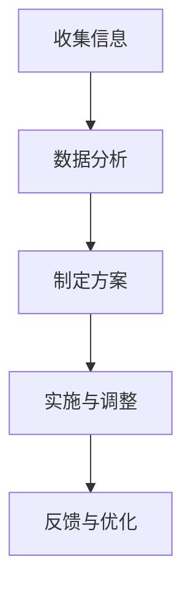
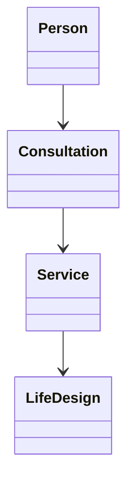
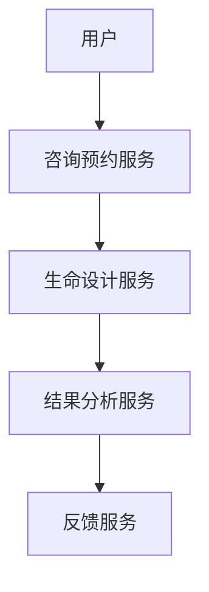
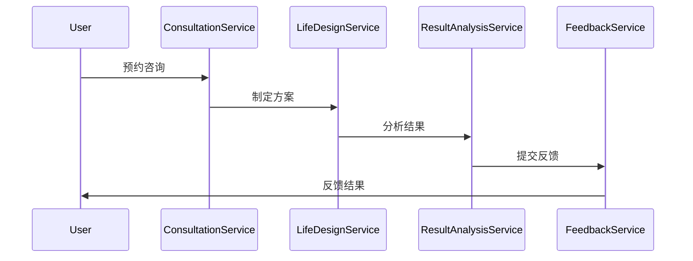

                 


# 生命设计咨询：个人发展的战略规划服务

## 关键词
- 生命设计
- 战略规划
- 个人发展
- 职业规划
- 咨询服务

## 摘要
在快速变化的现代社会，个人发展的战略规划至关重要。本文将探讨生命设计咨询作为一种专业的个人发展服务，帮助个人明确目标、优化路径，实现自我价值最大化。通过深入分析核心概念、算法原理以及系统架构设计，本文旨在为读者提供一套完整的战略规划方案。

## 1. 背景介绍

### 问题背景
随着全球化和数字化的发展，个人发展的需求愈发突出。职业规划、生涯发展、身心健康等各方面的挑战，使得个人需要专业的咨询和规划服务来应对复杂多变的环境。

### 问题描述
个人发展的战略规划需要考虑多方面的因素，包括个人特点、市场需求、社会环境等。制定个性化的成长路径，使个人能够充分发挥潜力，实现自我价值。

### 问题解决
生命设计咨询作为一种专业的咨询服务，旨在帮助个人明确发展目标，优化路径，实现自我价值的最大化。通过综合运用心理学、管理学、教育学等多学科知识，为个人提供量身定制的发展方案。

### 边界与外延
生命设计咨询不仅涵盖职业发展，还包括个人成长、身心健康、人际关系等多方面的战略规划。其核心在于全面提升个人在生理、心理、社会等方面的全面发展。

### 核心要素组成
- 个人能力评估：通过对个人能力的全面了解，确定发展起点。
- 目标设定：明确个人愿景，设定具体、可衡量的发展目标。
- 路径规划：根据个人特点和市场需求，制定个性化的成长路径。
- 资源整合：整合内外部资源，为个人发展提供支持。
- 持续反馈与调整：根据实施过程中的反馈，不断调整规划，确保目标的实现。

## 2. 核心概念与联系

### 核心概念原理
- **生命设计**：综合运用心理学、管理学、教育学等多学科知识，为个人提供发展方案。
- **战略规划**：针对个人目标，制定长远发展计划。
- **个人发展**：个人在生理、心理、社会等方面的全面成长。

### 概念属性特征对比表格

| 概念     | 定义                                                         | 特征                   |
|----------|------------------------------------------------------------|----------------------|
| 生命设计 | 综合运用心理学、管理学、教育学等多学科知识，为个人提供发展方案。 | 全面性、个性化、持续更新 |
| 战略规划 | 针对个人目标，制定长远发展计划。                               | 长期性、系统性、灵活性   |
| 个人发展 | 个人在生理、心理、社会等方面的全面成长。                       | 全面性、动态性、主观性   |

### ER实体关系图架构
```mermaid
entity Relationship Diagram

node1[生命设计]
node2[战略规划]
node3[个人发展]

node1 --> node2
node2 --> node3
```

## 3. 算法原理讲解

### 算法流程图


### Python源代码示例
```python
def life_design咨询服务():
    # 收集信息
    data = 收集信息()
    
    # 数据分析
    analysis_result = 数据分析(data)
    
    # 制定方案
    plan = 制定方案(analysis_result)
    
    # 实施与调整
    实施方案(plan)
    
    # 反馈与优化
    optimization = 反馈与优化(plan)
    
    return optimization
```

### 数学模型和公式
```latex
\text{目标函数} = \max Z = \sum_{i=1}^{n} c_{i} x_{i}
\text{约束条件}:
\begin{cases}
a_{i} x_{i} \leq b_{i}, \quad i=1,2,...,m \\
x_{i} \geq 0, \quad i=1,2,...,n
\end{cases}
```

### 算法讲解
- **收集信息**：通过问卷、访谈等方式，收集个人基本信息、职业规划、兴趣爱好等。
- **数据分析**：对收集到的信息进行整理、分析，找出个人优势和短板。
- **制定方案**：根据分析结果，制定个性化的发展方案，包括短期目标和长期规划。
- **实施与调整**：实施方案，并根据实际情况进行调整，确保目标的实现。
- **反馈与优化**：收集实施过程中的反馈，对方案进行优化，提高效果。

## 4. 系统分析与架构设计方案

### 问题场景介绍
个人发展咨询服务的场景，包括咨询预约、方案制定、执行反馈等环节。

### 项目介绍
项目名称：《生命设计咨询平台》
项目目标：为用户提供个性化的发展咨询服务，帮助用户实现自我提升。

### 系统功能设计（领域模型Mermaid类图）


### 系统架构设计（Mermaid架构图）


### 系统接口设计和系统交互


## 5. 项目实战

### 环境安装
- 安装Python环境
- 安装相关依赖库，如numpy、pandas等

### 系统核心实现源代码
```python
# life_design_咨询服务.py
def 收集信息():
    # 收集用户信息
    pass

def 数据分析(data):
    # 数据分析
    pass

def 制定方案(analysis_result):
    # 制定方案
    pass

def 实施方案(plan):
    # 实施方案
    pass

def 反馈与优化(plan):
    # 收集反馈，优化方案
    pass

if __name__ == "__main__":
    life_design咨询服务()
```

### 代码应用解读与分析
- **收集信息**：通过用户输入，收集个人基本信息、职业规划、兴趣爱好等。
- **数据分析**：对收集到的信息进行整理、分析，找出用户的优势和短板。
- **制定方案**：根据分析结果，为用户制定个性化的发展方案。
- **实施方案**：用户按照方案执行，并在过程中不断反馈。
- **反馈与优化**：根据用户的反馈，对方案进行优化，提高效果。

### 实际案例分析和详细讲解剖析
- **案例1**：张三，30岁，软件工程师，希望提升职业发展。
  - **分析**：张三在技术方面具备优势，但在领导力和沟通能力方面有待提升。
  - **方案**：制定短期目标，提升领导力和沟通能力；长期目标，成为团队核心成员。
  - **实施与反馈**：张三按照方案执行，并在过程中不断反馈，最终实现了职业发展目标。

- **案例2**：李四，25岁，大学毕业生，希望找到理想的工作。
  - **分析**：李四具备扎实的专业知识和良好的学习能力，但缺乏实际工作经验。
  - **方案**：制定短期目标，积累实习经验；长期目标，找到与专业相关的工作。
  - **实施与反馈**：李四按照方案执行，通过实习积累经验，最终找到了满意的工作。

### 项目小结
生命设计咨询作为个人发展的战略规划服务，通过专业的分析、个性化的方案和持续的反馈，帮助个人实现自我价值的最大化。项目的成功实施，为个人发展提供了有力的支持。

## 6. 最佳实践 tips

- **定期进行自我评估**：了解自己的优势和短板，及时调整发展策略。
- **保持开放的心态**：积极接受新知识，拓宽视野，提高自身竞争力。
- **持续学习和实践**：不断积累经验，提升个人能力。

## 7. 小结

生命设计咨询为个人发展提供了一种全新的战略规划服务。通过深入分析个人特点、市场需求和社会环境，帮助个人明确目标、优化路径，实现自我价值的最大化。在未来的发展中，生命设计咨询将继续为个人发展提供有力的支持。

## 8. 注意事项

- **隐私保护**：在收集用户信息时，注意保护用户隐私，遵守相关法律法规。
- **个性化定制**：根据用户需求，提供个性化的咨询服务，确保方案的有效性。

## 9. 拓展阅读

- 《成功的策略规划：个人与企业的发展之道》
- 《如何设计成功的职业生涯》
- 《心理学与人生规划：策略与技巧》

### 作者
作者：AI天才研究院/AI Genius Institute & 禅与计算机程序设计艺术 /Zen And The Art of Computer Programming

# 结束

