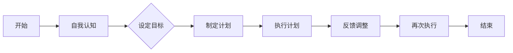
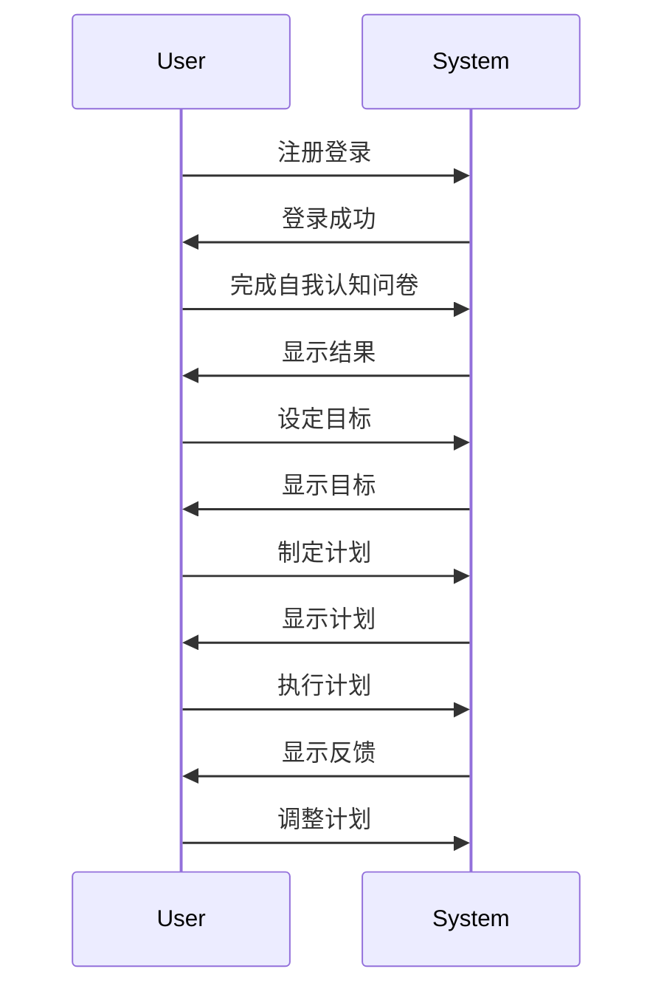
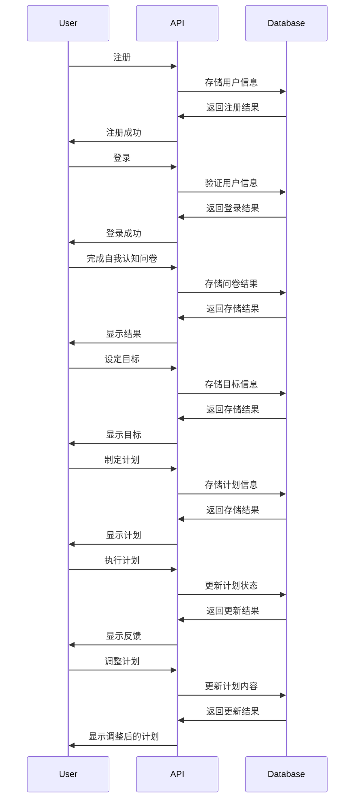

                 

### 生命设计思维：规划有意义的人生

> **关键词：** 生命设计思维、规划、有意义的人生、设计思维、个人成长、职业发展

> **摘要：** 本文将深入探讨生命设计思维的概念、原理及应用，通过具体实例，帮助读者运用这一思维模式规划出有意义的人生。

### 背景介绍

在现代社会，人们面临着越来越多的选择和挑战，如何在这个快速变化的世界中找到自己的定位，实现有意义的人生，成为许多人关心的问题。生命设计思维（Life Design Thinking）作为一种创新的思维方式，旨在帮助人们更好地规划和管理自己的生活，实现个人目标和社会价值。

#### 核心概念术语说明

- **生命设计思维**：一种结合设计思维和人生规划的思维方式，强调从设计者的角度审视和规划生活。
- **设计思维**：一种以人为中心的创新方法论，通过理解用户需求，创造性地解决问题。
- **有意义的人生**：不仅指物质上的富足，更强调精神上的满足和社会贡献。

#### 问题背景

随着全球化和科技的发展，人们的生活节奏加快，压力增大。很多人在追求事业成功的过程中，忽视了生活的其他方面，导致生活质量下降。生命设计思维应运而生，旨在帮助人们平衡事业与生活，实现个人价值与社会价值的统一。

#### 问题描述

人们常常面临以下问题：

1. 如何找到自己的人生目标？
2. 如何在繁忙的生活中找到平衡？
3. 如何实现个人成长和社会贡献？

#### 问题解决

生命设计思维提供了一系列方法论和工具，帮助人们：

1. **明确人生目标**：通过深入自我反思，了解自己的价值观、兴趣和优势。
2. **制定生活规划**：结合实际情况，设定可实现的短期和长期目标。
3. **实施和调整**：通过不断的实践和反思，调整计划，实现人生目标。

#### 边界与外延

- **边界**：生命设计思维主要关注个人的生活规划，但不排斥社会和环境因素。
- **外延**：它可以应用于个人成长、职业规划、家庭生活等多个领域。

#### 概念结构与核心要素组成

生命设计思维的核心结构包括：

1. **自我认知**：了解自己的价值观、兴趣和优势。
2. **目标设定**：设定明确、具体、可衡量的目标。
3. **行动计划**：制定实现目标的步骤和时间表。
4. **执行与反思**：执行计划并定期反思，调整策略。

### 核心概念与联系

#### 核心概念原理

生命设计思维的核心概念包括：

1. **以人为中心**：关注个体的需求和感受。
2. **迭代与改进**：通过不断的实践和反思，优化生活规划。
3. **平衡与和谐**：在事业与生活之间找到平衡点。

#### 概念属性特征对比表格

| 特征                | 设计思维                | 生命设计思维                |
|---------------------|-----------------------|-----------------------|
| **关注对象**        | 产品或服务              | 个体及其生活                |
| **核心步骤**        | 理解需求、创意生成、原型测试、迭代优化 | 自我认知、目标设定、行动计划、执行与反思  |
| **应用领域**        | 创意产业、产品开发、服务设计         | 个人成长、职业规划、家庭生活         |

#### ER实体关系图架构

```mermaid
erDiagram
  User ||--|{ LifeDesignMindset }
  User ||--|{ LifeGoal }
  LifeDesignMindset ||--|{ StepByStepPlan }
  LifeDesignMindset ||--|{ ContinuousFeedback }
```

在这个ER图架构中，`User` 代表个体，`LifeDesignMindset` 代表生命设计思维，`LifeGoal` 代表人生目标，`StepByStepPlan` 代表行动计划，`ContinuousFeedback` 代表持续反馈。

### 算法原理讲解

#### 算法mermaid流程图



#### Python源代码实现

```python
class LifeDesign:
    def __init__(self):
        self.self_knowledge = None
        self.life_goals = []
        self.plan = []
        self.feedback = []

    def self_knowledge(self):
        # 自我认知
        print("正在了解你的兴趣、优势和价值观...")
        self.self_knowledge = input("请输入你的兴趣、优势和价值观：")

    def set_life_goals(self):
        # 设定目标
        print("请设定你的人生目标：")
        self.life_goals = input("输入目标（用逗号分隔）：").split(',')

    def make_plan(self):
        # 制定计划
        print("根据目标制定计划：")
        self.plan = [input(f"为实现目标'{goal}'，你计划怎么做？") for goal in self.life_goals]

    def execute_plan(self):
        # 执行计划
        for step in self.plan:
            print(f"正在执行计划：{step}")
            feedback = input("执行结果如何？（正面/负面/中立）：")
            self.feedback.append(feedback)

    def feedback_and_adjustment(self):
        # 反馈与调整
        print("根据反馈调整计划：")
        for i, step in enumerate(self.plan):
            if self.feedback[i] == '负面':
                print(f"调整计划：{step}")
                self.plan[i] = input(f"新的计划：")

    def run(self):
        self.self_knowledge()
        self.set_life_goals()
        self.make_plan()
        self.execute_plan()
        self.feedback_and_adjustment()

# 实例化并运行
ld = LifeDesign()
ld.run()
```

#### 算法原理的数学模型和公式

1. **自我认知**：通过问卷调查、深度访谈等方法，收集个体的兴趣、优势和价值观。
2. **目标设定**：目标应具备SMART（具体、可衡量、可实现、相关性、时限性）特征。
3. **计划制定**：制定实现目标的步骤和时间表，确保每个步骤都具有可行性。
4. **执行与反馈**：根据计划执行，并收集执行结果，通过反馈调整计划。

#### 详细讲解和举例说明

1. **自我认知**：例如，通过问卷调查了解个人的兴趣爱好，从而确定未来的职业方向。
2. **目标设定**：设定一个具体的目标，如“在未来五年内，成为一名AI领域的专家”。
3. **计划制定**：制定实现目标的步骤，如“学习相关课程、参加项目实践、发表论文”。
4. **执行与反馈**：在执行过程中，不断收集反馈，并根据反馈调整计划。

### 系统分析与架构设计方案

#### 问题场景介绍

假设我们想要设计一个系统，帮助个人通过生命设计思维规划有意义的人生。系统需要包括以下功能：

1. **用户注册与登录**：用户可以注册账号并登录系统。
2. **自我认知评估**：系统提供自我认知问卷，帮助用户了解自己的兴趣、优势和价值观。
3. **目标设定与追踪**：用户可以设定目标并追踪目标的实现进度。
4. **计划制定与执行**：用户可以制定实现目标的计划，并执行计划。
5. **反馈与调整**：用户可以根据执行结果，对计划进行调整。

#### 项目介绍

项目名称：生命设计思维系统

项目目标：通过生命设计思维，帮助用户规划有意义的人生。

#### 系统功能设计（领域模型mermaid类图）

```mermaid
classDiagram
    User <<类>>
    LifeGoal <<类>>
    LifePlan <<类>>
    LifeFeedback <<类>>

    User *--* LifeGoal : 设定目标
    User *--* LifePlan : 制定计划
    LifeGoal *--* LifePlan : 实现目标
    LifePlan *--* LifeFeedback : 收集反馈
```

#### 系统架构设计mermaid架构图



#### 系统接口设计和系统交互mermaid序列图



### 项目实战

#### 环境安装

1. 安装Python环境：`pip install python`
2. 安装相关依赖库：`pip install Flask SQLAlchemy`

#### 系统核心实现源代码

```python
from flask import Flask, request, jsonify
from models import User, LifeGoal, LifePlan, LifeFeedback

app = Flask(__name__)

@app.route('/register', methods=['POST'])
def register():
    # 注册用户
    user_data = request.get_json()
    user = User.create(user_data)
    return jsonify({"message": "注册成功", "user_id": user.id})

@app.route('/login', methods=['POST'])
def login():
    # 登录用户
    user_data = request.get_json()
    user = User.authenticate(user_data)
    return jsonify({"message": "登录成功", "user_id": user.id})

@app.route('/self_knowledge', methods=['POST'])
def self_knowledge():
    # 完成自我认知问卷
    user_id = request.json['user_id']
    user = User.get(user_id)
    user.self_knowledge = request.json['self_knowledge']
    return jsonify({"message": "自我认知问卷完成"})

@app.route('/set_life_goals', methods=['POST'])
def set_life_goals():
    # 设定目标
    user_id = request.json['user_id']
    user = User.get(user_id)
    goals = request.json['goals']
    for goal in goals:
        LifeGoal.create({"user_id": user_id, "goal": goal})
    return jsonify({"message": "目标设定成功"})

@app.route('/make_life_plan', methods=['POST'])
def make_life_plan():
    # 制定计划
    user_id = request.json['user_id']
    user = User.get(user_id)
    plans = request.json['plans']
    for plan in plans:
        LifePlan.create({"user_id": user_id, "plan": plan})
    return jsonify({"message": "计划制定成功"})

@app.route('/execute_life_plan', methods=['POST'])
def execute_life_plan():
    # 执行计划
    user_id = request.json['user_id']
    user = User.get(user_id)
    feedback = request.json['feedback']
    for plan in user.life_plans:
        LifeFeedback.create({"plan_id": plan.id, "feedback": feedback})
    return jsonify({"message": "计划执行成功"})

@app.route('/adjust_life_plan', methods=['POST'])
def adjust_life_plan():
    # 调整计划
    user_id = request.json['user_id']
    user = User.get(user_id)
    new_plan = request.json['new_plan']
    for plan in user.life_plans:
        if plan.feedback == '负面':
            plan.plan = new_plan
    return jsonify({"message": "计划调整成功"})

if __name__ == '__main__':
    app.run(debug=True)
```

#### 代码应用解读与分析

1. **用户注册与登录**：通过`POST`请求，接收用户数据，验证用户信息，并返回相应的响应。
2. **自我认知评估**：用户提交自我认知问卷，系统存储问卷结果，并返回成功消息。
3. **目标设定与追踪**：用户设定目标，系统存储目标信息，并返回成功消息。
4. **计划制定与执行**：用户制定计划，系统存储计划信息，并返回成功消息。
5. **反馈与调整**：用户提交执行反馈，系统根据反馈调整计划。

#### 实际案例分析和详细讲解剖析

假设用户A在系统中完成了自我认知问卷，并设定了以下目标：

1. 成为一名AI领域的专家。
2. 在未来五年内发表两篇论文。

用户A制定了以下计划：

1. 学习相关课程，提升专业知识。
2. 参与AI项目实践，积累实战经验。
3. 阅读相关论文，了解最新研究动态。

在执行计划过程中，用户A反馈了一些执行困难，如课程学习难度大、项目实践任务繁重等。根据反馈，用户A对计划进行了调整：

1. 找到一位导师，寻求指导。
2. 调整学习计划，确保有足够的时间完成项目实践。

#### 项目小结

通过生命设计思维系统，用户可以系统地规划自己的人生，从自我认知到目标设定，再到计划制定和执行，以及反馈和调整，形成一个闭环。这有助于用户更清晰地了解自己的优势和劣势，从而更有针对性地提升自己，实现人生目标。

### 最佳实践 tips

1. **定期自我反思**：通过自我反思，不断了解自己的变化，调整生活规划。
2. **设定短期和长期目标**：短期目标有助于保持动力，长期目标有助于明确方向。
3. **寻求专业指导**：在规划人生时，可以寻求导师或专业人士的指导，以提高规划的科学性和可行性。
4. **保持灵活性**：在执行计划时，要时刻关注反馈，及时调整策略。

### 小结

生命设计思维为个人提供了一种全新的生活方式规划方法，通过自我认知、目标设定、计划制定和执行、反馈与调整等步骤，帮助个人明确人生方向，实现人生目标。这种方法不仅适用于个人成长，也适用于职业规划、家庭生活等多个领域。通过不断实践和反思，我们可以更好地规划有意义的人生，实现个人价值和社会贡献。

### 注意事项

1. 在使用生命设计思维时，要注重实际可行性，避免设定过于理想化的目标。
2. 在执行计划时，要注重效率和质量，确保每个步骤都能带来实质性的提升。
3. 在调整计划时，要充分考虑实际情况，避免频繁变动，影响执行效果。

### 拓展阅读

1. 《设计思维：创新的方法论》
2. 《深度工作：如何有效利用每一点脑力》
3. 《终身成长：如何培养持久的学习能力》

### 作者信息

**作者：** AI天才研究院/AI Genius Institute & 禅与计算机程序设计艺术 /Zen And The Art of Computer Programming

