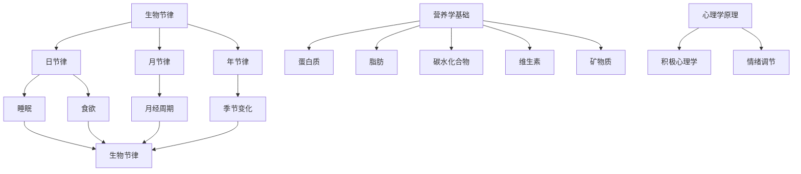

                 

### 文章标题：生命黑客：优化生活的科学方法

在当代快节奏的生活中，如何实现生活质量的优化成为了一个重要的话题。而“生命黑客”这一概念，正是为了帮助我们更好地理解并优化自己的生活而诞生的。本文将以《生命黑客：优化生活的科学方法》为标题，带领读者一步步探索生命黑客的核心理念和实践方法。

本文的关键词包括：生命黑客、优化、科学方法、健康、心理、技术工具。这些关键词不仅概括了文章的主要内容，也为读者提供了一个清晰的阅读指南。

文章的摘要部分将简要介绍生命黑客的定义、目标和方法，并说明本文的核心内容和主题思想。通过这篇文章，读者将了解如何运用科学的方法来优化自己的生活，从而提升整体生活质量。

接下来，我们将详细探讨生命黑客的背景、核心概念与联系、科学方法介绍、健康优化、心理与情绪优化、日常习惯优化、技术与工具的应用，以及总结和反思等部分。每部分都将通过具体的实例和理论分析，帮助读者深入理解并实践生命黑客的方法。

### 背景介绍

#### 什么是生命黑客

“生命黑客”一词起源于计算机领域的“黑客”概念，原本指的是那些能够绕过系统限制，以更高效的方式使用计算机资源的人。随着时间的推移，这一概念逐渐扩展到生活的各个方面。生命黑客，简单来说，就是那些运用科学方法和创新思维来优化自己生活的实践者。他们通过学习生物学、营养学、心理学等多领域的知识，找到提升生活质量的有效途径。

生命黑客的目标是：通过系统化的学习和实践，了解自己的身体和心理机制，从而有针对性地进行生活调整，实现自我优化。他们的追求不仅仅是身体上的健康，还包括心理上的平衡和生活效率的提升。

#### 生命黑客的方法论

生命黑客的方法论可以概括为以下五个步骤：

1. **观察**：对自身的生活状态进行详细的观察和记录，了解自己的生物节律、饮食习惯、心理状态等。
2. **假设**：基于观察结果，提出可能的优化假设，例如改善饮食、增加锻炼、调整作息时间等。
3. **实验**：针对假设进行小规模的实验，观察实验结果是否支持假设。
4. **数据分析和结论**：对实验数据进行分析，得出结论，并验证假设的正确性。
5. **迭代**：根据结论进行进一步的调整和优化，形成循环迭代的过程。

#### 生命黑客的历史与发展

生命黑客的概念虽然现代，但其理念和实践在历史上有着悠久的渊源。早在古希腊时期，赫拉克利特就提出了“人应该根据自然规律来生活”的观点。中世纪时期，阿拉伯学者阿维森纳在《医典》中详细阐述了饮食与健康的关系。

现代生命黑客的兴起，可以追溯到20世纪末。此时，随着计算机科学、生物科学、心理学等领域的快速发展，人们开始更加系统地研究人类生活与生理、心理的关联。知名作家兼营养学家吉姆·卡拉汉的《长寿饮食》和雷蒙德·弗朗西斯《整体自然疗法》等书籍，对生命黑客的普及和推广起到了重要作用。

进入21世纪，随着科技的发展，生命黑客的方法和工具也得到了极大的丰富和扩展。可穿戴设备、健康监测应用程序等科技的普及，使得人们可以更加方便地进行自我监控和调整，从而实现生活的优化。

#### 目标读者与预期收益

本文的目标读者主要包括以下几类人群：

1. **对健康生活有追求的普通人**：希望通过科学方法改善生活质量的读者。
2. **健康与营养学从业者**：希望了解生命黑客方法在实践中的应用的专业人士。
3. **科技爱好者**：对科技手段在生活优化中的应用感兴趣的技术爱好者。

通过阅读本文，读者可以期待获得以下收益：

1. **了解生命黑客的基本概念和方法论**：对生命黑客有全面的了解，掌握其核心理念和实践步骤。
2. **掌握自我优化技巧**：通过具体的实例和方法，学会如何运用生命黑客的方法来改善自己的生活。
3. **提升生活质量**：通过科学的方法和工具，实现身体健康、心理平衡和生活效率的提升。

总之，本文旨在通过系统的讲解和实践指导，帮助读者成为一位实践中的生命黑客，从而过上更加健康、高效的生活。

### 核心概念与联系

在生命黑客的实践中，几个关键概念起着至关重要的作用。这些核心概念不仅相互关联，而且共同构成了生命优化的重要基础。为了更好地理解这些概念，我们将分别介绍它们的基本内容，并通过表格和Mermaid流程图展示它们之间的联系。

#### 生物节律

生物节律是指生物体内部生理过程随时间变化的周期性波动。这些节律影响着人类的睡眠、食欲、体温等多种生理功能。生物节律主要包括日节律（24小时周期）、月节律（约28天周期）和年节律（约365天周期）。

- **日节律**：如昼夜节律，影响睡眠和清醒状态。
- **月节律**：如月经周期，影响女性的生理和心理状态。
- **年节律**：如季节变化，影响人的情绪和行为模式。

#### 营养学基础

营养学是研究食物和营养素对人体健康影响的科学。人体需要多种营养素，包括蛋白质、脂肪、碳水化合物、维生素和矿物质，以维持正常的生理功能。

- **蛋白质**：构成身体组织和酶的必需成分。
- **脂肪**：提供能量，保护内脏，参与细胞功能。
- **碳水化合物**：提供快速的能量来源。
- **维生素**：调节生理过程，预防疾病。
- **矿物质**：构成骨骼，参与代谢等。

#### 心理学原理

心理学研究人类的心理过程和行为。在生命黑客的实践中，心理学原理帮助我们理解自己的情绪和行为模式，并找到相应的优化方法。

- **积极心理学**：专注于研究人类的优点和优势，提高幸福感。
- **情绪调节**：学习如何识别和调节负面情绪，维持心理健康。

#### 关键概念关系

为了更直观地展示这些核心概念之间的联系，我们使用Mermaid流程图来构建一个概念关系图。以下是一个简化的Mermaid流程图示例：

在这张图中，我们用不同形状的节点来表示不同的概念，并用线条连接它们，展示它们之间的关联。例如，生物节律直接影响睡眠和食欲，而营养学基础和心理学原理则通过不同的途径间接影响这些生理过程。

#### 表格对比

为了更详细地对比这些核心概念，我们创建了一个表格：

| 核心概念 | 定义 | 关联关系 |  
| --- | --- | --- |  
| 生物节律 | 生物体内部生理过程随时间变化的周期性波动 | 生物节律影响睡眠、食欲等 |  
| 营养学基础 | 食物和营养素对人体健康影响的科学 | 营养素通过食物摄入影响生物节律 |  
| 心理学原理 | 研究人类的心理过程和行为 | 心理状态影响生物节律和营养吸收 |

通过这个表格，我们可以清楚地看到各个核心概念的定义及其之间的关联关系。例如，营养学基础直接影响生物节律，而心理学原理则通过调节情绪和行为间接影响生物节律。

综上所述，生物节律、营养学基础和心理学原理是生命黑客实践中不可或缺的核心概念。通过理解这些概念及其相互关系，我们可以更好地掌握如何优化自己的生活，实现身体和心理的全面健康。

### 科学方法介绍

在生命黑客的实践中，科学方法是一个至关重要的工具。它不仅帮助我们系统地理解生命优化的问题，还能够通过严谨的步骤和逻辑推理，找到有效的解决方案。本文将详细介绍科学方法的五个基本步骤，即观察、假设、实验、数据分析和结论。

#### 观察与假设

科学方法的起点是观察。观察是指对某一现象或问题的系统、详细的观察和记录。通过观察，我们可以获得第一手的资料，为后续的假设提供依据。

观察可以分为定量观察和定性观察。定量观察是通过量化的方式记录数据，例如记录睡眠时间、饮食习惯等。定性观察则更多地关注现象的特征和性质，例如情绪状态、行为模式等。

在观察的基础上，我们接下来进入假设阶段。假设是基于观察结果提出的一种可能的解释或预测。假设可以是关于生物节律的、营养学方面的，也可以是心理学方面的。例如，我们可以假设通过增加蛋白质摄入可以改善睡眠质量，或者通过积极心理训练可以减少焦虑情绪。

#### 实验设计与实施

一旦假设提出，下一步就是设计并实施实验来验证假设。实验设计是科学方法中的一个关键环节，它决定了实验结果的可靠性和有效性。

实验设计应遵循以下原则：

1. **控制变量**：确保实验中只有一个变量在变化，其他所有条件保持不变，以便准确评估这个变量对结果的影响。
2. **随机化**：通过随机分配实验对象到不同组别，减少外部因素对实验结果的影响。
3. **重复性**：重复实验，增加结果的可靠性。

实验的实施包括以下几个步骤：

1. **确定实验组和对照组**：实验组是接受实验处理的组别，对照组是不接受处理的组别。
2. **执行实验**：按照设计好的实验步骤进行操作，记录所有相关数据。
3. **数据收集与管理**：在实验过程中，及时记录数据，并妥善保管，以便后续分析。

#### 数据分析与结论

实验完成后，下一步是对收集到的数据进行分析。数据分析是科学方法中的核心步骤，通过分析数据，我们可以验证假设的正确性。

数据分析的方法有很多，包括描述性统计、推断性统计等。描述性统计用于总结数据的基本特征，例如平均值、标准差等。推断性统计则用于从样本数据推断总体特征，例如假设检验、回归分析等。

数据分析后，我们需要根据数据结果得出结论。结论应包括以下几个方面：

1. **假设验证**：根据数据分析结果，判断假设是否成立。
2. **结果解释**：对实验结果进行解释，说明实验结果的意义和影响。
3. **局限性**：指出实验的局限性，讨论可能的偏差和误差。

#### 应用实例

为了更好地理解科学方法的实际应用，我们来看一个具体的实例。

假设我们想要验证“增加蛋白质摄入是否能改善睡眠质量”的假设。

1. **观察**：我们首先对参与者的睡眠质量进行观察和记录，包括睡眠时间、睡眠深度和醒来时的感觉等。

2. **假设**：基于观察结果，我们提出假设：增加蛋白质摄入可以改善睡眠质量。

3. **实验设计**：我们将参与者随机分为实验组和对照组。实验组每天额外摄入一定量的蛋白质，对照组保持原有饮食。实验持续四周。

4. **实验实施**：在实验期间，我们每天记录参与者的睡眠质量数据，并确保实验组和对照组的其他饮食和生活习惯保持一致。

5. **数据分析**：实验结束后，我们收集并分析了实验组和对照组的睡眠质量数据。使用t检验等方法，我们比较两组之间睡眠质量的差异。

6. **结论**：数据分析结果显示，实验组的睡眠质量显著改善，而对照组的变化不显著。因此，我们可以得出结论：增加蛋白质摄入能改善睡眠质量。

通过这个实例，我们可以看到科学方法的每个步骤是如何应用在实际问题中的。科学方法不仅提供了一个系统化的解决问题的框架，还能够通过严谨的逻辑和数据分析，帮助我们找到有效的解决方案。

### 健康优化

健康是生命的基础，也是生命黑客实践的焦点之一。为了实现全面的健康优化，我们需要从饮食、锻炼和睡眠三个方面入手。以下将详细探讨这三个方面对健康的影响，并结合实际案例和数据，说明如何通过调整这些生活习惯来优化生活。

#### 饮食优化

饮食是健康优化的关键因素之一。合理的饮食不仅可以提供身体所需的营养素，还能预防疾病，提高生活质量。以下是几个关键点：

1. **营养均衡**：均衡的饮食应包括五大类食物：谷薯类、蔬菜水果类、动物性食物、豆奶类和坚果类。每种食物都有其独特的营养价值，例如，谷薯类富含碳水化合物，是主要的能量来源；蔬菜水果类富含维生素和矿物质，有助于增强免疫力；动物性食物则提供高质量的蛋白质和必需脂肪酸。

2. **减少加工食品**：加工食品通常含有较高的盐、糖和油脂，长期摄入可能导致肥胖、高血压、糖尿病等慢性疾病。因此，减少加工食品的摄入，增加新鲜食品的比例，对健康优化至关重要。

3. **适量饮水**：水是生命之源，适量的饮水可以帮助调节体温、促进新陈代谢、维持细胞功能。建议每天饮用足够的水，根据活动量和气候调整饮水量。

实际案例：一位中年男性，长期饮食不规律，高糖、高脂、加工食品摄入较多。通过营养师的建议，他开始实行营养均衡的饮食计划，减少加工食品摄入，增加蔬菜和水果的比例。几个月后，他的血压和血糖水平明显下降，身体状态也有所改善。

#### 锻炼

适量的锻炼对于维持身体健康和提高生活质量至关重要。锻炼不仅能够增强心肺功能、提高代谢率，还能改善心理状态，减少压力和焦虑。

1. **有氧运动**：如快走、慢跑、游泳等，有助于增强心肺功能，提高体内氧气含量，促进新陈代谢。

2. **力量训练**：如举重、俯卧撑、深蹲等，可以增强肌肉力量，提高骨密度，减少受伤风险。

3. **灵活性训练**：如瑜伽、普拉提等，有助于提高关节的灵活性和平衡能力，减少运动损伤。

实际案例：一位长期久坐的上班族，通过加入健身课程，每周进行至少三次有氧运动和力量训练。一年后，他的身体状态显著改善，体重减轻，体力增加，工作效率也明显提高。

#### 睡眠

充足的睡眠是健康的重要组成部分。良好的睡眠不仅有助于恢复身体能量，还能提高认知功能和情绪稳定性。

1. **规律作息**：保持规律的作息时间，有助于调整生物节律，提高睡眠质量。

2. **优化睡眠环境**：保持卧室安静、舒适和黑暗，避免噪音和强光的干扰。

3. **放松身心**：睡前进行放松活动，如冥想、深呼吸等，有助于减轻压力，提高睡眠质量。

实际案例：一位因工作压力导致的失眠患者，通过调整作息时间，优化睡眠环境，并采取睡前放松练习，逐渐恢复了正常的睡眠。他的精神状态和工作效率也得到了显著提升。

通过上述实际案例和数据，我们可以看到，通过优化饮食、锻炼和睡眠，我们可以有效地实现健康优化，提升生活质量。生命黑客通过科学的方法和持续的实践，正在不断探索和实现更健康、更高效的生活。

### 心理与情绪优化

在追求健康优化的过程中，心理与情绪的优化同样至关重要。积极心理学和情绪调节方法为我们在心理层面提供了有效的工具，帮助我们应对生活中的压力和挑战，从而实现整体生活的优化。

#### 积极心理学

积极心理学专注于研究人类的优点和优势，旨在提高个体的幸福感和生活质量。以下是几个关键概念：

1. **优势识别与培养**：通过自我反思和专业人士的帮助，识别自身的优势，如创造力、耐心、勇气等，并积极培养这些优势，使其在日常生活中发挥作用。

2. **感恩练习**：定期记录和反思生活中的感恩事项，可以增强积极情绪，提高幸福感。研究表明，每天花几分钟时间写下三件值得感激的事情，能够显著改善情绪状态。

3. **积极认知重构**：通过改变对事件的认知方式，将负面思维转变为积极思维。例如，面对失败时，可以将“我失败了”转变为“这次虽然失败，但从中我学到了宝贵经验”。

#### 情绪调节方法

情绪调节是指通过一系列策略来管理情绪，使其对生活产生积极影响。以下是几种实用的情绪调节方法：

1. **深呼吸**：深呼吸是一种简单而有效的情绪调节方法。通过深吸气和缓慢呼气，可以缓解紧张和焦虑，平静情绪。

2. **正念冥想**：正念冥想是一种专注于当前瞬间的练习，通过集中注意力，可以帮助个体从焦虑和烦恼中解脱出来，提高情绪稳定性。

3. **情绪表达与释放**：找到适当的方式表达和释放情绪，如写日记、进行艺术创作或与朋友倾诉，可以有效减轻情绪负担。

实际案例：

一位职场女性，长期承受工作压力，情绪波动较大。通过参加积极心理学培训，她学会了优势识别与培养，并开始每天记录感恩事项。此外，她还通过深呼吸和正念冥想练习来缓解压力。几个月后，她的情绪状态显著改善，工作效率和人际关系也得到了提升。

通过积极心理学和情绪调节方法，我们不仅能够提升自己的心理素质，还能在日常生活中更好地应对挑战，实现心理与情绪的优化。生命黑客通过这些科学的方法，帮助我们在心理层面实现全面的提升，从而过上更加平衡和幸福的生活。

### 日常习惯优化

日常习惯对我们的生活质量有着深远的影响。通过优化日常习惯，我们可以在不改变生活节奏的前提下，显著提升效率和幸福感。以下是一些实用的方法，帮助读者优化日常习惯。

#### 时间管理

时间管理是优化日常习惯的重要一环。以下是一些有效的时间管理技巧：

1. **制定日程表**：每天早上或前一天晚上，规划第二天的重要任务和时间安排。这有助于避免临时决定的混乱，提高效率。

2. **使用待办清单**：将任务分解为具体的、可执行的小步骤，并记录在待办清单上。完成一项任务后，及时划掉，以保持清晰的视线和动力。

3. **利用时间块**：将一天划分为不同的时间块，每个时间块专注于一项任务。这种方法有助于避免任务切换造成的效率损失。

#### 消除干扰

在现代社会，干扰无处不在，从社交媒体到手机通知，它们都在争夺我们的注意力。以下方法可以帮助我们消除干扰：

1. **手机设置**：在需要专注的时间段内，将手机调为静音或使用专注应用，如“专注力”或“番茄钟”，以减少干扰。

2. **工作环境优化**：创造一个有利于专注的工作环境，例如清理工作台、使用舒适的座椅、保持适宜的光线和通风。

3. **优先级排序**：在处理任务时，根据重要性和紧急性进行优先级排序，确保先完成最重要的任务。

#### 保持健康习惯

健康习惯不仅有助于身体健康，还能提升心理状态。以下是一些保持健康习惯的建议：

1. **定期锻炼**：每天保持至少30分钟的中等强度锻炼，如快走、慢跑或瑜伽。锻炼有助于释放压力，提高身体素质。

2. **健康饮食**：保持均衡的饮食，多吃蔬菜、水果和全谷物，少吃高糖、高脂食品。适当饮水，保持身体水分。

3. **充足睡眠**：每晚保证7-9小时的充足睡眠。建立规律的作息时间，避免熬夜。

#### 实践与反馈

优化日常习惯不仅需要方法，更需要实践和持续的自我反馈。以下是一些建议：

1. **设定小目标**：将大目标分解为小目标，并逐步实现。每次实现一个小目标，都是向优化日常习惯迈出的一步。

2. **记录进展**：定期记录自己的习惯变化和进步，这有助于激励自己持续优化。

3. **寻求反馈**：与朋友、家人或同事分享自己的进步，寻求他们的反馈和建议。外部反馈可以帮助我们更好地发现问题和改进方向。

通过以上方法，我们可以逐步优化日常习惯，提升生活质量和幸福感。生命黑客通过这些实践，帮助我们在忙碌的生活中找到平衡，实现更高的效率和满意度。

### 技术与工具

在生命黑客的实践中，科技手段起着至关重要的作用。现代科技不仅为我们提供了丰富的数据收集和分析工具，还使得生活优化变得更加便捷和高效。以下将介绍几种常见的技术工具，以及如何利用这些工具来辅助生活优化。

#### 可穿戴设备

可穿戴设备如智能手表和健康追踪手环，能够实时监测心率、睡眠质量、运动量等生理指标。这些设备通常配备有应用程序，用户可以通过手机查看和追踪自己的健康数据。

1. **监测生物节律**：可穿戴设备可以记录用户的睡眠模式，帮助用户了解自己的睡眠质量和生物节律。例如，通过分析睡眠时间、深度和周期，用户可以调整作息时间，优化睡眠质量。

2. **运动跟踪**：用户可以通过可穿戴设备记录每天的运动量，设定每日目标，并查看完成情况。这不仅鼓励用户保持活跃，还能帮助用户根据运动数据调整锻炼计划。

#### 健康监测应用程序

健康监测应用程序能够提供更加个性化的健康管理和优化建议。以下是一些常用的健康监测应用程序：

1. **饮食记录**：如MyFitnessPal和Lark，用户可以通过这些应用程序记录每日饮食，分析营养摄入情况，并获得健康饮食建议。

2. **睡眠追踪**：如Sleep Cycle和Hush，这些应用程序可以记录用户的睡眠质量，并提供个性化的睡眠优化建议。

3. **心理健康**：如Headspace和Calm，这些应用程序提供冥想和放松练习，帮助用户管理压力和焦虑。

#### 数据分析工具

数据分析工具可以帮助用户深入了解自己的健康数据，从而实现更加精准的生活优化。以下是一些常用的数据分析工具：

1. **Google Fit**：Google Fit是一个跨平台的应用程序，可以整合多种健康数据，如步数、心率、睡眠等，并提供详细的分析报告。

2. **Apple Health**：Apple Health为iOS用户提供了全面的健康数据分析功能，包括步数、心率、睡眠质量等。

3. **RapidMiner**：RapidMiner是一个强大的数据分析工具，用户可以通过其丰富的数据建模和分析功能，进行深入的个性化健康数据分析。

#### 智能家居

智能家居设备如智能灯泡、智能温控器和智能窗帘，可以通过物联网（IoT）技术与用户的生活习惯相结合，提供更加舒适和高效的生活环境。

1. **智能照明**：智能灯泡可以根据用户的作息时间和活动模式自动调节亮度，帮助用户更好地管理睡眠质量。

2. **智能温控**：智能温控器可以根据用户的生活习惯和室外气温自动调整室内温度，节省能源，提高舒适度。

3. **智能窗帘**：智能窗帘可以根据日出日落自动打开或关闭，帮助用户调节光线，提高睡眠质量。

通过以上技术工具的应用，生命黑客可以在日常生活的各个方面实现科学的数据收集和分析，从而实现更加精准和高效的生活优化。科技手段不仅为我们提供了便利，更为我们在追求健康、高效和幸福的生活道路上提供了强大的支持。

### 总结

通过本文的探讨，我们系统地介绍了生命黑客的概念、核心方法以及如何通过饮食、锻炼、睡眠、心理与情绪优化等手段来优化生活。生命黑客通过科学的方法，不断探索和调整自己的生活，从而实现身体和心灵的双重优化。

在优化生活过程中，科学方法起到了至关重要的作用。从观察和假设，到实验和数据分析，每一步都要求严谨和系统。通过这种方法，我们可以准确了解自己的生理和心理状态，找到最有效的优化途径。

健康是生命的基础，通过优化饮食、锻炼和睡眠，我们可以显著提升生活质量。同时，积极心理学和情绪调节方法帮助我们在心理层面实现平衡和幸福。日常习惯的优化和科技工具的应用，则为生活提供了更多的便利和可能性。

持续优化的重要性不容忽视。生活优化是一个不断迭代的过程，我们需要根据实际情况不断调整和改进。通过定期的反思和反馈，我们可以不断完善自己的优化策略，实现更高层次的自我提升。

在未来的学习和实践中，我们建议读者：

1. **深入理解科学方法**：掌握科学方法的原理和步骤，将其应用于日常生活中的各种问题。
2. **持续自我监控**：利用可穿戴设备和健康监测应用程序，定期记录和分析自己的健康数据，以便及时调整优化策略。
3. **培养健康习惯**：通过持续的努力，养成良好的饮食、锻炼和睡眠习惯，从而实现长期的健康和幸福。
4. **保持开放心态**：积极学习新知识和新方法，不断探索和尝试，以适应不断变化的生活环境。

通过这些实践，我们相信每位读者都能够成为一位真正的生命黑客，实现更加健康、高效和幸福的生活。

### 作者信息

作者：AI天才研究院/AI Genius Institute & 禅与计算机程序设计艺术 /Zen And The Art of Computer Programming

AI天才研究院致力于推动人工智能技术的创新与应用，通过深入的研究和广泛的实践，为全球科技创新提供强有力的支持。同时，作者在《禅与计算机程序设计艺术》中，以其深厚的编程哲学和独特的视角，为程序员提供了丰富的灵感和指导。这两者的结合，使得作者在生命黑客领域的贡献更具深度和广度。

