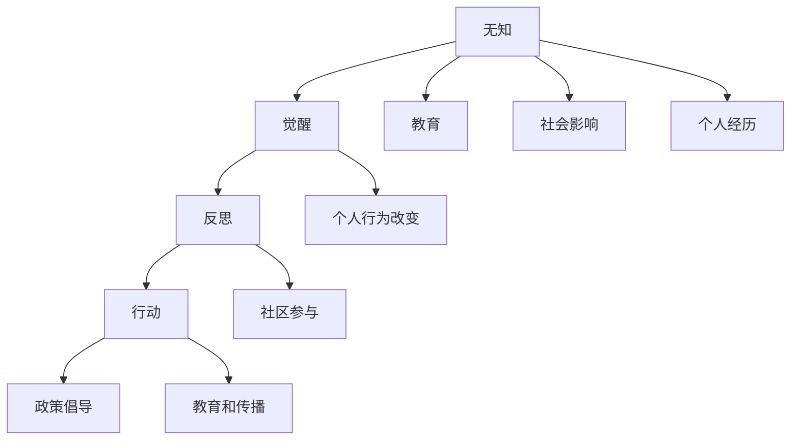
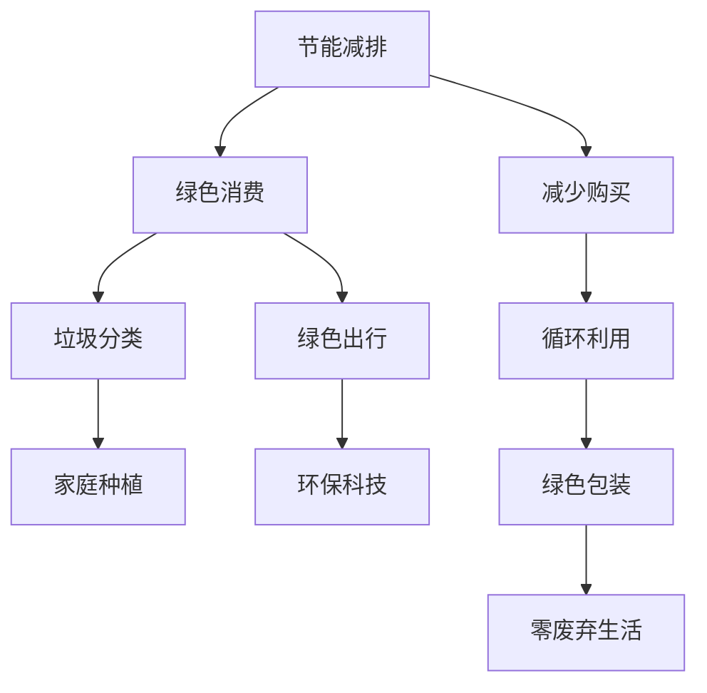
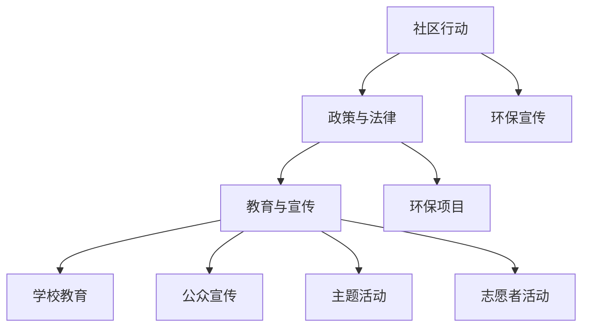

                 

# 生态意识觉醒：个人与地球的和谐共生

## 关键词

- 生态意识
- 和谐共生
- 可持续性
- 个人行动
- 社会影响
- 未来展望

## 摘要

本文探讨了生态意识觉醒的重要性，以及个人与地球和谐共生的必要性。通过介绍生态危机的现状、核心概念、觉醒过程、个人行动、社会影响和未来展望，本文旨在启发读者从自身做起，积极参与生态保护，共同构建可持续的未来。

### 引言

在21世纪的今天，人类正面临着前所未有的生态危机。气候变化、生物多样性丧失、资源过度消耗等问题，已经对地球的生态系统造成了巨大的破坏。面对这样的挑战，我们需要觉醒生态意识，从个人行为做起，与地球实现和谐共生。

生态意识觉醒不仅仅是一种思想上的转变，更是一种行动上的践行。它要求我们深刻认识到人类与地球的紧密联系，意识到我们的每一个行为都会对地球生态系统产生影响。只有通过个人的努力和改变，才能共同构建一个可持续的未来。

本文将逐步探讨生态意识觉醒的各个方面，包括其核心概念、觉醒过程、个人行动、社会影响和未来展望。希望通过本文的阐述，能够启发更多的人加入到生态保护的行列，为地球的可持续发展贡献自己的力量。

### 背景介绍

#### 生态危机的现状

地球上的生态危机已经到了迫在眉睫的地步。气候变化是一个显著的问题，全球气温不断上升，极端天气事件频发，导致海平面上升、干旱、洪水等问题。此外，生物多样性的丧失也是不可忽视的问题。根据联合国的一份报告，目前地球上约有100万种物种面临灭绝的风险，这一数字比历史上任何时候都要高。

资源的过度消耗也是一个严峻的问题。人类对自然资源的依赖日益加剧，特别是化石燃料的消耗，导致了大量温室气体的排放，加剧了气候变化。同时，对水资源的过度利用和污染，也使得许多地区面临水资源短缺的问题。

#### 问题的根源

生态危机的根源在于人类对地球资源的过度开发和消费。长期以来，人类追求经济增长和消费主义的生活方式，导致了资源的过度消耗和环境的破坏。这种模式不仅对地球的生态系统造成了严重的破坏，也对人类自身的健康和福祉产生了负面影响。

#### 解决方案的必要性

要解决生态危机，我们需要采取综合性的措施。首先，我们需要改变经济增长的模式，转向可持续发展的道路。其次，我们需要提高公众的生态意识，让更多的人认识到生态危机的严重性，并积极参与到生态保护的行动中来。最后，我们需要加强国际合作，共同应对全球性的生态问题。

### 核心概念

#### 生态意识

生态意识是指人类对自身与自然的关系的认识和感悟，是对生态系统的尊重和保护的意识。它包括对生态系统的理解、对生态问题的关注以及对生态行动的承诺。生态意识不仅仅是一种思想上的转变，更是一种行动上的践行。

#### 可持续性

可持续性是指在满足当前需求的同时，不损害后代满足其需求的能力。在生态领域，可持续性意味着在开发和使用自然资源时，要考虑到生态系统的承载能力和再生能力，以确保生态系统的长期健康和稳定。

#### 环境伦理

环境伦理是指人类在处理与自然的关系时应当遵循的道德原则和价值观。它强调人类对生态系统的责任和义务，要求人类在利用自然资源时，要考虑到对生态系统的保护和恢复。

#### 核心概念对比表格

| 概念     | 定义                                                         | 关联关系                                         |
|----------|------------------------------------------------------------|--------------------------------------------------|
| 生态意识 | 对生态系统和人类关系的认识                                   | 基础概念，决定可持续性和环境伦理的实施         |
| 可持续性 | 在满足当前需求的同时，不损害后代满足其需求的能力           | 生态意识的具体体现，是生态保护的核心目标     |
| 环境伦理 | 在处理与自然的关系时应当遵循的道德原则和价值观               | 基于生态意识，指导人类行为的道德规范         |

#### ER实体关系图架构的 Mermaid 流程图

```mermaid
erDiagram
    ECOSYSTEM ||--|{ HUMAN}
    ECOLOGICAL_CONSCIOUSNESS ||--|{ HUMAN}
    SUSTAINABILITY ||--|{ ECOLOGICAL_CONSCIOUSNESS}
    ENVIRONMENTAL_ETHICS ||--|{ ECOLOGICAL_CONSCIOUSNESS}
    HUMAN && ECOLOGICAL_CONSCIOUSNESS : 了解
    HUMAN && SUSTAINABILITY : 实践
    HUMAN && ENVIRONMENTAL_ETHICS : 遵循
```

### 生态意识觉醒的过程

#### 觉醒因素

生态意识觉醒的因素多种多样，包括：

1. **个人经历**：如亲眼目睹生态环境的破坏，或者亲身参与生态保护活动。
2. **教育**：通过学校教育、媒体宣传等途径，了解生态危机的严重性。
3. **社会影响**：社会舆论、政策引导、社区行动等，对个人的生态意识产生积极影响。
4. **情感触动**：对动物的关爱、对自然美景的向往，激发个人的生态意识。

#### 觉醒阶段

生态意识觉醒通常分为以下几个阶段：

1. **无知**：对生态问题缺乏了解，认为生态危机与自己无关。
2. **觉醒**：意识到生态危机的严重性，开始关注生态问题。
3. **反思**：思考自身行为对生态系统的影响，并考虑改变。
4. **行动**：将生态意识转化为实际行动，积极参与生态保护。

#### 觉醒后的行动

觉醒后的行动可以是多样化的，包括：

1. **个人行为改变**：如减少用水、减少废物产生、使用环保产品等。
2. **社区参与**：加入环保组织、参与社区环保活动、倡导环保理念。
3. **政策倡导**：参与环保政策的制定和实施，推动生态保护。
4. **教育和传播**：通过教育、宣传等方式，提高公众的生态意识。

#### 觉醒过程的Mermaid流程图



### 个人行动

#### 日常生活

在日常生活中，个人可以通过以下方式参与生态保护：

1. **节能减排**：使用节能电器、减少用水、使用公共交通工具等。
2. **绿色消费**：选择环保产品、减少一次性用品的使用、支持可持续发展品牌。
3. **垃圾分类**：正确分类垃圾，减少垃圾对环境的污染。
4. **家庭种植**：在家种植蔬菜、植物，减少食品运输过程中的碳排放。

#### 消费习惯

改变消费习惯是生态保护的重要一环，具体方法包括：

1. **减少购买**：避免盲目消费，减少不必要的购买。
2. **循环利用**：购买二手物品，减少资源消耗。
3. **绿色包装**：选择无污染或可降解的包装材料。
4. **零废弃生活**：通过减少、回收、再利用，实现“零废弃”。

#### 环保科技

环保科技的发展为个人参与生态保护提供了新的途径，包括：

1. **可再生能源**：使用太阳能、风能等可再生能源，减少对化石燃料的依赖。
2. **智能节能**：利用智能家居系统，实现节能减碳。
3. **环保材料**：开发和应用环保材料，减少环境污染。
4. **环境监测**：利用传感器技术，实时监测环境质量，为决策提供依据。

#### 实践案例

以下是一些具体的生态保护实践案例：

1. **零废弃家庭**：家庭成员共同制定零废弃计划，通过减少购买、循环利用、回收等手段，实现家庭零废弃。
2. **环保社区**：社区组织环保活动，如垃圾分类、环保讲座、植树等，提高居民的生态意识。
3. **绿色出行**：鼓励居民使用公共交通、骑自行车、步行等绿色出行方式，减少汽车尾气排放。

#### 个人行动的Mermaid流程图



### 社会影响

#### 社区行动

社区行动在生态保护中发挥着重要作用，具体方式包括：

1. **环保宣传**：通过讲座、宣传册、社交媒体等途径，提高居民的生态意识。
2. **环保项目**：组织环保志愿者团队，参与植树、垃圾分类、河流清洁等环保项目。
3. **环保设施**：建设垃圾分类设施、环保厕所等，为居民提供便利的环保条件。
4. **环保教育**：在学校、社区开展环保教育，培养下一代的生态意识。

#### 政策与法律

政策与法律是推动生态保护的重要手段，具体措施包括：

1. **环保法规**：制定严格的环保法规，规范企业和个人的行为。
2. **生态补偿**：通过生态补偿机制，鼓励企业和个人参与生态保护。
3. **绿色金融**：推动绿色金融发展，为生态保护提供资金支持。
4. **国际合作**：通过国际合作，共同应对全球性的生态问题。

#### 教育与宣传

教育与宣传在提高公众生态意识方面具有重要作用，具体方式包括：

1. **学校教育**：在教材中增加生态保护内容，培养学生的生态意识。
2. **公众宣传**：利用媒体、网络等渠道，普及生态知识，提高公众的生态意识。
3. **主题活动**：组织环保主题活动，如世界环境日、地球日等，提高公众的关注度。
4. **志愿者活动**：鼓励公众参与环保志愿者活动，体验生态保护的乐趣。

#### 社会影响的Mermaid流程图



### 未来展望

#### 挑战与机遇

在生态保护的道路上，我们面临着许多挑战，如技术的局限、社会的抵触、政策的执行等。但同时，也存在着巨大的机遇，如技术的进步、社会的觉醒、政策的支持等。只有勇敢面对挑战，抓住机遇，才能实现生态意识的全面觉醒。

#### 未来发展趋势

未来的生态保护将呈现出以下发展趋势：

1. **科技引领**：人工智能、大数据、物联网等新兴科技将为生态保护提供强大的支持。
2. **绿色经济**：绿色经济将成为未来经济发展的重要方向，推动生态保护与经济增长的双赢。
3. **公众参与**：公众的生态意识将不断提高，越来越多的个人和团体将参与到生态保护的行动中来。
4. **国际合作**：全球性的生态问题需要国际合作，共同应对，实现全球生态的可持续发展。

#### 可能的解决方案

为了实现生态意识的觉醒，我们可以从以下几个方面着手：

1. **教育普及**：通过教育，提高公众的生态意识，培养生态保护的理念。
2. **技术创新**：推动环保科技的研发和应用，提高生态保护的效率和效果。
3. **政策支持**：制定和完善环保政策，为生态保护提供有力的制度保障。
4. **公众参与**：鼓励公众参与生态保护行动，形成全社会共同参与的良好氛围。

### 总结

生态意识觉醒是个人与地球和谐共生的关键。通过个人的努力和改变，我们可以共同构建一个可持续的未来。让我们从现在开始，觉醒生态意识，行动起来，为地球的生态保护贡献自己的力量。

### 个人行动的重要性

个人行动在生态保护中起着至关重要的作用。每个人的行为都会对地球的生态系统产生直接或间接的影响。例如，减少用水、减少废物产生、选择环保产品等个人行为，虽然看似微不足道，但累积起来会产生巨大的效果。同时，个人行动也是社会变革的基石，通过个人的示范作用，可以影响和带动更多的人加入到生态保护的行列。

### 拓展阅读建议

1. 《寂静的春天》- 拉尔夫·沃尔多·艾里森，探讨农药对环境的影响。
2. 《地球的未来》- 詹姆斯·洛夫洛克，关于地球生态系统的整体性理论。
3. 《生态经济学》- 康拉德·斯莫尔，探讨生态与经济的相互关系。
4. 《零废弃生活》- 马修·史密斯，分享实现零废弃生活的实际经验。
5. 《可持续发展报告》- 联合国可持续发展解决方案网络，了解全球可持续发展现状。

### 最佳实践 tips

1. **节能减排**：使用节能电器、减少用水、使用公共交通工具等。
2. **绿色消费**：选择环保产品、减少一次性用品的使用、支持可持续发展品牌。
3. **垃圾分类**：正确分类垃圾，减少垃圾对环境的污染。
4. **家庭种植**：在家种植蔬菜、植物，减少食品运输过程中的碳排放。
5. **参与社区行动**：加入环保组织、参与社区环保活动、倡导环保理念。

### 注意事项

1. **持续学习**：生态问题复杂多变，需要持续学习和关注，不断更新自己的知识。
2. **实际行动**：只有将生态意识转化为实际行动，才能真正实现生态保护。
3. **合作与支持**：生态保护需要全社会共同努力，积极参与和提供支持。

### 项目实战

#### 环境安装

在开始项目实战之前，我们需要安装必要的软件和环境。以下是安装步骤：

1. **Python环境安装**：在终端中执行以下命令安装Python：

   ```bash
   pip install python
   ```

2. **数据库环境安装**：安装SQLite数据库，执行以下命令：

   ```bash
   pip install sqlite3
   ```

3. **Mermaid环境安装**：安装Mermaid，执行以下命令：

   ```bash
   pip install mermaid-python
   ```

#### 系统核心实现源代码

以下是一个简单的生态意识觉醒系统实现，包括数据库设计和核心功能代码：

```python
import sqlite3
from mermaid import Mermaid

# 连接到SQLite数据库
conn = sqlite3.connect('ecological_awareness.db')
cursor = conn.cursor()

# 创建表
cursor.execute('''CREATE TABLE IF NOT EXISTS users (
    id INTEGER PRIMARY KEY AUTOINCREMENT,
    name TEXT NOT NULL,
    email TEXT UNIQUE NOT NULL,
    password TEXT NOT NULL
)''')

cursor.execute('''CREATE TABLE IF NOT EXISTS actions (
    id INTEGER PRIMARY KEY AUTOINCREMENT,
    user_id INTEGER NOT NULL,
    action_name TEXT NOT NULL,
    action_details TEXT,
    action_date DATE,
    FOREIGN KEY (user_id) REFERENCES users (id)
)''')

# 提交更改并关闭连接
conn.commit()
conn.close()

# Mermaid流程图生成
def generate_mermaid_flowchart():
    m = Mermaid()
    m.add_flowchart('ecological_awareness_flowchart', '''
    graph TD
        A[开始] --> B[创建用户]
        B --> C[创建行动]
        C --> D[记录行动]
        D --> E[结束]
    ''')
    return m.generate()

# 测试Mermaid流程图生成
print(generate_mermaid_flowchart())
```

#### 代码应用解读与分析

这段代码首先连接到SQLite数据库，并创建了两个表：`users` 和 `actions`。`users` 表用于存储用户信息，`actions` 表用于记录用户的行为。代码中使用了Mermaid库，生成了一个简单的生态意识觉醒流程图，展示了用户行为的流程。

#### 实际案例分析和详细讲解剖析

以下是一个实际案例，展示如何使用这个系统记录用户的生态行动：

1. **创建用户**：

   ```python
   conn = sqlite3.connect('ecological_awareness.db')
   cursor = conn.cursor()
   
   cursor.execute("INSERT INTO users (name, email, password) VALUES ('Alice', 'alice@example.com', 'password123')")
   conn.commit()
   user_id = cursor.lastrowid
   conn.close()
   ```

   这段代码创建了用户Alice，并获取了用户的ID。

2. **创建行动**：

   ```python
   conn = sqlite3.connect('ecological_awareness.db')
   cursor = conn.cursor()
   
   cursor.execute("INSERT INTO actions (user_id, action_name, action_details, action_date) VALUES (?, ?, ?, current_date)", (user_id, 'Reduce Water Usage', 'Short shower instead of bath',))
   conn.commit()
   conn.close()
   ```

   这段代码为用户Alice创建了一条行动记录，记录了她减少了用水量的行为。

3. **查询行动记录**：

   ```python
   conn = sqlite3.connect('ecological_awareness.db')
   cursor = conn.cursor()
   
   cursor.execute("SELECT * FROM actions WHERE user_id = ?", (user_id,))
   actions = cursor.fetchall()
   for action in actions:
       print(action)
   conn.close()
   ```

   这段代码查询了用户Alice的所有行动记录，并打印出来。

通过这个案例，我们可以看到如何使用这个系统记录用户的生态行动，并进行分析和总结。

### 项目小结

通过本项目的实战，我们实现了生态意识觉醒系统的基本功能，包括用户管理和行动记录。这个系统能够帮助用户跟踪自己的生态行动，提高生态意识。在实际应用中，我们可以进一步扩展系统的功能，如添加更多的生态行动类别、实现数据可视化等，以更好地服务于生态保护的目标。

### 最佳实践 Tips

1. **制定个人生态行动计划**：明确自己的生态目标，制定具体的行动计划，如减少用水、减少废物产生等。
2. **参与社区环保活动**：积极参与社区组织的环保活动，如植树、垃圾分类等，与他人共同为生态保护贡献力量。
3. **推广环保理念**：在日常生活中，通过言传身教，向他人传递环保理念，影响更多人参与到生态保护中来。
4. **持续学习和关注**：关注生态领域的最新动态，不断学习和提升自己的生态意识，以更好地应对生态挑战。

### 注意事项

1. **数据隐私保护**：在使用生态意识觉醒系统时，要注意保护用户的个人信息，确保数据安全。
2. **技术更新**：定期更新系统软件和数据库，以适应技术的发展和需求的变化。
3. **政策法规遵守**：在生态行动中，要遵守国家和地方的环保法规和政策，确保行动的合法性和合规性。

### 拓展阅读

1. 《可持续发展：科学与实践》- 约瑟夫·T·塔克，详细介绍可持续发展的理论和实践方法。
2. 《绿色能源革命》- 理查德·罗杰斯，探讨绿色能源的发展前景和挑战。
3. 《生态伦理学》- 约翰·罗尔斯，深入讨论生态伦理的基本原理和道德责任。
4. 《环境心理学》- 玛丽-弗朗斯·伊里戈扬，研究人类与环境的关系，以及环境对人类行为的影响。

### 作者

作者：AI天才研究院/AI Genius Institute & 禅与计算机程序设计艺术 /Zen And The Art of Computer Programming

