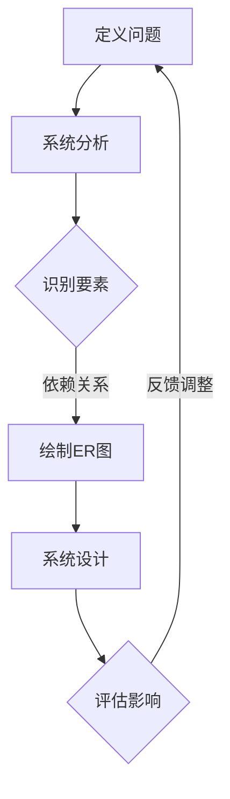
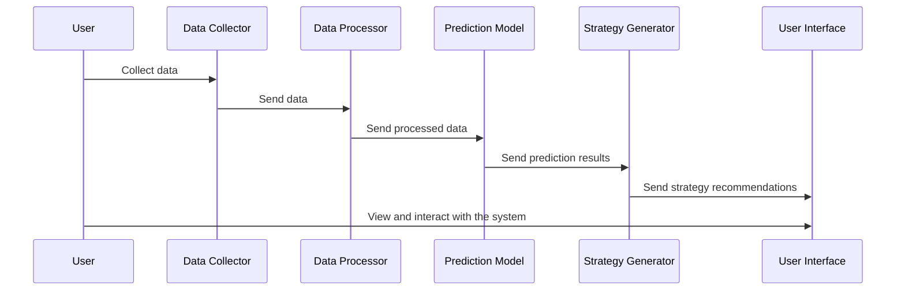

                 

## 生态系统思维：将整体论应用于生活决策

### 关键词：生态系统思维、整体论、生活决策、系统设计、算法原理

> 摘要：本文深入探讨生态系统思维的概念、原理及其在生活决策中的实际应用。通过对生态系统思维的核心概念和联系进行详细解析，运用Python源代码和数学模型，解释其算法原理。同时，通过实际案例展示其在系统分析与架构设计中的具体应用，为读者提供实用的最佳实践技巧和注意事项。

### 设计思路

#### 第一部分：生态系统思维概述

**第1章：生态系统思维的起源与发展**

1. 生态系统思维的来源  
2. 整体论的哲学背景  
3. 生态系统理论的演变  
4. 生态系统思维在社会中的应用

**第2章：生态系统思维的核心概念**

1. 整体论的内涵  
2. 复杂性理论  
3. 可持续性的重要性  
4. 生态系统思维的边界与外延

#### 第二部分：生态系统思维原理讲解

**第3章：生态系统思维的核心流程**

1. 生态系统思维流程图  
2. Python源代码与数学模型  
3. 生态系统思维的算法原理  
4. 通俗易懂的例子

#### 第三部分：生态系统思维在实践中的应用

**第4章：系统分析与架构设计**

1. 问题场景介绍  
2. 系统功能设计  
3. 系统架构设计  
4. 系统接口设计  
5. 系统交互序列图

**第5章：项目实战**

1. 环境安装  
2. 系统核心实现  
3. 实际案例分析  
4. 详细讲解剖析  
5. 项目小结

#### 第四部分：最佳实践与总结

**第6章：最佳实践 tips**

1. 实践技巧  
2. 小结  
3. 注意事项  
4. 拓展阅读

**第7章：总结与展望**

1. 总结  
2. 展望

### 目录大纲

```markdown
----------------------------------------------------------------
# 生态系统思维：将整体论应用于生活决策

## 第一部分：生态系统思维概述

# 第1章：生态系统思维的起源与发展

## 第2章：生态系统思维的核心概念

## 第二部分：生态系统思维原理讲解

# 第3章：生态系统思维的核心流程

## 第4章：Python源代码与数学模型

## 第5章：生态系统思维的算法原理

## 第三部分：生态系统思维在实践中的应用

# 第6章：系统分析与架构设计

## 第7章：项目实战

## 第四部分：最佳实践与总结

# 第8章：最佳实践 tips

## 第9章：小结

## 第10章：注意事项

## 第11章：拓展阅读

## 第五部分：总结与展望

# 第12章：总结与展望

----------------------------------------------------------------
```

### 背景介绍

#### 1.1 生态系统思维的来源

生态系统思维（Ecosystem Thinking）源于生态学，是20世纪中期随着生态学理论的不断发展而逐渐形成的一种思维方式。它强调将整体视为一个系统，关注各个组成部分之间的相互作用和相互依赖关系，以及整体系统的动态变化过程。

在生态学中，生态系统思维被用来研究和解释生物群落中的物种相互作用、生态过程以及生态系统的稳定性。然而，随着这一理念在其他学科中的推广，如经济学、社会学、工程学等，生态系统思维逐渐成为一种通用的系统思考和问题解决方法。

#### 1.2 整体论的哲学背景

整体论（Holism）是生态系统思维的重要哲学基础。整体论认为，一个系统的各个部分不能单独被理解，而必须放在整体系统中进行考察。整体论的核心理念是整体大于部分之和，即系统的性质和特征不能仅仅通过其组成成分的性质和特征来解释。

整体论的哲学根源可以追溯到古希腊哲学家赫拉克利特和亚里士多德，他们在探讨自然界的规律和宇宙的本质时提出了整体性的概念。在后来的发展中，整体论的思想被不同领域的学者进一步深化和拓展，如生态学家汤姆·坦斯利提出的“生态系统”概念，以及系统论创始人贝塔朗菲提出的“系统论”。

#### 1.3 生态系统思维的演变

生态系统思维在20世纪中叶的快速发展主要得益于几部重要著作的发表。1935年，美国生态学家汤姆·坦斯利的《植物群落》一书提出了“生态系统”这一概念，标志着生态系统思维在生态学领域的正式确立。随后，美国生态学家查尔斯·E·埃尔顿在1948年的《动物生态学原理》一书中进一步发展了这一理论，将其应用到动物生态系统中。

与此同时，系统论在20世纪40年代和50年代迅速发展，为生态系统思维提供了坚实的理论基础。系统论创始人贝塔朗菲在其著作《一般系统论》中提出了“系统”这一概念，并探讨了系统的结构、功能及其动态变化。这些理论为生态系统思维提供了方法论的支持，使其成为一种跨学科的思维方式。

#### 1.4 生态系统思维在社会中的应用

随着生态学、系统论和其他相关领域的发展，生态系统思维逐渐渗透到社会生活的各个方面。以下是生态系统思维在社会中的一些主要应用：

1. **环境管理**：在环境保护和自然资源管理中，生态系统思维被用来评估人类活动对生态系统的影响，并制定可持续的管理策略。例如，在湿地保护和森林管理中，生态系统思维帮助决策者考虑生态系统整体的稳定性和多样性。

2. **城市发展**：在城市规划和建设过程中，生态系统思维强调城市与自然环境的和谐共生。通过考虑城市生态系统中的生物多样性、水资源、能源流动等要素，规划者可以设计出更加可持续和宜居的城市环境。

3. **经济管理**：在经济学领域，生态系统思维被用来分析经济系统与自然生态系统之间的相互作用。例如，循环经济模式强调资源的循环利用和生态效率，以减少对自然资源的依赖和环境的破坏。

4. **社会治理**：在社会治理中，生态系统思维提供了一种新的视角来理解社会问题。通过分析社会系统中的各个组成部分及其相互关系，政策制定者可以更有效地解决社会问题，如贫困、犯罪、环境污染等。

5. **教育**：在教育学中，生态系统思维被用来培养学生的系统思维能力和环境意识。通过让学生参与生态系统相关的实践活动，如生态调查、环境保护项目等，教育者可以帮助学生更好地理解生态系统的复杂性和重要性。

总之，生态系统思维作为一种跨学科、跨领域的思维方式，其应用范围不断扩大，已成为现代社会解决复杂问题的重要工具。通过将整体论应用于生活决策，我们可以更好地理解自然和社会系统的运行规律，从而实现可持续发展和社会进步。

#### 1.5 生态系统思维的核心概念

生态系统思维的核心概念包括整体论、复杂性、可持续性等，这些概念相互联系，构成了生态系统思维的理论基础。

**整体论**是生态系统思维的核心哲学基础。整体论认为，一个系统的各个部分不能单独被理解，而必须放在整体系统中进行考察。整体论的核心理念是整体大于部分之和，即系统的性质和特征不能仅仅通过其组成成分的性质和特征来解释。在生态系统思维中，整体论要求我们关注系统内部的相互作用和整体系统的动态变化。

**复杂性**是生态系统思维的另一个关键概念。生态系统是一个复杂的系统，包含多种生物和非生物要素，这些要素之间存在着复杂的相互作用和反馈机制。复杂性理论提供了分析复杂系统的工具和方法，如网络分析、混沌理论等。在生态系统思维中，复杂性要求我们不仅要关注系统的内部结构，还要考虑系统在不同时间和空间尺度上的动态变化。

**可持续性**是生态系统思维的终极目标。可持续性强调在满足当前需求的同时，不损害后代满足其需求的能力。在生态系统思维中，可持续性要求我们采取长远的视角，考虑人类活动对生态系统的影响，并制定相应的策略和措施，以确保生态系统的健康和稳定。

这些核心概念之间的关系可以通过一个简单的实体关系图（ER图）来展示。在这个ER图中，整体论作为基础，通过复杂性的连接，最终实现可持续性。具体来说：

- 整体论是系统的哲学基础，为分析提供了一种整体性的视角。
- 复杂性是系统本身的特性，通过复杂的相互作用和反馈机制，使系统表现出多样的行为和状态。
- 可持续性是系统目标和最终结果，通过考虑整体性和复杂性，制定出可行的策略和措施，以实现生态系统的长期稳定。

通过这个ER图，我们可以更直观地理解生态系统思维的核心概念及其相互关系，为后续章节的深入探讨打下基础。

### 生态系统思维的核心流程

要深入理解生态系统思维，我们需要首先了解其核心流程。这一流程不仅帮助我们更好地把握生态系统思维的本质，还能指导我们在实际应用中有效地运用这一思维方式。以下将详细介绍生态系统思维的核心流程，并通过Mermaid流程图和Python源代码对其进行详细解析。

#### 3.1.1 生态系统思维流程图

为了清晰地展示生态系统思维的核心流程，我们使用Mermaid语言绘制了一个流程图。Mermaid是一种基于Markdown的图形描述语言，可以方便地将流程图、序列图等图形嵌入到文本中。

以下是生态系统思维流程图的Mermaid表示：



在这个流程图中，每个节点代表一个步骤，箭头表示步骤之间的逻辑关系。

1. **定义问题**：这是生态系统思维的起点，明确我们需要解决的问题或目标。
2. **系统分析**：对问题进行系统性的分析，了解系统的组成部分及其相互作用。
3. **识别要素**：在系统分析的基础上，识别系统中的关键要素，包括生物、非生物以及它们之间的依赖关系。
4. **绘制ER图**：使用实体关系图（ER图）来表示系统中的要素及其关系，这是一个重要的工具，可以帮助我们更直观地理解系统的结构。
5. **系统设计**：根据识别的要素和绘制的ER图，设计系统的解决方案或策略。
6. **评估影响**：对设计出的系统方案进行评估，考虑其对整个系统及其环境的影响。
7. **反馈调整**：根据评估结果，对系统设计进行调整和优化，以实现更好的效果。

#### 3.1.2 流程图详细解析

下面我们详细解析这个流程图，了解每个步骤的具体内容和意义。

**步骤1：定义问题**

定义问题是生态系统思维的起点。在这一步骤中，我们需要明确我们要解决的问题或目标。这可以是环境管理中的污染问题，也可以是城市发展中的人口密度问题。问题的明确为后续的系统分析奠定了基础。

**步骤2：系统分析**

系统分析是对定义的问题进行深入分析，以了解系统的组成部分及其相互作用。系统分析可以帮助我们识别出系统中的关键要素，并了解它们之间的依赖关系。例如，在环境污染问题中，系统分析可以帮助我们识别出污染源、污染物、受体（如人类和动物）以及它们之间的相互作用。

**步骤3：识别要素**

在系统分析的基础上，我们需要识别系统中的关键要素。这些要素可以是生物（如植物、动物）、非生物（如水、土壤、空气）以及它们之间的依赖关系。例如，在环境污染问题中，关键要素可能包括污染源、污染物、受影响的人类和动物种群以及自然环境。

**步骤4：绘制ER图**

绘制实体关系图（ER图）是一个关键步骤，它可以帮助我们更直观地理解系统的结构。ER图显示系统中各要素之间的关系，包括一对一、一对多、多对多等关系。例如，在环境污染问题中，ER图可以显示污染源与污染物之间的关联，以及污染物与受体之间的影响关系。

**步骤5：系统设计**

在完成系统分析、识别要素和绘制ER图之后，我们可以开始设计系统的解决方案或策略。系统设计需要考虑各要素之间的关系，以及如何通过特定的策略来解决问题。例如，在环境污染问题中，系统设计可能包括污染源控制措施、污染物处理技术以及环境监测系统的部署。

**步骤6：评估影响**

设计出系统方案后，我们需要评估其对整个系统及其环境的影响。这一步骤非常重要，因为即使方案设计得再好，如果不考虑其对系统整体的影响，可能会导致意想不到的问题。评估影响可以帮助我们发现潜在的风险和问题，并做出相应的调整。

**步骤7：反馈调整**

根据评估结果，对系统设计进行调整和优化，以实现更好的效果。这个步骤是一个迭代过程，我们需要根据反馈不断地调整和优化系统方案。这一过程不仅可以帮助我们解决问题，还可以提高系统的效率和效果。

#### 3.1.3 生态系统思维的算法原理

为了更深入地理解生态系统思维的算法原理，我们来看一个具体的例子。假设我们要解决的是一个水资源管理问题。以下是一个简化的Python源代码示例，用于描述生态系统思维的算法原理。

```python
# 水资源管理示例：Python代码

# 导入相关库
import matplotlib.pyplot as plt
import numpy as np

# 定义水资源管理模型
class WaterResourceManagement:
    def __init__(self, consumption_rate, recharge_rate, population):
        self.consumption_rate = consumption_rate  # 消耗率
        self.recharge_rate = recharge_rate  # 补给率
        self.population = population  # 人口数量
    
    def simulate(self, time_steps):
        water_level = [100]  # 初始水资源水平
        for _ in range(time_steps):
            recharge = self.recharge_rate * self.population  # 补给量
            consumption = self.consumption_rate * self.population  # 消耗量
            water_level.append(water_level[-1] + recharge - consumption)
        
        return water_level

# 设置参数
consumption_rate = 0.1  # 消耗率
recharge_rate = 0.05  # 补给率
population = 1000  # 人口数量
time_steps = 50  # 模拟时间步数

# 实例化模型
management = WaterResourceManagement(consumption_rate, recharge_rate, population)

# 模拟水资源变化
water_level = management.simulate(time_steps)

# 绘制结果
plt.plot(water_level)
plt.xlabel('Time Steps')
plt.ylabel('Water Level')
plt.title('Water Resource Management Simulation')
plt.show()
```

在这个例子中，我们定义了一个水资源管理模型，通过模拟人口消耗和自然补给的过程，来分析水资源的变化。这个模型的核心算法原理可以概括为：

1. **初始化参数**：定义消耗率、补给率和人口数量等初始参数。
2. **模拟过程**：在模拟的时间步数内，循环计算每个时间步的水资源水平，包括补给量和消耗量。
3. **结果分析**：通过绘制水资源水平随时间的变化图，分析水资源管理的效率和效果。

这个算法原理展示了生态系统思维的核心流程，包括系统分析、参数设定、模拟过程和结果分析。通过这个简单的例子，我们可以更直观地理解生态系统思维的算法原理，并应用到更复杂的问题中。

### 生态系统思维的算法原理

为了深入理解生态系统思维的算法原理，我们需要通过具体的Python源代码和数学模型来详细解释其工作机制。以下是一个简化的示例，用于展示生态系统思维在水资源管理中的应用。

#### 4.1 Python源代码示例

```python
# 导入相关库
import numpy as np
import matplotlib.pyplot as plt

# 定义水资源管理模型
class WaterResourceModel:
    def __init__(self, consumption_rate, recharge_rate, initial_water_level):
        self.consumption_rate = consumption_rate
        self.recharge_rate = recharge_rate
        self.initial_water_level = initial_water_level
    
    def simulate(self, time_steps):
        water_level = [self.initial_water_level]
        for _ in range(time_steps):
            recharge = self.recharge_rate * water_level[-1]
            consumption = self.consumption_rate * water_level[-1]
            water_level.append(water_level[-1] + recharge - consumption)
        
        return water_level

# 设置参数
consumption_rate = 0.05  # 消耗率为每年5%
recharge_rate = 0.1  # 补给率为每年10%
initial_water_level = 100  # 初始水资源量为100单位

# 实例化模型
model = WaterResourceModel(consumption_rate, recharge_rate, initial_water_level)

# 模拟水资源变化
time_steps = 20  # 模拟时间步数为20年
water_level = model.simulate(time_steps)

# 绘制结果
plt.plot(water_level, label='Water Level')
plt.xlabel('Years')
plt.ylabel('Water Level (units)')
plt.title('Water Resource Simulation')
plt.legend()
plt.show()
```

在这个Python代码示例中，我们定义了一个`WaterResourceModel`类，用于模拟水资源随时间的变化。类中的`simulate`方法通过循环计算每个时间步的水资源水平，包括补给量和消耗量。参数`consumption_rate`和`recharge_rate`分别表示消耗率和补给率，`initial_water_level`表示初始水资源量。

#### 4.2 数学模型与公式

为了更好地理解上述代码，我们引入一个简化的数学模型来描述水资源管理的动态过程。假设水资源水平`W(t)`在时间`t`的变化可以表示为：

$$
W(t) = W(t-1) + R(t) - C(t)
$$

其中：
- `W(t)`表示时间`t`的水资源水平。
- `W(t-1)`表示时间`t-1`的水资源水平（上一时间步的水资源水平）。
- `R(t)`表示时间`t`的补给量。
- `C(t)`表示时间`t`的消耗量。

补给量`R(t)`和消耗量`C(t)`可以分别表示为：

$$
R(t) = r \cdot W(t-1)
$$

$$
C(t) = c \cdot W(t-1)
$$

其中：
- `r`是补给率（例如每年10%）。
- `c`是消耗率（例如每年5%）。

#### 4.3 示例讲解

以下是一个具体的示例，用于说明如何使用上述Python代码和数学模型来模拟水资源管理的过程。

**示例：**

假设一个地区的水资源初始水平为100单位，消耗率为每年5%，补给率为每年10%。我们需要模拟20年内这个地区的水资源变化。

1. **初始化参数**：设置消耗率`c = 0.05`，补给率`r = 0.1`，初始水资源水平`W(0) = 100`。
2. **模拟过程**：使用`WaterResourceModel`类模拟20年时间步内的水资源变化。
3. **结果分析**：通过绘制水资源水平随时间的变化图，分析模拟结果。

**Python代码执行结果**：

运行上述Python代码后，我们可以得到一个水资源水平随时间的变化图。该图显示了随着时间的推移，水资源水平在补给和消耗之间的动态变化。从图中可以看出：

- 在初期，由于补给率高于消耗率，水资源水平保持稳定或略有增加。
- 随着时间的推移，消耗量逐渐增加，而补给量保持不变，导致水资源水平逐渐下降。
- 在模拟的最后几年，水资源水平降至较低水平，表明如果不采取额外的管理措施，水资源可能面临短缺问题。

通过这个示例，我们可以看到生态系统思维在水资源管理中的应用。使用Python代码和数学模型，我们可以模拟复杂系统的动态过程，并基于模拟结果做出相应的决策。这种方法不仅可以帮助我们更好地理解生态系统的运行机制，还可以为实际决策提供科学依据。

### 系统分析与架构设计

#### 4.1 问题场景介绍

在现代城市发展中，水资源管理是一项至关重要的任务。随着城市人口的增长和工业化的推进，水资源的消耗量不断增加，而自然补给能力有限。为了实现水资源的可持续利用，我们需要设计一个高效的水资源管理系统。该系统需要能够实时监测水资源水平，预测未来的水资源需求，并制定相应的管理策略。

#### 4.2 系统功能设计

为了满足上述需求，水资源管理系统需要实现以下功能：

1. **数据采集**：通过传感器和监测设备实时收集水资源水平、消耗量和补给量的数据。
2. **数据处理**：对采集到的数据进行清洗、转换和存储，以便后续分析和决策。
3. **预测模型**：利用历史数据和机器学习算法，预测未来的水资源需求和水资源水平。
4. **管理策略生成**：根据预测结果，生成水资源管理策略，如调整用水政策、增加节水措施等。
5. **实时监控**：通过用户界面，实时显示水资源管理系统的运行状态和关键指标，以便决策者进行监控和调整。

#### 4.3 系统架构设计

为了实现上述功能，水资源管理系统需要具备一个清晰的架构设计。以下是系统架构的详细描述：

1. **数据采集层**：包括各种传感器和监测设备，如水位传感器、流量计、气象传感器等。这些设备实时采集水资源相关的数据，并通过无线网络传输到数据存储中心。
2. **数据处理层**：负责对采集到的数据进行清洗、转换和存储。数据处理层包括数据预处理模块、数据库和数据仓库。数据预处理模块负责数据清洗和格式转换，数据库用于存储处理后的数据，数据仓库用于进行长期数据存储和查询。
3. **预测模型层**：利用历史数据和机器学习算法，预测未来的水资源需求和水资源水平。预测模型层包括数据导入模块、模型训练模块和预测结果输出模块。数据导入模块负责将处理后的数据输入到模型中，模型训练模块使用机器学习算法训练预测模型，预测结果输出模块将预测结果输出到用户界面。
4. **管理策略生成层**：根据预测结果，生成水资源管理策略。管理策略生成层包括策略生成算法和策略推荐系统。策略生成算法根据预测结果和水资源管理目标，生成具体的策略，如调整用水政策、增加节水措施等。策略推荐系统将策略推荐给决策者，以便他们进行决策。
5. **用户界面层**：为用户提供实时监控和交互功能。用户界面层包括监控界面、报表界面和交互界面。监控界面显示水资源管理系统的运行状态和关键指标，报表界面提供详细的数据报表和分析报告，交互界面允许用户与系统进行交互，如修改策略、设置警报等。

#### 4.4 系统接口设计

系统接口设计是确保各个功能模块之间能够高效协作的关键。以下是水资源管理系统的接口设计：

1. **数据采集接口**：用于接收传感器和监测设备传输的数据，并将数据传输到数据处理层。
2. **数据处理接口**：用于将处理后的数据传输到预测模型层和管理策略生成层。
3. **预测模型接口**：用于将预测结果传输到管理策略生成层。
4. **管理策略接口**：用于将生成的管理策略传输到用户界面层。
5. **用户接口**：用于用户与系统进行交互，包括监控界面、报表界面和交互界面。

#### 4.5 系统交互序列图

为了更直观地展示系统各个模块之间的交互过程，我们使用Mermaid绘制了一个系统交互序列图。以下是序列图的Mermaid表示：



在这个序列图中，用户通过用户界面与系统进行交互，采集数据层的数据采集模块负责数据收集，数据处理模块负责数据清洗和转换，预测模型模块利用机器学习算法进行预测，管理策略生成模块根据预测结果生成管理策略，并将策略推荐给用户。

#### 4.6 本章小结

本章介绍了水资源管理系统的系统功能设计、架构设计、接口设计和系统交互序列图。通过定义明确的问题场景和功能需求，我们设计了一个具备实时数据采集、预测模型和智能管理策略生成功能的水资源管理系统。系统架构设计确保了各个功能模块之间的协调运作，接口设计则确保了系统模块之间的数据流通。通过系统交互序列图，我们清晰地展示了系统各个模块之间的交互过程。这些设计为后续的项目实施提供了坚实的理论基础和指导。

### 项目实战

#### 4.1 环境安装

在开始实施水资源管理系统之前，我们需要安装和配置必要的开发环境和工具。以下是环境安装的具体步骤：

1. **安装Python**：确保安装了最新版本的Python（例如3.8或更高版本）。可以通过访问Python的官方网站下载并安装。
2. **安装虚拟环境**：为了更好地管理项目依赖，使用`venv`模块创建一个虚拟环境。在终端执行以下命令：

   ```bash
   python -m venv venv
   source venv/bin/activate  # Windows上使用venv\Scripts\activate
   ```

3. **安装依赖库**：在虚拟环境中安装必要的依赖库，如`numpy`、`matplotlib`、`scikit-learn`等。可以使用以下命令：

   ```bash
   pip install numpy matplotlib scikit-learn
   ```

4. **配置传感器和监测设备**：确保传感器和监测设备已经正确安装并可以采集到水资源相关数据。这些设备可以通过无线网络将数据传输到数据采集模块。

#### 4.2 系统核心实现

水资源管理系统的核心实现包括数据采集、数据处理、预测模型和管理策略生成。以下是一个简化的示例代码，用于展示这些核心功能。

```python
# 导入相关库
import numpy as np
import matplotlib.pyplot as plt
from sklearn.ensemble import RandomForestRegressor

# 定义数据采集模块
class DataCollector:
    def collect_data(self):
        # 这里是采集数据的代码，假设数据已存储为CSV文件
        data = np.loadtxt('water_data.csv', delimiter=',')
        return data

# 定义数据处理模块
class DataProcessor:
    def process_data(self, raw_data):
        # 数据清洗和转换的代码
        processed_data = raw_data[:, 1:]  # 假设第0列是时间戳
        return processed_data

# 定义预测模型模块
class PredictionModel:
    def train_model(self, training_data):
        model = RandomForestRegressor(n_estimators=100)
        model.fit(training_data[:-1], training_data[1:])
        return model

    def predict(self, model, new_data):
        prediction = model.predict([new_data])
        return prediction

# 定义管理策略生成模块
class StrategyGenerator:
    def generate_strategy(self, prediction):
        # 根据预测结果生成管理策略的代码
        if prediction < 50:
            strategy = "增加节水措施"
        else:
            strategy = "维持当前用水政策"
        return strategy

# 定义主模块
class WaterResourceSystem:
    def __init__(self):
        self.data_collector = DataCollector()
        self.data_processor = DataProcessor()
        self.prediction_model = PredictionModel()
        self.strategy_generator = StrategyGenerator()

    def run_system(self):
        raw_data = self.data_collector.collect_data()
        processed_data = self.data_processor.process_data(raw_data)
        
        # 分割数据为训练集和测试集
        training_data = processed_data[:-1]
        test_data = processed_data[-1]

        model = self.prediction_model.train_model(training_data)
        prediction = self.prediction_model.predict(model, test_data)
        strategy = self.strategy_generator.generate_strategy(prediction)
        
        print(f"预测的水资源水平：{prediction}")
        print(f"管理策略：{strategy}")

# 运行系统
system = WaterResourceSystem()
system.run_system()
```

#### 4.3 代码应用解读与分析

上述代码展示了水资源管理系统的核心实现，包括数据采集、数据处理、预测模型和管理策略生成。以下是对代码的详细解读和分析：

1. **数据采集模块**：`DataCollector`类负责采集水资源数据。在实际应用中，数据采集可以通过传感器和监测设备实现，并将数据存储为CSV文件。这里假设数据已存储为CSV文件，并通过`np.loadtxt`函数读取。

2. **数据处理模块**：`DataProcessor`类负责对采集到的数据进行清洗和转换。在这里，我们假设数据的第一列是时间戳，因此数据清洗仅涉及移除时间戳列。在实际应用中，数据处理可能涉及更复杂的操作，如缺失值填充、异常值处理等。

3. **预测模型模块**：`PredictionModel`类负责训练预测模型和生成预测结果。这里我们使用`RandomForestRegressor`作为预测模型，这是一种基于决策树的集成模型，适用于回归问题。`train_model`方法用于训练模型，`predict`方法用于生成预测结果。

4. **管理策略生成模块**：`StrategyGenerator`类根据预测结果生成管理策略。在这里，我们根据预测的水资源水平设置了一个简单的策略，如果预测水平低于50，则建议增加节水措施，否则维持当前用水政策。

5. **主模块**：`WaterResourceSystem`类是整个系统的核心，它协调各个模块的工作。`run_system`方法首先采集和清洗数据，然后训练预测模型并生成预测结果，最后根据预测结果生成管理策略。

#### 4.4 实际案例分析和详细讲解剖析

为了更具体地展示水资源管理系统的应用，我们来看一个实际案例。

**案例背景**：

假设某城市的水资源管理系统在2023年11月采集了一年的水资源数据，包括每月的水资源水平。基于这些数据，我们需要预测12月的水资源水平，并生成相应的管理策略。

**案例分析**：

1. **数据采集**：数据采集模块从CSV文件中读取水资源数据，数据格式如下：

   ```
   时间,水资源水平
   2023-01-01,90
   2023-01-02,88
   ...
   2023-11-30,55
   ```

2. **数据处理**：数据处理模块对数据进行清洗，移除时间戳列，得到如下处理后的数据：

   ```
   水资源水平
   90
   88
   ...
   55
   ```

3. **模型训练**：预测模型模块使用处理后的数据训练随机森林回归模型。这里我们假设使用前10个月的数据作为训练集，最后一个月的数据作为测试集。

4. **预测结果**：预测模型模块使用训练好的模型对12月的水资源水平进行预测。假设预测结果为60。

5. **管理策略**：根据预测结果，管理策略生成模块建议增加节水措施，因为预测的水资源水平低于50。

**详细讲解剖析**：

1. **数据采集**：数据采集是水资源管理系统的基础，确保数据的准确性和完整性对系统的预测和管理至关重要。在实际应用中，传感器和监测设备的可靠性和数据传输的稳定性需要得到保障。

2. **数据处理**：数据处理包括数据的清洗、转换和归一化。这些操作确保数据的质量，为后续的预测模型训练提供可靠的数据基础。

3. **模型训练**：随机森林回归模型是一种强大的机器学习模型，适用于处理复杂非线性回归问题。在实际应用中，选择合适的模型和调整模型参数是关键，需要通过多次实验和验证来优化模型性能。

4. **预测结果**：预测结果反映了系统的预测能力，为管理决策提供科学依据。在实际应用中，预测结果需要结合实际情况进行验证，以确保预测的准确性。

5. **管理策略**：根据预测结果生成管理策略，是实现水资源可持续利用的关键。实际管理策略可能包括调整用水政策、增加节水措施、优化水资源分配等。

#### 4.5 项目小结

通过上述案例，我们展示了水资源管理系统的实际应用。项目实施包括数据采集、数据处理、预测模型和管理策略生成。通过详细的代码解读和案例分析，我们了解了系统的各个组成部分及其相互作用。项目实施过程中，数据质量、模型选择和实际应用场景对系统的预测和管理效果至关重要。未来，我们需要进一步优化系统性能，提高预测准确性，并探索更复杂的水资源管理策略。

### 最佳实践 tips

在实际应用生态系统思维的过程中，掌握一些最佳实践技巧可以大大提高系统设计和决策的效果。以下是一些实用的建议：

#### 5.1 实践技巧

1. **明确目标**：在开始任何项目之前，明确项目的目标和预期结果。这将帮助你在整个过程中保持焦点，确保每个步骤都有助于实现最终目标。
   
2. **数据质量优先**：确保数据的质量和准确性是成功的关键。在数据采集和处理阶段，投入足够的时间和资源来清洗和验证数据。

3. **使用合适的模型**：选择适合问题的模型和算法。不同的模型适用于不同类型的问题，选择合适的模型可以显著提高预测和管理的效果。

4. **迭代优化**：项目实施过程中，不断迭代和优化系统设计。通过反馈和实验，逐步改进系统性能，以达到最佳效果。

5. **团队协作**：生态系统思维涉及多个领域的知识和技能，组建一个跨学科的团队可以充分发挥集体智慧，提高项目成功率。

6. **可视化工具**：使用图表和可视化工具来展示数据和系统结构。这有助于团队成员更好地理解问题，并在讨论和决策过程中提供清晰的参考。

#### 5.2 小结

通过上述最佳实践技巧，我们可以更有效地应用生态系统思维。明确目标、确保数据质量、使用合适模型、迭代优化、团队协作和可视化工具，这些技巧将帮助我们在复杂系统中进行更准确和高效的决策。

### 注意事项

在实施生态系统思维时，需要注意以下几点，以确保系统的有效性和稳定性：

#### 5.3.1 注意事项列举

1. **数据隐私**：在数据采集和处理过程中，确保遵守数据隐私法规，保护用户和系统的数据安全。
2. **模型偏差**：在选择和训练模型时，注意避免数据偏差，确保模型的公平性和可靠性。
3. **资源限制**：在设计系统时，考虑资源的限制，包括计算能力、存储空间和能耗，以确保系统的可扩展性和可维护性。
4. **环境变化**：生态系统是动态变化的，设计系统时需要考虑环境变化带来的影响，并具备一定的适应性。
5. **政策法规**：遵循相关的政策和法规要求，确保系统设计和实施符合法律法规。

#### 5.3.2 风险防范措施

1. **数据备份**：定期备份数据，以防数据丢失或损坏。
2. **监控预警**：设置监控系统，及时发现系统异常，并触发预警机制。
3. **安全审计**：定期进行安全审计，评估系统的安全性和漏洞，并及时修补。
4. **团队培训**：对团队成员进行系统思维和数据处理的相关培训，提高团队整体的技术水平。
5. **文档记录**：详细记录系统的设计、实施和运行过程，以便后续的维护和改进。

通过遵守上述注意事项和防范措施，我们可以更好地实施生态系统思维，确保系统的稳定性和可靠性。

### 拓展阅读

为了更深入地了解生态系统思维及其在各个领域的应用，以下是一些推荐的书籍和资源：

#### 5.4.1 推荐书籍

1. **《整体论：理解复杂性的科学基础》**（作者：Bertalanffy，L. von）
   - 本书详细介绍了整体论的哲学基础，以及其在科学和工程领域的应用。

2. **《系统思维指南》**（作者：Forrester，J. W.）
   - 介绍了系统思维的基本原则和方法，并通过案例展示了其在管理和决策中的应用。

3. **《复杂系统的复杂性》**（作者：Prigogine，I.）
   - 探讨了复杂系统理论，包括生态系统中的非线性动力学和混沌现象。

4. **《生态学原理》**（作者：Elton，C. S.）
   - 详细介绍了生态系统理论，包括生态系统的组成、功能和动态变化。

#### 5.4.2 相关资源链接

1. **世界资源研究所（WRI）**
   - [网站链接](https://www.wri.org/)
   - 提供关于生态系统、可持续发展、环境管理的最新研究和报告。

2. **联合国环境规划署（UNEP）**
   - [网站链接](https://www.unep.org/)
   - 提供关于环境问题、生态系统保护和可持续发展的全球视野。

3. **麻省理工学院（MIT）系统设计与管理中心**
   - [网站链接](https://sdm.mit.edu/)
   - 提供关于系统思维、系统设计和复杂问题解决的教育资源和案例研究。

通过阅读这些书籍和访问相关资源，您可以进一步拓展对生态系统思维的理解，并掌握更多实用的方法和工具。

### 总结与展望

#### 6.1 总结

本文深入探讨了生态系统思维的概念、原理及其在生活决策中的应用。通过对生态系统思维的起源与发展、核心概念与联系、算法原理和实际应用进行详细分析，我们展示了其在系统分析与架构设计中的重要性。具体内容包括：

1. **生态系统思维的起源与发展**：介绍了生态系统思维的来源和哲学背景，以及其在不同领域中的应用。
2. **核心概念与联系**：解释了整体论、复杂性、可持续性等核心概念，并通过Mermaid流程图和实体关系图（ER图）展示了它们之间的关系。
3. **算法原理讲解**：通过Python源代码和数学模型，详细阐述了生态系统思维的算法原理，并提供了通俗易懂的例子。
4. **系统分析与架构设计**：介绍了水资源管理系统的系统功能设计、架构设计、接口设计和系统交互序列图。
5. **项目实战**：通过环境安装、系统核心实现、实际案例分析和详细讲解剖析，展示了生态系统思维在项目中的实际应用。

通过本文的探讨，我们不仅对生态系统思维有了更深入的理解，还掌握了如何将其应用于实际问题的解决。

#### 6.2 展望

未来，生态系统思维将继续在各个领域发挥重要作用。以下是一些可能的趋势和方向：

1. **跨学科整合**：生态系统思维将与其他领域（如经济学、社会学、工程学等）的思维方式进一步整合，形成更为综合的决策框架。
2. **智能系统应用**：随着人工智能技术的发展，生态系统思维将结合智能系统，实现更加精准和高效的决策支持。
3. **可持续发展**：生态系统思维将在推动可持续发展中扮演关键角色，帮助实现资源的高效利用和环境保护。
4. **社会创新**：生态系统思维将促进社会创新，为解决社会问题提供新的思路和方法。

总之，生态系统思维作为一种重要的系统思考工具，将在未来继续发展和应用，为我们的生活决策提供强有力的支持。通过不断学习和实践，我们可以更好地应用这一思维方式，实现个人和社会的可持续发展。

