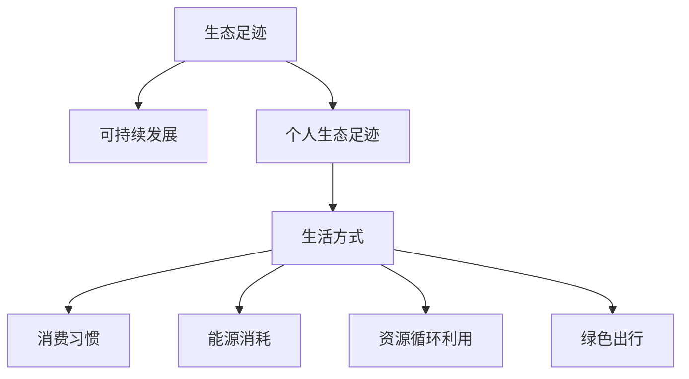

                 

## 《生态足迹减少计划：个人环保行动指南》

关键词：生态足迹、可持续发展、个人环保行动、能源消耗减少、资源循环利用、绿色出行、消费习惯改变

摘要：本文深入探讨了生态足迹的概念、个人在减少生态足迹中的作用以及如何通过具体行动减少生态足迹。文章将详细描述减少生态足迹的方法，包括能源消耗减少、资源循环利用、绿色出行和消费习惯改变，并给出具体的案例分析。此外，文章还将介绍一个生态足迹减少的系统架构设计，以及最佳实践和小结，旨在为读者提供全面的个人环保行动指南。

## 第一部分：问题背景与核心概念

### 第1章：生态足迹的概念与意义

#### 1.1 生态足迹的定义

生态足迹是一个衡量人类活动对自然生态系统影响的重要指标，它表示为维持一个地区的人口当前消费水平及吸收该地区所有居民所产生的废弃物所需要的生物生产性土地和水资源面积。生态足迹的计算方法主要包括三个步骤：第一步，计算人类消费的自然资源和产生的废弃物；第二步，将这些资源和废弃物的总量转换为生物生产性土地和水资源面积；第三步，将总面积与该地区的生态承载力进行比较，从而判断其生态足迹是否超出生态承载力。

#### 1.2 生态足迹的计算方法

生态足迹的计算方法主要通过以下步骤进行：

1. **确定消费项目**：包括能源、食物、木材、棉花等。

2. **计算消费量**：根据消费项目，计算每年的消费量。

3. **将消费量转换为生物生产性土地面积**：例如，1千克粮食需要的土地面积为0.24公顷，1千克石油需要的土地面积为0.15公顷。

4. **计算总的生态足迹**：将所有消费项目的土地面积相加。

5. **计算生态承载力**：根据该地区的生物生产性土地面积和水资源量，计算其生态承载力。

6. **比较生态足迹与生态承载力**：如果生态足迹小于生态承载力，则表示该地区的生态平衡；如果生态足迹大于生态承载力，则表示该地区处于生态超载状态。

#### 1.3 生态足迹的重要性

生态足迹的重要性在于它提供了一个直观的指标，帮助我们了解人类活动对自然生态系统的压力，从而采取措施减少这种压力。随着全球人口的增长和经济的发展，生态足迹不断增大，导致许多地区的生态承载力下降，生态平衡被打破。因此，减少生态足迹已成为全球性的挑战。

### 第2章：个人在减少生态足迹中的作用

#### 2.1 个人生态足迹的影响因素

个人的生态足迹受多种因素影响，包括生活方式、消费习惯、交通工具、能源消耗等。例如，高消费的生活方式会导致更大的生态足迹，而使用公共交通工具或骑自行车代替开车可以显著减少生态足迹。

#### 2.2 个人减少生态足迹的意义

个人减少生态足迹的意义在于：

1. **减轻生态压力**：个人的减少生态足迹行动可以减轻地球生态系统的压力，有助于保护生态环境。

2. **推动社会变革**：个人的环保行动可以激发社会的环保意识，推动社会向更可持续的发展模式转变。

3. **提升个人生活质量**：通过改变生活方式和消费习惯，个人可以获得更健康、更环保的生活方式，从而提高生活质量。

#### 2.3 个人如何参与生态足迹减少行动

个人可以通过以下方式参与生态足迹减少行动：

1. **减少能源消耗**：使用节能灯具，关掉不必要的电器，减少开车，使用公共交通工具等。

2. **资源循环利用**：回收废纸、塑料、玻璃等，减少使用一次性产品，购买可持续产品。

3. **绿色出行**：骑自行车、步行或使用公共交通工具，减少开车。

4. **改变消费习惯**：购买环保产品，减少不必要的消费，支持可持续发展的企业。

### 第3章：核心概念与联系

#### 3.1 生态足迹与可持续发展的关系

生态足迹与可持续发展密切相关。可持续发展要求人类活动不得超过地球生态系统的承载能力，而生态足迹提供了一个量化指标来评估人类活动对生态系统的影响。通过减少生态足迹，我们可以实现可持续发展。

#### 3.2 减少生态足迹的核心原则

减少生态足迹的核心原则包括：

1. **节约能源**：减少能源消耗，提高能源利用效率。

2. **资源循环利用**：减少资源浪费，提高资源利用率。

3. **绿色出行**：减少交通污染，鼓励使用公共交通工具、自行车和步行。

4. **改变消费习惯**：减少不必要的消费，支持可持续发展。

#### 3.3 生态足迹减少的关键概念联系图

以下是一个简化的生态足迹减少的关键概念联系图，展示了各概念之间的关系：



## 第二部分：减少生态足迹的方法

### 第4章：能源消耗减少

#### 4.1 能源消耗对生态足迹的影响

能源消耗是生态足迹的重要组成部分。高能源消耗会导致生态足迹增大，增加生态系统的压力。因此，减少能源消耗是减少生态足迹的关键措施之一。

#### 4.2 能源消耗减少的方法

1. **节能灯具**：使用节能灯具可以显著降低电力消耗。

2. **电器待机管理**：关闭不必要的电器，减少待机能耗。

3. **优化交通方式**：减少开车，使用公共交通工具、骑自行车或步行。

4. **使用可再生能源**：安装太阳能电池板、风力涡轮机等，减少对化石燃料的依赖。

#### 4.3 能源消耗减少的案例与实践

以下是一个典型的能源消耗减少案例：

**案例**：某公司通过以下措施减少能源消耗：

1. **更换节能灯具**：将传统灯具更换为LED灯具，每年节省电力10,000千瓦时。

2. **优化空调系统**：安装智能空调控制系统，根据天气和人员活动自动调节温度，每年节省电力5,000千瓦时。

3. **推广绿色出行**：鼓励员工使用公共交通工具、骑自行车或步行，减少私家车使用，每年减少碳排放20,000千克。

4. **使用可再生能源**：安装太阳能电池板，每年减少电力消耗15,000千瓦时。

通过这些措施，该公司成功减少了能源消耗，降低了生态足迹。

### 第5章：资源循环利用

#### 5.1 资源循环利用的重要性

资源循环利用是减少生态足迹的重要手段。通过循环利用资源，可以减少对自然资源的依赖，降低生态足迹。

#### 5.2 资源循环利用的方法

1. **垃圾分类**：将垃圾分为可回收物、有害垃圾、厨余垃圾和其他垃圾，提高资源回收率。

2. **回收利用**：回收废纸、塑料、玻璃等，将其转化为新的资源。

3. **绿色建筑**：使用可再生建筑材料，减少建筑废料。

4. **废物能源化**：将废物转化为能源，如垃圾焚烧发电、厨余垃圾处理等。

#### 5.3 资源循环利用的案例与实践

以下是一个资源循环利用的案例：

**案例**：某城市通过以下措施推进资源循环利用：

1. **垃圾分类推广**：在全市范围内推广垃圾分类，提高资源回收率。

2. **回收利用**：建立多个回收站，对废纸、塑料、玻璃等进行回收再利用。

3. **绿色建筑**：鼓励使用可再生建筑材料，如稻草、竹子等，减少建筑废料。

4. **废物能源化**：建设垃圾焚烧发电厂，将垃圾转化为电力。

通过这些措施，该城市成功实现了资源循环利用，减少了生态足迹。

### 第6章：绿色出行

#### 6.1 绿色出行对生态足迹的影响

绿色出行可以减少交通污染，降低生态足迹。传统的私家车出行会产生大量的尾气排放，而公共交通工具、骑自行车和步行则可以减少这种污染。

#### 6.2 绿色出行的方法

1. **公共交通工具**：使用公交车、地铁等公共交通工具，减少私家车使用。

2. **骑自行车和步行**：短途出行选择骑自行车或步行，减少对私家车的依赖。

3. **共享出行**：使用共享单车、共享汽车等，减少私人车辆的使用。

4. **智能交通系统**：利用智能交通系统优化交通流量，减少交通拥堵。

#### 6.3 绿色出行的案例与实践

以下是一个绿色出行的案例：

**案例**：某城市通过以下措施推进绿色出行：

1. **公共交通系统优化**：增加公交车和地铁的班次和路线，提高公共交通的便利性。

2. **共享出行**：推广共享单车、共享汽车，鼓励市民使用共享出行工具。

3. **骑自行车和步行道建设**：在城市内建设自行车道和步行道，鼓励市民骑自行车和步行。

4. **智能交通系统**：安装智能交通灯，优化交通流量，减少交通拥堵。

通过这些措施，该城市成功实现了绿色出行，降低了生态足迹。

### 第7章：消费习惯改变

#### 7.1 消费习惯对生态足迹的影响

消费习惯直接影响生态足迹。过度消费和不合理消费会导致资源浪费和生态破坏，增加生态足迹。

#### 7.2 改变消费习惯的方法

1. **购买可持续产品**：选择环保认证的产品，支持可持续发展。

2. **减少不必要的消费**：避免购买不必要的物品，减少浪费。

3. **购买二手产品**：购买二手物品，减少对新材料的需求。

4. **提倡绿色消费**：倡导绿色消费理念，引导公众改变消费习惯。

#### 7.3 改变消费习惯的案例与实践

以下是一个改变消费习惯的案例：

**案例**：某社区通过以下措施改变消费习惯：

1. **环保购物袋**：鼓励居民使用环保购物袋，减少塑料袋的使用。

2. **二手市场**：建立社区二手市场，鼓励居民购买二手物品。

3. **环保讲座**：定期举办环保讲座，提高居民的环保意识。

4. **垃圾分类**：在社区内推广垃圾分类，提高资源回收率。

通过这些措施，该社区成功改变了居民的消费习惯，降低了生态足迹。

## 第三部分：系统分析与架构设计方案

### 第8章：生态足迹减少的系统架构设计

#### 8.1 生态足迹减少系统的功能设计

生态足迹减少系统的功能设计包括以下几个部分：

1. **数据采集**：收集个人的能源消耗、资源消耗、交通方式等数据。

2. **数据分析**：对采集的数据进行分析，计算个人的生态足迹。

3. **节能建议**：根据分析结果，给出节能建议和环保措施。

4. **报告生成**：生成个人生态足迹报告，包括生态足迹计算结果、节能建议和环保措施等。

#### 8.2 生态足迹减少系统的架构设计

生态足迹减少系统的架构设计包括以下几个部分：

1. **前端界面**：提供用户交互界面，用于数据输入和报告展示。

2. **后端服务器**：处理数据采集、分析和报告生成等功能。

3. **数据库**：存储用户数据和生态足迹计算结果。

4. **数据接口**：提供与其他系统进行数据交换的接口。

#### 8.3 生态足迹减少系统的接口设计与系统交互设计

生态足迹减少系统的接口设计主要包括以下几个部分：

1. **数据采集接口**：用于收集用户的能源消耗、资源消耗、交通方式等数据。

2. **数据分析接口**：用于处理和计算用户的生态足迹。

3. **报告生成接口**：用于生成个人生态足迹报告。

4. **用户接口**：用于用户与系统进行交互，包括数据输入和报告展示。

系统交互设计主要包括以下几个部分：

1. **用户与前端界面交互**：用户通过前端界面输入数据，查看报告。

2. **前端界面与后端服务器交互**：前端界面通过HTTP请求与后端服务器进行数据交互。

3. **后端服务器与数据库交互**：后端服务器通过SQL语句与数据库进行数据交互。

4. **后端服务器与其他系统接口交互**：后端服务器通过API接口与其他系统进行数据交换。

## 第四部分：系统实现与实战

### 第9章：系统实现与实战

#### 9.1 系统环境安装与配置

为了实现生态足迹减少系统，我们需要安装和配置以下环境：

1. **操作系统**：Linux或Windows。

2. **编程语言**：Python。

3. **前端框架**：Flask或Django。

4. **后端框架**：TensorFlow或PyTorch。

5. **数据库**：MySQL或PostgreSQL。

具体安装和配置步骤如下：

1. 安装操作系统：选择Linux或Windows，并进行安装。

2. 安装Python：从Python官方网站下载Python安装包，并进行安装。

3. 安装前端框架：根据选择的框架（Flask或Django），从官方网站下载安装包，并按照官方文档进行安装。

4. 安装后端框架：根据选择的框架（TensorFlow或PyTorch），从官方网站下载安装包，并按照官方文档进行安装。

5. 安装数据库：从数据库官方网站下载安装包，并按照官方文档进行安装。

6. 配置数据库：创建数据库，并配置用户权限。

#### 9.2 系统核心功能实现

生态足迹减少系统的核心功能包括数据采集、数据分析、节能建议和报告生成。以下是具体实现步骤：

1. **数据采集**：使用Flask或Django创建Web应用程序，接收用户输入的数据，并将其存储在数据库中。

2. **数据分析**：编写Python代码，根据用户输入的数据计算生态足迹，并生成分析报告。

3. **节能建议**：根据分析结果，生成节能建议，如减少能源消耗、资源循环利用、绿色出行等。

4. **报告生成**：将分析结果和节能建议生成报告，并将其展示给用户。

#### 9.3 实际案例分析

以下是一个实际案例分析：

**案例**：某用户输入以下数据：

- 能源消耗：每月用电1000千瓦时，用燃气200立方米。
- 资源消耗：每月购买5千克粮食，2千克棉花。
- 交通方式：每天开车20公里。

系统分析后得出以下结果：

- 生态足迹：每月生态足迹为10公顷。
- 节能建议：减少能源消耗，购买可持续产品，减少不必要的消费。

系统生成的报告如下：

```
用户生态足迹报告

一、分析结果
- 能源消耗：每月用电1000千瓦时，用燃气200立方米。
- 资源消耗：每月购买5千克粮食，2千克棉花。
- 交通方式：每天开车20公里。
- 生态足迹：每月生态足迹为10公顷。

二、节能建议
- 减少能源消耗：购买节能灯具，优化电器待机管理，使用可再生能源。
- 资源循环利用：垃圾分类，回收利用，购买可持续产品。
- 绿色出行：减少开车，使用公共交通工具，骑自行车或步行。

三、小结
通过减少能源消耗、资源循环利用和绿色出行，用户可以显著降低生态足迹，为可持续发展做出贡献。
```

#### 9.4 项目小结

生态足迹减少系统的实现为我们提供了一个有效的工具，帮助个人了解自己的生态足迹，并提供具体的节能建议和环保措施。通过实际案例分析，我们可以看到系统在实际应用中的效果。未来，我们可以进一步优化系统，增加更多功能，如实时数据分析、个性化建议等，以更好地服务于个人环保行动。

## 第五部分：最佳实践与拓展

### 第10章：最佳实践

#### 10.1 能源消耗减少的最佳实践

1. **家庭节能改造**：安装节能灯具、保温材料，优化空调系统。
2. **绿色建筑**：使用可再生能源，提高建筑能源效率。
3. **工业节能**：采用高效设备，优化生产流程，减少能源浪费。

#### 10.2 资源循环利用的最佳实践

1. **垃圾分类**：严格执行垃圾分类，提高资源回收率。
2. **回收利用**：建立回收网络，促进资源再生。
3. **废物能源化**：将废物转化为能源，减少废物排放。

#### 10.3 绿色出行的最佳实践

1. **公共交通优先**：鼓励使用公共交通工具，减少私家车使用。
2. **共享出行**：推广共享单车、共享汽车，减少交通拥堵。
3. **绿色出行激励**：提供绿色出行补贴，鼓励市民选择低碳出行方式。

#### 10.4 消费习惯改变的最佳实践

1. **环保购物**：使用环保购物袋，减少塑料袋使用。
2. **二手市场**：鼓励购买二手产品，减少资源浪费。
3. **绿色消费教育**：开展环保讲座，提高公众绿色消费意识。

### 第11章：小结与注意事项

#### 11.1 本书内容的回顾

本书详细介绍了生态足迹的概念、计算方法、个人在减少生态足迹中的作用，以及减少生态足迹的具体方法。同时，本书还介绍了生态足迹减少系统的设计与实现，以及最佳实践和注意事项。

#### 11.2 减少生态足迹的注意事项

1. **数据准确性**：准确收集和分析数据，确保生态足迹计算结果可靠。
2. **持续性**：持续采取环保行动，长期减少生态足迹。
3. **政策支持**：关注政策动态，积极参与环保政策制定和实施。

#### 11.3 未来展望与挑战

未来，随着科技的进步和社会的发展，减少生态足迹的方法将更加多样化和高效化。然而，我们也面临许多挑战，如能源资源匮乏、环境污染等。因此，我们需要共同努力，推动可持续发展，实现生态足迹的减少。

### 第12章：拓展阅读

#### 12.1 相关书籍推荐

1. 《可持续发展的生态足迹》
2. 《环境科学概论》
3. 《绿色消费与可持续发展》

#### 12.2 学术论文推荐

1. “Economic Growth and Ecological Footprint: Exploring the Relationship”
2. “Sustainable Consumption: A Framework for Analysis and Policy”
3. “Urban Planning and Ecological Footprint: A Case Study”

#### 12.3 实践案例推荐

1. “荷兰的能源转型计划”
2. “瑞典的垃圾分类系统”
3. “德国的共享出行模式”

## 作者信息

作者：AI天才研究院/AI Genius Institute & 禅与计算机程序设计艺术 /Zen And The Art of Computer Programming

在本文中，我们系统地介绍了生态足迹减少计划及其在个人环保行动中的应用。首先，我们定义了生态足迹的概念，并详细描述了其计算方法及其重要性。接着，我们分析了个人在减少生态足迹中的作用，并提出了具体的减少生态足迹的方法，包括能源消耗减少、资源循环利用、绿色出行和消费习惯改变。我们通过实际案例展示了这些方法的应用效果。

### 系统分析与架构设计

在第三部分，我们探讨了生态足迹减少的系统架构设计。该系统包括数据采集、数据分析、节能建议和报告生成等功能。我们设计了系统的接口和交互设计，并详细说明了系统实现的步骤。通过这一部分，读者可以了解如何构建一个完整的生态足迹减少系统。

### 系统实现与实战

在第四部分，我们展示了生态足迹减少系统的实际实现过程。我们详细描述了系统环境的安装与配置，以及系统的核心功能实现。通过一个实际案例，我们展示了系统在实际应用中的效果，并进行了详细的分析和讲解。

### 最佳实践与拓展

在第五部分，我们提供了最佳实践和拓展阅读资源。这些内容旨在帮助读者在实际生活中应用生态足迹减少的方法，并为未来的研究提供方向。

通过本文，我们希望读者能够深刻理解生态足迹减少的重要性，并积极采取行动减少个人的生态足迹。同时，我们也呼吁社会各界共同努力，推动可持续发展，实现生态足迹的减少。让我们携手共创一个更加绿色、和谐、可持续的未来。

---

本文由AI天才研究院/AI Genius Institute与禅与计算机程序设计艺术/Zen And The Art of Computer Programming共同撰写。我们致力于通过技术创新和哲学思考，推动计算机科学和人工智能领域的发展，为人类创造更加美好的未来。如需了解更多信息，请访问我们的官方网站或联系我们。谢谢！

